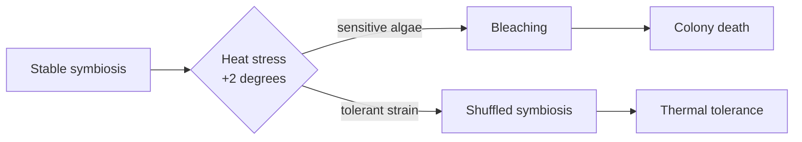

# Example decks

> Complete files. Copy the starter; read the other four for range.

The starter returns zero findings from the checker. **The four real decks do not** —
each carries three to seven suggestions. That is the checker working, not the decks
failing: a clean run is not the bar, and our own shipped decks prove it.

## Starter — copy this one

```markdown
---
marp: true
theme: cuoio
paginate: true
---

<!-- _class: title silent -->

# Move billing to the new platform in March

`Finance Systems · Board review`

One migration window replaces four years of manual reconciliation.

---

<!-- _class: agenda -->

## What this deck covers.

1. What the current system costs us
2. What the migration buys
3. What it costs, and when
4. What we need from you

---

<!-- _class: big-number -->

`Cost of the status quo`

- $4.1M
  - spent every year reconciling invoices by hand, up from $2.6M in 2023.

---

<!-- _class: cards-grid -->

## Three failures repeat every quarter.

- Late close
  - Books close nine days after month end, against a four-day target.
- Manual matching
  - Sixty percent of invoices need a person to match them.
- No audit trail
  - Adjustments are recorded in spreadsheets that sit outside the ledger.

---

<!-- _class: kpi -->

## The pilot beat every target it was set.

1. 4 days
   - Time to close
   - from 9 days `On plan`
2. 12%
   - Invoices matched by hand
   - from 60% `On plan`
3. $0.9M
   - Annual run cost
   - from $4.1M `On plan`

---

<!-- _class: quote -->

> We stopped arguing about whose number was right and started closing on time.

— Dana Whitfield, Controller, pilot business unit

---

<!-- _class: compare-table -->

## March costs less and carries less risk than June.

| Criterion | March window | June window |
| --- | --- | --- |
| Cutover risk | Quarter-end freeze, no parallel run | Overlaps the external audit |
| Staffing cost | $1.4M | $1.1M |
| Earliest benefit | Q2 close | Q4 close |

---

<!-- _class: decision -->

## We recommend the March window.

- Migrate in March
  - The quarter-end freeze gives a clean cutover and returns the benefit two quarters sooner.
- Migrate in June
  - Cheaper to staff, but it overlaps the audit and doubles the cutover risk.

---

<!-- _class: list-steps -->

## Four steps take us from freeze to retirement.

1. Freeze new integrations — two weeks before cutover, changes stop.
2. Rehearse the cutover — a full dry run against production data.
3. Cut over at quarter end — three days, with finance on standby.
4. Retire the old ledger — read-only for a year, then archived.

---

<!-- _class: closing silent -->

## Approve the March window and the $1.4M migration budget.

`The ask`

<!-- markdownlint-disable MD033 -->
<script src="mermaid-v11.min.js"></script>
<script src="lattice-dagre.min.js"></script>
<script src="lattice-runtime.min.js"></script>

```

## investor pitch — 18 slides

A startup raising a round — the arc from problem to ask.

```markdown
---
marp: true
size: 4k
theme: cuoio
paginate: true
header: "Saffron · Series B"
---

<!-- _class: title silent -->
<!-- tier: short -->

`Series B · raising $32M`

# Saffron

Autonomous accounts payable for mid-market manufacturers.

---

<!-- _class: content -->
<!-- tier: short -->

## Saffron runs accounts payable on its own — so finance teams stop chasing paper.

Saffron is autonomous accounts payable for mid-market manufacturers. We ingest every invoice, match it, decide it, and pay it — turning a back-office cost center into software that runs in the background.

---

<!-- _class: content -->
<!-- tier: standard -->

## Mid-market manufacturers still run accounts payable by hand.

A $200M manufacturer processes 40,000 invoices a year across email, EDI, and paper. Clerks key them in, chase approvals, and reconcile by spreadsheet — slow, error-prone, impossible to scale.

- Late-payment penalties and missed early-pay discounts add up to six figures a year.
- Manual matching is where most invoice fraud slips through.

---

<!-- _class: big-number -->
<!-- tier: short -->

`The cost of manual AP`

- 18 minutes
  - to process a single invoice by hand — at 40,000 invoices a year, that is a full-time team doing nothing else.

---

<!-- _class: content -->
<!-- tier: standard -->

## Two shifts just made autonomous AP inevitable.

E-invoicing mandates are going live across the EU and US, forcing structured invoice data for the first time. At the same moment, document AI finally crossed the accuracy bar accounts payable demands.

- Mandates create the clean, structured data autonomy needs.
- AI crossed 99% line-level extraction accuracy in 2025.

---

<!-- _class: content -->
<!-- tier: short -->

## One platform takes accounts payable from inbox to paid — untouched.

Saffron connects to the ERP a manufacturer already runs, learns its approval policy, and closes 91% of invoices with no human in the loop. The AP team manages exceptions, not data entry.

---

<!-- _class: cards-grid -->
<!-- tier: full -->

## Four steps, no inbox: how Saffron closes an invoice on its own.

- Ingest
  - Captures invoices from email, EDI, and portals — any format, no templates to build.
- Match
  - Reconciles each line against the PO and receipt, surfacing only the true exceptions.
- Decide
  - Approves in-policy invoices and routes the rest to the right owner automatically.
- Pay
  - Schedules payment to capture early-pay discounts and avoid late penalties.

---

<!-- _class: stats -->
<!-- tier: standard -->

`Impact · Customers in production`

## What an average customer sees in the first year.

`Measured across 140 live manufacturers, first 12 months on Saffron.`

1. 91%
   - invoices touchless
2. 12,000
   - AP hours saved / yr
3. $480K
   - early-pay discounts captured
4. −62%
   - late-payment penalties

---

<!-- _class: big-number -->
<!-- tier: standard -->

`$18B market · growing 12% a year`

- 250,000
  - mid-market manufacturers across the US and EU still run accounts payable by hand.

---

<!-- _class: kpi compact -->
<!-- tier: short -->

## Revenue tripled in a year as customers expanded fast.

1. $6.4M
   - ARR
   - up from $2.1M `3.0× YoY` `Audited`
2. 140
   - manufacturers live
   - +96 in 12 months `Net new`
3. 128%
   - net revenue retention
   - expansion outruns churn `12-mo`

---

<!-- _class: quote -->
<!-- tier: standard -->

> We cut invoice processing time by 80% and moved two full-time clerks to higher-value work. Saffron paid for itself in the first quarter.

— Controller, Atlas Precision Components

---

<!-- _class: matrix-2x2 -->
<!-- tier: full -->

## Saffron is the only autonomous option built for the mid-market.

- **Manual · Enterprise-only.**
  - Generic ERP modules
- **Manual · Mid-market fit.**
  - Spreadsheets and bank portals
- **Autonomous · Enterprise-only.**
  - Legacy AP suites — six-month implementations
- **Autonomous · Mid-market fit.**
  - Saffron

---

<!-- _class: stats -->
<!-- tier: full -->

`Unit economics · FY2026`

## The model compounds: high margin, fast payback, expanding accounts.

1. 82%
   - gross margin
2. 14 mo
   - CAC payback
3. 128%
   - net revenue retention
4. 6:1
   - LTV : CAC

---

<!-- _class: roadmap -->
<!-- tier: short -->

`The raise · 24-month plan`

## What the Series B builds, by workstream.

| Workstream | Now `H2 2026` | Build `2027` | Scale `2028` |
| --- | --- | --- | --- |
| Product | [x] Touchless AP | [-] Autonomous spend controls | [ ] Cash-flow forecasting |
| Go-to-market | [x] US direct | [-] ERP marketplace | [ ] EU expansion |
| Data network | [x] 140 customers | [-] Supplier graph | [ ] Benchmarking product |

---

<!-- _class: actors -->
<!-- tier: standard -->

## A team that has built and sold AP automation before.

- Founder & CEO `Maya Okonkwo`
  - Built the AP platform at a top-three procurement suite and scaled it to $90M ARR.
- Founder & CTO `Daniel Reyes`
  - Led document AI at a fintech unicorn; nine patents in invoice extraction.
- VP Sales `Priya Nair`
  - Took two vertical-SaaS companies from $5M to $50M ARR.

---

<!-- _class: kpi compact -->
<!-- tier: full -->

## A clear path from $6.4M to $25M ARR in 24 months.

1. $25M
   - ARR target
   - 3.9× from today `FY2028`
2. 450
   - manufacturers
   - up from 140 `FY2028`
3. 85%
   - gross margin
   - +3pp at scale `FY2028`

---

<!-- _class: decision -->
<!-- tier: short -->

## We are raising $32M to make autonomous AP the default for the mid-market.

- Raise a $32M Series B
  - 24 months of runway to $25M ARR and clear category leadership.
- Stay lean, grow organically
  - Cedes the e-invoicing-mandate window to better-funded incumbents.

---

<!-- _class: closing -->
<!-- _paginate: false -->
<!-- _header: '' -->
<!-- _footer: '' -->
<!-- tier: short -->

## Let's make autonomous AP the default.

`Maya Okonkwo · maya@saffron.example · saffron.example`

<!-- markdownlint-disable MD033 -->
<script src="mermaid-v11.min.js"></script>
<script src="lattice-dagre.min.js"></script>
<script src="lattice-runtime.min.js"></script>

```

## lecture — 13 slides

A university lecture — teaching material, not a pitch.

````markdown
---
marp: true
size: 4k
theme: cuoio
paginate: true
header: "Coral thermal adaptation · Lecture"
---

<!-- _class: title silent -->
<!-- tier: short -->

`BIOL 312 · Lecture 9 · Marine Adaptation`

# How corals survive a warming ocean

The cellular biology of thermal tolerance — and why some reefs are beating the heat.

---

<!-- _class: agenda -->
<!-- tier: short -->

## Where we are going in the next fifty minutes.

1. The puzzle — reefs that should be dead, but aren't
2. The mechanism — symbiosis under heat stress
3. The evidence — the Lizard Shoal transplant study
4. The frontier — what we still cannot explain

---

<!-- _class: content -->
<!-- tier: short -->

## A reef that bleached in 2016 came back greener than its neighbors.

Most of the central Coral Sea bleached when temperatures held 2 degrees above the summer mean for six weeks. Yet one shoal recovered in eighteen months while reefs forty kilometres away never did. That gap is today's question.

---

<!-- _class: content -->
<!-- tier: standard -->

## The textbook says corals cannot adapt this fast — the textbook is incomplete.

Reef-building corals are slow: a colony may take a decade to mature and centuries to build structure. Classical adaptation across that timescale cannot track a climate shifting in years. Something faster is doing the work.

- Generation time is far too long for selection alone to explain.
- The recovery happened within a single coral generation.

---

<!-- _class: content -->
<!-- tier: short -->

## The coral is not one organism — it is a partnership under negotiation.

Every coral hosts millions of single-celled algae, *Symbiodinium*, that photosynthesise inside its tissue and feed it. Heat ruptures that partnership: the algae turn toxic, the coral expels them, and the white skeleton shows through. That is bleaching.

---

<!-- _class: diagram -->
<!-- tier: short -->

## Heat tips a stable partnership into collapse — or into a swap.



---

<!-- _class: content -->
<!-- tier: standard -->

## The survivors did not evolve — they switched partners.

The recovered shoal hosted a different algal clade, *Durusdinium trenchii*, which tolerates heat the common *Cladocopium* strains cannot. The coral genome barely changed. The symbiont community did. Adaptation happened at the level of the partnership, not the host.

---

<!-- _class: stats -->
<!-- tier: standard -->

`Lizard Shoal transplant · 2016–2019`

## What the symbiont swap bought, measured against unswapped controls.

`Reciprocal transplant, n = 240 colonies, three reef sites, 36-month follow-up.`

1. +1.5°C
   - bleaching threshold raised
2. 84%
   - survival vs 31% control
3. 18 mo
   - to full recovery
4. −22%
   - growth rate trade-off

---

<!-- _class: content -->
<!-- tier: standard -->

## Tolerance is not free — the fast algae feed the coral less.

Colonies hosting the heat-tolerant clade grew 22% slower in normal years. The partnership that survives a heatwave is a worse provider the rest of the time. This is the central tension of thermal tolerance: resilience bought with growth.

---

<!-- _class: list-criteria -->
<!-- tier: short -->

## What a coral needs to survive the next marine heatwave.

1. A tolerant symbiont in reach
   - The heat-adapted algal clade must already be present in the local water column.
2. Flexible host physiology
   - The coral must be able to host more than one symbiont strain — not all species can.
3. A recovery window
   - Temperatures must fall back below threshold long enough to rebuild tissue.
4. Larval connectivity
   - Tolerant recruits must reach the reef to reseed what heat killed.

---

<!-- _class: content -->
<!-- tier: full -->

## Symbiont shuffling is real, but it is not a universal escape hatch.

Only about a quarter of reef-building genera can host multiple clades. For the rest, the partnership is fixed at settlement and cannot be renegotiated when the water warms. The flexible species may inherit the reef.

- Branching *Acropora* shuffle readily; massive *Porites* far less.
- A reef's future may hinge on which genera dominate it today.

---

<!-- _class: content -->
<!-- tier: full -->

## The frontier: can we seed tolerance before the heat arrives?

Assisted evolution trials are now inoculating coral larvae with heat-tolerant clades in the lab, then settling them on degraded reefs. Early results are promising and ethically fraught — we would be engineering the partnership that nature negotiates.

- First field outplants reached the central reef in 2025.
- Whether the tolerance persists across generations is unknown.

---

<!-- _class: closing -->
<!-- _paginate: false -->
<!-- _header: '' -->
<!-- _footer: '' -->
<!-- tier: short -->

## The coral that survives changes its partner, not its genes.

`Next lecture · larval dispersal and reef connectivity`

<!-- markdownlint-disable MD033 -->
<script src="mermaid-v11.min.js"></script>
<script src="lattice-dagre.min.js"></script>
<script src="lattice-runtime.min.js"></script>

````

## budget proposal — 13 slides

A public-sector budget request to a council.

```markdown
---
marp: true
size: 4k
theme: cuoio
paginate: true
header: "Dept. of Transit · FY28 Budget Proposal"
---

<!-- _class: title silent -->
<!-- tier: short -->

`Appropriations hearing · FY2028`

# Transit State-of-Good-Repair

A $214M capital request to clear the backlog that is driving service failures across the regional rail network.

---

<!-- _class: big-number -->
<!-- tier: short -->

`The repair backlog`

- $1.4B
  - of deferred state-of-good-repair work has accumulated across track, signals, and rolling stock since FY2019.

---

<!-- _class: content -->
<!-- tier: standard -->

## The backlog is now driving the delays riders feel every morning.

Mean-distance-between-failures has fallen 38% in four years. Signal faults and slow-orders — direct symptoms of deferred repair — now cause two of every three weekday delays on the network.

---

<!-- _class: list-tabular -->
<!-- tier: short -->

## Where the $214M request goes, by asset class.

1. Signal modernisation `$86M`
   - Replaces 14 interlockings past their 40-year design life — the largest single source of faults.
2. Track & structures `$61M`
   - Eliminates 22 slow-orders and rehabilitates four at-risk bridges.
3. Rolling stock overhaul `$48M`
   - Mid-life overhaul of 90 rail cars, extending service life 15 years.
4. Power & substations `$19M`
   - Replaces three substations operating beyond capacity at peak.

---

<!-- _class: kpi compact -->
<!-- tier: short -->

## Projected FY28–FY30 returns in reliability and cost avoidance.

1. +52%
   - Mean distance between failures
   - target +40% by FY30 `On plan`
2. −31%
   - Weekday delay minutes
   - signal and track fixes `On plan`
3. $96M
   - Avoided emergency repair
   - over three years `On plan`

---

<!-- _class: stats -->
<!-- tier: standard -->

`Context · The cost of waiting`

## Every year of deferral makes the backlog more expensive to clear.

`Modeled escalation on the current backlog at observed degradation and inflation rates.`

1. +14%
   - annual backlog growth
2. $1.4B
   - backlog today
3. $1.8B
   - backlog by FY30 if unfunded
4. 3.2×
   - emergency vs planned repair cost

---

<!-- _class: list-tabular -->
<!-- tier: standard -->

## How the request is funded across three sources.

1. State capital appropriation `$128M`
   - The amount this hearing is being asked to authorise.
2. Federal formula match `$64M`
   - Drawn at the 2:1 rate the state request unlocks.
3. Farebox capital reserve `$22M`
   - From the dedicated reserve, already accrued.
4. Total program `$214M`
   - Fully funded if the state share is approved.

---

<!-- _class: content -->
<!-- tier: full -->

## The federal match is the reason to fund this cycle, not next.

The $64M federal formula match expires at the close of FY2028. A state appropriation now draws it down at 2:1; a one-year delay forfeits the match and raises the state's share of the same work by an estimated $58M.

---

<!-- _class: kpi compact -->
<!-- tier: full -->

## The network through FY30 without this appropriation.

1. −22%
   - Reliability
   - continued degradation `At risk`
2. $1.8B
   - Backlog
   - +$400M vs today `At risk`
3. $0
   - Federal match captured
   - window closes FY28 `At risk`

---

<!-- _class: matrix-2x2 -->
<!-- tier: standard -->

## Where each funding scenario sits on cost against service risk.

- **High cost · Low risk.**
  - Full backlog clearance in one cycle
- **High cost · High risk.**
  - Emergency-only spending, no planning
- **Low cost · High risk.**
  - Defer the request another year
- **Low cost · Low risk.**
  - $214M phased request with federal match

---

<!-- _class: list-criteria -->
<!-- tier: full -->

## The criteria the capital plan was built to meet.

1. Targets the failure drivers
   - Spend must address the assets actually causing delays, not lowest-hanging cost.
2. Captures available match
   - Must draw down federal dollars before the formula window closes.
3. Bounded annual ask
   - State share must stay within the capital-budget growth cap.
4. Measurable reliability gain
   - Each dollar must map to a projected reliability or cost-avoidance outcome.

---

<!-- _class: decision -->
<!-- tier: short -->

## Approve the $128M state share to unlock the full $214M repair program.

- Approve the state share
  - Captures the expiring federal match and reverses four years of reliability decline.
- Why not defer a year
  - Forfeits $64M in match and adds $58M to the state's eventual cost.
- Why not emergency-only
  - Spends 3.2× more per fix and never clears the backlog.

---

<!-- _class: closing -->
<!-- _paginate: false -->
<!-- _header: '' -->
<!-- _footer: '' -->
<!-- tier: short -->

## Fund the repair now, or pay for the failure later.

`Dept. of Transit · budget.transit.gov.example`

<!-- markdownlint-disable MD033 -->
<script src="mermaid-v11.min.js"></script>
<script src="lattice-dagre.min.js"></script>
<script src="lattice-runtime.min.js"></script>

```

## board meeting — 17 slides

A nonprofit board pack — governance, not persuasion.

```markdown
---
marp: true
size: 4k
theme: cuoio
paginate: true
header: "Open Door Shelter · Board meeting"
---

<!-- _class: title silent -->
<!-- tier: short -->

`Board meeting · Q2 2026`

# Open Door Shelter

We ran near capacity all quarter — and the board must decide on a second building today.

---

<!-- _class: agenda -->
<!-- tier: short -->

## What this board meeting covers.

1. Where we stand — programs and finance
2. Demand and outcomes this quarter
3. The strategic plan
4. Decision — the second shelter
5. Governance and next steps

---

<!-- _class: content -->
<!-- tier: short -->

## We hit our outcomes and held our reserve — and turn-aways are now forcing the board's hand.

Bottom line up front: occupancy held at 95% and 73% of guests moved into housing, with 5.2 months of reserve intact. But we turned away 210 people this quarter, and a second building is available on Elm Street now.

- A strong, clean quarter — outcomes on plan, finances audited and stable.
- One time-boxed decision: lease the Elm Street building now, or wait for the campaign.

---

<!-- _class: kpi -->
<!-- tier: short -->

`Where we stand · Q2 2026`

## Programs ran near capacity and finances stayed on plan.

1. 142
   - Nightly beds filled
   - capacity 150 · 95% `On plan` `Board`
2. 73%
   - Guests placed in housing
   - target 70% `On plan` `Programs`
3. $2.1M
   - Operating reserve
   - 5.2 months runway `On plan` `Finance`

---

<!-- _class: stats -->
<!-- tier: short -->

`Demand · Q2 2026`

## Demand outran our 150 beds for most of the quarter.

`Counts cover April through June; turn-aways are unique individuals, not nightly repeats.`

1. 12,940
   - nights of shelter
2. 95%
   - average occupancy
3. 73%
   - placed in housing
4. 210
   - people turned away

---

<!-- _class: content -->
<!-- tier: standard -->

## At 95% occupancy, we are out of room — and the people we turn away have nowhere else.

A shelter running this full has no slack for a cold snap or a family arriving at midnight. The 210 we could not take are not a forecast; they are this quarter's count, and most were referred onward to no open bed.

- On 41 nights we ran a waitlist; on 9 we placed guests in overflow motels at our cost.
- Cedar Falls has 150 emergency beds total — all of them ours.

---

<!-- _class: big-number -->
<!-- tier: standard -->

`The gap we are carrying`

- 210
  - people we turned away this quarter — most referred onward to a bed that did not exist.

---

<!-- _class: quote -->
<!-- tier: standard -->

> They had no bed, but someone sat with me, made the calls, and found me a couch for the night. That call kept me going.

— Renata D., guest referred during an April waitlist

---

<!-- _class: content -->
<!-- tier: full -->

## Outcomes held because placement, not just shelter, is the job we measure.

Beds keep people safe tonight; placements end the crisis. We held 73% housing placement — three points above target — by pairing every bed with a caseworker and a landlord network, even while running full.

- Median stay fell to 38 nights, down from 44 a year ago.
- Nine in ten placed guests were still housed at the six-month follow-up.

---

<!-- _class: stats -->
<!-- tier: full -->

`Where the money goes · Q2 2026`

## Eighty-eight cents of every dollar reaches a bed or a placement.

`Quarterly expenses of $1.05M against $1.12M in revenue; the surplus rebuilds reserve.`

1. 88%
   - to programs
2. 8%
   - to fundraising
3. 4%
   - to administration
4. $81
   - cost per bed-night

---

<!-- _class: roadmap -->
<!-- tier: short -->

`Strategic plan · 2026–2028`

## Where the organization grows over three years.

| Workstream | Now `2026` | Build `2027` | Scale `2028` |
| --- | --- | --- | --- |
| Shelter beds | [x] 150 | [-] 280 | [ ] 320 |
| Housing placements | [x] 73% | [-] 80% | [ ] 85% |
| Reserve months | [x] 5.2 | [-] 6.0 | [ ] 6.5 |
| Caseworkers | [x] 6 | [-] 11 | [ ] 13 |

---

<!-- _class: kpi -->
<!-- tier: full -->

`The plan · 2027`

## A second building takes us from 150 beds to 280 without diluting outcomes.

1. 280
   - Beds at full build
   - up from 150 `+87%` `Build`
2. 80%
   - Placement target held
   - quality kept at scale `Target` `Programs`
3. 6.0
   - Reserve months
   - rebuilt post-lease `On plan` `Finance`

---

<!-- _class: content -->
<!-- tier: full -->

## The Elm Street building is the only path to 280 beds this decade.

A vacant 130-bed care facility on Elm Street is available on a five-year lease at $340K a year. It is two blocks from our caseworker offices, zoned for shelter use, and ready for guests within 90 days of signing.

- No comparable site exists in Cedar Falls; the next opening is years out.
- The lease holds rent flat for five years, well below new-build cost.

---

<!-- _class: content -->
<!-- tier: full -->

## Leasing now spends $410K of reserve in year one — and our model funds the rest.

Year-one cost is $340K lease plus $70K fit-out. A committed three-year county contract covers 60% of operating cost; a launched capital campaign covers the balance. Even at half the projected occupancy, the lease breaks even in year two.

- Reserve dips to 3.8 months at signing, then rebuilds to 6.0 by end of 2027.
- Waiting one year cedes the site and the county contract window.

---

<!-- _class: checklist -->
<!-- tier: full -->

## Governance and compliance items for this decision.

- [x] FY2025 audit filed clean `Compliant`
- [x] Lease reviewed by counsel `Compliant`
- [x] County contract terms confirmed `Compliant`
- [-] Capital-campaign quiet phase underway `60% of goal`
- [ ] Board vote on the Elm Street lease `today`
- [/] New-build feasibility study `deferred`

---

<!-- _class: decision -->
<!-- tier: short -->

## We recommend leasing the second shelter now.

- Lease the Elm Street building
  - Adds 130 beds within 90 days, locks rent flat, and secures the county contract window.
- Wait for the capital campaign
  - Cedes the only viable site and a year of beds; turn-aways continue at today's pace.

---

<!-- _class: closing -->
<!-- _paginate: false -->
<!-- _header: '' -->
<!-- _footer: '' -->
<!-- tier: short -->

## No open bed should mean no door — let's open the second one.

`Marcus Hale · Executive Director · board@opendoorshelter.example`

<!-- markdownlint-disable MD033 -->
<script src="mermaid-v11.min.js"></script>
<script src="lattice-dagre.min.js"></script>
<script src="lattice-runtime.min.js"></script>

```
