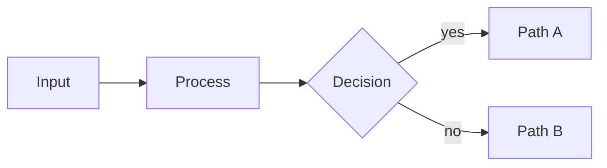

# Lattice layouts — imagery, diagram, math, code


> Visuals that carry meaning, graphs, equations, source code.


**Contents:** `image` · `scene` · `video` · `diagram` · `math` · `code` · `compare-code`


## image

> Image as the slide's anchor, with optional text alongside — composition adapts to the asset and the deck.

**Function** imagery · **Form** canvas · **Substance** prose

**Tags** `visual` · `showcase` · `pitch`

Use when a visual carries meaning on its own. You hand it any rectangle; the layout reads the asset's aspect at build time and, with the deck orientation, RESOLVES the composition for you — no modifier needed. The default is `clean` (a floated card shaped to the photo, ≈ zero crop); extreme aspects auto-pick `split` (shown whole) or `spotlight` (full-bleed cover). Name a composition to override: `clean` · `split` · `spotlight` · `gallery` (contain-on-matte, for diagrams) · `statement` (full-bleed + scrim + title). `mirror` flips the image side. Legacy `full`/`contain`/`museum` still work (→ spotlight/gallery/gallery).

### Agent contract

#### Slots

| Slot | Selector | Required | Description |
|---|---|---|---|
| `image` | `.lattice-bg` | yes | Marp background image syntax: `` or `` — rendered as a CSS background-image on the `.lattice-bg` panel (no ``). |
| `heading` | `h2` | no | Optional heading in the text slot. |
| `body` | `p` | no | Optional caption or body text. |

#### Variant decision rule

- **`clean`.** The photo has a moderate, unremarkable aspect — the safe default; leave the class off and let the resolver land here for near-zero crop.
- **`split`.** The photo has an extreme aspect — a tall portrait or a full panorama — and must be shown whole, uncropped, in its own column or band.
- **`spotlight`.** The photo already matches the canvas's own aspect and can carry the whole slide full-bleed, with a solid text card guaranteeing legibility over it.
- **`gallery`.** The asset is a diagram or screenshot where whitespace and containment are the point — mats it whole on a matte with a placard, zero crop.
- **`statement`.** You want an editorial scrim-and-title hero treatment — a deliberate full-bleed gamble rather than the safe legible default.
- **`mirror`.** The composition is right but the deck's rhythm wants the image on the left instead of the right — flips the side without changing the composition.

#### Common mistakes

- **Writing plain image syntax `` instead of Marp background syntax ``.** The `image` slot renders the asset as a CSS background on `.lattice-bg` (no ``) — without `bg` in the alt text the picture never becomes the section's background, and no composition can resolve around it.
- **Naming a composition class (`image spotlight`, `image gallery`, …) reflexively instead of leaving it unset.** The composition RESOLVES from the photo's own aspect ratio plus the deck orientation — an explicit class always wins over the resolver, so naming one out of habit can force a crop (e.g. `spotlight`'s full-bleed cover) that the auto-picked `clean`/`split` composition would have avoided.

### When to use

- **The visual carries meaning.** Product screenshots, architectural photographs, plots, satellite imagery — anywhere the image makes the argument and the prose is annotation. If the visual is decorative, drop it and use `content` instead.
- **Let the layout resolve it — override only with intent.** Drop in any aspect and the layout reads it: a moderate photo gets the `clean` floated card, a tall/wide one gets `split` (shown whole), a canvas-matching one gets `spotlight` (full-bleed). Override only when you mean it: `image gallery` to contain a diagram zero-crop, `image statement` for a scrim-and-title hero, `image spotlight` to force a full-bleed cover (accepting the crop).
- **Caption earns its line.** If the prose alongside the image just describes what the image shows, drop it — the audience can see the picture. The text slot is for the so-what: what the audience should take away from the visual.

### When NOT to use

- **Decorative stock photo.** A generic photograph of 'people in a meeting' next to a content slide is filler. Use `content` and trust the prose; reserve image for visuals that argue for themselves.
- **Image too small to read.** A diagram or screenshot small enough to fit inside a half-canvas text slot is unreadable from the back of the room. Reach for `image gallery` (contains it whole) or `image spotlight`, or move the diagram to its own `diagram` slide.
- **Image with five paragraphs of caption.** If the prose dominates and the image is a sidebar, you have a `content` slide that happens to have a photo. Either trust the image (drop the prose) or trust the prose (drop the image).

### Authoring

```markdown
<!-- _class: image -->

## Text leads; the image earns its place.

Swap the bg image below for your own asset — any aspect. The layout reads its shape and resolves the composition for you (a floated card, a full-height column, a full-bleed cover). Name a composition (`image spotlight`, `image gallery`, …) only to override.


```

### Anatomy

```text
┌─────────────────────────────────────────┐
│  header                                 │
│                                         │
│  Text slot on     ┌──────────────────┐  │
│  the left, with   │                  │  │
│  optional         │   [image area]   │  │
│  caption.         │                  │  │
│                   └──────────────────┘  │
│                                         │
│  footer                           1/19  │
└─────────────────────────────────────────┘
```

### Variants (component-specific)

#### `clean` — clean

Drops the caption chrome.

```markdown
<!-- _class: image clean -->

## clean drops the caption chrome.

Two-thirds of trials that reach the first generated report convert; the ones that stall almost never do.


```

#### `split` — split

A portrait gets its full column.

```markdown
<!-- _class: image split -->

## split gives a portrait its full column.

A portrait photo wants its full height. We give it a column and let the argument run alongside.


```

#### `spotlight` — spotlight

A panorama owns the frame.

```markdown
<!-- _class: image spotlight -->

## spotlight lets a panorama own the frame.

When the photo already matches the canvas, let it carry the slide — the message rides in a solid card so it never fights the image.


```

#### `gallery` — gallery

The exhibit on a matte with a placard.

```markdown
<!-- _class: image gallery -->

## gallery mats the exhibit with a placard.

The whole asset on a matte with a placard. For diagrams and screenshots where the whitespace is the point.


```

#### `statement` — statement

The title rides the photo on a scrim.

```markdown
<!-- _class: image statement -->

## statement rides the title on a scrim.

The title rides the photo on a scrim — a deliberate, editorial choice.


```

#### `mirror` — mirror

The image lands on the left.

```markdown
<!-- _class: image mirror -->

## mirror lands the image on the left.

Text leads from the right; image anchors from the left.


```

### Universal modifiers

This component accepts all universal variants (`dark`, `compact`, `accent`, state markers, treatments). See [the universal modifier catalog](../authoring/modifiers.md) for the catalog.

### Related components

- [`diagram`](#diagram) — the visual is a Mermaid graph, not a photo or screenshot
- `content` — the slide is mostly prose with one inline visual
- `title` — the image is a bookend hero, not the body of a slide
- `quote` — the slide is a quotation, not an image

### Demo deck

Every variant rendered, with a live preview and an in-browser editor:
<https://lattice.style/components/imagery/image>


## scene

> An Anima motion scene as its poster still — an inline, palette-blind SVG that recolors with the theme and bakes crisp into the PDF; the live animation plays in the HTML/present surfaces.

**Function** imagery · **Form** canvas · **Substance** prose

**Tags** `visual` · `showcase` · `walkthrough`

Use to put an Anima scene (a 3D mechanism, a self-drawing process flow) on a slide as its hero still. Because the deck renders to a static PDF, a `scene` slide shows the POSTER — an INLINE `<svg>` (never a background-image), so its `var(--token)` fills recolor with the deck theme in light and dark. Author it by pasting the scene's poster SVG under the heading. Scene is a faithful mirror of `image`: the composition auto-RESOLVES from the poster's own aspect × the deck orientation (`clean` is the safe floor), and you name a variant only to override. The compositions: `clean` (a card shaped to the still), `split` (a tall scene gets its own full-height column), `spotlight` (a wide scene owns the frame on a matte stage), `gallery` (opt-in — the whole still matted in a passe-partout frame with a placard below, the exhibit look for a diagram-like scene), `statement` (opt-in — the still on a matte stage with the title on an editorial band), and `mirror` (flips the side). For LIVE motion (Stage 6), add an ```anima fenced block — the scene's motion SPEC as JSON — beside the poster: the PDF still freezes the poster, and on the Studio Playground the poster comes alive (author the block by hand). Under `prefers-reduced-motion` the motion reduces to the poster.

### Agent contract

#### Slots

| Slot | Selector | Required | Description |
|---|---|---|---|
| `heading` | `h2` | no | Optional heading — the so-what of the scene, not 'Animation'. |
| `scene` | `.scene-figure svg, svg` | yes | The scene's poster still, authored as an INLINE `<svg>` under the heading. Its `var(--token)` fills recolor with the theme (it must be inline, not a background-image). |
| `body` | `p` | no | Optional caption — one line on what the motion reveals that a still can't. |

#### Variant decision rule

- **`clean`.** The poster has a moderate, unremarkable aspect — the safe default; leave the class off and let the resolver land here.
- **`split`.** The poster has an extreme aspect — a tall rig or a wide mechanism — and needs its own full-height column or full-width band shown whole.
- **`spotlight`.** The poster already matches the canvas's own aspect and can own the frame on a matte stage.
- **`gallery`.** The scene is diagram-like — the whole still matted like an exhibit with a placard is the point.
- **`statement`.** You want the still on a matte stage with the title riding an editorial band beneath it — a deliberate opt-in look.
- **`mirror`.** The composition is right but the deck's rhythm wants the scene on the left instead of the right — flips the side without changing the composition.

#### Common mistakes

- **Pasting a raster export (PNG/JPG) of the poster instead of the literal inline `<svg>…</svg>` markup.** The `scene` slot must be an INLINE `<svg>` so its `var(--token)` fills recolor with the theme in light and dark and bake crisp into the PDF — a raster image breaks the palette-blind contract and never recolors.
- **Naming a composition class (`scene spotlight`, `scene gallery`, …) reflexively instead of leaving it unset.** scene is a faithful mirror of `image`: the composition RESOLVES from the poster's own aspect plus the deck orientation — an explicit class always wins over the resolver, so naming one out of habit can force a crop the auto-picked composition would have avoided.

### When to use

- **Motion carries the meaning.** A mechanism you must rotate to read, a process that assembles in order, a quantity bound to live data — anywhere a still can only imply the relationship. The poster captures the hero frame; the live surfaces animate it.
- **You have a fabricated scene.** You have an Anima scene's poster still and want it in the deck. Paste the poster under the heading; the slide recolors it to whichever theme frames it.
- **A diagram that earns its motion.** When a static `diagram` almost says it but the ORDER or the DEPTH is the point — a flow drawing itself node-by-node, a rig turning — reach for `scene` over `diagram`.

### When NOT to use

- **Motion as decoration.** If the animation doesn't carry information a still can't — a spinning logo, a bouncing shape — it's ornament. Drop it and use `image` or `diagram`. `scene` is for motion that argues.
- **Expecting the PDF to move.** A PDF is paper — it shows the poster still, not the animation. If the turning IS the point for a print hand-out, choose the hero frame that reads best on its own; the live motion is for the HTML/present surfaces.
- **A photo or screenshot.** If the visual is a raster still that never animates and never recolors, it's an `image`, not a `scene`. Reserve `scene` for the palette-blind, motion-bearing vector still.

### Authoring

```markdown
<!-- _class: scene gallery -->

## What the mechanism does.

<svg viewBox="0 0 240 150" xmlns="http://www.w3.org/2000/svg"><ellipse cx="120" cy="80" rx="82" ry="30" fill="none" stroke="var(--cat-2-mark)" stroke-width="9"/><polygon points="120,42 152,96 88,96" fill="var(--accent)"/><circle cx="202" cy="80" r="11" fill="var(--cat-4-mark)"/><rect x="76" y="112" width="88" height="11" rx="3" fill="var(--text-muted)"/></svg>

The rotor spins inside its housing — a relationship a single still can only imply.

<!-- Live motion (HTML/present only) — author this `anima` block by hand; edit or delete it. -->

```anima
{
  "source": "built",
  "duration": 3000,
  "hero": 0.5,
  "camera": { "rotate": [-0.5, -0.6, 0] },
  "elements": [
    { "id": "rig", "shape": "group", "motion": [{ "verb": "spin", "axis": "y", "period": 3000 }], "children": [
      { "id": "ring", "shape": "ellipse", "color": "var(--cat-2-mark)", "props": { "diameter": 150, "stroke": 10 }, "transform": { "rotate": [1.5708, 0, 0] } },
      { "id": "rotor", "shape": "cone", "color": "var(--accent)", "props": { "diameter": 74, "length": 96 } }
    ] }
  ]
}
```
```

### Anatomy

```text
┌─────────────────────────────────────────┐
│  header                                 │
│                                         │
│  Text slot on     ┌──────────────────┐  │
│  the left, with   │                  │  │
│  optional         │   [image area]   │  │
│  caption.         │                  │  │
│                   └──────────────────┘  │
│                                         │
│  footer                           1/19  │
└─────────────────────────────────────────┘
```

### Variants (component-specific)

#### `clean` — clean

A card shaped to the still, beside its point.

```markdown
<!-- _class: scene clean -->

## clean seats the scene beside its claim.

<svg viewBox="0 0 240 150" xmlns="http://www.w3.org/2000/svg"><ellipse cx="120" cy="80" rx="82" ry="30" fill="none" stroke="var(--cat-2-mark)" stroke-width="9"/><polygon points="120,42 152,96 88,96" fill="var(--accent)"/><circle cx="202" cy="80" r="11" fill="var(--cat-4-mark)"/><rect x="76" y="112" width="88" height="11" rx="3" fill="var(--text-muted)"/></svg>

The still floats in a card; the argument runs alongside.
```

#### `split` — split

A tall scene gets its own column.

```markdown
<!-- _class: scene split -->

## split gives a tall scene its full column.

<svg viewBox="0 0 150 220" xmlns="http://www.w3.org/2000/svg"><rect x="48" y="20" width="54" height="54" rx="8" fill="none" stroke="var(--cat-2-mark)" stroke-width="7"/><path d="M75 74 V120 M64 110 L75 122 L86 110" fill="none" stroke="var(--text-muted)" stroke-width="6"/><rect x="48" y="122" width="54" height="54" rx="8" fill="var(--accent)"/></svg>

A portrait scene wants its height; the claim leads beside it.
```

#### `spotlight` — spotlight

A wide scene owns the frame.

```markdown
<!-- _class: scene spotlight -->

## spotlight lets a wide scene carry the slide.

<svg viewBox="0 0 360 150" xmlns="http://www.w3.org/2000/svg"><rect x="20" y="55" width="90" height="40" rx="9" fill="none" stroke="var(--cat-2-mark)" stroke-width="6"/><path d="M110 75 H150 M140 67 L152 75 L140 83" fill="none" stroke="var(--text-muted)" stroke-width="5"/><rect x="152" y="55" width="90" height="40" rx="9" fill="none" stroke="var(--accent)" stroke-width="6"/><path d="M242 75 H282 M272 67 L284 75 L272 83" fill="none" stroke="var(--text-muted)" stroke-width="5"/><rect x="284" y="55" width="56" height="40" rx="9" fill="var(--cat-6-mark)"/></svg>

When the scene already matches the canvas, let it own the frame.
```

#### `gallery` — gallery

The whole still contained on a matte.

```markdown
<!-- _class: scene gallery -->

## gallery mats the scene like an exhibit.

<svg viewBox="0 0 240 150" xmlns="http://www.w3.org/2000/svg"><ellipse cx="120" cy="80" rx="82" ry="30" fill="none" stroke="var(--cat-2-mark)" stroke-width="9"/><polygon points="120,42 152,96 88,96" fill="var(--accent)"/><circle cx="202" cy="80" r="11" fill="var(--cat-4-mark)"/><rect x="76" y="112" width="88" height="11" rx="3" fill="var(--text-muted)"/></svg>

The whole scene on a matte — the default when the shape is the point.
```

#### `statement` — statement

The title rides an editorial band below the scene.

```markdown
<!-- _class: scene statement -->

## statement rides the title below the scene.

<svg viewBox="0 0 360 200" xmlns="http://www.w3.org/2000/svg"><ellipse cx="180" cy="100" rx="120" ry="46" fill="none" stroke="var(--cat-2-mark)" stroke-width="12"/><polygon points="180,42 224,128 136,128" fill="var(--accent)"/><circle cx="300" cy="100" r="15" fill="var(--cat-4-mark)"/></svg>

The still sits on a matte stage; the title rides an editorial band beneath it.
```

#### `mirror` — mirror

The scene lands on the left.

```markdown
<!-- _class: scene mirror -->

## mirror lands the scene on the left.

<svg viewBox="0 0 240 150" xmlns="http://www.w3.org/2000/svg"><ellipse cx="120" cy="80" rx="82" ry="30" fill="none" stroke="var(--cat-2-mark)" stroke-width="9"/><polygon points="120,42 152,96 88,96" fill="var(--accent)"/><circle cx="202" cy="80" r="11" fill="var(--cat-4-mark)"/><rect x="76" y="112" width="88" height="11" rx="3" fill="var(--text-muted)"/></svg>

Scene anchors from the left; the text leads from the right.
```

### Universal modifiers

This component accepts all universal variants (`dark`, `compact`, `accent`, state markers, treatments). See [the universal modifier catalog](../authoring/modifiers.md) for the catalog.

### Related components

- [`image`](#image) — the visual is a still photo or screenshot, not an animated scene
- [`diagram`](#diagram) — a static Mermaid graph says it — no order or depth that needs motion
- [`video`](#video) — the motion is recorded footage with a provider, not a fabricated vector scene

### Demo deck

Every variant rendered, with a live preview and an in-browser editor:
<https://lattice.style/components/imagery/scene>


## video

> A video as a static, PDF-safe embed: a poster that links to the clip, a play badge, the provider's name, and a scannable QR to the same URL — never a live iframe.

**Function** imagery · **Form** canvas · **Substance** prose

**Tags** `visual` · `showcase` · `pitch`

Use to put a YouTube / Vimeo / TikTok / Instagram video on a slide. Because the deck renders to a static PDF (and the engine bars iframes), a `video` slide shows a POSTER with a play badge + provider label — the poster is a clickable link in the HTML/PDF — and, when you add the `qr` modifier, a scannable code the room can scan to watch. Two compositions: `companion` (a claim leads on the left, the clip proves it on the right) and `gallery` (a contained, matted exhibit). Author the URL as a bare bullet; add an optional `caption` and an optional `poster` override. Provider is auto-detected.

### Agent contract

#### Slots

| Slot | Selector | Required | Description |
|---|---|---|---|
| `heading` | `h2` | no | Optional heading — the so-what of the clip, not 'Video'. |
| `video` | `.video-embed` | yes | The video URL, authored as a bare bullet (`- https://youtube.com/watch?v=…`). Provider is auto-detected; the transform builds the poster + play badge + QR. |
| `caption` | `.video-embed figcaption` | no | Optional caption bullet — a plain bullet line ending with the `caption` marker (see Authoring below for the full syntax). |

#### Variant decision rule

- **default (no modifier).** A standalone video callout with no strong claim beside it — poster plus meta column, the simplest look.
- **`companion`.** A specific claim leads the slide and the clip proves it — text and poster split left/right.
- **`gallery`.** The video is more exhibit than pitch — contained on a matte the way a diagram or screenshot would be.
- **`qr`.** The room should be able to open the clip on their own phones — combines with any other variant to add a scannable code beside the poster.

#### Common mistakes

- **The caption or poster bullet has no trailing `` `caption` ``/`` `poster` `` inline-code key.** The transform only recognizes a caption/poster bullet by its trailing key — a plain bullet with no key is invisible to the payload resolver, so the caption never appears and the poster override is silently dropped.
- **Authoring more than one URL bullet, expecting a second clip or a contact-sheet grid.** The transform stops at the FIRST bullet whose text or link a provider recognizes — any additional URL bullets are silently ignored, not turned into a second video; only one clip renders per section.

### When to use

- **A clip makes the point better than a screenshot.** A product walkthrough, a customer testimonial, a demo reel — anywhere motion carries the argument. The slide shows a clean poster; the room scans the QR (or clicks it in the HTML/PDF) to watch.
- **The URL is all you have to write.** Paste the YouTube / Vimeo / TikTok / Instagram link as a bare bullet; the provider is detected and the QR is generated for you. Add a `poster` bullet only when you want a specific still (required for Instagram, whose thumbnails aren't fetchable).
- **Closing / hand-off slides.** A 'watch the full demo' or 'see the launch film' send-off pairs a poster with a scannable code the audience takes with them — the same pattern as the QR closing/divider variants.

### When NOT to use

- **Expecting it to autoplay in the PDF.** A PDF is paper — it can't play video, and the engine bars iframes for security. `video` is a poster + scannable link by design. If you need in-app playback, that's a separate interactive surface, not a boardroom deck.
- **A wall of caption.** The caption is one line — 'Scan to watch', a title, a runtime. If you're writing a paragraph about the video, put it in a `content` slide and drop the clip in as a supporting `video`.
- **Instagram with no poster.** Instagram's public thumbnails aren't fetchable, so an Instagram `video` with no `poster` bullet falls back to a plain placeholder tile. Author a `poster` for a real still.

### Authoring

```markdown
<!-- _class: video companion -->

## Watch the 90-second product tour.

One screen, one story — the fastest way to see the product work.

- https://www.youtube.com/watch?v=aqz-KE-bpKQ
- A guided walkthrough `caption`
```

### Variants (component-specific)

#### `companion` — companion

The player beside the claim it proves.

```markdown
<!-- _class: video companion -->

## companion seats the player beside its pitch.

Ninety seconds, unscripted: signup to a published deck without touching support.

- https://www.youtube.com/watch?v=aqz-KE-bpKQ
- Ree A., Head of Ops at Northwind `caption`
- video-poster.svg `poster`
```

#### `gallery` — gallery

A contained, matted exhibit.

```markdown
<!-- _class: video gallery -->

## gallery mats the player like an exhibit.

- https://vimeo.com/1084537
- The reference onboarding walkthrough, contained on its matte. `caption`
- video-poster.svg `poster`
```

#### `qr` — qr

Adds a scannable code; combines with any look.

```markdown
<!-- _class: video companion qr -->

## qr hands the video to the room’s phones.

The full 90-second tour — scan to open it on your phone.

- https://www.youtube.com/watch?v=aqz-KE-bpKQ
- Scan to watch `caption`
- video-poster.svg `poster`
```

### Universal modifiers

This component accepts all universal variants (`dark`, `compact`, `accent`, state markers, treatments). See [the universal modifier catalog](../authoring/modifiers.md) for the catalog.

### Related components

- [`image`](#image) — the visual is a still photo or screenshot, not a video
- `closing` — the send-off is a call to action with a QR, not a specific clip
- [`diagram`](#diagram) — the motion you want is an animated process — a Mermaid diagram may say it statically

### Demo deck

Every variant rendered, with a live preview and an in-browser editor:
<https://lattice.style/components/imagery/video>


## diagram

> Mermaid diagram as the slide's centerpiece.

**Function** evidence · **Form** canvas · **Substance** graph

**Drawn with** `svg` — Mermaid renders the fenced block to `<svg>` downstream — mmdc at build time, mermaid.js in a live preview — so the engine emits a code fence and the exported artifact carries a real drawing. One caveat worth knowing: node labels ride inside `<foreignObject>`, so they wrap like HTML text and export with the figure, but chart-motion does not move them (it animates `<text>` and marked geometry, and a `<foreignObject><div>` is neither).

**Tags** `flowchart` · `org-chart` · `sequence` · `process`

Use for relational or topological visuals — flowcharts, sequence diagrams, state machines, ER diagrams. The diagram should occupy at least half the slide.

### Agent contract

#### Slots

| Slot | Selector | Required | Description |
|---|---|---|---|
| `title` | `h2` | yes | Slide heading framing what the diagram shows. |
| `subtitle` | `p > code` | no | Optional eyebrow caption. |
| `mermaid` | `div.mermaid, svg` | yes | Fenced ```mermaid block, pre-rendered to SVG at build time. |

#### Common mistakes

- **Eyebrow written as plain or bold text instead of inline code.** The `subtitle` slot (an eyebrow caption despite its name) matches a `p > code` paragraph — wrap it in backticks; plain or bold text doesn't map to the slot and just renders as an unstyled stray line.

### When to use

- **Relational structure is the message.** Flowcharts, sequence diagrams, state machines, ER diagrams, journey maps. The relationships between nodes carry meaning the audience needs to see at a glance.
- **Diagram occupies at least half the canvas.** If the heading and prose dominate and the diagram is a sidebar, it is a content slide that happens to have a diagram. Reach for diagram when the graph IS the slide.
- **Palette tokens render automatically.** Mermaid blocks are pre-rendered to SVG with palette tokens injected via `%%{init}%%`. Don't hand-set colors — the diagram inherits the active theme so dark / accent variants work without re-authoring.

### When NOT to use

- **Tabular data on axes.** Quantitative datapoints across two axes are not flowchart material. Use quadrant, radar, progress, piechart, or timeline-list — the series-substance components are designed for plotted data.
- **Twenty-node spaghetti.** Past a dozen nodes the diagram stops being scannable. Split into two slides, hide leaf nodes behind a summary node, or move to a multi-page diagram-doc reference.
- **Inline color overrides.** Hand-set node colors break the theme contract. Let palette tokens drive everything; if you need to highlight one node, use mermaid's `class` mechanism so the highlight survives theme remapping.

### Authoring

```markdown
<!-- _class: diagram -->

## How signals move from input to decision.


```

### Anatomy

```text
┌─────────────────────────────────────────┐
│  header                                 │
│  Diagram heading.                       │
│                                         │
│       ┌────┐    ┌────┐    ┌────┐        │
│       │ A  │ →  │ B  │ →  │ C  │        │
│       └────┘    └────┘    └────┘        │
│                                         │
│        (Mermaid rendered as SVG)        │
│  footer                           1/19  │
└─────────────────────────────────────────┘
```

### Universal modifiers

This component accepts all universal variants (`dark`, `compact`, `accent`, state markers, treatments). See [the universal modifier catalog](../authoring/modifiers.md) for the catalog.

### Related components

- [`code`](#code) — the implementation, not the topology, is the argument
- `quadrant` — items positioned by two numeric attributes
- `radar` — options rated across several criteria
- `timeline-list` — the graph is a sequence in time, not a topology
- `content` — the diagram is one element in a prose slide

### Demo deck

Every variant rendered, with a live preview and an in-browser editor:
<https://lattice.style/components/diagram/diagram>


## math

> Boardroom-quality math layouts for mathematicians, quants, ML researchers, physicists, statisticians, and economists. Rendered equations with persona-appropriate surround. Lattice typesets with KaTeX and marp-core with MathJax; the layouts style both, so you author identically either way.

**Function** evidence · **Form** canvas · **Substance** prose

**Tags** `formula` · `assessment` · `reference`

Use when the slide IS the equation. `$$…$$` renders as a centered display block and `$…$` inline. Variants surround the math with the structure each persona expects: hero + legend (feature), step + justification (derivation), Definition/Theorem/Proof cards (theorem), side-by-side comparison (compare), equation + plot (canvas), matrix + properties (matrix), estimate ± uncertainty + interpretation (stats).

### Agent contract

#### Slots

| Slot | Selector | Required | Description |
|---|---|---|---|
| `eyebrow` | `p:first-child > code` | no | Optional inline-code rubric above the heading (e.g. `Linear regression · OLS`). Authored as an inline-code paragraph, not a heading, so it stays lint-safe (no heading-order violation). |
| `heading` | `h2` | yes | One-sentence framing of what the math establishes. |
| `equation` | `p` | yes | Display equation wrapped in `$$…$$`. Renders centered. |
| `legend` | `ul > li` | no | 'where:' legend. Each li introduces an `$x$` symbol followed by its definition. |

#### Variant decision rule

- **default (no modifier).** Same as `feature` (the bare layout defaults to it) — a single hero equation with a "where:" legend.
- **`feature`.** Explicit synonym for the default layout — one closed-form expression, legend to the side.
- **`derivation`.** The argument is a multi-step chain (2-4 steps), each needing its own justification — a proof or derivation, not a single closed form.
- **`theorem`.** Formal Definition/Theorem/Proof exposition for a pure-math audience stating and proving a claim.
- **`compare`.** Two or three competing formulations side by side (e.g. frequentist vs Bayesian estimators) — the contrast between approaches is the point.
- **`canvas`.** The equation needs a paired visual — a function plot or diagram — typically for ML/quant audiences illustrating a curve or transformation.
- **`matrix`.** Linear-algebra-heavy content — a matrix or block structure that needs its own properties/dimensions legend alongside it.
- **`stats`.** The headline is a point estimate with uncertainty (CI, p-value, n) rather than a bare closed-form equation.
- **`decompose`.** A factorization — a matrix laid out as a sequence of matrices (e.g. LU, SVD) — a compound of `matrix`, not a single hero matrix.

#### Common mistakes

- **Eyebrow written as plain or bold text instead of inline code.** The eyebrow matches `p:has(> code:only-child):has(+ h2)` (the shared before-heading rule) — wrap it in backticks and keep it as the section's first child, immediately before the `## heading`; unwrapped it's just a plain paragraph with no eyebrow styling.
- **Legend items lead with plain text instead of the rendered symbol, e.g. "beta hat — OLS coefficient" instead of the symbol wrapped in `$...$`.** Each legend `li` should lead with the symbol exactly as it appears in the display equation, wrapped in `$...$` (e.g. `$\hat\beta$` — OLS coefficient) — plain text doesn't render as math and breaks the visual match between the equation and its legend.

### When to use

- **The equation IS the argument.** When a single closed-form expression, identity, or estimator carries the slide. The typesetter renders it; Lattice gives it the room. For surrounding prose with one inline `$x$`, use content.
- **Pick the variant from the persona.** Quants reach for feature and stats. ML researchers reach for canvas (equation + plot). Pure mathematicians reach for theorem and derivation. Linear-algebra-heavy work reaches for matrix. The base layout works for everyone.
- **Legend, not footnotes.** The `where:` list under the equation defines every symbol introduced. The audience should never have to scroll back to remember what $\hat\beta$ or $X$ stands for.

### When NOT to use

- **Two display equations in the base layout.** The bare math layout is built around one hero equation. For side-by-side display, use `math compare`. For a derivation chain, use `math derivation`. Stacking two `$$` blocks in the base layout breaks the visual contract.
- **Symbols without a legend.** An equation with three undefined symbols is a puzzle, not a claim. Either every non-trivial symbol gets a legend entry, or the equation is simple enough that the audience knows it cold.
- **ASCII math instead of real math markup.** Writing `beta_hat = (X'X)^-1 X'y` as plain text bypasses the renderer. Always wrap math in `$$…$$` (display) or `$…$` (inline) — typeset math is the entire reason this layout exists.

### Authoring

```markdown
<!-- _class: math -->

`Eyebrow · context`

## One-sentence framing of what the equation establishes.

$$ y = f(x) $$

- $y$ — what we predict
- $x$ — input variable
- $f$ — the relation under study
```

### Anatomy

```text
┌─────────────────────────────────────────┐
│  header                                 │
│  Equation heading.                      │
│                                         │
│  E = m c²    │  WHERE                   │
│              │  E = energy              │
│              │  m = mass                │
│              │  c = speed of light      │
│  footer                           1/19  │
└─────────────────────────────────────────┘
```

### Variants (component-specific)

#### `feature` — feature

Alias for the base layout: a hero equation with a named legend.

```markdown
<!-- _class: math feature -->

`Logistic regression · MLE`

## feature crowns the equation full-canvas.

$$ \ell(\beta) = \sum_{i=1}^{n} \left[ y_i \log \sigma(x_i^\top \beta) + (1 - y_i) \log\bigl(1 - \sigma(x_i^\top \beta)\bigr) \right] $$

- $\ell$ — log-likelihood, concave in $\beta$
- $\sigma$ — logistic link, $\sigma(z) = 1/(1+e^{-z})$
- $y_i$ — observed label, $\in \{0,1\}$
- $x_i$ — feature vector for observation $i$
```

#### `derivation` — derivation

A proof chain in two columns — the step left, its warrant right.

```markdown
<!-- _class: math derivation -->

## derivation walks the steps line by line.

| Step                                                     | Justification             |
| -------------------------------------------------------- | ------------------------- |
| $f(x+h) = f(x) + f'(x)\,h + O(h^2)$                      | Taylor expansion, $n = 2$ |
| $f(x+h) - f(x) = f'(x)\,h + O(h^2)$                      | subtract $f(x)$           |
| $\dfrac{f(x+h)-f(x)}{h} = f'(x) + O(h)$                  | divide by $h \neq 0$      |
| $\displaystyle\lim_{h\to 0} \dfrac{f(x+h)-f(x)}{h} = f'(x)$ | take the limit            |
```

#### `theorem` — theorem

Definition, Theorem and Proof as stacked color-coded cards.

```markdown
<!-- _class: math theorem -->

## theorem boxes the statement and its proof.

> **Definition.** A function $f : [a,b] \to \mathbb{R}$ is *continuous* on $[a,b]$ if $\lim_{x\to c} f(x) = f(c)$ for every $c \in [a,b]$.

> **Theorem.** Let $f$ be continuous on $[a,b]$ and let $y$ lie strictly between $f(a)$ and $f(b)$. Then there exists $c \in (a,b)$ with $f(c) = y$.

> **Proof.** Set $S = \{x \in [a,b] : f(x) < y\}$. $S$ is non-empty and bounded; let $c = \sup S$. Continuity at $c$ forces $f(c) = y$. $\square$
```

#### `compare` — compare

Two or three equations side by side, each under its own label.

```markdown
<!-- _class: math compare -->

## compare sets two formulations side by side.

### Frequentist

$$ \hat\theta_{\text{MLE}} = \arg\max_\theta\, p(y \mid \theta) $$

Maximizes the likelihood — no prior. Uncertainty quantified by the sampling distribution of $\hat\theta$ across hypothetical repeats.

### Bayesian

$$ \hat\theta_{\text{MAP}} = \arg\max_\theta\, p(\theta \mid y) $$

Maximizes the posterior — conditions on the prior $p(\theta)$. Uncertainty is the posterior itself, no repeated sampling required.
```

#### `canvas` — canvas

A hero equation beside a `functionplot` graph of its shape.

```markdown
<!-- _class: math canvas -->

## canvas gives a long derivation the room.

$$ \sigma(x) = \dfrac{1}{1 + e^{-x}} $$

Maps $\mathbb{R} \to (0,1)$. $S$-shaped, $\sigma(0) = 0.5$, steepest slope at the origin.

```functionplot
{
  "data": [
    { "fn": "1 / (1 + exp(-x))" },
    { "fn": "tanh(x)" }
  ],
  "xAxis": { "domain": [-6, 6], "label": "x" },
  "yAxis": { "domain": [-1.1, 1.1], "label": "f(x)" },
  "grid": true
}
```
```

#### `matrix` — matrix

A matrix beside a legend of its shape, rank and what rows mean.

```markdown
<!-- _class: math matrix -->

## matrix typesets the block structures.

$$
X = \begin{pmatrix}
1 & x_{11} & \cdots & x_{1p} \\
1 & x_{21} & \cdots & x_{2p} \\
\vdots & \vdots & \ddots & \vdots \\
1 & x_{n1} & \cdots & x_{np}
\end{pmatrix}
$$

- **shape** — $n \times (p+1)$
- **rows** — observations
- **cols** — intercept + $p$ features
- **rank** — full-rank for OLS to have a unique solution
- **column 0** — all-ones, absorbs the intercept
```

#### `stats` — stats

An estimate with its uncertainty, then a plain-language reading.

```markdown
<!-- _class: math stats -->

## stats pairs the estimator with its variance.

$$ \hat\beta = 0.42 \pm 0.03 $$

> 95% CI: $[0.36,\; 0.48]$
> $p < 0.001 \quad\cdot\quad n = 1{,}204$

For every additional unit of exposure, the outcome rises by 0.42 SD — roughly an **8%** shift on the baseline. Effect size is the headline; the $p$-value just rules out chance.
```

#### `decompose` — decompose

A factorization as a sequence of matrices, each term named.

```markdown
<!-- _class: math matrix decompose -->

## decompose colors the terms it names.

$$
\begin{pmatrix} 2 & 1 \\ 4 & 3 \end{pmatrix}
=
\begin{pmatrix} 1 & 0 \\ 2 & 1 \end{pmatrix}
\begin{pmatrix} 2 & 1 \\ 0 & 1 \end{pmatrix}
$$

- **$A$** — the original matrix being factorized
- **$L$** — lower-triangular, unit diagonal
- **$U$** — upper-triangular
- **use** — solve $Ax = b$ by forward then back substitution
```

### Universal modifiers

This component accepts all universal variants (`dark`, `compact`, `accent`, state markers, treatments). See [the universal modifier catalog](../authoring/modifiers.md) for the catalog.

### Related components

- [`code`](#code) — the implementation, not the equation, is the argument
- [`diagram`](#diagram) — the structure of the model, not its closed form
- `stats` — a row of statistical results without a single equation focus
- `content` — one inline equation inside a paragraph of prose

### Demo deck

Every variant rendered, with a live preview and an in-browser editor:
<https://lattice.style/components/math/math>


## code

> Single fenced code block as the slide's centerpiece.

**Function** evidence · **Form** canvas · **Substance** prose

**Tags** `snippet` · `walkthrough` · `reference`

Use when the code IS the slide — an API snippet, a config example, a migration. For comparing two versions, use compare-code.

### Agent contract

#### Slots

| Slot | Selector | Required | Description |
|---|---|---|---|
| `title` | `h2` | yes | Slide heading framing what the code shows. |
| `code` | `pre > code` | yes | Fenced code block — language tag drives syntax highlighting. |

#### Common mistakes

- **Fence tagged with the wrong language, e.g. ```js on a Python snippet.** Match the fence tag to the actual language exactly. The highlighter keys off the tag alone, not the code's content — a wrong tag mis-highlights every token.
- **Shebang, import block, or file-header boilerplate left in as padding before the interesting line.** Trim to the lines that carry the point — `whenToUse`/`stressDoc` put the hard wall at fourteen lines, MEASURED by rendering fences of increasing length and detecting the clip (438px pane, 28.67px line-height at landscape), not estimated. `code` declares no enforced capacity budget, so nothing gates this besides the clip itself. Cut scaffolding with `// ...` rather than spending the budget on it.

### When to use

- **The code is the argument.** When a single snippet answers the question on the slide — the shape of an API call, the surface of a config, the body of a migration. Authoring follows the snippet, not the other way around.
- **Language hint earns the highlight.** Always include the language tag on the fence (```js, ```python, ```sql). The highlighter only triggers when the language is named; without it the slide reads as undifferentiated mono.
- **Fourteen lines is the wall.** The pane holds fourteen lines at landscape and the block does not scroll, so a fifteenth is clipped rather than shrunk. Ten reads comfortably from the back row. Trim ruthlessly — keep imports out, elide bodies with `// ...`, and let the rest of the deck carry the surrounding context. (The number follows the type size: `code` reads at `--fs-body-compact`, one role above the deck's chrome. At `--fs-meta` the pane held sixteen. The step is not one ratio — it is +19.7% at landscape, +17.1% at square and +33.1% at portrait/reel, which is why the portrait budgets fall hardest.)

### When NOT to use

- **Comparing two versions.** If you need before/after, use compare-code — it gives both snippets parallel framing. code is for a single snippet doing one job.
- **Code-as-decoration.** A screenshot of an IDE or a snippet the audience cannot read defeats the layout. If the code is too long to legibly fit, the slide isn't a code slide — it's a content slide that talks about code.
- **No language hint.** A bare fence renders as undifferentiated mono. Always tag the language so the highlighter and the reviewer both know what they are looking at.

### Authoring

```markdown
<!-- _class: code -->

## What the new endpoint looks like.

```js
app.post('/api/v2/auth', async (req, res) => {
  const session = await issueSession(req.body);
  res.json({ session });
});
```
```

### Anatomy

```text
┌─────────────────────────────────────────┐
│  header                                 │
│  Code block heading.                    │
│                                         │
│  ┌───────────────────────────────────┐  │
│  │ function example() {              │  │
│  │   return 'syntax highlighted';    │  │
│  │ }                                 │  │
│  └───────────────────────────────────┘  │
│                                         │
│  footer                           1/19  │
└─────────────────────────────────────────┘
```

### Universal modifiers

This component accepts all universal variants (`dark`, `compact`, `accent`, state markers, treatments). See [the universal modifier catalog](../authoring/modifiers.md) for the catalog.

### Related components

- [`compare-code`](#compare-code) — before/after snippet comparison
- [`diagram`](#diagram) — the architecture matters more than the code
- [`math`](#math) — the equation is the argument, not the implementation
- `content` — code is one piece of a longer prose explanation

### Demo deck

Every variant rendered, with a live preview and an in-browser editor:
<https://lattice.style/components/code/code>


## compare-code

> Two fenced code blocks side-by-side, each with a label.

**Function** comparison · **Form** split · **Substance** structure

**Tags** `snippet` · `contrast` · `tradeoff`

Use to contrast a before/after refactor, two API styles, or two configurations. Each side gets an h3 label and one fenced block.

### Agent contract

#### Slots

| Slot | Selector | Required | Description |
|---|---|---|---|
| `title` | `h2` | yes | Slide heading framing the comparison. |
| `left` | `p:has(> code:only-child):first-of-type + pre` | yes | Left label (an inline-code-only paragraph, e.g. `` `Before` ``) and the code block right after it. |
| `right` | `p:has(> code:only-child):nth-of-type(2) + pre` | yes | Right label (an inline-code-only paragraph, e.g. `` `After` ``) and the code block right after it. |

#### Common mistakes

- **Using a markdown heading (`### Before`) for a column label instead of an inline-code paragraph.** The transform splits columns on `<p><code>` boundaries only — a heading isn't recognized at all, so both fenced blocks collapse into one lopsided column instead of two. Label each side with a backtick-wrapped paragraph (`` `Before` ``), matching the sample.
- **Omitting the second column's label.** The split happens at each label boundary — a missing second label leaves the second fenced block trailing inside the first column instead of starting a new one. Every side needs its own inline-code label.
- **Letting a fenced line run past the pane width.** It is clipped, not wrapped — the tail is cut at the pane edge. Keep fenced lines under ~55 characters so each source line renders whole and lines up with its counterpart across the gutter. Portrait and square decks DO wrap instead, because they stack the panes into one column where there is no pairing to preserve.

### When to use

- **Concrete code on both sides.** Both sides hold short, readable snippets — refactor before/after, two API styles, two configurations. The diff is the point of the slide.
- **Equal-length snippets.** Snippets render side-by-side. Wildly different lengths break the visual balance — trim aggressively or split into two slides.
- **Names the change.** The inline-code label on each side names what the reader is looking at (`` `Before` ``, `` `After` ``, `` `v1` ``, `` `v2` ``). Without labels the audience has to infer.

### When NOT to use

- **One side is prose.** If one column is code and the other is description, use a single fenced block with surrounding prose. compare-code is for code-versus-code.
- **Snippets longer than 14 lines.** The text shrinks below readability past 14 lines per side. Split into two slides or extract the key delta into a smaller diff.
- **Three-way comparison.** compare-code is binary. For three configurations or three implementations, use prose with successive fenced blocks or a `compare-table`.
- **Lines wider than the pane.** A landscape half-pane fits about 57 characters and does not wrap, so a longer line is clipped. Trim it, or use a full-width `code` slide.

### Authoring

```markdown
<!-- _class: compare-code -->

## Heading framing the comparison.

`Before`

```js
function before() {
  return 'old';
}
```

`After`

```js
function after() {
  return 'new';
}
```
```

### Anatomy

```text
┌─────────────────────────────────────────┐
│  header                                 │
│  Code comparison heading.               │
│                                         │
│  ┌──────────────┐     ┌──────────────┐  │
│  │ // before    │     │ // after     │  │
│  │ foo();       │     │ bar();       │  │
│  │ baz();       │     │ qux();       │  │
│  └──────────────┘     └──────────────┘  │
│  footer                           1/19  │
└─────────────────────────────────────────┘
```

### Universal modifiers

This component accepts all universal variants (`dark`, `compact`, `accent`, state markers, treatments). See [the universal modifier catalog](../authoring/modifiers.md) for the catalog.

### Related components

- `compare-prose` — the change is state, not code
- `redline` — the comparison is prose-versus-prose
- `redline` — the change is in verbatim text or legal language
- `compare-table` — three or more variants on shared dimensions

### Demo deck

Every variant rendered, with a live preview and an in-browser editor:
<https://lattice.style/components/code/compare-code>


