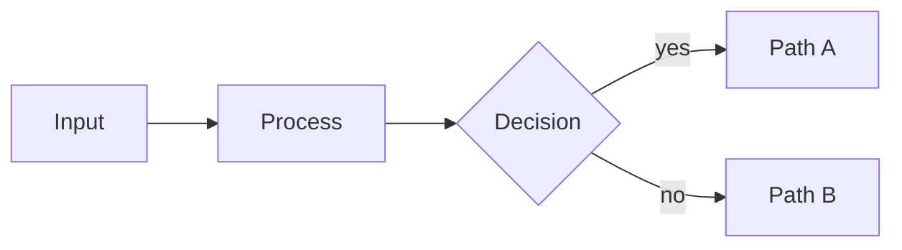

# Lattice — Component Reference

> Canonical reference for every Lattice slide component, aggregated from the component manifests (the single source of truth). Generated by `tools/build-docs-portal.js` — do not edit by hand; edit the manifests and re-run `npm run docs:portal`.

**59 components · 13 buckets.** For the browsable edition — live previews, an in-browser editor, every palette — see the [component pages](https://slidewright.github.io/lattice/components/).

## Contents

- [Anchor](#anchor) — where you are in the deck.
  - [`closing`](#closing)
  - [`divider`](#divider)
  - [`title`](#title)
- [Statement](#statement) — one declarative claim per slide.
  - [`big-number`](#big-number)
  - [`content`](#content)
  - [`quote`](#quote)
  - [`split-panel`](#split-panel)
- [Inventory](#inventory) — parallel sets of related items.
  - [`actors`](#actors)
  - [`agenda`](#agenda)
  - [`cards-grid`](#cards-grid)
  - [`cards-stack`](#cards-stack)
  - [`checklist`](#checklist)
  - [`glossary`](#glossary)
  - [`inventory`](#inventory)
  - [`list`](#list)
  - [`list-tabular`](#list-tabular)
  - [`logo-wall`](#logo-wall)
  - [`q-and-a`](#q-and-a)
- [Comparison](#comparison) — how two or more options differ.
  - [`compare-prose`](#compare-prose)
  - [`compare-table`](#compare-table)
  - [`decision`](#decision)
  - [`matrix-2x2`](#matrix-2x2)
  - [`pricing`](#pricing)
  - [`redline`](#redline)
  - [`split-compare`](#split-compare)
  - [`verdict-grid`](#verdict-grid)
- [Progression](#progression) — ordered movement through stages or time.
  - [`cycle`](#cycle)
  - [`list-criteria`](#list-criteria)
  - [`list-steps`](#list-steps)
- [Evidence](#evidence) — data that supports the argument.
  - [`kpi`](#kpi)
  - [`stats`](#stats)
- [Imagery](#imagery) — visuals that carry their own meaning.
  - [`image`](#image)
  - [`scene`](#scene)
  - [`video`](#video)
- [Chart](#chart) — series-substance data visualizations (SVG kernel).
  - [`funnel`](#funnel)
  - [`gantt`](#gantt)
  - [`journey`](#journey)
  - [`kanban`](#kanban)
  - [`map`](#map)
  - [`piechart`](#piechart)
  - [`progress`](#progress)
  - [`quadrant`](#quadrant)
  - [`radar`](#radar)
  - [`roadmap`](#roadmap)
  - [`state-chart`](#state-chart)
  - [`timeline-list`](#timeline-list)
  - [`word-cloud`](#word-cloud)
- [Diagram](#diagram) — graph-substance network visuals (external renderer).
  - [`diagram`](#diagram)
- [Math](#math) — typeset equations and proofs.
  - [`math`](#math)
- [Code](#code) — syntax-highlighted source code blocks.
  - [`code`](#code)
  - [`compare-code`](#compare-code)
- [Legal](#legal) — citation-aware layouts for statutes, obligations, and regulatory change.
  - [`authority-chain`](#authority-chain)
  - [`citation-card`](#citation-card)
  - [`obligation-matrix`](#obligation-matrix)
  - [`policy-recommendation`](#policy-recommendation)
  - [`regulatory-update`](#regulatory-update)
  - [`statute-stack`](#statute-stack)
- [Connect](#connect) — cards the room can scan: join the network, save the speaker.
  - [`contact`](#contact)
  - [`wifi`](#wifi)

## Anchor

*where you are in the deck.*

### closing

> Final slide. Dark canvas mirror of title.

**Function** anchor · **Form** bookend · **Substance** prose

**Tags** `summary` · `takeaway` · `board-deck`

Last slide of every deck. Restates the takeaway or call-to-action. Like title, suppresses header/footer/pagination — the dark canvas signals "we're done."

#### Agent contract

##### Slots

| Slot | Selector | Required | Description |
|---|---|---|---|
| `heading` | `h2` | yes | Closing line — takeaway, thank-you, or call to action. |
| `eyebrow` | `p > code` | no | Optional category label. |
| `subtitle` | `p` | no | Optional supporting line. |

##### Variant decision rule

- **default (no modifier).** A single-sentence takeaway or call-to-action closes the deck — the common case.
- **`numbered`.** The deck's dividers also use the `numbered` variant — keeps the closing's corner stamp consistent with that numbering scheme.
- **`qr`.** The audience should leave with a scannable link (docs URL, contact card) rather than just a text call-to-action.
- **`index`.** The closing is a reference/see-also list of multiple next steps or resources, not a single takeaway sentence.

##### Common mistakes

- **Eyebrow written as bold or plain text instead of inline code.** The eyebrow match is `h2 + p:has(> code:only-child)` — wrap it in backticks immediately after the heading; without the code span it falls through to the general italic subtitle rule instead of the uppercase mono eyebrow lifted above the heading.
- **The subtitle paragraph is authored before the eyebrow paragraph instead of after it.** The eyebrow match is an immediate-next-ELEMENT-sibling selector (`h2 + p:has(> code:only-child)`) — keep the source order heading → eyebrow → subtitle.
- **In the `index` variant, the leading reference key isn't wrapped in inline code, e.g. `docs — the component catalog` instead of leading with a backtick-wrapped key.** The `index` variant's mono reference-key styling (`section.closing.index li code`) only applies to an actual `<code>` element — wrap the leading key in backticks so it renders as a mono chip, not plain text.

#### When to use

- **Last slide of every deck.** Closes the bookend pair with title. Restates the takeaway, the call to action, or the next-steps line. The dark canvas tells the audience visually that the presentation is over.
- **Single takeaway line.** The h2 is the slide. Keep it to one editorial line that summarizes the whole deck or names the action the audience should take. The eyebrow can carry a sub-line or link.
- **Accent modifier for emphasis.** Pair with the universal `accent` modifier to recolor the focal heading. Useful when the closing line is a quote or a key decision the deck has been building toward.

#### When NOT to use

- **Multi-line heading.** Keep the closing line to one editorial sentence. The layout is centered and large — two-line closings get cramped and lose impact.
- **Header or footer overrides.** Don't reinstate `_header:` or `_footer:` on the closing. The dark canvas is the "we're done" signal; chrome breaks it. Use the `silent` modifier to suppress all three in one token.
- **Mid-deck closing.** If the audience needs a strong statement mid-deck, use `big-number` or `content` with the `dark` modifier. Reserving closing for the final slide preserves its bookend role.

#### Authoring

```markdown
<!-- _class: closing -->
<!-- _paginate: false -->
<!-- _header: '' -->
<!-- _footer: '' -->

## Closing takeaway or call to action

`Optional eyebrow`
```

#### Anatomy

```text
┌─────────────────────────────────────────┐
│            [dark background]            │
│                                         │
│                 CLOSING                 │
│                                         │
│             Take this away              │
│                                         │
│                                         │
│                                         │
└─────────────────────────────────────────┘
```

#### Variants (component-specific)

##### `numbered` — numbered

Counts closings apart from dividers.

```markdown
<!-- _class: closing silent numbered -->

## The closing counts itself, apart from the dividers.

`Closing 04`
```

##### `qr` — qr

Scan to take the deck with you.

```markdown
<!-- _class: closing qr -->

`closing qr`

## Leave a scannable takeaway behind.

The payload bullet renders as a QR code sized for the back row.

- https://slidewright.dev/components/closing
- Scan to open `caption`
```

##### `index` — index

Ends on a reference list — see also, next steps.

```markdown
<!-- _class: closing silent index -->

## Where to go next.

`Next steps`

- `docs` — the component catalog and authoring contracts
- `gallery` — every layout rendered in light and dark
- `studio` — compose and preview a deck in the browser
```

#### Universal modifiers

This component accepts all universal variants (`dark`, `compact`, `accent`, state markers, treatments). See [design/design-system.md §6.5](../../design/design-system.md#65-universal-variants--three-tiers) for the catalog.

#### Related components

- [`title`](#title) — opens the deck — same dark-bookend chrome
- [`divider`](#divider) — mid-deck section breaks — same dark canvas
- [`big-number`](#big-number) — single emphatic statement mid-deck without the bookend signal

#### Demo deck

See [closing.gallery.light.pdf](../../lib/components/anchor/closing/closing.gallery.light.pdf) for rendered examples of every variant.

### divider

> Section boundary slide. Dark canvas with a single heading.

**Function** anchor · **Form** divider · **Substance** prose

**Tags** `section-break` · `agenda-setting` · `walkthrough`

Marks the start of a major section. Use sparingly — every divider is a context switch for the audience. A 30-slide deck typically has 3-5 dividers; more becomes navigation noise.

#### Agent contract

##### Slots

| Slot | Selector | Required | Description |
|---|---|---|---|
| `heading` | `h2` | yes | Section name. |
| `eyebrow` | `p > code` | no | Optional section number or category label above the heading. |

##### Variant decision rule

- **default (no modifier).** A standard mid-deck section start — dark canvas, one heading, no extra chrome.
- **`numbered`.** Section numbering matters to the audience — a long, multi-part deck where a running section count in the corner helps orientation.
- **`light`.** A narrower re-focus within a section rather than a full section start — sits between a dark divider and a run of content slides. Reserve the dark default for genuine section starts.
- **`qr`.** The divider itself should carry a scannable link — a resource specific to the section it's opening.

##### Common mistakes

- **Eyebrow written as plain text instead of inline code, e.g. plain `Section 01` instead of a backtick-wrapped one.** Divider's eyebrow uses the shared before-heading rule `p:has(> code:only-child):has(+ h2)` (base.modifiers.css) — wrap it in backticks; without the code span it's just a plain paragraph with no eyebrow treatment at all.
- **Eyebrow paragraph placed AFTER the heading, copying the title/closing pattern.** Divider's eyebrow is the mirror image of title/closing's — it uses the BEFORE-heading rule (`p:has(> code:only-child):has(+ h2)`), not the after-heading one those two use. Keep it directly before `## Section name`; placed after, it still renders (via the separate after-heading rule) but as an italic secondary-color treatment, not the intended mono kicker.

#### When to use

- **Major section starts.** Marks the boundary between two themed sections of the deck. The dark canvas is a strong context-switch signal — use it when the audience needs to re-orient.
- **Sparingly.** A 30-slide deck typically has 3-5 dividers. More becomes navigation noise; the signal weakens if every third slide is a divider.
- **With an eyebrow.** An inline-code paragraph above the heading stamps a section number or category label. Useful for serialized decks where the audience needs to remember which section they're in.
- **Light variant for sub-section orientation.** The `light` variant keeps the bright body-slide canvas and centers the heading at h2 weight — a lighter context switch for narrowing focus within a section, between a dark divider and the content slides. (Absorbed the standalone `subtopic` component on 2026-06-07.)

#### When NOT to use

- **More than five per deck.** Each divider is a hard context switch. Too many dilutes the signal and slows the audience. Group related content under fewer sections instead.
- **Section title that doesn't earn a section.** If the next 3-4 slides aren't a coherent unit, the `light` variant (bright canvas, centered) is the right tool. Reserve the dark divider for genuine section starts.
- **Header or footer overrides.** Don't reinstate `_header:` or `_footer:` on a divider. The dark canvas is meant to be uninterrupted; chrome belongs on body slides.

#### Authoring

```markdown
<!-- _class: divider -->
<!-- _paginate: false -->
<!-- _header: '' -->
<!-- _footer: '' -->

`Section 01`

## Section name
```

#### Anatomy

```text
┌─────────────────────────────────────────┐
│            [dark background]            │
│                                         │
│               SECTION 02                │
│                                         │
│            Section headline             │
│                                         │
│                                         │
│                                         │
└─────────────────────────────────────────┘
```

#### Variants (component-specific)

##### `numbered` — numbered

Stamps the running section number.

```markdown
<!-- _class: divider silent numbered -->

`divider numbered`

## The corner stamp counts this divider for you.
```

##### `light` — light

Bright canvas, sentence-length waypoint.

```markdown
<!-- _class: divider light -->

`divider light`

## The light divider trades the dark canvas for a bright, full-sentence waypoint.
```

##### `qr` — qr

The payload bullet becomes a code.

```markdown
<!-- _class: divider qr -->

`divider qr`

## The payload bullet below becomes a scannable code.

- https://slidewright.dev/components/divider
- Scan for the divider's docs `caption`
```

#### Universal modifiers

This component accepts all universal variants (`dark`, `compact`, `accent`, state markers, treatments). See [design/design-system.md §6.5](../../design/design-system.md#65-universal-variants--three-tiers) for the catalog.

#### Related components

- [`title`](#title) — opens the deck — same dark-bookend chrome
- [`closing`](#closing) — closes the deck — completes the bookend trio

#### Demo deck

See [divider.gallery.light.pdf](../../lib/components/anchor/divider/divider.gallery.light.pdf) for rendered examples of every variant.

### title

> Opening slide. Dark canvas, centered, no chrome.

**Function** anchor · **Form** bookend · **Substance** prose

**Tags** `pitch` · `board-deck` · `showcase` · `kickoff`

First slide of every deck. Sets the topic and the visual tone. Suppresses header, footer, and pagination (or use the universal `silent` modifier for the same effect in one token).

#### Agent contract

##### Slots

| Slot | Selector | Required | Description |
|---|---|---|---|
| `heading` | `h1` | yes | Deck title. |
| `eyebrow` | `p > code` | no | Optional category label rendered above the h1 (authored as an inline-code paragraph immediately after the h1; flex `order` lifts it above). |
| `subtitle` | `p` | no | Optional plain-paragraph subtitle below the h1. |

##### Common mistakes

- **Eyebrow written as bold or plain text instead of inline code, e.g. `**Category · Date**`.** Wrap the eyebrow paragraph in backticks. The eyebrow CSS matches `h1 + p:has(> code:only-child)`; without the code span the paragraph falls through to the general subtitle rule instead — it still renders styled, just as a second subtitle line, not the uppercase mono eyebrow lifted above the h1.
- **The subtitle paragraph is authored before the eyebrow paragraph instead of after it.** The eyebrow match is an immediate-next-ELEMENT-sibling selector (`h1 + p:has(> code:only-child)`) — it only counts element siblings, so an HTML comment between the h1 and the eyebrow is harmless, but another paragraph is not. Keep the source order heading → eyebrow → subtitle.
- **Inline emphasis (`**bold**`, `_italic_`) inside the h1 itself.** Keep the h1 to plain text. The centered, oversized type already carries full weight — nested emphasis at that scale reads as noise, not emphasis.

#### When to use

- **First slide of every deck.** Sets topic, audience, and visual tone in one glance. The dark canvas anchors the deck visually so subsequent slides feel like a continuous document.
- **Brand or section bookends.** Pair with `divider` (mid-deck section breaks) and `closing` (the final slide) for the full anchor trio. All three share the dark-bookend treatment.
- **Pitch and proposal openings.** When the audience needs the headline and the framing line before any data. The subtitle paragraph is where the framing line goes.

#### When NOT to use

- **Mid-deck statements.** Use `big-number` or `content` for emphatic statements inside a deck. Reaching for the title chrome mid-deck breaks the bookend signal.
- **Multi-line h1.** Keep the h1 to one editorial line. The layout is centered and large — two-line titles get cramped and lose impact.
- **Header or footer overrides.** Don't add back `_header:` or `_footer:` on a title slide. The dark canvas is meant to be uninterrupted; chrome belongs on body slides.

#### Authoring

```markdown
<!-- _class: title -->
<!-- _paginate: false -->
<!-- _header: '' -->
<!-- _footer: '' -->

# Deck title goes here

`Category · Date or audience`

One-line subtitle that frames the deck.
```

#### Anatomy

```text
┌─────────────────────────────────────────┐
│            [dark background]            │
│                                         │
│              EYEBROW LABEL              │
│                                         │
│           Display Title Here            │
│           Subtitle or tagline           │
│                                         │
└─────────────────────────────────────────┘
```

#### Universal modifiers

This component accepts all universal variants (`dark`, `compact`, `accent`, state markers, treatments). See [design/design-system.md §6.5](../../design/design-system.md#65-universal-variants--three-tiers) for the catalog.

#### Related components

- [`divider`](#divider) — mid-deck section breaks — same dark-bookend chrome
- [`closing`](#closing) — the final slide — closes the bookend pair

#### Demo deck

See [title.gallery.light.pdf](../../lib/components/anchor/title/title.gallery.light.pdf) for rendered examples of every variant.

## Statement

*one declarative claim per slide.*

### big-number

> Single oversized number as the focal claim.

**Function** statement · **Form** canvas · **Substance** prose

**Tags** `hero-number` · `metric` · `pitch`

Use to make one metric land. The number should be the headline — supporting text is one short caption. The whole slide is the chart.

#### Agent contract

##### Slots

| Slot | Selector | Required | Description |
|---|---|---|---|
| `eyebrow` | `p > code` | no | Optional label above the number. |
| `number` | `ul > li:first-child` | yes | First list item: the giant number. |
| `caption` | `ul > li:first-child > ul > li` | no | One-line caption below the number (nested bullet). |

##### Common mistakes

- **Caption authored as a second top-level bullet instead of nested under the number's list item.** Indent the caption as a sub-bullet of the number, not a sibling `- caption` line — a sibling bullet doesn't just miss the caption styling, it matches the SAME top-level rule as the number itself and renders as a second giant hero-sized line.
- **The unit or label baked into the number line itself, e.g. `- 1,248,500,000 users`.** Keep the number list item to the numeral plus its own unit symbol (`%`, `$`, `×`). Put the semantic label — what's being counted — in the eyebrow, not appended prose after the number.
- **Eyebrow restates the number's value instead of naming its category, e.g. eyebrow `92%` above a number `92%`.** The eyebrow names the metric class ("Audience recall", "Q3 revenue"); the number carries the value. Restating the value in both places wastes the eyebrow's one job.

#### When to use

- **One metric carries the slide.** When the audience needs to remember exactly one number from this part of the deck. The whole slide is the chart — no surrounding context, no comparisons, no axes.
- **Headline that earns the canvas.** Reach for big-number when the metric is the argument: cost reduced by 4×, audience reach grew 92%, time-to-decision dropped from 14 days to 4. One claim, one canvas.
- **Eyebrow names the metric class.** The inline-code eyebrow contextualizes the number ("Audience recall", "Q3 revenue", "Latency p99"). The number is the value; the eyebrow is the label.

#### When NOT to use

- **Multiple metrics on one slide.** Two big numbers on one canvas dilute both. Use `stats` for a row of three metrics or `kpi` for a grid of four; reserve big-number for genuinely solo claims.
- **Caption longer than one line.** If the caption needs a sentence to explain, the number isn't carrying the slide. Either trim the number's claim or move to `content` where prose has room.
- **Decorative numbers without an argument.** "99.99% uptime" by itself is a boast, not a claim. Big-number works when the number is the answer to a question the audience came in with.

#### Authoring

```markdown
<!-- _class: big-number -->

`Optional eyebrow`

- 92%
  - of the audience remembers a single number from a deck.
```

#### Anatomy

```text
┌─────────────────────────────────────────┐
│  header                                 │
│  EYEBROW                                │
│                                         │
│                 ┌─────┐                 │
│                 │ 42× │                 │
│                 └─────┘                 │
│                                         │
│      Caption explains the number.       │
│  footer                           1/19  │
└─────────────────────────────────────────┘
```

#### Universal modifiers

This component accepts all universal variants (`dark`, `compact`, `accent`, state markers, treatments). See [design/design-system.md §6.5](../../design/design-system.md#65-universal-variants--three-tiers) for the catalog.

#### Related components

- [`stats`](#stats) — row of 2-3 metrics, comparable visual weight
- [`kpi`](#kpi) — grid of 4-6 metrics with status indicators
- [`split-panel`](#split-panel) — the metric needs a paragraph of context alongside it
- [`content`](#content) — the argument is mostly prose with a number embedded

#### Demo deck

See [big-number.gallery.light.pdf](../../lib/components/statement/big-number/big-number.gallery.light.pdf) for rendered examples of every variant.

### content

> Generic prose slide — heading plus paragraphs or a short list.

**Function** statement · **Form** canvas · **Substance** prose

**Tags** `walkthrough` · `overview` · `summary`

The catch-all for explanatory content that doesn't fit a more structured layout. Resist using it when a more specific component (cards-grid, stats, compare-prose) would shape the content better.

#### Agent contract

##### Slots

| Slot | Selector | Required | Description |
|---|---|---|---|
| `heading` | `h2` | yes | Slide heading. |
| `body` | `section > p, section > ul` | yes | Paragraphs or a short bullet list under the heading. Keep under ~40 words. |

##### Common mistakes

- **Nesting a second level of bullets to add sub-points, expecting them to read with the same weight as the top level.** A nested list steps DOWN to body-size text (smaller than the top-level prose size) — nested items read as supporting asides, not equal peers. If the items should carry equal weight, keep them all at the top level.

#### When to use

- **Explanatory prose that doesn't shape.** A paragraph that develops one idea. No comparisons to spell out, no inventory to grid, no metric to highlight — just prose with a heading. The catch-all when shape would be forced.
- **Under forty words.** Content slides earn their place when they're brief. Past 40 words the slide becomes a wall of text and the audience stops reading. Trim or split into two slides.
- **Optional short bullet list.** If the paragraph wants two or three loose qualifications, a bullet list below the prose is fine. For more than that, the content is really structured — move to a `list` or `cards-stack` slide.

#### When NOT to use

- **Forced shape into prose.** If the content is a comparison, use compare-prose. If it's a list of options, use cards-grid. If it's a sequence, use list-steps. Reaching for content when shape exists wastes the slide.
- **Wall of text.** More than 40 words and the audience tunes out. The layout doesn't fight back — it'll happily render a 200-word paragraph that nobody reads. Split or trim.
- **Multiple headings.** Content carries one heading and one idea. Two h2s on one slide reads as two slides crammed together. Split into two content slides or use a structured layout.

#### Authoring

```markdown
<!-- _class: content -->

## Slide heading.

The explanatory paragraph that develops the heading goes here. Keep the slide under forty words.

- Optional supporting point one.
- Optional supporting point two.
```

#### Anatomy

```text
┌─────────────────────────────────────────┐
│  header                                 │
│  EYEBROW                                │
│  Single-idea heading.                   │
│                                         │
│  Paragraph carries the slide.           │
│  One idea expanded into prose,          │
│  no lists, no chrome.                   │
│                                         │
│  footer                           1/19  │
└─────────────────────────────────────────┘
```

#### Universal modifiers

This component accepts all universal variants (`dark`, `compact`, `accent`, state markers, treatments). See [design/design-system.md §6.5](../../design/design-system.md#65-universal-variants--three-tiers) for the catalog.

#### Related components

- [`quote`](#quote) — the prose IS a quote — let the quotation chrome carry it
- [`big-number`](#big-number) — the prose IS a metric — let the number carry it
- [`cards-grid`](#cards-grid) — the prose IS a parallel list of items
- [`compare-prose`](#compare-prose) — the prose IS a two-way comparison
- [`list-steps`](#list-steps) — the prose IS an ordered sequence

#### Demo deck

See [content.gallery.light.pdf](../../lib/components/statement/content/content.gallery.light.pdf) for rendered examples of every variant.

### quote

> A pulled quotation, centered, with attribution.

**Function** statement · **Form** canvas · **Substance** prose

**Tags** `pull-quote` · `quotation` · `showcase`

Use to land a phrase verbatim — customer voice, expert claim, mission statement. Keep under ~25 words. The quote IS the slide; the attribution is the supporting credit.

#### Agent contract

##### Slots

| Slot | Selector | Required | Description |
|---|---|---|---|
| `quotation` | `blockquote > p` | yes | The quoted text. |
| `attribution` | `section > p:last-child` | no | Attribution line below the quote. |

##### Common mistakes

- **Writing the attribution as a second line inside the blockquote (`> quote text` then `> — Person`) instead of a separate paragraph after it.** The attribution slot is the paragraph AFTER the blockquote, not inside it — written inside, it inherits the blockquote's large italic quotation styling instead of the smaller attribution treatment.
- **Splitting the quotation across two paragraphs inside the blockquote.** The blockquote's opening/closing smart-quote glyphs decorate the blockquote as a whole, once — two paragraphs inside it both render at full quotation size with no visual distinction, instead of the single continuous quotation the layout expects.

#### When to use

- **Verbatim language matters.** When the audience needs to hear the words exactly as they were said — customer feedback, expert claim, regulatory text, mission statement. Paraphrasing would lose the impact.
- **One breath of reading.** Keep the quotation under ~25 words. The audience reads silently in one breath; longer than that and they're scanning, not feeling the words.
- **Attribution earns the quote.** Anonymous quotes feel weak. Attribute the speaker, their role, and the context ("Head of Product, Pilot Team 3" beats just "a customer"). The attribution is the credibility.

#### When NOT to use

- **Paragraph-length quotes.** If the quote runs past 25 words, the slide is reading like a wall of text. Trim aggressively or use `split-panel pullquote` (gives the quote half the slide alongside spelled-out implications).
- **Multiple quotes per slide.** Two quotes on one canvas dilute both. The whole point is that one quote earns the whole slide. For a montage of customer voices, use successive quote slides.
- **Decorative quotes.** If the quote could be paraphrased without losing anything, the slide doesn't need to be a quote slide. Move the idea into `content` and skip the chrome.

#### Authoring

```markdown
<!-- _class: quote -->

> The quoted sentence sits here, kept short enough to read in one breath.

— Person, Role
```

#### Anatomy

```text
┌─────────────────────────────────────────┐
│  header                                 │
│                                         │
│       "A pulled quote that fills        │
│        the centre of the slide."        │
│                                         │
│          — Attribution, source          │
│                                         │
│  footer                           1/19  │
└─────────────────────────────────────────┘
```

#### Universal modifiers

This component accepts all universal variants (`dark`, `compact`, `accent`, state markers, treatments). See [design/design-system.md §6.5](../../design/design-system.md#65-universal-variants--three-tiers) for the catalog.

#### Related components

- [`split-panel`](#split-panel) — the quote needs implications spelled out alongside it
- [`content`](#content) — the language is paraphrasable — let prose carry it
- [`big-number`](#big-number) — the most memorable thing is a metric, not a phrase

#### Demo deck

See [quote.gallery.light.pdf](../../lib/components/statement/quote/quote.gallery.light.pdf) for rendered examples of every variant.

### split-panel

> Featured left panel + supporting right zone — one prominent claim beside the points that substantiate it.

**Function** statement · **Form** panel · **Substance** structure

**Tags** `summary` · `board-deck` · `hero-number` · `pull-quote` · `takeaway`

Use when one prominent element (a heading, a hero number, a pull-quote, a phase) deserves a dedicated panel and the right side carries the supporting points. The default anchors a heading; variants reshape what the panel features: `metric` (hero number, light-left), `pullquote` (pull-quote), `steps` (numbered step-timeline), `watermark` (accent panel + letterform + meta footer). For a binary decision with a verdict, reach for `split-compare`.

#### Agent contract

**Density** aim ~16 words per item; past ~24 it reads as a wall of text — one finding per row, a sentence.

##### Slots

| Slot | Selector | Required | Description |
|---|---|---|---|
| `eyebrow` | `p:first-of-type > code` | no | Optional inline-code label above the feature (the phase number under `steps`, the unit under `metric`). |
| `heading` | `h2` | yes | The featured element in the left panel — a heading by default; a hero number under `metric`; the phase name under `steps`. (Under `pullquote`, use a blockquote instead — see the variant.) |
| `lede` | `p` | no | One-sentence framing paragraph under the feature. |
| `points` | `ul > li` | yes | Right-side supporting points. Each li's lead is the point title — it renders bold automatically (no `**…**`); follow it with a nested `- body` line. |

##### Variant decision rule

- **default (no modifier).** A thesis heading deserves the panel and the right column substantiates it with prose points — the plain briefing look.
- **`metric`.** A hero number is the featured element — the panel flips light and the number becomes the display type.
- **`pullquote`.** The featured element is a verbatim quotation — author a blockquote in the left panel instead of a heading.
- **`steps`.** The panel anchors a numbered phase rather than a heading, and the right column is a numbered sequence rather than loose points.
- **`watermark`.** You want a decorative accent panel — an oversized letterform behind the heading — plus an optional two-line Audience/Intent metadata footer after the points.
- **`mirror`.** Same anatomy, but the deck's reading rhythm wants the featured panel to land on the right instead of the left.
- **`qr`.** A URL to scan supplements the panel — a bullet tagged `qr` (or a bare URL) auto-resolves into a QR figure appended to the RIGHT (supporting) column; the left panel keeps its normal required heading/lede, it doesn't become the QR.

##### Common mistakes

- **Using a `## heading` in the left panel under `pullquote` instead of a `>` blockquote.** Under `pullquote` the transform builds the left panel from ONLY the blockquote and its citation — an `h2` never lands in the left panel at all; it gets swept into the right column above the supporting points instead, leaving the featured panel blank.
- **Adding a third line to `watermark`'s trailing metadata footer, expecting a third labeled row.** The footer's "Audience ·" / "Intent ·" prefixes are hard-coded to the first two list items only — a third item renders with no label prefix at all.

#### When to use

- **One feature, supporting points.** When a single prominent element — a thesis heading, a hero number, a quote — deserves its own panel and the right side substantiates it. The panel is the anchor; the right is the evidence.
- **Pick the variant by what the panel features.** Heading (default), hero number (`metric`), pull-quote (`pullquote`), phase + numbered steps (`steps`), or an accent panel with a letterform watermark and a metadata footer (`watermark`).
- **Points carry a title + body.** Each right-side item leads with a bold title (lifted automatically) and a nested one-line body. Three or four points read best; more crowds the panel.

#### When NOT to use

- **A binary decision with a verdict.** If the slide weighs two options and lands a recommendation, use `split-compare` — its right zone is a 2-option grid + a verdict card, which `split-panel` does not provide.
- **Co-equal halves.** split-panel is asymmetric — a featured panel beside supporting detail. For two co-equal options side by side, use `compare-prose`.
- **A list with no feature.** If there's no prominent left-panel element, a plain `list` or `cards-stack` serves better — the panel earns its place only when one element leads.

#### Authoring

```markdown
<!-- _class: split-panel -->

`Eyebrow context`

## Headline that anchors the panel.

One-sentence framing paragraph explaining what the points cover.

- First point
  - Supporting detail explaining the first point.
- Second point
  - Supporting detail explaining the second point.
- Third point
  - Supporting detail explaining the third point.
```

#### Anatomy

```text
┌─────────────────────────────────────────┐
│  header                                 │
│  ┌────────────┐  FINDINGS               │
│  │ BRIEF      │  │ Finding title        │
│  │ heading    │  │ body detail          │
│  │ + lede     │  │ Finding title        │
│  │            │  │ body detail          │
│  └────────────┘                         │
│  footer                           1/19  │
└─────────────────────────────────────────┘
```

#### Variants (component-specific)

##### `metric` — metric

Light panel behind one hero number.

```markdown
<!-- _class: split-panel metric -->

`split-panel metric`

## 16<em>wpi</em>

Words per item — the budget this layout holds its supporting column to.

- The panel flips light
  - metric flips the panel light behind one hero number.
- The number claims
  - Keep support brief — two items beside a figure.
```

##### `pullquote` — pullquote

Half the slide to one quotation.

```markdown
<!-- _class: split-panel pullquote -->

> pullquote gives half the slide to one voice, and the other half to what it means.

`split-panel pullquote · the layout, quoted`

- The quote claims
  - Display italic on the dark panel; keep it under twenty-five words.
- The column interprets
  - Two items that say why the words matter, not who said them again.
```

##### `steps` — steps

The panel anchors a numbered phase.

```markdown
<!-- _class: split-panel steps -->

`02`

## steps

The left panel anchors a phase; the column numbers its moves.

1. Watermark the phase
   - The inline-code number becomes the panel's backdrop.
2. Number the column
   - An ordered list reads as sequence — three steps fit.
3. Keep steps parallel
   - Verb-first titles, one supporting line each.
```

##### `watermark` — watermark

Accent panel, letterform, h3 rubric.

```markdown
<!-- _class: split-panel watermark -->

## Watermark

### The heading's first letter becomes the panel

- The accent panel decorates
  - A large letterform behind the heading — presence without a photo.
- The h3 subtitles
  - One line naming what the slide surveys.
- The column carries the content
  - Same three-item budget as the default split.
```

##### `mirror` — mirror

Featured panel moves right.

```markdown
<!-- _class: split-panel mirror -->

`split-panel mirror`

## mirror puts the featured panel on the right.

Same anatomy, flipped — for when the deck's rhythm wants the claim to land late.

- Reading order still works
  - The eye crosses support first, then lands on the panel's claim.
- Use it sparingly
  - One mirror per section keeps the flip meaningful.
```

##### `qr` — qr

Payload bullet becomes a code.

```markdown
<!-- _class: split-panel qr -->

`split-panel qr`

## The payload bullet becomes a code on the panel.

A bare URL auto-resolves; the caption line labels the scan.

- https://slidewright.dev/components/split-panel `qr`
- Scan for this layout's docs `caption`
```

#### Universal modifiers

This component accepts all universal variants (`dark`, `compact`, `accent`, state markers, treatments). See [design/design-system.md §6.5](../../design/design-system.md#65-universal-variants--three-tiers) for the catalog.

#### Related components

- [`split-compare`](#split-compare) — a binary decision with a recommendation card
- [`compare-prose`](#compare-prose) — two co-equal options side by side
- [`big-number`](#big-number) — the hero number is the whole slide, with no supporting list
- [`list-steps`](#list-steps) — an ordered process without a left anchor panel

#### Demo deck

See [split-panel.gallery.light.pdf](../../lib/components/statement/split-panel/split-panel.gallery.light.pdf) for rendered examples of every variant.

## Inventory

*parallel sets of related items.*

### actors

> Roster of responsibilities owned by named actors.

**Function** inventory · **Form** ledger · **Substance** structure

**Tags** `ownership` · `onboarding` · `reference`

Use to show 'who owns what' across a process, scoring policy, or org chart. Two-column layout: actor on left, responsibilities on right.

#### Agent contract

**Capacity** ~4 items (crowds past 6, overflows past 7) — past that, list-tabular / split across slides.

**Density** aim ~12 words per item; past ~18 it reads as a wall of text — one short responsibility per row, not a job description.

##### Slots

| Slot | Selector | Required | Description |
|---|---|---|---|
| `title` | `h2` | yes | Slide heading. |
| `rows` | `ul > li` | yes | One row per responsibility. Each li leads with the responsibility label — rendered bold automatically (no `**…**` needed) — then a trailing inline-code actor name (rendered as a right-aligned categorical pill), then an optional nested bullet carrying a one-line body. |

##### Common mistakes

- **Putting the actor name as the first word of the row instead of a trailing inline-code chip.** The row reads responsibility-then-actor: the label leads (auto-bold), and the actor name must be a TRAILING, direct-child inline-code chip on the same line — `- Owns the first part \`First actor\`` — not the other way around, or it won't render as the right-aligned pill.

#### When to use

- **Who owns what.** Each row pairs a named actor with the slice of work they own. Use when the audience needs to know accountability, not process flow.
- **Three to six actors.** The ledger reads cleanly up to about six rows. Past that, split the roster across two slides or roll up adjacent roles.
- **One-line responsibilities.** Each actor's body is a short responsibility summary, not a job description. Detail belongs on a follow-up slide or in an appendix.

#### When NOT to use

- **Process sequence.** If the rows describe stages in order, use list-steps or process-flow. actors is for parallel ownership, not handoff sequence.
- **Long per-actor prose.** More than one sentence per row crowds the ledger. Move the detail to a dedicated slide and keep actors as the index.
- **Roles without names.** If the labels are job titles in the abstract ("the engineer"), reach for cards-stack or list. The actors layout earns its weight when the names are named.

#### Authoring

```markdown
<!-- _class: actors -->

## Who owns each part of the process.

- Owns the first part `First actor`
  - One-line note on what that ownership covers.
- Owns the second part `Second actor`
  - One-line note.
- Owns the third part `Third actor`
  - One-line note.
```

#### Anatomy

```text
┌─────────────────────────────────────────┐
│  header                                 │
│  Actors heading.                        │
│                                         │
│  Role A    Owner name                   │
│            - responsibility one         │
│  Role B    Owner name                   │
│            - responsibility two         │
│                                         │
│  footer                           1/19  │
└─────────────────────────────────────────┘
```

#### Universal modifiers

This component accepts all universal variants (`dark`, `compact`, `accent`, state markers, treatments). See [design/design-system.md §6.5](../../design/design-system.md#65-universal-variants--three-tiers) for the catalog.

#### Related components

- [`list-tabular`](#list-tabular) — rows are reference entries, not owners
- [`cards-stack`](#cards-stack) — each item needs two sentences of body text
- [`list`](#list) — declared statements — the `principles` variant
- [`glossary`](#glossary) — the left column is a term, not an actor

#### Demo deck

See [actors.gallery.light.pdf](../../lib/components/inventory/actors/actors.gallery.light.pdf) for rendered examples of every variant.

### agenda

> Auto-numbered table of contents for the deck.

**Function** inventory · **Form** stack · **Substance** structure

**Tags** `agenda-setting` · `overview` · `onboarding` · `kickoff`

Use as the second slide of any multi-section deck. Numbers are generated; authors just write the section titles. Five interchangeable styles — the default `ledger` (a contents page with optional page references), plus `circles`, `rail`, `cards`, and `checks` — all compose with the `progress-N` 'you are here' modifier.

#### Agent contract

**Capacity** ~4 items (crowds past 6, overflows past 7) — past that, split across slides.

**Density** aim ~10 words per item; past ~16 it reads as a wall of text — a short agenda line, not a description.

##### Slots

| Slot | Selector | Required | Description |
|---|---|---|---|
| `title` | `h2` | yes | Slide heading — typically 'Agenda' or 'What we'll cover'. |
| `items` | `ol > li` | yes | Ordered list of section titles. |

##### Variant decision rule

- **default (no modifier).** A contents page with optional page references — the plainest, most document-like agenda look.
- **`circles`.** Section markers should read as a track of dots rather than numbers — a more visual, less document-like tone.
- **`rail`.** The agenda should read as a vertical journey down a side rail rather than a flat numbered list.
- **`cards`.** Each section deserves its own boxed card, with the current one taking the accent — a punchier, more graphic agenda.
- **`checks`.** The deck has forward momentum and past sections should visibly tick off as done, with an arrow marking the current one.

##### Common mistakes

- **Hand-typing the page number into the section title instead of a trailing inline-code page ref.** A page reference is a trailing `` `p.N` `` inline-code chip on the item line — text baked into the title itself doesn't get the right-aligned leader-dot treatment.
- **Assuming `progress-N` alone changes which marker style (circles/rail/cards/checks) is used.** `progress-N` only marks which stop is current — it composes with a style variant but doesn't imply one; the default numbered `ledger` look still applies unless you also add `circles`/`rail`/`cards`/`checks`.

#### When to use

- **Second slide of the deck.** Right after the title, before the first section. Orients the audience and sets the cadence of what's coming.
- **Three to six sections.** Sweet spot is four. Past six sections the list crowds and the audience stops counting. Roll up or split the deck.
- **Reuse with progress variants.** Drop the same agenda between sections with `progress-N` to show how far through the deck the room is. Lightweight wayfinding.
- **Pick a style, optionally with page refs.** The default `ledger` reads as a contents page; add `circles`, `rail`, `cards`, or `checks` to change the structure. On `ledger`, end an item with an inline-code page ref — e.g. `` `p.15` `` — to print a right-aligned page number with a leader; omit it for just number + title.

#### When NOT to use

- **Sub-bullets per section.** The agenda is a wayfinder, not a treatment. If a section needs decomposition, that belongs on a section divider when the section opens — not here.
- **Unnumbered list.** Authoring with `-` instead of `1.` loses the numbered chrome the layout depends on. Always use ordered list syntax.
- **Single-section decks.** If the deck has no sections to enumerate, skip the agenda. Empty wayfinding is more friction than no wayfinding.
- **More than six sections.** A single agenda slide holds up to six sections at a legible row height; beyond that the rows crowd the footer. Group related items under fewer headings, or split the agenda across two slides.

#### Authoring

```markdown
<!-- _class: agenda -->

## What this deck covers.

1. First section title
2. Second section title
3. Third section title
4. Fourth section title
```

#### Anatomy

```text
┌─────────────────────────────────────────┐
│  header                                 │
│  Agenda heading.                        │
│                                         │
│  01  First section topic                │
│  02  Second section topic               │
│  03  Third section topic                │
│  04  Fourth section topic               │
│                                         │
│  footer                           1/19  │
└─────────────────────────────────────────┘
```

#### Variants (component-specific)

##### `progress-1` — progress-1

Stop 1 is current; the rest dim or wait.

```markdown
<!-- _class: agenda progress-1 -->

## progress-1 marks stop 1 as the current one.

1. One line per stop, ten words max `p.2`
2. Page references ride as inline code `p.5`
3. Six stops is the soft ceiling `p.9`
4. The progress variants mark the current stop `p.14`
5. Markers come as circles, rail, cards, checks `p.18`
6. Past seven stops, split the agenda `p.22`
```

##### `progress-2` — progress-2

Stop 2 is current; the rest dim or wait.

```markdown
<!-- _class: agenda progress-2 -->

## progress-2 marks stop 2 as the current one.

1. One line per stop, ten words max `p.2`
2. Page references ride as inline code `p.5`
3. Six stops is the soft ceiling `p.9`
4. The progress variants mark the current stop `p.14`
5. Markers come as circles, rail, cards, checks `p.18`
6. Past seven stops, split the agenda `p.22`
```

##### `progress-3` — progress-3

Stop 3 is current; the rest dim or wait.

```markdown
<!-- _class: agenda progress-3 -->

## progress-3 marks stop 3 as the current one.

1. One line per stop, ten words max `p.2`
2. Page references ride as inline code `p.5`
3. Six stops is the soft ceiling `p.9`
4. The progress variants mark the current stop `p.14`
5. Markers come as circles, rail, cards, checks `p.18`
6. Past seven stops, split the agenda `p.22`
```

##### `progress-4` — progress-4

Stop 4 is current; the rest dim or wait.

```markdown
<!-- _class: agenda progress-4 -->

## progress-4 marks stop 4 as the current one.

1. One line per stop, ten words max `p.2`
2. Page references ride as inline code `p.5`
3. Six stops is the soft ceiling `p.9`
4. The progress variants mark the current stop `p.14`
5. Markers come as circles, rail, cards, checks `p.18`
6. Past seven stops, split the agenda `p.22`
```

##### `progress-5` — progress-5

Stop 5 is current; the rest dim or wait.

```markdown
<!-- _class: agenda progress-5 -->

## progress-5 marks stop 5 as the current one.

1. One line per stop, ten words max `p.2`
2. Page references ride as inline code `p.5`
3. Six stops is the soft ceiling `p.9`
4. The progress variants mark the current stop `p.14`
5. Markers come as circles, rail, cards, checks `p.18`
6. Past seven stops, split the agenda `p.22`
```

##### `progress-6` — progress-6

Stop 6 is current; the rest dim or wait.

```markdown
<!-- _class: agenda progress-6 -->

## progress-6 marks stop 6 as the current one.

1. One line per stop, ten words max `p.2`
2. Page references ride as inline code `p.5`
3. Six stops is the soft ceiling `p.9`
4. The progress variants mark the current stop `p.14`
5. Markers come as circles, rail, cards, checks `p.18`
6. Past seven stops, split the agenda `p.22`
```

##### `circles` — Style · circles

Numbers become rings; current fills.

```markdown
<!-- _class: agenda circles progress-3 -->

## circles swaps the numbers for filled dots.

1. The four marker styles share one anatomy
2. Numbers are the default
3. This variant swaps the marker
4. Progress still tracks the current stop
5. Five stops keep the demo honest
```

##### `rail` — Style · rail

Nodes on a vertical rail; active fills.

```markdown
<!-- _class: agenda rail progress-3 -->

## rail runs the progress down a side rail.

1. The four marker styles share one anatomy
2. Numbers are the default
3. This variant swaps the marker
4. Progress still tracks the current stop
5. Five stops keep the demo honest
```

##### `cards` — Style · cards

Boxed stops; the current takes accent.

```markdown
<!-- _class: agenda cards progress-3 -->

## cards deals each stop its own card.

1. The four marker styles share one anatomy
2. Numbers are the default
3. This variant swaps the marker
4. Progress still tracks the current stop
5. Five stops keep the demo honest
```

##### `checks` — Style · checks

Done gets a tick, current an arrow.

```markdown
<!-- _class: agenda checks progress-3 -->

## checks ticks the stops already behind you.

1. The four marker styles share one anatomy
2. Numbers are the default
3. This variant swaps the marker
4. Progress still tracks the current stop
5. Five stops keep the demo honest
```

#### Universal modifiers

This component accepts all universal variants (`dark`, `compact`, `accent`, state markers, treatments). See [design/design-system.md §6.5](../../design/design-system.md#65-universal-variants--three-tiers) for the catalog.

#### Related components

- [`divider`](#divider) — marking a section boundary without restating the menu
- [`list`](#list) — single-line takeaways — the `takeaway` variant
- [`title`](#title) — the slide immediately preceding the agenda

#### Demo deck

See [agenda.gallery.light.pdf](../../lib/components/inventory/agenda/agenda.gallery.light.pdf) for rendered examples of every variant.

### cards-grid

> 2–4 parallel items, similar weight, scannable in a grid.

**Function** inventory · **Form** grid · **Substance** structure

**Tags** `overview` · `showcase` · `summary`

Use when the audience needs to compare or scan a small set of options at a glance. Avoid for more than 4 items — split into multiple slides. For ordered/numbered steps, use list-steps instead.

#### Agent contract

**Capacity** ~3 items (crowds past 4, overflows past 4) — past that, list-tabular / split across slides.

**Density** aim ~15 words per item; past ~24 it reads as a wall of text — a card body is one short clause, not a paragraph.

##### Slots

| Slot | Selector | Required | Description |
|---|---|---|---|
| `title` | `h2` | yes | Slide heading. |
| `cards` | `ul > li` | yes | Each list item becomes one card. Authoring contract: a top-level bullet is the card title (renders bold by default); an indented bullet underneath carries the body text (renders normal weight via the nested-list rule). |
| `insight` | `blockquote` | no | Optional key-insight panel above the cards. |

##### Variant decision rule

- **default (no modifier).** Two cards, or the default column count already fits — no need to force a specific column count.
- **`three`.** Exactly three parallel items need equal width — widens the grid to three columns.
- **`four`.** Four parallel items, often a 2×2 quadrant read where card position itself carries meaning.
- **`numbered`.** The cards have an implicit rank or step order worth surfacing as corner numbers — author with `1.` instead of `-`.

##### Common mistakes

- **Writing the card as one inline line (`- **Title.** body`) instead of a nested bullet.** cards-grid requires the nested `- Title` / `  - body` format (HARD RULE #5, lint-enforced) — the inline form fails the deck-authoring lint, and the body inherits the parent li's bold weight instead of rendering at normal weight.
- **Adding a `numbered` class to the slide, expecting it to turn on corner numbers.** There is no `numbered` CSS class — the numbering comes purely from authoring the cards as an ordered list (`1.`) instead of a bullet list (`-`); the `numbered` entry in variants documents that authoring choice, not a class to type.

#### When to use

- **Parallel items.** Four cards or fewer, each item gets equal weight in the layout. Audience compares them at a glance.
- **Scannable at a glance.** The audience absorbs the whole set in one look — no scrolling, no eye-leaping between rows.
- **Equal information density.** Each card carries roughly the same text length. Uneven density makes the grid feel unbalanced.
- **Order is decorative.** When sequence carries meaning, use list-steps or list-criteria instead. cards-grid is for parallel options.

#### When NOT to use

- **More than 4 items.** Split into multiple slides instead. The grid loses scannability past 4 cards.
- **Order carries meaning.** Use list-steps or list-criteria. cards-grid is for parallel options, not sequences.
- **Lopsided density.** Equalize the prose when one card has three sentences and the rest have one. Otherwise change layout.
- **Inline-code-only body.** A body bullet containing only `code` gets promoted to an eyebrow label. Mix it with surrounding prose.

#### Authoring

```markdown
<!-- _class: cards-grid -->

## Slide heading.

- First card title
  - Body text for the first card, one sentence.
- Second card title
  - Body text for the second card, one sentence.
- Third card title
  - Body text for the third card, one sentence.
- Fourth card title
  - Body text for the fourth card, one sentence.
```

#### Anatomy

```text
┌─────────────────────────────────────────┐
│  header                                 │
│                  LABEL                  │
│               Grid Title                │
│                                         │
│  ┌──────────────┐     ┌──────────────┐  │
│  │ Card Title 1 │     │ Card Title 2 │  │
│  │ content      │     │ content      │  │
│  └──────────────┘     └──────────────┘  │
│  ┌──────────────┐     ┌──────────────┐  │
│  │ Card Title 3 │     │ Card Title 4 │  │
│  │ content      │     │ content      │  │
│  └──────────────┘     └──────────────┘  │
│  footer                           1/19  │
└─────────────────────────────────────────┘
```

#### Variants (component-specific)

##### `four` — Four columns

Four columns; pair with compact.

```markdown
<!-- _class: cards-grid four compact -->

## four locks a two-by-two, compact tightens it.

- Quadrant read.
  - Four cells scan as a loop.
- Compact pairing.
  - Padding shrinks so labels stay whole.
- Named corners.
  - Position carries meaning; place cards deliberately.
- Still four.
  - The ceiling does not move.
```

##### `three` — Three columns

Three equal columns.

```markdown
<!-- _class: cards-grid three -->

## three widens the grid to three columns.

- Wider cards.
  - Each card earns a third of the row.
- Same budget.
  - Bodies stay one clause, titles stay parallel.
- Sweet spot.
  - Three peers is the count this grid loves.
```

##### `numbered` — Numbered cards

Ordered source stamps corner tags.

```markdown
<!-- _class: cards-grid -->

## An ordered list numbers the cards.

1. Numbers appear
   - Markdown's ordered list turns cards into steps.
2. Sequence reads
   - The grid now implies order, so mean it.
3. Budget holds
   - Same one-clause bodies as the unnumbered grid.
```

#### Universal modifiers

This component accepts all universal variants (`dark`, `compact`, `accent`, state markers, treatments). See [design/design-system.md §6.5](../../design/design-system.md#65-universal-variants--three-tiers) for the catalog.

#### Related components

- [`list-steps`](#list-steps) — items carry an explicit sequence
- [`cards-stack`](#cards-stack) — items stack vertically as full-width rows
- [`compare-prose`](#compare-prose) — two-option comparison, side by side
- [`verdict-grid`](#verdict-grid) — comparing options against shared criteria

#### Demo deck

See [cards-grid.gallery.light.pdf](../../lib/components/inventory/cards-grid/cards-grid.gallery.light.pdf) for rendered examples of every variant.

### cards-stack

> Parallel items stacked vertically, full-width cards.

**Function** inventory · **Form** stack · **Substance** structure

**Tags** `overview` · `summary` · `reference`

Use when the items want vertical reading order — sequential exploration rather than a-glance comparison. 2–4 items work best (a fourth fits with the `compact` modifier).

#### Agent contract

**Capacity** ~3 items (crowds past 4, overflows past 4) — past that, list-tabular / split across slides.

**Density** aim ~16 words per item; past ~26 it reads as a wall of text — a stacked card is a short paragraph at most.

##### Slots

| Slot | Selector | Required | Description |
|---|---|---|---|
| `title` | `h2` | yes | Slide heading. |
| `cards` | `ul > li` | yes | Each list item becomes one stacked card. Authoring contract: a top-level bullet is the card title (renders bold by default); an indented bullet underneath carries the body text. An optional trailing inline `code` on the title line renders as a right-anchored pill. |

##### Variant decision rule

- **default (no modifier).** Vertical, top-to-bottom priority reading — the base look.
- **`horizontal`.** The sequence reads more naturally left-to-right, e.g. a timeline — pivots the stack onto its side.
- **`numbered`.** The vertical rank should be explicit rather than implied by position — author as an ordered list to stamp corner numbers.

##### Common mistakes

- **Adding a `numbered` class to the slide, expecting it to turn on corner numbers.** There is no `numbered` CSS class — the ranking numbers come purely from authoring the cards as an ordered list (`1.`) instead of `-`.
- **Adding a fourth card without the `compact` modifier.** A fourth card only fits with `compact` — without it, four full-size stacked cards overflow the frame; the component's own stress sample demonstrates `cards-stack compact` at four rows.

#### When to use

- **Vertical reading order.** The audience scans top-to-bottom, not grid-style. Use when each card builds on the previous one as the eye moves down the slide.
- **Two sentences per card.** More body than cards-grid can hold without crowding. cards-stack lets each card carry one or two short sentences without losing the layout balance.
- **Two or three items.** Sweet spot is three. Past that the slide overflows — split across multiple slides or switch to cards-grid with shorter body text per card.

#### When NOT to use

- **Five or more items.** A fourth card fits with the `compact` modifier; past four the stack overflows. For five or more parallel items reach for cards-grid four, or split across slides.
- **One-line cards.** If each card is a single short phrase, the stack reads as a padded list. Drop to `list` (or its `takeaway` variant) and reclaim the vertical space.
- **Forced sequence.** Cards-stack is parallel content read in vertical order, not a numbered sequence. For explicit steps, use list-steps or list-criteria.

#### Authoring

```markdown
<!-- _class: cards-stack -->

## Slide heading.

- First card title
  - Body text for the first stacked card, two short sentences max.
- Second card title
  - Body text for the second stacked card.
- Third card title
  - Body text for the third stacked card.
```

#### Anatomy

```text
┌─────────────────────────────────────────┐
│  header                                 │
│  Stacked-cards heading.                 │
│                                         │
│  ┌───────────────────────────────────┐  │
│  │ Card title 1 — claim or label     │  │
│  │ body text fills the wide row      │  │
│  └───────────────────────────────────┘  │
│  ┌───────────────────────────────────┐  │
│  │ Card title 2 — claim or label     │  │
│  └───────────────────────────────────┘  │
│  footer                           1/19  │
└─────────────────────────────────────────┘
```

#### Variants (component-specific)

##### `horizontal` — Horizontal cards

The stack pivots sideways.

```markdown
<!-- _class: cards-stack horizontal -->

## horizontal lays the stack on its side.

- Rows become columns.
  - The ranking now reads left to right.
- Same card anatomy.
  - Title, body, optional status pill.
- Use for timelines.
  - Sequence feels natural sideways.
```

##### `numbered` — Numbered stack

Corner numbers make rank explicit.

```markdown
<!-- _class: cards-stack -->

## An ordered list makes the ranking explicit.

1. Numbers stamp the rank
   - The stack's order stops being implicit.
2. Three still rules
   - Numbering does not raise the ceiling.
3. Parallel or nothing
   - Ranked cards must match shapes.
```

#### Universal modifiers

This component accepts all universal variants (`dark`, `compact`, `accent`, state markers, treatments). See [design/design-system.md §6.5](../../design/design-system.md#65-universal-variants--three-tiers) for the catalog.

#### Related components

- [`cards-grid`](#cards-grid) — three or four parallel items in a scannable grid
- [`compare-prose`](#compare-prose) — exactly two items, side by side
- [`list-steps`](#list-steps) — items carry an explicit, ordered sequence

#### Demo deck

See [cards-stack.gallery.light.pdf](../../lib/components/inventory/cards-stack/cards-stack.gallery.light.pdf) for rendered examples of every variant.

### checklist

> Items with state markers — done, partial, todo.

**Function** inventory · **Form** stack · **Substance** structure

**Tags** `status` · `stoplight` · `process` · `requirements`

Use for completion reports, readiness audits, or pre-flight checks. State markers [x]/[-]/[ ]/[/] produce status-colored circles carrying a distinct mark — check / dash / ring / slash — so the shape reads independently of color (color-blind-safe).

#### Agent contract

**Capacity** ~6 items (crowds past 8, overflows past 9) — past that, split across slides.

**Density** aim ~10 words per item; past ~16 it reads as a wall of text — a short readiness line.

##### Slots

| Slot | Selector | Required | Description |
|---|---|---|---|
| `title` | `h2` | yes | Slide heading. |
| `items` | `ul > li` | yes | Each item prefixed with a state marker — [x] done, [-] partial, [ ] todo, or [/] out-of-scope (struck through). Plain text follows the marker; an optional trailing inline-code pill floats right as a status tag. |

##### Common mistakes

- **Writing the status pill as plain trailing text instead of inline code.** The optional trailing status tag must be inline `code` (e.g. `` `blocked` ``) to render as a floated pill — plain trailing text just becomes part of the line's prose.
- **Confusing `[/]` (out-of-scope, struck through) with `[-]` (partial / in-progress).** `[-]` marks partial progress (amber dash); `[/]` marks an item explicitly descoped (muted, struck through) — using `[/]` for 'in progress' mis-signals the row as cut rather than underway.

#### When to use

- **Completion reports.** Use when the audience needs to see what's done, what's in progress, and what's outstanding. The state marks are the load-bearing signal.
- **Readiness audits.** Pre-launch, pre-release, pre-flight. A short list where the mix of green / amber / red tells the room whether to proceed.
- **Five to eight items.** Short enough that the audience can take in the state mix at a glance. Past eight, split into two checklists by phase or owner.

#### When NOT to use

- **All-done lists.** If every item is `[x]` the state markers are decoration. Use `list` (or its `takeaway` variant) for celebratory recaps; checklist earns its weight when the mix matters.
- **Long per-item prose.** Each item is one short line. If a row needs a sentence of explanation, the right home is cards-stack or list-tabular.
- **Custom state markers.** Only `[x]`, `[-]`, `[ ]`, and `[/]` (out-of-scope, struck through) map to the mark palette. Authoring `[?]` or `[!]` renders as literal text and breaks the visual contract.

#### Authoring

```markdown
<!-- _class: checklist -->

## Pre-launch readiness.

- [x] First item that is fully done.
- [x] Second item that is fully done.
- [-] Third item that is partially complete with a caveat.
- [ ] Fourth item that is not yet started.
```

#### Anatomy

```text
┌─────────────────────────────────────────┐
│  header                                 │
│  Checklist heading.                     │
│                                         │
│  [x] Completed item — green tint        │
│  [-] Partial item — amber tint          │
│  [ ] Open item — red tint               │
│  [x] Another completed item             │
│                                         │
│  footer                           1/19  │
└─────────────────────────────────────────┘
```

#### Universal modifiers

This component accepts all universal variants (`dark`, `compact`, `accent`, state markers, treatments). See [design/design-system.md §6.5](../../design/design-system.md#65-universal-variants--three-tiers) for the catalog.

#### Related components

- [`list`](#list) — items have no state — just bullets
- [`list-tabular`](#list-tabular) — rows need a label-plus-description structure, not state
- [`cards-stack`](#cards-stack) — each item needs two sentences of body

#### Demo deck

See [checklist.gallery.light.pdf](../../lib/components/inventory/checklist/checklist.gallery.light.pdf) for rendered examples of every variant.

### glossary

> Two-column term/definition table with auto-derived alphabetic range pill.

**Function** inventory · **Form** ledger · **Substance** structure

**Tags** `definition` · `reference` · `onboarding`

Use for jargon-heavy decks where the audience needs a reference page. The runtime auto-adds a range pill (e.g. 'A – G') to the heading.

#### Agent contract

**Density** aim ~16 words per item; past ~24 it reads as a wall of text — a term and a one-sentence definition.

##### Slots

| Slot | Selector | Required | Description |
|---|---|---|---|
| `title` | `h2` | yes | Slide heading — typically 'Glossary'. |
| `entries` | `ul > li` | yes | Nested bullets: outer li is the term, inner li is its one-line definition. A runtime transform converts the list into a two-column table and derives the alphabetic range pill from the first and last terms, so terms should be authored in alphabetical order; without the Lattice runtime the raw nested list renders unstyled. |

##### Common mistakes

- **Authoring terms out of alphabetical order.** The range pill is derived from the FIRST and LAST terms in the list, not computed by sorting — an out-of-order list produces a range pill that doesn't actually describe the terms it contains.
- **A term with no nested definition bullet beneath it.** Every term needs exactly one nested definition bullet directly beneath it — a term with no nested bullet has no definition to promote into the table's second column.

#### When to use

- **Jargon-heavy decks.** When the audience needs a reference page they can flip back to. Acronyms, domain terms, internal names — anything the speaker won't define inline.
- **Five to eight entries per slide.** The ledger is sized for a short page. For longer glossaries, split alphabetically across multiple slides — the runtime stamps each with its range pill.
- **Short definitions.** Each definition is one sentence — a working gloss, not an essay. Long definitions belong on their own divider (light variant) slide where the term is the heading.

#### When NOT to use

- **Multi-sentence definitions.** Each entry is one short line. If a definition needs context or examples, the term deserves its own slide — use a divider (light variant) with the term as the heading.
- **Mixed term lengths.** If some terms are single words and others are full phrases, the left column gets ragged. Trim long terms to their canonical short form.
- **Hand-written range pill.** The runtime derives the range pill (e.g. "A – G") from the entries. Authoring it into the heading double-stamps it.

#### Authoring

```markdown
<!-- _class: glossary -->

## Glossary

- Adjacency
  - The relationship between two slides that share an audience or context.
- Anchor
  - A title, divider, or closing slide that orients the audience.
- Cadence
  - The deck's pacing — how much new information per slide.
```

#### Anatomy

```text
┌─────────────────────────────────────────┐
│  header                                 │
│  Glossary heading.            A–Z       │
│                                         │
│  TERM      DEFINITION                   │
│  Term A    Definition or gloss.         │
│  Term B    Definition or gloss.         │
│  Term C    Definition or gloss.         │
│  Term D    Definition or gloss.         │
│                                         │
│  footer                           1/19  │
└─────────────────────────────────────────┘
```

#### Universal modifiers

This component accepts all universal variants (`dark`, `compact`, `accent`, state markers, treatments). See [design/design-system.md §6.5](../../design/design-system.md#65-universal-variants--three-tiers) for the catalog.

#### Related components

- [`list-tabular`](#list-tabular) — rows are key/value reference, not term/definition
- [`divider`](#divider) — lighter mid-section orientation — the bright-canvas `light` variant
- [`actors`](#actors) — the left column is a named person, not a term
- [`list`](#list) — declared statements — the `principles` variant

#### Demo deck

See [glossary.gallery.light.pdf](../../lib/components/inventory/glossary/glossary.gallery.light.pdf) for rendered examples of every variant.

### inventory

> A parallel set of related items of similar weight — one content shape, four interchangeable looks.

**Function** inventory · **Form** ledger · **Substance** structure

**Tags** `overview` · `summary` · `showcase`

Use for a small register of related items where each carries similar weight. Author the content once (a bold lead + detail per item, optional trailing insight) and pick the look with a variant: the default numbered ledger, a cards grid, a horizontal timeline, or a magazine-style editorial split — no re-authoring. For more than six items, escalate to list-tabular or split across slides.

#### Agent contract

**Capacity** ~4 items (crowds past 5, overflows past 6) — past that, list-tabular / split across slides.

**Density** aim ~14 words per item; past ~22 it reads as a wall of text — one clause of body per part.

##### Slots

| Slot | Selector | Required | Description |
|---|---|---|---|
| `eyebrow` | `p:first-child > code` | no | Optional kicker above the title (lifts into the masthead band under Form). |
| `title` | `h2` | yes | Slide heading. |
| `items` | `ul > li` | yes | Each list item is one entry, authored as `- **Lead.** detail sentence.` — the bold lead is the entry name, the rest is its description. |
| `insight` | `blockquote` | no | Optional trailing insight or takeaway. Renders as an accent band (ledger), a centered pull-quote (cards), a kicker above the run (timeline), or an accent-ruled sidebar (editorial). |

##### Variant decision rule

- **default (no modifier).** A plain numbered reference list — the most document-like, least decorated look.
- **`cards`.** The register wants a more visual, tile-based presentation; an optional trailing insight reads best as a centered pull-quote.
- **`timeline`.** The parts have an implicit left-to-right progression worth suggesting, even though they remain parallel, not sequential.
- **`editorial`.** The slide wants a magazine feel — a column of entries with a sidebar takeaway rather than a flat register.

##### Common mistakes

- **Writing a long, multi-sentence insight blockquote.** The insight is a single closing line across every look — under `timeline` it must fit as a kicker ABOVE the run, and under `cards` as a centered pull-quote; a multi-sentence blockquote breaks those tighter treatments even though the plain ledger's accent band might absorb it.
- **Re-authoring the item list differently for each look/variant.** The four looks — ledger, cards, timeline, editorial — share ONE content contract; switching the variant class alone reskins the same markdown. Re-writing items per-variant is wasted effort and risks the exact drift (lopsided density, mismatched leads) the layout exists to avoid.

#### When to use

- **A parallel register.** Two to six related items of similar weight — a framework's parts, a set of principles, the moving pieces of a system.
- **One content, your choice of look.** Write the items once; switch the variant to re-render the same content as a ledger, cards, timeline, or editorial split — no re-authoring.
- **A bold lead per item.** Each entry reads as a short bold name followed by a one-sentence detail. Equal density across entries keeps every look balanced.
- **An optional closing insight.** A trailing blockquote becomes the look's accent — a band, a pull-quote, a kicker, or a sidebar.

#### When NOT to use

- **More than six items.** The looks lose scannability past six entries (the cards/timeline looks past four). Escalate to list-tabular or split across slides.
- **Ordered steps.** If sequence carries meaning, use list-steps or list-criteria. inventory entries are parallel, of similar weight.
- **Nested-bullet authoring.** inventory takes an inline bold lead (`- **Lead.** detail`), not the nested `- Title` / `  - body` shape that card-style components use.
- **Lopsided density.** Equalize the prose when one entry has three sentences and the rest have one — uneven density unbalances every look.

#### Authoring

```markdown
<!-- _class: inventory -->

`Eyebrow`

## Slide heading.

- **First entry.** One-sentence description.
- **Second entry.** One-sentence description.
- **Third entry.** One-sentence description.
- **Fourth entry.** One-sentence description.

> Optional trailing insight.
```

#### Anatomy

```text
┌─────────────────────────────────────────┐
│  header                                 │
│                  LABEL                  │
│               Grid Title                │
│                                         │
│  ┌──────────────┐     ┌──────────────┐  │
│  │ Card Title 1 │     │ Card Title 2 │  │
│  │ content      │     │ content      │  │
│  └──────────────┘     └──────────────┘  │
│  ┌──────────────┐     ┌──────────────┐  │
│  │ Card Title 3 │     │ Card Title 4 │  │
│  │ content      │     │ content      │  │
│  └──────────────┘     └──────────────┘  │
│  footer                           1/19  │
└─────────────────────────────────────────┘
```

#### Variants (component-specific)

##### `cards` — Cards

The register as tiles with a pull-quote.

```markdown
<!-- _class: inventory cards -->

`inventory cards`

## cards deals the parts into tiles.

- **One part per row.** A name and one clause of body.
- **Four parts reads best.** Five fits; six is the hard stop.
- **Bodies stay clauses.** Fourteen words soft, twenty-two hard.
- **Looks reskin the list.** cards, timeline, editorial change form, not content.
```

##### `timeline` — Timeline

A numbered run along a line.

```markdown
<!-- _class: inventory timeline -->

`inventory timeline`

## timeline strings the parts along a line.

- **One part per row.** A name and one clause of body.
- **Four parts reads best.** Five fits; six is the hard stop.
- **Bodies stay clauses.** Fourteen words soft, twenty-two hard.
- **Looks reskin the list.** cards, timeline, editorial change form, not content.
```

##### `editorial` — Editorial

A magazine split with a sidebar takeaway.

```markdown
<!-- _class: inventory editorial -->

`inventory editorial`

## editorial sets the parts as a column.

- **One part per row.** A name and one clause of body.
- **Four parts reads best.** Five fits; six is the hard stop.
- **Bodies stay clauses.** Fourteen words soft, twenty-two hard.
- **Looks reskin the list.** Same content, magazine form.

> The sidebar carries the register's one takeaway.
```

#### Universal modifiers

This component accepts all universal variants (`dark`, `compact`, `accent`, state markers, treatments). See [design/design-system.md §6.5](../../design/design-system.md#65-universal-variants--three-tiers) for the catalog.

#### Related components

- [`cards-grid`](#cards-grid) — you want a fixed cards grid with nested-bullet authoring
- [`list-steps`](#list-steps) — the items carry an explicit sequence
- [`list-tabular`](#list-tabular) — more than six rows, or a meta column per row
- [`timeline-list`](#timeline-list) — a vertical dated timeline rather than a parallel register

#### Demo deck

See [inventory.gallery.light.pdf](../../lib/components/inventory/inventory/inventory.gallery.light.pdf) for rendered examples of every variant.

### list

> Bulleted list under a heading — plain pills, hairline takeaways, or display-weight principles.

**Function** inventory · **Form** stack · **Substance** prose

**Tags** `overview` · `summary` · `takeaway` · `walkthrough`

Use when the items are genuinely a flat list of one-line points. The default renders accent-bordered pills; the `takeaway` variant renders hairline-ruled single-line takeaways (former tldr); the `principles` variant renders display-weight numbered statements with a large counter (former principles). For richer per-item structure, prefer cards-grid, cards-stack, or list-tabular.

#### Agent contract

**Density** aim ~14 words per item; past ~20 it reads as a wall of text — one statement per line, not a paragraph.

##### Slots

| Slot | Selector | Required | Description |
|---|---|---|---|
| `title` | `h2` | yes | Slide heading. |
| `items` | `ul > li, ol > li` | yes | List items. Keep each under ~12 words. |

##### Variant decision rule

- **default (no modifier).** A flat set of accent-bordered pill points — the plainest bulleted list, no special framing.
- **`takeaway`.** The list closes a section with headline-weight conclusions — hairline-ruled single lines instead of pills.
- **`principles`.** The items are declared tenets or house rules — display-weight numbered statements with a large accent counter.
- **`numbered`.** A `takeaway` box needs to read as ranked priorities, not just findings — adds an accent counter.
- **`lettered`.** Under `principles`, the order is arbitrary rather than sequential — letters read as options, not a ranking.
- **`roman`.** The principles are a formal charter or mandate that wants numeral gravitas — reserve for a short list, past five it reads as parody.
- **`bullet`.** The principles are true peers with no ranking or sequence at all — strips the counter back to plain dots.

##### Common mistakes

- **Combining `numbered` with `principles`, or `lettered`/`roman`/`bullet` with `takeaway`, expecting the counter to change.** `numbered` only composes with `takeaway` (adds its accent counter); `lettered`/`roman`/`bullet` only compose with `principles` (swap ITS counter format) — the two modifier sets don't cross over.
- **Picking `ol` or `ul` arbitrarily, without regard to whether order matters.** The list type is a real authoring signal, not decoration — `ol` renders a tabular leading number column implying sequence; `ul` doesn't. Use `ol` only when the sequence is load-bearing.

#### When to use

- **Genuinely a list.** Five to six short points, each under twelve words. No internal structure per item — just a heading and the bullets.
- **Numbered when order matters.** Use `ol` (`1.` source) when sequence is load-bearing; `ul` when order is interchangeable. Numbers render as a tabular leading column.
- **Pills via inline code.** Inline code at the end of a row becomes a pill (status tag, metric, owner). Lets the list double as a lightweight ledger without changing layout.
- **Takeaways at a section close.** The `takeaway` variant renders each item as a hairline-ruled single line at message weight — the deck or section's headline points. Add `numbered` for a large accent counter. (Absorbed the standalone `tldr` component on 2026-06-07.)
- **Declared principles or tenets.** The `principles` variant renders an ordered list of single-sentence declarations at display weight with a large accent counter. Compose `lettered`, `roman`, or `bullet` to switch the counter format. (Absorbed the standalone `principles` component on 2026-06-07.)

#### When NOT to use

- **Title plus body per item.** If each bullet is `**Title.** body`, the layout under-serves it. Move to cards-stack (2-3 items) or list-tabular (5+ rows) instead.
- **Wall of long bullets.** Past twelve words per line the slide becomes paragraph soup. Either trim or move to content for prose, cards-stack for structured items.
- **Two-item lists.** Two bullets read as a thin slide. For pairs, reach for compare-prose — it gives the pair the weight it deserves.

#### Authoring

```markdown
<!-- _class: list -->

## Slide heading.

- First short bullet point.
- Second short bullet point.
- Third short bullet point.
- Fourth short bullet point.
- Fifth short bullet point.
```

#### Anatomy

```text
┌─────────────────────────────────────────┐
│  header                                 │
│  List heading.                          │
│                                         │
│  - First bulleted item                  │
│  - Second bulleted item                 │
│  - Third bulleted item                  │
│  - Fourth bulleted item                 │
│                                         │
│  footer                           1/19  │
└─────────────────────────────────────────┘
```

#### Variants (component-specific)

##### `takeaway` — takeaway

Ruled single lines for conclusions.

```markdown
<!-- _class: list takeaway -->

## takeaway boxes the list as findings.

- The box frames the lines as conclusions.
- Lead with the strongest finding.
- Five lines read as a verdict.
- Longer sets go back to plain list.
```

##### `principles` — principles

Numbered declarations at display weight.

```markdown
<!-- _class: list principles -->

## principles numbers the house rules.

1. State each rule as an imperative.
2. Keep rules under ten words.
3. Order them by how often they apply.
4. Retire a rule you keep breaking.
```

##### `numbered` — numbered

Accent counters on the takeaway box.

```markdown
<!-- _class: list takeaway numbered -->

## numbered ranks the boxed findings.

- Ranks turn findings into priorities.
- The top line owns the meeting.
- Three ranked lines beat six flat ones.
```

##### `lettered` — lettered

Letters replace the counters.

```markdown
<!-- _class: list principles lettered -->

## lettered counts the rules with letters.

1. Letters read as options, not sequence.
2. Use them when order is arbitrary.
3. Three options is a decision; six is a menu.
```

##### `roman` — roman

Roman numerals replace counters.

```markdown
<!-- _class: list principles roman -->

## roman sets the rules in numerals.

1. Numerals lend formal weight.
2. Reserve them for charters and mandates.
3. Past five, the gravitas becomes parody.
```

##### `bullet` — bullet

Dots replace the counters.

```markdown
<!-- _class: list principles bullet -->

## bullet strips the markers back to dots.

1. Dots drop the counting entirely.
2. The principles frame stays.
3. Use when rules are peers.
```

#### Universal modifiers

This component accepts all universal variants (`dark`, `compact`, `accent`, state markers, treatments). See [design/design-system.md §6.5](../../design/design-system.md#65-universal-variants--three-tiers) for the catalog.

#### Related components

- [`cards-stack`](#cards-stack) — each item has a title plus body sentence
- [`list-tabular`](#list-tabular) — five or more rows with label-plus-description
- [`checklist`](#checklist) — items carry state markers (done / partial / todo)

#### Demo deck

See [list.gallery.light.pdf](../../lib/components/inventory/list/list.gallery.light.pdf) for rendered examples of every variant.

### list-tabular

> Hairline-ruled ledger of items — name on the left, body on the right.

**Function** inventory · **Form** ledger · **Substance** structure

**Tags** `reference` · `overview` · `status`

Use for compact reference tables: glossary-style entries, key/value pairs, specs. Four primary variants (def, metric, spec, register) tune the visual treatment; secondary modifiers (rule, solid, stacked, outline) refine each.

#### Agent contract

**Density** aim ~12 words per item; past ~16 it reads as a wall of text — a short row label plus a clause.

##### Slots

| Slot | Selector | Required | Description |
|---|---|---|---|
| `title` | `h2` | yes | Slide heading. |
| `rows` | `ol > li` | yes | Each numbered item (`1.`) is one row — the name on the line, with an optional nested bullet for its description or value. The leading column is the auto counter. |

##### Variant decision rule

- **default (no modifier).** A plain hairline-ruled ledger — name left, description right, nothing tinted.
- **`def`.** Reference entries read like dictionary definitions — an eyebrow above each term and an enlarged counter spanning both lines.
- **`metric`.** Each row's value is the point — renders the trailing value as a display-weight figure instead of the default's plain mono text.
- **`spec`.** Rows are technical flags or parameters — monospace keys beside type chips.
- **`register`.** Each row carries a status — status pills per row.
- **`rule`.** Under `def`, the register wants a visible accent rail running down the left edge of the whole list, not just the per-term counter.
- **`solid`.** Under `metric`, the values are headline numbers that deserve a filled panel instead of an outlined tile.
- **`stacked`.** Under `spec`, the description clause is long enough to want its own line below the key instead of trailing beside it.
- **`outline`.** Under `register`, a lighter, keyline-only pill treatment fits the deck's tone better than filled pills.

##### Common mistakes

- **Pairing a secondary modifier with the wrong primary variant (e.g. `def solid` or `metric rule`).** Each secondary modifier is scoped to exactly one primary — `rule` only styles `def`, `solid` only styles `metric`, `stacked` only styles `spec`, `outline` only styles `register`; pairing across combinations does nothing because no CSS selector matches.
- **Authoring rows as a bullet list (`-`) instead of a numbered list (`1.`).** The counter column and row styling are keyed to `ol > li` — a `ul` doesn't produce the numbered ledger at all.

#### When to use

- **Compact reference rows.** Five or more rows where each row is a name plus a short description or value. Glossary-style entries, key/value pairs, technical specs.
- **Pick one primary variant.** `def` for editorial, `metric` for tiled values, `spec` for technical keys, `register` for tagged pills. Default (no variant) is the hairline ledger.
- **Numbered automatically.** Author as `ol` (`1.` source). The leading column is the counter — `def` and `spec.stacked` enlarge it to span both rows.

#### When NOT to use

- **Three or fewer rows.** The ledger needs density to justify its shape. For two to four items, reach for cards-stack — the rows get the room to breathe.
- **Long per-row prose.** Each row is a name plus a sentence. If the description runs two or three sentences, move to cards-stack or split across slides.
- **Stacking two primary variants.** `def`, `metric`, `spec`, and `register` are mutually exclusive. Pair each only with its secondary modifier (def+rule, metric+solid, spec+stacked, register+outline).

#### Authoring

```markdown
<!-- _class: list-tabular -->

## Slide heading.

1. First entry
   - Description or value for the first entry.
2. Second entry
   - Description or value for the second entry.
3. Third entry
   - Description or value for the third entry.
4. Fourth entry
   - Description or value for the fourth entry.
```

#### Anatomy

```text
┌─────────────────────────────────────────┐
│  header                                 │
│  Ledger heading.                        │
│                                         │
│  01  Term      value     metadata       │
│  02  Term      value     metadata       │
│  03  Term      value     metadata       │
│  04  Term      value     metadata       │
│                                         │
│  footer                           1/19  │
└─────────────────────────────────────────┘
```

#### Variants (component-specific)

##### `def` — Editorial (def)

Counter spans rows; eyebrow above.

```markdown
<!-- _class: list-tabular def -->

## def pairs each term with its role.

1. Label `Term`
   - def styles the register as definitions.
2. Chip `Role`
   - The inline code becomes a right-hand chip.
3. Body `Clause`
   - One clause under each term.
```

##### `metric` — Tile (metric)

Values in bordered tiles.

```markdown
<!-- _class: list-tabular metric -->

## metric turns the chips into figures.

1. Rows carry values `12 / 16`
2. Figures right-align `100%`
3. Labels stay short `4 rows`
```

##### `spec` — spec

Mono keys for flags and params.

```markdown
<!-- _class: list-tabular spec -->

## spec documents flags and their types.

1. `LATTICE_THEME` `string`
   - spec sets code labels beside type chips.
2. `LATTICE_DEBUG` `bool`
   - One clause explains each flag.
```

##### `register` — register

Status pills on each row.

```markdown
<!-- _class: list-tabular register -->

## register pairs names with status chips.

1. cards-grid `stable`
2. split-panel `stable`
3. radar `beta`
4. word-cloud `preview`
```

##### `rule` — def + rule

Accent rail down the left edge.

```markdown
<!-- _class: list-tabular def rule -->

## rule draws a hairline under every row.

1. Hairlines `On`
   - rule adds the horizontal separators.
2. Density `Same`
   - Budgets do not change with the look.
```

##### `solid` — metric + solid

Filled value tiles for headlines.

```markdown
<!-- _class: list-tabular metric solid -->

## solid fills the register with panel color.

1. Net new rows `4`
2. Panel fill `on`
3. Best for `headline metrics`
```

##### `stacked` — spec + stacked

Clause drops below the name.

```markdown
<!-- _class: list-tabular spec stacked -->

## stacked drops the clause under its label.

1. `GET /plans/:name` `200 | 404`
   - stacked gives each row two decks of text.
2. `GET /gallery/:name` `200`
   - The clause wraps below, full width.
```

##### `outline` — register + outline

Outline pills — a lighter register.

```markdown
<!-- _class: list-tabular register outline -->

## outline boxes each row in a keyline.

1. cards-grid `stable`
2. split-panel `stable`
3. quote `stable`
```

#### Universal modifiers

This component accepts all universal variants (`dark`, `compact`, `accent`, state markers, treatments). See [design/design-system.md §6.5](../../design/design-system.md#65-universal-variants--three-tiers) for the catalog.

#### Related components

- [`glossary`](#glossary) — term/definition pairs with auto-derived range pill
- [`cards-stack`](#cards-stack) — two or three richer items, not a ledger
- [`actors`](#actors) — the left column is a named person, not a key
- [`list`](#list) — rows are bullets without a label-plus-description shape

#### Demo deck

See [list-tabular.gallery.light.pdf](../../lib/components/inventory/list-tabular/list-tabular.gallery.light.pdf) for rendered examples of every variant.

### logo-wall

> A grid of customer, partner, or funder logos as social proof.

**Function** inventory · **Form** grid · **Substance** prose

**Tags** `visual` · `showcase` · `pitch`

Use for the credibility slide — the 'trusted by' / 'our funders' / 'participating agencies' wall. Marks render as token-colored silhouettes (a CSS mask filled with `var(--logo-ink)`), so the wall is one cohesive texture that re-tones per theme and color-mode and stays AA on any ground; the `color` variant gives each mark its own categorical palette hue.

#### Agent contract

##### Slots

| Slot | Selector | Required | Description |
|---|---|---|---|
| `eyebrow` | `p > code:only-child` | no | Optional kicker above the headline — wrap a short label in backticks, e.g. `Trusted by`. |
| `title` | `h2` | no | Optional headline above the wall. A claim earns its place (‘400+ teams run board prep on Lattice’); a bare label (‘Customers’) does not. |
| `logos` | `ul > li` | yes | One list item per mark, authored as `- `. The alt text is the accessible label, not a rendered caption. SVG is preferred so marks stay crisp at projector scale. |
| `caption` | `ul > li > ul > li` | no | Optional name + pill stacked below a mark, centered. Nest a list under the image: plain text is the name, a backticked token (`Series B`) is the pill. Either or both, per mark. |

##### Variant decision rule

- **default (no modifier).** The default token-recolored silhouette treatment — one cohesive texture, theme-safe.
- **`color`.** The individual brand colors are themselves part of the credibility signal — a recognizable, colorful set of household names worth preserving.
- **`dense`.** The roster is long (12-18+ marks) and captions aren't needed — packs more columns, captions off.

##### Common mistakes

- **Writing a caption's pill as plain nested text instead of backticks.** Under a mark's nested caption list, plain text becomes the NAME line; only a backticked token (e.g. `` `Series B` ``) becomes the pill — writing the round label without backticks renders it as a second name line instead of a pill.
- **Placing the eyebrow paragraph after the headline instead of before it.** The eyebrow matches `p > code:only-child` as the section's kicker, positioned before the `## headline` — placed after, the masthead lift re-seats it as the italic, secondary-color subtitle instead of the intended mono kicker.

#### When to use

- **The proof is the logos.** Customers, partners, funders, accreditations, participating agencies — anywhere a set of recognisable marks carries more weight than a sentence. The audience scans the wall and concludes 'serious company keeps this company.'
- **Marks read as one texture.** Every mark is filled with the same palette token, so a loud red logo can't outshout a quiet one — the wall reads as a single credential, not a ransom note of competing brand colors. Because the fill is a token, it re-tones for theme + dark mode and stays AA on any ground.
- **Eight to eighteen marks.** Enough to signal breadth, few enough that each is legible. Fewer than six looks thin; past eighteen the marks shrink below recognition — curate to the most recognisable names or split across two slides.

#### When NOT to use

- **Names that need a sentence.** If each entity needs a role, a quote, or a metric beside it, this is the wrong layout. Use `actors` (who owns what), `cards-grid` (a short body per item), or `quote` (a single testimonial).
- **Logos nobody recognises.** A wall of unknown marks proves nothing and asks the audience to squint. If the names don't carry on sight, state the count as a `big-number` ('400+ teams') instead.
- **Mismatched raster art.** The mark is rendered as a silhouette (a CSS mask / inline SVG), so it must be clean vector with real transparency — a raster PNG or a logo whose negative space is a white fill won't read. Source SVG marks drawn as filled shapes; color is supplied by the palette token, not the file.

#### Authoring

```markdown
<!-- _class: logo-wall -->

`Trusted by`

## The headline claim the logos back up.

- 
  - First brand
  - `Series B`
- 
  - Second brand
- 
- 
- 
- 
```

#### Anatomy

```text
┌─────────────────────────────────────────┐
│  header                                 │
│               TRUSTED BY                │
│        The teams that run on us.        │
│                                         │
│      [Acme]   [Globex]   [Initech]      │
│      Acme      Globex     Initech       │
│       (SeriesB) (Public)   (Seed)       │
│                                         │
│  footer                           1/19  │
└─────────────────────────────────────────┘
```

#### Variants (component-specific)

##### `color` — color

Marks keep their brand hues.

```markdown
<!-- _class: logo-wall color -->

`logo-wall color`

## color lets the marks keep their brands.

- 
- 
- 
- 
- 
- 
- 
- 
```

##### `dense` — dense

Six columns for the long roster.

```markdown
<!-- _class: logo-wall dense -->

`logo-wall dense`

## dense packs the long roster, captions off.

- 
- 
- 
- 
- 
- 
- 
- 
- 
- 
- 
- 
```

#### Universal modifiers

This component accepts all universal variants (`dark`, `compact`, `accent`, state markers, treatments). See [design/design-system.md §6.5](../../design/design-system.md#65-universal-variants--three-tiers) for the catalog.

#### Related components

- [`actors`](#actors) — each named entity owns a responsibility, not just lends its logo
- [`cards-grid`](#cards-grid) — each item needs a line of body text, not just a mark
- [`big-number`](#big-number) — the proof is a count ('400+ teams'), not the individual marks
- [`quote`](#quote) — one customer's testimonial carries the slide
- [`image`](#image) — a single visual, not a grid of marks, is the evidence

#### Demo deck

See [logo-wall.gallery.light.pdf](../../lib/components/inventory/logo-wall/logo-wall.gallery.light.pdf) for rendered examples of every variant.

### q-and-a

> Anticipated questions paired with prepared answers — the end-of-pitch 'what we expect to be asked' slide.

**Function** inventory · **Form** stack · **Substance** structure

**Tags** `pitch` · `board-deck` · `recommendation`

Use to pre-empt the room: line up the three or four hardest questions the audience will raise and answer each one before it is asked. The question reads as a prompt; the prepared answer carries the substance. Distinct from a reference FAQ (many terse look-up pairs) — this is a few weighty defenses of a recommendation.

#### Agent contract

**Capacity** ~4 items (crowds past 5, overflows past 6) — past that, split across slides (auto with autosplit: on).

**Density** aim ~12 words per item; past ~16 it reads as a wall of text — a one-line question and a short answer.

##### Slots

| Slot | Selector | Required | Description |
|---|---|---|---|
| `eyebrow` | `p > code:only-child` | no | Optional kicker above the headline — wrap a short label in backticks, e.g. `Anticipated questions`. |
| `title` | `h2` | no | Optional headline framing the set — name the pressure ('What the board will press on'), not a bare label ('Q&A'). |
| `question` | `ul > li, ol > li` | yes | One top-level list item per question, in the order you want to take them (lead with the toughest). Author it as plain interrogative text — no bold. Questions are indexed automatically (01, 02, …), so a `ul` and an `ol` render the same. |
| `answer` | `ul > li > ul > li, ol > li > ol > li` | yes | The prepared answer, nested one level under its question. Two or three sentences that actually close the question down — a reasoned response, not a restatement. Every question needs one. |

##### Variant decision rule

- **default (no modifier).** Three or four pairs read fine as a plain vertical stack — the base look needs no extra structure.
- **`spine`.** The pairs want a strong visual throughline connecting question to question — threads them down an accent spine.
- **`rail`.** Questions should be scannable as a left-hand index while answers sit in their own column.
- **`tab`.** Each question should read as a labeled tab with its answer folding directly beneath it.
- **`grid`.** Exactly four pairs fit naturally into a two-by-two — an even count, not five or three.
- **`solo`.** One single question is weighty enough to deserve the entire slide.

##### Common mistakes

- **Bolding or otherwise emphasizing the question text.** Author the question as plain interrogative text — no bold. The layout supplies its own numbered-index and prompt-weight styling, so manual emphasis fights the built-in treatment.
- **Assuming `ul` vs `ol` changes which marker or numbering renders.** Unlike `list`, where list type is a real signal, q-and-a indexes questions automatically regardless of list type — `ul` and `ol` render identically here, so the choice carries no meaning.

#### When to use

- **The questions are the point.** The slide that ends a pitch by naming the hard questions and answering them first. Anticipating the objection and closing it on your terms is more persuasive than waiting to be asked — it signals you have already done the thinking.
- **Three or four weighty pairs.** A few substantive questions, each with a reasoned two-to-three-sentence answer. Past five the answers compress below persuasion; for a long reference list of one-line look-ups use `faq` or `glossary` instead.
- **Question as prompt, answer as substance.** The layout deliberately weights the two unequally — the question is the lighter prompt, the answer is the payoff. Lead each pair with the interrogative line and nest the prepared answer one level under it.

#### When NOT to use

- **A flat FAQ of one-liners.** Six or more terse question/answer pairs you flip back to as a reference belong in `faq` or `glossary`, which are built to stack many short look-ups. q-and-a is for a few defended answers, not a help page.
- **Rhetorical questions with no answer.** Every question needs a nested answer that genuinely closes it. A bare question used as a section header or a hook is a `divider` or a `statement`, not a Q&A pair.
- **Evaluation criteria in disguise.** If the top-level item is a requirement you are scoring against (with a rationale below), that is `list-criteria`, not a question you expect to be asked. q-and-a defends; list-criteria evaluates.

#### Authoring

```markdown
<!-- _class: q-and-a -->

## What we expect to be asked.

- First question the audience will raise?
  - The prepared answer — two or three sentences that close it down.
- Second question?
  - The prepared answer.
- Third question?
  - The prepared answer.
```

#### Anatomy

```text
┌─────────────────────────────────────────┐
│  header                                 │
│       What we expect to be asked.       │
│                                         │
│  Q  Why not wait two quarters?          │
│  A  The window closes in Q3.            │
│                                         │
│  Q  What if pricing shifts?             │
│  A  Contracts lock 2026 rates.          │
│                                         │
│  footer                           1/19  │
└─────────────────────────────────────────┘
```

#### Variants (component-specific)

##### `spine` — spine

Pairs threaded down an accent spine.

```markdown
<!-- _class: q-and-a spine -->

## spine threads the pairs down an accent spine.

- How long may a question run?
  - One line.
- And the answer?
  - Four words or so.
- How many pairs fit?
  - Five; six is the ceiling.
```

##### `rail` — rail

Numbered exhibit rows in columns.

```markdown
<!-- _class: q-and-a rail -->

## rail hangs the questions on a left rail.

- How long may a question run?
  - One line.
- And the answer?
  - Four words or so.
- How many pairs fit?
  - Five; six is the ceiling.
```

##### `tab` — tab

Underlined prompts; answers hang below.

```markdown
<!-- _class: q-and-a tab -->

## tab folds each answer under a question tab.

- How long may a question run?
  - One line.
- And the answer?
  - Four words or so.
- How many pairs fit?
  - Five; six is the ceiling.
```

##### `grid` — grid

Four pairs in a two-by-two.

```markdown
<!-- _class: q-and-a grid -->

## grid deals the pairs into two columns.

- How long may a question run?
  - One line.
- And the answer?
  - Four words or so.
- How many pairs fit?
  - Five; six is the ceiling.
- Why four pairs here?
  - Grids want even counts.
```

##### `solo` — solo

One pair, the whole slide.

```markdown
<!-- _class: q-and-a solo -->

## solo gives one question the whole slide.

- What does solo change?
  - One pair, full canvas.
```

#### Universal modifiers

This component accepts all universal variants (`dark`, `compact`, `accent`, state markers, treatments). See [design/design-system.md §6.5](../../design/design-system.md#65-universal-variants--three-tiers) for the catalog.

#### Related components

- [`faq`](../faq/faq.docs.md) — many terse reference questions to flip back to, not a few weighty defenses
- [`glossary`](#glossary) — term/definition reference pairs rather than question/answer pairs
- [`list-criteria`](#list-criteria) — numbered criteria with rationale — evaluation, not anticipated objections
- [`cards-stack`](#cards-stack) — parallel co-equal cards with no question/answer role split
- [`decision`](#decision) — a single verdict to state rather than a set of questions to defend

#### Demo deck

See [q-and-a.gallery.light.pdf](../../lib/components/inventory/q-and-a/q-and-a.gallery.light.pdf) for rendered examples of every variant.

## Comparison

*how two or more options differ.*

### compare-prose

> Two prose options side-by-side with a labeled corner tag on each.

**Function** comparison · **Form** split · **Substance** structure

**Tags** `tradeoff` · `contrast` · `recommendation` · `transformation` · `retrospective`

Use to weigh two approaches against each other in body text. Add the `chosen` or `decision` modifier to mark the verdict; add `vertical` to stack top/bottom instead of side-by-side.

#### Agent contract

**Density** aim ~20 words per item; past ~32 it reads as a wall of text — each side's case in a sentence or two.

##### Slots

| Slot | Selector | Required | Description |
|---|---|---|---|
| `title` | `h2` | yes | Slide heading framing the comparison. |
| `options` | `ul > li` | yes | Exactly two list items, each one option. The lead text is the option label — it renders bold automatically (no `**…**` needed); follow it with a nested bullet carrying 1–3 sentences. |

##### Variant decision rule

- **`transition`.** The comparison is a state change over time — left is before, right is after; implies causation, not two co-equal preferences.
- **`mirror`.** Same anatomy, but the deck's rhythm wants the accented (second) option to land visually on the left instead of the right.
- **`chosen`.** One option is the winner and the other keeps its full, undiminished case — crowns the second option without dimming the first.
- **`decision`.** The decision is made and the slide is the record — composes `chosen` with a de-emphasized first card and a stronger connector.
- **`vertical`.** Either case needs more room than the two-column width can hold — stacks the panes top/bottom instead of side by side.
- **`banner-tag`.** The corner labels are short, loud verdicts (camps, teams) that deserve a full-width banner instead of a quiet corner tag.
- **`rejected`.** One option was considered and explicitly declined — dims and strikes the second card as the record of what didn't make it.

##### Common mistakes

- **Assuming `chosen`/`rejected`/`decision` mark whichever option is authored first.** All three target the SECOND card (`li:last-child`) in the markdown — the option to crown (`chosen`) or strike (`rejected`) must be written second, not first.
- **Combining `mirror` with `chosen`/`rejected`/`decision`, expecting the marked card to move with the visual swap.** `mirror` only reverses the VISUAL row (`flex-direction: row-reverse`) — the chosen/rejected treatment still targets the second option in markdown SOURCE order, so mirroring changes where it appears on screen, not which option gets the accent.

#### When to use

- **Two prose alternatives.** Both sides are full sentences of argument, not lists of facts. The audience reads each column as a paragraph and weighs them against each other.
- **Equal-density prose.** Each card carries roughly the same body length. One short and one long breaks the visual symmetry that makes the comparison legible.
- **Add a verdict modifier when chosen.** Layer `chosen`, `decision`, or `vertical` to name the editorial intent. The default (neutral two-up) reads as still-being-decided.

#### When NOT to use

- **Code comparison.** Use `compare-code` for two fenced blocks. compare-prose is for sentences, not snippets.
- **Three or more options.** compare-prose is strictly two. For three or more, use `cards-grid three` or `verdict-grid` with criteria badges.
- **Verbatim text differences.** When the diff lives inside the prose itself — legal language, contract clauses — use `redline` so insertions and deletions render inline.

#### Authoring

```markdown
<!-- _class: compare-prose -->

## Heading framing the comparison.

- First option
  - Two-sentence description of the first option, including the strongest argument for it.
- Second option
  - Two-sentence description of the second option, including the strongest argument for it.
```

#### Anatomy

```text
┌─────────────────────────────────────────┐
│  header                                 │
│                  LABEL                  │
│            Comparison Title             │
│                                         │
│  ┌──────────────┐     ┌──────────────┐  │
│  │ Before /     │  →  │ After /      │  │
│  │ Option A     │     │ Option B     │  │
│  │              │     │              │  │
│  └──────────────┘     └──────────────┘  │
│                                         │
│  footer                           1/19  │
└─────────────────────────────────────────┘
```

#### Variants (component-specific)

##### `transition` — transition

Left reads as before, right as after.

```markdown
<!-- _class: compare-prose transition -->

## transition reads left as before, right as after.

- Before
  - The arrow between the panes turns comparison into change over time.
- After
  - Use it for state changes, not preferences — the arrow implies causation.
```

##### `mirror` — mirror

Swaps the reading order.

```markdown
<!-- _class: compare-prose mirror -->

## mirror swaps the reading order.

- Second option
  - mirror renders this pane first — for when the deck's rhythm lands on the left.
- First option
  - Same anatomy, flipped; the corner tags travel with their panes.
```

##### `chosen` — chosen

Crowns the right pane the winner.

```markdown
<!-- _class: compare-prose chosen -->

## chosen crowns the right pane the winner.

- The road not taken
  - The losing option keeps its full case — an honest comparison shows real strength.
- The verdict
  - The accent treatment marks this pane as the pick; pair with a reason, not a repeat.
```

##### `decision` — decision

Stamps the verdict banner across the pair.

```markdown
<!-- _class: compare-prose decision -->

## decision stamps the verdict banner across the pair.

- Option one
  - Both panes stay equal; the banner above carries the call.
- Option two
  - Use when the decision is made and the slide is the record.
```

##### `vertical` — vertical

Stacks the panes for longer cases.

```markdown
<!-- _class: compare-prose vertical -->

## vertical stacks the panes for longer cases.

- The top option
  - Stacking buys full slide width, so a case may run toward its ceiling without the columns pinching.
- The bottom option
  - The trade is simultaneity — the eye compares in sequence, so lead with the keeper.
```

##### `banner-tag` — banner-tag

Corner tags become banners.

```markdown
<!-- _class: compare-prose banner-tag -->

## banner-tag fills the corner tags at banner weight.

- OPTION A
  - The tag takes the accent fill and full contrast.
- OPTION B
  - Use for short, loud labels — verdicts, camps, teams.
```

##### `rejected` — Rejected

Strikes the losing pane.

```markdown
<!-- _class: compare-prose rejected -->

## rejected strikes the losing pane.

- The pick
  - The surviving option reads at full strength.
- The rejected pane
  - Dimmed and struck — the record of what was considered and declined.
```

#### Universal modifiers

This component accepts all universal variants (`dark`, `compact`, `accent`, state markers, treatments). See [design/design-system.md §6.5](../../design/design-system.md#65-universal-variants--three-tiers) for the catalog.

#### Related components

- [`compare-code`](#compare-code) — the columns are code, not prose
- [`split-compare`](#split-compare) — the verdict needs a bottom recommendation bar
- [`verdict-grid`](#verdict-grid) — three or more options scored against shared criteria
- [`decision`](#decision) — the verdict slide that lands after a comparison

#### Demo deck

See [compare-prose.gallery.light.pdf](../../lib/components/comparison/compare-prose/compare-prose.gallery.light.pdf) for rendered examples of every variant.

### compare-table

> Multi-row comparison table with consistent columns.

**Function** comparison · **Form** ledger · **Substance** prose

**Tags** `tradeoff` · `ranking` · `assessment`

Use when you have 3+ options or 4+ rows of criteria. Wider data than compare-prose can hold legibly.

#### Agent contract

**Capacity** ~4 rows (crowds past 6, overflows past 8) — past that, split across slides.

**Density** aim ~12 words per row; past ~18 it reads as a wall of text — a few words per cell.

##### Slots

| Slot | Selector | Required | Description |
|---|---|---|---|
| `title` | `h2` | yes | Slide heading framing the comparison. |
| `table` | `table` | yes | Markdown table with header row and 2+ data rows. |

##### Common mistakes

- **Writing a vague or duplicate first column, assuming it's just another data column.** In a portrait/narrow box the Fit Ladder reshapes an overflowing table into row-cards (column headers become in-card labels) instead of clipping it — the FIRST column becomes each card's title in that reshape, so it needs to be a genuinely identifying label per row.

#### When to use

- **Wider than compare-prose.** Three or more options, or four or more rows of criteria. compare-prose maxes out at two columns and short bodies; compare-table scales further.
- **Cells are short phrases.** Each cell is a value, a phrase, or a state marker — not a paragraph. If the cells need sentences, use `verdict-grid` or `cards-stack`.
- **Stable column meaning.** Every row reads the same way across columns. Mixing column meanings row-to-row breaks the table's scannability.

#### When NOT to use

- **Cells full of prose.** Long sentences in a table cell wrap awkwardly and force the column wider. Move to `verdict-grid` for criteria with body text, or `cards-stack` for full prose rows.
- **More than 6 rows.** Past 6 rows the table density crowds the slide. Split into two slides or summarize the rows that don't differentiate.
- **State-marker rows.** When most cells are pass/fail/partial badges, the right layout is `obligation-matrix` or `verdict-grid`. compare-table is for textual values.

#### Authoring

```markdown
<!-- _class: compare-table -->

## Heading framing the comparison.

| Criterion | Option A | Option B | Option C |
| --- | --- | --- | --- |
| First criterion | Value | Value | Value |
| Second criterion | Value | Value | Value |
| Third criterion | Value | Value | Value |
```

#### Anatomy

```text
┌─────────────────────────────────────────┐
│  header                                 │
│  LABEL                                  │
│  Here are the numbers side by side.     │
│                                         │
│  ┌───────────┬───────────┬───────────┐  │
│  │           │ Option A  │ Option B  │  │
│  ├───────────┼───────────┼───────────┤  │
│  │ Row 1     │ ✓         │ ✕         │  │
│  │ Row 2     │ ✕         │ ✓         │  │
│  │ Row 3     │ ✓         │ ✓         │  │
│  │ Row 4     │ ⚠         │ ✓         │  │
│  └───────────┴───────────┴───────────┘  │
│  Footnote text for scope caveats.       │
│  footer                          11/19  │
└─────────────────────────────────────────┘
```

#### Universal modifiers

This component accepts all universal variants (`dark`, `compact`, `accent`, state markers, treatments). See [design/design-system.md §6.5](../../design/design-system.md#65-universal-variants--three-tiers) for the catalog.

#### Related components

- [`compare-prose`](#compare-prose) — exactly two options with prose bodies
- [`verdict-grid`](#verdict-grid) — options scored against criteria with pass/partial/fail badges
- [`obligation-matrix`](#obligation-matrix) — many regimes compared against shared obligations
- [`cards-stack`](#cards-stack) — each row needs full-prose breathing room rather than a tabular cell

#### Demo deck

See [compare-table.gallery.light.pdf](../../lib/components/comparison/compare-table/compare-table.gallery.light.pdf) for rendered examples of every variant.

### decision

> The verdict slide — one chosen path, named explicitly.

**Function** comparison · **Form** canvas · **Substance** structure

**Tags** `recommendation` · `tradeoff` · `strategy`

Use after a comparison slide to land the decision. The justifications render as one unified categorical strip — co-equal cards that together signal a single resolved verdict; the heading carries the decision, not a focal/subordinated split.

#### Agent contract

**Density** aim ~20 words per item; past ~32 it reads as a wall of text — each option's tradeoff in a sentence or two.

##### Slots

| Slot | Selector | Required | Description |
|---|---|---|---|
| `title` | `h2` | yes | Slide heading framing the decision. |
| `options` | `ul > li` | yes | List items. Authoring contract: a top-level bullet is the option name (renders bold by default); an indented bullet underneath carries the short rationale. The cards render as a unified strip of co-equal categorical tags; the verdict is carried by the heading, not by emphasizing one card. |

##### Variant decision rule

- **default (no modifier).** The reasoning carries the weight — a quiet corner tag labels each justification without competing with the verdict heading.
- **`banner-tag`.** The camp or stance itself is worth headlining — converts the quiet corner tag into a full-width banner strip per card.

##### Common mistakes

- **Reordering justification cards, expecting their categorical accent color to travel with the same justification.** The accent color is assigned purely by card POSITION (an `nth-child` cycle through the categorical palette), not by content — reordering cards in the markdown reassigns colors; they don't follow the justification.
- **Manually bolding the option name with `**…**`.** The lead text auto-lifts to `<strong>` (the corner-tag CSS keys off it) — wrapping it yourself just nests a redundant, no-op bold marker.

#### When to use

- **Land the verdict.** Follows a comparison slide to make the chosen path unambiguous. The heading carries the verb of the decision; the cards substantiate it.
- **Two to four justifications.** Each card is one short rationale — the chosen path first, then a Why-not card for each rejected alternative. More than four crowds the horizontal strip.
- **After the comparison.** Pair with `compare-prose` or `split-compare` upstream — that slide does the weighing, this slide lands the answer. Reaching for decision without a prior comparison reads as edict.

#### When NOT to use

- **No clear chosen path.** If the cards don't resolve to a single verdict, the slide is back to being a comparison. Use `compare-prose` or `split-compare`; reserve decision for the resolved call.
- **Long body per card.** Each card is one sentence of rationale. Paragraphs belong on the comparison slide upstream, not on the verdict slide.
- **Generic heading.** The h2 carries the decision verb — Build, not buy. Adopt the framework. Pause the rollout. A heading like Next steps wastes the focal real estate.

#### Authoring

```markdown
<!-- _class: decision -->

## What we are doing.

- Chosen path
  - One-line rationale for the decision.
- Rejected option
  - One-line rationale for why this didn't fit.
```

#### Anatomy

```text
┌─────────────────────────────────────────┐
│  header                                 │
│            Decision heading.            │
│                                         │
│  ┌─────────┐  ┌─────────┐  ┌─────────┐  │
│  CHOSEN       Option B     Option C     │
│  rationale    rationale    rationale    │
│  └─────────┘  └─────────┘  └─────────┘  │
│                                         │
│  footer                           1/19  │
└─────────────────────────────────────────┘
```

#### Variants (component-specific)

##### `banner-tag` — banner-tag

Headlines each card with its camp.

```markdown
<!-- _class: decision banner-tag -->

## banner-tag headlines each card with its camp.

- DECIDE
  - The banner carries the stance; the body carries the reason.
- RECORD
  - Use when the slide is the decision log's public face.
```

#### Universal modifiers

This component accepts all universal variants (`dark`, `compact`, `accent`, state markers, treatments). See [design/design-system.md §6.5](../../design/design-system.md#65-universal-variants--three-tiers) for the catalog.

#### Related components

- [`compare-prose`](#compare-prose) — the comparison slide that should precede decision
- [`split-compare`](#split-compare) — comparison and verdict on one slide instead of two
- [`closing`](#closing) — the deck ends without a single-call verdict
- [`big-number`](#big-number) — the decision is a quantitative commitment

#### Demo deck

See [decision.gallery.light.pdf](../../lib/components/comparison/decision/decision.gallery.light.pdf) for rendered examples of every variant.

### matrix-2x2

> Static 2×2 quadrant grid with author-placed items per cell.

**Function** comparison · **Form** matrix · **Substance** structure

**Tags** `two-by-two` · `prioritize` · `strategy` · `risk`

Use for categorical 2×2 reasoning when the items are fixed and you control which cell each lands in. For data-plotted scatter on continuous axes, use quadrant instead.

#### Agent contract

**Density** aim ~10 words per item; past ~16 it reads as a wall of text — a short label per quadrant cell.

##### Slots

| Slot | Selector | Required | Description |
|---|---|---|---|
| `title` | `h2` | yes | Slide heading naming the framework. |
| `axes` | `ul > li` | yes | Four outer list items (one per cell). Lead each with **Quadrant label.** then the items as inner bullets. |

##### Common mistakes

- **Quadrant title names only one axis, e.g. `- **Priorities.**` instead of both poles.** Lead each quadrant with both axis poles: `- **High impact · Low effort.**`. A single-axis label breaks the 2×2 read — the grid only communicates structure when all four titles name the same two axes.
- **The four outer list items authored in an arbitrary order.** Declaration order IS grid position: 1st item → top-left, 2nd → top-right, 3rd → bottom-left, 4th → bottom-right (a flex-wrap layout, not a labeled grid). Reordering the source list visibly reorders the quadrants.

##### Data shape

- Author exactly four outer list items, one per quadrant. The layout assumes a fixed 2×2 and does not clamp, reflow, or warn on a different count — a 3rd or 5th item is an authoring bug the engine won't catch; it just wraps into a broken grid.

#### When to use

- **Categorical 2×2 reasoning.** SWOT, Eisenhower, BCG growth-share, risk × impact, build-vs-buy. The two axes are discrete labels and you place each item by judgement.
- **Fixed, author-placed items.** You know which cell each item belongs in and the placement is the editorial argument. Data-plotted scatter on continuous axes belongs in `quadrant`.
- **Bottom-right accent matters.** The fourth cell carries the accent ring as the conventional outcome or high-priority quadrant. Place the items you want emphasized there.

#### When NOT to use

- **Continuous-axis data.** If items have x/y coordinates rather than quadrant labels, use `quadrant`. matrix-2x2 is author-placed categorical, not plotted.
- **Empty quadrants left blank.** An empty cell still needs a label or an explicit (none) placeholder. A missing card breaks the 2×2 symmetry.
- **More than 4 items per cell.** Each quadrant holds 1–4 items. Past that the cells crowd. Promote inner items to their own slide if needed.

#### Authoring

```markdown
<!-- _class: matrix-2x2 -->

## Where each option lives.

- **High value · Low cost.**
  - First item in this quadrant
  - Second item
- **High value · High cost.**
  - First item in this quadrant
- **Low value · Low cost.**
  - First item in this quadrant
- **Low value · High cost.**
  - First item in this quadrant
```

#### Anatomy

```text
┌─────────────────────────────────────────┐
│  header                                 │
│           2×2 matrix heading            │
│                                         │
│  ┌──────────────┐     ┌──────────────┐  │
│  │ Q1: top L    │     │ Q2: top R    │  │
│  │ axis y+      │     │ axis y+      │  │
│  └──────────────┘     └──────────────┘  │
│  ┌──────────────┐     ┌──────────────┐  │
│  │ Q3: bot L    │     │ Q4: bot R    │  │
│  └──────────────┘     └──────────────┘  │
│  footer                           1/19  │
└─────────────────────────────────────────┘
```

#### Universal modifiers

This component accepts all universal variants (`dark`, `compact`, `accent`, state markers, treatments). See [design/design-system.md §6.5](../../design/design-system.md#65-universal-variants--three-tiers) for the catalog.

#### Related components

- [`quadrant`](#quadrant) — items have continuous x/y coordinates rather than discrete quadrant labels
- [`verdict-grid`](#verdict-grid) — options scored across more than two dimensions
- [`obligation-matrix`](#obligation-matrix) — many rows × many columns of state-marker cells
- [`cards-grid`](#cards-grid) — the items don't divide along two axes

#### Demo deck

See [matrix-2x2.gallery.light.pdf](../../lib/components/comparison/matrix-2x2/matrix-2x2.gallery.light.pdf) for rendered examples of every variant.

### pricing

> Side-by-side plan tiers with prices, feature checklists, and one recommended column.

**Function** comparison · **Form** grid · **Substance** structure

**Tags** `pitch` · `tradeoff` · `recommendation`

Use for the plans / packages slide — two to four tiers compared on price and features, with one tier elevated as the recommendation. The recommended tier is marked explicitly (it is usually the middle one, not the last), so the eye lands where you want it.

#### Agent contract

##### Slots

| Slot | Selector | Required | Description |
|---|---|---|---|
| `title` | `h2` | yes | Slide heading — the choice the tiers resolve (‘Pick the plan that fits the team.’). |
| `tiers` | `ul > li` | yes | One top-level li per tier. Lead with the plain tier name (auto-bold), then a trailing inline-code price (`$49 / mo`, `Custom`). Add a single-asterisk marker (`*Most popular*`) to elevate one tier — it renders as a ribbon. Then a nested list: one feature per line led by a state marker, and a final marker-less ‘who it's for’ line. |
| `features` | `ul > li > ul > li` | yes | Feature rows, each led by a state marker: `[x]` included (green check), `[/]` not included (muted, struck through), `[-]` limited (half). The LAST nested li carries NO marker — a short ‘who it's for’ line that anchors the bottom of the card. Keep the feature set and its order identical across every tier so the columns scan. |

##### Variant decision rule

- **default (no modifier).** Three tiers is the natural width for a plans slide — good/better/best.
- **`two`.** A straight head-to-head between exactly two plans — self-serve vs. enterprise, free vs. paid.
- **`four`.** The whole ladder needs to be visible at once — compact enough to still read at four columns.

##### Common mistakes

- **Writing the ribbon marker as `**Most popular**` (bold) instead of `*Most popular*` (single asterisk).** The ribbon is CSS-targeted at `li > em` specifically — `*…*` parses to `<em>`. A `**bold**` marker parses to `<strong>` instead and triggers neither the ribbon nor the accent-elevated card styling.
- **Adding a state marker (`[x]`/`[/]`/`[-]`) to the final "who it's for" line.** The audience line is styled by its POSITION — the nested list's `:last-child` — not by being marker-less; adding a marker doesn't move the pinned-bottom, meta-color treatment, it just layers badge chrome (check icon + strike, etc.) on top of it, so the line ends up looking like a feature row instead of a plain caption.

#### When to use

- **Two to four tiers.** Each tier is one column; the grid holds three across by default (`two` / `four` adjust the count). Past four the columns crowd and the prices stop scanning — move secondary options to a follow-up slide.
- **Same features, same order, every tier.** The columns only compare if each tier lists the identical feature set in the identical order — `[x]` where it's included, `[/]` where it isn't. Drifting features between tiers defeats the at-a-glance read.
- **Mark the recommendation.** Add `*Most popular*` (or `*Best value*`, `*Recommended*`) to the tier you want chosen — it renders as a ribbon and elevates the card. Usually the middle tier, which is why the marker is explicit rather than positional.
- **A 'who it's for' line per tier.** Each tier ends with one marker-less line naming its audience (‘For scaling teams.’). It anchors the bottom of the card and turns a price into a decision.

#### When NOT to use

- **More than four tiers.** Five-plus columns shrink below readability and the price comparison collapses. Curate to the tiers that matter, or use `compare-table` for a dense feature-by-plan matrix.
- **Every tier marked popular.** Elevate exactly one tier. Two ribbons cancel out and the eye has nowhere to land — the whole point of the marker is a single recommendation.
- **Features that drift between tiers.** If each tier lists a different set of features, the columns can't be compared row-for-row. Keep the feature list and order identical; toggle inclusion with `[x]` / `[/]`.
- **A wall of red 'not included'.** Use `[/]` (muted, struck through) for an absent feature, not `[ ]` (alarming empty/fail). A pricing table sells what's included; it shouldn't read as a list of denials.

#### Authoring

```markdown
<!-- _class: pricing -->

## Pick the plan that fits the team.

- Starter `$0`
  - [x] First feature
  - [/] Second feature
  - For evaluating, one team.
- Growth `$49 / mo` *Most popular*
  - [x] First feature
  - [x] Second feature
  - For scaling teams.
- Enterprise `Custom`
  - [x] First feature
  - [x] Second feature
  - For procurement and compliance.
```

#### Anatomy

```text
┌─────────────────────────────────────────┐
│  header                                 │
│        Pick the plan that fits.         │
│                                         │
│    Starter    Growth*    Enterprise     │
│      $0         $49         Custom      │
│     [x x /]    [x x x]     [x x x]      │
│   one team   scaling     procurement    │
│                                         │
│  footer                           1/19  │
└─────────────────────────────────────────┘
```

#### Variants (component-specific)

##### `two` — two

A pair of plans, head to head.

```markdown
<!-- _class: pricing two -->

## two sets a pair of plans head to head.

- Self-serve `$49 / mo`
  - [x] Wider columns, more feature rows
  - [/] The gap that motivates upgrading
  - The simple path.
- Enterprise `Custom`
  - [x] Everything in self-serve
  - [x] The rows that close deals
  - The guided path.
```

##### `four` — four

The whole ladder, compact.

```markdown
<!-- _class: pricing four compact -->

## four compact fits the whole ladder.

- Free `$0`
  - [x] One seat
  - [/] The rest
  - For trying.
- Team `$29`
  - [x] Five seats
  - [/] SSO
  - For starting.
- Growth `$49` *Most popular*
  - [x] SSO
  - [/] Support
  - For scaling.
- Enterprise `Custom`
  - [x] Everything
  - [x] Support
  - For fleets.
```

#### Universal modifiers

This component accepts all universal variants (`dark`, `compact`, `accent`, state markers, treatments). See [design/design-system.md §6.5](../../design/design-system.md#65-universal-variants--three-tiers) for the catalog.

#### Related components

- [`compare-table`](#compare-table) — a dense feature-by-plan matrix with many rows, not a few highlighted features
- [`verdict-grid`](#verdict-grid) — options scored on shared criteria, not priced tiers
- [`cards-grid`](#cards-grid) — parallel items with no price and no shared feature checklist
- [`decision`](#decision) — the slide recommends one option outright rather than presenting a price ladder
- [`big-number`](#big-number) — a single headline price, not a tiered comparison

#### Demo deck

See [pricing.gallery.light.pdf](../../lib/components/comparison/pricing/pricing.gallery.light.pdf) for rendered examples of every variant.

### redline

> Clause-by-clause comparison — verbatim language with inline <ins>/<del> tracking the amendment.

**Function** comparison · **Form** canvas · **Substance** prose

**Tags** `contract` · `contrast` · `compliance` · `transformation`

Use when an amendment's diff is the slide. The blockquote carries the redlined text with ins/del markers; the trailing list explains why the diff matters operationally.

#### Agent contract

##### Slots

| Slot | Selector | Required | Description |
|---|---|---|---|
| `heading` | `h2` | yes | Slide heading naming the amendment or change. |
| `citation` | `p:first-of-type > code` | yes | Inline-code citation of the amended provision (e.g. 'Cal. Civ. Code §1798.135 · SB-362 (2024)'). |
| `redline` | `blockquote` | yes | The amended language. Use <del>old text</del> and <ins>new text</ins> inline. |
| `implications` | `ul > li` | no | Optional explanation. Use **Why this matters** for the operational read. |

##### Variant decision rule

- **default (no modifier).** One clause, ins/del inline in a single blockquote — the simplest, most common redline.
- **`annotated`.** Each individual edit needs its own explanation, not just one trailing 'why this matters' line — numbers each marked edit against a footnoted rationale.
- **`three-col`.** The audience should read old, new, and rationale as three distinct, separately labeled blocks rather than one inline-marked passage.
- **`split`.** Before and after read better as two full parallel blockquotes than as one passage with inline markup.
- **`stacked`.** The passage is long enough that side-by-side columns would be too narrow — stacks the prior text (struck) above the current instead.

##### Common mistakes

- **Not being deliberate about where the citation paragraph goes relative to the heading and blockquote — each position gets different styling.** The citation paragraph always renders — position just changes which mechanism claims it: before the `## heading` it's captured as the masthead eyebrow (mono-caps kicker); immediately after the heading it's captured as the masthead subtitle (italic, generic); left after the blockquote it stays in the body and gets redline's own accent-mono citation styling. Pick the placement for the look you want.
- **Assuming Markdown strikethrough (`~~text~~`) doesn't render as a tracked deletion the way literal `<del>` does.** `~~text~~` DOES render as a tracked deletion — Markdown strikethrough produces `<s>`, and redline's CSS styles `del`/`s` identically (line-through, fail-red color and background). Either syntax works for a deletion; `<ins>new</ins>` still needs literal HTML since Markdown has no native insertion syntax.

#### When to use

- **Verbatim text matters.** When the amendment is the language — legal clauses, regulatory paragraphs, contract terms. Paraphrasing would lose the exact words the parties are bound by.
- **Diff is the slide.** The inline `<ins>` and `<del>` markers are the editorial argument. The audience reads what changed by scanning the green and red inline marks, not by toggling between two blocks.
- **Why-this-matters trailer.** End with a single operational sentence explaining what the diff means for the team's work. The clause is the evidence; the trailer is the implication.

#### When NOT to use

- **Code diffs.** For two code snippets side-by-side, use `compare-code`. redline is for natural language — legal, regulatory, contractual — not source code.
- **Paraphrased clauses.** If the quoted text isn't verbatim, the diff is meaningless. Either render the actual clause with its diff, or move to `compare-prose` for narrative comparison.
- **Long passage with one tiny diff.** If one word changed in a paragraph, quote only the affected sentence or two. A wall of unchanged text with one inline mark buries the change.

#### Authoring

```markdown
<!-- _class: redline -->

## Headline naming the amendment.

`Citation reference · amendment name (year)`

> Verbatim language with <del>old wording</del> <ins>new wording</ins> inline so the diff reads cleanly.

- **Why this matters.** What the amendment changes in operational terms, in one sentence.
```

#### Anatomy

```text
┌─────────────────────────────────────────┐
│  header                                 │
│  Clause diff heading.                   │
│                                         │
│  The original clause text with          │
│  ~~struck-through removals~~ and        │
│  __underlined insertions__ shown        │
│  inline in the prose stream.            │
│                                         │
│  footer                           1/19  │
└─────────────────────────────────────────┘
```

#### Variants (component-specific)

##### `annotated` — annotated

Adds the why beside each edit.

```markdown
<!-- _class: redline annotated -->

## annotated adds the why beside each edit.

`Cal. Civ. Code §1798.135 · amendment SB-362 (2024)`

> A business that <del>collects</del> <ins>collects, sells, or shares</ins><sup>1</sup> consumers' personal information shall provide <del>two or more</del> <ins>at least one</ins><sup>2</sup> designated method for submitting requests to opt-out, <ins>including, at minimum, a clear and conspicuous link on the homepage titled "Your Privacy Choices,"</ins><sup>3</sup> for use by consumers.

- **Scope expansion.** Collapses sale and sharing into one duty.
- **Method floor.** One method is now sufficient; previously two were required.
- **Link mandate.** Pins a uniform link title across all businesses.
```

##### `three-col` — three-col

Old, new, and why side by side.

```markdown
<!-- _class: redline three-col -->

## three-col sets old, new, and why side by side.

`Cal. Civ. Code §1798.135 · amendment SB-362 (2024)`

> A business that collects consumers' personal information shall provide two or more designated methods for submitting requests to opt out of the sale of their personal information.

> A business that collects, sells, or shares consumers' personal information shall provide at least one designated method for submitting requests to opt-out, including a clear and conspicuous homepage link titled "Your Privacy Choices."

- **Scope.** Sale and sharing fold into one duty.
- **Method floor.** One method now suffices.
- **Link title.** Homepage label is mandatory and standardized.
```

##### `split` — split

Before and after in parallel.

```markdown
<!-- _class: redline split -->

## split shows before and after in parallel.

`Cal. Civ. Code §1798.135 · amendment SB-362 (2024)`

> A business that collects consumers' personal information shall provide two or more designated methods for submitting requests to opt out of the sale of their personal information.

> A business that collects, sells, or shares consumers' personal information shall provide at least one designated method for submitting requests to opt-out, including a clear and conspicuous homepage link titled "Your Privacy Choices."

- **Why this matters.** The left column is the prior text; the right is the amendment. Reading across makes the scope expansion obvious.
```

##### `stacked` — stacked

Prior text struck above the current.

```markdown
<!-- _class: redline stacked -->

## stacked strikes the prior text above the current.

`Cal. Civ. Code §1798.135 · amendment SB-362 (2024)`

> A business that collects consumers' personal information shall provide two or more designated methods for submitting requests to opt out of the sale of their personal information.

> A business that collects, sells, or shares consumers' personal information shall provide at least one designated method for submitting requests to opt-out, including a clear and conspicuous homepage link titled "Your Privacy Choices."

- **Why this matters.** Stacking keeps the reading order vertical when each passage is a full sentence or more.
```

#### Universal modifiers

This component accepts all universal variants (`dark`, `compact`, `accent`, state markers, treatments). See [design/design-system.md §6.5](../../design/design-system.md#65-universal-variants--three-tiers) for the catalog.

#### Related components

- [`compare-code`](#compare-code) — the diff is source code, not natural language
- [`compare-prose`](#compare-prose) — two narrative alternatives, not verbatim amendments
- [`state-chart`](#state-chart) — the change is structural state, not text
- [`obligation-matrix`](#obligation-matrix) — comparing many regimes against shared obligations

#### Demo deck

See [redline.gallery.light.pdf](../../lib/components/comparison/redline/redline.gallery.light.pdf) for rendered examples of every variant.

### split-compare

> Two options + verdict — dark frame on the left, 2-column option grid + a recommendation card on the right.

**Function** comparison · **Form** split · **Substance** structure

**Tags** `tradeoff` · `recommendation` · `contrast`

Use when a decision frames a binary choice and the recommendation must be unambiguous. Second top-level list item is always the preferred option (gets the accent badge). The verdict blockquote becomes a recommendation card with a corner tag, pinned across the bottom.

#### Agent contract

**Density** aim ~14 words per item; past ~22 it reads as a wall of text — a terse point per line.

##### Slots

| Slot | Selector | Required | Description |
|---|---|---|---|
| `frame` | `p:first-of-type > code` | no | Optional inline-code frame label above the heading (e.g. 'Decision Required'). |
| `heading` | `h2` | yes | Decision framing in the dark left panel. |
| `context` | `p` | yes | One-sentence context paragraph under the heading. |
| `options` | `ul > li` | yes | Exactly two top-level items. First is the alternative; second is the preferred option. |
| `verdict` | `blockquote` | yes | The recommendation — one short sentence in a blockquote. The card tag defaults to RECOMMENDATION; an insight-* modifier on the slide _class (e.g. insight-verdict) renames it via the shared --insight-label seam. See lib/base/base.docs.md § Renaming the eyebrow. |

##### Common mistakes

- **Trying to rename the "RECOMMENDATION" tag by editing the blockquote text.** The tag text comes from the `--insight-label` CSS variable, set by an `insight-*` modifier class on the slide (e.g. `insight-verdict`) — not from anything inside the blockquote; editing the blockquote only changes the recommendation sentence, not its tag.
- **Leaving the frame label unwrapped in backticks.** The frame label is reassembled to the top of the dark panel regardless of its source position — placement doesn't matter. It must be backtick-wrapped, though: unwrapped plain text is instead captured as the intro paragraph, not the frame label.

#### When to use

- **Binary decision with a recommendation.** The slide must close the question with one chosen path. Use when the audience needs both the trade-off and the verdict on one slide, not on two.
- **Comparable facts per option.** Each side carries 2–4 short bullets — the same kind of fact across both. Lopsided facts break the visual symmetry.
- **Verdict in one sentence.** The trailing blockquote is the recommendation distilled to a single line. Anything longer belongs in spoken commentary, not the recommendation card.

#### When NOT to use

- **Three or more options.** split-compare is strictly two — first card is the alternative, second card is the preferred. For three options, use `verdict-grid` or successive `decision` slides.
- **No verdict.** The blockquote is mandatory. Without it the slide collapses to a comparison without a call — use `compare-prose` for that case.
- **Preferred on the left.** Layout convention pins the preferred option to the second (right) card. Putting the recommendation first breaks the reading flow and the accent badge lands on the wrong card.

#### Authoring

```markdown
<!-- _class: split-compare -->

`Decision Required`

## Headline that frames the choice.

One-sentence context paragraph explaining the stakes.

- Alternative option
  - First fact about the alternative
  - Second fact about the alternative
- Preferred option
  - First fact about the preferred path
  - Second fact about the preferred path

> The recommendation in one decisive sentence.
```

#### Anatomy

```text
┌─────────────────────────────────────────┐
│  header                                 │
│  ┌────────────┐  ┌──────────────────┐   │
│  │ OPTION     │  │ Choice A         │   │
│  │ A vs B     │  └──────────────────┘   │
│  │            │  ┌──────────────────┐   │
│  │ verdict    │  │ Choice B         │   │
│  └────────────┘  └──────────────────┘   │
│  footer                           1/19  │
└─────────────────────────────────────────┘
```

#### Universal modifiers

This component accepts all universal variants (`dark`, `compact`, `accent`, state markers, treatments). See [design/design-system.md §6.5](../../design/design-system.md#65-universal-variants--three-tiers) for the catalog.

#### Related components

- [`compare-prose`](#compare-prose) — the comparison is undecided — no verdict bar yet
- [`decision`](#decision) — the verdict slide that follows a separate comparison
- [`split-panel`](#split-panel) — the right side is findings, not paired options
- [`verdict-grid`](#verdict-grid) — three or more options scored against shared criteria

#### Demo deck

See [split-compare.gallery.light.pdf](../../lib/components/comparison/split-compare/split-compare.gallery.light.pdf) for rendered examples of every variant.

### verdict-grid

> Options scored against criteria as a verdict matrix.

**Function** comparison · **Form** grid · **Substance** structure

**Tags** `scorecard` · `ranking` · `prioritize` · `assessment`

Use to evaluate 2–4 options against the same set of criteria, with pass/partial/fail badges. Each card represents one option; badges per criterion.

#### Agent contract

**Capacity** ~3 items (crowds past 4, overflows past 5) — past that, compare-table / split across slides.

**Density** aim ~12 words per item; past ~18 it reads as a wall of text — a verdict card is a label plus its criteria, not prose.

##### Slots

| Slot | Selector | Required | Description |
|---|---|---|---|
| `title` | `h2` | yes | Slide heading naming the choice. |
| `options` | `ul > li` | yes | One outer li per option, lead with **Option name.**. Then one inner li per criterion, each led by a state marker ([x]/[-]/[ ]/[/]) followed by a badge label of AT MOST TWO WORDS. Criteria are shared across every option, in the same order. The last option renders as the focal verdict. |
| `rationale` | `ul > li > ul > li:last-child` | yes | REQUIRED. The final inner li of every option carries NO state marker — one short prose line giving the verdict for that option. This content line is what fills the card; omit it and the card renders empty below the badges. |

##### Common mistakes

- **Using `[ ]` (empty) to mean "not applicable" or a soft neutral, rather than an explicit fail.** `[ ]` reads as a hard fail/alarm state, not neutral — for a partial reading use `[-]`; for a muted, not-alarming 'not included' use `[/]`. Picking the wrong marker changes the badge's color semantics, not just its shape.
- **Putting the recommended option first instead of last.** The focal-verdict treatment is applied to the LAST option card, not whichever one the author considers the pick — order the option you want to recommend so it's written last.

#### When to use

- **Two to four options.** Each card is one option; the grid keeps two cards per row. Past four options the cards crowd and the criteria badges lose legibility.
- **Shared criteria across cards.** Every option is scored on the same set of criteria, in the same order. Drifting criteria between cards defeats the at-a-glance scan the layout exists for.
- **Two-word badges.** Each criterion is a state marker (`[x]` / `[-]` / `[ ]` / `[/]`, shared with `checklist` and `obligation-matrix`) plus a badge label of at most two words — `Residency`, `Self-serve`, `SOC 2`. The badge is chrome that must scan in a glance.
- **A rationale line is required.** Every option ends with one final inner bullet that carries NO marker — a short prose verdict for that option. It is the body that fills the card, and the last option renders as the focal, recommended verdict.

#### When NOT to use

- **Exactly two options.** Two options with shared criteria belong in `compare-prose` or `split-compare`. verdict-grid earns its layout at 3+ options.
- **No rationale line.** Every option must end with a marker-less prose line — the verdict for that card. Omit it and the card renders empty below the badges, and the focal last card has nothing to recommend. The rationale is required, not optional.
- **Badge longer than two words.** The text after the marker is a badge, not a sentence — two words at most (`Residency`, `Self-serve`). A sentence on a badge line breaks the row scan; prose belongs only on the final rationale line.
- **Cards with different criteria.** When each option needs its own criteria list, the comparison fails — use `cards-stack` so each card has full prose breathing room instead.

#### Authoring

```markdown
<!-- _class: verdict-grid -->

## Which option meets the criteria.

- **First option.**
  - [x] First badge
  - [-] Second badge
  - [ ] Third badge
  - One-line rationale giving the verdict for this option.
- **Second option.**
  - [x] First badge
  - [x] Second badge
  - [-] Third badge
  - One-line rationale giving the verdict for this option.
- **Third option.**
  - [x] First badge
  - [x] Second badge
  - [x] Third badge
  - One-line rationale; the last option is the focal verdict. Recommended.
```

#### Anatomy

```text
┌─────────────────────────────────────────┐
│  header                                 │
│  Verdict grid heading.                  │
│                                         │
│  ┌──────────────┐     ┌──────────────┐  │
│  │ Option A [x] │     │ Option B [-] │  │
│  │ rationale    │     │ rationale    │  │
│  └──────────────┘     └──────────────┘  │
│  ┌──────────────┐     ┌──────────────┐  │
│  │ Option C [ ] │     │ Option D [x] │  │
│  └──────────────┘     └──────────────┘  │
│  footer                           1/19  │
└─────────────────────────────────────────┘
```

#### Universal modifiers

This component accepts all universal variants (`dark`, `compact`, `accent`, state markers, treatments). See [design/design-system.md §6.5](../../design/design-system.md#65-universal-variants--three-tiers) for the catalog.

#### Related components

- [`compare-prose`](#compare-prose) — exactly two options with prose bodies
- [`split-compare`](#split-compare) — two options with a bottom verdict bar
- [`obligation-matrix`](#obligation-matrix) — many regimes scored on shared obligations in a table
- [`compare-table`](#compare-table) — cells are textual values, not state markers
- [`checklist`](#checklist) — one set of criteria, not many options against them

#### Demo deck

See [verdict-grid.gallery.light.pdf](../../lib/components/comparison/verdict-grid/verdict-grid.gallery.light.pdf) for rendered examples of every variant.

## Progression

*ordered movement through stages or time.*

### cycle

> A closed loop of 3-6 stages that returns to its start — for a process with no beginning or end, where the last stage feeds the first.

**Function** progression · **Form** timeline · **Substance** structure

**Tags** `process` · `workflow` · `retrospective`

Use when the sequence is CIRCULAR: a natural cycle, a feedback loop, a recurring phase. A linear process with a real start and finish is list-steps; a cycle's whole point is the return.

#### Agent contract

**Capacity** ~4 items (crowds past 5, overflows past 6) — past that, list-steps / split across slides.

**Density** aim ~12 words per item; past ~18 it reads as a wall of text — a stage is a name plus one clause, not a paragraph.

##### Slots

| Slot | Selector | Required | Description |
|---|---|---|---|
| `title` | `h2` | yes | Slide heading naming the cycle. |
| `eyebrow` | `p > code` | no | Optional label above the heading. |
| `stages` | `ul > li` | yes | Each list item is one stage in the loop. Top bullet = stage name (auto-bold); one nested bullet = a single clause of body. Read clockwise; the last stage returns to the first. |

##### Common mistakes

- **Authoring stages as a numbered list (`1.`) instead of a bullet list (`-`).** The stage-node styling and connector chevrons are scoped to `ul > li` (`section.cycle > .cell-stage > ul`) — an `ol` doesn't match the selector, so stages render as a plain, unstyled numbered list with no ring, no chevrons, no return arc.
- **Assuming the eyebrow follows the after-heading pattern used by `title`/`closing`.** cycle has no eyebrow-specific CSS — it inherits the shared before-heading rule (base.modifiers.css): the inline-code eyebrow paragraph must sit directly BEFORE the `## heading`, not after it, or the masthead lift re-seats it as the italic, secondary-color subtitle instead of the intended mono kicker.

#### When to use

- **The sequence is circular.** When the last stage feeds the first and there is no true beginning — a natural cycle, a feedback loop, a recurring season. The return is the point; a layout with a start and end would misrepresent it.
- **Three to six stages.** Under three there is no loop to trace; past six the ring crowds and the return arc loses force. Merge adjacent stages or move to list-steps.
- **Each stage is a name plus a clause.** A stage carries a short name (auto-bold) and one clause of body. Richer per-stage descriptions belong in list-steps; a bare list of names belongs in list.

#### When NOT to use

- **A linear process.** If the sequence has a real start and a real end, use list-steps — the numbered spine promises exactly that order. The cycle's closed loop mis-cues a one-way process as recurring.
- **More than six stages.** Past six the ring crowds and the descriptions shrink below legibility. Keep the six load-bearing stages here and push the detail to list-steps or a second slide.
- **Parallel options.** If the items are alternatives the audience weighs rather than stages that flow into each other, use cards-grid or verdict-grid. The arrows here read as causation, not choice.

#### Authoring

```markdown
<!-- _class: cycle -->

## The heading names the loop.

- First stage
  - One clause saying what happens here.
- Second stage
  - One clause saying what happens here.
- Third stage
  - One clause saying what happens here.
- Fourth stage
  - One clause saying what happens here.
```

#### Universal modifiers

This component accepts all universal variants (`dark`, `compact`, `accent`, state markers, treatments). See [design/design-system.md §6.5](../../design/design-system.md#65-universal-variants--three-tiers) for the catalog.

#### Related components

- [`list-steps`](#list-steps) — the process is linear — a real start and finish, not a loop
- [`timeline-list`](#timeline-list) — events fixed to dates rather than a repeating cycle
- [`diagram`](#diagram) — the loop has branches or feedback into non-adjacent stages

#### Demo deck

See [cycle.gallery.light.pdf](../../lib/components/progression/cycle/cycle.gallery.light.pdf) for rendered examples of every variant.

### list-criteria

> Numbered criteria list — each requirement is a row with rationale.

**Function** progression · **Form** ledger · **Substance** structure

**Tags** `requirements` · `assessment` · `okr`

Use to enumerate the criteria a decision must meet, in priority order. Numbering signals weight; each row reads as a complete requirement.

#### Agent contract

**Density** aim ~14 words per item; past ~22 it reads as a wall of text — one criterion with a short proof, not a spec.

##### Slots

| Slot | Selector | Required | Description |
|---|---|---|---|
| `title` | `h2` | yes | Slide heading naming the framework. |
| `criteria` | `ol > li` | yes | One li per criterion. The lead text is the criterion title — it renders bold automatically (no `**…**` needed); follow it with a nested `- rationale` bullet. |

##### Common mistakes

- **Manually bolding the criterion title with `**…**`.** The lead text of each `li` is auto-lifted to `<strong>` by the engine's slot-label-lift step — wrapping it in `**…**` yourself just nests a redundant bold marker; write plain text and let the lift handle the weight.
- **Nesting the rationale as a numbered sub-list (`1.`) instead of a bullet (`-`).** The rationale styling only targets a nested `ul` — a numbered sub-list (`1.`) falls back to default list markup instead of the muted, unmarked rationale line.

#### When to use

- **Criteria that must all be satisfied.** When the audience needs to read each requirement as a complete gate, not a suggestion. The numbered ledger format signals 'these are the rules' rather than 'here are some options'.
- **Order encodes priority.** The leading-zero counter (`01`, `02`, …) reads as rank. Put the load-bearing criterion first; the audience uses position as a weight.
- **Three to six rows.** Below three the ledger feels under-furnished; above six the row gap closes and the audience loses scannability. Group adjacent criteria or split into two slides.

#### When NOT to use

- **Parallel options, not gates.** If the items are alternatives the audience is choosing between, use `cards-grid` or `verdict-grid`. list-criteria is for requirements all of which must hold.
- **Rationale longer than two lines.** Each row is a one-sentence rationale. If a criterion needs a paragraph, lift it to `list-steps` or `split-panel` where the body has room to breathe.
- **Missing criterion title.** The lead line on each li — rendered bold automatically — is what makes the ledger scannable. A naked sentence per row reads as paragraph soup; the title is the structure.

#### Authoring

```markdown
<!-- _class: list-criteria -->

## What every decision must satisfy.

1. First criterion
   - Short rationale for why this matters.
2. Second criterion
   - Short rationale.
3. Third criterion
   - Short rationale.
4. Fourth criterion
   - Short rationale.
```

#### Anatomy

```text
┌─────────────────────────────────────────┐
│  header                                 │
│  Criteria heading.                      │
│                                         │
│  01  First criterion — gloss            │
│  02  Second criterion — gloss           │
│  03  Third criterion — gloss            │
│  04  Fourth criterion — gloss           │
│                                         │
│  footer                           1/19  │
└─────────────────────────────────────────┘
```

#### Universal modifiers

This component accepts all universal variants (`dark`, `compact`, `accent`, state markers, treatments). See [design/design-system.md §6.5](../../design/design-system.md#65-universal-variants--three-tiers) for the catalog.

#### Related components

- [`list-steps`](#list-steps) — rows are procedural steps with longer body, not gating criteria
- [`checklist`](#checklist) — rows carry done/in-flight/planned state markers
- [`verdict-grid`](#verdict-grid) — options scored against shared criteria
- [`list`](#list) — declared statements — the `principles` variant
- [`list-tabular`](#list-tabular) — rows carry structured metadata alongside the name and description

#### Demo deck

See [list-criteria.gallery.light.pdf](../../lib/components/progression/list-criteria/list-criteria.gallery.light.pdf) for rendered examples of every variant.

### list-steps

> Horizontal row of ordered step cards, each with a full description body (the `vertical` variant stacks them instead).

**Function** progression · **Form** timeline · **Substance** structure

**Tags** `process` · `walkthrough` · `planning`

Use for richer sequential processes where each step needs a paragraph rather than a label. More verbose than timeline; more structured than a plain ordered list.

#### Agent contract

**Capacity** ~4 items (crowds past 5, overflows past 6) — past that, timeline-list / split across slides.

**Density** aim ~14 words per item; past ~22 it reads as a wall of text — one sentence per step, not a paragraph.

##### Slots

| Slot | Selector | Required | Description |
|---|---|---|---|
| `title` | `h2` | yes | Slide heading naming the process. |
| `steps` | `ol > li` | yes | Ordered list; each li gets a step number. Body can be one paragraph or a nested bullet list. |

##### Variant decision rule

- **`vertical`.** The frame is narrow or portrait, or the step bodies need more vertical room — stacks steps down the page instead of across a row.
- **`chevron`.** The story argues through cascading stages (problem → vision → approach → plan) — down-chevron tabs read as a persuasive cascade rather than a neutral sequence.
- **`converge`.** The process narrows toward one outcome — a qualitative funnel shape without literal conversion percentages (use `funnel` when you have numbers).
- **`ghost`.** The argument is the point and the process is secondary — a faint chevron watermark behind one hero description, editorial in tone.
- **`timeline`.** Steps are light labels with no body copy — dots on a spine, not full description cards.
- **`phase`.** The audience already thinks of the sequence as phases rather than steps — swaps the badge prefix word; `stage`/`milestone`/`rank`/`tier` swap it to match other vocabularies the same way.
- **`lettered`.** The audience reads order as letters (A, B, C) rather than numbers — swaps the counter format; combine with a prefix-word variant (e.g. `milestone lettered`).
- **`roman`.** The sequence reads as eras or acts rather than a numbered checklist — swaps the counter format to roman numerals; typically paired with `phase`.

##### Common mistakes

- **Authoring steps as a bullet list (`-`) instead of a numbered list (`1.`).** The card chrome — background, border, STEP badge, connector arrow — is scoped to `ol > li` specifically; a `ul` renders as plain unstyled text with no cards, no counter, no badge.
- **Deleting or reordering a step without checking other steps' prose for a stale reference to its old position (e.g. "as covered in step 3").** The STEP/PHASE/… badge is generated purely from a CSS `counter()` on the `ol` position — it renumbers automatically, but any prose that names a step by number does not.

#### When to use

- **Steps need a sentence each.** When each step carries a label plus a sentence of description. Lighter rosters of steps with short labels use the `timeline` variant; richer descriptions belong on the default cards.
- **Three to five steps.** Two steps wastes the layout's ledger feel; six begins to crowd. Group adjacent steps or split the process at a natural phase break.
- **Prefix word names the unit.** The default `STEP` prefix can swap to `PHASE`, `STAGE`, `MILESTONE`, `RANK`, or `TIER`. Pick the noun that matches how the audience already thinks about the process.

#### When NOT to use

- **Light labels, no body.** If each step is a single label with no description, use the `timeline` variant (dots on a spine). The default step cards earn their chrome only when the body adds substance.
- **Parallel options.** If the rows are alternatives the audience compares, use `cards-grid` or `verdict-grid`. The numbered prefix here reads as sequence — using it for parallel items mis-cues the audience.
- **Author-typed step numbers.** Don't write `**STEP 01**` into the markdown. The badge is CSS-generated from the `ol` counter; manual numbering double-stamps and breaks on reordering.

#### Authoring

```markdown
<!-- _class: list-steps -->

## How to roll this out.

1. First step — a sentence describing what you do here.
2. Second step — a sentence describing what you do here.
3. Third step — a sentence describing what you do here.
4. Fourth step — a sentence describing what you do here.
```

#### Anatomy

```text
┌─────────────────────────────────────────┐
│  header                                 │
│  Step-by-step heading (horizontal).     │
│                                         │
│  ┌─────────┐  ┌─────────┐  ┌─────────┐  │
│  STEP 01      STEP 02      STEP 03      │
│  label        label        label        │
│  body         body         body         │
│  └─────────┘  └─────────┘  └─────────┘  │
│  footer                           1/19  │
└─────────────────────────────────────────┘
```

#### Variants (component-specific)

##### `vertical` — vertical

Steps stack down the page.

```markdown
<!-- _class: list-steps vertical compact -->

## vertical stacks the steps down the page.

1. First
   - Three steps demo a look best.
2. Second
   - The look changes; the grammar holds.
3. Third
   - Body budgets do not move.
```

##### `chevron` — chevron

Down-chevron tabs cascade into keyed description cards.

```markdown
<!-- _class: list-steps chevron -->

## Make the case, one stage at a time.

1. Problem
   - Define the problem that is causing the pain.
2. Vision
   - Show what the world looks like once it is solved.
3. Approach
   - Detail the moves that get from here to there.
4. Plan
   - Commit to concrete steps, owners, and a date.
```

##### `converge` — converge

Tapering bands narrow onto the final stage (a qualitative funnel).

```markdown
<!-- _class: list-steps converge -->

## Many concerns narrow onto one plan.

1. Problem
   - Define the problem that is causing the pain.
2. Vision
   - Show what the world looks like once it is solved.
3. Approach
   - Detail the moves that get from here to there.
4. Plan
   - Commit to concrete steps, owners, and a date.
```

##### `ghost` — ghost

Faint chevron watermark, eyebrow label, hero description — editorial.

```markdown
<!-- _class: list-steps ghost -->

## The argument, stated plainly.

1. Problem
   - Define the problem that is causing the pain.
2. Vision
   - Show what the world looks like once it is solved.
3. Approach
   - Detail the moves that get from here to there.
4. Plan
   - Commit to concrete steps, owners, and a date.
```

##### `timeline` — timeline

Steps string along a line.

```markdown
<!-- _class: list-steps timeline -->

## timeline strings the steps along a line.

1. First
   - Three steps demo a look best.
2. Second
   - The look changes; the grammar holds.
3. Third
   - Body budgets do not move.
```

##### `phase` — phase

Each step blocks as an era.

```markdown
<!-- _class: list-steps phase -->

## phase blocks each step as an era.

1. First
   - Three steps demo a look best.
2. Second
   - The look changes; the grammar holds.
3. Third
   - Body budgets do not move.
```

##### `milestone` — milestone

Steps mark as checkpoints.

```markdown
<!-- _class: list-steps milestone lettered -->

## milestone marks the steps as checkpoints.

1. First
   - Three steps demo a look best.
2. Second
   - The look changes; the grammar holds.
3. Third
   - Body budgets do not move.
```

##### `lettered` — lettered

Letters count the steps.

```markdown
<!-- _class: list-steps lettered -->

## lettered counts the steps with letters.

1. First
   - Three steps demo a look best.
2. Second
   - The look changes; the grammar holds.
3. Third
   - Body budgets do not move.
```

##### `stage` — Stage

Stage tags prefix each step.

```markdown
<!-- _class: list-steps stage -->

## stage prefixes each step with its stage tag.

1. First
   - Three steps demo a look best.
2. Second
   - The look changes; the grammar holds.
3. Third
   - Body budgets do not move.
```

##### `rank` — Rank

Numbers read as standings.

```markdown
<!-- _class: list-steps rank -->

## rank reads the numbers as standings.

1. First
   - Three steps demo a look best.
2. Second
   - The look changes; the grammar holds.
3. Third
   - Body budgets do not move.
```

##### `tier` — Tier

Steps render as service tiers.

```markdown
<!-- _class: list-steps tier roman -->

## tier renders the steps as service tiers.

1. First
   - Three steps demo a look best.
2. Second
   - The look changes; the grammar holds.
3. Third
   - Body budgets do not move.
```

##### `roman` — Roman numerals

Numerals count the phases.

```markdown
<!-- _class: list-steps phase roman -->

## roman counts the phases in numerals.

1. First
   - Three steps demo a look best.
2. Second
   - The look changes; the grammar holds.
3. Third
   - Body budgets do not move.
```

#### Universal modifiers

This component accepts all universal variants (`dark`, `compact`, `accent`, state markers, treatments). See [design/design-system.md §6.5](../../design/design-system.md#65-universal-variants--three-tiers) for the catalog.

#### Related components

- [`list-criteria`](#list-criteria) — gating requirements rather than a sequence of actions
- [`split-panel`](#split-panel) — phase label + heading on the left, steps on the right
- [`roadmap`](#roadmap) — phased grid across multiple workstreams
- [`list`](#list) — tenets or values (the `principles` variant) rather than a sequence
- [`funnel`](#funnel) — a value-driven funnel with conversion percentages, rather than the qualitative `converge` variant

#### Demo deck

See [list-steps.gallery.light.pdf](../../lib/components/progression/list-steps/list-steps.gallery.light.pdf) for rendered examples of every variant.

## Evidence

*data that supports the argument.*

### kpi

> Executive KPI system — one base, five layout modifiers.

**Function** evidence · **Form** ledger · **Substance** structure

**Tags** `dashboard` · `scorecard` · `metric` · `okr`

Use for KPI dashboards with status framing — current value, target, trend, attention-needed. Bare `kpi` resolves to the briefing layout; the five modifiers tune the visual emphasis for different audiences (ops, compliance, investor, headline).

#### Agent contract

**Density** aim ~8 words per item; past ~14 it reads as a wall of text — a metric label, not a sentence.

##### Slots

| Slot | Selector | Required | Description |
|---|---|---|---|
| `title` | `h2` | yes | Slide heading naming the KPI group. |
| `eyebrow` | `p > code` | no | Optional inline-code eyebrow above the heading — mono, tracked uppercase (e.g. `Financial · Q4 2026`). Authored as an inline-code paragraph, not a heading, so it stays lint-safe (no heading-order violation). |
| `kpis` | `ol > li` | yes | One li per KPI, authored as an ordered list (`1.`). The lead is the metric value (the big number) — it renders in display type automatically (no `**…**` needed); follow it with nested bullets for the metric name, target/trend, and status pills. A bare value with no nested bullets won't render as the number. |

##### Variant decision rule

- **default (no modifier).** Board or investor reviews — the briefing default: one hero metric left, three hairline supports right.
- **`attention`.** One metric is off-plan and needs to visually stand out — flags the hero tile in warn color rather than treating every metric equally.
- **`ops`.** SRE/SLO reviews — a 2×2 grid of equally-weighted metrics against service-level targets.
- **`compliance`.** Auditor or regulator packs — a vertical list with a source/citation footer, framed for legal review.
- **`trajectory`.** Investor or period-over-period stories — four cards emphasizing the delta (up/down), not just the current value.
- **`spotlight`.** A single hero metric with supporting body copy — monumentalizes one number rather than balancing several equally.

##### Common mistakes

- **A KPI's lead value has no nested bullets beneath it, e.g. a bare `1. $2.4B` with nothing indented under it.** A bare value still renders as the big display number (slot-label-lift auto-bolds every top-level `li` lead regardless of nested content) — but with no nested bullet there's no metric-name label under it, so the number reads without context. Nest at least the metric-name bullet beneath each value.
- **Eyebrow paragraph placed after the heading instead of before it, or written as plain/bold text instead of inline code.** The eyebrow is the section's first child — an inline-code-only paragraph before the `## heading` — keep it first and backtick-wrapped, or it won't get the mono/uppercase eyebrow treatment.

#### When to use

- **Status framing matters as much as the number.** Reach for kpi when the audience needs value, target, trend, AND status indicator together. For ungoverned metric rows use stats; for a single hero number use big-number.
- **Pick the modifier from the audience.** Board / investor reviews use the bare briefing default. SRE / SLO reviews use `ops`. Auditor / regulator packs use `compliance`. Year-over-year growth stories use `trajectory`. A single hero metric with body copy uses `spotlight`.
- **One contract across all five.** Every modifier reads the same `` `eyebrow` `` / `## headline` / `1. value` / nested bullets / status pills authoring contract. Switching modifiers should never require rewriting the prose.

#### When NOT to use

- **Decorative pills without status semantics.** The pills read as status, not freeform tags. Status color is assigned by each KPI's row position within the modifier — the engine never reads the pill text — so reserve them for the status vocabulary the position implies (`On plan`, `At risk`, `Breaching`, `Compliant`, `Remediating`). Arbitrary labels land a color that has nothing to do with the words.
- **More than four KPIs in attention or spotlight.** `attention` highlights the metric that needs the room; `spotlight` monumentalizes one number. Past four KPIs the visual hierarchy collapses — split into two slides.
- **No targets, no trends.** If the KPIs carry only current values, the slide is a stats row, not a kpi dashboard. Use stats and reclaim the room.

#### Authoring

```markdown
<!-- _class: kpi -->

`Financial · Q4 2026`

## Revenue ahead of plan; margin and cash both expanded.

1. $2.4B
   - Total revenue
   - target $2.2B · +9% `On plan` `Board`
2. 42%
   - Gross margin
   - +2pp QoQ `On plan` `Audit`
3. $1.1B
   - Cash & equivalents
   - +$180M QoQ `On plan` `Investor`
```

#### Anatomy

```text
┌─────────────────────────────────────────┐
│  header                                 │
│  ┌────────────┐  SUPPORTING KPIS        │
│  │ $2.4B      │  42%  margin     ✓      │
│  │ hero       │  $1.1B cash      ✓      │
│  │ metric     │  +18% YoY        ✓      │
│  └────────────┘                         │
│  footer                           1/19  │
└─────────────────────────────────────────┘
```

#### Variants (component-specific)

##### `attention` — attention

Flags the tile that misses.

```markdown
<!-- _class: kpi attention -->

`kpi attention`

## attention flags the tile that misses.

1. 1
   - tile flagged
   - the miss `Attention`
2. 3
   - tiles steady
   - for context `On plan`
3. 0
   - alarms hidden
   - honesty `Board`
4. 4
   - tiles total
   - the row `On plan`
```

##### `ops` — ops

Reads the tiles against SLOs.

```markdown
<!-- _class: kpi ops -->

`kpi ops`

## ops reads the tiles against SLOs.

1. 99.9%
   - the SLO frame
   - target line `SLO`
2. 4
   - tiles per row
   - unchanged `On plan`
3. 1
   - breach shown
   - never hidden `Ops`
4. 30d
   - the window
   - rolling `SLO`
```

##### `compliance` — compliance

Tallies findings per framework.

```markdown
<!-- _class: kpi compliance -->

`kpi compliance`

## compliance tallies findings per framework.

1. 0
   - open findings
   - the goal `Clean`
2. 4
   - frameworks tracked
   - one row `Audit`
3. 1
   - in remediation
   - dated `Watch`
```

##### `trajectory` — trajectory

Pairs each tile with its delta.

```markdown
<!-- _class: kpi trajectory -->

`kpi trajectory`

## trajectory pairs each tile with its delta.

1. +9%
   - the delta leads
   - vs plan `Up`
2. 4
   - tiles still rule
   - per row `On plan`
3. −2
   - down is shown
   - not spun `Honest`
```

##### `spotlight` — spotlight

One tile earns double width.

```markdown
<!-- _class: kpi spotlight -->

`kpi spotlight`

## spotlight gives one tile double width.

1. 1
   - tile promoted
   - the headline `Spotlight`
2. 2
   - support tiles
   - beside it `On plan`
3. 0
   - competing heroes
   - one only `Rule`
```

#### Universal modifiers

This component accepts all universal variants (`dark`, `compact`, `accent`, state markers, treatments). See [design/design-system.md §6.5](../../design/design-system.md#65-universal-variants--three-tiers) for the catalog.

#### Related components

- [`stats`](#stats) — metric row without targets or status pills
- [`big-number`](#big-number) — a single number is the whole argument
- [`split-panel`](#split-panel) — one KPI with a paragraph of supporting prose
- [`progress`](#progress) — completion percentages across parallel workstreams
- [`timeline-list`](#timeline-list) — milestones in time, not metrics at a moment

#### Demo deck

See [kpi.gallery.light.pdf](../../lib/components/evidence/kpi/kpi.gallery.light.pdf) for rendered examples of every variant.

### stats

> Row of 3–5 stat tiles, each with a big number and a label.

**Function** evidence · **Form** stack · **Substance** structure

**Tags** `dashboard` · `metric` · `percentage`

Use for at-a-glance metric rows — quarterly results, headline KPIs. Each tile reads as Big Number + caption.

#### Agent contract

**Capacity** ~4 items (crowds past 5, overflows past 6) — past that, kpi / split across slides.

**Density** aim ~8 words per item; past ~14 it reads as a wall of text — a metric label, not a sentence.

##### Slots

| Slot | Selector | Required | Description |
|---|---|---|---|
| `title` | `h2` | yes | Slide heading framing the metrics. |
| `subtitle` | `p > code` | no | Optional inline-code paragraph (eyebrow before the h2, or caption after it). Styled by the generic `> p`/`> em` rule, not a dedicated `p > code` rule. |
| `tiles` | `ol > li` | yes | One li per stat tile, authored as an ordered list (`1.`). The lead is the number (it renders in display type automatically — no `**…**` needed); the caption is a nested bullet beneath it:     1. 73%        - faster close A bare number with no nested caption won't render as the big number. |

##### Common mistakes

- **A stat's number has no nested caption bullet beneath it.** A bare number still renders as the tile's big display number (the lead auto-bolds and is styled hero-sized regardless of nested content) — but with no nested caption there's no label under it. Nest a bullet directly beneath each number for its caption.
- **Assuming the subtitle/eyebrow line needs inline-code wrapping to render, the way most other components' eyebrows do.** Stats' subtitle DOES change styling depending on backtick-wrapping and position: a backtick-wrapped, code-only paragraph adjacent to the heading gets lifted into the masthead and picked up by the shared eyebrow/subtitle rule (secondary color, message size); plain unwrapped text instead stays in the body and matches stats' own generic paragraph rule (label color, body size) — a visibly different color and size, not the same line. Wrap it in backticks for the masthead treatment.

#### When to use

- **Three to five headline metrics.** Quarterly results, pilot outcomes, year-end summary — anywhere a small set of independent numbers tells the story together. Each tile reads as a `big-number` in miniature.
- **Numbers are the headline.** Lead with the number, follow with a one-line caption. The tile is for the metric and a label, not for explanation; if the caption wants a sentence, use `kpi` or `split-panel metric` instead.
- **Independent metrics, not parts of a whole.** Stats rows are for headline KPIs that don't sum to anything — close rate, recall rate, dollars saved, days cut. For part-to-whole breakdowns reach for `piechart`.

#### When NOT to use

- **Six or more tiles.** Past five tiles the row compresses and the numbers shrink below boardroom legibility. Split into two rows or move to `kpi` where the dashboard grid gives each metric its own card.
- **Tiles with no number.** If a tile is mostly prose with a small number, the visual hierarchy inverts and the row reads as a list. Stats is for **bold-number + caption** — anything more belongs in `cards-grid`.
- **Status framing without pills.** If each metric needs a target, a trend, and a status indicator, you're authoring a dashboard, not a stats row. Move to `kpi`, which carries that vocabulary.

#### Authoring

```markdown
<!-- _class: stats -->

`Impact · Pilot Results`

## Six months of results across four product teams.

`Measured against pre-framework baseline, same teams, same market conditions.`

1. 73%
   - faster close
2. 4.2×
   - signal recall
3. $1.2M
   - prevented losses
4. −18d
   - avg cycle time
```

#### Anatomy

```text
┌─────────────────────────────────────────┐
│  header                                 │
│            Stats row heading            │
│                                         │
│    42×          87%          3.2k       │
│   growth      uptake        users       │
│                                         │
│                                         │
│  footer                           1/19  │
└─────────────────────────────────────────┘
```

#### Universal modifiers

This component accepts all universal variants (`dark`, `compact`, `accent`, state markers, treatments). See [design/design-system.md §6.5](../../design/design-system.md#65-universal-variants--three-tiers) for the catalog.

#### Related components

- [`big-number`](#big-number) — one number is enough to carry the slide
- [`kpi`](#kpi) — metrics need targets, trends, and status pills
- [`split-panel`](#split-panel) — one focal KPI with a paragraph of supporting prose
- [`piechart`](#piechart) — the numbers are parts of a whole, not independent
- [`progress`](#progress) — the metrics are completion percentages across workstreams

#### Demo deck

See [stats.gallery.light.pdf](../../lib/components/evidence/stats/stats.gallery.light.pdf) for rendered examples of every variant.

## Imagery

*visuals that carry their own meaning.*

### image

> Image as the slide's anchor, with optional text alongside — composition adapts to the asset and the deck.

**Function** imagery · **Form** canvas · **Substance** prose

**Tags** `visual` · `showcase` · `pitch`

Use when a visual carries meaning on its own. You hand it any rectangle; the layout reads the asset's aspect at build time and, with the deck orientation, RESOLVES the composition for you — no modifier needed. The default is `clean` (a floated card shaped to the photo, ≈ zero crop); extreme aspects auto-pick `split` (shown whole) or `spotlight` (full-bleed cover). Name a composition to override: `clean` · `split` · `spotlight` · `gallery` (contain-on-matte, for diagrams) · `statement` (full-bleed + scrim + title). `mirror` flips the image side. Legacy `full`/`contain`/`museum` still work (→ spotlight/gallery/gallery).

#### Agent contract

##### Slots

| Slot | Selector | Required | Description |
|---|---|---|---|
| `image` | `.lattice-bg` | yes | Marp background image syntax: `` or `` — rendered as a CSS background-image on the `.lattice-bg` panel (no ``). |
| `heading` | `h2` | no | Optional heading in the text slot. |
| `body` | `p` | no | Optional caption or body text. |

##### Variant decision rule

- **`clean`.** The photo has a moderate, unremarkable aspect — the safe default; leave the class off and let the resolver land here for near-zero crop.
- **`split`.** The photo has an extreme aspect — a tall portrait or a full panorama — and must be shown whole, uncropped, in its own column or band.
- **`spotlight`.** The photo already matches the canvas's own aspect and can carry the whole slide full-bleed, with a solid text card guaranteeing legibility over it.
- **`gallery`.** The asset is a diagram or screenshot where whitespace and containment are the point — mats it whole on a matte with a placard, zero crop.
- **`statement`.** You want an editorial scrim-and-title hero treatment — a deliberate full-bleed gamble rather than the safe legible default.
- **`mirror`.** The composition is right but the deck's rhythm wants the image on the left instead of the right — flips the side without changing the composition.

##### Common mistakes

- **Writing plain image syntax `` instead of Marp background syntax ``.** The `image` slot renders the asset as a CSS background on `.lattice-bg` (no ``) — without `bg` in the alt text the picture never becomes the section's background, and no composition can resolve around it.
- **Naming a composition class (`image spotlight`, `image gallery`, …) reflexively instead of leaving it unset.** The composition RESOLVES from the photo's own aspect ratio plus the deck orientation — an explicit class always wins over the resolver, so naming one out of habit can force a crop (e.g. `spotlight`'s full-bleed cover) that the auto-picked `clean`/`split` composition would have avoided.

#### When to use

- **The visual carries meaning.** Product screenshots, architectural photographs, plots, satellite imagery — anywhere the image makes the argument and the prose is annotation. If the visual is decorative, drop it and use `content` instead.
- **Let the layout resolve it — override only with intent.** Drop in any aspect and the layout reads it: a moderate photo gets the `clean` floated card, a tall/wide one gets `split` (shown whole), a canvas-matching one gets `spotlight` (full-bleed). Override only when you mean it: `image gallery` to contain a diagram zero-crop, `image statement` for a scrim-and-title hero, `image spotlight` to force a full-bleed cover (accepting the crop).
- **Caption earns its line.** If the prose alongside the image just describes what the image shows, drop it — the audience can see the picture. The text slot is for the so-what: what the audience should take away from the visual.

#### When NOT to use

- **Decorative stock photo.** A generic photograph of 'people in a meeting' next to a content slide is filler. Use `content` and trust the prose; reserve image for visuals that argue for themselves.
- **Image too small to read.** A diagram or screenshot small enough to fit inside a half-canvas text slot is unreadable from the back of the room. Reach for `image gallery` (contains it whole) or `image spotlight`, or move the diagram to its own `diagram` slide.
- **Image with five paragraphs of caption.** If the prose dominates and the image is a sidebar, you have a `content` slide that happens to have a photo. Either trust the image (drop the prose) or trust the prose (drop the image).

#### Authoring

```markdown
<!-- _class: image -->

## Text leads; the image earns its place.

Swap the bg image below for your own asset — any aspect. The layout reads its shape and resolves the composition for you (a floated card, a full-height column, a full-bleed cover). Name a composition (`image spotlight`, `image gallery`, …) only to override.


```

#### Anatomy

```text
┌─────────────────────────────────────────┐
│  header                                 │
│                                         │
│  Text slot on     ┌──────────────────┐  │
│  the left, with   │                  │  │
│  optional         │   [image area]   │  │
│  caption.         │                  │  │
│                   └──────────────────┘  │
│                                         │
│  footer                           1/19  │
└─────────────────────────────────────────┘
```

#### Variants (component-specific)

##### `clean` — clean

Drops the caption chrome.

```markdown
<!-- _class: image clean -->

## clean drops the caption chrome.

Two-thirds of trials that reach the first generated report convert; the ones that stall almost never do.


```

##### `split` — split

A portrait gets its full column.

```markdown
<!-- _class: image split -->

## split gives a portrait its full column.

A portrait photo wants its full height. We give it a column and let the argument run alongside.


```

##### `spotlight` — spotlight

A panorama owns the frame.

```markdown
<!-- _class: image spotlight -->

## spotlight lets a panorama own the frame.

When the photo already matches the canvas, let it carry the slide — the message rides in a solid card so it never fights the image.


```

##### `gallery` — gallery

The exhibit on a matte with a placard.

```markdown
<!-- _class: image gallery -->

## gallery mats the exhibit with a placard.

The whole asset on a matte with a placard. For diagrams and screenshots where the whitespace is the point.


```

##### `statement` — statement

The title rides the photo on a scrim.

```markdown
<!-- _class: image statement -->

## statement rides the title on a scrim.

The title rides the photo on a scrim — a deliberate, editorial choice.


```

##### `mirror` — mirror

The image lands on the left.

```markdown
<!-- _class: image mirror -->

## mirror lands the image on the left.

Text leads from the right; image anchors from the left.


```

#### Universal modifiers

This component accepts all universal variants (`dark`, `compact`, `accent`, state markers, treatments). See [design/design-system.md §6.5](../../design/design-system.md#65-universal-variants--three-tiers) for the catalog.

#### Related components

- [`diagram`](#diagram) — the visual is a Mermaid graph, not a photo or screenshot
- [`content`](#content) — the slide is mostly prose with one inline visual
- [`title`](#title) — the image is a bookend hero, not the body of a slide
- [`quote`](#quote) — the slide is a quotation, not an image

#### Demo deck

See [image.gallery.light.pdf](../../lib/components/imagery/image/image.gallery.light.pdf) for rendered examples of every variant.

### scene

> An Anima motion scene as its poster still — an inline, palette-blind SVG that recolors with the theme and bakes crisp into the PDF; the live animation plays in the HTML/present surfaces.

**Function** imagery · **Form** canvas · **Substance** prose

**Tags** `visual` · `showcase` · `walkthrough`

Use to put an Anima scene (a 3D mechanism, a self-drawing process flow) on a slide as its hero still. Because the deck renders to a static PDF, a `scene` slide shows the POSTER — an INLINE `<svg>` (never a background-image), so its `var(--token)` fills recolor with the deck theme in light and dark. Author it by pasting the scene's poster SVG under the heading; the Studio's Motion faculty inlines it for you. Scene is a faithful mirror of `image`: the composition auto-RESOLVES from the poster's own aspect × the deck orientation (`clean` is the safe floor), and you name a variant only to override. The compositions: `clean` (a card shaped to the still), `split` (a tall scene gets its own full-height column), `spotlight` (a wide scene owns the frame on a matte stage), `gallery` (opt-in — the whole still matted in a passe-partout frame with a placard below, the exhibit look for a diagram-like scene), `statement` (opt-in — the still on a matte stage with the title on an editorial band), and `mirror` (flips the side). For LIVE motion (Stage 6), add an ```anima fenced block — the scene's motion SPEC as JSON — beside the poster: the PDF still freezes the poster, and on the Studio Playground the poster comes alive (the Motion faculty emits this block for you). Under `prefers-reduced-motion` the motion reduces to the poster.

#### Agent contract

##### Slots

| Slot | Selector | Required | Description |
|---|---|---|---|
| `heading` | `h2` | no | Optional heading — the so-what of the scene, not 'Animation'. |
| `scene` | `.scene-figure svg, svg` | yes | The scene's poster still, authored as an INLINE `<svg>` under the heading. Its `var(--token)` fills recolor with the theme (it must be inline, not a background-image). The Motion faculty inlines a saved scene's stored poster here. |
| `body` | `p` | no | Optional caption — one line on what the motion reveals that a still can't. |

##### Variant decision rule

- **`clean`.** The poster has a moderate, unremarkable aspect — the safe default; leave the class off and let the resolver land here.
- **`split`.** The poster has an extreme aspect — a tall rig or a wide mechanism — and needs its own full-height column or full-width band shown whole.
- **`spotlight`.** The poster already matches the canvas's own aspect and can own the frame on a matte stage.
- **`gallery`.** The scene is diagram-like — the whole still matted like an exhibit with a placard is the point.
- **`statement`.** You want the still on a matte stage with the title riding an editorial band beneath it — a deliberate opt-in look.
- **`mirror`.** The composition is right but the deck's rhythm wants the scene on the left instead of the right — flips the side without changing the composition.

##### Common mistakes

- **Pasting a raster export (PNG/JPG) of the poster instead of the literal inline `<svg>…</svg>` markup.** The `scene` slot must be an INLINE `<svg>` so its `var(--token)` fills recolor with the theme in light and dark and bake crisp into the PDF — a raster image breaks the palette-blind contract and never recolors.
- **Naming a composition class (`scene spotlight`, `scene gallery`, …) reflexively instead of leaving it unset.** scene is a faithful mirror of `image`: the composition RESOLVES from the poster's own aspect plus the deck orientation — an explicit class always wins over the resolver, so naming one out of habit can force a crop the auto-picked composition would have avoided.

#### When to use

- **Motion carries the meaning.** A mechanism you must rotate to read, a process that assembles in order, a quantity bound to live data — anywhere a still can only imply the relationship. The poster captures the hero frame; the live surfaces animate it.
- **You have a fabricated scene.** You built and tuned an Anima scene in the Studio's Motion faculty and want it in the deck. The faculty inlines its poster; the slide recolors it to whichever theme frames it.
- **A diagram that earns its motion.** When a static `diagram` almost says it but the ORDER or the DEPTH is the point — a flow drawing itself node-by-node, a rig turning — reach for `scene` over `diagram`.

#### When NOT to use

- **Motion as decoration.** If the animation doesn't carry information a still can't — a spinning logo, a bouncing shape — it's ornament. Drop it and use `image` or `diagram`. `scene` is for motion that argues.
- **Expecting the PDF to move.** A PDF is paper — it shows the poster still, not the animation. If the turning IS the point for a print hand-out, choose the hero frame that reads best on its own; the live motion is for the HTML/present surfaces.
- **A photo or screenshot.** If the visual is a raster still that never animates and never recolors, it's an `image`, not a `scene`. Reserve `scene` for the palette-blind, motion-bearing vector still.

#### Authoring

```markdown
<!-- _class: scene gallery -->

## What the mechanism does.

<svg viewBox="0 0 240 150" xmlns="http://www.w3.org/2000/svg"><ellipse cx="120" cy="80" rx="82" ry="30" fill="none" stroke="var(--cat-2-mark)" stroke-width="9"/><polygon points="120,42 152,96 88,96" fill="var(--accent)"/><circle cx="202" cy="80" r="11" fill="var(--cat-4-mark)"/><rect x="76" y="112" width="88" height="11" rx="3" fill="var(--text-muted)"/></svg>

The rotor spins inside its housing — a relationship a single still can only imply.

<!-- Live motion (HTML/present only) — the Motion faculty writes this `anima` block for you; edit or delete it. -->

```anima
{
  "source": "built",
  "duration": 3000,
  "hero": 0.5,
  "camera": { "rotate": [-0.5, -0.6, 0] },
  "elements": [
    { "id": "rig", "shape": "group", "motion": [{ "verb": "spin", "axis": "y", "period": 3000 }], "children": [
      { "id": "ring", "shape": "ellipse", "color": "var(--cat-2-mark)", "props": { "diameter": 150, "stroke": 10 }, "transform": { "rotate": [1.5708, 0, 0] } },
      { "id": "rotor", "shape": "cone", "color": "var(--accent)", "props": { "diameter": 74, "length": 96 } }
    ] }
  ]
}
```
```

#### Anatomy

```text
┌─────────────────────────────────────────┐
│  header                                 │
│                                         │
│  Text slot on     ┌──────────────────┐  │
│  the left, with   │                  │  │
│  optional         │   [image area]   │  │
│  caption.         │                  │  │
│                   └──────────────────┘  │
│                                         │
│  footer                           1/19  │
└─────────────────────────────────────────┘
```

#### Variants (component-specific)

##### `clean` — clean

A card shaped to the still, beside its point.

```markdown
<!-- _class: scene clean -->

## clean seats the scene beside its claim.

<svg viewBox="0 0 240 150" xmlns="http://www.w3.org/2000/svg"><ellipse cx="120" cy="80" rx="82" ry="30" fill="none" stroke="var(--cat-2-mark)" stroke-width="9"/><polygon points="120,42 152,96 88,96" fill="var(--accent)"/><circle cx="202" cy="80" r="11" fill="var(--cat-4-mark)"/><rect x="76" y="112" width="88" height="11" rx="3" fill="var(--text-muted)"/></svg>

The still floats in a card; the argument runs alongside.
```

##### `split` — split

A tall scene gets its own column.

```markdown
<!-- _class: scene split -->

## split gives a tall scene its full column.

<svg viewBox="0 0 150 220" xmlns="http://www.w3.org/2000/svg"><rect x="48" y="20" width="54" height="54" rx="8" fill="none" stroke="var(--cat-2-mark)" stroke-width="7"/><path d="M75 74 V120 M64 110 L75 122 L86 110" fill="none" stroke="var(--text-muted)" stroke-width="6"/><rect x="48" y="122" width="54" height="54" rx="8" fill="var(--accent)"/></svg>

A portrait scene wants its height; the claim leads beside it.
```

##### `spotlight` — spotlight

A wide scene owns the frame.

```markdown
<!-- _class: scene spotlight -->

## spotlight lets a wide scene carry the slide.

<svg viewBox="0 0 360 150" xmlns="http://www.w3.org/2000/svg"><rect x="20" y="55" width="90" height="40" rx="9" fill="none" stroke="var(--cat-2-mark)" stroke-width="6"/><path d="M110 75 H150 M140 67 L152 75 L140 83" fill="none" stroke="var(--text-muted)" stroke-width="5"/><rect x="152" y="55" width="90" height="40" rx="9" fill="none" stroke="var(--accent)" stroke-width="6"/><path d="M242 75 H282 M272 67 L284 75 L272 83" fill="none" stroke="var(--text-muted)" stroke-width="5"/><rect x="284" y="55" width="56" height="40" rx="9" fill="var(--cat-6-mark)"/></svg>

When the scene already matches the canvas, let it own the frame.
```

##### `gallery` — gallery

The whole still contained on a matte.

```markdown
<!-- _class: scene gallery -->

## gallery mats the scene like an exhibit.

<svg viewBox="0 0 240 150" xmlns="http://www.w3.org/2000/svg"><ellipse cx="120" cy="80" rx="82" ry="30" fill="none" stroke="var(--cat-2-mark)" stroke-width="9"/><polygon points="120,42 152,96 88,96" fill="var(--accent)"/><circle cx="202" cy="80" r="11" fill="var(--cat-4-mark)"/><rect x="76" y="112" width="88" height="11" rx="3" fill="var(--text-muted)"/></svg>

The whole scene on a matte — the default when the shape is the point.
```

##### `statement` — statement

The title rides an editorial band below the scene.

```markdown
<!-- _class: scene statement -->

## statement rides the title below the scene.

<svg viewBox="0 0 360 200" xmlns="http://www.w3.org/2000/svg"><ellipse cx="180" cy="100" rx="120" ry="46" fill="none" stroke="var(--cat-2-mark)" stroke-width="12"/><polygon points="180,42 224,128 136,128" fill="var(--accent)"/><circle cx="300" cy="100" r="15" fill="var(--cat-4-mark)"/></svg>

The still sits on a matte stage; the title rides an editorial band beneath it.
```

##### `mirror` — mirror

The scene lands on the left.

```markdown
<!-- _class: scene mirror -->

## mirror lands the scene on the left.

<svg viewBox="0 0 240 150" xmlns="http://www.w3.org/2000/svg"><ellipse cx="120" cy="80" rx="82" ry="30" fill="none" stroke="var(--cat-2-mark)" stroke-width="9"/><polygon points="120,42 152,96 88,96" fill="var(--accent)"/><circle cx="202" cy="80" r="11" fill="var(--cat-4-mark)"/><rect x="76" y="112" width="88" height="11" rx="3" fill="var(--text-muted)"/></svg>

Scene anchors from the left; the text leads from the right.
```

#### Universal modifiers

This component accepts all universal variants (`dark`, `compact`, `accent`, state markers, treatments). See [design/design-system.md §6.5](../../design/design-system.md#65-universal-variants--three-tiers) for the catalog.

#### Related components

- [`image`](#image) — the visual is a still photo or screenshot, not an animated scene
- [`diagram`](#diagram) — a static Mermaid graph says it — no order or depth that needs motion
- [`video`](#video) — the motion is recorded footage with a provider, not a fabricated vector scene

#### Demo deck

See [scene.gallery.light.pdf](../../lib/components/imagery/scene/scene.gallery.light.pdf) for rendered examples of every variant.

### video

> A video as a static, PDF-safe embed: a poster that links to the clip, a play badge, the provider's name, and a scannable QR to the same URL — never a live iframe.

**Function** imagery · **Form** canvas · **Substance** prose

**Tags** `visual` · `showcase` · `pitch`

Use to put a YouTube / Vimeo / TikTok / Instagram video on a slide. Because the deck renders to a static PDF (and the engine bars iframes), a `video` slide shows a POSTER with a play badge + provider label — the poster is a clickable link in the HTML/PDF — and, when you add the `qr` modifier, a scannable code the room can scan to watch. Two compositions: `companion` (a claim leads on the left, the clip proves it on the right) and `gallery` (a contained, matted exhibit). Author the URL as a bare bullet; add an optional `caption` and an optional `poster` override. Provider is auto-detected.

#### Agent contract

##### Slots

| Slot | Selector | Required | Description |
|---|---|---|---|
| `heading` | `h2` | no | Optional heading — the so-what of the clip, not 'Video'. |
| `video` | `.video-embed` | yes | The video URL, authored as a bare bullet (`- https://youtube.com/watch?v=…`). Provider is auto-detected; the transform builds the poster + play badge + QR. |
| `caption` | `.video-embed figcaption` | no | Optional caption bullet — a plain bullet line ending with the `caption` marker (see Authoring below for the full syntax). |

##### Variant decision rule

- **default (no modifier).** A standalone video callout with no strong claim beside it — poster plus meta column, the simplest look.
- **`companion`.** A specific claim leads the slide and the clip proves it — text and poster split left/right.
- **`gallery`.** The video is more exhibit than pitch — contained on a matte the way a diagram or screenshot would be.
- **`qr`.** The room should be able to open the clip on their own phones — combines with any other variant to add a scannable code beside the poster.

##### Common mistakes

- **The caption or poster bullet has no trailing `` `caption` ``/`` `poster` `` inline-code key.** The transform only recognizes a caption/poster bullet by its trailing key — a plain bullet with no key is invisible to the payload resolver, so the caption never appears and the poster override is silently dropped.
- **Authoring more than one URL bullet, expecting a second clip or a contact-sheet grid.** The transform stops at the FIRST bullet whose text or link a provider recognizes — any additional URL bullets are silently ignored, not turned into a second video; only one clip renders per section.

#### When to use

- **A clip makes the point better than a screenshot.** A product walkthrough, a customer testimonial, a demo reel — anywhere motion carries the argument. The slide shows a clean poster; the room scans the QR (or clicks it in the HTML/PDF) to watch.
- **The URL is all you have to write.** Paste the YouTube / Vimeo / TikTok / Instagram link as a bare bullet; the provider is detected and the QR is generated for you. Add a `poster` bullet only when you want a specific still (required for Instagram, whose thumbnails aren't fetchable).
- **Closing / hand-off slides.** A 'watch the full demo' or 'see the launch film' send-off pairs a poster with a scannable code the audience takes with them — the same pattern as the QR closing/divider variants.

#### When NOT to use

- **Expecting it to autoplay in the PDF.** A PDF is paper — it can't play video, and the engine bars iframes for security. `video` is a poster + scannable link by design. If you need in-app playback, that's a separate interactive surface, not a boardroom deck.
- **A wall of caption.** The caption is one line — 'Scan to watch', a title, a runtime. If you're writing a paragraph about the video, put it in a `content` slide and drop the clip in as a supporting `video`.
- **Instagram with no poster.** Instagram's public thumbnails aren't fetchable, so an Instagram `video` with no `poster` bullet falls back to a plain placeholder tile. Author a `poster` for a real still.

#### Authoring

```markdown
<!-- _class: video companion -->

## Watch the 90-second product tour.

One screen, one story — the fastest way to see the product work.

- https://www.youtube.com/watch?v=aqz-KE-bpKQ
- A guided walkthrough `caption`
```

#### Variants (component-specific)

##### `companion` — companion

The player beside the claim it proves.

```markdown
<!-- _class: video companion -->

## companion seats the player beside its pitch.

Ninety seconds, unscripted: signup to a published deck without touching support.

- https://www.youtube.com/watch?v=aqz-KE-bpKQ
- Ree A., Head of Ops at Northwind `caption`
- video-poster.svg `poster`
```

##### `gallery` — gallery

A contained, matted exhibit.

```markdown
<!-- _class: video gallery -->

## gallery mats the player like an exhibit.

- https://vimeo.com/1084537
- The reference onboarding walkthrough, contained on its matte. `caption`
- video-poster.svg `poster`
```

##### `qr` — qr

Adds a scannable code; combines with any look.

```markdown
<!-- _class: video companion qr -->

## qr hands the video to the room’s phones.

The full 90-second tour — scan to open it on your phone.

- https://www.youtube.com/watch?v=aqz-KE-bpKQ
- Scan to watch `caption`
- video-poster.svg `poster`
```

#### Universal modifiers

This component accepts all universal variants (`dark`, `compact`, `accent`, state markers, treatments). See [design/design-system.md §6.5](../../design/design-system.md#65-universal-variants--three-tiers) for the catalog.

#### Related components

- [`image`](#image) — the visual is a still photo or screenshot, not a video
- [`closing`](#closing) — the send-off is a call to action with a QR, not a specific clip
- [`diagram`](#diagram) — the motion you want is an animated process — a Mermaid diagram may say it statically

#### Demo deck

See [video.gallery.light.pdf](../../lib/components/imagery/video/video.gallery.light.pdf) for rendered examples of every variant.

## Chart

*series-substance data visualizations (SVG kernel).*

### funnel

> Tapering stages that show where a flow drops off, with the conversion rate between each.

**Function** evidence · **Form** canvas · **Substance** series

**Tags** `percentage` · `sequence` · `pitch`

Use for a pipeline that narrows — a sales / conversion funnel, a hiring or grant pipeline, an onboarding flow. Each stage's band width is proportional to its value; the stage-to-stage conversion % is printed in the gaps so the leak is the read.

#### Agent contract

##### Slots

| Slot | Selector | Required | Description |
|---|---|---|---|
| `title` | `h2` | yes | Slide heading — name the flow and, ideally, the takeaway (‘Where the pipeline leaks’). |
| `stages` | `ul > li` | yes | One li per stage, in flow order (widest first). Lead with the stage label, then a trailing inline-code value — `Signups \`4,800\``. Commas and units are tolerated; the largest value sets full width. Three to seven stages read best. |
| `detail` | `li > ul` | no | Optional nested sublist under a stage. Drives two surfaces from one source (shared with pie/map/quadrant via the chart-family mark-detail substrate): (1) Present/Practice — the kernel tags the stage `<polygon>` with `data-mark` and emits the sublist as an inert `<template class="chart-detail">` the reveal layer reads; (2) the static PDF — the same detail is folded into the slide's speaker note (`Label (value): item · item`) as a Marp-faithful comment that notes-core lifts into the per-slide note channel. The note rides the existing channel, so the chart pixels stay byte-identical. A funnel with no sublists emits no note and is unchanged. |

##### Common mistakes

- **Assuming the `detail` sublist appears somewhere visible on the printed chart face.** Detail bullets render NOWHERE on the chart itself — they drive a hover/tap reveal popover on screen and fold into the PDF's speaker note; a funnel with detail bullets looks pixel-identical to one without on the printed page.

##### Data shape

- Stage values must be monotonically non-increasing in authored order (top to bottom) — the taper and every printed conversion percentage assume each stage is a strict subset of the one before it.
- The trailing value is a single number tolerant of commas and units (`4,800`, `$12k`) — don't combine two figures or a range into one chip.

#### When to use

- **The story is the drop-off.** A funnel earns its shape when each stage is a strict subset of the one above and the audience needs to see WHERE the flow narrows — the leaky step, not just the totals. If the stages aren't a shrinking pipeline, use `progress` or `stats`.
- **Three to seven stages.** Two stages is just a ratio (use `big-number` or `stats`); past seven the bands thin out and the conversion labels crowd. Most pipelines fit in four to six.
- **Values in flow order, widest first.** Author the stages top-to-bottom as the flow runs, largest count first. The widest value sets full width and every band scales to it; the conversion % is computed from each value to the next.

#### When NOT to use

- **Stages that aren't a subset.** If a later stage can exceed an earlier one (it's a category breakdown, not a pipeline), the taper lies. Use `piechart` for parts of a whole or `progress` for independent metrics.
- **A funnel of two stages.** Two bands is a single conversion rate dressed up as a chart. State it as a `big-number` (‘18% convert’) or a two-tile `stats` instead.
- **Non-monotonic values.** Values that rise and fall make the trapezoids bulge and the conversion %s read oddly. A funnel assumes a monotonic narrowing; for an up-and-down series use a `progress` or a chart with an axis.

#### Authoring

```markdown
<!-- _class: funnel -->

## Where the flow drops off.

- First stage `1000`
- Second stage `600`
- Third stage `320`
- Fourth stage `140`
```

#### Anatomy

```text
┌─────────────────────────────────────────┐
│  header                                 │
│        Where the pipeline leaks.        │
│                                         │
│   Visitors    [============]   12,000   │
│     62%        [========]      4,800    │
│   Activated    [=====]         2,160    │
│     40%        [==]              864    │
│   Paid         [=]               670    │
│                                         │
│  footer                           1/19  │
└─────────────────────────────────────────┘
```

#### Universal modifiers

This component accepts all universal variants (`dark`, `compact`, `accent`, state markers, treatments). See [design/design-system.md §6.5](../../design/design-system.md#65-universal-variants--three-tiers) for the catalog.

#### Related components

- [`progress`](#progress) — independent metrics as labeled bars, not a narrowing pipeline
- [`stats`](#stats) — a row of headline figures with no drop-off relationship
- [`piechart`](#piechart) — parts of a single whole rather than sequential stages
- [`list-steps`](#list-steps) — the stages are a process to walk through, not values to compare
- [`big-number`](#big-number) — a single conversion rate is the whole story

#### Demo deck

See [funnel.gallery.light.pdf](../../lib/components/chart/funnel/funnel.gallery.light.pdf) for rendered examples of every variant.

### gantt

> Gantt chart — task bars across a date axis.

**Function** progression · **Form** timeline · **Substance** series

**Tags** `swimlane` · `planning` · `milestones` · `agile`

Use for project plans with overlapping or staggered tasks. Each task is a bar on the time axis; bars can span multiple periods and carry status tints.

#### Agent contract

##### Slots

| Slot | Selector | Required | Description |
|---|---|---|---|
| `title` | `h2` | yes | Slide heading naming the plan. |
| `tasks` | `ul > li` | yes | Outer li per workstream lane; nested bullets per task. Each task carries trailing inline-code tokens, in any order: a span `START..END` (a bar) or a single time point (a milestone diamond); an optional status; an optional `after: Task name` dependency; an optional `milestone` keyword. `..` is the only span delimiter. Time points are ISO dates (2026-03-15), quarters (Q1 or 2026 Q1), or months (Jan); a chart uses dates OR ordinals, not both. Status vocabulary: on-track / done / live / at-risk / warn / blocked / fail / deferred / pilot / decision. The axis derives from the data; the eyebrow may override it with a `START..END` window and add a `today <point>` marker. Tokens are validated by the linter (retired delimiter, bad span/status, dangling or inverted `after:`). |
| `detail` | `ul > li > ul > li > ul > li` | no | Optional per-task reveal detail. A nested bullet under a TASK (one level deeper than the task) — plain prose: the owner, the blocker, the why — is captured as that task's detail rather than rendered on the bar. It drives two surfaces from one source: (1) on screen (Drawing Board present/practice/preview) the bar/milestone is tagged data-mark and the prose rides an inert `<template class="chart-detail">` the reveal layer shows in a popover on hover/tap, with the active bar lifted + glowing and the rest dimmed (gantt is reveal-only — no 3D tilt, which would skew the time axis); (2) the static PDF — the same detail folds into the slide's speaker note (`Task (span): item · item`) as a Marp-faithful comment. Renders nothing on the chart face, so a chart with no detail bullets is byte-identical. Must be a bullet, not a trailing inline-code token. |

##### Common mistakes

- **Writing the detail prose as a trailing inline-code token instead of a nested bullet.** Detail must be a nested bullet ONE level deeper than the task, not a trailing `` `code` `` token — only a nested bullet drives the reveal popover and speaker note; a trailing-token 'detail' isn't recognized at all.

##### Data shape

- A chart uses dates OR ordinals (quarters/months) consistently — never mix `2026-03-15` spans with `Q1`/`Jan` spans in the same chart.
- `..` is the only span delimiter — a hyphen or en-dash between two dates isn't recognized as a span.
- `after: Task name` must reference another task's exact label somewhere on the same slide — source order doesn't matter (every task is indexed before dependencies are checked), so a forward reference to a task defined later is fine. Only a nonexistent label is flagged as dangling.

#### When to use

- **Overlapping work across lanes.** When tasks run in parallel across multiple workstreams and the audience needs to see who is busy when. The lane-stacked bars make concurrency visible at a glance.
- **Span is the story.** Each bar's length encodes its duration. Use gantt when start dates, end dates, and overlap are what you want the audience to remember.
- **Status pills add a second channel.** Tint bars with `done` / `live` / `at-risk` / `blocked` to layer health onto schedule. The plan reads as both 'when' and 'how it's going' in one chart. Since the bars carry no status text, a swatch+label status key is emitted automatically below the chart for the statuses present.

#### When NOT to use

- **Single workstream.** One lane of bars is a timeline, not a gantt. Use `timeline` or `list-steps` when there is no parallel work to coordinate.
- **More than five lanes.** Past five workstreams the bars compress and the labels crowd. Group lanes (collapse 'SDK' subdomains into 'SDK') or split into two slides.
- **No spans at all.** A gantt mixes bars with the odd milestone — but if every task is a point-in-time event with no durations, use `timeline` or `roadmap milestones`. gantt earns its chrome only when bars carry meaningful length.

#### Authoring

```markdown
<!-- _class: gantt -->

`2026 Q1 .. 2026 Q4` `today Q3`

## What ships in each phase, by workstream.

- First workstream
  - First task `Q1..Q2` `done`
  - Second task `Q2..Q3` `live` `after: First task`
  - Milestone `Q4` `milestone` `after: Second task`
- Second workstream
  - First task `Q1..Q2` `done`
  - Second task `Q2..Q3`
```

#### Anatomy

```text
┌─────────────────────────────────────────┐
│  header                                 │
│  Gantt chart heading.                   │
│                                         │
│  Task A         ▓▓▓▓▓▓▓▓▓▓▓▓▓▓░░░░░░    │
│  Task B         ▓▓▓▓▓▓▓▓░░░░░░░░░░░░    │
│  Task C         ▓▓▓▓▓▓▓▓▓▓▓▓▓▓▓▓▓▓░░    │
│  Task D         ▓▓▓▓▓▓░░░░░░░░░░░░░░    │
│                                         │
│  footer                           1/19  │
└─────────────────────────────────────────┘
```

#### Universal modifiers

This component accepts all universal variants (`dark`, `compact`, `accent`, state markers, treatments). See [design/design-system.md §6.5](../../design/design-system.md#65-universal-variants--three-tiers) for the catalog.

#### Related components

- [`roadmap`](#roadmap) — phased grid of deliverables across workstreams without continuous spans
- [`kanban`](#kanban) — current state by stage rather than schedule by lane
- [`list-steps`](#list-steps) — sequential process with descriptive steps, no parallel lanes

#### Demo deck

See [gantt.gallery.light.pdf](../../lib/components/chart/gantt/gantt.gallery.light.pdf) for rendered examples of every variant.

### journey

> Native user-journey chart — sections of tasks, each tagged with actor(s) and a 1-5 mood. Renders as section bars, task chips, plumb lines, and mood faces.

**Function** progression · **Form** timeline · **Substance** structure

**Tags** `process` · `assessment` · `walkthrough`

Use when a process or experience needs charting as a horizontal sequence of moments, each scored for affect. Five variants reshape the same source list: default (Mermaid-style classic), heatmap (mood-tinted chips), curve (mood polyline with axis), swimlane (per-actor rows), weighted (chip widths proportional to `+volume`).

#### Agent contract

##### Slots

| Slot | Selector | Required | Description |
|---|---|---|---|
| `heading` | `h1, h2` | yes | Slide heading naming the journey or process. |
| `sections` | `ul > li` | yes | Top-level li per section. Lead with the section name; nested ul carries tasks. Each task carries inline-code tokens: `@actor` (one or more), `:N` mood 1-5, optional `+N` volume (used by .weighted). |

##### Variant decision rule

- **default (no modifier).** The classic Mermaid-style read — the plainest, most familiar rendering of the sequence.
- **`heatmap`.** The fastest scan matters more than a precise trend — mood-tinted chips let the audience read the emotional contour at a glance.
- **`curve`.** The trend across the journey is the point — a mood polyline with an axis makes the trajectory, not just each moment, legible.
- **`swimlane`.** Actor load and handoff is the story — splits the journey into one row per actor.
- **`weighted`.** Traffic volume through each step matters as much as mood — chip width encodes the `+N` volume token.

##### Common mistakes

- **Treating the mood scale as if 1 were best instead of worst.** The mood scale runs 1 (worst) to 5 (best) — authoring it inverted flips heatmap tinting and the curve variant's trend direction.
- **Assuming an omitted `:N` mood token leaves the task unplotted.** Omitting `:N` silently defaults the task to a neutral mood of 3 — it still plots normally under every variant, just without a deliberate score. Always give an explicit `:N` so the chart reflects real affect instead of a silent default.

#### When to use

- **Affect is part of the story.** When a process matters not just for its steps but for how each step feels. The 1-5 mood score makes the emotional contour part of the chart instead of buried in narration.
- **Actors share the trail.** Use when multiple actors hand off through the sequence — customer, sales, onboarding, support. The `@actor` tokens make the handoff visible on every task chip.
- **One source, five lenses.** Author the journey once and re-render under any variant. Heatmap for fastest scan, curve for trend, swimlane for actor load, weighted for traffic-mix — same data, different argument.

#### When NOT to use

- **Process without affect.** If the mood scores are all the same or arbitrary, the chart is doing less work than `timeline` or `list-steps`. Reserve journey for sequences where the affect changes meaningfully.
- **More than ten tasks.** Past ten tasks the chips compress and the labels become unreadable. Group into fewer sections, or split the journey at a natural break.
- **Volume tokens without weighted.** The `+N` volume token is meaningful only under the `weighted` variant. On the other four it is parsed but invisible — strip it from the markdown or commit to weighted.

#### Authoring

```markdown
<!-- _class: journey -->

## Walking through my Tuesday morning.

- Wake up
  - Hit snooze `@me` `:2`
  - Make coffee `@me` `:4`
- Commute
  - Subway `@me` `:1`
  - Walk `@me` `:5`
- Work
  - Standup `@team` `:3`
  - Deep work `@me` `:5`
```

#### Anatomy

```text
┌─────────────────────────────────────────┐
│  header                                 │
│          User journey heading           │
│                                         │
│        [Awar] → [Sign] → [Use ]         │
│                                         │
│         :)        :|        :)          │
│          (satisfaction track)           │
│  footer                           1/19  │
└─────────────────────────────────────────┘
```

#### Variants (component-specific)

##### `heatmap` — heatmap

Stages shade by score.

```markdown
<!-- _class: journey heatmap -->

## heatmap shades the stages by score.

- Evaluate
  - Read case study `@prospect` `:5`
  - Book demo `@prospect` `:4`
- Trial
  - Trial signup `@prospect` `:3`
  - Workspace setup `@user` `:1`
- Activate
  - First report `@user` `:3`
  - Daily use `@user` `:5`
```

##### `curve` — curve

A sentiment line rides the stages.

```markdown
<!-- _class: journey curve -->

## curve draws the sentiment line.

- Evaluate
  - Read case study `@prospect` `:5`
  - Book demo `@prospect` `:4`
- Trial
  - Trial signup `@prospect` `:3`
  - Workspace setup `@user` `:1`
- Activate
  - First report `@user` `:3`
  - Daily use `@user` `:5`
```

##### `swimlane` — swimlane

One lane per actor.

```markdown
<!-- _class: journey swimlane -->

## swimlane splits the journey by actor.

- Evaluate
  - Read case study `@prospect` `:5`
  - Live demo `@prospect` `@sales` `:4`
- Trial
  - Trial signup `@prospect` `:3`
  - Workspace setup `@user` `@onboarding` `:1`
- Activate
  - First report `@user` `:3`
  - Daily use `@user` `:5`
```

##### `weighted` — weighted

Stage size carries weight.

```markdown
<!-- _class: journey weighted -->

## weighted sizes the stages by importance.

- Discover
  - Search `@prospect` `:4` `+45`
  - Referral `@prospect` `:5` `+18`
- Convert
  - Pricing page `@prospect` `:3` `+12`
  - Checkout `@prospect` `:2` `+10`
- Support
  - Settings `@user` `:3` `+8`
  - Help docs `@user` `:4` `+7`
```

#### Universal modifiers

This component accepts all universal variants (`dark`, `compact`, `accent`, state markers, treatments). See [design/design-system.md §6.5](../../design/design-system.md#65-universal-variants--three-tiers) for the catalog.

#### Related components

- [`list-steps`](#list-steps) — process needs descriptive body per step, no chart
- [`gantt`](#gantt) — schedule of overlapping tasks across lanes
- [`kanban`](#kanban) — current status by stage rather than sequence over time

#### Demo deck

See [journey.gallery.light.pdf](../../lib/components/chart/journey/journey.gallery.light.pdf) for rendered examples of every variant.

### kanban

> Kanban board — columns of cards by stage.

**Function** progression · **Form** timeline · **Substance** series

**Tags** `swimlane` · `workflow` · `status` · `agile` · `ownership`

Use for status snapshots: what's in each lane (todo/doing/done or similar). Each column is a stage; each card is a work item. By default the board is a calm grid of neutral cards and spends color only on STATUS, so a flagged card is the focal point; opt into `keyline` (color-code cards by category) or `tinted` (color-code columns by stage) when color coding earns its keep.

#### Agent contract

**Capacity** ~3 items (crowds past 5, overflows past 6) — past that, split across slides.

**Density** aim ~8 words per item; past ~14 it reads as a wall of text — a terse card title.

##### Slots

| Slot | Selector | Required | Description |
|---|---|---|---|
| `title` | `h2` | yes | Slide heading. |
| `lanes` | `ul > li` | yes | Three levels. Outer li = column header as plain text (e.g. Backlog). Each inner li = a card: title then a trailing inline-code size badge (S/M/L/XL; other codes are left in the title). Each card may carry its own nested bullet = a categorical lane label, optionally with a trailing status pill, e.g. - platform `at-risk`. A column titled Done / Completed / Shipped / Closed dims its cards. Status vocabulary matches the shared chart set (on-track / done / live / at-risk / warn / blocked / fail / deferred / pilot / decision). |

##### Variant decision rule

- **default (no modifier).** Color is spent only on STATUS pills — a calm neutral grid where a flagged card is the one visual standout.
- **`keyline`.** Cards should be color-coded by CATEGORY (their nested lane label) via a hairline, not by column.
- **`tinted`.** Each COLUMN/stage itself should carry a colored wash, making the board's stage structure the first thing the eye reads.

##### Common mistakes

- **Naming a column something other than Done/Completed/Shipped/Closed, expecting the finished-work dimming treatment anyway.** The dimmed treatment for completed work triggers off the COLUMN TITLE TEXT matching Done/Completed/Shipped/Closed exactly — a column named e.g. 'Finished' or 'Live' won't dim even if it functionally means the same thing.
- **Placing the status pill on the card's title line instead of its nested lane-label bullet.** Size badges (S/M/L/XL) trail the card TITLE; the status pill trails the nested lane-label bullet one level deeper (`- platform \`at-risk\``) — a status pill on the title line instead just becomes an unrecognized trailing code left in the title.

#### When to use

- **Status snapshot by stage.** When the audience needs to see what is in each lane right now — backlog, in progress, review, done. The board reads as the current state of the work, not its history or schedule.
- **Mixed card density is informative.** Lanes that bulge or thin out tell the story — a fat 'in progress' column flags a WIP overload; an empty 'review' column flags a handoff stall. The visual imbalance is the signal.
- **Cards carry size and status meta.** Trailing inline-code badges (`S`/`M`/`L`/`XL`) sit in the title row; status pills (`at-risk`, `blocked`) push right on the meta row. The card stays scannable while the second channel of information rides along.

#### When NOT to use

- **Schedule, not status.** If the question is when each task ships rather than where it sits today, reach for `gantt` (spans) or `roadmap` (phases). Kanban is a snapshot, not a timeline.
- **More than five lanes.** Past five columns the cards compress and the column headers crowd. Group adjacent stages or split into two boards (e.g. by team) instead.
- **Cards without meta.** A board of bare titles wastes the layout's affordances. Add at least a size badge and a lane label so the audience can scan workload and ownership at a glance.

#### Authoring

```markdown
<!-- _class: kanban -->

`Eyebrow · context`

## Board status today.

- Backlog
  - First card `S`
    - team-a
  - Second card `M`
    - team-b `at-risk`
- In progress
  - Third card `M`
    - team-a
- Done
  - Fourth card `S`
    - team-b
```

#### Anatomy

```text
┌─────────────────────────────────────────┐
│  header                                 │
│  Kanban heading.                        │
│                                         │
│  TODO         DOING        DONE         │
│  [card 1]     [card 4]     [card 7]     │
│  [card 2]     [card 5]     [card 8]     │
│  [card 3]     [card 6]                  │
│                                         │
│  footer                           1/19  │
└─────────────────────────────────────────┘
```

#### Variants (component-specific)

##### `keyline` — keyline

Hairlines rule the lanes apart.

```markdown
<!-- _class: kanban keyline -->

`kanban keyline`

## keyline rules the lanes apart.

- Backlog
  - Ruled lanes `S`
- In progress
  - Same board `M`
- Done
  - New look `L`
```

##### `tinted` — tinted

Each lane takes a colored wash.

```markdown
<!-- _class: kanban tinted -->

`kanban tinted`

## tinted colors each lane's wash.

- Backlog
  - Lane wash `S`
- In progress
  - Color coded `M`
- Done
  - Reads faster `L`
```

#### Universal modifiers

This component accepts all universal variants (`dark`, `compact`, `accent`, state markers, treatments). See [design/design-system.md §6.5](../../design/design-system.md#65-universal-variants--three-tiers) for the catalog.

#### Related components

- [`gantt`](#gantt) — schedule of overlapping tasks across lanes, not current state
- [`roadmap`](#roadmap) — phased grid of deliverables across workstreams
- [`checklist`](#checklist) — single list of items with done/in-flight/planned states
- [`verdict-grid`](#verdict-grid) — options scored against shared criteria, not stage-tracked

#### Demo deck

See [kanban.gallery.light.pdf](../../lib/components/chart/kanban/kanban.gallery.light.pdf) for rendered examples of every variant.

### map

> A world-countries (or US-states) basemap that fills regions by value (choropleth) or category (highlight) so the audience leaves knowing where.

**Function** evidence · **Form** spatial · **Substance** series

**Tags** `metric` · `proportion` · `overview` · `visual`

Use when the story is geographic — program reach, service territories, where the grants landed, the regions you operate in. Author a value per named region (full name, postal/ISO code, or a common alias); choropleth shades each region on a single-hue ramp (low→high), while `highlight` gives each named region its own categorical color. The default basemap is the **world** (Equal Earth projection); add `us` (or `usa`) for the US-states map. On the world map you can also name a continent, a bloc (`European Union`, `ASEAN`), or a stated category (`Global South`, `Global North`, `Global South — Africa`) and the kernel fills every member. Because the term is contested, two sourced views of the Global South ship: `Global South` (G77 + China) and `Global South — Brandt Line` (the 1980 North–South divide) — pick the framing your deck argues. Regions the basemap can't match are reported in the legend, never silently dropped.

#### Agent contract

##### Slots

| Slot | Selector | Required | Description |
|---|---|---|---|
| `title` | `h2` | yes | Slide heading — name the geography and the takeaway (‘Where the program runs’). |
| `regions` | `ul > li` | yes | One li per region (or group). Lead with the name — world (default): full (`Brazil`), ISO (`BR`), alias (`Burma`), or a group (`European Union`, `Sub-Saharan Africa`, `Global South`) that expands to its members; US (`map us`): full (`California`), postal (`CA`), or abbreviation (`Calif.`) — then a trailing inline-code value: `Brazil \`4.2\``. In choropleth the value drives the ramp; in highlight it's an optional legend label. Names the basemap can't resolve surface as muted ‘?’ legend rows. |
| `detail` | `li > ul` | no | Optional nested sublist under a region. Drives two surfaces from one source (shared with pie/funnel/quadrant via the chart-family mark-detail substrate): (1) Present/Practice — the kernel tags the region `<path>`(s) with `data-mark` (a group shares one index across all its regions) and emits the sublist as an inert `<template class="chart-detail">` the reveal layer reads; (2) the static PDF — the same detail is folded into the slide's speaker note (`Region (value): item · item`) as a Marp-faithful comment that notes-core lifts into the per-slide note channel. The note rides the existing channel, so the chart pixels stay byte-identical. A map with no sublists emits no note and is unchanged. |

##### Variant decision rule

- **`world`.** The story spans multiple countries — program reach, service territories, grants — the default basemap, spelled out.
- **`us`.** The story is entirely within the United States — swaps to the US-states basemap with insets.
- **`highlight`.** The regions are a SET, not a ranked magnitude — membership matters (pilot states, regions served), not a gradient of values.
- **`robinson`.** A different, less area-distorting world projection fits the deck's visual tone better than the default Equal Earth.
- **`grouped`.** Whole blocs, continents, or categories should fill as one unit (European Union, ASEAN) rather than spelling out every member country.

##### Common mistakes

- **Assuming an unresolved region name is silently dropped.** An unmatched region name isn't silently dropped or fatal — it surfaces as a muted '?' row in the legend and is stamped on the figure; fix the spelling rather than assuming the pipeline validates names for you.
- **Using `highlight` with numeric-looking trailing values, expecting a color ramp.** Under `highlight`, the trailing value is just an optional legend LABEL, not a magnitude — it doesn't drive a color ramp the way it does under the default choropleth; a numeric string there is treated as a category label, not a number.

##### Data shape

- Region names resolve by full name, ISO/postal code, or common alias — the resolver accepts any mix, but picking one convention per chart keeps the legend readable.
- Choropleth values must share one consistent unit/scale across all regions — the ramp maps low→high over the full authored range, so mixing e.g. raw counts and percentages skews the gradient.

#### When to use

- **The story is geographic.** Reach for a map only when WHERE is the point — coverage areas, jurisdictions, service territories, where the grants or pilots landed. If the geography is incidental and the comparison is really between named things, a `progress` or `stats` row reads faster than a basemap.
- **Choropleth for magnitude, highlight for membership.** Use the default choropleth when each region carries a number and the audience needs the gradient — how much, where. Use `highlight` when the named regions are a set (the eight pilot states, the four regions we serve) and there is no magnitude to rank.
- **Name regions any common way.** Country names resolve by full name, ISO code, or common alias (`Brazil` / `BR` / `Burma`→Myanmar); on `map us`, by full name, postal code, or abbreviation (`California` / `CA` / `Calif.`). A name the basemap can't bind is reported as a muted ‘?’ row in the legend and stamped on the figure — fix the spelling, don't ignore the gap.

#### When NOT to use

- **A map as decoration.** If the regions aren't the comparison — you just want a US-shaped graphic behind some numbers — drop the basemap. An `image` scrim or a `stats` row carries headline figures without implying the geography is the message.
- **Too many shades to read.** A choropleth past a dozen distinct values asks the eye to rank colors it can't separate. Bucket the values, switch to `highlight` for a categorical read, or lead with a `progress` ranking and keep the map as support.
- **Sub-region precision the basemap doesn't have.** The basemaps draw US states and world countries — not counties, districts, sub-national regions, or city pins, and the world cut (110m) omits the smallest city-states. If the story lives below that line, a labeled `image` of the real map serves better than forcing it onto the basemap.

#### Authoring

```markdown
<!-- _class: map -->

## Where the program runs.

- Kenya `4.2`
- Nigeria `3.1`
- India `2.8`
- Brazil `2.2`
```

#### Variants (component-specific)

##### `us` — us

The US-states basemap, with insets.

```markdown
<!-- _class: map us -->

## us swaps in the US-states basemap.

- California `48.2`
- Texas `36.4`
- New York `31.0`
- Florida `27.5`
- Illinois `19.3`
- Ohio `14.1`
- Georgia `11.8`
- Washington `9.6`
```

##### `world` — world

The Basemap axis default, spelled out.

```markdown
<!-- _class: map world -->

## The same engine, pinned to the world basemap.

- Germany `42.7`
- Japan `35.1`
- Canada `28.9`
- Australia `21.4`
- Chile `16.2`
- Morocco `12.8`
- Vietnam `10.5`
- Iceland `7.3`
```

##### `highlight` — highlight

Category fills instead of values.

```markdown
<!-- _class: map highlight -->

## highlight fills by category, not value.

- Kenya `East Africa`
- Nigeria `West Africa`
- India `South Asia`
- Brazil `Latin America`
```

##### `robinson` — robinson

The Robinson projection swap.

```markdown
<!-- _class: map robinson -->

## robinson swaps the projection.

- United States `42`
- Brazil `31`
- Nigeria `27`
- Kenya `24`
- India `38`
- Indonesia `19`
- Germany `22`
- Australia `12`
```

##### `grouped` — grouped

Whole blocs fill as one.

```markdown
<!-- _class: map highlight grouped -->

## grouped fills whole blocs at once.

- European Union `Tier 1`
- ASEAN `Tier 1`
- Sub-Saharan Africa `Tier 2`
- Latin America `Tier 2`
```

#### Universal modifiers

This component accepts all universal variants (`dark`, `compact`, `accent`, state markers, treatments). See [design/design-system.md §6.5](../../design/design-system.md#65-universal-variants--three-tiers) for the catalog.

#### Related components

- [`progress`](#progress) — the regions are really a ranking — labeled bars compare magnitudes faster than shades
- [`stats`](#stats) — a few headline figures with no geography to place them on
- [`piechart`](#piechart) — regional shares of a single whole rather than a value per place
- [`image`](#image) — the geography needs detail (counties, cities, routes) the basemap can't draw

#### Demo deck

See [map.gallery.light.pdf](../../lib/components/chart/map/map.gallery.light.pdf) for rendered examples of every variant.

### piechart

> Pie or donut chart with legend — proportional wedges.

**Function** evidence · **Form** canvas · **Substance** series

**Tags** `donut` · `proportion` · `percentage`

Use for part-to-whole breakdowns with three to six slices. Add the `donut` modifier for a hole in the middle — visually cleaner for executive decks.

#### Agent contract

##### Slots

| Slot | Selector | Required | Description |
|---|---|---|---|
| `title` | `h2` | yes | Slide heading framing the breakdown. |
| `slices` | `ul > li` | yes | One li per slice: label text then a trailing inline-code value pill, e.g. - Marketing `40%` (slices are drawn proportionally to the values). |
| `detail` | `li > ul` | no | Optional nested sublist under a slice. Drives two surfaces from one source via the shared chart-family detail substrate (identical to funnel/map/quadrant/radar): (1) Present/Practice — the kernel keeps the label/value as-is, tags each wedge `<path>` with `data-mark`, and emits the sublist as an inert `<template class="chart-detail">` (inside a `.chart-details` wrapper) the reveal layer reads; (2) the static PDF — the same detail is folded into the slide's speaker note (`Label (value): item · item`) as a Marp-faithful comment, which notes-core lifts into the per-slide note channel (a PDF text annotation + the hidden `aside`). The note rides the existing channel, so the chart pixels stay byte-identical. A pie with no sublists emits no note and is unchanged. Detail sublists must be bullet (`-`/`*`) lists, not numbered. |

##### Variant decision rule

- **default (no modifier).** Analyst or working-session decks, or a low slice count (3-4) where the full disc reads cleanly without competing for the center.
- **`donut`.** Board/investor decks by default — the hollow center reads as composed rather than as a missing slice. The hole itself stays visually empty; a per-slice `detail` sublist surfaces via the interactive popover and the PDF speaker note either way, not inside the hole.

##### Common mistakes

- **Slice values mix formats, e.g. some as `40%` and others as `120 hrs` in the same chart.** Every slice pill in one chart shares the same unit/format. Mixing formats breaks the part-to-whole read the wedges are supposed to communicate.
- **A `detail` sublist under a slice authored as a numbered list.** Detail sublists must be bullet (`-`/`*`) lists, not numbered — the shared chart-family detail substrate (funnel/map/quadrant/radar too) only picks up bullet lists.

##### Data shape

- Author slices in descending value order; the engine draws wedges in source order and never auto-sorts — a shuffled list scatters the visual hierarchy the wedges are supposed to carry.
- Keep every slice label to 1-3 words — long labels wrap and crowd the legend, which sits in a right rail beside the wedges in a landscape box or stacks below them in a portrait box (the portrait layout budgets a wider label column, but short labels still read cleanest in both).
- Stay at 3-6 slices for the sweet spot; the palette has six hues (Wong / Cleveland-McGill / IBM Carbon calibrated for perceptual distinction), so a 7th slice repeats a color already on the chart — consolidate the long tail into a single `Other` slice before then rather than adding a 7th.

#### When to use

- **Three to six parts of a whole.** Time allocation, budget breakdown, mix-of-business. Past six slices the wedges become unreadable and the legend overwhelms — split or pick the top five plus an `Other` slice.
- **Proportions matter more than precision.** Pie charts are good at 'roughly a third', bad at 'is it 28% or 31%?'. If exact differences are the argument, reach for a bar chart (`progress`) where the eye can compare lengths directly.
- **Donut for executive decks.** The `donut` modifier hollows the centre — cleaner, less crowded, and the hole reads as composed rather than as a missing slice. Default to donut for board / investor decks; reserve solid pies for analyst working sessions.

#### When NOT to use

- **Slices that don't sum to a whole.** A pie of unrelated metrics is meaningless — the visual implies parts of a whole. If your values are independent measures, use stats or a bar chart instead.
- **Two slices.** A two-slice pie is just a percentage with extra steps. Use big-number or split-panel metric — the audience can read '38% / 62%' faster than they can decode a half-and-half disc.
- **Comparing two pies.** Side-by-side pies force the audience to compare wedge angles across two figures — humans are bad at this. Use grouped bars or a slope chart to land the comparison cleanly.

#### Authoring

```markdown
<!-- _class: piechart donut -->

`Eyebrow · context`

## What the breakdown shows.

- First slice `40%`
- Second slice `30%`
- Third slice `20%`
- Fourth slice `10%`
```

#### Anatomy

```text
┌─────────────────────────────────────────┐
│  header                                 │
│          Distribution heading           │
│                                         │
│                  ╭──────╮               │
│                 │▓▓▓░░░░│               │
│             │▓▓░░░░░│  ◆ 40%            │
│             │░░░▓▓▓░│  ◇ 35%            │
│              ╰──────╯   ○ 25%           │
│  footer                           1/19  │
└─────────────────────────────────────────┘
```

#### Variants (component-specific)

##### `donut` — donut

The center carries the total.

```markdown
<!-- _class: piechart donut -->

`H1 2026 · 1,840 person-hours`

## donut opens the center for the total.

The toil-and-on-call slice is the one nobody put in the roadmap.

- Signal Intake build `46%`
- Scoring policy work `22%`
- Decision Log integration `18%`
- Explaining the framework to stakeholders `9%`
- Toil and on-call `5%`

Refreshed weekly · figures from the time-tracking export
```

#### Universal modifiers

This component accepts all universal variants (`dark`, `compact`, `accent`, state markers, treatments). See [design/design-system.md §6.5](../../design/design-system.md#65-universal-variants--three-tiers) for the catalog.

#### Related components

- [`progress`](#progress) — comparable parts but precise differences matter
- [`stats`](#stats) — the values are independent metrics, not a partition
- [`big-number`](#big-number) — the headline is one slice, not the breakdown
- [`kpi`](#kpi) — the slices need status framing and targets

#### Demo deck

See [piechart.gallery.light.pdf](../../lib/components/chart/piechart/piechart.gallery.light.pdf) for rendered examples of every variant.

### progress

> Horizontal progress bars — one row per item, percentage filled.

**Function** evidence · **Form** canvas · **Substance** series

**Tags** `percentage` · `stoplight` · `status`

Use for status-tracking across multiple parallel items (project readiness, OKR progress, capacity utilization). Status colors via the chart-status vocabulary (on-track / done / live, at-risk / warn, blocked / fail, deferred).

#### Agent contract

##### Slots

| Slot | Selector | Required | Description |
|---|---|---|---|
| `title` | `h2` | yes | Slide heading framing the progress view. |
| `eyebrow` | `p > code` | no | Optional eyebrow caption above the heading. |
| `subtitle` | `p` | no | Optional plain subtitle after the heading. |
| `rows` | `ul > li` | yes | One li per item: label text then trailing inline-code pills — percent first, optional status second, e.g. - Adoption `68%` `at-risk`. Status vocabulary: on-track / live / at-risk / warn / blocked / fail / deferred / done. An optional nested bullet renders as a per-row note. |

##### Common mistakes

- **Writing the fill value without the `%` sign, assuming the bar won't fill correctly.** The `%` sign is cosmetic for the bar fill itself — a bare number and a `%`-suffixed one drive the same fill. It DOES matter for the displayed chip text, though: omit it and the chip shows a bare number with no percent sign, which reads wrong even though the bar fills correctly. Always include `%` for a clean label.
- **Writing the status pill before the percent chip.** Trailing chips are read percent first, status second (`` `68%` `` then `` `at-risk` ``) — reversing the order is a genuine break, not graceful tolerance: the bar renders at 0% fill and the percent/status text swap positions in the row.

#### When to use

- **Parallel workstreams at a glance.** When the audience needs to scan five to eight workstreams and immediately spot the ones in trouble. The bar length carries the magnitude; the status pill carries the verdict.
- **Percent-complete is the natural unit.** Readiness, OKR progress, capacity utilization, rollout coverage. Any series where each row is a 0–100% completion against its own scale fits the layout. Mixed units belong in `kpi`.
- **Status framing matters as much as the number.** Use the `on-track`, `at-risk`, `blocked`, `deferred`, `done` vocabulary — the engine tints the bar fill to match. A 68% bar reads very differently when it is `at-risk` than when it is `on-track`.

#### When NOT to use

- **Comparing unrelated metrics.** Revenue % of target, latency vs SLO, and headcount fill aren't comparable on a shared bar scale. Use `kpi` for value/target/status tiles or `stats` for an independent metric row.
- **More than eight rows.** Past eight workstreams the bars compress and the labels truncate. Split the view by owner or workstream group; the audience can't scan twelve bars at once anyway.
- **Decorative status pills.** Don't invent new status words for tone. `on-track`, `at-risk`, `blocked`, `deferred`, `done` are the vocabulary the engine recognises; everything else renders as a plain pill and breaks the at-a-glance read.

#### Authoring

```markdown
<!-- _class: progress -->

`Eyebrow · context`

## Progress by item.

- First item `80%` `on-track`
- Second item `55%` `at-risk`
- Third item `30%` `blocked`
```

#### Anatomy

```text
┌─────────────────────────────────────────┐
│  header                                 │
│  Progress heading.                      │
│                                         │
│  Goal A   ▓▓▓▓▓▓▓▓▓▓▓▓▓▓70%░░░░░░       │
│  Goal B   ▓▓▓▓▓▓▓▓▓▓50%░░░░░░░░░░       │
│  Goal C   ▓▓▓▓▓▓▓▓▓▓▓▓▓▓▓▓▓▓90%░        │
│                                         │
│  footer                           1/19  │
└─────────────────────────────────────────┘
```

#### Universal modifiers

This component accepts all universal variants (`dark`, `compact`, `accent`, state markers, treatments). See [design/design-system.md §6.5](../../design/design-system.md#65-universal-variants--three-tiers) for the catalog.

#### Related components

- [`kpi`](#kpi) — value + target + status tiles, not a single percent
- [`stats`](#stats) — independent headline metrics, no completion scale
- [`gantt`](#gantt) — the rows are time-bound and need a date axis
- [`checklist`](#checklist) — binary done / not-done across a flat list
- [`timeline-list`](#timeline-list) — the workstreams complete in sequence, not in parallel

#### Demo deck

See [progress.gallery.light.pdf](../../lib/components/chart/progress/progress.gallery.light.pdf) for rendered examples of every variant.

### quadrant

> Native 2×2 scatter chart — items plotted on two continuous axes.

**Function** evidence · **Form** scatter · **Substance** series

**Tags** `two-by-two` · `positioning` · `prioritize` · `risk`

Use to position items by two numeric attributes (cost × value, effort × impact). Data-driven; for static categorical 2×2 grids, use matrix-2x2.

#### Agent contract

##### Slots

| Slot | Selector | Required | Description |
|---|---|---|---|
| `title` | `h2` | yes | Slide heading framing the analysis. |
| `axes` | `p > code` | no | Optional axis-label eyebrow (inline-code paragraph). |
| `items` | `ul > li` | yes | One li per item. Format: `Label — x, y[, size]`. |
| `detail` | `li > ul > li > ul` | no | Optional 3rd-level nested sublist under an item (the x,y are inline pills, so this level is free). Drives two surfaces from one source (shared with pie/funnel/map via the chart-family mark-detail substrate): (1) Present/Practice — the kernel tags the item's `<circle>`/bubble with `data-mark` (a stable global index across all variants) and emits the sublist as an inert `<template class="chart-detail">` the reveal layer reads; (2) the static PDF — the same detail is folded into the slide's speaker note (`Label: item · item`) as a Marp-faithful comment that notes-core lifts into the per-slide note channel. The note rides the existing channel, so the chart pixels stay byte-identical. A quadrant with no sublists emits no note and is unchanged. |

##### Variant decision rule

- **default (no modifier).** Each item is a single, current position on the two axes — the plain scatter.
- **`bubble`.** A third numeric dimension (size, cost, headcount) should scale each point's radius, not just its x/y position.
- **`trail`.** Items have moved — the story is the delta from a prior position to now, shown as a dashed connector line between a faded before-dot and a solid after-dot.
- **`cohort`.** The categorical grouping itself, not the axes, is what the audience should color-scan first.
- **`threshold`.** Specific numeric cutoffs on each axis are the point — draws the actual threshold lines instead of leaving the quadrant split purely visual.
- **`magic`.** The four quadrants have established, named archetypes (Leaders/Challengers/Visionaries/Niche Players) worth labeling explicitly, Gartner-style.
- **`minimal`.** The quadrant tint fields, bubble fills, and cohort hull shading would distract — strips them to outlined points, while axis labels and threshold lines stay visible.

##### Common mistakes

- **Under `magic`, expecting the group heading text to move an item into that quadrant.** Placement is driven entirely by the item's `x, y` coordinate — the group heading is an editorial label only; an item whose coordinates don't fall in the region a heading like 'Leaders' implies still renders wherever its numbers place it.

##### Data shape

- An item is ONE inline-code chip with comma-separated numbers — `Label — x, y[, size]` as `` `3, 70` `` or `` `3, 70, 2.4` `` under `bubble` — EXCEPT `trail`, which needs TWO chips (`` `5, 60` `` `` `3, 78` ``, from-position then to-position); splitting a non-`trail` item's coordinates into two chips silently zeroes the second axis instead of erroring.
- The eyebrow isn't just a label — it SETS the axis domain when present (`Effort 0–10 → Reach 0–100` fixes the scale instead of deriving it from the data), and `threshold` reads its own `· targets X, Y` suffix on the same eyebrow line to place the cutoff lines; omit either and the chart falls back to a data-derived scale / a midpoint threshold.

#### When to use

- **Two numeric axes carry the analysis.** Effort × impact, cost × value, probability × severity, reach × confidence. Both axes are continuous and the position on each genuinely matters — that's the argument quadrant is built to make.
- **Categorical grouping clusters the dots.** Items grouped under list headings (`Strategic Bets`, `Quick Wins`, `Defer`, `Time Sinks`) share a color, so the eye can read the cluster before the individual point. The grouping is editorial, not derived from coordinates.
- **Six to twelve items.** Below six the chart wastes the canvas — write it as prose. Past twelve the labels overlap and the quadrant becomes a constellation. Trim the long tail or break it across two slides.

#### When NOT to use

- **Static categorical 2×2.** If the quadrants are fixed labels (Important × Urgent, Build × Buy × Partner × Defer) and items are placed by category not coordinate, use `matrix-2x2`. `quadrant` is data-driven; `matrix-2x2` is conceptual.
- **Single axis matters.** If one axis is decorative and only the other carries meaning, you have a ranking, not a scatter. Use `progress` for percent-complete or `kpi` for ranked metrics with status.
- **Coordinates without an audience-shared scale.** If `8, 80` requires a footnote to interpret, the slide doesn't pay off. Either label the axis units in the eyebrow (`Effort 0–10 → Reach 0–100`) or normalise to a familiar scale before authoring.

#### Authoring

```markdown
<!-- _class: quadrant -->

`Effort 0–10 → Reach 0–100`

## Where to put the next dollar, having spent the last one on a workshop.

Effort estimated in story-points; reach as percent of addressable teams.

- Strategic Bets
  - Scoring model v2 `3, 70`
  - Per-team calibration `5, 85`
- Quick Wins
  - Weekly signal brief `8, 80`
  - Snapshot exports `9, 55`
- Defer
  - Vendor scoping `2, 30`
  - Manual recalibration `1, 22`
- Time Sinks
  - Custom audit log UI `7, 18`
  - Bespoke board export `9, 28`
```

#### Anatomy

```text
┌─────────────────────────────────────────┐
│  header                                 │
│         Quadrant chart heading          │
│                                         │
│    high ▲    ◆       ◆                  │
│         │ ◆    ●                        │
│         │       ●  ◆                    │
│         │  ●         ●                  │
│     low └──────────────►                │
│           low        high               │
│  footer                           1/19  │
└─────────────────────────────────────────┘
```

#### Variants (component-specific)

##### `bubble` — bubble

A third value sizes each point.

```markdown
<!-- _class: quadrant bubble -->

`Effort 0–10 → Reach 0–100`

## bubble sizes each point by a third value.

- Strategic Bets
  - Scoring model v2 `3, 70, 2.4`
  - Per-team calibration `5, 85, 4.1`
- Quick Wins
  - Weekly signal brief `8, 80, 0.9`
  - Snapshot exports `9, 55, 0.6`
- Defer
  - Vendor scoping `2, 30, 0.4`
- Time Sinks
  - Custom audit log UI `7, 18, 1.3`
```

##### `trail` — trail

Arrows show where points moved from.

```markdown
<!-- _class: quadrant trail -->

`Effort 0–10 → Reach 0–100`

## trail shows where each point moved from.

- Strategic Bets
  - Scoring model v2 `5, 60` `3, 78`
  - Per-team calibration `7, 70` `5, 88`
- Quick Wins
  - Snapshot exports `9, 45` `8, 62`
- Time Sinks
  - Custom audit log UI `6, 25` `7, 16`
```

##### `cohort` — cohort

Points color by group.

```markdown
<!-- _class: quadrant cohort -->

`Effort 0–10 → Reach 0–100`

## cohort colors the points by group.

- Strategic Bets
  - Scoring model v2 `3, 70`
  - Per-team calibration `5, 85`
- Quick Wins
  - Weekly signal brief `8, 80`
  - Snapshot exports `9, 55`
- Defer
  - Vendor scoping `2, 30`
  - Manual recalibration `1, 22`
- Time Sinks
  - Custom audit log UI `7, 18`
  - Bespoke board export `9, 28`
```

##### `threshold` — threshold

The lines that matter, drawn.

```markdown
<!-- _class: quadrant threshold -->

`Effort 0–10 → Reach 0–100 · targets 5, 50`

## threshold draws the lines that matter.

- Strategic Bets
  - Scoring model v2 `3, 70`
  - Per-team calibration `5, 85`
- Quick Wins
  - Weekly signal brief `8, 80`
- Defer
  - Vendor scoping `2, 30`
- Time Sinks
  - Custom audit log UI `7, 18`
```

##### `magic` — magic

All four quadrants named.

```markdown
<!-- _class: quadrant magic -->

`Completeness of vision 0–100 → Ability to execute 0–100`

## magic names all four quadrants.

- Challengers
  - Productboard `30, 82`
- Leaders
  - Sprig + Log `85, 88`
  - Chorus `72, 76`
- Niche Players
  - Notion build-out `25, 28`
- Visionaries
  - Spreadsheet `82, 34`
```

##### `minimal` — minimal

Just the points.

```markdown
<!-- _class: quadrant minimal -->

`Effort 0–10 → Reach 0–100`

## minimal strips the chart to its points.

- Strategic Bets
  - Scoring model v2 `3, 70`
  - Per-team calibration `5, 85`
- Quick Wins
  - Weekly signal brief `8, 80`
  - Snapshot exports `9, 55`
- Defer
  - Vendor scoping `2, 30`
- Time Sinks
  - Custom audit log UI `7, 18`
```

#### Universal modifiers

This component accepts all universal variants (`dark`, `compact`, `accent`, state markers, treatments). See [design/design-system.md §6.5](../../design/design-system.md#65-universal-variants--three-tiers) for the catalog.

#### Related components

- [`matrix-2x2`](#matrix-2x2) — the 2×2 is categorical, not coordinate-based
- [`radar`](#radar) — items rated across more than two criteria
- [`progress`](#progress) — percent-complete on a single axis
- [`piechart`](#piechart) — part-to-whole, not bivariate position
- [`verdict-grid`](#verdict-grid) — comparing options against shared categorical criteria

#### Demo deck

See [quadrant.gallery.light.pdf](../../lib/components/chart/quadrant/quadrant.gallery.light.pdf) for rendered examples of every variant.

### radar

> Native radar / spider chart — items rated across multiple axes.

**Function** evidence · **Form** scatter · **Substance** series

**Tags** `spider` · `assessment` · `positioning`

Use to compare 2–4 options across the same 4–8 criteria. Each option becomes a polygon; overlap shows where strengths align.

#### Agent contract

##### Slots

| Slot | Selector | Required | Description |
|---|---|---|---|
| `title` | `h2` | yes | Slide heading framing the comparison. |
| `axes` | `p > code` | no | Optional eyebrow listing the axes. |
| `series` | `ul > li` | yes | One li per series (option). Format: `Label — v1, v2, v3, v4, …` one number per axis. |
| `detail` | `li > ul > li > ul` | no | Optional nested sublist under an AXIS in the first series (radar reveals per-axis — the mark is the axis). For the `quadrant` variant, one level deeper (under each axis within a group). Drives two surfaces from one source (shared with pie/funnel/map/quadrant via the chart-family mark-detail substrate): (1) Present/Practice — the kernel tags the axis label `<text>` with `data-mark` and emits the sublist as an inert `<template class="chart-detail">` the reveal layer reads; (2) the static PDF — the same detail folds into the slide's speaker note (`Axis: item · item`) as a Marp-faithful comment that notes-core lifts into the per-slide note channel. The note rides the existing channel, so the chart pixels stay byte-identical. Detail sublists must use `-`/`*` bullets, not a numbered (`1.`) list. A radar with no sublists emits no note and is unchanged. |

##### Variant decision rule

- **default (no modifier).** Two to four options compared on the shared polygon — the plain radar.
- **`target`.** Actual performance should be measured against an explicit goal shape — draws the target as its own series the actual shape must clear.
- **`delta`.** Only two periods or options are being compared and the CHANGE between them, not each one individually, is the point — shades the gap.
- **`benchmark`.** One shape is 'us' and the rest are reference or competitor overlays — visually distinguishes the primary shape from the benchmarks.
- **`quadrant`.** The axes themselves fall into natural categories (People/Process/Technology/Risk) worth grouping and shading by compass quarter.
- **`small-multiples`.** More options need comparing than overlapping polygons could hold without tangling — gives each option its own small radar instead.
- **`minimal`.** The scale rings would distract — strips them, leaving just the shape.

##### Common mistakes

- **Authoring a detail sublist as a numbered list (`1.`) instead of `-`/`*` bullets.** Detail sublists must use `-`/`*` bullets — a numbered list isn't recognized as the axis's detail content.
- **Giving a series a different number of values than there are axes.** Each series must supply exactly one number per axis, using the SAME axis labels every other series uses — later series align to the first series's axes by label (case-insensitive), falling back to position only when a label doesn't match, so reordering axes across series is safe as long as the labels agree. A genuinely mismatched count or label desyncs which value maps to which spoke.

#### When to use

- **Same criteria, multiple options.** Competitive comparison, vendor evaluation, candidate scoring — anywhere two to four options need to be rated on the same four-to-eight criteria. The polygon shapes show the trade-off pattern at a glance.
- **Shape is the argument.** Radar charts are good at 'we are strong here and weak there' — the lopsided polygon is the message. If precise pairwise comparisons matter more than the silhouette, use a grouped bar chart or `verdict-grid`.
- **Shared zero-to-ten scale.** Every axis must use the same scale so the polygons are comparable. Mixed units (ms, $, count) collapse the chart's meaning — normalise to a shared 0–10 or 0–100 before authoring.

#### When NOT to use

- **More than four series.** Five overlapping polygons become a tangle of edges. Trim to the two or three options the audience is actually choosing between; the rest belong in an appendix table.
- **Three or fewer axes.** Three axes makes a triangle — barely a shape. Below four criteria, the spider collapses and the slide should be a `cards-grid` or `verdict-grid` instead.
- **Mixed scales across axes.** If one axis is 0–10 and another is 0–10,000, the larger axis dominates the polygon and the comparison is misleading. Normalise everything to a shared scale first.

#### Authoring

```markdown
<!-- _class: radar -->

`Scale · 0–10`

## How we stack up across the buying criteria.

- Lattice
  - Performance `9`
  - Pricing `7`
  - Support `8`
  - Ecosystem `6`
  - Security `9`
- Rival North
  - Performance `7`
  - Pricing `8`
  - Support `6`
  - Ecosystem `9`
  - Security `7`
- Rival West
  - Performance `6`
  - Pricing `9`
  - Support `7`
  - Ecosystem `8`
  - Security `8`
```

#### Anatomy

```text
┌─────────────────────────────────────────┐
│  header                                 │
│           Radar chart heading           │
│                                         │
│                  A                      │
│                 /·\                     │
│              E ●───● B                  │
│                │   │                    │
│              D ●───● C                  │
│  footer                           1/19  │
└─────────────────────────────────────────┘
```

#### Variants (component-specific)

##### `target` — target

The bar the shape must clear.

```markdown
<!-- _class: radar target -->

`Scale · 0–100`

## target draws the bar the shape must clear.

- Actual
  - Hiring `72`
  - Runway `88`
  - Pipeline `54`
  - Retention `91`
  - Compliance `66`
  - Velocity `78`
- Target
  - Hiring `90`
  - Runway `85`
  - Pipeline `80`
  - Retention `90`
  - Compliance `95`
  - Velocity `75`
```

##### `delta` — delta

The gap between two shapes, shaded.

```markdown
<!-- _class: radar delta -->

`Scale · 0–10`

## delta shades the gap between two shapes.

- H1
  - Velocity `5`
  - Quality `6`
  - Morale `4`
  - Coverage `5`
  - Onboarding `3`
- H2
  - Velocity `8`
  - Quality `7`
  - Morale `4`
  - Coverage `6`
  - Onboarding `7`
```

##### `benchmark` — benchmark

A reference shape overlaid.

```markdown
<!-- _class: radar benchmark -->

`Scale · 0–10`

## benchmark overlays the reference shape.

- Us
  - Performance `9`
  - Price `6`
  - Support `8`
  - Ecosystem `7`
  - Docs `9`
  - Security `8`
- Competitor A
  - Performance `7`
  - Price `8`
  - Support `6`
  - Ecosystem `9`
  - Docs `5`
  - Security `7`
- Competitor B
  - Performance `6`
  - Price `9`
  - Support `7`
  - Ecosystem `6`
  - Docs `6`
  - Security `6`
- Competitor C
  - Performance `8`
  - Price `5`
  - Support `5`
  - Ecosystem `8`
  - Docs `7`
  - Security `9`
```

##### `quadrant` — quadrant

The compass quarters, shaded.

```markdown
<!-- _class: radar quadrant -->

`Scale · 0–5`

## quadrant shades the compass quarters.

- Our capability
  - People
    - Hiring `4`
    - Retention `3`
    - Bench depth `2`
  - Process
    - Cadence `5`
    - Rigor `4`
  - Technology
    - Platform `4`
    - Tooling `3`
    - Automation `2`
  - Risk
    - Compliance `3`
    - Resilience `4`
```

##### `small-multiples` — small-multiples

One radar per option.

```markdown
<!-- _class: radar small-multiples -->

`Scale · 0–10`

## small-multiples deals one radar per option.

- Atlas
  - Adoption `8`
  - Margin `6`
  - NPS `7`
  - Velocity `9`
  - Risk `4`
- Beacon
  - Adoption `5`
  - Margin `9`
  - NPS `6`
  - Velocity `5`
  - Risk `7`
- Cinder
  - Adoption `7`
  - Margin `4`
  - NPS `8`
  - Velocity `6`
  - Risk `5`
- Drift
  - Adoption `6`
  - Margin `7`
  - NPS `5`
  - Velocity `7`
  - Risk `8`
```

##### `minimal` — minimal

Rings stripped to the shape.

```markdown
<!-- _class: radar minimal -->

`Scale · 0–10`

## minimal strips the rings to the shape.

- Lattice
  - Performance `9`
  - Pricing `7`
  - Support `8`
  - Ecosystem `6`
  - Security `9`
- Rival North
  - Performance `7`
  - Pricing `8`
  - Support `6`
  - Ecosystem `9`
  - Security `7`
```

#### Universal modifiers

This component accepts all universal variants (`dark`, `compact`, `accent`, state markers, treatments). See [design/design-system.md §6.5](../../design/design-system.md#65-universal-variants--three-tiers) for the catalog.

#### Related components

- [`quadrant`](#quadrant) — two axes are enough — the other six dimensions drop out
- [`verdict-grid`](#verdict-grid) — the criteria are categorical (pass/fail), not graded
- [`kpi`](#kpi) — the comparison is one option's metrics, not multi-option
- [`compare-table`](#compare-table) — a precise tabular comparison reads better than a shape
- [`piechart`](#piechart) — the question is part-to-whole, not multi-criterion

#### Demo deck

See [radar.gallery.light.pdf](../../lib/components/chart/radar/radar.gallery.light.pdf) for rendered examples of every variant.

### roadmap

> Phased multi-workstream grid — phases across the top, workstreams down the side.

**Function** progression · **Form** matrix · **Substance** structure

**Tags** `planning` · `swimlane` · `milestones` · `agile`

Use to show what ships in each phase across multiple parallel workstreams. Cells render as state-token discs (pass/warn/fail/skip).

#### Agent contract

##### Slots

| Slot | Selector | Required | Description |
|---|---|---|---|
| `title` | `h2` | yes | Slide heading naming the plan. |
| `rows` | `table` | yes | A markdown table. The header row lists the phases (each may carry an inline-code date pill, e.g. `Q2 2026`); the first column is the workstream name; each cell leads with a state marker [x]/[-]/[ ]/[/] then the deliverable. |

##### Variant decision rule

- **default (no modifier).** A plain phased grid — deliverables with state markers, no extra framing.
- **`horizons`.** The plan is framed as Now/Next/Later strategic horizons rather than literal calendar phases.
- **`status`.** Delivery state itself is the headline read — every cell already labels its own state explicitly, so the auto-emitted legend key is suppressed.
- **`swimlane`.** Each team's track should read as its own lane rather than a uniform grid — emphasizes team ownership over the grid structure.
- **`milestones`.** The phases are named, dated release gates (Beta/RC/GA) rather than generic quarters — pins a dated path.

##### Common mistakes

- **Writing the deliverable text before the state marker in a cell.** Each cell must LEAD with the state marker (`[x] Shipped item`), not follow it — a marker placed after the text isn't recognized as the cell's state.

#### When to use

- **Phased delivery across workstreams.** When the question is what each team ships in each phase. Workstreams down the side, phases across the top, deliverables in the cells — the whole plan reads in one glance.
- **State markers are the second channel.** Every cell can lead with `[x]` shipped, `[-]` in flight, `[ ]` planned, or `[/]` out of scope. The audience sees both 'what' and 'how it's going' without a separate status slide. A status key is emitted automatically below the grid for the markers present (suppressed only on the `status` variant, which already labels every cell).
- **Phase headers carry meta pills.** Append `` `Q2 2026` `` to a phase header and the renderer anchors a meta pill on the right of the column. Use it for date, owner, or status tags that frame the phase.

#### When NOT to use

- **One workstream.** A single row of phases is a `timeline` or `list-steps`, not a roadmap. Roadmap earns its grid only when at least two workstreams move in parallel.
- **No state markers.** A grid of bare deliverables loses half its value. Add `[x]`/`[-]`/`[ ]`/`[/]` so the audience reads progress alongside scope.
- **Past five workstreams.** More than five rows compresses cell text and the lane stripes lose their categorical read. Group adjacent workstreams or split by phase.

#### Authoring

```markdown
<!-- _class: roadmap -->

`H2 2026 · Plan`

## What ships in each phase, by workstream.

| Workstream | Foundation `Q2 2026` | Hardening `Q3 2026` | Scale `Q4 2026` |
| --- | --- | --- | --- |
| First workstream | [x] Shipped item | [-] In-flight item | [ ] Planned item |
| Second workstream | [x] Shipped item | [/] Out-of-scope item | [ ] Planned item |

State markers `[x]/[-]/[ ]/[/]` are universal: ✓ shipped, – in flight, ○ planned, ╱ out of scope.
```

#### Anatomy

```text
┌─────────────────────────────────────────┐
│  header                                 │
│  Phased roadmap heading.                │
│                                         │
│  ┌───────────┬───────────┬───────────┐  │
│  │           │ Q1        │ Q2        │  │
│  ├───────────┼───────────┼───────────┤  │
│  │ Track A   │ [x] done  │ [-] wip   │  │
│  │ Track B   │ [ ] plan  │ [/] skip  │  │
│  └───────────┴───────────┴───────────┘  │
│  footer                           1/19  │
└─────────────────────────────────────────┘
```

#### Variants (component-specific)

##### `horizons` — horizons

Bets spread across three horizons.

```markdown
<!-- _class: roadmap horizons -->

`Three-horizon planning`

## horizons spreads the bets across three horizons.

| Workstream    | Horizon 1 `Now`          | Horizon 2 `Next`         | Horizon 3 `Later`         |
| ------------- | ------------------------ | ------------------------ | ------------------------- |
| Signal Intake | [x] Connector v1     | [-] Multi-source dedupe    | [ ] Anomaly auto-routing |
| Scoring       | [x] Equal weights      | [-] Per-team calibration   | [ ] Per-decision profiles |
| Decision Log  | [x] Append-only schema   | [x] Outcome auto-pairing | [ ] Auditor export        |
| Adoption      | [x] One pilot team       | [/] Second team          | [ ] Org-wide enablement   |
```

##### `status` — status

Delivery state at a glance.

```markdown
<!-- _class: roadmap status -->

`Layout · roadmap status`

## status reads delivery state at a glance.

| Workstream    | Foundation `Q2 2026` | Hardening `Q3 2026`      | Scale `Q4 2026`           |
| ------------- | -------------------- | ------------------------ | ------------------------- |
| Signal Intake | [x] Connector v1 | [-] Multi-source dedupe    | [ ] Anomaly auto-routing |
| Scoring       | [x] Equal weights    | [-] Per-team calibration | [ ] Per-decision profiles |
| Decision Log  | [x] Append schema    | [x] Outcome pairing      | [ ] Auditor export        |
| Adoption      | [x] One pilot team   | [/] Second team          | [ ] Org-wide enablement   |

State markers `[x]/[-]/[ ]/[/]` are universal: ✓ shipped, – in flight, ○ planned, ╱ out of scope.
```

##### `swimlane` — swimlane

One track per team.

```markdown
<!-- _class: roadmap swimlane -->

`Layout · roadmap swimlane`

## swimlane gives each team its own track.

| Workstream    | Foundation `Q2 2026` | Hardening `Q3 2026`    | Scale `Q4 2026`           |
| ------------- | -------------------- | ---------------------- | ------------------------- |
| Signal Intake | Connector v1     | Multi-source dedupe        | Anomaly auto-routing  |
| Scoring       | Equal weights        | Per-team calibration   | Per-decision profiles    |
| Decision Log  | Append schema        | Outcome pairing        | Auditor export            |
| Adoption      | One pilot team       | Second team            | Org-wide enablement       |
```

##### `milestones` — milestones

The dated path, pinned.

```markdown
<!-- _class: roadmap milestones -->

`Layout · roadmap milestones`

## milestones pins the dated path.

| Workstream    | Beta `Q2 2026`       | RC `Q3 2026`           | GA `Q4 2026`              |
| ------------- | -------------------- | ---------------------- | ------------------------- |
| Signal Intake | Connector v1     | Multi-source dedupe        | Anomaly auto-routing  |
| Scoring       | Equal weights        | Per-team calibration   | Per-decision profiles    |
| Decision Log  | Append schema        | Outcome pairing        | Auditor export            |
```

#### Universal modifiers

This component accepts all universal variants (`dark`, `compact`, `accent`, state markers, treatments). See [design/design-system.md §6.5](../../design/design-system.md#65-universal-variants--three-tiers) for the catalog.

#### Related components

- [`gantt`](#gantt) — continuous task bars across a date axis rather than discrete phase cells
- [`kanban`](#kanban) — current state by stage rather than phased schedule
- [`list-steps`](#list-steps) — single workstream sequence without parallel lanes
- [`verdict-grid`](#verdict-grid) — options scored against shared criteria, not phased delivery
- [`checklist`](#checklist) — single list with state markers, no workstream dimension

#### Demo deck

See [roadmap.gallery.light.pdf](../../lib/components/chart/roadmap/roadmap.gallery.light.pdf) for rendered examples of every variant.

### state-chart

> Native state machine diagram — states as a numbered list, transitions as nested inline-code refs.

**Function** progression · **Form** timeline · **Substance** graph

**Tags** `flowchart` · `states` · `workflow`

Use to show a finite-state machine — the discrete states a system can be in and the events that move between them. Authors write a numbered list; each state's index becomes its stable ref so transitions cite numbers, not names. The numbering is the layout: state i renders at row i, so there is no auto-layout problem to solve.

#### Agent contract

##### Slots

| Slot | Selector | Required | Description |
|---|---|---|---|
| `title` | `h2` | yes | Slide heading framing the state machine. |
| `eyebrow` | `p > code` | no | Optional eyebrow naming the machine or domain. |
| `states` | `ol > li` | yes | One li per state. Index is the stable ref. Trailing inline code is a closed metadata vocabulary: `start`, `end`, or one of the chart-status keywords (on-track, at-risk, blocked, done, live, decision, deferred, warn, pilot, fail). Multiple metadata tokens allowed; order is irrelevant. Unknown trailing codes are left in the rendered label. |
| `transitions` | `ol > li > ul > li` | no | Outgoing transitions from a state — one per nested bullet. Each carries a single inline-code arrow `event=>N` or `=>N` (event optional). Target is a state index or the literal `self` for self-loops. Whitespace inside the inline code is insignificant. |
| `detail` | `ol > li > ul > li (prose, no arrow)` | no | Optional per-state reveal detail (the shared chart-family detail substrate). A nested bullet under a state that is NOT an inline-code transition (plain prose — the entry/exit action, the rule, the why) is captured as that state's detail rather than a transition. It drives two surfaces from one source: (1) Present/Practice/Preview — the state node is tagged `data-mark` and the prose rides an inert `<template class="chart-detail">` the reveal layer shows in a popover on hover/tap, with the active node lifted, the rest dimmed, and the whole figure tilting (the edge-router skips re-measuring while the tilt is live, so the routed edges stay aligned); (2) the static PDF — the same detail folds into the slide's speaker note (`Label (status): item · item`) as a Marp-faithful comment. Renders nothing on the slide face, so a machine with no prose bullets is byte-identical. Must be a bullet (`-`/`*`), not numbered. |

##### Variant decision rule

- **default (no modifier).** The default top-to-bottom vertical stack — the plainest read, no extra framing needed.
- **`lr`.** The states read more naturally as a left-to-right flow (e.g. a pipeline direction) than top-to-bottom.
- **`inline`.** The chart needs to sit directly beside its explanatory prose rather than take the full canvas.
- **`curved`.** Eased, curved connectors fit the deck's visual tone better than straight arrows.

##### Common mistakes

- **Writing a transition's event/target as plain text instead of a single inline-code arrow.** The transition/detail distinction is purely mechanical — a nested bullet WITH one inline-code arrow token (`` `submit => 2` ``) is a transition; one WITHOUT is captured as detail prose instead. A transition written as plain text is silently treated as detail, not as an edge, and no arrow renders.
- **Using a state's NAME instead of its numeric index as a transition target (`` `approve => Approved` `` instead of `` `approve => 4` ``).** Transitions target the state's INDEX — its position in the numbered list, which is the stable ref — not its name; a name in the target position won't resolve to any state.

#### When to use

- **Finite, named states with discrete events.** When the slide is about a system with a small set of named places it can be in (Draft / Submitted / Approved / Archived) and the events that move between them (submit, approve, reject). The numbered authoring forces you to enumerate every state up front; the inline refs force you to be explicit about every transition.
- **Sequential authoring as a forcing function.** Numbering the states makes the author commit to an order. Reading the list top-to-bottom is reading the machine from start to terminal. This is the same forcing function that `list-steps` and `agenda` apply — a sequence the reader can scan in one pass.
- **Native theming without Mermaid overhead.** Mermaid's `stateDiagram-v2` works but requires a CSS override cascade with `!important` to theme cleanly (see `docs/theming.md`). A native state chart uses palette tokens directly — no overrides, no mmdc subprocess, no version-coupled SVG class names.

#### When NOT to use

- **More than ~8 states.** Vertical stacks of ten or more states stop reading as a machine and start reading as a list. If the system has many states, group them into phases and show one phase at a time, or step back to a higher-level abstraction. The chart's job is to make the topology obvious in one glance.
- **Hierarchical or parallel states.** v1 grammar is one flat list of states with one outgoing arrow per nested bullet. Composite states, orthogonal regions, history nodes — anything Mermaid's `stateDiagram-v2` does and this layout doesn't — belong in a Mermaid fence via the `diagram` component.
- **Continuous processes.** If the diagram is really a workflow with stages that overlap or block (queue depth, throughput, capacity), a `gantt` or `kanban` chart reads better. State charts are for discrete, mutually-exclusive states the system flips between.

#### Authoring

```markdown
<!-- _class: state-chart -->

`Submission lifecycle`

## Document approval flow.

How a draft moves from author to archive.

1. Draft `start`
   - `submit => 2`
   - `discard => 6`
2. Submitted `on-track`
   - `review => 3`
3. In Review
   - `approve => 4`
   - `reject => 1`
   - `revise => self`
4. Approved `done`
   - `publish => 5`
5. Published `live`
   - `archive => 6`
6. Archived `end`

*Rejected drafts return to the author; revisions stay in review.*
```

#### Anatomy

```text
┌─────────────────────────────────────────┐
│  header                                 │
│          State machine heading          │
│                                         │
│     [Draft ] → [Review] → [Pub   ]      │
│                                         │
│       (back-edge: Review → Draft)       │
│                                         │
│  footer                           1/19  │
└─────────────────────────────────────────┘
```

#### Variants (component-specific)

##### `lr` — Left-to-right

States flow left to right.

```markdown
<!-- _class: state-chart lr -->

## lr flows the states left to right.

1. Source `start`
   - `compile => 2`
2. Compiled
   - `test => 3`
3. Tested
   - `deploy => 4`
   - `fail => 1`
4. Deployed `end`
```

##### `inline` — Inline

The chart sits beside its prose.

```markdown
<!-- _class: state-chart inline -->

## inline sets the chart beside its prose.

1. Connecting `start`
   - `retry => self`
   - `ok => 2`
   - `fail => 3`
2. Connected `live`
   - `disconnect => 1`
3. Failed `end`
```

##### `curved` — Curved

Eased arrows between states.

```markdown
<!-- _class: state-chart curved -->

## curved eases the arrows between states.

1. Draft `start`
   - `submit => 2`
   - `discard => 5`
2. In Review `at-risk`
   - `approve => 3`
   - `revise => self`
   - `reject => 1`
3. Approved
   - `publish => 4`
4. Published `live`
   - `archive => 5`
5. Archived `end`
```

#### Universal modifiers

This component accepts all universal variants (`dark`, `compact`, `accent`, state markers, treatments). See [design/design-system.md §6.5](../../design/design-system.md#65-universal-variants--three-tiers) for the catalog.

#### Related components

- [`diagram`](#diagram) — the machine has hierarchical states, parallel regions, or guards that need Mermaid's full state-diagram grammar
- [`journey`](#journey) — the sequence is a user's path through tasks with mood / affect, not a system's discrete states
- [`timeline-list`](#timeline-list) — events are points in time rather than transitions between named states
- [`list-steps`](#list-steps) — a linear procedure with no branching — state-chart is overkill if there are no choices to make
- [`roadmap`](#roadmap) — parallel workstreams across phases, not a single machine's transitions

#### Demo deck

See [state-chart.gallery.light.pdf](../../lib/components/chart/state-chart/state-chart.gallery.light.pdf) for rendered examples of every variant.

### timeline-list

> Date-stamped event list rendered as a horizontal spine — a dot per event with its date pill above and title, status pill, and body stacked below.

**Function** evidence · **Form** timeline · **Substance** series

**Tags** `changelog` · `milestones` · `status` · `retrospective`

Use for milestone history or annotated timelines. Each event sits on a left-to-right spine: a dot with its date pill above it, then the title, an optional status pill, and a short body stacked beneath.

#### Agent contract

**Density** aim ~16 words per item; past ~24 it reads as a wall of text — one stage in a sentence.

##### Slots

| Slot | Selector | Required | Description |
|---|---|---|---|
| `title` | `h2` | yes | Slide heading framing the timeline. |
| `events` | `ol > li` | yes | Ordered list (numbered). One li per event: a leading inline-code date pill, then the title, then an optional trailing inline-code status pill, then nested body bullets — e.g. 1. `2025 Q1` Framework approved `decision`. Status vocabulary: decision / live / at-risk / blocked / done / on-track / deferred. |

##### Common mistakes

- **Writing the date as a trailing chip after the title instead of a leading chip before it.** Unlike most other chart components (where value/status chips trail the label), timeline-list's date pill LEADS the line — `` `2025 Q1` `` then the title — a date placed after the title is treated as a stray status-shaped chip instead of the event's date anchor.

#### When to use

- **Milestones in time.** Project history, regulatory deadlines, deployment phases, incident post-mortems — anywhere the sequence is in calendar time and each entry needs a date, a verdict, and a sentence of body. The date pill anchors the spine.
- **Annotated, not just chronological.** Reach for timeline-list when each milestone needs a status read (`decision`, `live`, `at-risk`, `done`) AND a sentence of context. For a plain ordered list use `list-steps`; for time-bound bars use `gantt`.
- **Four to seven entries.** Below four the spine looks empty; past seven the body bullets compress. Trim the long tail or split the timeline by phase — a 'past' deck and a 'next' deck both read better than a twelve-item spine.

#### When NOT to use

- **Date-less steps.** No calendar dates? You have a sequence, not a timeline. Use `list-steps` for an ordered list or `journey` for stage-by-stage progress.
- **Date-range bars.** If each milestone needs a start and end on a shared axis, it's a Gantt chart. Use `gantt` — bar geometry conveys the durations a pill cannot.
- **Status pills as decoration.** The status pill is a verdict — `decision`, `live`, `at-risk`, `blocked`, `done`. Don't invent freeform tags; the engine tints only the known vocabulary.

#### Authoring

```markdown
<!-- _class: timeline-list -->

`Eyebrow · context`

## How it unfolded.

1. `2024 Q3` First milestone
   - One-sentence description of what shipped.
2. `2025 Q1` Second milestone `decision`
   - One-sentence description.
3. `2025 Q3` Third milestone `live`
   - One-sentence description.
```

#### Anatomy

```text
┌─────────────────────────────────────────┐
│  header                                 │
│        Dated milestones heading         │
│                                         │
│          ●─────────●─────────●          │
│      2024-01    2024-03    2024-05      │
│    Event one  Event two  Event three    │
│                                         │
│  footer                           1/19  │
└─────────────────────────────────────────┘
```

#### Universal modifiers

This component accepts all universal variants (`dark`, `compact`, `accent`, state markers, treatments). See [design/design-system.md §6.5](../../design/design-system.md#65-universal-variants--three-tiers) for the catalog.

#### Related components

- [`gantt`](#gantt) — milestones occupy date ranges, not single moments
- [`list-steps`](#list-steps) — the sequence has no dates, just an order
- [`journey`](#journey) — stage-by-stage progress without calendar dates
- [`roadmap`](#roadmap) — the timeline is forward-looking and bucketed by horizon
- [`progress`](#progress) — the events are parallel workstreams with completion percentages

#### Demo deck

See [timeline-list.gallery.light.pdf](../../lib/components/chart/timeline-list/timeline-list.gallery.light.pdf) for rendered examples of every variant.

### word-cloud

> Spiral-packed word cloud — items sized by weight.

**Function** evidence · **Form** canvas · **Substance** series

**Tags** `tag-cloud` · `themes` · `proportion`

Use for qualitative summaries — retrospective themes, survey verbatims. Word size encodes frequency or weight; not a precise data viz.

#### Agent contract

##### Slots

| Slot | Selector | Required | Description |
|---|---|---|---|
| `title` | `h2` | yes | Slide heading framing the cloud. |
| `words` | `ul > li` | yes | One li per word. Format: `word `weight`` where weight is any positive number — a frequency count, a 1–5 rating, a percentage. Words are sized and colored RELATIVE to each other: the lightest maps to small/muted, the heaviest to the hero size/accent. |

##### Variant decision rule

- **default (no modifier).** The standard spiral pack — the plainest read for a moderate-sized cloud.
- **`constellation`.** The words should scatter like a starfield rather than pack tightly — a lighter, more open composition.
- **`dense`.** The corpus is large (15-20 items) and needs to pack tightly to fit without shrinking below legibility.
- **`spectrum`.** Weight should also read as a color gradient, not just size — reinforces rank with a second visual channel.
- **`focal`.** One single term dominates the theme and deserves to be crowned dead-center rather than just the largest node in a spiral.

##### Common mistakes

- **Assuming a weight of zero or a negative number breaks the sizing scale.** Weight is read as a relative magnitude, min-max normalized across the whole cloud — zero and negative numbers work fine and still get a well-defined proportional size. What actually breaks the scale is a non-numeric or non-finite value.
- **Using ascending rank numbers (1st place, 2nd place, …) as the weight, expecting rank 1 to render biggest.** Weight is a MAGNITUDE where higher means bigger — a rank-style scale where '1' means 'most important' renders as the SMALLEST word, not the biggest. Invert rank into magnitude before authoring (the top-ranked term gets the highest number).

#### When to use

- **Qualitative themes at a glance.** Retrospective summaries, survey verbatims, theme extraction, sentiment scans. The cloud lands what the corpus is about; the silhouette and the biggest words are the read.
- **Weight is approximate, not exact.** Word size encodes relative frequency or weight, but the eye reads 'biggest' and 'second biggest' before any precise ratio. Reach for word-cloud when the rank matters more than the count. A 'size = frequency' key sits in the right rail to make the encoding explicit.
- **Eight to twenty items.** Below eight the spiral looks bare and the layout wastes the canvas. Past about twenty the smallest words become unreadable. Trim the long tail or cap the cloud at a 'top 15' before authoring.

#### When NOT to use

- **Precise comparisons.** If the audience needs to know that 'manifest' is 1.6× 'function', the spiral packing actively misleads. Use `progress` or a bar chart where the eye can compare lengths directly.
- **Two or three words.** A three-word cloud is a list with extra steps. Use `stats` for a metric row or `big-number` for a single weighted headline.
- **Multi-word phrases.** Each li should be a single token. Multi-word phrases blow out the layout and crowd the spiral; if your data is phrases, normalise to keywords first or use `quote` for verbatim text.

#### Authoring

```markdown
<!-- _class: word-cloud -->

## What the team called out this quarter.

- velocity `12`
- ownership `9`
- handoffs `7`
- review `5`
```

#### Anatomy

```text
┌─────────────────────────────────────────┐
│  header                                 │
│         Weighted words heading          │
│                                         │
│         alpha   BIG_TERM   beta         │
│          emergent   HUGE                │
│            minor   medium               │
│         tiny      LARGE   keyword       │
│  footer                           1/19  │
└─────────────────────────────────────────┘
```

#### Variants (component-specific)

##### `constellation` — constellation

Words scattered like stars.

```markdown
<!-- _class: word-cloud constellation -->

## constellation scatters the words like stars.

- component `5`
- manifest `4`
- function `3`
- form `3`
- substance `2`
- gallery `1`
```

##### `dense` — dense

The cloud packed tight.

```markdown
<!-- _class: word-cloud dense -->

## dense packs the cloud tight.

- component `5`
- manifest `5`
- function `4`
- form `4`
- substance `4`
- gallery `3`
- folder `3`
- variant `3`
- universal `2`
- cascade `2`
- scaffolder `2`
- bundler `1`
- transform `1`
- selector `1`
- palette `1`
```

##### `spectrum` — spectrum

Words colored along a scale.

```markdown
<!-- _class: word-cloud spectrum -->

## spectrum colors the words along a scale.

- component `5`
- manifest `4`
- function `4`
- form `3`
- substance `3`
- gallery `2`
- variant `2`
- universal `1`
```

##### `focal` — focal

One word crowned the center.

```markdown
<!-- _class: word-cloud focal -->

## focal crowns one word the center.

- variants `5`
- gallery `2`
- manifest `2`
- docs `1`
- declared `1`
```

#### Universal modifiers

This component accepts all universal variants (`dark`, `compact`, `accent`, state markers, treatments). See [design/design-system.md §6.5](../../design/design-system.md#65-universal-variants--three-tiers) for the catalog.

#### Related components

- [`progress`](#progress) — the weights need precise visual comparison
- [`stats`](#stats) — the headline metrics are independent numbers, not a corpus
- [`piechart`](#piechart) — the items are parts of a whole, not free-form themes
- [`quote`](#quote) — the verbatim language matters more than the frequency
- [`list`](#list) — single-line takeaways — the `takeaway` variant

#### Demo deck

See [word-cloud.gallery.light.pdf](../../lib/components/chart/word-cloud/word-cloud.gallery.light.pdf) for rendered examples of every variant.

## Diagram

*graph-substance network visuals (external renderer).*

### diagram

> Mermaid diagram as the slide's centerpiece.

**Function** evidence · **Form** canvas · **Substance** graph

**Tags** `flowchart` · `org-chart` · `sequence` · `process`

Use for relational or topological visuals — flowcharts, sequence diagrams, state machines, ER diagrams. The diagram should occupy at least half the slide.

#### Agent contract

##### Slots

| Slot | Selector | Required | Description |
|---|---|---|---|
| `title` | `h2` | yes | Slide heading framing what the diagram shows. |
| `subtitle` | `p > code` | no | Optional eyebrow caption. |
| `mermaid` | `div.mermaid, svg` | yes | Fenced ```mermaid block, pre-rendered to SVG at build time. |

##### Common mistakes

- **Eyebrow written as plain or bold text instead of inline code.** The `subtitle` slot (an eyebrow caption despite its name) matches a `p > code` paragraph — wrap it in backticks; plain or bold text doesn't map to the slot and just renders as an unstyled stray line.

#### When to use

- **Relational structure is the message.** Flowcharts, sequence diagrams, state machines, ER diagrams, journey maps. The relationships between nodes carry meaning the audience needs to see at a glance.
- **Diagram occupies at least half the canvas.** If the heading and prose dominate and the diagram is a sidebar, it is a content slide that happens to have a diagram. Reach for diagram when the graph IS the slide.
- **Palette tokens render automatically.** Mermaid blocks are pre-rendered to SVG with palette tokens injected via `%%{init}%%`. Don't hand-set colors — the diagram inherits the active theme so dark / accent variants work without re-authoring.

#### When NOT to use

- **Tabular data on axes.** Quantitative datapoints across two axes are not flowchart material. Use quadrant, radar, progress, piechart, or timeline-list — the series-substance components are designed for plotted data.
- **Twenty-node spaghetti.** Past a dozen nodes the diagram stops being scannable. Split into two slides, hide leaf nodes behind a summary node, or move to a multi-page diagram-doc reference.
- **Inline color overrides.** Hand-set node colors break the theme contract. Let palette tokens drive everything; if you need to highlight one node, use mermaid's `class` mechanism so the highlight survives theme remapping.

#### Authoring

```markdown
<!-- _class: diagram -->

## How signals move from input to decision.


```

#### Anatomy

```text
┌─────────────────────────────────────────┐
│  header                                 │
│  Diagram heading.                       │
│                                         │
│       ┌────┐    ┌────┐    ┌────┐        │
│       │ A  │ →  │ B  │ →  │ C  │        │
│       └────┘    └────┘    └────┘        │
│                                         │
│        (Mermaid rendered as SVG)        │
│  footer                           1/19  │
└─────────────────────────────────────────┘
```

#### Universal modifiers

This component accepts all universal variants (`dark`, `compact`, `accent`, state markers, treatments). See [design/design-system.md §6.5](../../design/design-system.md#65-universal-variants--three-tiers) for the catalog.

#### Related components

- [`code`](#code) — the implementation, not the topology, is the argument
- [`quadrant`](#quadrant) — items positioned by two numeric attributes
- [`radar`](#radar) — options rated across several criteria
- [`timeline-list`](#timeline-list) — the graph is a sequence in time, not a topology
- [`content`](#content) — the diagram is one element in a prose slide

#### Demo deck

See [diagram.gallery.light.pdf](../../lib/components/diagram/diagram/diagram.gallery.light.pdf) for rendered examples of every variant.

## Math

*typeset equations and proofs.*

### math

> Boardroom-quality math layouts for mathematicians, quants, ML researchers, physicists, statisticians, and economists. KaTeX-rendered equations with persona-appropriate surround.

**Function** evidence · **Form** canvas · **Substance** prose

**Tags** `formula` · `assessment` · `reference`

Use when the slide IS the equation. KaTeX renders `$$…$$` as centered display blocks and `$…$` inline. Variants surround the math with the structure each persona expects: hero + legend (feature), step + justification (derivation), Definition/Theorem/Proof cards (theorem), side-by-side comparison (compare), equation + plot (canvas), matrix + properties (matrix), estimate ± uncertainty + interpretation (stats).

#### Agent contract

##### Slots

| Slot | Selector | Required | Description |
|---|---|---|---|
| `eyebrow` | `p:first-child > code` | no | Optional inline-code rubric above the heading (e.g. `Linear regression · OLS`). Authored as an inline-code paragraph, not a heading, so it stays lint-safe (no heading-order violation). |
| `heading` | `h2` | yes | One-sentence framing of what the math establishes. |
| `equation` | `p` | yes | Display equation wrapped in `$$…$$`. KaTeX renders centered. |
| `legend` | `ul > li` | no | 'where:' legend. Each li introduces an `$x$` symbol followed by its definition. |

##### Variant decision rule

- **default (no modifier).** Same as `feature` (the bare layout defaults to it) — a single hero equation with a "where:" legend.
- **`feature`.** Explicit synonym for the default layout — one closed-form expression, legend to the side.
- **`derivation`.** The argument is a multi-step chain (2-4 steps), each needing its own justification — a proof or derivation, not a single closed form.
- **`theorem`.** Formal Definition/Theorem/Proof exposition for a pure-math audience stating and proving a claim.
- **`compare`.** Two or three competing formulations side by side (e.g. frequentist vs Bayesian estimators) — the contrast between approaches is the point.
- **`canvas`.** The equation needs a paired visual — a function plot or diagram — typically for ML/quant audiences illustrating a curve or transformation.
- **`matrix`.** Linear-algebra-heavy content — a matrix or block structure that needs its own properties/dimensions legend alongside it.
- **`stats`.** The headline is a point estimate with uncertainty (CI, p-value, n) rather than a bare closed-form equation.
- **`decompose`.** A factorization — a matrix laid out as a sequence of matrices (e.g. LU, SVD) — a compound of `matrix`, not a single hero matrix.

##### Common mistakes

- **Eyebrow written as plain or bold text instead of inline code.** The eyebrow matches `p:has(> code:only-child):has(+ h2)` (the shared before-heading rule) — wrap it in backticks and keep it as the section's first child, immediately before the `## heading`; unwrapped it's just a plain paragraph with no eyebrow styling.
- **Legend items lead with plain text instead of the KaTeX symbol, e.g. "beta hat — OLS coefficient" instead of the symbol wrapped in `$...$`.** Each legend `li` should lead with the symbol exactly as it appears in the display equation, wrapped in `$...$` (e.g. `$\hat\beta$` — OLS coefficient) — plain text doesn't render as math and breaks the visual match between the equation and its legend.

#### When to use

- **The equation IS the argument.** When a single closed-form expression, identity, or estimator carries the slide. KaTeX renders it; Lattice gives it the room. For surrounding prose with one inline `$x$`, use content.
- **Pick the variant from the persona.** Quants reach for feature and stats. ML researchers reach for canvas (equation + plot). Pure mathematicians reach for theorem and derivation. Linear-algebra-heavy work reaches for matrix. The base layout works for everyone.
- **Legend, not footnotes.** The `where:` list under the equation defines every symbol introduced. The audience should never have to scroll back to remember what $\hat\beta$ or $X$ stands for.

#### When NOT to use

- **Two display equations in the base layout.** The bare math layout is built around one hero equation. For side-by-side display, use `math compare`. For a derivation chain, use `math derivation`. Stacking two `$$` blocks in the base layout breaks the visual contract.
- **Symbols without a legend.** An equation with three undefined symbols is a puzzle, not a claim. Either every non-trivial symbol gets a legend entry, or the equation is simple enough that the audience knows it cold.
- **ASCII math instead of KaTeX.** Writing `beta_hat = (X'X)^-1 X'y` as plain text bypasses the renderer. Always wrap math in `$$…$$` (display) or `$…$` (inline) — KaTeX is the entire reason this layout exists.

#### Authoring

```markdown
<!-- _class: math -->

`Eyebrow · context`

## One-sentence framing of what the equation establishes.

$$ y = f(x) $$

- $y$ — what we predict
- $x$ — input variable
- $f$ — the relation under study
```

#### Anatomy

```text
┌─────────────────────────────────────────┐
│  header                                 │
│  Equation heading.                      │
│                                         │
│  E = m c²    │  WHERE                   │
│              │  E = energy              │
│              │  m = mass                │
│              │  c = speed of light      │
│  footer                           1/19  │
└─────────────────────────────────────────┘
```

#### Variants (component-specific)

##### `feature` — feature

Alias for the base layout — eyebrow, headline, hero equation, legend.…

```markdown
<!-- _class: math feature -->

`Logistic regression · MLE`

## feature crowns the equation full-canvas.

$$ \ell(\beta) = \sum_{i=1}^{n} \left[ y_i \log \sigma(x_i^\top \beta) + (1 - y_i) \log\bigl(1 - \sigma(x_i^\top \beta)\bigr) \right] $$

- $\ell$ — log-likelihood, concave in $\beta$
- $\sigma$ — logistic link, $\sigma(z) = 1/(1+e^{-z})$
- $y_i$ — observed label, $\in \{0,1\}$
- $x_i$ — feature vector for observation $i$
```

##### `derivation` — derivation

Two-column table: derivation steps on the left, the justification for…

```markdown
<!-- _class: math derivation -->

## derivation walks the steps line by line.

| Step                                                     | Justification             |
| -------------------------------------------------------- | ------------------------- |
| $f(x+h) = f(x) + f'(x)\,h + O(h^2)$                      | Taylor expansion, $n = 2$ |
| $f(x+h) - f(x) = f'(x)\,h + O(h^2)$                      | subtract $f(x)$           |
| $\dfrac{f(x+h)-f(x)}{h} = f'(x) + O(h)$                  | divide by $h \neq 0$      |
| $\displaystyle\lim_{h\to 0} \dfrac{f(x+h)-f(x)}{h} = f'(x)$ | take the limit            |
```

##### `theorem` — theorem

Stacked color-coded blockquote cards in the formal-statement vocabul…

```markdown
<!-- _class: math theorem -->

## theorem boxes the statement and its proof.

> **Definition.** A function $f : [a,b] \to \mathbb{R}$ is *continuous* on $[a,b]$ if $\lim_{x\to c} f(x) = f(c)$ for every $c \in [a,b]$.

> **Theorem.** Let $f$ be continuous on $[a,b]$ and let $y$ lie strictly between $f(a)$ and $f(b)$. Then there exists $c \in (a,b)$ with $f(c) = y$.

> **Proof.** Set $S = \{x \in [a,b] : f(x) < y\}$. $S$ is non-empty and bounded; let $c = \sup S$. Continuity at $c$ forces $f(c) = y$. $\square$
```

##### `compare` — compare

Side-by-side equation comparison. Each column has its own h3 label, d…

```markdown
<!-- _class: math compare -->

## compare sets two formulations side by side.

### Frequentist

$$ \hat\theta_{\text{MLE}} = \arg\max_\theta\, p(y \mid \theta) $$

Maximizes the likelihood — no prior. Uncertainty quantified by the sampling distribution of $\hat\theta$ across hypothetical repeats.

### Bayesian

$$ \hat\theta_{\text{MAP}} = \arg\max_\theta\, p(\theta \mid y) $$

Maximizes the posterior — conditions on the prior $p(\theta)$. Uncertainty is the posterior itself, no repeated sampling required.
```

##### `canvas` — canvas

Pairs a hero equation with a `functionplot` graph (rendered by the fu…

```markdown
<!-- _class: math canvas -->

## canvas gives a long derivation the room.

$$ \sigma(x) = \dfrac{1}{1 + e^{-x}} $$

Maps $\mathbb{R} \to (0,1)$. $S$-shaped, $\sigma(0) = 0.5$, steepest slope at the origin.

```functionplot
{
  "data": [
    { "fn": "1 / (1 + exp(-x))" },
    { "fn": "tanh(x)" }
  ],
  "xAxis": { "domain": [-6, 6], "label": "x" },
  "yAxis": { "domain": [-1.1, 1.1], "label": "f(x)" },
  "grid": true
}
```
```

##### `matrix` — matrix

Hero matrix with a properties / dimensions / interpretation legend. B…

```markdown
<!-- _class: math matrix -->

## matrix typesets the block structures.

$$
X = \begin{pmatrix}
1 & x_{11} & \cdots & x_{1p} \\
1 & x_{21} & \cdots & x_{2p} \\
\vdots & \vdots & \ddots & \vdots \\
1 & x_{n1} & \cdots & x_{np}
\end{pmatrix}
$$

- **shape** — $n \times (p+1)$
- **rows** — observations
- **cols** — intercept + $p$ features
- **rank** — full-rank for OLS to have a unique solution
- **column 0** — all-ones, absorbs the intercept
```

##### `stats` — stats

Point estimate with uncertainty (CI, $p$-value, $n$) followed by plai…

```markdown
<!-- _class: math stats -->

## stats pairs the estimator with its variance.

$$ \hat\beta = 0.42 \pm 0.03 $$

> 95% CI: $[0.36,\; 0.48]$
> $p < 0.001 \quad\cdot\quad n = 1{,}204$

For every additional unit of exposure, the outcome rises by 0.42 SD — roughly an **8%** shift on the baseline. Effect size is the headline; the $p$-value just rules out chance.
```

##### `decompose` — decompose

A compound of `matrix`: lays a factorisation out as a sequence of mat…

```markdown
<!-- _class: math matrix decompose -->

## decompose colors the terms it names.

$$
\begin{pmatrix} 2 & 1 \\ 4 & 3 \end{pmatrix}
=
\begin{pmatrix} 1 & 0 \\ 2 & 1 \end{pmatrix}
\begin{pmatrix} 2 & 1 \\ 0 & 1 \end{pmatrix}
$$

- **$A$** — the original matrix being factorized
- **$L$** — lower-triangular, unit diagonal
- **$U$** — upper-triangular
- **use** — solve $Ax = b$ by forward then back substitution
```

#### Universal modifiers

This component accepts all universal variants (`dark`, `compact`, `accent`, state markers, treatments). See [design/design-system.md §6.5](../../design/design-system.md#65-universal-variants--three-tiers) for the catalog.

#### Related components

- [`code`](#code) — the implementation, not the equation, is the argument
- [`diagram`](#diagram) — the structure of the model, not its closed form
- [`stats`](#stats) — a row of statistical results without a single equation focus
- [`content`](#content) — one inline equation inside a paragraph of prose

#### Demo deck

See [math.gallery.light.pdf](../../lib/components/math/math/math.gallery.light.pdf) for rendered examples of every variant.

## Code

*syntax-highlighted source code blocks.*

### code

> Single fenced code block as the slide's centerpiece.

**Function** evidence · **Form** canvas · **Substance** prose

**Tags** `snippet` · `walkthrough` · `reference`

Use when the code IS the slide — an API snippet, a config example, a migration. For comparing two versions, use compare-code.

#### Agent contract

##### Slots

| Slot | Selector | Required | Description |
|---|---|---|---|
| `title` | `h2` | yes | Slide heading framing what the code shows. |
| `code` | `pre > code` | yes | Fenced code block — language tag drives syntax highlighting. |

##### Common mistakes

- **Fence tagged with the wrong language, e.g. ```js on a Python snippet.** Match the fence tag to the actual language exactly. The highlighter keys off the tag alone, not the code's content — a wrong tag mis-highlights every token.
- **Shebang, import block, or file-header boilerplate left in as padding before the interesting line.** Trim to the lines that carry the point — the sample's own convention puts the comfort line at twelve, the hard wall at twenty (`whenToUse`/`stressDoc`). Cut scaffolding with `// ...` rather than spending that budget on it.

#### When to use

- **The code is the argument.** When a single snippet answers the question on the slide — the shape of an API call, the surface of a config, the body of a migration. Authoring follows the snippet, not the other way around.
- **Language hint earns the highlight.** Always include the language tag on the fence (```js, ```python, ```sql). The highlighter only triggers when the language is named; without it the slide reads as undifferentiated mono.
- **Twenty lines or fewer.** Past about twenty lines the type shrinks below boardroom legibility. Trim ruthlessly — keep imports out, elide bodies with `// ...`, and let the rest of the deck carry the surrounding context.

#### When NOT to use

- **Comparing two versions.** If you need before/after, use compare-code — it gives both snippets parallel framing. code is for a single snippet doing one job.
- **Code-as-decoration.** A screenshot of an IDE or a snippet the audience cannot read defeats the layout. If the code is too long to legibly fit, the slide isn't a code slide — it's a content slide that talks about code.
- **No language hint.** A bare fence renders as undifferentiated mono. Always tag the language so the highlighter and the reviewer both know what they are looking at.

#### Authoring

```markdown
<!-- _class: code -->

## What the new endpoint looks like.

```js
app.post('/api/v2/auth', async (req, res) => {
  const session = await issueSession(req.body);
  res.json({ session });
});
```
```

#### Anatomy

```text
┌─────────────────────────────────────────┐
│  header                                 │
│  Code block heading.                    │
│                                         │
│  ┌───────────────────────────────────┐  │
│  │ function example() {              │  │
│  │   return 'syntax highlighted';    │  │
│  │ }                                 │  │
│  └───────────────────────────────────┘  │
│                                         │
│  footer                           1/19  │
└─────────────────────────────────────────┘
```

#### Universal modifiers

This component accepts all universal variants (`dark`, `compact`, `accent`, state markers, treatments). See [design/design-system.md §6.5](../../design/design-system.md#65-universal-variants--three-tiers) for the catalog.

#### Related components

- [`compare-code`](#compare-code) — before/after snippet comparison
- [`diagram`](#diagram) — the architecture matters more than the code
- [`math`](#math) — the equation is the argument, not the implementation
- [`content`](#content) — code is one piece of a longer prose explanation

#### Demo deck

See [code.gallery.light.pdf](../../lib/components/code/code/code.gallery.light.pdf) for rendered examples of every variant.

### compare-code

> Two fenced code blocks side-by-side, each with a label.

**Function** comparison · **Form** split · **Substance** structure

**Tags** `snippet` · `contrast` · `tradeoff`

Use to contrast a before/after refactor, two API styles, or two configurations. Each side gets an h3 label and one fenced block.

#### Agent contract

##### Slots

| Slot | Selector | Required | Description |
|---|---|---|---|
| `title` | `h2` | yes | Slide heading framing the comparison. |
| `left` | `section > h3:first-of-type + pre` | yes | Left label (h3) and code block. |
| `right` | `section > h3:nth-of-type(2) + pre` | yes | Right label (h3) and code block. |

#### When to use

- **Concrete code on both sides.** Both sides hold short, readable snippets — refactor before/after, two API styles, two configurations. The diff is the point of the slide.
- **Equal-length snippets.** Snippets render side-by-side. Wildly different lengths break the visual balance — trim aggressively or split into two slides.
- **Names the change.** The h3 label on each side names what the reader is looking at (Before, After, v1, v2). Without labels the audience has to infer.

#### When NOT to use

- **One side is prose.** If one column is code and the other is description, use a single fenced block with surrounding prose. compare-code is for code-versus-code.
- **Snippets longer than 14 lines.** The text shrinks below readability past 14 lines per side. Split into two slides or extract the key delta into a smaller diff.
- **Three-way comparison.** compare-code is binary. For three configurations or three implementations, use prose with successive fenced blocks or a `compare-table`.

#### Authoring

```markdown
<!-- _class: compare-code -->

## Heading framing the comparison.

### Before

```js
function before() {
  return 'old';
}
```

### After

```js
function after() {
  return 'new';
}
```
```

#### Anatomy

```text
┌─────────────────────────────────────────┐
│  header                                 │
│  Code comparison heading.               │
│                                         │
│  ┌──────────────┐     ┌──────────────┐  │
│  │ // before    │     │ // after     │  │
│  │ foo();       │     │ bar();       │  │
│  │ baz();       │     │ qux();       │  │
│  └──────────────┘     └──────────────┘  │
│  footer                           1/19  │
└─────────────────────────────────────────┘
```

#### Universal modifiers

This component accepts all universal variants (`dark`, `compact`, `accent`, state markers, treatments). See [design/design-system.md §6.5](../../design/design-system.md#65-universal-variants--three-tiers) for the catalog.

#### Related components

- [`compare-prose`](#compare-prose) — the change is state, not code
- [`redline`](#redline) — the comparison is prose-versus-prose
- [`redline`](#redline) — the change is in verbatim text or legal language
- [`compare-table`](#compare-table) — three or more variants on shared dimensions

#### Demo deck

See [compare-code.gallery.light.pdf](../../lib/components/code/compare-code/compare-code.gallery.light.pdf) for rendered examples of every variant.

## Legal

*citation-aware layouts for statutes, obligations, and regulatory change.*

### authority-chain

> Provenance chain — statute to regulation to guidance to case, walked in order.

**Function** progression · **Form** timeline · **Substance** structure

**Tags** `regulation` · `citation` · `sequence`

Use when the audience needs to see how a rule descends: what the statute says, how the agency implemented it, what guidance interpreted it, and what cases have applied it. Ordered list because the order is the argument.

#### Agent contract

**Capacity** ~4 items (crowds past 5, overflows past 6) — past that, split across slides (auto with autosplit: on) / statute-stack.

**Density** aim ~14 words per item; past ~22 it reads as a wall of text — one clause per tier.

##### Slots

| Slot | Selector | Required | Description |
|---|---|---|---|
| `heading` | `h2` | yes | Slide heading naming the rule whose chain is being walked. |
| `tiers` | `ol > li` | yes | Ordered list of authority tiers (Statute, Regulation, Guidance, Case) — not hyperlinks. Each leads with the tier label; nested ul carries the citation (code) and the one-line gloss. |

##### Variant decision rule

- **default (no modifier).** A plain descent from statute to case — the base look for a straightforward, single-line chain.
- **`branching`.** The authority forks — several regulations, guidance, or cases all trace back to the SAME originating statute — shown as one tier with multiple citations instead of a strict one-to-one descent.
- **`trail`.** The descent should read as a lightweight breadcrumb rather than a heavier, chrome-forward chain.
- **`pyramid`.** The tiers carry different legal weight and that hierarchy of force should be visually apparent, not just their order — tier width narrows from statute down to case.
- **`bracket`.** The tiers should read as one clamped, continuous block — a tighter, seamless rail (zero gap, squared corners, a doubled outer edge) instead of the default's separated cards.

##### Common mistakes

- **Reversing the order of the nested citation and gloss lines, or writing the citation as plain text instead of inline code.** The citation chip is matched by `li:first-child:has(> code:only-child)` — it must be the FIRST nested item and contain ONLY inline code; a citation written second, or as plain text, doesn't get the citation-chip treatment.

#### When to use

- **Provenance is the argument.** Use when the audience needs to see exactly where a rule comes from and how it has been interpreted. The chain itself is the evidence that the obligation is grounded, not invented.
- **Tier labels carry the read.** Statute, regulation, guidance, case — each tier has a different legal weight. The left-rail label tells the audience what kind of source they are looking at before they read the citation.
- **Three to five tiers, no more.** The chain reads top-to-bottom on a single canvas. Past five rows the connectors compress and the tier labels lose room. Group sub-cases into the parent row's gloss or split into two slides.

#### When NOT to use

- **Flat list of citations.** If the rows have no tier hierarchy, use `list-criteria` or `regulatory-update`. authority-chain earns its chrome only when the descent from statute to case is the point.
- **Missing citation chip.** The inline-code citation is the row's anchor; without it the gloss reads as opinion. Always cite, even for guidance and case rows.
- **Out-of-order tiers.** The chain reads as a descent: statute first, case last. Reversing it or skipping a tier breaks the metaphor the audience is using to follow you.

#### Authoring

```markdown
<!-- _class: authority-chain -->

## Rule name — the chain, tier by tier.

1. Statute
   - `Citation reference`
   - One-line gloss naming the body that issued it and what it does.
2. Regulation
   - `Citation reference`
   - One-line gloss naming the agency rule.
3. Guidance
   - `Citation reference`
   - One-line gloss naming the staff guidance.
4. Case
   - `Citation reference`
   - One-line gloss naming the precedent.
```

#### Anatomy

```text
┌─────────────────────────────────────────┐
│  header                                 │
│  Authority descent heading.             │
│                                         │
│  ┌────────────┐                         │
│  │ TIER 1     │  § Statute — citation   │
│  │ TIER 2     │    Regulation — cite    │
│  │ TIER 3     │    Case law — cite      │
│  └────────────┘                         │
│  footer                           1/19  │
└─────────────────────────────────────────┘
```

#### Variants (component-specific)

##### `branching` — branching

The chain forks.

```markdown
<!-- _class: authority-chain branching -->

## branching forks the chain where authority splits.

1. Statute
   - `15 U.S.C. §6501` COPPA, 1998
   - `16 C.F.R. Part 312` FTC implementing rule
   - `FTC Six-Step Compliance Plan` staff guidance
   - `In re Epic Games · 2022` $245M consent order
   - `In re YouTube/Google · 2019` $170M consent order
```

##### `trail` — trail

A breadcrumb walk.

```markdown
<!-- _class: authority-chain trail -->

## trail walks the chain as a breadcrumb.

1. Statute
   - `15 U.S.C. §6501`
   - Verifiable parental consent for under-13 data.
2. Regulation
   - `16 C.F.R. Part 312`
   - FTC implementing rule.
3. Guidance
   - `FTC Six-Step Plan`
   - Cited in every consent order.
4. Case
   - `Epic Games · 2022`
   - $245M consent order.
```

##### `pyramid` — pyramid

Tiers weighted by force.

```markdown
<!-- _class: authority-chain pyramid -->

## pyramid weights the tiers by force.

1. Statute
   - `15 U.S.C. §6501`
   - Congress, 1998 — consent for under-13 data.
2. Regulation
   - `16 C.F.R. Part 312`
   - FTC implementing rule.
3. Guidance
   - `FTC Six-Step Plan`
   - Staff guidance, non-binding.
4. Case
   - `In re Epic Games · 2022`
   - $245M consent order.
```

##### `bracket` — bracket

Tiers grouped by actor.

```markdown
<!-- _class: authority-chain bracket -->

## bracket groups the tiers by actor.

1. Treaty
   - `Charter of Fundamental Rights, Art. 8`
   - EU primary law — protection of personal data is a fundamental right.
2. Regulation
   - `GDPR (EU) 2016/679`
   - Directly applicable across all member states; sets the Art. 83 fine tiers.
3. Guidance
   - `EDPB Guidelines 04/2022`
   - Harmonized methodology for calculating administrative fines.
4. Decision
   - `DPC v. Meta · 2023`
   - €1.2B fine — the largest GDPR penalty to date.
```

#### Universal modifiers

This component accepts all universal variants (`dark`, `compact`, `accent`, state markers, treatments). See [design/design-system.md §6.5](../../design/design-system.md#65-universal-variants--three-tiers) for the catalog.

#### Related components

- [`regulatory-update`](#regulatory-update) — period-bounded changelog rather than a single rule's lineage
- [`list-criteria`](#list-criteria) — flat enumeration of requirements without tier hierarchy
- [`list-steps`](#list-steps) — the rows are procedural steps rather than authority tiers

#### Demo deck

See [authority-chain.gallery.light.pdf](../../lib/components/legal/authority-chain/authority-chain.gallery.light.pdf) for rendered examples of every variant.

### citation-card

> Single authoritative reference — heading + citation + verbatim quote + plain-English gloss.

**Function** evidence · **Form** canvas · **Substance** prose

**Tags** `citation` · `quotation` · `contract`

Use when one citation IS the slide. The blockquote carries the verbatim language; the trailing list explains what it means and what we must do about it.

#### Agent contract

##### Slots

| Slot | Selector | Required | Description |
|---|---|---|---|
| `heading` | `h2` | yes | Slide heading framing what the citation establishes. |
| `citation` | `p:first-of-type > code` | yes | Inline-code paragraph with the citation reference (e.g. 'Cal. Civ. Code §1798.140(o) · CCPA/CPRA'). |
| `quotation` | `blockquote` | yes | Verbatim quote of the cited language. |
| `gloss` | `ul > li` | no | Optional plain-English interpretation. Use **What we must do** for the actionable item. |

##### Variant decision rule

- **default (no modifier).** The default full treatment — heading, citation, quote, and gloss all get equal room.
- **`pull-quote`.** Only the single most operative phrase within a longer clause needs to be lifted and emphasized, not the whole provision.
- **`split`.** The quote and its plain-English reading should sit side by side rather than stacked.
- **`margin`.** The citation itself is secondary — hangs it in the gutter so the quote and gloss can dominate the canvas.
- **`triptych`.** Three distinct pieces — citation, plain reading, and required action — each deserve their own visual panel.

##### Common mistakes

- **Placing the citation paragraph immediately after the heading (before the blockquote).** A code-only paragraph immediately after the heading is captured by the shared masthead subtitle rule and rendered as a generic italic subtitle, not the component's dedicated citation styling. Place the citation paragraph AFTER the blockquote instead, where citation-card's own selector gives it the mono, accent-colored citation treatment.

#### When to use

- **One citation carries the slide.** When a single statute, contract clause, regulation, or standard is doing the argumentative work. The citation IS the evidence; the slide gives it the room to be read.
- **Verbatim language matters.** Reach for citation-card when the exact wording is load-bearing — definitions, scope clauses, exception language. The blockquote preserves the language unmodified so the gloss can interpret it.
- **Audience needs the 'so what'.** The gloss list translates legalese into plain English and names the concrete action. Without it the slide is a quotation; with it the slide is a decision.

#### When NOT to use

- **Multiple citations on one slide.** Stacking two or three statutes? Use statute-stack — citation-card gives canvas weight to a single authority.
- **Paraphrased 'quote'.** Rewriting the source? Drop the citation framing for content or a split-panel pullquote — citation-card is for verbatim language with attribution.
- **Gloss longer than the quote.** When the gloss runs three paragraphs, the citation is no longer the focus. Trim it to one sentence plus a `What we must do` action, or use content.
- **Plain gloss under the pull-quote variant.** The `pull-quote` variant shows only a **bold**-led `**What we must do**` action — a plain 'In plain English …' line silently vanishes. Lead with a bold label, or use the default variant.

#### Authoring

```markdown
<!-- _class: citation-card -->

## Headline framing what this citation establishes.

`Citation reference · short name`

> Verbatim quotation of the cited language.

- Plain-English interpretation of what the language covers.
- **What we must do.**
  - The concrete action this citation argues for.
```

#### Anatomy

```text
┌─────────────────────────────────────────┐
│  header                                 │
│  Single authority heading.              │
│                                         │
│  ┌───────────────────────────────────┐  │
│  │ § Citation reference here         │  │
│  │ — full title of authority         │  │
│  │ Holding or principle gloss        │  │
│  └───────────────────────────────────┘  │
│  footer                           1/19  │
└─────────────────────────────────────────┘
```

#### Variants (component-specific)

##### `pull-quote` — pull-quote

The operative phrase, lifted.

```markdown
<!-- _class: citation-card pull-quote -->

## pull-quote lifts the operative phrase.

`Cal. Civ. Code §1798.140(o) · CCPA/CPRA`

> Information that identifies, relates to, describes, is reasonably capable of being associated with, or could reasonably be linked, directly or indirectly, with a particular consumer or household.

- **What we must do.**
  - Audit pixel inventory; treat household IDs as PI in DSAR workflows.
```

##### `split` — split

Quote beside plain reading.

```markdown
<!-- _class: citation-card split -->

## split pairs the quote with its plain reading.

`Cal. Civ. Code §1798.140(ad) · CCPA/CPRA`

> "Sale" means selling, renting, releasing, disclosing, disseminating, making available, transferring, or otherwise communicating a consumer's personal information to a third party for monetary or other valuable consideration.

- The catch is "other valuable consideration."
  - Data-for-service swaps and ad-tech cookie syncs can qualify as sales even when no money changes hands.
```

##### `margin` — margin

The cite in the gutter.

```markdown
<!-- _class: citation-card margin -->

## margin hangs the cite in the gutter.

`GDPR Art. 6(1)(f) · legitimate interests`

> Processing is lawful only if and to the extent that processing is necessary for the purposes of the legitimate interests pursued by the controller, except where such interests are overridden by the interests or fundamental rights of the data subject.

- Two-part test.
  - Necessity first, then a balancing exercise against the data subject's rights. Document both halves or the basis fails on audit.
```

##### `triptych` — triptych

Three authorities abreast.

```markdown
<!-- _class: citation-card triptych -->

## triptych sets three authorities abreast.

`GDPR Art. 4(1) · definitions`

> 'Personal data' means any information relating to an identified or identifiable natural person.

- In plain English.
  - Any online identifier that can single out a person — IP address, cookie ID, device fingerprint.
- **What we must do.**
  - Scope notice and retention to cover online identifiers, not just named-person records.
```

#### Universal modifiers

This component accepts all universal variants (`dark`, `compact`, `accent`, state markers, treatments). See [design/design-system.md §6.5](../../design/design-system.md#65-universal-variants--three-tiers) for the catalog.

#### Related components

- [`statute-stack`](#statute-stack) — two or three citations need to land on one slide
- [`quote`](#quote) — the source is a person, not a document
- [`split-panel`](#split-panel) — a quote with three or four implications
- [`content`](#content) — the citation is one input among several in a prose argument

#### Demo deck

See [citation-card.gallery.light.pdf](../../lib/components/legal/citation-card/citation-card.gallery.light.pdf) for rendered examples of every variant.

### obligation-matrix

> Regulation × obligation grid — state-marker cells encode applies / partial / exempt at a glance.

**Function** comparison · **Form** matrix · **Substance** structure

**Tags** `compliance` · `regulation` · `stoplight`

Use when many regimes need comparing across the same obligations. Cells carry the universal state-token grammar ([x] applies, [-] partial, [ ] exempt, [/] out of scope) shared with checklist / verdict-grid / roadmap.

#### Agent contract

##### Slots

| Slot | Selector | Required | Description |
|---|---|---|---|
| `heading` | `h2` | yes | Slide heading framing what the matrix compares. |
| `matrix` | `table` | yes | Markdown table — rows are regulations, columns are obligations. Use state markers ([x] / [-] / [ ] / [/]) in cells. |
| `legend` | `p` | no | Optional trailing paragraph explaining the state-marker meanings or what to take from the matrix. |

##### Variant decision rule

- **default (no modifier).** Neutral, data-first cell chrome with no additional emphasis — reference tone.
- **`heat`.** The matrix should read as exposure — applies (`[x]`) reads as alarm — not just coverage for reference. Exempt (`[ ]`) cells resolve to a neutral state that `heat` does NOT re-color; they keep their default neutral ring rather than turning 'relief' green.
- **`asymmetric`.** The regimes genuinely differ in kind and each deserves body-level breathing room as its own card rather than a strict grid cell.
- **`pills`.** The state should read as a word — a status label — rather than an iconographic mark. This requires authoring literal text (inline code or bold) per cell instead of the `[x]`/`[-]`/`[ ]` state-marker grammar — a table still written with bracket markers renders identically to the default under `pills`, since the marker grammar emits an icon-only mark with no text for `pills`' word-styling to catch.
- **`lanes`.** Each regime should read as its own horizontal band, emphasizing that it's a distinct regime rather than a rank in a list.

##### Common mistakes

- **Explicitly left-aligning table columns (`:---`) instead of leaving alignment unspecified or writing `:---:`.** The matrix unconditionally centers every cell, so a plain column with no alignment markers still centers state-marker glyphs fine. Only an EXPLICIT `:---` left-align syntax breaks it — that emits an inline left-align style, which (being inline) overrides the component's own centering rule regardless of specificity.

#### When to use

- **Many regimes, shared obligations.** Three or more regulations or jurisdictions compared across the same set of duties. The grid lets the reader scan a row to know a regime and a column to know an obligation.
- **State markers, not values.** Cells are pass/partial/fail/skip — the universal `[x]` / `[-]` / `[ ]` / `[/]` grammar. For textual cell values use `compare-table`.
- **Risk axis with heat.** The `heat` variant flips the palette so applies = alarm and exempt = relief. Use when the matrix is read for exposure, not for coverage.

#### When NOT to use

- **Two regimes only.** Past one row vs another the grid loses its purpose. Use `compare-prose` or `compare-table` for two-regime comparisons.
- **Mixed cell content.** Don't mix state markers with prose values in the same matrix — the cell width has to grow to fit prose and the marker grid collapses. Pick one cell type.
- **Missing legend.** The trailing paragraph naming filled/half/empty is what onboards a first-time reader. Skipping it forces the audience to guess the mapping.

#### Authoring

```markdown
<!-- _class: obligation-matrix -->

## Headline framing what the matrix compares.

| Regulation | Obligation A | Obligation B | Obligation C |
| ---------- | :----------: | :----------: | :----------: |
| Regime 1   | [x]          | [x]          | [-]          |
| Regime 2   | [x]          | [-]          | [x]          |
| Regime 3   | [x]          | [ ]          | [x]          |

Filled = applies, half = partial, empty = exempt.
```

#### Anatomy

```text
┌─────────────────────────────────────────┐
│  header                                 │
│  Regulation × duty heading.             │
│                                         │
│  ┌───────────┬───────────┬───────────┐  │
│  │           │ Duty A    │ Duty B    │  │
│  ├───────────┼───────────┼───────────┤  │
│  │ Reg 1     │ ✓         │ ✕         │  │
│  │ Reg 2     │ ✓         │ ✓         │  │
│  │ Reg 3     │ ⚠         │ ✓         │  │
│  └───────────┴───────────┴───────────┘  │
│  footer                           1/19  │
└─────────────────────────────────────────┘
```

#### Variants (component-specific)

##### `heat` — heat

Cells shaded by burden.

```markdown
<!-- _class: obligation-matrix heat -->

## heat shades the cells by burden.

| Regulation | Notice | Consent | Retention | Breach | DSAR  |
| ---------- | :----: | :-----: | :-------: | :----: | :---: |
| GDPR       | [x]    | [x]     | [x]       | [x]    | [x]   |
| CCPA/CPRA  | [x]    | [-]     | [x]       | [x]    | [x]   |
| LGPD       | [x]    | [x]     | [x]       | [x]    | [x]   |
| PIPEDA     | [x]    | [x]     | [-]       | [x]    | [-]   |
| HIPAA      | [x]    | [x]     | [x]       | [x]    | [-]   |
| GLBA       | [x]    | [-]     | [-]       | [x]    | [ ]   |

Red = applies (exposure), green = exempt (relief). Brackets frame the structure.
```

##### `asymmetric` — asymmetric

Regimes differ in kind.

```markdown
<!-- _class: obligation-matrix asymmetric -->

## asymmetric admits the regimes differ in kind.

| Regulation | Notice | Consent | Retention | Breach | DSAR  |
| ---------- | :----: | :-----: | :-------: | :----: | :---: |
| GDPR       | [x]    | [x]     | [x]       | [x]    | [x]   |
| CCPA/CPRA  | [x]    | [-]     | [x]       | [x]    | [x]   |
| LGPD       | [x]    | [x]     | [x]       | [x]    | [x]   |

Each row promotes to a card with body-level breathing room.
```

##### `pills` — pills

Cells as status words.

```markdown
<!-- _class: obligation-matrix pills -->

## pills spell each cell as a status word.

| Regulation | Notice | Consent | Retention | Breach | DSAR  |
| ---------- | :----: | :-----: | :-------: | :----: | :---: |
| GDPR       | [x]    | [x]     | [x]       | [x]    | [x]   |
| CCPA/CPRA  | [x]    | [-]     | [x]       | [x]    | [x]   |
| LGPD       | [x]    | [x]     | [x]       | [x]    | [x]   |
| PIPEDA     | [x]    | [x]     | [-]       | [x]    | [-]   |
| HIPAA      | [x]    | [x]     | [x]       | [x]    | [-]   |
| GLBA       | [x]    | [-]     | [-]       | [x]    | [ ]   |

Same data, neutral chrome — the state pills carry the meaning without the heat-map alarm.
```

##### `lanes` — lanes

One regime per band.

```markdown
<!-- _class: obligation-matrix lanes -->

## lanes walks one regime per band.

| Regulation | Notice | Consent | Retention | Breach | DSAR  |
| ---------- | :----: | :-----: | :-------: | :----: | :---: |
| GDPR       | [x]    | [x]     | [x]       | [x]    | [x]   |
| CCPA/CPRA  | [x]    | [-]     | [x]       | [x]    | [x]   |
| LGPD       | [x]    | [x]     | [x]       | [x]    | [x]   |
| PIPEDA     | [x]    | [x]     | [-]       | [x]    | [-]   |
| HIPAA      | [x]    | [x]     | [x]       | [x]    | [-]   |
| GLBA       | [x]    | [-]     | [-]       | [x]    | [ ]   |

Each lane stripe signals that the row is its own regime, not a rank.
```

#### Universal modifiers

This component accepts all universal variants (`dark`, `compact`, `accent`, state markers, treatments). See [design/design-system.md §6.5](../../design/design-system.md#65-universal-variants--three-tiers) for the catalog.

#### Related components

- [`compare-table`](#compare-table) — cells are textual values, not state markers
- [`verdict-grid`](#verdict-grid) — options scored against criteria with a per-card layout instead of a table
- [`matrix-2x2`](#matrix-2x2) — two axes, four cells, qualitative placement
- [`checklist`](#checklist) — one set of obligations against one regime, not many

#### Demo deck

See [obligation-matrix.gallery.light.pdf](../../lib/components/legal/obligation-matrix/obligation-matrix.gallery.light.pdf) for rendered examples of every variant.

### policy-recommendation

> A legislative recommendation — a stance verdict beside the recommendation, its evidence, and the specific ask to lawmakers.

**Function** statement · **Form** panel · **Substance** structure

**Tags** `recommendation` · `regulation` · `risk` · `takeaway`

Use to put ONE policy recommendation before lawmakers. The stance variant (`adopt` / `amend` / `oppose` / `defer`) colors the verdict badge and the rail; the `## ` heading states the recommendation as a claim; a framing line names the stakes; two-to-four evidence-grounded reasons substantiate it; and a closing blockquote carries the specific legislative ask (sponsor / vote / amend, with the bill reference). For weighing options before landing a pick, use `split-compare`; for a flat requirements list, `list-criteria`.

#### Agent contract

**Capacity** ~3 items (crowds past 3, overflows past 4) — past that, list-criteria / split across slides.

**Density** aim ~20 words per item; past ~28 it reads as a wall of text — one reason + its cited evidence per row, ~18-20 words; the citation rides a nested inline-code chip.

##### Slots

| Slot | Selector | Required | Description |
|---|---|---|---|
| `eyebrow` | `p:first-of-type > code` | no | Inline-code bill or docket reference above the recommendation (e.g. `HB 214 · Consumer Data Protection`). |
| `recommendation` | `h2` | yes | The recommendation as a complete declarative sentence — the action you want taken, not a topic label. |
| `impact` | `p` | no | One-sentence framing of the problem or stakes the recommendation addresses. |
| `rationale` | `ul > li` | yes | Two-to-four evidence-grounded reasons. Each li leads with the reason (rendered bold automatically — no `**…**`); a nested `- ` line carries the evidence, ideally ending in an inline-code citation chip. |
| `ask` | `blockquote` | no | The specific legislative action — the closing call to action (e.g. 'Vote YES on HB 214 § 3, or sponsor the floor amendment'). Rendered as the accent ask bar. |

##### Variant decision rule

- **`adopt`.** The recommendation is in support of the measure — green verdict badge and rail.
- **`amend`.** Support is conditional on a specific change — amber badge and rail.
- **`oppose`.** The recommendation is against the measure — red badge and rail.
- **`defer`.** The evidence base is incomplete and the ask is to study first, not decide yet — neutral badge and rail.

##### Common mistakes

- **Writing a reason's evidence line without a trailing inline-code citation chip.** Without the trailing citation chip, the evidence line reads as unsupported assertion rather than record-grade evidence — the nested evidence bullet should end in an inline-code citation, not just prose.
- **Placing the bill/docket eyebrow after the heading instead of before it, or leaving it unwrapped in backticks.** A code-only paragraph immediately before the heading is lifted into the masthead and picked up by the shared mono-caps eyebrow rule — it must be the section's first line, wrapped in backticks, or it either stays a plain paragraph (if unwrapped) or becomes an italic subtitle instead (if placed after the heading).

#### When to use

- **One recommendation, put to lawmakers.** When a brief must land a single policy ask — adopt, amend, oppose, or defer — with the evidence that earns it and the exact legislative move to make. The stance badge is the verdict; the ask is the call to action.
- **The stance sets the color.** Pick the variant by the posture: `adopt` (support, green), `amend` (conditional, amber), `oppose` (against, red), `defer` (study first, neutral). The badge, rail, and ask bar all take the stance color, so the reader sees the position before reading a word.
- **Reasons carry a citation.** Each reason leads with a bold claim and a nested evidence line ending in an inline-code citation chip. Without the chip the reason reads as opinion; with it, it earns its place in a legislative record.

#### When NOT to use

- **Weighing two options.** If the slide compares alternatives before choosing, use `split-compare` — its right zone is a 2-option grid plus a verdict card. policy-recommendation states one already-chosen position.
- **More than four reasons.** Past four the panel reads as a memo and the ask loses force. Keep the three strongest reasons here and move the full evidence to `list-criteria`.
- **A recommendation with no ask.** Omitting the closing blockquote leaves the reader with a position but no action. Always name the specific legislative move — the bill, the section, the vote.
- **A topic-label heading.** `## Breach Notification` is a topic, not a recommendation. Say the action: `## Adopt a 30-day breach-notification deadline.`

#### Authoring

```markdown
<!-- _class: policy-recommendation adopt -->

`Bill reference · Domain`

## The recommendation as a complete sentence.

One line naming the problem or the stakes.

- First reason
  - The evidence for it, with a `Citation` chip.
- Second reason
  - The evidence for it, with a `Citation` chip.
- Third reason
  - The evidence for it, with a `Citation` chip.

> The specific legislative ask — sponsor, vote, or amend, with the section.
```

#### Variants (component-specific)

##### `adopt` — adopt

Support — green verdict badge and rail.

```markdown
<!-- _class: policy-recommendation adopt -->

`HB 214 · Consumer Data Protection`

## Adopt a 30-day deadline for breach notification.

Consumers now learn of a breach 78 days late on average.

- Faster notice cuts identity-theft losses
  - 22% lower per-victim costs where the rule exists `FTC 2025`.
- Already industry practice
  - 14 of the top 20 processors notify within 30 days `IAPP`.

> Vote YES on HB 214 § 3.
```

##### `amend` — amend

Conditional support — amber badge and rail.

```markdown
<!-- _class: policy-recommendation amend -->

`SB 88 · Algorithmic Hiring`

## Amend SB 88 to require bias audits before deployment.

Post-hoc audits catch discrimination only after applicants are screened out.

- Pre-deployment testing is preventive
  - Later audits cannot un-reject filtered candidates `EEOC 2025`.
- The change is one clause
  - Move the trigger from § 4(b) to § 3 `Leg. counsel`.

> Adopt the § 4(b) to § 3 move in the committee substitute.
```

##### `oppose` — oppose

Against — red verdict badge and rail.

```markdown
<!-- _class: policy-recommendation oppose -->

`AB 402 · Encryption Backdoors`

## Oppose AB 402's mandated key-escrow provision.

A state-held decryption key is a single point of failure for every resident's data.

- It weakens security for everyone
  - A mandated backdoor is exploitable by any attacker who finds it `NIST`.
- It won't stop determined actors
  - Open-source encryption stays available outside the state's reach `EFF`.

> Vote NO on AB 402, or strike the § 5 escrow mandate.
```

##### `defer` — defer

Study first — neutral badge and rail.

```markdown
<!-- _class: policy-recommendation defer -->

`HR 19 · Municipal Facial Recognition`

## Defer HR 19 pending an independent accuracy study.

Error rates for the proposed system are unpublished for the populations it would scan.

- The evidence base is missing
  - No demographic accuracy audit exists for this vendor `GAO request`.
- A study is already funded
  - The oversight office can report within one session `fiscal note`.

> Refer HR 19 to interim study; revisit with the audit in hand.
```

#### Universal modifiers

This component accepts all universal variants (`dark`, `compact`, `accent`, state markers, treatments). See [design/design-system.md §6.5](../../design/design-system.md#65-universal-variants--three-tiers) for the catalog.

#### Related components

- [`split-compare`](#split-compare) — two options weighed before a verdict card
- [`decision`](#decision) — naming a chosen path among options already presented
- [`list-criteria`](#list-criteria) — a flat enumeration of requirements without a stance or an ask
- [`regulatory-update`](#regulatory-update) — a period digest of what changed, not a recommendation on one measure

#### Demo deck

See [policy-recommendation.gallery.light.pdf](../../lib/components/legal/policy-recommendation/policy-recommendation.gallery.light.pdf) for rendered examples of every variant.

### regulatory-update

> Change log against a baseline — numbered list of statutes/cases/rules with citation, summary, and effective date.

**Function** progression · **Form** ledger · **Substance** structure

**Tags** `changelog` · `compliance` · `regulation`

Use when a quarter's regulatory motion needs a single-slide digest. Each row carries the change name, the citation (inline code), the summary, and the effective-date marker (inline code).

#### Agent contract

**Capacity** ~4 items (crowds past 5, overflows past 6) — past that, split across slides (auto with autosplit: on) / list-tabular.

**Density** aim ~14 words per item; past ~22 it reads as a wall of text — one clause per item.

##### Slots

| Slot | Selector | Required | Description |
|---|---|---|---|
| `heading` | `h2` | yes | Slide heading framing the period or theme of the changes. |
| `scope` | `p:first-of-type > code` | no | Optional inline-code scope label (e.g. 'Federal · State · International'). |
| `items` | `ol > li` | yes | Ordered list of changes. Each item leads with a plain text name; nested ul carries citation (code), summary, and effective date (code). |

##### Variant decision rule

- **default (no modifier).** A plain numbered ledger of changes — the base look, order as authored.
- **`timeline`.** The changes should be read in effective-date order rather than authored or arbitrary order.
- **`priority`.** Only the changes with the highest exposure or impact matter and should be visually ranked, not just listed.
- **`cards`.** Each change deserves its own tile rather than a flowing numbered list — a more scannable, less document-like look.
- **`diff-bands`.** The changes fall into distinct categories of motion (Added/Amended/Repealed/Enforced) that should be visually grouped, not just listed chronologically.

##### Common mistakes

- **Leaving the scope label unwrapped in plain text instead of inline code.** The component's own dedicated 'kicker above the ledger' styling is currently unreachable — the shared masthead lift always claims a code-only paragraph adjacent to the heading first (as an italic subtitle if placed after the heading, or a mono eyebrow if placed before). Wrap it in backticks so it's at least recognized as a label; expect the generic mono-caps eyebrow or italic subtitle treatment, not a distinct kicker.
- **Using `diff-bands` without grouping items under `### ` category subheadings.** `diff-bands` expects the items split into separate ordered lists, each preceded by an `### Added`/`### Amended`/`### Repealed`/`### Enforced` subheading — a single flat list under `diff-bands` has no band to shade into.

#### When to use

- **Period-bounded digest.** When a quarter or half of regulatory motion needs to land as a single scannable ledger. The audience sees what moved, when it took effect, and where to read it — without flipping through a multi-page memo.
- **Citation is the proof.** Each row anchors on its inline-code citation chip. Without the citation the row reads as opinion; with it, the row earns its place in a compliance brief.
- **Effective-date pill closes the row.** The trailing `Effective Mon YYYY` chip tells the audience whether the change is live, imminent, or final. The pill is the row's call-to-action signal.

#### When NOT to use

- **Single rule's lineage.** If the slide walks one rule from statute through case, use `authority-chain`. regulatory-update is a period digest.
- **Past six rows.** More than six items compresses the row gap and the citation chips run out of room. Split by jurisdiction.
- **Missing summary or citation.** Each row needs all three sub-items — citation, summary, effective date. Otherwise the row reads as rumor.

#### Authoring

```markdown
<!-- _class: regulatory-update -->

## Headline naming the period or theme.

`Scope label · jurisdiction tier`

1. Change name
   - `Citation reference`
   - Summary in one sentence.
   - `Effective Mon YYYY`
2. Change name
   - `Citation reference`
   - Summary in one sentence.
   - `Effective Mon YYYY`
3. Change name
   - `Citation reference`
   - Summary in one sentence.
   - `Effective Mon YYYY`
```

#### Anatomy

```text
┌─────────────────────────────────────────┐
│  header                                 │
│  Regulatory update heading.             │
│                                         │
│  01  Name   §cite   gloss   [eff]       │
│  02  Name   §cite   gloss   [eff]       │
│  03  Name   §cite   gloss   [eff]       │
│                                         │
│  footer                           1/19  │
└─────────────────────────────────────────┘
```

#### Variants (component-specific)

##### `timeline` — timeline

Ordered by effective date.

```markdown
<!-- _class: regulatory-update timeline -->

## timeline orders the changes by effective date.

`Federal · State · International`

1. EU AI Act
   - `Title III`
   - Conformity-assessment pre-market obligation took effect.
   - `Effective Feb 2026`
2. Colorado AI Act
   - `SB 24-205`
   - Developer and deployer duties for consequential-decision systems.
   - `Effective Feb 2026`
3. FTC v. Avast
   - `§5 unfairness`
   - $16.5M consent order; clarifies the deception standard for privacy branding.
   - `Final Mar 2026`
4. Texas DPSA
   - `§541.151`
   - DSAR opt-out portal mandatory; small-business safe-harbor narrowed.
   - `Effective Mar 2026`
```

##### `priority` — priority

Ranked by exposure.

```markdown
<!-- _class: regulatory-update priority -->

## priority ranks the changes by exposure.

`Top three · by ARR at risk`

1. EU AI Act
   - `Title III`
   - High-risk system inventory due before April.
   - `Effective Feb 2026`
2. Colorado AI Act
   - `SB 24-205`
   - Deployer disclosures required; copy in flight.
   - `Effective Feb 2026`
3. Texas DPSA
   - `§541.151`
   - DSAR opt-out portal mandatory.
   - `Effective Mar 2026`
```

##### `cards` — cards

One tile per change.

```markdown
<!-- _class: regulatory-update cards -->

## cards deals each change its own tile.

`Federal · State · International`

1. EU AI Act
   - `Title III`
   - Conformity-assessment pre-market obligation took effect.
   - `Effective Feb 2026`
2. Colorado AI Act
   - `SB 24-205`
   - Developer and deployer duties for consequential-decision systems.
   - `Effective Feb 2026`
3. FTC v. Avast
   - `§5 unfairness`
   - $16.5M consent order; clarifies the deception standard for privacy branding.
   - `Final Mar 2026`
4. Texas DPSA
   - `§541.151`
   - DSAR opt-out portal mandatory; small-business safe-harbor narrowed.
   - `Effective Mar 2026`
```

##### `diff-bands` — diff-bands

Changed versus stayed.

```markdown
<!-- _class: regulatory-update diff-bands -->

## diff-bands shades what changed versus stayed.

### Added

1. Colorado AI Act
   - `SB 24-205`
   - New developer and deployer duties for consequential-decision systems.

### Amended

2. CCPA regulations
   - `§7027`
   - Opt-out preference signal handling clarified and tightened.

### Repealed

3. Small-business carve-out
   - `§541.107`
   - The blanket exemption was narrowed and partially repealed.

### Enforced

4. FTC v. Avast
   - `§5 unfairness`
   - $16.5M consent order finalized against deceptive privacy branding.
```

#### Universal modifiers

This component accepts all universal variants (`dark`, `compact`, `accent`, state markers, treatments). See [design/design-system.md §6.5](../../design/design-system.md#65-universal-variants--three-tiers) for the catalog.

#### Related components

- [`authority-chain`](#authority-chain) — single rule walked statute → regulation → guidance → case
- [`list-criteria`](#list-criteria) — flat enumeration of requirements without dates or citations
- [`list-steps`](#list-steps) — lighter dots-on-a-spine sequence — the `timeline` variant
- [`list-tabular`](#list-tabular) — structured metadata per row but no regulatory framing

#### Demo deck

See [regulatory-update.gallery.light.pdf](../../lib/components/legal/regulatory-update/regulatory-update.gallery.light.pdf) for rendered examples of every variant.

### statute-stack

> Citation hierarchy — federal / state / local rows with citation, headline obligation, and status.

**Function** inventory · **Form** ledger · **Substance** structure

**Tags** `citation` · `reference` · `compliance`

Use when three or four parallel jurisdictions need to read at a glance: each row carries the jurisdiction label, the citation, the obligation summary, and an effective-date marker.

#### Agent contract

**Capacity** ~3 items (crowds past 4, overflows past 5) — past that, split across slides (auto with autosplit: on) / list-tabular.

**Density** aim ~16 words per item; past ~24 it reads as a wall of text — one obligation line per statute.

##### Slots

| Slot | Selector | Required | Description |
|---|---|---|---|
| `heading` | `h2` | yes | Slide heading framing what the three rows compare. |
| `rows` | `ul > li` | yes | One li per jurisdiction. Lead with the jurisdiction label as a plain text first line; nested ul items carry the citation (inline code), obligation summary, and status (inline code). |

##### Variant decision rule

- **default (no modifier).** Three parallel jurisdictions in a compact rail — the base look, with the status pill split to the opposite corner from the citation.
- **`hierarchy`.** The rows should visually communicate legal supremacy — ordered explicitly by which law controls.
- **`bands`.** The jurisdictions read better as full-width horizontal strips than as a narrow column rail.
- **`preemption`.** The relationship between jurisdictions is the point — which law yields to which — rather than just parallel listing.
- **`lane`.** More than four jurisdictions need to fit, or the citation/obligation/status structure reads better as a literal table than as cards.

##### Common mistakes

- **Placing both the citation and status chip on the header line under the default rail look.** Pill placement follows the card shape — the DEFAULT narrow rail splits citation (header line) and status (nested, opposite corner); `hierarchy`/`bands`/`preemption` keep BOTH trailing codes on the header line together. Using the row-variant's two-chip header under the default look misplaces the status chip.

#### When to use

- **Three parallel jurisdictions.** Federal / state / local — or any three peer regimes — that the room must hold side-by-side. The hue rotation cues which row is which without a legend.
- **Citation plus obligation plus status.** Each card is a three-part record: a citation pill, the headline obligation in prose, and a status pill — pill placement follows the card shape (row variants keep both on the header line; the narrow default splits them to opposite corners). Use when all three matter; for citation-only, reach for list-tabular.
- **Compliance briefings.** Reach for statute-stack when the deck reads as a regulatory memo — counsel and operations need the same view of the same record at the same time.

#### When NOT to use

- **More than four rows.** The three-column rail collapses past four jurisdictions. For longer registers move to `lane` (table form) or split across two statute-stack slides by topic.
- **Citation without obligation.** Without the headline obligation sentence, the layout reads as a citation list. Use list-tabular spec when only the citation matters.
- **Mixed entry shapes.** Every row needs the same three parts — citation, obligation, status. A row missing the status pill or with prose instead of a citation breaks the visual contract.

#### Authoring

```markdown
<!-- _class: statute-stack -->

## Jurisdiction comparison framing the three obligations.

- Federal `Citation`
  - Headline obligation in one sentence.
  - `Status or effective date`
- State `Citation`
  - Headline obligation in one sentence.
  - `Status or effective date`
- Local `Citation`
  - Headline obligation in one sentence.
  - `Status or effective date`
```

#### Anatomy

```text
┌─────────────────────────────────────────┐
│  header                                 │
│  Statute stack heading.                 │
│                                         │
│  ┌───────────────────────────────────┐  │
│  │ FEDERAL · cite        [in effect] │  │
│  │ Obligation prose for tier.        │  │
│  └───────────────────────────────────┘  │
│  ┌───────────────────────────────────┐  │
│  │ STATE · cite          [pending]   │  │
│  └───────────────────────────────────┘  │
│  footer                           1/19  │
└─────────────────────────────────────────┘
```

#### Variants (component-specific)

##### `hierarchy` — hierarchy

Ordered by supremacy.

```markdown
<!-- _class: statute-stack hierarchy -->

## hierarchy orders the stack by supremacy.

- Federal `15 U.S.C. §6501` `In effect since 2000`
  - Verifiable parental consent for under-13 personal data.
- State `Cal. Civ. §1798.120` `Enforced 2023`
  - Opt-in for selling or sharing under-16 data; opt-out for over-16.
- Local `NYC §22-1201` `Effective 2023`
  - Bias-audit obligation for AEDTs used in employment decisions.
```

##### `bands` — Horizontal bands

Full-width strips.

```markdown
<!-- _class: statute-stack bands -->

## bands strips each jurisdiction full-width.

- Federal `15 U.S.C. §6501` `In effect since 2000`
  - Verifiable parental consent for under-13 personal data.
- State `Cal. Civ. §1798.120` `Enforced 2023`
  - Opt-in for selling or sharing under-16 data; opt-out for over-16.
- Local `NYC §22-1201` `Effective 2023`
  - Bias-audit obligation for AEDTs used in employment decisions.
```

##### `preemption` — preemption

Which law yields.

```markdown
<!-- _class: statute-stack preemption -->

## preemption marks which law yields.

- Federal `15 U.S.C. §6501` `Preempts state rules`
  - Sets the floor for under-13 personal data collection.
- State `Cal. Civ. §1798.120` `Survives preemption`
  - Stricter opt-in regime on top of COPPA's baseline.
- Local `NYC §22-1201` `Independent of preemption`
  - Bias-audit obligation distinct from privacy preemption scope.
```

##### `lane` — Markdown table

One column stack.

```markdown
<!-- _class: statute-stack lane -->

## lane runs the stack in one column.

| Jurisdiction | Citation              | Headline obligation       | Status      |
| ------------ | --------------------- | ------------------------- | ----------- |
| Federal      | 15 U.S.C. §6501       | Parental consent <13 data | In effect   |
| State        | Cal. Civ. Code §1798  | Notice + opt-out + DSAR   | Enforced    |
| Local        | NYC §22-1201          | Annual AEDT bias audit    | Effective   |
```

#### Universal modifiers

This component accepts all universal variants (`dark`, `compact`, `accent`, state markers, treatments). See [design/design-system.md §6.5](../../design/design-system.md#65-universal-variants--three-tiers) for the catalog.

#### Related components

- [`list-tabular`](#list-tabular) — the rows are citation-only references, no obligation prose
- [`obligation-matrix`](#obligation-matrix) — obligations cross-tab against actors or controls
- [`authority-chain`](#authority-chain) — the rows are a delegation lineage, not parallel jurisdictions
- [`compare-table`](#compare-table) — the comparison is across criteria, not jurisdictions

#### Demo deck

See [statute-stack.gallery.light.pdf](../../lib/components/legal/statute-stack/statute-stack.gallery.light.pdf) for rendered examples of every variant.

## Connect

*cards the room can scan: join the network, save the speaker.*

### contact

> An identity card that encodes a vCard: name, title and contact lines beside a QR that saves the presenter to a phone.

**Function** statement · **Form** panel · **Substance** structure

**Tags** `reference` · `onboarding` · `kickoff`

Use as the "scan to add me" close or a speaker-intro slide. The QR encodes a vCard the audience saves in one tap; the card shows the name as hero with title/org and a contact ledger. Author the fields as a postfix-key list.

#### Agent contract

##### Slots

| Slot | Selector | Required | Description |
|---|---|---|---|
| `title` | `h2` | no | Optional framing heading; the person's name is the visual hero, drawn from the `name` field. |
| `fields` | `ul > li` | yes | One field per bullet in postfix-key form — value first, trailing inline-code names the field: `- Sharmarke Aden `name``. Keys: name (required), title\|role, org\|company, email, phone\|tel, url\|web. Optional key: `caption` (CTA under the QR). |
| `caption` | `ul > li` | no | Optional call-to-action under the QR, as a postfix-key bullet: ``- Scan to add me `caption` ``. |

##### Common mistakes

- **No field is tagged with the `name` key.** Every contact card needs exactly one field trailing `` `name` `` — without it the vCard has no identity and the hero name area renders empty.
- **The trailing key doesn't match a supported alias, e.g. `` `position` `` instead of `` `title`/`role` ``.** Only the documented keys are recognized (name, title|role, org|company, email, phone|tel|mobile, url|web|site, caption) — an unrecognized key isn't mapped to any card field, so that bullet won't appear where you expect.

#### When to use

- **The scan-to-add-me close.** End a pitch or intro with a code the audience scans to save your contact, instead of trading business cards.
- **Show what you choose, encode the rest.** Every non-empty field goes into the vCard; the card foregrounds the name, title and org and lists email/phone/url beneath.

#### When NOT to use

- **Not a team roster.** One card is one person. For a set of people use an inventory layout; a contact card is a single identity.
- **Don't bold the field values.** The value leads and the key trails as a small tag — name last, never first. Writing the key first, bolded, breaks the transform's postfix read.

#### Authoring

```markdown
<!-- _class: contact -->

## Add me.

- Full Name `name`
- Title `title`
- Organization `org`
- name@example.com `email`
- Scan to add me `caption`
```

#### Universal modifiers

This component accepts all universal variants (`dark`, `compact`, `accent`, state markers, treatments). See [design/design-system.md §6.5](../../design/design-system.md#65-universal-variants--three-tiers) for the catalog.

#### Related components

- [`wifi`](#wifi) — the card is a network to join rather than a person

#### Demo deck

See [contact.gallery.light.pdf](../../lib/components/connect/contact/contact.gallery.light.pdf) for rendered examples of every variant.

### wifi

> A network join card: readable Wi-Fi credentials beside a QR a phone scans to connect in one tap.

**Function** statement · **Form** panel · **Substance** structure

**Tags** `reference` · `onboarding` · `kickoff`

Use to get a room onto the Wi-Fi without reading a password aloud. The QR encodes the standard WIFI: payload; the same details render legibly for anyone typing them by hand. Author the fields as a postfix-key list.

#### Agent contract

##### Slots

| Slot | Selector | Required | Description |
|---|---|---|---|
| `title` | `h2` | yes | The card heading (e.g. "Join the room."). |
| `fields` | `ul > li` | yes | One field per bullet in postfix-key form — value first, trailing inline-code names the field: `- Offsite-Guest `ssid``. Keys: ssid\|network (required), password\|pass, security\|auth. Omit the password for an open network. Optional keys: `caption` (CTA under the QR); the security row shows exactly what you write. |
| `eyebrow` | `p:first-child > code` | no | Optional kicker above the heading, authored as an inline-code first line: `` `Room Wi-Fi` ``. |
| `caption` | `ul > li` | no | Optional call-to-action under the QR, as a postfix-key bullet: ``- Scan to connect `caption` ``. |

##### Common mistakes

- **Eyebrow written as plain or bold text instead of inline code.** The card is reassembled from its recognized parts, so the eyebrow's SOURCE position doesn't matter — but it must be backtick-wrapped: unwrapped plain or bold text matches nothing and is silently dropped from the rendered card, not shown as a stray paragraph.
- **The trailing key doesn't match a supported alias, e.g. `` `pass` `` for the security type instead of `` `security`/`auth`/`encryption` ``.** The recognized keys are ssid|network, password|pass, security|auth|encryption, and caption — an unrecognized key isn't mapped to any card field, so that bullet won't appear where you expect.

#### When to use

- **Get the room connected.** Guests scan to join instead of squinting at a password on the slide — the credentials are still shown for anyone who prefers to type.
- **Open networks are one field short.** Drop the password bullet and the card renders an open network; the QR encodes it as `nopass`.

#### When NOT to use

- **Not for secrets that outlive the room.** A rendered deck is persistent and shareable. Use it for guest/offsite networks, not for credentials that must not leak.
- **Don't bold the field values.** The value leads and the key trails as a small tag — ssid last, never first. Writing the key first, bolded, breaks the transform's postfix read.

#### Authoring

```markdown
<!-- _class: wifi -->

`Room Wi-Fi`

## Join the room.

- Network-Name `ssid`
- network-password `password`
- WPA2 `security`
- Scan to connect `caption`
```

#### Universal modifiers

This component accepts all universal variants (`dark`, `compact`, `accent`, state markers, treatments). See [design/design-system.md §6.5](../../design/design-system.md#65-universal-variants--three-tiers) for the catalog.

#### Related components

- [`contact`](#contact) — the card is a person's identity rather than a network

#### Demo deck

See [wifi.gallery.light.pdf](../../lib/components/connect/wifi/wifi.gallery.light.pdf) for rendered examples of every variant.

