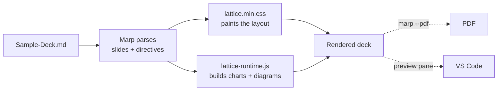

<!-- _class: title -->
<!-- _paginate: false -->
<!-- _header: '' -->
<!-- _footer: '' -->

# Markdown in. Boardroom out.

`Lattice · the copy-and-go kit`

Everything on the next twelve slides is written in plain Markdown, in this file.
Read it in your editor and in the render side by side — they are the same thing.

---

<!-- _class: premise -->

## This deck documents itself.

Every slide shows a component **and** the Markdown that made it.

1. One file
   - The whole deck. Nothing else to set up.
2. One folder
   - Everything it needs sits beside it.
3. One line
   - Picks the layout. Sixty-one to choose from.

---

<!-- _class: list-steps -->

## Three steps to a rendered deck.

1. Copy the folder
   - Drop these files anywhere. Keep them together — paths are relative.
2. Open it in VS Code
   - With the Marp extension installed, the preview pane opens on this file.
3. Edit and watch
   - Change a heading. The preview follows. That is the whole loop.

---

<!-- _class: split-panel -->

`How a slide is written`

## One comment picks the layout.

Everything else stays Markdown.

- A comment names the layout
  - `<!-- _class: kpi -->` and the next slide is a KPI row.
- Headings carry the argument
  - Write the heading as a sentence, not a label. It is the slide's claim.
- Lists become structure
  - A nested title-and-body pair becomes a card, a step, or a tile.

---

<!-- _class: code -->

## Seven keys of front matter, then one comment per slide.

```yaml
marp: true          # activates the Marp extension / marp-cli
theme: cuoio        # the palette; cuoio is the default
paginate: true      # page numbers
size: hd            # 16:9 at 1280x720
class: dark         # optional — flips the whole deck to dark
header: "Lattice · Sample Deck"
footer: "Copy this folder. Edit this file."
```

`class:` is Marp's own key: whatever you put there lands on every slide, so
`class: dark` reaches Lattice's `dark` styling with nothing else to configure.

Then each slide opens with one comment naming its layout — `_class: kpi`,
`_class: diagram`, `_class: quote`. That comment is the entire API.

---

<!-- _class: kpi -->

## What the folder costs you.

1. 1
   - folder to copy
   - keep it together `Complete`
2. 5 MB
   - on disk, minified
   - CSS + runtime + fonts
3. 61
   - layouts available
   - none to install `Included`
4. 0
   - build steps
   - before first render `None`

---

<!-- _class: diagram -->

## From this file to a rendered slide.



---

<!-- _class: radar -->

`Scored 0–10`

## Charts are Markdown too — no image, no plugin.

- This deck
  - Portability `9`
    - One folder, relative paths, nothing installed
  - Fidelity `8`
  - Editability `10`
  - Setup cost `10`
  - Version control `10`

---

<!-- _class: matrix-grid -->

## What renders where — read this before you trust a surface.

Both marp-cli routes drive a real browser, so the runtime runs and everything
below is filled. The preview pane's two empty cells are unconfirmed, not broken —
open this deck in VS Code and you will know.

`Surface`  `Runtime executes`

| Feature | `marp --pdf` | `marp --html` | Preview pane |
| ---------------- | :--: | :--: | :--: |
| Layout & palette | [x] | [x] | [x] Yes |
| Typography       | [x] | [x] | [x] Yes |
| Mermaid diagrams | [x] | [x] | [ ] |
| Native charts    | [x] | [x] | [ ] |

---

<!-- _class: math -->

`Typeset by whichever engine your tool uses`

## Equations are inline in the Markdown.

$$ \sigma(z)_i = \frac{e^{z_i}}{\sum_{j=1}^{K} e^{z_j}} $$

- $z$ — the raw score vector, length $K$
- $\sigma(z)_i$ — probability assigned to class $i$
- $\sum_j e^{z_j}$ — the normalizer; outputs sum to 1
- Written as `$$ … $$` between blank lines

---

<!-- _class: list-tabular -->

## The parts you will touch, and what each one does.

1. `Sample-Deck.md`
   - This deck. Your starting point — edit it in place.
2. `lattice.min.css`
   - The engine. Every layout and token lives here.
3. `cuoio.min.css`
   - The palette. A dark one ships beside it.
4. `lattice-runtime.min.js`
   - Builds charts and diagrams in the browser.
5. `mermaid-v11.min.js`
   - Third party. Required for diagram slides.
6. `fonts/`
   - Thirty-seven files. Drop them and type falls back.

The config files and `NOTICE.md` are listed in the README.

---

<!-- _class: quote -->

## "Write the deck in Markdown, render it through a real browser."

That is the one idea Lattice keeps from Marp. Everything else — the layouts, the
tokens, the charts — is what gets added on top of it.

---

<!-- _class: closing -->
<!-- _paginate: false -->
<!-- _header: '' -->
<!-- _footer: '' -->

# Now change something.

`Edit this file · the preview follows`

Swap `theme: cuoio` for another palette. Delete a slide. Add your own.
Nothing here needs a build step to try.

<!-- markdownlint-disable MD033 -->
<script src="mermaid-v11.min.js"></script>
<script src="lattice-runtime.min.js"></script>
