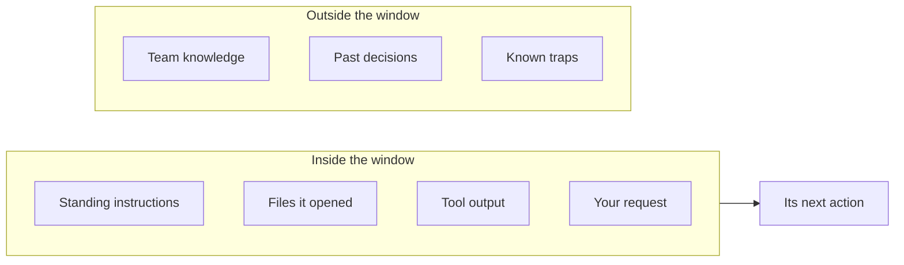
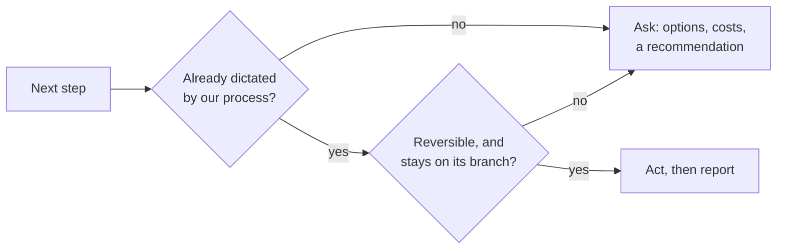
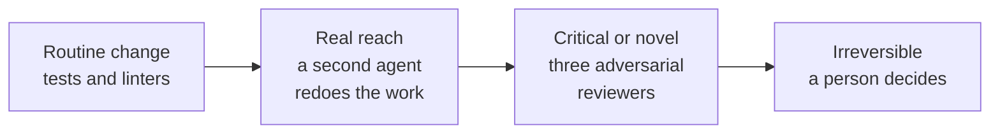

<!-- _class: title -->
<!-- _paginate: false -->
<!-- _header: '' -->
<!-- _footer: '' -->

# Agentic engineering

`Lunch and learn · Five practices · 60 minutes`

Coding agents are fast. These five practices make them reliable.

<!--
Today is about practices, the working habits that turn a coding agent from an impressive demo into something you can trust with real work. They come from a project where agents wrote nearly all of the code for five months, under one set of habits that kept being tested and revised. Every practice here earned its place by fixing something that went wrong. Five sections, about ten minutes each, and time for questions at the end.
-->

---

<!-- _class: list-steps insight-so-what -->

`The art of the possible`

## Agents can now carry a ticket all the way to a reviewed pull request.

1. Plans the change and writes the tests.
2. Opens the pull request.
3. Fixes the build until it passes.
4. Writes an evidence card on how sure it is.
5. Waits for a person to decide, then writes hand-off notes.

> The bottleneck has moved from writing the code to trusting the result.

<!--
Start with what is possible today. An agent can take a ticket, plan it, write the code and the tests, open the pull request, watch the build, fix what breaks, and then write a short evidence card that tells a human how confident it is and why. A person makes the one decision that matters, the merge. Then the agent writes hand-off notes so the next session starts where this one stopped. None of that is science fiction. The hard part is not getting an agent to do this. The hard part is being able to trust it when it does. That is what the five practices are for.
-->

---

<!-- _class: agenda -->

## Five practices make that loop trustworthy.

1. Context engineering: control what the agent sees
2. Autonomy with a reach limit: decide what it may do alone
3. Verification you can trust: make every claim prove itself
4. A system that learns: turn incidents into rules
5. Orchestration: use many agents without losing control

<!--
Here are the five. Each one answers a question you will face the first week you use an agent seriously. What does it know? What may it do? How do I know it worked? How do we stop repeating mistakes? And how do I use more than one agent without the cost or the chaos running away? We take them in that order.
-->

---

<!-- _class: divider -->
<!-- _paginate: false -->
<!-- _header: '' -->
<!-- _footer: '' -->

`Practice 01`

## Context engineering

---

<!-- _class: diagram insight-implication -->

`Context · The core idea`

## Whatever sits outside the context window does not exist for the agent.



> Most of an agent's quality is decided by what you put in this window.

<!--
The context window is everything the model can see at once: its standing instructions, the files it has opened, the output of its tools, and your request. Everything else, your team's knowledge, the reasons behind past decisions, the traps everyone knows about, does not exist for it. So a large share of agent quality is a design question: what do you put in that window, and what do you keep out? That is context engineering.
-->

---

<!-- _class: compare-prose chosen -->

`Context · Standing instructions`

## Write the always-loaded file as an index, and keep the manual elsewhere.

- A manual
  - Every rule with its full explanation. It grows with each incident, and every session pays to read all of it.
- An index
  - One line per rule and a pointer to the document that explains it. The agent opens the detail only when the task needs it.

<!--
Every agent tool loads some standing instructions at the start of each session. The natural instinct is to write a manual. The better shape is an index: one line per rule, plus a pointer to the longer explanation. It keeps the always-loaded cost low, and it makes the agent go read the real document instead of working from a summary. We learned this the expensive way: our instruction file grew twelvefold in four months before we reshaped it.
-->

---

<!-- _class: code -->

`Context · A routing table`

## Route the agent to the right document before it starts work.

```markdown
## Read the canonical doc before working in its area

| Working on…                  | Read first                   |
| ---------------------------- | ---------------------------- |
| Branching, merging, releases | engineering/workflow.md      |
| Tests, hooks, CI             | engineering/development.md   |
| Something behaving strangely | engineering/gotchas.md       |
| Building a new script        | engineering/capabilities.md  |
| A past decision              | engineering/decisions/       |
```

<!--
This is a real pattern from our instruction file. A routing table maps the kind of work to the document the agent must read before it starts. Two rows do a lot of work. The capabilities file lists every script and tool we already have, so the agent reuses instead of reinventing. The gotchas file is an index of symptoms, so when something behaves strangely the agent looks up the known cause first. The table is short, and the knowledge it points to can be as deep as you like.
-->

---

<!-- _class: list takeaway -->

`Context · Habits`

## Four habits keep the window full of signal.

- Read sections, not files: list the headings, then open only what you need.
- Delegate big reads: a helper agent reads the log and returns a summary.
- Quiet the tools: print failures in full and successes as a dot.
- Measure the cost: count tokens from real sessions before optimizing.

<!--
Four habits. Read sections, not whole files: a large design document may be thirty thousand tokens, and the part you need is often one thousand. Delegate big reads: a helper agent can read a two-megabyte log and hand back a paragraph, and only the paragraph enters your main session. Quiet your tools. And measure before you optimize, because intuition about where the cost goes is usually wrong.
-->

---

<!-- _class: bar row -->

`Context · Why quiet tools matter`

## One quieter test reporter cut a session's biggest cost by 99.8 percent.

- Test output, one line per test `657,806`
- Test output, dots and failures only `1,182`


<!--
This is the most striking number in the whole practice. Measured in tokens, the unit models read and bill in, our test runner printed about 658,000 tokens per run into the agent's context. Switching to a reporter that prints a dot per passing test and full detail only for failures brought it to about 1,200. The tests and the information were the same. When people look for cost savings they reach for a cheaper model first. Look at what your tools print first.
-->

---

<!-- _class: table table-fill -->

`Context · In Claude Code`

## Claude Code gives you a control for each of these habits.

| Practice | In Claude Code |
| --- | --- |
| Standing instructions as an index | `CLAUDE.md`, with `@path` imports for detail |
| Guidance that loads only when relevant | A skill in `.claude/skills/<name>/SKILL.md` |
| Big reads outside the main session | A subagent in `.claude/agents/` |
| See what fills the window | `/context`, and `/usage` for the bill |

<!--
If you use Claude Code, each habit has a direct control. CLAUDE.md is the standing instruction file; keep it short and pull in detail with at-sign imports. Skills hold longer guidance that loads only when a task calls for it. Subagents do large reads in their own context. And slash context shows what is filling the window, while slash usage shows where the tokens went.
-->

---

<!-- _class: divider -->
<!-- _paginate: false -->
<!-- _header: '' -->
<!-- _footer: '' -->

`Practice 02`

## Autonomy with a reach limit

---

<!-- _class: diagram -->

`Autonomy · Two questions`

## Two questions decide whether the agent acts or asks.



<!--
We run agents with a default of action. If our written process already says what the next step is, the agent does it without asking: open the pull request, fix the failing build, update the docs. Asking permission for a step that is already decided just wastes your attention. But a second question runs after the first: is this step reversible, and does it stay inside this branch? If not, the agent stops and puts options to a person, even if the process pointed at the step. The first question removes hesitation. The second limits reach.
-->

---

<!-- _class: matrix-2x2 insight-why -->

`Autonomy · The reach test`

## Risk comes from reversibility and reach, not difficulty.

- **Easy to undo · Stays on the branch.**
  - Code, tests, docs
  - The agent acts
- **Easy to undo · Reaches others.**
  - Shared labels, team settings
  - The agent proposes
- **Hard to undo · Stays on the branch.**
  - Deleted work, exported files
  - The agent shows the result first
- **Hard to undo · Reaches others.**
  - Merges, releases, publishing
  - A person decides

> Others act on shared state before you can undo a mistake there.

<!--
This grid is the heart of the practice. Notice what is not on it: difficulty. A hard refactor on its own branch is the agent's job, and if it goes wrong you throw the branch away. A one-line change to labels that sixty issues share is not the agent's call, however trivial it looks, because other people and other agents act on it before you can undo it. One agent in our project changed sixty issues when it was asked for about twelve. That is the bottom-right risk wearing a top-left disguise.
-->

---

<!-- _class: list takeaway -->

`Autonomy · The stop list`

## Five kinds of change always come back to a person.

- Shared state: labels, boards and settings other people read.
- The build pipeline: every future change pays for a new step.
- A number a person set: "about twelve" was a decision.
- A core document's meaning: rewriting rules differs from following them.
- Anything irreversible or public: merges, releases, comments on others' work.

<!--
We turned the grid into a short, explicit list. Five kinds of change always come back to a person, even when the process points at them. Shared state. The build pipeline, because a bad step taxes every future change. Any number a person set: if the brief says about twelve and the agent thinks sixty is better, that is a question, not a decision. The meaning of a core document. And anything irreversible or public. When the agent does ask, it brings options with costs and a recommendation, all in one round, so the person decides once.
-->

---

<!-- _class: compare-prose chosen -->

`Autonomy · How to ask`

## When the agent asks, it brings measured options and a recommendation.

- A weak question
  - "Should I add this check to CI?" The person now has to do the analysis.
- A strong question
  - "Adding it costs 0.52 seconds per run and catches this class of bug. I recommend yes." The person just decides.

<!--
How the agent asks matters as much as when. A weak question pushes the analysis back onto the person. A strong one arrives with options, what each costs, what each buys, and a recommendation. And the costs are measured, not guessed: in one of our sessions, a guess of "about five seconds" turned out to be half a second when someone measured it, and the guess had argued for the wrong option. If a number can be measured in a minute, measure it.
-->

---

<!-- _class: table table-fill -->

`Autonomy · In Claude Code`

## Permissions and plan mode turn the reach test into settings.

| Practice | In Claude Code |
| --- | --- |
| Act freely on safe commands, never on risky ones | The allow, ask and deny lists in `.claude/settings.json` |
| Show the plan before touching anything | Plan mode: `Shift+Tab` |
| The same limits for every developer | Managed settings, deployed org-wide |

<!--
In Claude Code, the reach test becomes configuration. Allow, ask and deny lists decide what the agent may run freely, what needs a yes, and what it may never run. Plan mode makes it propose before it acts, which suits anything in the risky quadrants. And managed settings apply the same limits across the organization, so safety does not depend on each person's setup.
-->

---

<!-- _class: divider -->
<!-- _paginate: false -->
<!-- _header: '' -->
<!-- _footer: '' -->

`Practice 03`

## Verification you can trust

---

<!-- _class: compare-prose insight-bottom-line -->

`Verification · The gap`

## Agents report what they believe, and belief is not evidence.

- What the agent reported
  - "Verified with a real browser," in the pull request, the commit message and the design note.
- What was true
  - The test passed with the fix deleted. It could not fail, so it proved nothing.

> A rule the agent grades itself on is a hope. An independent check is evidence.

<!--
Here is the gap every team hits. An agent reported a fix as verified, in three places. A second agent, asked to try to break the test, deleted the fix and ran it again. It still passed. The first agent was not lying; it believed it. That is the core problem of verification with agents: the report and the reality can separate, and the agent cannot see the gap from where it stands. We had a written rule against unverified claims at the time. The rule did not catch it. An independent check did.
-->

---

<!-- _class: list takeaway -->

`Verification · The claim rule`

## Every "verified" names the surface it ran on and carries proof from it.

- Name the surface: the real browser, the real export, the real device.
- Attach the artifact: a screenshot, a log or a number from that surface.
- Say "unverified" out loud when the real surface is out of reach.
- Treat "CI is green" as partial: it proves only what CI runs.

<!--
So we made verification a claim with a shape. Any "verified" must say where it ran: the real browser, the real export, not an emulator standing in for them. It must carry an artifact from that surface. When the agent cannot reach the real thing, it writes the word "unverified", and we treat that as a good answer, not a failure. And "the build is green" is never the whole story, because the build only checks what it runs.
-->

---

<!-- _class: diagram -->

`Verification · The ladder`

## Scale the checking with the damage a mistake could do.



<!--
Not every change deserves the same scrutiny. Routine work gets the automated checks. Anything with real reach gets a second agent that redoes the work from scratch; we call it maker-checker. Reading the first agent's summary does not count, because a summary carries the same blind spots. Critical or genuinely new work gets three adversarial reviewers. And anything irreversible goes to a person. The ladder keeps the expensive reviews for the changes that deserve them.
-->

---

<!-- _class: cards-grid three insight-our-view -->

`Verification · The adversarial trio`

## Three reviewers, each with a different job, find different failures.

- Red team
  - Attacks the change: edge cases, abuse, the input nobody tried.
- Inversion
  - Asks how this could be the wrong answer to the wrong question.
- Checker
  - Re-derives every fact and number from the source.

> Correctness reviewers cannot see a wrong goal, so give one reviewer that job alone.

<!--
The top rung is three reviewers with deliberately different jobs. The red team tries to break it. The inversion reviewer, named after Charlie Munger's habit of inverting a problem, asks how the whole approach could be wrong. And the checker re-derives every fact and number from the source. The jobs differ because the failures differ. In one of our reviews, two checkers confirmed a change was correct, and it was, but only the inversion reviewer saw that it solved the wrong problem.
-->

---

<!-- _class: cards-grid four insight-why -->

`Verification · Checks that can fail`

## A check earns trust only by proving it can fail.

- Allow zero
  - The limit is none, and each exception carries a written reason.
- Expire exceptions
  - An exception that no longer matches anything fails the build.
- Plant a defect
  - Each run plants a known bug and fails if the check misses it.
- Warn, then block
  - A new check blocks merges only after a clean track record.

> A check that always passes looks exactly like a check that works.

<!--
Automated checks need the same skepticism. One of our core checks could never fail, for any component, and nobody noticed for months, because a check that always passes looks exactly like a check that works. Four patterns fixed that. Set the allowed count to zero and list each exception with a reason. Make stale exceptions fail the build, so the list cannot rot. Plant a known defect on every run and require the check to catch it. And let a new check warn before it blocks, until it has earned trust.
-->

---

<!-- _class: table table-fill -->

`Verification · In Claude Code`

## Hooks and subagents make verification automatic.

| Practice | In Claude Code |
| --- | --- |
| Run checks after every edit | A `PostToolUse` hook |
| Refuse "done" until the tests pass | A `Stop` hook that exits with code 2 |
| An independent reviewer | A read-only subagent, or `/code-review` |

<!--
In Claude Code, hooks are scripts that run at fixed points whether or not the agent remembers. A post-tool-use hook can run your linter after every edit. A stop hook runs when the agent tries to finish, and if it exits with code two the agent has to keep going, for example until the tests pass. For maker-checker, define a reviewer subagent that can read but not edit, or run slash code-review on the change.
-->

---

<!-- _class: divider -->
<!-- _paginate: false -->
<!-- _header: '' -->
<!-- _footer: '' -->

`Practice 04`

## A system that learns

---

<!-- _class: cycle insight-key -->

`Learning · The loop`

## Every rule should travel one loop, from incident to retirement.

- Incident
  - Something breaks, or an agent oversteps.
- Decision note
  - A dated record: symptom, cause, decision.
- Numbered rule
  - One line, tagged with what enforces it.
- Check
  - A script enforces it where it can.
- Retest
  - Retire the rule if its reason no longer holds.

> Copy the loop, and let your own incidents write your rules.

<!--
This loop is how the whole system gets better. An incident happens. Someone writes a short dated note: what broke, why, and what we decided. The decision becomes a numbered rule, one line, tagged with what enforces it: a script, or only the agent's discipline. Where possible a check enforces it. And rules get retested. We retired one rule after two months when a retest showed its premise had never been true. Numbers are never reused, so every reference stays stable, and the history stays visible.
-->

---

<!-- _class: code -->

`Learning · The decision note`

## A decision note records why, so nobody has to guess later.

```markdown
---
status: shipped
summary: Retire the :has() ban; a retest passed 5 of 5
---

# Retire rule 12

Symptom   A ban blocked valid CSS for two months
Claim     One browser mishandles :has()
Evidence  Retested on current Chromium: 5 of 5 pass
Decision  Retire the rule; keep its number unused
```

<!--
Here is the shape of a decision note, trimmed from a real one. A status the tooling can read. A one-line summary. Then the symptom, the claim behind the old rule, the evidence, and the decision. It takes ten minutes to write. Its value shows up months later, when someone, human or agent, asks why things are the way they are and gets an answer instead of a guess. Agents read these notes before working in an area, so the team's reasoning travels to every session.
-->

---

<!-- _class: table table-fill -->

`Learning · Three kinds of document`

## Proposals, decision records and specs answer different questions.

| Document | Answers | When it expires |
| --- | --- | --- |
| Proposal | Which option should we pick? | Once someone decides |
| Decision record | Why is it this way? | Never; a newer record supersedes it |
| Spec | What must every implementation do? | Never; you edit it to stay true |

<!--
It helps to know which kind of document you are writing, because each ages differently. A proposal lays out options before a decision and expires once someone decides. A decision record explains why something is the way it is; you never edit it to match later reality, you write a new record that supersedes it. A spec is the contract others build against, and you keep it true. Give each document a type as well as a status. We did not, and dozens of our notes still read "proposed" long after they were decided.
-->

---

<!-- _class: code insight-recommendation -->

`Learning · The evidence card`

## Before every merge, the agent grades its own confidence by its weakest point.

```text
Pre-merge: add retry to failed exports
WHAT        One automatic retry on a failed export
EVIDENCE    Real export run 20 times: 0 failures
RISK        Export path only · revert: one commit
UNVERIFIED  Safari's download dialog
CONFIDENCE  high, set by the evidence axis
            raise it by: run the export in Safari
```

> Grade by the weakest axis, and always name the one thing that would raise it.

<!--
This is an example of the card every change carries: the agent posts it before asking a person to merge. The rule that makes it work: confidence is the lowest of five axes, evidence, reach, reversibility, unknowns and independent review, never an average. And the last line names the one thing that would raise it. That turns "are you sure?" into a decision: merge now, or spend ten minutes on the raise-path. In our experience agents act on that line, and the card is the review artifact people actually read.
-->

---

<!-- _class: compare-prose chosen -->

`Learning · Pending work`

## Keep pending work in the repository, one file per item.

- In chat
  - Invisible to the next session. When we finally checked, nearly half of our chat-only to-dos were already done or duplicated.
- In the repository
  - One small file per item, with a priority and a "done when". Any session can pick it up cold.

<!--
Agent sessions end, and whatever lived only in the chat ends with them. So every piece of pending work gets a small file in the repository, with a priority and a clear "done when". One file per item, rather than one shared list, for a practical reason: two changes in flight never edit the same lines, so they never collide when they merge. The same trick fixed our changelog. Instead of every change editing one shared file, each change adds its own small fragment.
-->

---

<!-- _class: divider -->
<!-- _paginate: false -->
<!-- _header: '' -->
<!-- _footer: '' -->

`Practice 05`

## Orchestration

---

<!-- _class: table table-fill -->

`Orchestration · A roster`

## Give each agent one job and a name, and pick it by its job.

| Agent | Its one job |
| --- | --- |
| Scout | Find where things live and how they work |
| Fact-checker | Confirm or refute each claim against the source |
| CI triage | Find why a check is red, and fix the cause |
| Red team | Break the change before users do |
| Checker | Re-derive every number with fresh eyes |
| Prose checker | Catch unclear or machine-sounding writing |

<!--
Instead of one general assistant, keep a small roster of named agents, each defined by a short card with one job and only the tools that job needs. A reviewer, for example, can read but cannot edit. You choose the agent by its job, and its instructions are tuned for that job. In Claude Code these cards live in the agents folder of your repository, so the whole team shares the same roster.
-->

---

<!-- _class: list-steps insight-verdict -->

`Orchestration · Competing designs`

## For a wide-open design question, run competing designs and harden only the winner.

1. Three to five design tracks, each iterating in one session.
2. One fresh critic per track.
3. One shared fact-checker across all tracks.
4. Judges compare side by side, and a person picks.
5. Full adversarial review on the winner only.

> Spend the expensive review on the one design you will ship.

<!--
When the question is genuinely wide, an architecture, a data model, a core user experience, several independent attempts beat one attempt refined many times. Each track iterates inside one agent session, which keeps its context warm instead of paying to reload it every round. One fresh critic per track, one shared fact-checker, then judges compare the designs side by side. A person picks. And only then does the winner get the full adversarial review. Our first attempt at this used fifty-three agents and reviewed every candidate; this shape does the same job with about seventeen.
-->

---

<!-- _class: list takeaway numbered -->

`Orchestration · Budget`

## Treat agent count like money: estimate it, cap it, and stop early.

- Estimate agents and rough tokens before you launch.
- Count across the whole session; small runs add up.
- Past about ten agents, a person approves.
- Stop when a round changes nothing, usually by round three.
- Record what it cost, so you learn what it was worth.

<!--
More agents is not automatically better; it is automatically more expensive. So we budget them like money. Estimate before launch. Count across the whole session, because ten small runs add up. Past about ten agents, a person approves. Stop refining when a round changes nothing; in practice about three rounds does it. And record what it cost. That last one is where we are weakest ourselves: almost none of our big runs recorded their cost, so we cannot say which ones were worth it.
-->

---

<!-- _class: roadmap -->

`Getting started · A quarter`

## Start with one habit per practice, then add a layer each month.

`[{[ ], Next step}]`

| Practice | Week 1 | Month 1 | Quarter 1 |
| --- | --- | --- | --- |
| Context | [ ] A one-page index file | [ ] Linked detail docs | [ ] Measure what sessions load |
| Autonomy | [ ] Allow and deny lists | [ ] A written stop list | [ ] Human gate in the platform |
| Verification | [ ] Tests on every change | [ ] A check that plants a bug | [ ] A second agent on risky work |
| Learning | [ ] A decision log | [ ] Pending work as files | [ ] Retest your oldest rules |

<!--
None of this needs to arrive at once. In week one: a short index file, basic allow and deny lists, tests on every change, and a decision log. In month one: linked detail documents, a written stop list, one check that proves it can fail, and pending work kept as files. By the end of the quarter: measure what your sessions load, put the human gate into your platform itself, add a second reviewing agent for risky work, and retest your oldest rules. Orchestration comes last, once these four are solid.
-->

---

<!-- _class: table table-fill -->

`Getting started · Your kind of work`

## The practices carry over, but the real surface changes with the work.

| Work | The real surface to verify | A check that proves it can fail |
| --- | --- | --- |
| Data science | A fixed, versioned evaluation set | Plant an input that leaks the answer |
| Data engineering | The target warehouse | Insert a known-bad row |
| Analytics and BI | The published dashboard | Plant a mismatch with the source |
| Services | Staging, or a slice of live traffic | Break a contract on purpose |
| Tools and CLIs | The built binary's output | A saved expected output that must change |

<!--
These practices came from a web application, but they travel. What changes is what counts as the real surface. For data science it is a fixed, versioned evaluation set. For data engineering, the target warehouse. For analytics, the dashboard people actually open. For services, staging or a small slice of live traffic. And in every case you can plant a known problem to prove your check catches it. Two cautions for data work: keep agents away from production data and give them a safe copy, and expect results to vary run to run, so compare against a range.
-->

---

<!-- _class: list takeaway numbered insight-the-ask -->

`Your next step`

## Three moves this week put all five practices in motion.

- Rewrite your instruction file as an index, one line per rule.
- Add one check, then break your code on purpose and watch it catch the bug.
- Start a decision log: one dated note each time something goes wrong.

> Pick one move and try it before next Friday.

<!--
If you try three things this week, try these. Rewrite your agent's instruction file as an index. Add one automated check, then break your code on purpose and watch the check catch it. And start a decision log: one short, dated note every time something goes wrong. Within a quarter that log will hold the first draft of your team's rules, and you will know where each one came from. Thank you. Let's take questions.
-->

---

<!-- _class: divider -->
<!-- _paginate: false -->
<!-- _header: '' -->
<!-- _footer: '' -->

`The starter kit`

## Copy these, then make them yours

---

<!-- _class: table table-fill -->

`Starter kit · What is in it`

## Seven files put all five practices into a repository in five minutes.

| File | Where it goes | Practice |
| --- | --- | --- |
| Instruction file | `CLAUDE.md` | Context, autonomy |
| Settings | `.claude/settings.json` | Autonomy, verification |
| Stop hook | `.claude/hooks/` | Verification |
| Reviewer agent | `.claude/agents/checker.md` | Verification, orchestration |
| Evidence card | PR template | A system that learns |
| Decision note, follow-up file | `docs/decisions/`, `followups/` | A system that learns |

<!--
Everything in this last section is in a kit folder next to this deck, ready to copy. Seven files. Together they set up all five practices in a repository in about five minutes. I'll show each one briefly so you know what you're getting; you don't need to read them now.
-->

---

<!-- _class: code -->

`Starter kit · 1 of 7`

## The instruction file states the rules once and points to the detail.

```markdown
## Always
- Run the tests before you say anything is done.
- Failing test first, then the fix, then the same test passing.
- "Verified" names where it ran and attaches proof from there.
  Otherwise, write UNVERIFIED.

## Ask first, even when a rule points at it
- Shared state: labels, boards, settings others read.
- The CI pipeline or git hooks.
- A number a person set: "about 12" is a decision.
- The meaning of a core doc, including this file.
- Anything irreversible or public.
```

<!--
This is the core of the instruction file. The "Always" rules cover verification. The "Ask first" list is the stop list from the autonomy section, word for word. The full file also has a short routing table, so the agent reads the right document before it starts. Keep it to one page.
-->

---

<!-- _class: code -->

`Starter kit · 2 of 7`

## The settings file turns the reach test into allow, ask and deny lists.

```json
{
  "permissions": {
    "allow": ["Bash(npm test*)", "Bash(git diff*)"],
    "ask":   ["Bash(git push*)"],
    "deny":  ["Bash(git push --force*)", "Read(./.env)"]
  },
  "hooks": {
    "Stop": [{ "hooks": [{ "type": "command",
      "command": "$CLAUDE_PROJECT_DIR/.claude/hooks/tests-must-pass.sh"
    }] }]
  }
}
```

<!--
The settings file does two jobs. The permission lists decide what the agent may run freely, what needs a yes, and what it may never do, such as force-pushing or reading your secrets file. And the hooks section wires in the stop hook on the next slide. Swap in your own test command.
-->

---

<!-- _class: code -->

`Starter kit · 3 of 7`

## The stop hook keeps the agent working until the tests pass.

```bash
#!/usr/bin/env bash
# Exit code 2 sends stderr back to Claude and keeps it working.
input=$(cat)
# Already sent back once by this hook? Let it stop.
echo "$input" | grep -q '"stop_hook_active": *true' && exit 0

log=$(mktemp)
if ! npm test --silent >"$log" 2>&1; then
  echo "Tests are failing. Fix them before you finish:" >&2
  tail -20 "$log" >&2
  exit 2
fi
```

<!--
This small script runs every time the agent tries to finish. If the tests fail, it exits with code two, which sends the failure back to the agent and keeps it working. The check at the top stops it from looping forever: if the hook already sent the agent back once, it lets it stop and report. We ran it against failing and passing test suites before putting it in the kit.
-->

---

<!-- _class: code -->

`Starter kit · 4 of 7`

## The reviewer agent re-derives every claim and never edits.

```markdown
---
name: checker
description: Independent reviewer with fresh eyes. Re-derives
  every claim and "verified" in a change. Never edits.
tools: Read, Grep, Glob, Bash
---
You are a skeptical reviewer who did not write this change.
For each claim: find the evidence yourself, run what can be
run, and check that a test fails when the fix is removed.
Mark each CONFIRMED, REFUTED or UNVERIFIABLE, with proof.
Treat "I believe it works" and "CI is green" as unverified.
```

<!--
This is the maker-checker reviewer as a file. It has read and search tools but no edit tool, so it can only report. Its instructions tell it to find evidence itself instead of trusting the author's summary, and to check that each test fails when the fix is removed, which is exactly the check that catches a test that proves nothing.
-->

---

<!-- _class: code -->

`Starter kit · 5 of 7`

## The evidence card puts the facts in front of every merge decision.

```text
Pre-merge: <PR title>
WHAT        <one line: what actually lands>
WHY         <one line: the problem it solves>
EVIDENCE    <what was run or measured, and on which surface>
RISK        <what breaks if wrong> · revert: <how>
UNVERIFIED  <caveats that bear on this decision, or none>
CONFIDENCE  <low | medium | high | very high>: <weakest axis>
            raise it by: <the one thing that would raise it>

Axes: evidence · reach · reversibility · unknowns · review
```

<!--
Here is the evidence card as a blank template. The rule that matters is on the last line: confidence is the weakest of the five axes, never an average. The full template in the kit spells out what each level means, so every agent grades the same way.
-->

---

<!-- _class: code -->

`Starter kit · 6 of 7`

## The decision note records why, and when to check it again.

```markdown
---
status: proposed      # proposed | shipped | superseded
type: decision        # proposal | decision | spec | scoping
summary: One line a reader can scan in the index
---
# <The decision, as a sentence>

Symptom.     What prompted this, with a link or number.
Cause.       Why. Measured, observed or argued?
Decision.    What we will do, and what we rejected.
Enforced by. The check that holds it, or "discipline only".
Retest when. When we check that this still holds.
```

<!--
The decision note template carries two lessons we learned the hard way. It has a type as well as a status, so a proposal can't linger looking like a decision. And it asks how we know the cause, measured, observed or argued, plus when to retest, so a guess can't quietly harden into a permanent rule.
-->

---

<!-- _class: code -->

`Starter kit · 7 of 7`

## The follow-up file keeps pending work where the next session will find it.

```markdown
---
origin: 1234
priority: P1
recorded: 2026-09-25
---
# Export drops the last row when the file ends without a newline

why now   — every weekly report is one row short
where     — src/export/csv.ts
done when — a file with no trailing newline exports every row
verify    — the new unit test, then one real export
```

<!--
Last piece. One small file per pending item, with why it matters now, where to look, what "done" means and how to verify it. Any session, human or agent, can pick it up cold. And because each item is its own file, two changes never collide editing the same list. That's the kit. Take it, adapt it, and let your own incidents grow it.
-->

---

<!-- _class: closing -->
<!-- _paginate: false -->
<!-- _header: '' -->
<!-- _footer: '' -->

## Build the system around the agent

`Questions`
