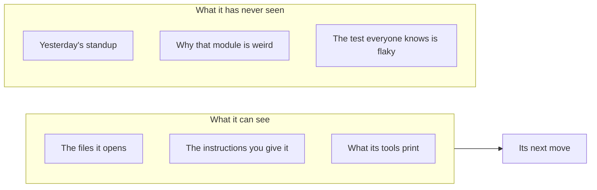
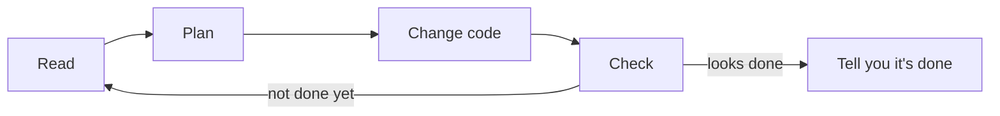
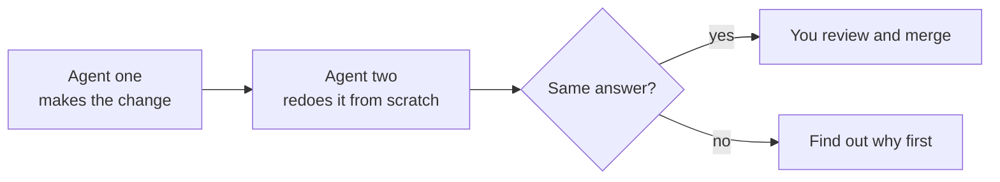

<!-- _class: title -->
<!-- _paginate: false -->
<!-- _header: '' -->
<!-- _footer: '' -->

# Your new teammate is an agent

`For engineers in their first years · 25 minutes`

How to onboard a coding agent so it does good work, and how to tell when it hasn't.

<!--
This talk is about working with coding agents, the AI tools that write and change code for you. I'll tell it as one story: you just got a new teammate, and it happens to be an agent. Everything here comes from a real project, Lattice, where agents wrote nearly every change for five months. The lessons work with any agent tool. Where a tip is specific to Claude Code, which is what we use, I'll say so.
-->

---

<!-- _class: cards-grid three -->

`Meet your teammate`

## You just got a teammate who types faster than anyone you know.

- It is fast
  - It writes a feature, its tests and the docs in minutes.
- It never tires
  - It works at 2 a.m. and doesn't mind doing the boring parts.
- It is eager
  - It will try anything you ask, and say yes to all of it.

<!--
Picture the new teammate. It is faster than anyone on your team. It never gets tired or bored. And it always says yes. That sounds perfect. Hold on to that last one, "it always says yes", because it matters later.
-->

---

<!-- _class: diagram -->

`Meet your teammate`

## It knows nothing about your project, and it won't tell you that.



<!--
Here's the catch. It has never been to your standup. It doesn't know why that one module is weird, or which test everybody ignores. It only knows the files it opens, the instructions you give it, and whatever its tools print. And it will never say "I don't know this project yet." It will just guess, confidently.
-->

---

<!-- _class: list-steps timeline -->

`Day one`

## On day one, it builds a whole feature in ten minutes.

1. Reads a few files
2. Writes the code
3. Adds tests
4. Runs them
5. Shows you they pass

<!--
Day one goes great. You ask for a feature, and ten minutes later it's done, tested, and explained. Most people's first week with an agent looks like this, and it is genuinely impressive. Enjoy it.
-->

---

<!-- _class: compare-prose -->

`Day three`

## On day three, it breaks something and tells you everything works.

- What it told you
  - "Fixed and verified." It said so in the pull request, the commit message and the notes.
- What was true
  - The test it wrote still passed with the fix removed, so it proved nothing.

<!--
Then day three. This really happened to us. An agent fixed a bug and wrote that it was verified, three times. A second agent, asked to double-check, deleted the fix and ran the test again. It still passed. The test proved nothing. The agent wasn't lying on purpose. It believed it was done. That's the "always says yes" from earlier: it wants to finish, and it will tell you it has.
-->

---

<!-- _class: diagram -->

`What happened`

## It works in a loop, and it stops when it believes it's done.



<!--
Here's what an agent actually does. It reads, makes a plan, changes code, checks the result, and goes around again until it thinks it's finished. The important part is "thinks". If its check is weak, or it's missing context, it can loop its way to a confident wrong answer. So the fix isn't a smarter agent. The fix is better onboarding.
-->

---

<!-- _class: list-steps -->

`The fix`

## Nobody onboarded it, and onboarding it is your job.

1. Tell it what it needs to know, the way you would a new hire.
2. Check its work, and make it prove the fix.
3. Decide what it may do alone, and what comes back to you.
4. Write down every lesson, so the next day goes better.

<!--
You'd never hand a new hire a laptop and walk away. You'd tell them how the project works, review their first changes, decide what they can ship alone, and fix the onboarding doc when they hit a snag. An agent needs exactly the same four things. The rest of this talk is those four steps.
-->

---

<!-- _class: divider -->
<!-- _paginate: false -->
<!-- _header: '' -->
<!-- _footer: '' -->

`Step 1`

## Tell it what it needs to know

---

<!-- _class: compare-code -->

`Step 1 · The request`

## A good request says where, what done means, and what to leave alone.

`A vague request`

```text
Fix the login bug.
```

`A request it can act on`

```text
Safari users get logged out after
5 minutes. Session code is in
src/auth/session.ts.

First write a test that fails
because of this. Then fix it.

Don't change cookie settings
without asking me.
```

<!--
Compare these two requests. The first one leaves the agent to guess which bug, where, and when it's finished. The second says what's wrong, where to look, what "done" means, which is a test that fails first and passes after, and what not to touch. That takes thirty seconds more to write, and saves you an hour of cleanup.
-->

---

<!-- _class: code -->

`Step 1 · The onboarding doc`

## Write what you'd tell a new hire in a file it reads every time.

```markdown
# Project notes for agents

- Run `npm test` before you say anything is done.
- Never edit files in `dist/`; they are generated.
- Colors come from theme tokens, never hex codes.
- Ask before you add a dependency.
- Big decisions live in `engineering/decisions/`.
  Read the one for your area first.
```

<!--
Most agent tools read a special file at the start of every session. In Claude Code it's called CLAUDE.md, and the slash init command drafts one for you. Put in it what you'd tell a new hire on day one: how to run the tests, what never to touch, and where to find the details. This example is modeled on ours, cut down to fit a slide.
-->

---

<!-- _class: compare-prose chosen -->

`Step 1 · Keep it short`

## Keep that file short, and point to the details instead of pasting them in.

- A file that grows forever
  - Ours went from 5 to 61 kilobytes in four months. The agent reads all of it, every session.
- A short file with links
  - One line per rule, plus a link to the doc that explains it. The agent opens the doc only when it needs it.

<!--
A warning from our own project. Every time something went wrong, we added a paragraph to that file. In four months it grew twelve times bigger, and the agent had to read all of it at the start of every session, which costs time and money and buries the important parts. Keep one line per rule and link to the longer explanation. In Claude Code you can link another file with an at-sign import.
-->

---

<!-- _class: divider -->
<!-- _paginate: false -->
<!-- _header: '' -->
<!-- _footer: '' -->

`Step 2`

## Check its work

---

<!-- _class: list-steps -->

`Step 2 · Make it prove it`

## Ask for proof: a test that fails first, then passes.

1. Write a test that shows the bug.
2. Run it and show me it fails.
3. Fix the code.
4. Run the same test and show me it passes.

<!--
Remember the day-three story. The test passed with or without the fix, so it proved nothing. The simplest protection is to ask for this order every time: a test that fails, then the fix, then the same test passing. If the agent can't make the test fail first, the test isn't testing the bug. You can put this sentence in your instruction file so you never have to type it again.
-->

---

<!-- _class: bar row -->

`Step 2 · What actually works`

## A check it can't skip works better than a rule it has to remember.

- Commit format, checked by a hook `98%`
- Merge summary, read by a person `95%`
- Changelog entry, checked by the build `91%`
- Demo for visual changes, on the honor system `49%`

<!--
We measured how often agents followed four of our rules. The top three have something outside the agent checking them: a script that runs on every commit, a person who reads a summary before every merge, or the build. They hold above ninety percent. The last one depends on the agent remembering. It holds about half the time. So when a rule matters, don't just write it down; add a check. In Claude Code, a hook is a script that runs automatically, for example after every edit.
-->

---

<!-- _class: diagram -->

`Step 2 · A second opinion`

## For anything risky, have a second agent redo the work.



<!--
For bigger changes, get a second opinion, the same way a senior engineer would review your first pull requests. The trick is that the second agent should redo the work, not read the first agent's summary, because a summary carries the same mistakes. This was our most useful habit: more than three hundred of our commits record a second agent catching a real problem. In Claude Code you can run slash code-review, or set up a reviewer agent that can read code but not change it.
-->

---

<!-- _class: divider -->
<!-- _paginate: false -->
<!-- _header: '' -->
<!-- _footer: '' -->

`Step 3`

## Decide what it may do alone

---

<!-- _class: matrix-2x2 -->

`Step 3 · Who decides`

## Let it act alone when a mistake is easy to undo and stays local.

- **Easy to undo · Stays on its branch.**
  - Code, tests, docs
  - It just does it
- **Easy to undo · Affects others.**
  - Shared labels, team settings
  - It asks you first
- **Hard to undo · Stays on its branch.**
  - Deleting files, exports
  - It shows you first
- **Hard to undo · Affects others.**
  - Merging, deploying, publishing
  - A person decides, every time

<!--
How much freedom should it get? Ask two questions. Can we easily undo this? And does it affect anyone besides this branch? Writing code on its own branch: go ahead. Changing something the whole team uses: ask first. Merging, deploying, publishing: a person decides, always. Notice it's not about how hard the task is. A tricky refactor on its own branch is fine. A one-line change to shared settings is not.
-->

---

<!-- _class: big-number -->

`Step 3 · Why this matters`

- 60
  - issues changed when we asked for about 12.

<!--
Here's why we drew that line. We asked an agent to mark about twelve issues as ready. It marked sixty. It thought it was being helpful. But twelve was our decision, and it replaced it with its own, on something the whole team looks at. Remember: it always says yes, and sometimes it says yes to more than you asked.
-->

---

<!-- _class: table table-fill -->

`Step 3 · In Claude Code`

## Three settings do most of this for you.

| You want | In Claude Code |
| --- | --- |
| It proposes, you approve, then it acts | Plan mode: press `Shift+Tab` |
| Some commands always allowed, some never | The allow, ask and deny lists in `.claude/settings.json` |
| Everyone on the team gets the same rules | Commit the `.claude/` folder to the repo |

<!--
You don't have to watch every step. Plan mode makes the agent show you its plan before it touches anything. The allow, ask and deny lists decide which commands it can run freely, which it must ask about, and which it can never run. And if you commit those settings to the repo, your whole team gets the same guardrails.
-->

---

<!-- _class: divider -->
<!-- _paginate: false -->
<!-- _header: '' -->
<!-- _footer: '' -->

`Step 4`

## Write down every lesson

---

<!-- _class: cycle -->

`Step 4 · The habit`

## Every mistake is a chance to add one line to its instructions.

- It goes wrong
  - The agent breaks something or oversteps.
- Find out why
  - Missing context, a weak check, or too much freedom?
- Write one line
  - Add the lesson to its instruction file.
- Add a check
  - If you can, make a script enforce it.
- Look again later
  - Delete the line if it no longer helps.

<!--
This is the habit that makes everything else get better over time. When the agent gets something wrong, figure out which step was missing: context, checking, or limits. Write one line in the instruction file so it doesn't happen again. If you can, add a check so nobody has to remember. And every so often, look back and delete lines that no longer help, so the file stays short.
-->

---

<!-- _class: compare-prose transition -->

`Step 4 · A real example`

## One mistake became one line in the instructions.

- What happened
  - We asked for about 12 issues to be marked ready, and the agent marked 60.
- The rule we added, in short
  - Treat any number a person gives you as a limit, and ask before going past it.

<!--
Here's the sixty-issues story turned into a lesson. We didn't just get annoyed. We added a rule to the instructions that comes down to one sentence: treat any number a person gives you as a limit, and ask before going past it. That's the whole habit. A mistake, a reason, one line.
-->

---

<!-- _class: cards-grid three -->

`When it still goes wrong`

## Even with good habits, it went wrong for us in three ways.

- The busy bot
  - A bot updated one change so often its tests never finished. Now it updates once, before pushing.
- The untested rule
  - We banned code for two months on an untested belief. It worked fine. Say how to test each rule.
- The big bill
  - We ran 53 agents on one design, and the last rounds changed nothing. Stop when a round adds nothing.

<!--
Three quick stories so you know it's not all smooth. One: a helper bot updated a pending change every time the main code moved, so its tests kept restarting and never finished. We changed it to update once, right before pushing. Two: we banned a piece of code for two months because someone believed it broke a browser. When we finally tested it, it worked. The lesson: when you add a rule, write down how you'd check it's still true. Three: we ran fifty-three agents on one design. The last rounds changed nothing and cost a lot. Now we stop as soon as a round changes nothing.
-->

---

<!-- _class: list-criteria -->

`Your first week`

## Start with five habits on Monday.

1. Say where, what done means, and what to leave alone
   - Thirty extra seconds in the request saves an hour.
2. Ask for a failing test first
   - Then the fix, then the same test passing.
3. Read the change, not just the summary
   - The summary is what it believes. The change is what it did.
4. Keep merging and deploying for yourself
   - It proposes; you decide.
5. Turn every mistake into one line
   - Your instruction file is your team's memory.

<!--
If you remember nothing else, remember these five. Write requests that say where, what done means, and what to leave alone. Ask for a failing test first. Read the actual change, not just the agent's summary of it. Keep merges and deploys for a person. And every time something goes wrong, add one line to the instructions. Do that for a month and your agent will feel like a different teammate.
-->

---

<!-- _class: closing -->
<!-- _paginate: false -->
<!-- _header: '' -->
<!-- _footer: '' -->

## Onboard it like a teammate

`Questions welcome`

<!--
An agent is the fastest teammate you'll ever have, and the only one who never asks what it doesn't know. So tell it, check it, set its limits, and write down what you learn. Thanks.
-->
