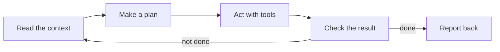
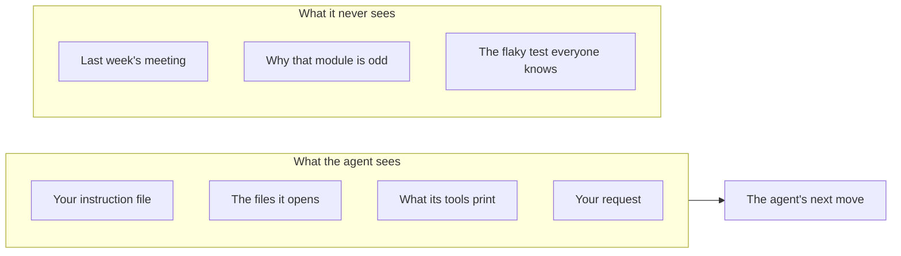
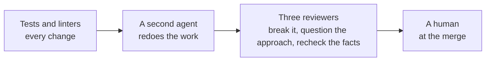

<!-- _class: title -->
<!-- _lens: talk -->
<!-- _paginate: false -->
<!-- _header: '' -->
<!-- _footer: '' -->

# Working with coding agents

`A field guide · September 2026`

What five months and two thousand agent-written changes taught us about getting good work out of them.

<!--
Welcome. This talk is a field guide. Everything in it comes from one project, Lattice, where one person and a team of coding agents wrote about two thousand changes over five months. I'll share what worked, what broke, and how to build a way of working that gets better on its own. You can use any agent tool with it. When a tip only applies to Claude, I'll say so.
-->

---

<!-- _class: compare-prose transition -->
<!-- _lens: talk -->

`Why this matters`

## The same agent can ship great work on Monday and nonsense on Tuesday.

- Monday
  - It reads the right files, writes the feature, runs the tests and shows you they pass.
- Tuesday
  - It edits the wrong module, skips the tests and tells you everything works.

Same model both days. What changed was what it could see, what it could do, and what checked it.

<!--
Pause here. Most of us have lived this. Monday, the agent builds a clean feature. Tuesday, it tells you a broken test passes. The natural reaction is to blame the model. When we traced our bad sessions, the cause was nearly always the setup: what the agent could see, what it could do, and what checked it. That setup is what this talk is about, and you control all of it.
-->

---

<!-- _class: agenda -->

## We will walk from the basics to your own workflow.

1. How an agent works
2. Context is the job, and the bill
3. Check the work from outside
4. Let the agent act where it's safe
5. What went wrong, and what it taught us
6. Build your workflow, then evolve it

<!--
Six sections. The first four are the fundamentals. Section five is war stories, because failures teach faster than rules. Section six turns it all into a plan you can start next week. Each section ends with a short set of Claude tips.
-->

---

<!-- _class: divider -->
<!-- _paginate: false -->
<!-- _header: '' -->
<!-- _footer: '' -->

`Section 01`

## How an agent works

---

<!-- _class: diagram -->
<!-- _lens: talk -->

`How an agent works · The loop`

## An agent runs a loop until something tells it to stop.

<!--
Here is the whole machine. The agent reads what is in front of it, makes a plan, uses tools to act, like editing a file or running tests, and then checks the result. If it thinks it is not done, it goes around again. Notice the word "thinks". The loop stops when the agent believes it is finished. Everything else in this talk is about making that belief match reality.
-->

---

<!-- _class: cards-grid three -->
<!-- _lens: talk -->

`How an agent works · What you control`

## You control three things, and they decide most of the outcome.

- Context
  - What the agent can see: your instructions, the code, the docs, the history.
- Tools
  - What the agent can do: edit, run, search, and what it must ask first.
- Checks
  - How the agent knows it is done: tests, linters, a second reviewer, a human.

<!--
You don't control the model's intelligence. You do control these three. Context is what it can see. Tools are what it can do. Checks are how it knows it is done. When a session goes badly, one of these three is almost always the cause. Keep them in mind; the next three sections take one each.
-->

---

<!-- _class: table table-fill -->

`How an agent works · Claude tips`

## Three commands put the loop under your control.

| Do this | In Claude Code |
| --- | --- |
| Plan before any code changes | Press `Shift+Tab` for plan mode |
| Start a project instruction file | Run `/init` to draft a `CLAUDE.md` |
| Start fresh between tasks | Run `/clear` |

<!--
Three habits for the loop. Plan mode lets Claude read and propose without editing anything, so you can catch a wrong approach before it becomes a wrong diff. Slash init drafts a starting instruction file from your repo, which you then trim and own. And slash clear gives each new task a clean slate, so yesterday's context doesn't leak into today's work.
-->

---

<!-- _class: divider -->
<!-- _paginate: false -->
<!-- _header: '' -->
<!-- _footer: '' -->

`Section 02`

## Context is the job, and the bill

---

<!-- _class: diagram -->

`Context · The basic rule`

## The agent knows only what you put in front of it.

<!--
This sounds obvious, and it is the rule we broke most. Your team carries a lot in its head: why a module is odd, which test is flaky, what the customer said. The agent has none of that. If it matters, write it down where the agent will read it. If you find yourself explaining the same thing twice, that is a sign it belongs in a file.
-->

---

<!-- _class: bar row -->
<!-- _lens: talk -->

`Context · Where it goes`

## Every session starts 87,000 tokens deep before anyone types a word.

- Tool definitions `36.7k`
- Everything else `23.4k`
- Rules file `13.4k`
- System prompt `7.4k`
- File listings `5.9k`

<!--
A token is roughly three quarters of a word. We measured one ordinary session before it did any work. It was already carrying about 87,000 tokens: the definitions of every tool it could use, our rules file, the system prompt and some file listings. You pay for all of that, and the agent has to pay attention to all of it. Every helper agent it starts pays for the rules file again. So what you load by default is a real design decision.
-->

---

<!-- _class: line -->

`Context · A cautionary chart · kilobytes`

## Our rules file grew four times over after we set out to shrink it.

- May `5.0`
- Jun 1 `22.6`
- Jun 17 `15.1`
- Jul 1 `22.2`
- Jul 15 `28.3`
- Aug 1 `34.7`
- Aug 15 `36.4`
- Sep 1 `59.4`
- Sep 15 `61.7`
- Sep 24 `53.4`

<!--
This is our always-loaded rules file over five months. The chart shows file size in kilobytes; today's file is about 13,700 tokens. In June we reviewed it and cut it down, aiming for a fraction of its size. Then every incident added a paragraph, and each paragraph made sense on its own. By September it had quadrupled. We only put a size limit on it after the fact. Give the file a budget on day one, before it needs one.
-->

---

<!-- _class: compare-prose chosen -->

`Context · The rules file`

## Write the always-loaded file as an index, and keep the manual elsewhere.

- A manual
  - Every rule comes with its full story. It grows with each incident, and every session pays for all of it.
- An index
  - One line per rule and a pointer to the doc that explains it. The agent opens the detail only when the task needs it.

<!--
Our best fix was a change of shape. The always-loaded file became a table of contents: one line per rule, and a pointer to the full explanation. The agent reads the long version only when it is working in that area. It keeps the default cheap and the detail available.
-->

---

<!-- _class: bar row -->

`Context · The hidden cost`

## Trimming what one tool printed saved more than any model choice.

- Test output before `657,806`
- Test output after `1,182`

<!--
Our single biggest saving came from a test runner. Our test runner printed a line for every test, and the agent read all of it: about 658,000 tokens per run. We switched the runner to print a dot per test and details only for failures. Same tests, same information, about 1,200 tokens. Look at what your tools print into the conversation; for us it was the largest cost we had never measured.
-->

---

<!-- _class: list-criteria -->

`Context · Habits`

## Four habits keep context lean without starving the agent.

1. Read sections, not whole files
   - List a doc's headings first, then open only the part you need.
2. Send big reads to a helper
   - A helper agent reads the log and returns a short summary.
3. Make tools quieter
   - Print failures in full and successes as a dot.
4. Measure before you cut
   - Our guesses about cost were wrong more often than right.

<!--
Four habits. Read the part of a document you need, not the whole thing. When something is huge, like a long log, hand it to a helper agent and take back a summary. Make your tools quieter. And measure before you optimize: we guessed wrong about what cost money several times, including once when we capped how long the model could think before answering, expecting a big saving, and saved almost nothing.
-->

---

<!-- _class: table table-fill -->

`Context · Claude tips`

## You can see and shape everything that fills the context.

| Do this | In Claude Code |
| --- | --- |
| Keep project rules short | `CLAUDE.md`, with `@path` imports for detail |
| Load long guidance only when needed | A skill in `.claude/skills/<name>/SKILL.md` |
| Keep big reads out of the main thread | A subagent in `.claude/agents/` |
| See what fills the context and the bill | `/context` and `/usage` |
| Shrink a long session | `/compact` |

<!--
Claude Code has a tool for each habit. CLAUDE.md loads every session, so keep it short and pull in detail with at-sign imports. Skills hold longer guidance that Claude loads only when the task calls for it. Subagents do big reads in their own context and hand back a summary. Slash context shows what is filling the window, and slash usage shows where the tokens went. Slash compact summarizes a long session so you can keep going.
-->

---

<!-- _class: divider -->
<!-- _paginate: false -->
<!-- _header: '' -->
<!-- _footer: '' -->

`Section 03`

## Check the work from outside

---

<!-- _class: compare-prose -->

`Verify · The problem`

## Agents say "verified" when they believe it, and belief is not evidence.

- What the agent said
  - "Verified with a real browser," in the pull request, the commit message and the design note.
- What was true
  - The test it wrote still passed with the fix removed. A second agent, asked to break the test, found out.

<!--
We had a written rule saying: never claim you verified something unless you tested it on the real thing. After that rule existed, an agent claimed a fix was verified, in the pull request, the commit message and the design note. The test it wrote passed whether or not the fix was there. The rule did not catch it. A second agent, asked to try to break the test, did. A rule the agent grades itself on is a hope, and a second agent is a check.
-->

---

<!-- _class: bar row -->
<!-- _lens: talk -->

`Verify · What holds`

## Rules hold when something outside the agent checks them.

- Commit format, checked by a hook `98%`
- Merge summary, read by a human `95%`
- Changelog entry, checked by the build `91%`
- Demo for visual changes, honor system `49%`

<!--
We measured how often agents followed four of our rules. The three at the top each have something outside the agent checking them: a hook, a build step, or a person who reads the summary before every merge. They hold above ninety percent. The last one relies on the agent remembering. It holds about half the time overall, though it climbed from about forty percent in June to about seventy in September. If a rule matters, give it a check.
-->

---

<!-- _class: diagram -->
<!-- _lens: talk -->

`Verify · How much checking`

## Match the amount of checking to what breaks if you are wrong.

<!--
Not every change needs the same scrutiny. Small changes get tests and linters. Anything with a wide reach gets a second agent that redoes the work from scratch instead of reading the first agent's summary. Critical or new work gets three reviewers with different jobs: one tries to break it, one asks whether the whole approach is wrong, and one rechecks the facts. And a human decides at the merge. The second agent was our most valuable habit: over three hundred commits record a second agent catching a real problem.
-->

---

<!-- _class: cards-grid four -->

`Verify · Checks that work`

## Four habits keep a check honest, starting with making it fail.

- Allow zero
  - Set the limit to none, and list each exception with a reason.
- Plant a defect
  - Each run plants a known bug and fails if the check misses it.
- Expire exceptions
  - An exception that no longer matches anything fails the build.
- Warn, then block
  - Promote a check to blocking only after it has proven stable.

<!--
We learned this the hard way. One of our core checks could never fail, for any of our sixty-one components, and nobody noticed for months. Now every important check plants a known defect on each run and must catch it. Exceptions carry a written reason and fail once they stop applying, so the list can't quietly rot. And a new check warns first, and blocks only after it has a track record.
-->

---

<!-- _class: quote -->

> Two checkers verified it; none of them could have found what was wrong with it, because it was correct.

— From our commit history, after a third reviewer showed the whole approach was wrong

<!--
This quote is why we use reviewers with different jobs. Two agents checked a change and confirmed it was correct. It was correct. It also solved the wrong problem. Only the reviewer whose job was to ask "is the framing wrong?" could see that. Checking for mistakes and checking for the wrong goal are different skills.
-->

---

<!-- _class: table table-fill -->

`Verify · Claude tips`

## Hooks run your checks even when the agent forgets.

| Do this | In Claude Code |
| --- | --- |
| Run a check after every edit | A `PostToolUse` hook |
| Block "done" until tests pass | A `Stop` hook that exits with code 2 |
| Get an independent review | A read-only subagent, or `/code-review` |

<!--
Hooks are scripts Claude Code runs at fixed points, whether or not the agent remembers. A PostToolUse hook can run your linter after every edit. A Stop hook runs when Claude tries to finish, and if it exits with code 2, Claude has to keep working, for example until the tests pass. For a second opinion, define a reviewer subagent that can read but not edit, or run slash code-review on the diff.
-->

---

<!-- _class: divider -->
<!-- _paginate: false -->
<!-- _header: '' -->
<!-- _footer: '' -->

`Section 04`

## Let the agent act where it's safe

---

<!-- _class: matrix-2x2 -->
<!-- _lens: talk -->

`Guardrails · Who decides`

## Let the agent decide alone when mistakes are cheap and local.

- **Easy to undo · Stays local.**
  - Code, tests, docs on its branch
  - The agent decides
- **Easy to undo · Reaches others.**
  - Shared labels, CI config
  - The agent proposes, you approve
- **Hard to undo · Stays local.**
  - Exported files, deleting local work
  - The agent shows you first
- **Hard to undo · Reaches others.**
  - Merges, deploys, publishing
  - A human decides, every time

<!--
Two questions decide whether the agent acts alone: how easily can we undo it, and does it reach beyond this branch? Difficulty doesn't come into it. A hard refactor on its own branch is the agent's job. A one-line label change across sixty shared issues is ours. Anything hard to undo that reaches others always goes to a human.
-->

---

<!-- _class: big-number -->

`Guardrails · A true story`

- 60
  - issues relabeled when we asked for about 12.

<!--
Before we drew that line, we asked an agent to mark about a dozen issues ready. It marked sixty. Each choice made sense to it. But the number twelve was a decision we had made, and the agent quietly swapped in its own number. In the same session it added a step to our CI pipeline because it seemed useful. Both were reasonable. Neither was its call. Now the agent brings two things back to us: any number we set, and anything other teams depend on.
-->

---

<!-- _class: compare-prose chosen -->

`Guardrails · Where the gate lives`

## Put the human gate in the platform, not only in the instructions.

- Instructions only
  - Our agents ask before every merge, but the approval lives in chat. GitHub shows zero approving reviews in our history.
- In the platform
  - A required review or a protected deploy step records who approved what, even when the agent forgets to ask.

<!--
We fell short on this one. Our rule says a human approves every merge, and in practice one does, in chat. But GitHub has no record of it. Zero approving reviews in the whole history. For a team, and certainly for an audit, the gate has to live in the platform: a required review, a protected branch, a deploy approval.
-->

---

<!-- _class: table table-fill -->

`Guardrails · Claude tips`

## Permissions draw the line between acting and asking.

| Do this | In Claude Code |
| --- | --- |
| Allow safe commands, block risky ones | The allow, ask and deny lists in `.claude/settings.json` |
| Review a plan before any edits | Plan mode: `claude --permission-mode plan` |
| Set limits for the whole org | Managed settings, pushed to every machine |

<!--
Permissions are your first guardrail. List the commands Claude may run freely, the ones it must ask about, and the ones it may never run. Plan mode is useful for anything in the risky corners of the grid: Claude proposes, you approve, then it acts. And for org-wide policy, managed settings apply the same rules to everyone, so no one has to remember to configure them.
-->

---

<!-- _class: divider -->
<!-- _paginate: false -->
<!-- _header: '' -->
<!-- _footer: '' -->

`Section 05`

## What went wrong, and what it taught us

---

<!-- _class: cards-grid three -->

`War stories · 1 of 5`

## An auto-rebase bot kept restarting the tests, so one change never passed.

- What we tried
  - A bot rebased every open change the moment the main branch moved.
- What happened
  - One change was rewritten six times, and five test runs were canceled before they could finish.
- The lesson
  - Aim at the real goal: a change that merges cleanly when it merges.

<!--
Our first war story. We wanted every pending change to stay up to date with the newest code, so a background bot rebased them, meaning it replayed each change on top of the latest version, every time the main branch moved. On a busy afternoon one change was replayed six times. Each replay canceled the test run already in progress, so the tests never finished and the change never passed. What we needed was simpler: a change that merges cleanly at the moment it merges. Now the agent rebases once, right before it pushes.
-->

---

<!-- _class: cards-grid three -->

`War stories · 2 of 5`

## We fixed the same kind of jam five times, one file at a time.

- What we tried
  - A merge queue that retests each change against the latest main.
- What happened
  - Each shared file jammed in turn: the changelog, the build output, an index, and two more.
- The lesson
  - List every shared file before you add a queue, and give each change its own file.

<!--
A merge queue tests each change against the latest code before merging it. Any file that every change edits turns into a traffic jam. First it was the changelog: seven changes kicked out in one evening. We fixed that, and the jam moved to the build output. Then to an index file. Five jams in all. The fix that finally worked: each change writes its own small file instead of editing a shared one.
-->

---

<!-- _class: cards-grid three -->

`War stories · 3 of 5`

## A rule stood for two months on a claim nobody had tested.

- What we tried
  - We banned a CSS pattern we believed broke in one browser.
- What happened
  - Someone finally retested it. It worked five times out of five.
- The lesson
  - Give every rule a retest condition, and run it.

<!--
We banned a coding pattern because someone had written that a browser handled it wrong. Nobody had checked. The rule sat there for two months, blocking perfectly good code. When we finally tested it, it worked every time. So every rule now says what would prove it wrong, and we go and check.
-->

---

<!-- _class: cards-grid three -->

`War stories · 4 of 5`

## A reasonable guess became a hard rule without any evidence.

- What we tried
  - Cheaper models for simple lookups, to save money.
- What happened
  - We dropped it after 58 hours on a hunch, then wrote a rule describing a failure nobody saw.
- The lesson
  - Write down how sure you are next to every rule: measured, observed, or argued.

<!--
Our own rules are not immune. We tried using cheaper models for simple tasks and dropped it after 58 hours, because we didn't trust it. That may be the right call. But the rule we wrote says cheaper models fail in a specific way, and our own notes admit nobody observed that. A guess became law. Now we mark each rule with how we know it: measured, observed, or argued.
-->

---

<!-- _class: cards-grid three -->

`War stories · 5 of 5`

## Fifty-three agents produced a good design at a bad price.

- What we tried
  - Five designs, five rounds each, and a full review of every one.
- What happened
  - Rounds four and five changed nothing, and four of the five reviews were thrown away.
- The lesson
  - Iterate inside one agent, cap the rounds, and review only the winner.

<!--
Last story. We asked for five competing designs, each refined five times, each fully reviewed. That came to fifty-three agents. The design was good, and it cost fifty-three agents' worth of tokens. The last two rounds changed nothing, and we reviewed four designs we then threw away. Now one agent iterates on its own design, we stop after about three rounds or when a round changes nothing, and only the winner gets the full review. The same job now takes about seventeen agents.
-->

---

<!-- _class: divider -->
<!-- _paginate: false -->
<!-- _header: '' -->
<!-- _footer: '' -->

`Section 06`

## Build your workflow, then evolve it

---

<!-- _class: cycle -->
<!-- _lens: talk -->

`Your workflow · The engine`

## Every rule should travel the same loop, from incident to retirement.

- Something breaks
  - An incident, or an agent oversteps.
- Write it down
  - A dated note: what happened and why.
- Make a rule
  - One line, with how sure you are.
- Add a check
  - Something outside the agent enforces it.
- Retest it
  - Drop the rule if its reason no longer holds.

<!--
This is the heart of the talk. Every good rule we have came from this loop. Something breaks. We write a short note about what happened and why. We turn it into a one-line rule and say how sure we are. We add a check so the rule doesn't depend on memory. And later we retest it, and retire it if the reason no longer holds. Your rules should come from your own incidents, through this loop.
-->

---

<!-- _class: table table-fill -->

`Your workflow · Writing it down`

## Proposals, decisions and specs answer different questions.

| Document | Answers | Expires when |
| --- | --- | --- |
| Proposal | Which option should we pick? | Someone decides |
| Decision record | Why is it this way? | Never; a newer record replaces it |
| Spec | What must every version do? | Never; you edit it to stay true |

<!--
Agents lean on your written memory, so it helps to know which kind of document you're writing. A proposal lays out options before a decision, and it expires once someone decides. A decision record says why something is the way it is. You don't edit it later; you write a new one that replaces it. A spec is the contract others build against, and you keep it true. We mixed these in one folder with no labels, and ended up with seventy notes still marked "proposed" long after they were decided. A type label on each note would have caught that.
-->

---

<!-- _class: roadmap -->
<!-- _lens: talk -->

`Your workflow · Where to start`

## Start small in week one, then add a layer at a time.

`[{[ ], Next step}]`

| Area | Week 1 | Month 1 | Quarter 1 |
| --- | --- | --- | --- |
| Context | [ ] A one-page instruction file | [ ] Split detail into linked docs | [ ] Measure what sessions load |
| Checks | [ ] Tests and a linter on every change | [ ] One check that plants its own bug | [ ] A second agent on risky work |
| Guardrails | [ ] Allow and block lists | [ ] Human gate in the platform | [ ] Written list of what needs a human |
| Memory | [ ] A decision log, one note per incident | [ ] A follow-up folder, not chat | [ ] Retest your oldest rules |

<!--
You don't need all of this on day one. In week one, write a short instruction file, run tests and a linter on every change, set basic allow and block lists, and start a decision log. By month one, move detail out of the instruction file into linked docs, add a check that proves it can fail, and put the human gate into your platform. By the end of the quarter, measure your context, add a second reviewing agent for risky work, and go back and retest your oldest rules.
-->

---

<!-- _class: table table-fill -->

`Your workflow · Other kinds of work`

## The habits carry over, but the evidence looks different in each kind of work.

| Work | The real thing to check | A check that can fail |
| --- | --- | --- |
| Data science | A fixed, versioned test set | Plant an input that gives away the answer |
| Data engineering | The target warehouse | Insert a known-bad row |
| BI | The published dashboard | Plant a mismatch with source |
| Services | Staging, or a small slice of live traffic | A deliberately breaking contract |
| CLI tools | The built binary's output | A saved expected output that must change |

<!--
We build a web app, but the habits travel. What changes is what counts as the real thing. In data science it's a fixed, versioned test set that never changes under you. In data engineering it's the target warehouse. In BI it's the dashboard people actually open. For services it's staging, or a small slice of live traffic, and for command-line tools it's the output of the built binary. And in each case you can plant a known problem to prove your check catches it.
-->

---

<!-- _class: cards-grid four -->

`Your workflow · Watch out`

## Four things make agentic work harder outside a web app.

- Randomness
  - Model results vary, so compare against a band, not one number.
- Production data
  - Agents shouldn't touch it; give them a safe copy.
- Slow checks
  - Reloading history can take hours, so run one small probe per change.
- Many systems
  - Services have no single source of truth; test the contracts.

<!--
Four things get harder elsewhere. Machine learning results are noisy, so compare against a range. The real surface for data work is production data, which agents should not touch, so give them a safe copy and keep the real runs in a separate, approved lane. Some checks, like reloading months of historical data, take hours, so run a small probe per change and the full run on a schedule. And a web of services has no single source of truth, so test the contracts between them.
-->

---

<!-- _class: table table-fill -->

`Your workflow · Claude tips`

## Commit the setup so the whole team improves it together.

| Do this | In Claude Code |
| --- | --- |
| Share the setup with the team | Commit `.claude/`: settings, agents, skills, hooks |
| Package a repeatable task | A skill you run as `/<name>` |
| Run the agent in CI | `claude -p "…"` with `--output-format json` |

<!--
Treat your agent setup like code. Commit the .claude folder so everyone gets the same permissions, reviewers, skills and hooks, and changes go through review like anything else. When a task repeats, turn it into a skill with its own slash command. And when you're ready, run Claude without a chat window in CI, using claude dash p, which is how the loop starts running without you.
-->

---

<!-- _class: list-criteria -->
<!-- _lens: talk -->

`Your next step`

## Start with three things next week.

1. Write a one-page instruction file
   - An index of your rules, with links to the details.
2. Add one check that can fail
   - Then break it on purpose and watch it catch the bug.
3. Start a decision log
   - One short dated note every time something goes wrong.

<!--
If you take three things away, take these. Write a one-page instruction file that points to the details. Add one check, then break your code on purpose and watch the check catch it. And start a decision log, one short note every time something goes wrong. In three months that log will hold the first draft of your team's rules, and you'll trust them, because you know where each one came from.
-->

---

<!-- _class: closing -->
<!-- _lens: talk -->
<!-- _paginate: false -->
<!-- _header: '' -->
<!-- _footer: '' -->

## Build the loop, not a rulebook

`Questions welcome`

<!--
Our rules won't fit your team, and yours won't fit ours. The loop that makes good rules will fit everyone. Thank you.
-->
