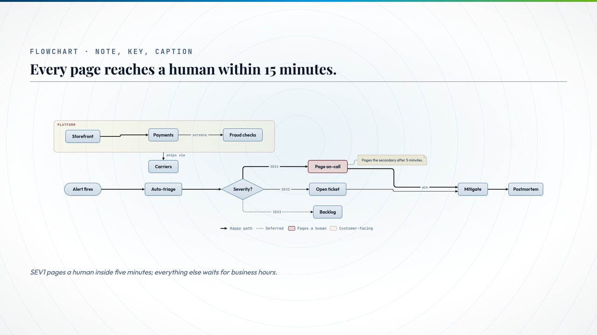
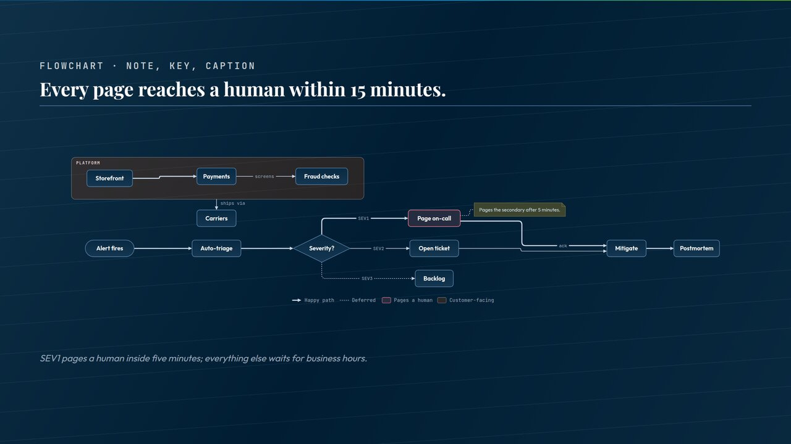
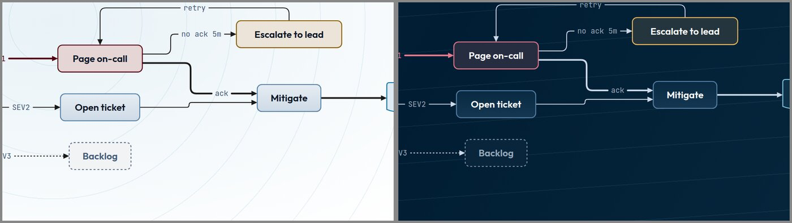
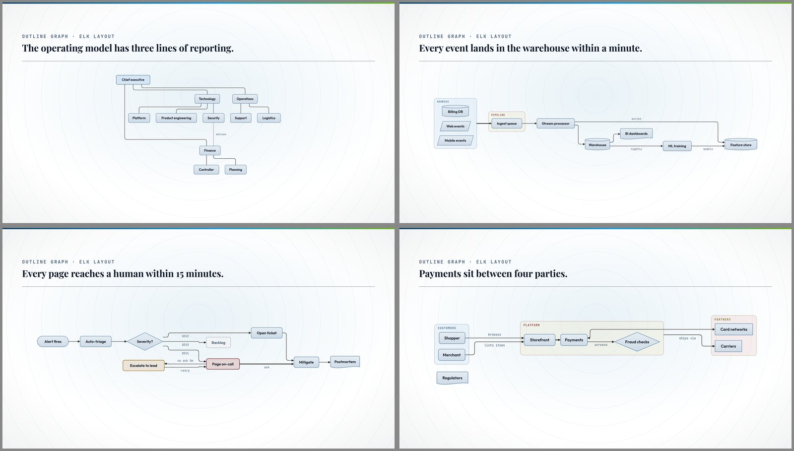
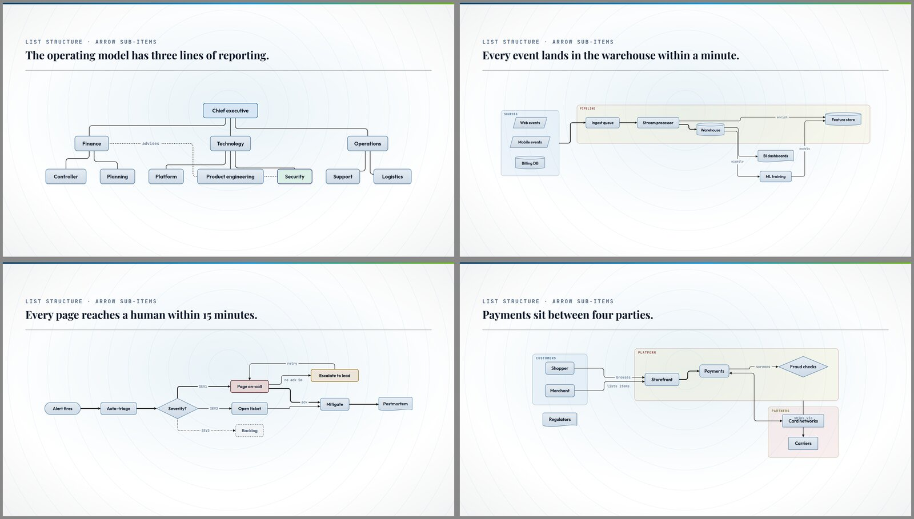

# Flowchart authoring and rendering (2026-09-25)

**Status: proposed.** Nothing here is built. The prototypes that proved each rule
were throwaway scripts under `.scratch/flow/`, so this note is the record. The
images in the companion folder `2026-09-25-flowchart-authoring/` were rendered
by those prototypes inside real Lattice slides (real theme tokens, real finish
backdrops). They predate the review fixes in this note, so small details differ
(see section 11).

**The answer in one screen.** A flowchart is written as a Markdown list. Every
rule of the grammar appears once in this example:

```markdown
<!-- _class: flowchart lr -->

## Every page reaches a human within 15 minutes.

- Alert fires `:pill` => Auto-triage => Severity?
- Severity? `:diamond`
  - =SEV1=> Page on-call
  - -SEV2-> Open ticket -> Mitigate
  - -SEV3-> Backlog `:dotted`
- Page on-call `fail` =ack=> Mitigate => Postmortem
  > Pages the secondary after 5 minutes.
- Platform `:c2`
  - Storefront => Payments
  - Payments -screens-> Fraud checks
  - -ships via-> Carriers

`[{=>, Happy path}, {:dotted, Deferred}, {fail, Pages a human}, {:c2, Customer-facing}]`

*SEV1 pages a human inside five minutes; everything else waits for business hours.*
```




---

## 1. What a flowchart is (and is not)

A flowchart is **free-form**: an org chart, a data flow, an actor map, a decision
flow, or a loose set of shapes and groups with no lines at all. It is **not** a
state machine and not a sequence of steps, so nothing in the grammar implies
order. That is why the state chart's numbered-list grammar and its `start` /
`end` words are not reused. The two components share rendering pieces (the tile
look, tokens, dagre delivery, the fit pass), not grammar.

**One deliberate difference from the state chart:** there, a prose sub-bullet
under a state is detail text. Here, a sub-item that starts with a name is a
member and makes its parent a group. The owner chose "anything with a sub-list is
a group" knowing this; the docs must say it in the first paragraph.

**Flowchart or Mermaid `diagram`?** The existing `diagram` component already
renders Mermaid flowcharts and is tagged for flowcharts and org charts. The
flowchart component is the native one: it is authored in the house list style,
paints with the chart family's tokens and finishes, narrates, and is addressable
by Vetrina. `diagram` stays for pasted Mermaid and for kinds the flowchart does
not draw (sequence, class, ER). Both component docs must point at each other.

## 2. The grammar

The kernel that implements this section is `lib/core/flowchart-grammar.js`.

### 2.1 Shapes and names

- **Every list item is a shape.** Numbered and bulleted lists mean the same
  thing; numbering is the author's own labeling and implies nothing.
- **A shape's name is its displayed text**, matched case-insensitively with
  whitespace collapsed. Every mention of the same name is the same shape.
- **An explicit name** is a `#id` at the lead of the modifier span:
  `` - Know-your-customer checks `#kyc:diamond` ``. Use it for long text or for
  two shapes that display the same words. An id is lowercase letters, digits and
  hyphens. (`{kyc}` was the first proposal and was dropped: braces are the inline
  pill grammar, and the engine turns `` `{kyc}:diamond` `` into a pill before any
  chart sees it.)
- **A name must contain text.** A list item whose text is empty after its span,
  or only a list-marker-like token (`2.`, `+`, `*`), is a lint error, not a
  nameless shape.

### 2.2 Groups

- **Anything with a sub-list of shapes is a group.** Its shape sub-items are its
  members. Groups nest. There is no `:group` word and no exception (an earlier
  `tree` slide class that made nesting draw lines was dropped for this reason).
- A group is a shape for connections: it can be a target, and its own arrow
  sub-items are the group's connections. Lines to and from a group stop at its
  border.
- **Lint errors, never a silent choice:** a shape placed in two groups; a group
  nested inside itself (directly or through another group); a connection between
  a group and one of its own members.

### 2.3 Connections

A connection is written with an arrow, in either of two places, and both mean
"from this shape". These two sources draw the same chart:

```markdown
- Platform `:c2`
  - Storefront
    - => Payments
```

```markdown
- Platform `:c2`
  - Storefront => Payments
```

- **A sub-item that starts with an arrow is a connection** from its parent. A
  sub-item that starts with a name is a member. The first token decides.
  (`- -> X` is a plain list item whose text is `-> X`: CommonMark only reads `-`
  as a list marker when a space follows it.)
- **An arrow is a separate word.** It has whitespace (or the start of the item)
  on both sides. So `Know-your-customer` and `Terms-and-conditions` are names,
  never labeled links.
- **Escape with a backslash**, as pills do: `Balance \<= 0?` is a name containing
  `<=`. Lint flags an unescaped arrow inside what looks like a name (a spaced
  `<=` followed by a digit, for example) with the escaped form as its fix.
- **Chains:** `A -> B -> C`. **Fan-out:** `-> Auth & Orders`. `&` splits targets
  only in the target list after an arrow; in a shape's own name (`R&D`,
  `Terms & Conditions`) it is text.
- **Placement comes from item rows.** A shape sits where its FIRST item row puts
  it. A later row that repeats the name is a reference: it adds connections and
  never moves the shape (nested under a different group, it is the two-groups
  error). A name that appears only as a target is placed by its **first source**:
  - the source is a shape: the target joins that shape's group, or the top level
    when the source has none (`Payments -screens-> Fraud checks` puts Fraud
    checks inside Platform);
  - the source is a group: the target sits beside the group, never inside it
    (`-ships via-> Carriers` puts Carriers next to Platform).
- **An unknown name is created, not rejected**, so a typo draws a stray shape.
  `lint:deck` warns on a near-duplicate of an existing name (an edit distance of
  2 or less, only when both names are longer than four characters, so `UI` and
  `DB` never trip it). This is the one inference in the grammar, and it buys the
  one-line chain.

**The arrow carries meaning; the span carries drawing.** Direction and weight
change what the chart says, and what Cadenza and Suono say aloud, so they live in
the arrow. Two shafts and four ends give eight forms:

| Arrow | Meaning | Spoken as |
|---|---|---|
| `->` | leads to | "A leads to B" |
| `<-` | comes from (write incoming lines under the target) | "B leads to A" |
| `<->` | two-way exchange | "A and B exchange" |
| `--` | related, no direction (org and association lines) | "A is linked to B" |
| `=>` `<=` `<=>` `==` | the same four, heavy: the primary path | "mainly…", or the key's word for `=>` when one is written |

A label sits inside the arrow: `-SEV1->`, `=ack=>`, `<-settled-`, `-advises-`.
Mermaid's `-->` and `==>` are accepted as `->` and `=>`, and lint suggests the
house form. A typed arrow character or an autocorrected dash is not an arrow;
lint names it.

**Where the parser reads.** One shared parser reads the list from markdown-it's
tokens, where arrows are still raw text. The rendered HTML carries them escaped
(`->` becomes `-&gt;`, the trap `lib/core/shape-glyphs.js` records for the
quadrant eyebrow), so any reader of rendered HTML must decode both spellings.
Typographic replacement is off in the engine, so `--` is not turned into a dash.
Letter heads such as `-x` and `-o` collide with ordinary words, and `*` risks
emphasis, so head shapes are span words instead.

### 2.4 The modifier span

A trailing inline-code span **styles what it follows**: right after a shape's
name it styles the shape; after a connection's target it styles that line.

- **Order inside the span does not matter**, as with pills: `` `:dotted:c4` ``
  and `` `:c4:dotted` `` are the same. Only the lead is positional: a span may
  start with a `#id` or a status word, as a pill starts with its `{LABEL}`. A
  status word also works after a colon, so `` `#kyc:fail:diamond` `` gives a
  shape an id, a status and an outline in one span.
- **An unknown word** leaves the span as literal code and `lint:deck` names it.
- **A shape word on a connection** (`` -> B `:diamond` ``) is a lint error:
  *style "B" on its own row*. That is what removed the need for a `:line-c3`
  prefix: `:c3` is the only word that could style either, and the position tells
  them apart.

| Word | Styles | Meaning |
|---|---|---|
| `:box` (default) `:square` `:pill` `:diamond` `:circle` `:cylinder` `:io` `:doc` | shape | outline |
| `:c1` … `:c8` | shape or line | a chart palette slot (`--chart-cat-N-fill` / `-body` / `-ink`), not a color name. Charts paint from the chart family's eight categorical slots, not the twelve engine-wide `--cat-N` a pill uses (`design/skills/chart-component.md`, "The color story") |
| `:fill-cN` `:border-cN` `:text-cN` | shape | one channel only |
| `on-track` `done` `live` / `at-risk` `warn` / `blocked` `fail` / `pilot` `decision` / `deferred` | shape | the ten status words of `CHART_STATUS` in `lib/core/chart-status.js`, painted pass / warn / fail / info / muted as `.chart-status[data-s]` in `chart-family.css` does |
| `:open` `:dot` `:cross` | line | head: depends-on or uses / attaches (reads, writes) / blocked or stops here. The default is a filled triangle |
| `:dashed` `:dotted` | line | optional, async or planned / informal or advisory |
| `:loose` | line | drawn, but kept out of layout so it cannot reshape the chart (an advisory line in an org chart) |

There is no hex and no free token name anywhere; every color is a palette slot
or a status word. That closes the state chart's `:::token` silent-typo hole
rather than copying it.

### 2.5 Key, notes, caption

The positions follow existing chart precedent, where **position decides what a
span means** (`lib/core/bracket-list.js`; `matrix-grid` puts axes above its body
and the key below):

- **Key (legend), derived.** The chart family's rule is that color-coded meaning
  gets a key, so the flowchart derives one: every status word, slot and heavy or
  patterned line the chart uses, with default words (status words speak for
  themselves; a slot's default is its group's name when a group wears it).
- **Key, authored.** One bracketed span **below** the outline renames entries,
  parsed by the shared `parseInlineSet` in `lib/core/label-set.js` with no
  changes. **The key is the word you already typed** (`=>`, `:dotted`, `fail`,
  `:c2`), as in roadmap where the key is the marker typed in a cell. The parser
  receives the key HTML-escaped (`=&gt;`) and decodes it like the arrows. An
  authored key only renames; it never hides or adds an entry.
- **One source of words.** The key's words are what the voice says: when the key
  names `=>` "Happy path", narration says "on the happy path", not "mainly".
- **Swatches wear the marks' paint:** a slot used by a group draws as a group
  tint, a slot on a shape as a tile.
- **Note:** a `>` blockquote nested under a shape's item is a note pinned to that
  shape, drawn as a note card on a dotted tether. A blockquote is a block, not a
  sub-list, so "sub-list means group" still holds.
- **Caption:** an italic paragraph below, the chart family's `.chart-caption`.
- **Above the outline:** reserved. A flowchart has no axes, so it does not borrow
  the axis position for anything else.

## 3. Settings: slide, deck, Studio

| Layer | Written as | Holds |
|---|---|---|
| Slide | `<!-- _class: flowchart lr elbow arrow-open compact motion-flow -->` | direction (`lr` `tb`, else fit picks), route (`elbow` default, `curved`), default head, density, flow dots |
| Deck | `flowchart: tb elbow arrow-open` (PROPOSED register) | the same words as defaults; a slide class overrides |
| Deck | `motion-flow: on` (PROPOSED key in the motion family) | flow dots for the deck; `motion-flow` / `motion-flow-off` override per slide |
| Deck | `finish:`, `class: compact`, `class: scale-l` (all exist) | the flowchart conforms to them |
| Studio | settings inspector, deck and slide | writes the places above; no third store |

Route style is chart-wide only: mixing routes within one chart reads as a bug.
None of the new words (`elbow`, `curved`, `arrow-*`, `motion-flow`, `flowchart:`)
collides with an existing class or register: the red-team review checked the
first set and a repo grep checked `motion-flow`. **`flowchart` is already a
discovery tag**, carried today by `diagram` and `state-chart` (`TAG_GROUPS` in
`lib/components/index.js`); the new component takes the tag too, so a search for
"flowchart" finds all three and each one's docs says when to use it.

## 4. Legibility: the floor, the levers, the budget

**The floor.** Chart text must not render below `--chart-text-min`, **11px** on
a 1280×720 landscape slide, scaled by `--canvas-scale` on portrait decks. The
export warns below 1% of slide height (TYPE FLOOR).

**Measured on the prototypes**, the best direction on the real stage:

| Chart | As prototyped: node / edge label | Label text 13 units | `compact` too |
|---|---|---|---|
| Org chart | 14.9 / 11.4 | 15.4 / 13.4 | 16.2 / 14.0 |
| Data flow | 10.9 / 8.3 | 10.8 / 9.3 | 11.8 / **10.2** |
| Incident | 12.3 / 9.5 | 12.2 / 10.6 | 13.1 / 11.4 |
| System map | 15.0 / 11.5 | 14.8 / 12.8 | 16.3 / 14.1 |
| The headline example | 11.4 / 8.8 | 11.3 / 9.8 | 12.2 / **10.6** |

Every chart is width-bound: the slide runs out of width while vertical room sits
empty. Flipping direction alone helped only the org chart; the others got worse,
because their fan-outs make a top-down layout wide and tall.

**The levers are existing words only** (the owner's choice):

- **Edge labels at 13 units** against 15 for shape text (they were 11.5, and
  breached the floor first).
- **The gaps come from the shared spacing scale** (`--sp-*`), so the existing
  `compact` modifier tightens a flowchart the way it tightens any layout
  (measured above: +0.8 to +1.5px).
- **`scale-l` / `scale-xl` / `scale-2xl` raise the floor** the chart must meet,
  by the same ×1.15 / ×1.3 / ×1.5.
- **Direction:** `lr` or `tb` pins it; without either, the state chart's fit pass
  scores both and keeps the larger (reused, not copied).
- **Wrap** is one more fit candidate. It wins only for chains; for these charts
  it loses (folding the headline example into two bands measures about 0.58×
  against 0.76× unfolded).

**Over budget: warn and coach** (the owner's choice). The chart still renders,
down to the floor. `lint:deck` lays the chart out in Node with the same dagre
and reports the measured size: *edge labels render at 9.3px against an 11px
floor: try `compact`, shorten labels, or split into an overview and detail
slides.* These starting budgets go in the docs as guidance, not as lint errors:

| Kind | Starting budget |
|---|---|
| Decision or process flow | ≤ 6 steps deep, ≤ 4 branches |
| Org chart | ≤ 3 levels, ≤ 8 across the widest level |
| Data flow or architecture | ≤ 3 groups, ≤ 12 shapes |
| System or actor map | ≤ 10 shapes |

Not a flowchart at all: timed interactions (sequence diagram), schedules
(gantt), states (state chart).

**The `fit:` register** (#2383, `engineering/decisions/2026-09-25-fit-policy.md`;
not yet on `main` when this was written, so this section depends on it). The
flowchart takes part in all three levels:

| `fit:` level | The flowchart |
|---|---|
| `heal` (default) | Heals without losing words: automatic `compact` spacing when text would land under the floor, the direction and wrap fit, and STEP (below). |
| `report` | None of those moves: the spacing and direction as written. Lint **warns** with the measured size, because nothing will heal it. |
| `trim` | Everything `heal` does, then note text may be ellipsized. **Shape names and edge labels are never cut** (the owner's ruling): a clipped label changes what a relationship says. Still under the floor after that, it is reported. |

- **STEP needs one new signal.** STEP's rule 3 says "fits" means what the
  overflow ring means, but a flowchart never overflows: it shrinks its own text.
  So the flowchart reports *text under the floor at this slide's scale* (the TYPE
  FLOOR condition), and `lib/core/scale-fit.js` treats that as not fitting. On a
  `scale-xl` deck, a flowchart that cannot hold 11px × 1.3 drops its slide to 1x,
  where the target is 11px. If it cannot hold 11px at 1x either, STEP's rule 2
  applies: the slide keeps its requested scale and is reported, never pushed below
  the floor.
- **SPLIT:** a flowchart is atomic, because a graph cut into pieces loses its
  lines. The splitter leaves it whole; an overview plus detail slides remains a
  coached suggestion.
- **Slide overrides** (`fit-report`, `fit-heal`, `fit-trim`) apply to a flowchart
  slide like any other.

## 5. Edge labels: never a painted background

The trouble spot was a label that has to sit on its line and hide what is behind
it, when "behind" can be the canvas, a group tint, a finish texture or a
gradient. A painted knockout can only match a flat, known ground. So:

1. **Ports first.** Edges entering or leaving the same side of a shape each get
   their own port, and their own lane. Two edges never share a final segment.
   This is the root cause of the collision in image 4: two edges into Mitigate
   shared a segment, so no knockout could have said which one the label belonged
   to.
2. **Room reserved.** A labeled edge bends early enough that its last straight
   run holds the label plus clearance from the arrowhead.
3. **Scored placement.** Candidate spots sit only on segments the edge owns, and
   are scored against every other line, shape and label. When a run is too short
   to hold the label, it goes beside the line instead.
4. **Text always wins.** After placement every line under a label is cut,
   including group borders and the flow-dot overlay, by splitting the path
   geometry itself: no clip-path ids (which collide when a slide is cloned), no
   mask, nothing that needs a PDF soft mask.
5. **Fallback chip.** Only if step 3 finds no clear spot does the label get a
   chip filled with the ground it sits on, and lint warns.



## 6. Flow dots

A dotted overlay moving along a line, a separate path above the real edge.

- **Opt-in** through the motion family: `motion-flow` on the slide or
  `motion-flow: on` in front matter. `motion: off` and `player-motion: off`
  switch it off too. (A separate `flow:` register was proposed and dropped: it
  would be a second animation switch beside `motion:`, and "flow" already means
  direction in a state-chart follow-up.)
- **Live surfaces only:** the Studio, the Playground and the HTML player. Off in
  PDF, PNG, PPTX and standalone SVG, and off under `prefers-reduced-motion`.
- By default the dots run on the **heavy** lines, the path the author marked with
  `=>`.
- One speed and one phase across the chart, so a chain reads as one stream; the
  phase at a merge follows the longest-path distance (design-competition track 2).
- They stop at labels, like the lines (section 5, step 4).
- Never carries `pathLength` or an anima role, and starts after the build-in, so
  it cannot fight the drawn-on edge.

## 7. Layout and routing

- **dagre, not ELK.** ELK routes around shapes, attaches edges to groups and
  tidies fan-outs natively (image 5), and its geometry was identical on re-run
  (the only differences were GWT `$H` object counters). But its bundle is
  **1.61 MB minified and 470 KB gzipped**, against dagre's **64 KB and 22 KB**:
  about 25 times heavier minified and 21 times gzipped. The owner declined it.
  dagre is already vendored (`dist/lattice-dagre.min.js`), so routing quality is
  our router's job, with ELK's renders as the target.
- **The router is the largest cost, and the review said it was underpriced.** The
  state chart's router is about 3,000 lines, took four PRs in 19 days, and still
  counts 16 label collisions across 14 decks, on a simpler problem with no groups.
  So v1 scope is fixed (the owner's choice):
  - a **new router in `lib/components/chart/_chart-family/`**, written so the
    state chart can adopt it later (not in this work);
  - **elbow routing** with ports, reserved label room, obstacle avoidance and
    group edges; `curved` is a smoothing of the elbow route;
  - **dropped from v1:** `straight` routes and fan-in trunks;
  - a **render check** on the gallery requiring zero shape overlaps, zero lines
    through shapes, zero label collisions and zero fallback chips.
- **As built (slice 2):** `graphLayoutKernel()` in
  `lib/components/chart/_chart-family/graph-layout.js`, one self-contained
  function so a browser pass can ship it as source. After dagre places the boxes,
  six passes clean the lines, in order: ports spread along each box side (with a
  label's height between two labeled neighbors); a line entering a group it does
  not belong to turns outside that group; a Z under 16 units tall is straightened;
  a run within a stroke gap of another line is moved off it; labels are seated on
  a clear stretch of their own line, overlap graded by area so two crowded labels
  can step apart; group titles take the first free slot in their top band.
  `measureQuality` counts seven failures (lines through shapes, label collisions,
  shape overlaps, labels off their line, lines through titles, labels across a
  group border, shared runs). `test/unit/components/graph-layout.test.js` holds a
  six-chart gallery to zero on all seven in both directions (one named exception,
  §12) and 1,000 seeded random charts to zero on the hard three, with at most two
  soft misses.
- **Crossings (added on owner review of slice 3).** dagre orders each rank to
  cut crossings, but the passes after it (back edges, ports, the rescue of a line
  through a shape) put many back. The last line pass is a crossing solver: each
  line that crosses another tries every clean elbow the shape rescue already
  builds (Z, U and L routes at four offsets) and keeps the one that crosses
  least, scored 300 per crossing plus length, turns and shared runs. It takes a
  new route only when that route strictly cuts the line's crossings, passes
  through no shape (its own two included), adds no shared run, holds room for its
  label on a run that crosses no group border, has no kink under 10 units, and
  enters no group neither end belongs to (nor any title band) that the old route
  did not. A main-path (`=>`) line may move only within 24 units of its length
  and one extra turn, so lighter lines give way around it. A `:loose` line takes
  part: it is the line most free to move. Up to three rounds, or until a round
  changes nothing.
- **Two orders, the better kept.** Moving lines one at a time is
  order-sensitive, so the solver runs twice from the same start and keeps the
  run with fewer crossings (a tie goes to the shorter drawing with fewer turns
  and side changes): once in authored order, and once with the freest lines
  first (loose, then plain, then main path). The second run also offers each
  line its current ports, allows a straight drop where two boxes overlap, costs
  60 for leaving or entering a box by a different side, never brings two ends on
  one side of a box within 14 units of each other (or tighter than they already
  were), and sends a line back to its old route once its detour is moot. That
  second order is what keeps an org chart's child under its parent instead of
  off its flank.
- **Fans.** Two passes, after the solver. `levelFans` gives a fan that splits
  both ways one turn height per pair (the lane allocator had treated two jogs
  touching only at their shared port as overlapping). `routeFans` draws every
  line that leaves one side of a shape for shapes wholly beyond it as one fan:
  ports spread along the side in target order, each line straight across when
  its target spans its port and otherwise on its own lane, nested so none
  crosses, and entering its target's near side. For that, a shape three or more
  lines leave (or enter) along the flow grows across it to 12 units per port;
  since growth also moves dagre's placement, each direction is laid out grown
  and plain and the grown one is kept only if it misses no more, crosses no
  more, and sets the type no more than 3% smaller. Growth skips the second run
  when nothing grew. A fan line keeps the port it already had on its target's
  near side, so it cannot land on a neighbor's. Each pass keeps its change only
  when no quality count, crossing count, foreign-group count, graze count, title
  band count or crowded-end count (two ends on one side within 10 units) gets
  worse; `routeFans` scores with the labels seated and the titles placed as they
  will be, since both are placed after it.
- **Lines through their own ends.** `measureQuality` exempted a line's own two
  boxes, so a line that left its box and folded back through it, or ran through
  its target before arriving, passed every check. The independent checker on
  this work found the fan and solver passes could create such folds; the router
  already drew them: 37 across the 1,000 charts and 33 across the 600, counted
  in auto, lr and tb. `linesThroughEnds` now counts them, the shape rescue
  treats them as hits, and the tests hold them to zero in every direction.
- **Grazing.** A line passing within about 4 units of a box it does not belong
  to (the box grown by 5, less the hit test's 1-unit inset) reads as touching it
  (the release train's `fails` ran 3 units under Test). The shape rescue counts
  a graze as a hit, and the late passes' guard counts grazes too. 24 grazing
  lines on the 1,000 charts before, 7 after.
- **Fan lanes stay outside the borders they cross.** A fan's lanes sit clear of
  the far border of any group that holds the source but not a target, and short
  of any group that holds a target but not the source (group padding is 14, and
  the first lane used to sit at 16, 2 units inside). The checker counted such
  border-riding jogs: 164 before the fan pass, 341 with its first version, 158
  now.
- **Grown or plain.** Growth is kept only when it is no worse on hard faults,
  soft faults and crossings and either buys something (fewer faults, crossings,
  crowded ends or grazes) at no more than 3% of type, or costs no type. Each
  direction is then judged by the best type it can reach, grown or plain, so a
  growth kept for its ports cannot tip the direction by the few percent it cost
  (a chart flipped lr to tb that way and gained two crossings).
- **Measured, against the kernel before the fan pass (9c67660), both corpora in
  auto, lr and tb.** 1,000 charts: crossings 195 -> 182 (auto), 187 -> 179 (lr),
  169 -> 176 (tb); soft-miss charts 1 -> 0, 1 -> 0, 5 -> 4. 600 charts: 97 ->
  104, 95 -> 104, 70 -> 75. No chart is worse on any quality count except three
  in the 600 forced to tb, where a label now straddles a group border: each had
  a line folding through its target (group One's line ran through Hotel to its
  far side), and unfolding it leaves a run shorter than the label, the known
  "group lines beside their group" gap below. Of the charts that gained a
  crossing, all but one lost a fold or a graze for it; the one (the 600, #478,
  tb) gained a crossing for nothing we measure. The demo deck's release train
  went from 9 crossings to 1 as painted and its org chart from 3 to 0.
  Crossings sit beside the quality counts, not in them (`geo.crossings`),
  because some graphs cannot be drawn without one. Letting crossings veto the
  type-size rule was measured and refused: it cost one chart 30% of its type
  size to save four crossings, and the owner's rule is that a flowchart takes
  the direction that sets the type larger. Layout costs about 18 ms a chart
  against 13.5 before on the demo deck's charts.
- **A ruler fix.** `labelsAcrossBorders` counted a label that only touched a
  group's border (289.79999 against 289.8) as across it; it now wants half a
  unit of real overlap.
- **What owning the router makes cheap:** `:loose` lines are left out of layout
  and routed afterwards; edges to a group are laid out between representative
  members and drawn to the group's border; an edge whose boxes overlap on the
  flow axis leaves through the side that faces its target.
- **Determinism** (same source, same machine and fonts, byte-identical SVG):
  shapes are keyed `n0…` in authored order (graphlib enumerates integer-like keys
  numerically, a measured footgun); back edges are chosen by our own depth-first
  walk in authored order, never by dagre's cycle breaker; measured sizes are
  quantized before layout. dagre has no `Math.random`.



## 8. Untrusted content

The Studio lints and renders untrusted Markdown (HARD RULE #22). The flowchart
builds SVG from author text, so:

- every name, label, note and key word is **escaped** into SVG text; nothing an
  author types is ever markup (a name like `<service>` shows as typed);
- the painter is added to the post-sanitize markup census
  (`checkRuntimeMarkupSinks`), which today scans only `lib/runtime/`, so the
  census must extend to this component's painter;
- the parser is a hand-written single pass with no backtracking regex, the
  posture `lib/core/bracket-list.js` takes for the same reason.

## 9. The four kinds, one grammar

An org chart, a data flow, a decision flow and a system map with a disconnected
shape, all from the same rules:



```markdown
<!-- _class: flowchart tb arrow-none -->

- Chief executive `:c1`
  - -- Finance & Technology & Operations
- Finance
  - -- Controller & Planning
- Security `:c4`
  - -advises-> Finance `:dotted:loose`
```

## 10. How it serves Vetrina, Cadenza and Suono

- **One grammar for every reader.** Chart kernels transform rendered HTML
  strings while lint and narration read raw Markdown, so the grammar lives in one
  kernel, `lib/core/flowchart-grammar.js`, that reads an OUTLINE (rows of text and
  code-span segments, their children and their notes). Two thin adapters build the
  outline, one from the rendered list and one from Markdown. Every rule about
  names, arrows, spans and placement is written once, so the picture, the linter
  and the voice cannot disagree about what a source says.
  **As built:** `outlineFromHtml` (`lib/core/flowchart-html.js`, kept out of the grammar module so the Studio's eager lint does not carry it) reads the rendered list and `outlineFromMarkdown`
  the source; the unit suite renders a shared corpus through the real engine and
  holds both to one parsed model. Two gaps had to close for that. markdown-it
  consumes `\->` into a plain `->`, so the `escapeMarks` plugin keeps an escaped
  `-` `=` `<` `>` `&` visible as `<span data-esc>`, which the HTML reader turns
  back into a backslash (no deck in the repository escapes those characters, so
  no existing render changes). And the Markdown reader now drops a backslash
  before any ASCII punctuation and strips inline markup, as markdown-it does, so
  `**Bold** step` is the same name in both.
- **Cadenza and Suono:** the outline is the spoken order, each arrow has a
  sentence (the table in 2.3), and every piece of metadata sits inside code
  spans, which narration drops. That avoids the class of bug where the state
  chart's `:::token`, outside the backticks, reached the voice.
- **Vetrina** points at elements by stable address: a shape's id is its `#id`,
  or else a slug of its name, with a numeric suffix when two slugs collide
  (`C++`, `C#` and `C` would all slug to `c`). Inserting or reordering shapes
  does not move them.
- **Fallback:** with no component (export to Marp, a plain renderer) the source
  reads as an outline.

## 11. How we got here

1. **Design competition:** 3 designers, 3 critics, 3 revisions, a shared
   fact-checker and a judge (11 agents). Scores: boardroom-visual-first 8.6,
   author-first (Mermaid-style fence) 8.2, reuse-the-state-chart 7.2. The
   judge's grafts (determinism pins, did-you-mean lint, longest-path phase) are
   kept above.
2. **Edge labels:** the owner's crop of a label crushed between two lines
   produced section 5.
3. **Authoring semantics,** scored against Vetrina, Cadenza and Suono. The owner
   corrected the premise twice: a flowchart is free-form, not steps; and inline
   code only modifies, so an edge is content, not code.
4. **Adversarial review** (red team, inversion, independent checker; 3 agents)
   of the first version of this note. Blockers it found and this version fixes:
   `{id}` was already pill syntax; arrows collided with ordinary text
   (`Know-your-customer`, `Balance <= 0?`, `R&D`); the placement rule
   contradicted the headline image; the status list named a word (`muted`) that
   is not a status; the key could disagree with the voice; `flow:` collided with
   the motion family; the router was underpriced.
5. **Rejected, with the reason:**
   - numbered steps that flow on their own: implies order a flowchart does not have;
   - edges inside inline code: inline code only modifies;
   - a connections table, or Markdown links: splits the structure away from the list;
   - nesting as lines (`tree` class): nesting means group, without exception;
   - flat arrow lines only: loses the list structure, so both forms are kept;
   - `:line-c3`: fixed an ambiguity that position now removes;
   - `{id}`: already the pill grammar;
   - a `flow:` register: a second animation switch;
   - ELK: 21 to 25 times the bundle weight;
   - a new `dense` word: the owner kept to existing words;
   - labels beside the line as the default: ambiguous at a decision's branches;
   - a chart-wide clip-path gap: ids collide on cloned slides.

**The images predate the review fixes.** None of their sources uses a syntax
this version changed, but they were drawn with 11.5-unit edge labels and a fixed
340px height cap, which section 4 measures and replaces.

## 12. Known gaps

- Fixed in slice 2: the prototype's lines through shapes (`advises` through
  Product engineering, `ships via` through Card networks) and its small zig-zags.
  The router reads zero on both across the gallery and the 1,000 random charts.
- **Group lines beside their group.** dagre reserves a label's room along the
  line between the group's representative member and the target. When the target
  lands BESIDE the group, trimming at the border leaves a run shorter than the
  label, which then straddles the border. The fix is to reserve that room in
  layout itself. Today it shows only in the gallery's `flat` chart forced to
  `tb`; its own direction is `lr`, which reads zero. Pinned as the test's one
  named exception.
- A labeled group-to-group edge needs a reserved gap between the groups.
- **Crossings are minimized locally, one line at a time.** The solver never
  re-orders shapes and never moves two lines together, so a crossing that only a
  joint move or a different rank order removes stays (the release train keeps
  one: `fails` against `rollback`). A global pass (re-running dagre's ordering
  with our routes' costs) is the next step if a real deck needs it.
- **The late passes' guard has blind spots.** `levelFans` and the solver score
  before group titles and labels are placed, so they cannot see a line moved
  under a title or a label that will not fit (`routeFans`, which the corpus
  caught doing both, now places them first). No corpus chart shows either.
- **Named entities in a name.** The HTML reader sees `&rarr;` decoded, the Markdown
  reader keeps it literal (it decodes numeric entities and the five markdown-it writes,
  not the HTML5 table, which would ride the Studio's eager lint bundle). A shape named
  with one reads differently in lint and in the picture. Found by the checker; rare.
- **The fit pass is copied, not yet shared.** Section 4 says the flowchart reuses
  the state chart's direction scoring. Today `graphLayoutKernel().layout()` applies
  the same rule in its own fifteen lines, and wrap is not a candidate. Slice 5
  promotes the state chart's pass and deletes the copy.
- Pre-existing, off this path: the chart family paints `live` as pass while the
  state chart and gantt paint it as info. Logged, not fixed here.

## 13. Build slices

1. **Parser and lint (done):** `lib/core/flowchart-grammar.js`, the pure
   outline kernel plus its Markdown adapter, and `findFlowchartIssues` in
   `lib/authoring/lint-core.js` (HARD RULE #7), pinned by
   `test/unit/core/flowchart-grammar.test.js`. The HTML adapter ships with the
   transform in slice 3.
2. **Layout and router (router done):** dagre plus the new shared elbow router:
   ports, reserved label room, side selection, obstacle avoidance, group edges,
   `:loose`, determinism pins and the gallery render check. **Still open: the fit
   pass.** The kernel's `layout()` scores `lr` against `tb` with the state chart's
   rule, re-implemented in about fifteen lines; section 4 says that pass is reused,
   not copied, and wrap is one of its candidates. That promotion moved to slice 5:
   the state chart's pass lives inside its serialized browser closure, so lifting
   it out is part of moving the state chart onto this spine, not something the
   flowchart can do alone.
3. **Paint (done):** `lib/components/chart/flowchart/`. The server half emits a
   measuring harness and the model; the browser half (`flowchart.layout.js`,
   shipped by the emulator beside the dagre IIFE and called by the runtime)
   measures, routes and paints one SVG. Line ends run on to a non-rectangular
   outline, every line is split under labels and group titles, and each key
   swatch is drawn from the mark it decodes. Checked in light and dark and under
   all nine deck finishes; the feature deck is `examples/flowchart.md`. The
   `:cross` head's default key word is "Stops here", not "Blocked", which
   collided with the `blocked` status word in one key. Section 5 step 5 (a
   fallback chip when no clear spot exists) is not built: the label keeps its
   best-scoring spot and the gallery measures zero collisions. The shared fit
   pass is slice 5's (see slice 2).
4. **Flow dots and settings:** the overlay, `motion-flow`, the `flowchart:`
   register, the measured legibility lint, the `fit:` levels and STEP's
   under-the-floor signal (after #2383 lands), and the Studio inspector.
5. **State chart v2** (section 14): the state chart moves onto this grammar and
   spine, with a codemod and no v1 compatibility, and its fit pass becomes the
   shared one both charts call.

## 14. State chart v2: one authoring model, one spine (decided)

The state chart is v1 of the house graph grammar. It moves to this grammar and
this spine as **state chart v2**, after the flowchart (the owner's sequencing).

- **Shared:** the token-level parser, the `_chart-family` elbow router and the
  state chart's fit pass promoted to shared (its chain-wrapping grid becomes one
  fit candidate), the paint (tiles, status words, label cutting, the key), one
  narrator, the `motion-flow` overlay and the determinism pins.
- **State-chart-only words, not syntax:** `start` and `end` in the span lead
  draw the entry dot and the terminal bullseye; a self-loop is an arrow to the
  state's own name; ordinal badges stay an option.
- **Composite states for free:** a sub-list of states is a group, which is a
  nested state in the UML sense, something v1 cannot express.
- **One behavior change:** a prose sub-bullet under a state is detail text in v1
  and makes a group in v2. Measured in-repo: 7 lines in 4 files. They move to a
  second line or a note.
- **No v1 compatibility.** Lattice is not GA, so v1 syntax is dropped, not
  deprecated: a codemod migrates the repo in one PR and nothing reads
  `` `event => N` `` or `:::token` afterwards. Measured in-repo: 64 state-chart
  slides in 20 files (13 under `examples/`), 458 transitions (mechanical: the
  number resolves to the state's name, `-event-> Approved`), and 25 `:::token`
  tints (by hand, onto slots or status words). Every migrated slide is
  re-rendered for visual review.
- **What this asks of the flowchart work now:** the shared kernel is built with
  the state chart's hooks from day one (the `start` / `end` words, the grid-wrap
  candidate, ordinal badges), so v2 is a migration, not a redesign.

This adds a fifth slice to section 13, after the flowchart ships: **state chart
v2**, the codemod, the 7 detail lines and 25 tints by hand, the component docs
rewritten, and all 64 slides reviewed.
