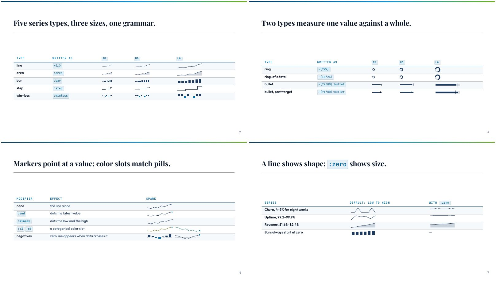
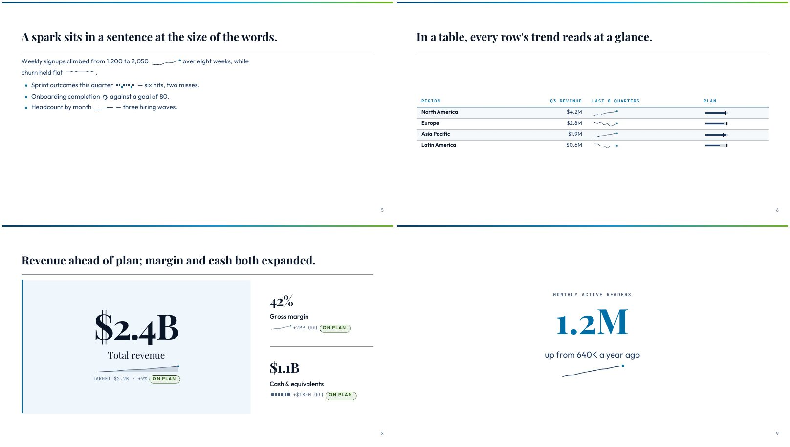
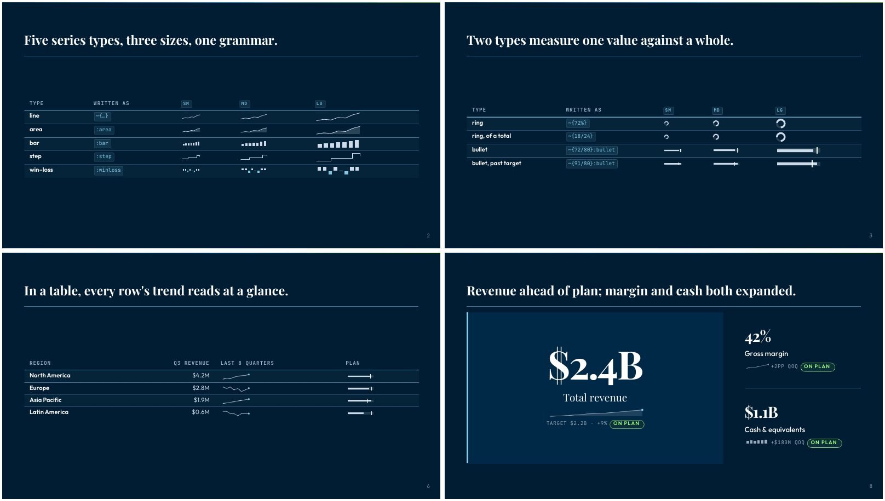

# Sparks — word-sized charts, written like pills

**Status:** proposed. The authoring spec and a prototype exist; no engine code does. The
prototype renders through the real engine by loading ahead of the inline-code dispatcher
(`prototype/patch.js`), so the renders below are genuine engine PDFs, not mockups.

## 1. What a spark is, in one example

```markdown
| Region | Q3 revenue | Last 8 quarters | Plan |
| --- | ---: | --- | --- |
| Asia Pacific | $1.9M | `~{0.8 0.9 1.1 1.2 1.4 1.5 1.7 1.9}:end` | `~{1.9/1.6}:bullet` |
```

The first span draws a small line of eight quarters with a dot on the latest one. The second
draws a bar against a target tick. Both sit in their table cells at the size of the text
around them, and each one is a single inline-code span.

A **spark** is a chart the size of a word: no axes, no labels, no legend. Edward Tufte called
the line version a *sparkline*. We use "spark" for the whole family, because two of the seven
types are not lines. There is no sparkline support in the engine today. The two earlier
mentions are a `trend` modifier proposed as a "sparkline placeholder" for `kpi`
(`2026-05-04-authoring-proposals.md` §3.4) and "inline sparkline treatment" left for later in
`2026-07-04-cartesian-chart-family.md`.



## 2. Why it is a pill and not a component

A pill (`lib/core/inline-pills.js`) is a label an author writes in inline code — `{LIVE}:tag:c4`
— that renders wherever inline code can go: a table cell, a list item, a `kpi` line, a sentence.
A trend has the same shape of need. It belongs next to the number it explains, and that number
lives in many different components. A `spark:` slot in each component would mean one change per
component and still miss running text. A directive in the shared dispatcher
(`lib/core/inline-code-directives.js`) reaches all of them at once and follows HARD RULE #1:
both render paths call one kernel.

## 3. The grammar

```
`~{DATA}`            the defaults: a line (for a series) or a ring (for one value), size md
`~{DATA}:mod:mod`    modifiers in any order, at most one per axis
`\~{DATA}`           escaped: shows the literal text, backslash removed
```

**The opener is `~{`.** Pill labels cannot hold commas or several numbers, so a spark needs its
own opener. `~` reads as "trend", and `~{` collides with nothing: across every tracked `*.md`
file the only span that opens with it is a regex quantifier, `` `~{3,}` ``, in an engineering
note. Its body is not numbers, so it stays literal anyway.

### 3.1 Data — two shapes

| Shape | Written | Means | Used by |
|---|---|---|---|
| **Series** | `12 14 13 17 21` | 2–48 numbers, space-separated, oldest first | line, area, bar, step, winloss |
| **Ratio** | `72/80` or `72%` | one value against a whole or a target; `72%` means `72/100` | ring, bullet |

A number is digits with an optional sign (`-` or `−`) and optional decimals. **No units, no
thousands commas, no currency signs**: `1,200` is literal code. The number the reader needs
is already in the text next to the spark, and the spark only has to carry its shape. This
also keeps the parser a whitespace split, with no locale rules.

### 3.2 Modifiers — six axes

| Axis | Values | Default | Applies to |
|---|---|---|---|
| **type** | `line` `area` `bar` `step` `winloss` `ring` `bullet` | `line` for a series, `ring` for a ratio | — |
| **size** | `sm` `md` `lg` | `md` | all |
| **color** | `c1`–`c12`, the pills' categorical slots | the surrounding text color | all |
| **width** | `fill` — stretch to the line's full width | the size's fixed width | all but ring |
| **scale** | `zero` — start the value axis at 0 | low-to-high | line, area, step |
| **markers** | `end` (latest value), `minmax` (low and high); both allowed | none | line, area, step |

**A span that doesn't parse stays literal code, and nothing is guessed.** An unknown modifier,
a repeated axis, a modifier on a type it doesn't apply to (`:bar:end`), or data of the wrong
shape (`~{72%}:bar`) all leave the `<code>` as written. This is the pill rule, and for the
pill's reason: a wrong chart that looks plausible survives review, while a literal
`~{3 5 4}:c13` on a slide doesn't.

## 4. The seven types

| Type | Data | Shows | Use it for | Not for |
|---|---|---|---|---|
| **line** | series | shape of change | revenue by quarter, weekly signups | fewer than ~4 points |
| **area** | series | shape, with weight | a hero trend under a `kpi` value | a table column (too heavy repeated) |
| **bar** | series | size of each period | monthly counts, discrete periods | 30+ points (bars merge) |
| **step** | series | levels that hold, then jump | headcount, price tiers, a status level | smooth quantities |
| **winloss** | series (sign only) | hit or miss per period | sprints, quarters beat/missed | magnitudes (it discards them) |
| **ring** | ratio | one part of a whole | completion, utilization | several parts (use `piechart`) |
| **bullet** | ratio | value against a target | plan attainment in a table | a trend over time |

**Considered and left out:**

- **Discrete ticks** (Tufte's other sparkline). `winloss` covers the binary case and `line`
  covers the rest.
- **Box / range.** It needs five numbers per spark and can't be read at word size.
- **Multi-slice pie.** A second slice can't be read at 1em; `piechart` is the component for it.
- **Two series in one spark.** Put two sparks side by side with color slots (`:c3` and `:c5`,
  as on slide 4).
- **A heat strip** (one colored cell per period). This one is interesting, and it is the one
  worth adding later if it's asked for. It needs a color ramp rather than `currentColor`, so it
  is a second color model and not just another shape.

## 5. The three sizes

Sizes are in **em**, so a spark scales with the text it sits in. The same `md` spark is small
in a table cell and larger in a `kpi` line without any per-component CSS.

| Size | Box (height × width) | Where |
|---|---|---|
| `sm` | 0.8em × 3em | running prose — keeps the line box, so paragraph spacing doesn't jump |
| `md` | 1em × 4.5em | table cells, `kpi` supporting lines, list items |
| `lg` | 1.7em × 7.5em | a caption under a `big-number`, a comparison table where the trend is the point |
| `fill` | the size's height × 100% | a hero trend spanning a `kpi` tile |

A ring is square: its height is its width. Stroke width grows a little with size
(`max(1.25px, 0.07em)` at `md`) so a large spark doesn't look like a hairline.

**Widths are fixed per size on purpose.** Tufte sized the width by point count. We don't,
because in a table every row's spark has to be the same width to be compared, and the table is
the main use.



## 6. Scaling — the one honesty decision

**By default, line, area and step run from the series' own low to its own high.** That's what
makes a sparkline useful, because it shows the shape of change. But it also turns a flat series
into a dramatic one: churn moving between 4% and 5% looks like spikes. The prototype showed
exactly that, and it is slide 7's first row.

**`:zero` starts the axis at 0.** Churn from 4 to 5 then reads as flat, which is the truth.
The author chooses, because only the author knows whether the claim is "it moved" or "it held".
**Bars always start at zero.** A bar's length *is* its value, so a bar that starts anywhere else
misstates the value itself, not just the emphasis. `winloss` uses the sign only. `bullet` runs
from 0 to 8% past the larger of value and target, so the target tick never sits on the edge. A
ring clamps at 100%.

A zero line (dashed, `--muted-mark`) appears only when a series crosses zero.

## 7. Color and marks

- **Ink is `currentColor`.** A spark takes the color of the text it sits in, so it follows the
  theme, dark mode and any component that recolors its text (HARD RULE #3: no hex anywhere).
- **`c1`–`c12`** set it to `--cat-N-mark`, the same slots pills use.
- **The `end` dot is `--accent`**, whatever the line color, so "now" looks the same in every
  spark on a slide.
- **`minmax` dots are the line color**, slightly smaller than `end`.
- **`winloss` draws a loss in `--accent`**, below the midline. The position carries the meaning,
  so the color is a second channel and not the only one. Whether losses should use a status
  token instead is question (e) in §10.
- **Area fill** is the line color at 20%, and a **bullet or ring track** at 16–18%.

**Dots are HTML, not SVG.** The chart stretches to its box (`preserveAspectRatio="none"`), so an
SVG circle turns into an ellipse, and a `fill` spark is often 20× wider than it is tall. The
first prototype had exactly that defect. Each dot is a small `<i>` placed by percentage over the
SVG, so it stays round at any width. Lines keep an even stroke under the stretch through
`vector-effect: non-scaling-stroke`.



## 8. Accessibility

Every spark is `role="img"` with a generated `aria-label`: "Trend, 8 points, from 0.8 to 1.9,
low 0.8, high 1.9"; "6 up, 2 down, of 8"; "72%"; "1.9 against a target of 1.6". The SVG
itself is `aria-hidden`. A screen reader hears the numbers, never the drawing.

## 9. Where sparks belong

A spark earns its place where a slide shows a **current number that has a history**, and the
history changes how you read the number.

| Component | Placement | Verdict |
|---|---|---|
| `kpi` | a supporting line under the value; `:fill` for a hero trend | **primary** — its contract already promises "trend" |
| `table` | a trend column, a plan column | **primary** — one trend per row is the classic use |
| `big-number` | in the caption, `lg` | **primary** — answers "is that good?" without a chart slide |
| `list-tabular`, `split-panel`, `stats`, prose, list items | anywhere inline code goes | works; no extra placement CSS |
| chart components (`line`, `bar`, …) | — | **no** — a chart inside a chart |
| `diagram`, `flowchart`, `state-chart`, `cycle`, `journey` | — | **no** — their nodes are states or relations, not series |

**Known blocker:** chart captions are a flex column, so any inline element in one stacks on
its own row (issue #2266). A spark in a chart caption breaks the same way until that is fixed.
It doesn't affect any placement above.

**Checked in the prototype:** `kpi` turns a trailing inline code span into a status pill
(`base.modifiers.css`, the `code:last-child` rule). A spark renders as a `<span>`, not a
`<code>`, so it never matches that rule. Slide 8 shows a spark and a pill on the same line.

## 10. Questions for the owner

Each one has a recommendation. The prototype already implements the recommended answer.

- **(a) The name.** "Spark", with `lat-spark` as the class. *Alternative:* "sparkline" is the
  known term, but it is wrong for `ring` and `bullet`.
- **(b) The opener `~{`.** Zero collisions (§3). *Alternative:* `{…}:spark` would reuse the
  pill opener, but pill labels reject commas and spaces, so the pill parser would need a
  special case, and the type would have to be named on every spark.
- **(c) The v1 type set: all seven.** They share one kernel, and `ring` and `bullet` came
  nearly free. *Alternative:* the five series types first, with ratio types in a second PR.
- **(d) Default scaling: low-to-high, with `:zero` opt-in.** This is standard sparkline
  practice, and slide 7 shows both. *Alternative:* zero by default, which is honest about size
  but flattens most real business series (uptime at 99.2–99.9% becomes a straight line).
- **(e) Loss color in `winloss`: `--accent`.** It stays palette-blind. *Alternative:* a status
  token (the red/green register), which reads faster but ties sparks to the status palette.
- **(f) 48 points maximum.** Past that, bars merge at `md` and the data is a chart, not a spark.
- **(g) `lint:deck` coaching.** A span that opens with `~{` but doesn't parse gets a warning
  naming the reason (the pill rule has no such warning today). Recommended, since the literal
  fallback is silent otherwise.

## 11. Implementation plan (after the spec is settled)

1. **Kernel** `lib/core/inline-sparks.js`: `parse` → `resolveMods` → `resolve()` returning
   *fields* (type, size, marks, label), never markup, exactly like `inline-pills.js`. The
   prototype's `resolve()` already has this shape.
2. **Two builders:** `sparkHtml` for the markdown-it path and `sparkElement` for the runtime
   mirror. The runtime builder uses `createElementNS`, because assigning markup inside the frame
   is the post-sanitize injection HARD RULE #22 bars.
3. **Dispatcher:** add sparks to `renderHtml`, `renderElement` and `dispatches()` in
   `inline-code-directives.js`. The escape rule then covers `\~{` for free.
4. **CSS** in `lib/base/base.modifiers.css` next to `.lat-pill`: no hex (#3), no margin (#20,
   which is why spacing is `padding-inline`), no `@layer` (#26).
5. **Sanitizer:** the docs site's `sanitizeSlideHtml` already keeps inline chart SVG (`path`,
   `rect`, `vector-effect`, custom properties in `style`), per its own tests. Add a test pinning
   `circle`, `stroke-dasharray` and the `<i style="--x…">` dots.
6. **Tests:** parser table (every literal case in §3.2), geometry (zero line, clamping, bar
   baseline), aria labels, and engine/runtime parity.
7. **Lint:** the §10(g) near-miss warning in `lib/authoring/lint-core.js` (#7).
8. **Docs + deck:** a spark section in `lib/base/base.docs.md`, `examples/inline-sparks.md` built
   from `prototype/sparks.body.md` (HARD RULE #9), and a `changelog.d/` fragment.
9. **Exports:** PDF and HTML carry the SVG as is. PPTX and PNG take a screenshot of each slide
   (`engineering/pipeline.md` §4), so a spark comes along with no extra work. The
   Studio's text layer skips it, as it should: the aria label is the text.

## 12. The prototype

`prototype/` holds the scratch kernel (`sparkline.js`), a preload that routes inline code through
it (`patch.js`), the CSS (`spark.css`), the deck body (`sparks.body.md`), and `render.sh`, which
builds light and dark decks and renders them through `lattice-emulator.js` into
`.scratch/sparks/`. Run `bash engineering/decisions/2026-09-28-inline-sparks/prototype/render.sh`.

Three defects the prototype caught are already fixed in it:

- **The ring arc.** `pathLength` was ignored in print, so the ring drew as a full circle. The
  fix sets the dash from the real circumference.
- **Stretched dots.** The fix moves them to HTML overlays (§7).
- **Churn that looked like spikes.** The fix is the `:zero` modifier (§6).
