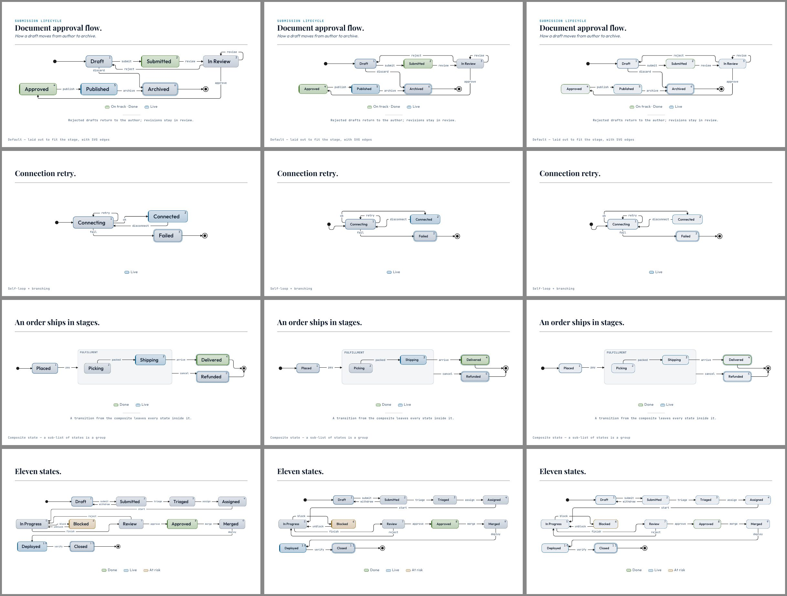
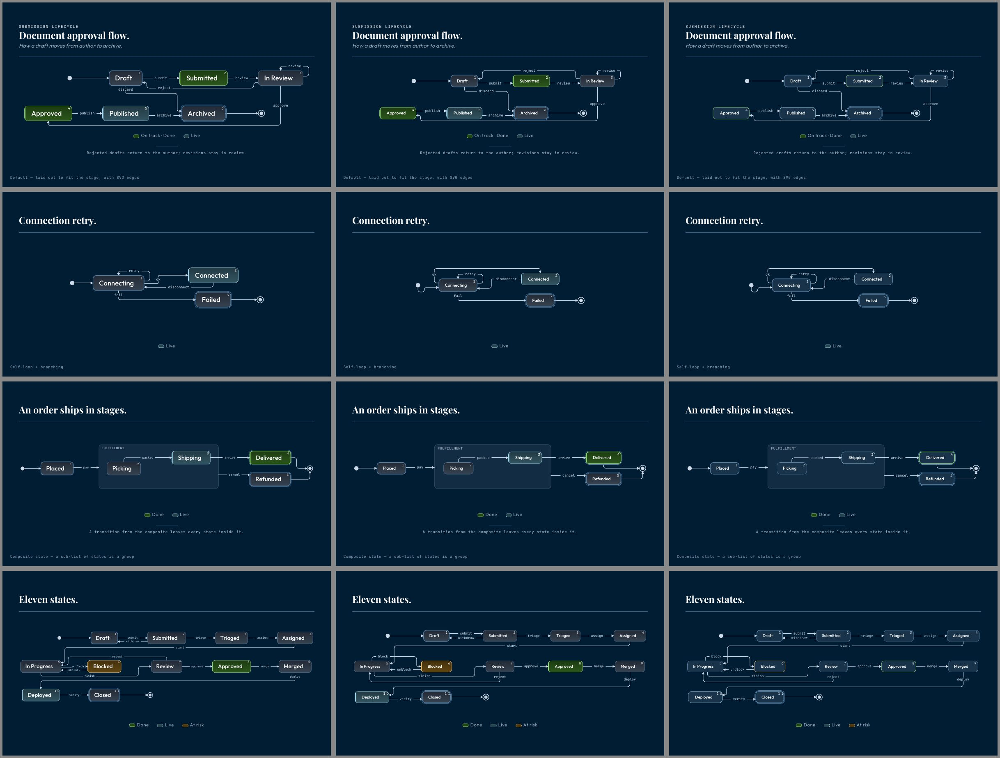

# Should the state chart be a flowchart preset? (2026-10-05)

**Status: proposed.** The owner picks one option below. Nothing ships before that pick,
because the answer changes how every state chart looks. Origin:
`followups.d/2424-p2-state-chart-as-flowchart-preset.md`.

## The question

After #2424 the two graph charts share the grammar, the Trama kernel, the router, the
line painter, the group painter, the key and the fit loop. What still differs is the
**tile**, the box a state or a step is drawn in:

| | state chart (`.state-node`) | flowchart (`.fc-node`) |
|---|---|---|
| type size | the slide's body type | `max(--chart-text-min, 1.17cqi)` |
| wrap width | 25cqi | 17cqi |
| right padding | room for the badge (two digits) | none |
| fill | a gradient in the state's status hue, plus a leading accent | flat, the status hue mixed into the tile |
| badge | the state's place in the list | none |

The follow-up asked whether the state chart should take the flowchart's tile and become a
flowchart preset (the flowchart plus badges and the start and end markers). It is a design
question, not a speed question: #2424 measured a flowchart-sized state tile and found it
did not buy typing parity.

## The options

- **A. Keep two tiles (today).** The state chart keeps its own tile. The code they share
  stays shared, as it is now.
- **B. Shared tile metrics.** The state tile takes the flowchart's type size and wrap
  width. It keeps its badge, gradient and accent.
- **C. A flowchart preset.** The state tile becomes the flowchart's tile exactly (type,
  wrap, flat fill), plus the badge. The state chart's adapter shrinks to a preset on the
  flowchart's: badges, and the start and end markers, which the flowchart could then use
  too.

## What each looks like

Each sheet shows four slides as rows (the document approval chain, the connection retry,
the composite, and an 11-state chain) and the options as columns, A, B, C. Every slide
was rendered by the CLI export from the same Markdown, with B's and C's tiles applied as a
stylesheet override:

C's prototype drops the status gradient and accent and keeps the status border, so a status
state in column C reads paler than it would once built. A built C would fill a status tile
the way the flowchart does (`flowchart.styles.css`, the `[data-s]` rows), which adds back
some tint and does not change any size below.

## Measured

The median height of a state name's text, in pixels on a 1280 × 720 slide, and the fit
scale Trama gave the chart (from the exported HTML, in Chromium):

| slide | A: name px (fit) | B: name px (fit) | C: name px (fit) |
|---|---|---|---|
| Document approval (6 states) | 33.8 (1.25) | 21.3 (1.25) | 21.3 (1.25) |
| Connection retry (3 states) | 33.8 (1.25) | 22.5 (1.25) | 22.5 (1.25) |
| Composite (5 states) | 29.7 (1.10) | 21.0 (1.23) | 21.0 (1.23) |
| 11-state chain | 27.4 (1.01) | 20.2 (1.19) | 20.2 (1.19) |

So the flowchart's tile does what #2424 measured, raising the fit scale (1.01 → 1.19 on
the 11-state chain), but the type it scales is smaller, and the names land **26–37%
smaller** on the slide. Three of the four charts already sit at the 1.25 ceiling under A,
so B and C cannot grow them at all. They only shrink the type.

The smaller tiles also change the lines. With more room between them, the router takes
longer ways round: the connection retry's `ok` line leaves over the top of `Connecting`
and the approval chain's `reject` line climbs over the first row under B and C, where under
A each runs a short way below the tiles.

## The pros and cons

| | for | against |
|---|---|---|
| **A** | Names read largest (27–34 px). No deck changes. The code is already shared where it pays: grammar, kernel, router, painters, key, fit. | Two tile stylesheets to keep in step. |
| **B** | One type size across both graph charts. | Names 26–37% smaller on every state chart. Longer line detours on small machines. Every state-chart PDF changes. |
| **C** | One adapter less; the flowchart gains badges and markers. | All of B's cost, and the state chart loses its gradient and accent, the look the owner kept in #2424. A large refactor for no visible gain. |

## Recommendation

**A, keep the state chart's tile.** A state chart has few states and short names, so it
can afford big type, and big type is what a room reads. B and C give that up to match a
chart whose steps carry longer text. Neither buys speed (#2424 measured that). If the
owner wants the two charts to look alike, the cheaper path is the reverse of B: give the
flowchart a larger tile when its steps are short. That is a separate question.

If the owner picks B or C, the work is a new PR: the tile change, every state-chart deck
re-rendered light and dark, and the golden diff reviewed.
