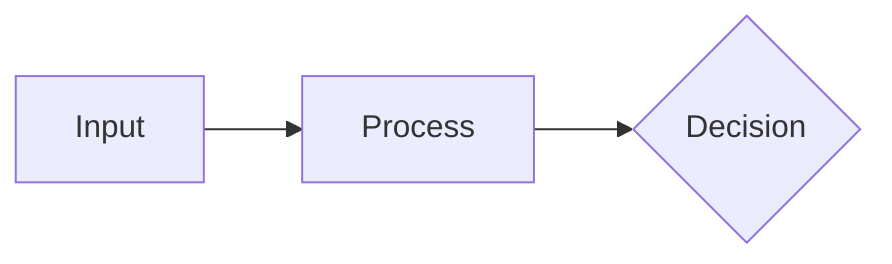
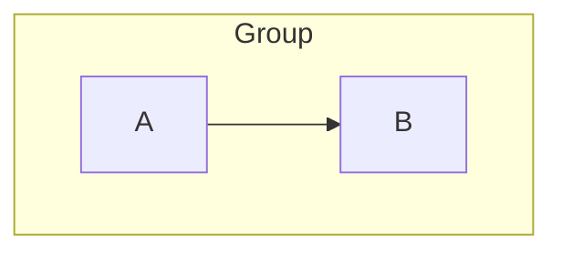

# Part 5: Mermaid Diagram Integration

## 5.1 Diagrams in Markdown

Write a fenced ` ```mermaid ` block. That is the whole authoring surface — the
engine owns the render on both paths, and neither one is Marp's built-in Mermaid:

````markdown
<!-- _class: diagram -->

## How signals move from input to decision.


````

| Path | Who renders | When |
| --- | --- | --- |
| PDF / export (`lattice-emulator.js`) | `mmdc` (Mermaid's CLI, one process per diagram) | build time, pre-rendered to inline SVG |
| Live preview (`dist/lattice-runtime.js`) | `mermaid.render()` in the browser | on the live DOM, in the Playground / Studio / marp-vscode |

**The `.html` player takes a third step past either path: it BAKES the diagram.**
The player sanitizes its slide DOM (`sanitizeSlideHtml`), and that sanitizer bars
the two things a Mermaid SVG leans on — the `<style>` mermaid injects into it, and
`<foreignObject>`, which is where *every* node/edge/cluster label lives (HTML
smuggled into the SVG namespace: the mXSS shape we keep shut, HARD RULE #22). So
before assembly each diagram is flattened into a self-styled SVG whose labels are
native `<text>` (`flattenSvgStyles(svg, win, { foreignObjectLabels: 'text' })`,
`lib/components/chart/_chart-family/standalone-svg.js`), driven by the CLI's own
player capture and by the Studio's `bakeDeckSections`. Charts are deliberately NOT
flattened — they are token-driven and the player ships the CSS that drives them, so
freezing their computed colors would pin them to the export-time scheme and kill both
the player's light/dark toggle and Read·Article's `figure.chart-frame` recolor.
Mermaid has no such dependency: it bakes its colors at render time either way.

The Studio's webpage export has one extra beat the CLI does not need. `mmdc` has
already substituted an SVG for the fence by the time the CLI serializes, but the
browser render is still a raw `<pre><code class="language-mermaid">` — the runtime
inflates it, and the player ships no runtime. So the Studio mounts the deck in the
shared capture frame, waits for the runtime's own `data-mermaid-state` to settle, and
reads the settled sections back out. Skip that and the exported file freezes the
un-rendered form: raw Mermaid source on the slide, and a wall of it where Read·Article
should show the diagram.

**The bake's one invariant: ink and surface move together, or neither does.** The player
has a light/dark toggle, so every paint the bake writes is either *frozen* at the export
scheme or *following* (emitted as `var(--token)` when it equals that token's current
value). Mixing the two on one label is what makes a diagram illegible rather than merely
stale: `mermaid.css` re-themes label ink through
`.label tspan:not(.lp-own-ink){fill:var(--text-heading)!important}`, so a label's INK
follows the toggle whether or not the bake emits a token for it — only the SURFACE under
it can be frozen. Freezing a surface while its ink follows therefore *guarantees* the
divergence. Two corollaries, both learned by measuring:

- Every paint goes through one matcher (`followToken`). The label HALO — the `<rect>`
  `foreignObjectToText` writes under the words — was the one paint that bypassed it, and
  mermaid paints an edge label's halo from the slide canvas, so it froze at the export
  scheme while the ink above it followed: 1.09:1 on `seven-steps-problem-to-code`, 1.06:1
  on `deck-class-register`, after a toggle (#1635).
- When a paint under a label genuinely cannot follow (an author's own background matches
  no token), the label's ink is frozen to its bake-time literal and marked `lp-own-ink`,
  which takes the theme rule off it. Frozen-together is legible-but-stale; frozen-apart is
  invisible.

Component contract, slots, and the anti-patterns:
`lib/components/diagram/diagram/diagram.docs.md`.

A hand-written `<div class="mermaid">` renders on NEITHER path and is a silent
no-op: the emulator's pre-pass matches fences only
(`preprocessMermaid`, `lattice-emulator.js`), and the runtime picks up
`pre > code.language-mermaid` and treats a sibling `div.mermaid` purely as the
SVG *target* it inserts itself (`lib/runtime/index.js`). Earlier advice here to
prefer that div over a fence was wrong; use the fence.

## 5.2 Node Shapes Reference

| Syntax     | Shape             | Use For             |
| ---------- | ----------------- | ------------------- |
| `root`     | Default           | Auto                |
| `((Text))` | Circle            | Emphasis nodes      |
| `(Text)`   | Rounded rectangle | Leaf nodes / items  |
| `[Text]`   | Square            | Category nodes      |
| `{{Text}}` | Hexagon           | Root / group nodes  |
| `)Text(`   | Cloud             | Ideas / concepts    |
| `))Text((` | Bang              | Alerts / highlights |

Use different shapes for different hierarchy levels to aid visual scanning.

## 5.3e The node look — `mode: sketch` reaches the diagram

A deck in `mode: sketch` (or the legacy deck-wide `class: sketch`) bakes Mermaid's
native **hand-drawn** node renderer, so the diagram is drawn by the same hand as the
slide around it. Mermaid 11 bundles rough.js for this; the engine turns it on by
emitting `look: 'handDrawn'` in the init config.

`resolveDiagramLook` (`lib/core/diagram-look.js`) is the single answer, the sibling
of `resolveDiagramBand`. Like the band, it must be decided BEFORE mmdc runs: `look`
swaps the whole node renderer (`g.node > rect` becomes
`g.rough-node > g.basic.label-container > path`), so no later CSS rule can apply or
undo it. The rule, in precedence order:

1. **Texture wins.** A palette that routes categories through `--cat-N-texture`
   renders classic, always — see below.
2. **A slide naming a mode token owns its look.** `_class: boardroom` opts one slide
   out of a sketch deck; `_class: sketch` opts one in on a plain deck.
3. **Otherwise inherit the deck** (`mode:` first, then a deck-wide `class:`).

A deck that resolves to classic emits **no `look` key at all** rather than the
explicit default, so its directive stays byte-identical to what it emitted before
the look existed.

### Coloring a rough node — use `stroke`, not `fill`

A rough node **has no fill.** rough.js emits two paths, both carrying `fill="none"`:
the first is the "fill" (a bundle of stroked hachure lines), the second is the
outline. So the categorical cycle in `mermaid.css` paints rough nodes with `stroke`.
Both wrong turns look like a CSS typo and are worth knowing:

- setting `fill` on the parent `<g>` does nothing — the paths' own `fill="none"`
  attribute means there is nothing to inherit;
- setting `fill` on the paths turns each squiggle into a filled blob.

### Why texture palettes keep crisp shapes

On `a11y-*`, `onyx` and `concrete`, categories are told apart by **pattern**, not
hue — the M1 redundant-encoding channel (`engineering/textures.md`) that a
color-blind or monochrome reader depends on. A pattern paint-server sampled through
a 4px variable-width stroke reads as speckle, not a tile (the same reason the sankey
ribbons stay on a flat color), so the channel cannot survive the hand look.
Measured on `a11y-deuteranopia`: four distinct tiles collapse to four grays 5% apart.

Rule 1 is therefore checked FIRST, ahead of the per-slide pin — a deck cannot opt
back in one slide at a time. Style does not outrank an accessibility affordance.
Those decks still get the hand type everywhere else; only the diagram shapes stay
machine-drawn.

### The type comes too, and it is a SEPARATE answer from the shape

Diagram **labels** render in the hand face on a sketch deck (#1674). That is not a
second sketch rule — `base.sketch.css` re-points `--font-body` to `--sketch-font-body`,
and the diagram map reads `--font-body`, so the type follows the token like everything
else on the slide.

The two answers come apart on purpose, and the split is worth holding on to:

| | hand SHAPE (`resolveDiagramLook`) | hand TYPE (`resolveDiagramHandType`) |
|---|---|---|
| `mode: sketch`, ordinary palette | ✓ | ✓ |
| `mode: sketch`, `a11y-*` / `onyx` / `concrete` | ✗ rule 1 | ✓ |
| `mode: sketch`, `--print` band | ✗ rule 1 | ✓ |
| `_class: boardroom` on a sketch deck | ✗ | ✗ |
| `_class: sketch` on a plain deck | ✓ | ✓ |

Rule 1 exists because a per-category PATTERN cannot survive being painted through a
hachure stroke — that is about the redundant-encoding channel and says nothing about
type. So a texture deck in `mode: sketch` gets **hand labels inside machine-drawn
nodes**, which is what "those decks still get the hand type everywhere else" above has
always meant. `resolveDiagramLook` calls `resolveDiagramHandType` rather than
repeating rules 2 and 3, so the two cannot drift.

### Which families the hand SHAPE reaches — measured, not assumed

**SIX, not four.** This section said four (flowchart, state, class, ER) and named mindmap
among the families that "ignore `look` entirely". Both were wrong: `mindmap` and
`requirementDiagram` go through rough.js too. Measured on Mermaid 11.14 by rendering every
family twice, `look: 'handDrawn'` against the default, and counting rough nodes in the
output — `test/integration/mermaid/diagram-look-support.test.js` pins the result so the
list cannot rot again.

| honors `look: handDrawn` | ignores it |
|---|---|
| `flowchart` · `stateDiagram-v2` · `classDiagram` | `sequenceDiagram` · `gantt` · `pie` · `journey` |
| `erDiagram` · **`mindmap`** · **`requirementDiagram`** | `timeline` · `quadrant` · `sankey` · `xychart` |
| | `C4Context` · `block` · `packet` · `architecture` · `gitGraph` |

Two entries in the right column look like they honor it and do not: `gitGraph` and
`architecture-beta` emit *different bytes* under `handDrawn`, but the difference is a
random commit hash and an Iconify element id respectively — no rough geometry. Anyone
re-deriving this table by diffing SVGs needs to count rough nodes, not compare bytes.

Everything in the right column stays crisp on a sketch deck until Mermaid migrates it —
but every family gets the hand TYPE. Not from one lever: `themeVariables.fontFamily` is
the global one, and it is joined by mermaid's separate TOP-LEVEL `fontFamily` and by the
28 per-block `*FontFamily` keys that c4 / journey / sequence / timeline read instead
(§5.3e). A sketch deck therefore speaks in one voice everywhere and draws by hand wherever
Mermaid can (#1674).

## 5.3 Theme matching, and your own `%%{init}%%`

**Do not hand-copy theme variables into your diagram.** The engine already hands
Mermaid the whole set — 150-odd keys resolved from the active palette — on both
paths. Hand-copying freezes a snapshot of one palette: the diagram then ignores a
theme switch, a dark slide, and the print look.

**One map, two readers.** Which Mermaid variable is fed by which palette token is
decided once, in `lib/core/mermaid-theme-map.js`. Each path supplies only a
`readToken` — `getComputedStyle(section)` in the preview, offline token
resolution against the palette text in the PDF path — and `buildDiagramTheme`
does the rest. Before that, the two paths held separate copies of the same map
and 38 values had drifted apart. There is now **no sanctioned divergence at all**:
`fontFamily` was the last one and retired with #1674, and
`test/unit/core/diagram-theme-parity.test.js` compares every key with no exception set.

**They deliver it the same way, too, as of #1674.** Both paths set the palette on the
global config with `mermaid.initialize` and let Mermaid merge your in-source
`%%{init}%%` over it per render — which is where the guarantee below comes from. The
export used to be the odd one out: it shelled out to the `mmdc` binary, one process per
diagram, so its config could only travel *in* the diagram source and a hand-written
merge kernel spliced it in ahead of yours. It renders in a page the engine owns now
(`lib/integrations/mermaid/render-worker.js`), so the kernel is gone and the merge is
Mermaid's own.

The mapping is `MERMAID_VAR_MAP` in `lib/core/mermaid-theme-map.js`, imported by
both paths. `test/unit/mermaid/mermaid-var-map.test.js` asserts every token it
names resolves in every self-declaring palette;
`test/unit/palette/diagram-ink-contrast.test.js` holds each ink key to AA against
the surface it is actually drawn on, per palette and per scheme.

### The non-text tier — strokes, edges, grid lines and axis rules

WCAG has two contrast floors and the engine gates both, in two deliberately
non-overlapping places. **Text** is `diagram-ink-contrast.test.js` at 4.5:1 (§5.3d).
**Graphics** — anything that carries meaning without being text — is
`diagram-nontext-contrast.test.js` at **3:1** (SC 1.4.11).

A shape is judged by **discernibility**, not by any single pair: it passes if ANY of
its three candidate edges clears the floor — fill vs canvas, border vs canvas, or
border vs its own fill. A node with an invisible border but a fill that separates
cleanly from the canvas is perfectly legible, and a gate that judged border-vs-fill
alone would condemn it and teach the next person to "fix" something that reads fine.
A LINE has no fill to fall back on, so it is judged on its one pair — against the
surface it is actually drawn on, which is not always the canvas (a quadrant divider
and a plotted point sit on a quadrant's own fill). The tables are in
`test/helpers/diagram-surfaces.js`, shared with `tools/audit-diagram-contrast.mjs`,
and are written out rather than derived from `MERMAID_VAR_MAP` for the same reason
the ink gate hard-codes its `SITES`: derive the pairing from our own map and a
mis-assigned key is simply re-judged against the tier it was mis-assigned to.

**`--diagram-stroke` is the token this tier turns on, and it feeds fourteen keys** —
`primaryBorderColor`, `secondaryBorderColor`, `tertiaryBorderColor`, `nodeBorder`,
`actorBorder`, `labelBoxBorderColor`, `activationBorderColor`, `pieOuterStrokeColor`,
`taskBorderColor`, `tagLabelBorder`, `quadrantExternalBorderStrokeFill`, `border2`,
and both `xyChart` axis line colors. (`border2` is the weakest of the fourteen —
mermaid consumes it in exactly one rule, `div.mermaidTooltip`'s border, which cannot
exist in an export.) Every palette used to declare it as a flat,
mode-invariant literal (`#000000` on onyx, `#1F4A6E` on indaco), so on a dark canvas
it was a dark line on a dark page: 24 of 64 palette-modes had a flowchart node, gantt
bar, pie slice and sequence actor with **no discernible edge at all**, and the a11y
family sat at exactly 1.00:1.

**The fix was a re-curation, not a re-architecture, and `cuoio` is why.** It already
passed with a flat literal, because `#8B7E6D` is a genuine mid-tone that clears both
of its canvases (3.71:1 light, 4.74:1 dark) — where indaco's `#1F4A6E` banked 9.28:1
on light it had no use for and collapsed to 1.85:1 on dark. `lib/theme/derive.js` had
the right rule all along (`withChroma(withLightness(e.accent, 0.5), 0.09)` — lightness
0.5, a mid-tone); the hand-authored palettes were the drift. Twelve were retuned; only
`concrete` needed a `light-dark()` pair, because its light canvas is a mid-gray
`#B8B8B5` that no single value can bridge to a near-black dark canvas. **There are 14
values to curate, not 32: every `-dark` twin inherits its base's through `@import`.**

**`--diagram-stroke` REACHES ONE NON-MERMAID SURFACE**, and re-curating it moved that
surface too: `state-chart` reads it for the node's leading accent edge
(`state-chart.styles.css`, `--state-node-stroke` / `--fill-ink` / `.state-node-accent`).
Measured in real Chromium, accent against the tile it sits on, the change is a trade
that is good in dark and costly in light — onyx 1.35 → 3.42 dark but 15.91 → 3.44
light; indaco 1.56 → 3.47 dark, 7.27 → 3.27 light. **No light context drops below the
3:1 floor, and every dark one rises toward it** (magnolia dark 1.02 → 2.59 is still
under, but far better than it was). The light accent is nonetheless three to five times
lighter than it was, which is a visible change to that component and is called out here
because nothing else in the change mentions it.

**Curating a new palette's stroke:** pick a mid-tone in the palette's own hue that
clears 3:1 against BOTH its canvases, and reach for `light-dark()` only when the two
canvases are too far apart for one value — which, on this evidence, is rare.

**Three keys were reading the wrong tier**, and all three are the same shape as the
`gitBranchLabel` error (§5.3d) — a token curated for one surface, used on another:

| key | was | now | why |
|---|---|---|---|
| `gridColor` | `--diagram-done` | `--muted-mark` | a pale gantt BAR FILL used as a LINE; 1.30:1 on 49 of 64 |
| `noteBorderColor` | `--diagram-today` | `--diagram-stroke` | the gantt TODAY MARKER's hue used as a note's border |
| `quadrantInternalBorderStrokeFill`, `quadrantPointFill` | `--cat-8-mark` | `--cat-on-fill` | a SIBLING of the quadrant fills, used ON them |

The first two undo a **documented value reuse** in `lib/base/base.tokens.css` group 3
("the grid borrows the `done` tone; the note border borrows the `today` highlight").
That dedup equated a SURFACE with a LINE, and the two have different floors — a fill
may sit a hair off the canvas, a line drawn on it may not. `doneTaskBkgColor` keeps
`--diagram-done` and `todayLineColor` keeps `--diagram-today`: the jobs those tokens
are named for.

**The numbers this tier reports are deliberately optimistic.** They are the baked
`themeVariables`. `mermaid.css` puts `stroke-opacity` below 1 on several strokes (the
radar graticule at 0.20, its axis lines at 0.5) and a translucent stroke blends toward
what is under it, so a pair passing at 3.05:1 can still render below the floor. The
gate never reports a failure that is not real; it can miss one.

### Which keys are levers — measured, and the answer is "all of them"

The folk answer is that Mermaid's `updateColors()` mixes colors out from under us, so
control is limited. That is testable: send a sentinel for every color key Mermaid
emits — alone, and again alongside the engine's full set — and see which come back.

```
mermaid emits            243 color themeVariables
Lattice sets             194
unused (a lever exists)   52
of ours, not in a bare base theme   3   (fontFamily, labelColor, labelBackground)
mermaid IGNORES            0   <- keys with no lever at all
our own keys overridden    0
```

The three headline numbers do NOT partition on their own, and the report prints the
missing term rather than leaving it to be re-derived: 243 − 52 = 191 shared, and
194 − 3 ours-only = 191. Two earlier defects in this census are worth knowing, because
both made it assert more than it had measured. Its color test matched only
`#`/`rgb()`/`hsl()`, so the nine keys mermaid states as bare CSS names were invisible
to it — including `gridColor` and `todayLineColor`, the two keys this page's own table
re-points, which the "honors all of them" claim had therefore never probed. And it
built our theme from a single repeated hex, which cannot detect a clobber that assigns
one of our keys FROM another — mermaid has two such assignments. Distinct per-key
sentinels now; the answer is unchanged, the method now earns it.

*(`node tools/audit-diagram-contrast.mjs --report levers`.)* **Nothing is clobbered in
either direction.** Mermaid's color maths is a *fallback for unstated keys*, not an
override of stated ones — so an off-brand color in a Lattice diagram is a token pointed
at the wrong tier or a key nobody named, never a knob Mermaid withheld. 34 keys are
stated for the first time in this pass (36 were tried; `nodeBkg` and `compositeBorder`
turned out to be inert in mermaid 11.14 and were dropped) (the stateDiagram set, the requirementDiagram
set, architecture's edges and group border, `venn1`–`venn8`, C4's `personBkg`, the ER
row bands, `border2`/`arrowheadColor`, `xyChart.dataLabelColor`), which is
where the stock-looking state, requirement, venn, architecture and C4 renders came from.

**Two things are genuinely outside `themeVariables`**, and are worth knowing before
hunting for a theme key that does not exist:

- **`sankey.linkColor` is a diagram CONFIG key, not a theme variable.** Its default is
  already `gradient`, so this was never the sankey's problem. The actual defect was
  that Mermaid paints every link through an inline `mix-blend-mode: multiply` — a
  light-canvas assumption that darkens toward the backdrop, correct on white and
  catastrophic on a dark deck, where the whole flow rendered as a near-black smudge
  beside correctly-colored node bars. `mermaid.css` overrides it to `normal` and
  raises the ribbon opacity 0.4 → 0.55 to make up the darkening multiply had been
  contributing on light.
- **The xy chart has no gridline and no plot-frame lever, and CSS cannot supply one.**
  `XYChartConfig` offers width, height, title sizing, data-label toggles and
  orientation — nothing that draws a grid. Verified against the rendered SVG: the
  chart emits `g.plot`, `g.bottom-axis`/`g.left-axis` (each with `g.axis-line`,
  `g.ticks`, `g.label`) and a single `rect.background`, and **no gridline elements at
  all**. A stylesheet can restyle elements; it cannot create them. Closing this needs
  either an upstream Mermaid feature or post-render injection in `lib/runtime`, which
  is a HARD RULE #22 markup sink and its own piece of work. The axis rules and ticks
  ARE now on-palette and clear 3:1, which is the part that was fixable here.

**A `subgraph` box is drawn entirely from the containment tier** — fill
`--c-container`, boundary `--c-container-edge`, label ink `--c-on-container` (and
the `-subcontainer` trio one rung in). Not `--bg-alt`, which is the deck's *card*
fill; not `--diagram-stroke`, which doesn't flip with color-scheme and so went
dark-on-dark; not `--cat-on-fill`, which is the *categorical* tier's ink. The distinction matters because a
cluster sits *behind* the categorical node fills and must not compete with them,
which is a different job from a card sitting on the canvas. `--c-container` is
part of the 91-token per-theme contract, so every theme curates it (they differ
sharply — indaco `#E8F0F7`, concrete `#A8A8A8`). This only reaches PLAIN
clusters: a `.section-N` cluster (mindmap, timeline, kanban) is overridden to
`--cat-N-fill` by `mermaid.css`'s band cycle.

Legibility is **gated**, not assumed —
`test/unit/palette/containment-contrast.test.js` holds every theme in both schemes
to ink ≥ 4.5:1 on its rung and edge ≥ 3:1 on the fill it outlines. The fill is
deliberately a barely-there step from the canvas (it is a surface, not an accent),
which is exactly why the *boundary* is what has to carry the grouping semantic and
is what the gate measures. Curate a new theme's edge from its own stroke hue and
lighten it only as far as 3:1 demands; that keeps it on brand.

### Writing your own directive

An `%%{init}%%` of your own is fine and costs nothing — the engine's directive
goes in ahead of yours and Mermaid merges init directives in source order, later
winning. So you set what you name; everything you don't name keeps the palette:

````markdown

````

Renders with `curve: linear` **and** the theme's cluster fill, node fills and
label ink. Same for `layout`, `defaultRenderer`, per-diagram-type config, or a
partial `themeVariables` override — name `lineColor` alone and only `lineColor`
changes.

### One non-palette config, both paths (#1347)

`engineInitConfig` (`lib/integrations/mermaid/init-directive.js`) holds the shared
**non-palette** options, and the preview builds its `mermaid.initialize` argument from
it rather than hand-rolling a second copy. It always claimed to be shared; the runtime
did not call it, so eight keys diverged with nothing watching — the `themeVariables`
gate of the day could not see them.

The one that bit was `flowchart.wrappingWidth`: 480 in the preview against Mermaid's
default 200 in the export. Wrapping width decides where a label breaks and a label
break decides the node's **width**, so the same deck laid its flowcharts out
differently on the two paths. Measured on one long-labeled node, exported:
`461.86 × 151` before, `741.86 × 88` after — narrow-and-tall becomes wide-and-short,
which is what the preview had been showing all along.

Now shared: `flowchart.wrappingWidth`, `flowchart.htmlLabels`, `markdownAutoWrap`, the
seven `quadrantChart` type sizes (preview-only before, so an exported quadrant rendered
its labels at Mermaid's much smaller defaults), and `c4.c4ShapeInRow` /
`c4BoundaryInRow` (export-only before, so a C4 diagram crammed one row live and fanned
across two in the export).

`DIVERGENT_CONFIG` is the enumerated exception set, and three of its four entries are
not choices at all. `securityLevel`, `startOnLoad` and `suppressErrorRendering` are on
Mermaid's own **secure-key list**, and its `sanitize` deletes them from anything that is
not `mermaid.initialize` — so the PDF path, whose config can only travel in a
`%%{init}%%` directive, structurally cannot state them. Putting them in
`engineInitConfig` would emit keys Mermaid silently drops and call it parity. (The
effective values agree anyway: Mermaid's default `securityLevel` IS `strict`.) The
fourth, `flowchart.useMaxWidth`, is a deliberate preview behavior — inside
`section.diagram` mermaid.css forces sizing with `!important` and the key cannot be
seen; outside one, flipping the export would change how every exported diagram is
constrained, which is a layout change rather than a parity fix.

`test/unit/mermaid/init-config-parity.test.js` fails on an unlisted divergence, on a
sanction that no longer diverges, and on a Mermaid upgrade that takes one of those three
off its secure list (which would make it shareable).

**Both paths now use the deck's own body face.** A diagram reads `--font-body`, like
every other run of text on the slide, which is also how `mode: sketch` reaches diagram
labels (§5.3e) with no sketch-specific code in the diagram path at all.

It was not always so, and the reason is worth keeping because it constrains anyone who
reintroduces a directive transport. The export used to bake `"JetBrains Mono",
monospace`: `sanitizeDirective`'s allow-list for directive-borne `themeVariables`
values (`/^[\d "#%(),.;A-Za-z]+$/`) has **no hyphen**, so a stack containing
`system-ui` / `sans-serif` was silently replaced with `""` the moment it rode in a
directive — and a blank font is worse than an absent one, because Mermaid then measures
labels in one face while the page renders them in another, clipping them mid-word.
Monospace was the only kind of stack that survived the filter, and its `monospace`
generic tail meant the fallback it was measured in had near-identical metrics. That
allow-list still governs any directive **you** write; it no longer governs the engine,
because the engine no longer writes one.

### Four families carry their OWN font key, and the global one does not reach them

`themeVariables.fontFamily` is global, and most families follow it. **C4, journey,
sequence and timeline do not.** Mermaid's config schema gives them per-element
`*FontFamily` keys — `c4.personFontFamily`, `journey.taskFontFamily`,
`sequence.actorFontFamily`, `timeline.taskFontFamily` and so on — each defaulted to
`"Open Sans"` or `"trebuchet ms"`, and those win for the elements they cover.

Left alone, that means a `mode: sketch` deck renders a C4 context diagram with **33 of 34
labels in Open Sans** while every other word on the slide is hand-drawn. Measured, and
found by eye on an export before any gate noticed — the label census had been printing it
for a whole review round.

`engineInitConfig` now sets all of them from the same `--font-body` value. **C4 has
twenty-two**, not the six an obvious reading finds: every shape has an `external_` twin,
and systems/containers/components each have `_db` and `_queue` variants, so a first cut
that set six left every `System_Ext` label in Open Sans.

There is a **twenty-ninth** key, and it is not in a block: mermaid's own top-level
`config.fontFamily`, which is separate from `themeVariables.fontFamily` and does not
follow it. Setting it is not cosmetic — mermaid measures SEQUENCE layout with it, so a
sketch deck spaced its lifelines for trebuchet ms and then painted the messages in the
hand face: `price(lane, equipment, readyAt)` overran its own arrow and crossed the next
lifeline. Same measure/paint split as #1674's headline bug, one level up.

The list has to be enumerated in the kernel (it is pure and fs-free, so it cannot read
mermaid's schema), which means it can rot — so
`test/integration/mermaid/diagram-font-parity.test.js` derives the truth from the
installed mermaid and fails when a key it defines is one the engine does not set. That
derivation carries **no exemptions**: an earlier cut skipped a `venn.fontFamily` that does
not exist, an artifact of a parent-guessing heuristic that attributed the top-level key to
whichever block the bundle happened to declare last.

`tools/check-diagram-labels.js` catches the same defect from the other end, and it asks
the question against the deck rather than against a list of famous names: every label is
compared to `--font-body` on its OWN `<section>`, so a face that is merely wrong fails
exactly like `Open Sans` does, and a `_class: diagram boardroom` opt-out is judged by what
that slide asked for. A fence whose author pinned a theme is exempt by fact, not by guess
— the emulator stamps `data-author-theme` on it.

**A warning about apostrophes in your own directive**, from the same measurement:
Mermaid runs a blanket `'` → `"` swap over a directive payload before `JSON.parse`, so
a single apostrophe in any value makes the payload invalid JSON and Mermaid's catch
drops **every** directive in the diagram — including the palette, leaving you with
stock `#ECECFF`/`#333333`. A hyphen only blanks the one value it appears in; an
apostrophe costs you the lot. Use double quotes.

The one thing that *does* stand the engine down is naming a Mermaid **theme** in
a `%%{init}%%` directive:

````markdown
```mermaid
%%{init: {'theme': 'forest'}}%%
```
````

Any theme name Mermaid actually resolves — `dark`, `forest`, `neutral`, `neo`,
`redux`, … — other than `base`, reads as an explicit opt-out, so the engine sends no
`theme` and no `themeVariables` and you get Mermaid's stock `forest`: off-palette by
definition, immune to a theme switch, and reported as "kept their own colors" by the
export's look re-bake. Reach for it only when you genuinely want a diagram outside the
deck's palette.

**The stand-down has to be all-or-nothing, and that is why it is a stand-down rather
than a merge.** The engine sets essentially every Mermaid theme variable, so a
half-hearted version — sending our variables and letting your `theme:` sit on top —
would leave the pin doing almost nothing, because ours would win for every key we set.
Measured with `theme: forest` on an indaco deck: standing down gives cluster `#cdffb2`
and node `#cde498` (forest's own), where sending the palette anyway gives `#E8F0F7` /
`#BCD5EC` (indaco's).

*(Mechanically this changed with #1674 and behaves identically. The export used to
implement the stand-down by emitting no `%%{init}%%` directive at all; it now passes
`omitPalette` to `engineInitConfig`, which drops `theme` and `themeVariables` and keeps
everything else. That is a small improvement on the old hole: a pinned diagram used to
lose `wrappingWidth`, `padding` and the quadrant/c4 sizes to Mermaid's defaults too.
Opting out of the palette is not opting out of the layout.)*

A name Mermaid does **not** resolve is not an opt-out. `theme: 'Forest'` (wrong
case), `theme: ''`, or a typo would leave you with no theme from Mermaid *and* no
palette from the engine — stock `#ffffde` — so the engine keeps the diagram
instead. Theme lookup is case-sensitive and exact on Mermaid's side.

**Two spellings the stand-down does NOT cover**, both pre-dating #1311 and both
re-measured under the new transport:

- **`%%{INIT: …}%%` in caps.** Mermaid's directive scanner is case-insensitive
  but its init-type filter is not, so Mermaid applies nothing from an uppercase
  directive. The engine matches that case-sensitively and sends the palette as if it
  weren't there — the palette lands, and your directive is ignored by both of us.
  Write it lowercase.
- **A theme set in YAML front matter** (`---\nconfig:\n  theme: forest\n---`).
  You get the deck palette, not `forest` — measured on the real export, cluster
  `#E8F0F7`. The stand-down reads the `%%{init}%%` spelling only. Use the directive
  form to opt out.

**The stand-down is still export-path-only** — a `theme:` pin exports stock and
previews on-theme. That gap is unchanged by #1674 and is not a transport problem: the
runtime configures Mermaid once per RUN of diagrams sharing a palette and renders the
run's fences concurrently against that one global config, so standing down for a single
pinned fence means re-initializing mid-run. Worth doing; it is a change to the preview's
render queue rather than to this file, and it is tracked separately.

Before #1311 the export was worse than any of this: ANY directive made it skip the
injected palette entirely, and the diagram silently fell back to Mermaid stock
(`#ffffde` clusters, `#333` label ink). If you are looking at an off-theme
diagram with a directive in it, that regression is what
`test/integration/mermaid/mermaid-init-merge.test.js` guards.

**`layout: 'elk'` works on the EXPORT and does nothing in the preview.** The directive
survives the merge on both. `@mermaid-js/layout-elk` ships inside mermaid-cli's bundle,
which the export's render page loads and the worker registers (as the CLI does); the
runtime bundle carries no elk at all.
So a diagram pinning elk lays out differently in the two places, and the preview is the
one that is wrong. Mermaid does not fail on an unregistered algorithm:
`getRegisteredLayoutAlgorithm` falls back to dagre with a `log.warn` you never see, so
the preview renders on-palette, laid out by dagre, looking like the directive worked.
Measured on Mermaid 11.14 — export `viewBox="4 4 324.92 70"` against dagre's
`viewBox="0 0 320.69 67"` on the same fence. Registering elk in the runtime bundle is
separate work from #1311.

---

## 5.3d Which ink goes where

Diagram text comes from **three** tokens, chosen by what the text sits on:

| site | token | examples |
|---|---|---|
| on a categorical **fill** (the pale band) | `--cat-on-fill` | node label, gantt bar, pie slice, sequence actor, band |
| on a categorical **mark** (the saturated band) | `--cat-on-mark` | gitgraph branch label |
| on the **canvas** (`--bg` / `--bg-alt`) | `--text-heading` | diagram title, pie legend, quadrant axis labels, gantt margin text |

The mark tier joined last (#1348). `gitBranchLabel0-7` sits on `git0-7`, which is
fed from `--cat-1..8-mark`, and was being inked with `--cat-on-fill` — ink curated
for the *pale* band, used on the saturated one, at 1.2:1 to 3.0:1 in every palette
and both schemes. `--cat-on-mark` already existed and is already gated ≥4.5:1
against every `--cat-N-mark`; nothing had ever pointed at it. Note the scope
honestly: this fixes the **baked** SVG. On a Lattice slide `mermaid.css` repaints
the branch chip with `--cat-N-fill` and its text with `--cat-on-fill` (both
`!important`), so the slide already showed a matched pair and is unchanged — the
baked values are what matters wherever our CSS does not ride along.

It used to be one token for the first and third. That is invisible on 27 of the 32 palettes,
where `--cat-on-fill` is declared as `var(--text-heading)` — and wrong on the
`a11y-*` family, which **pins** its categorical tier mode-invariant (fixed pale
chips carrying the CVD textures) while the canvas still flips. In a dark context
that gives `--cat-on-fill: #000000` on a `#000000` canvas: 1.00:1.

**Flowchart edge labels are the exception, and they need CSS.** Mermaid paints
node labels and edge labels from a single rule (`.label text, span`), so no
themeVariable can serve both — a node label is on a chip, an edge label is on
`edgeLabelBackground`. `mermaid.css` re-pairs the edge label's ink with the
canvas, out-specifying Mermaid's ID-scoped rule.

`test/unit/palette/diagram-ink-contrast.test.js` holds each ink key to AA against
the surface it is actually drawn on, for every palette in both schemes. Its
`SITES` table — ink key → the themeVariable it lands on — is deliberately
hard-coded rather than derived from the map: derive it and the gate simply
re-judges a mis-assigned key against its new tier and stays green.

---

## 5.3c The subgraph box — corner, and what "padding" can and cannot reach

The cluster (`subgraph`) box is a **containment surface**: `--c-container` fill,
`--c-container-edge` border, `--c-on-container` label ink. Its corner is
`--diagram-cluster-radius`, applied by `mermaid.css` as a CSS `rx`/`ry`:

```css
:is(section, figure) g.cluster:not([class*="section-"]) > rect {
  rx: var(--diagram-cluster-radius); ry: var(--diagram-cluster-radius);
}
```

Three things about that rule are load-bearing:

- **`border-radius` does nothing to an SVG `<rect>`.** Rounding is `rx`/`ry`, and
  Chromium accepts both as CSS geometry properties. Mermaid writes no `rx` for a
  flowchart cluster (`node.rx` is undefined for a subgraph), so there is no
  presentation attribute to fight and no config knob to use instead — CSS is the
  only lever.
- **One rule covers both render paths.** The mmdc SVG is embedded inline in the
  exported HTML, so the same bundle cascades onto it that the preview applies.
- **The value is in SVG USER SPACE, not `cqi`.** A geometry property is read in
  the diagram's own viewBox coordinates and then scaled by the fit, so a
  container-relative unit would land at a different size on every diagram. User
  space is also the right space: 14-unit type, 8-unit dagre margins and 1-unit
  strokes all live there, so the corner stays proportional to the box at any
  scale.

`.section-N` clusters are excluded — they are painted from the **categorical
band**, not the containment tier, and Mermaid already rounds them at `rx=5`.
Enumerated from rendered output, three things emit `g.cluster`: a flowchart
`subgraph`, a classDiagram `namespace` (so that rounds too), and kanban
(excluded). Timeline and mindmap emit none, and a stateDiagram composite carries
`statediagram-cluster`, a different class token.

**Padding — read this before reaching for `flowchart.padding`.**

| what you want | the knob | reality |
|---|---|---|
| space between a node's label and its border | `flowchart.padding` | works — `DIAGRAM_NODE_PADDING`, one constant, both paths |
| the cluster's own inset from its children | — | **hardcoded** `marginx/marginy: 8` on the sub-graph Mermaid hands to dagre. No config reaches it. |
| space between the subgraph title and its content | `flowchart.subGraphTitleMargin` | **do not use** — Mermaid grows the outer box but does not push a NESTED child cluster down with it, so the inner rect paints over the outer title |

`flowchart.padding` is a **node** inset despite the name. Raising it from 8 to 24
leaves cluster-minus-node constant at 70 × 100 user units — it grows the nodes,
and the cluster only follows because its children got bigger.

---

## 5.3b Which band a diagram is baked for

A Mermaid SVG **bakes** its colors: `themeVariables` are resolved to literal hex
before the shape reaches the page, so a later CSS restyle cannot recolor a node
label. The chip *underneath* it — the categorical fill, the texture, the canvas —
is live, per-section CSS. Ink and chip are two halves of one decision, and they
agree only if both halves answer the same question the same way.

`lib/core/diagram-band.js` **is** that question. `resolveDiagramBand({
frontMatter, slideClass, flagPrint })` returns `light` | `dark` | `print`, in this
precedence:

1. **Print wins.** Paper is ink-on-white — not a color scheme, so nothing about
   light/dark outranks it. `color-mode: print`, the engine `--print` /
   `--image-mode print` flag (which writes that key), or a per-slide `_class: print`.
   The legacy `class: print` also sets it — but only on a deck with no `color-mode:`
   key at all, because the key supersedes the whole legacy color axis
   (`lib/core/deck-class-register.js`).
2. **A slide that names a color-mode token owns its scheme.** `_class: light` on
   a dark deck renders light. "Names a color-mode token" is whole-token
   membership in `COLOR_MODE_TOKENS` (`lib/core/color-mode.js`) — the same test
   the deck-class propagation guard uses to decide what the section's class ends
   up being.
3. **Otherwise the slide inherits the deck.**

Rule 3 is the one that was missing (#1340). The emulator used to spell rule 2 as
*"did this slide name **any** `_class:`?"*, so `_class: diagram` — which says
nothing about scheme, and is how every component is selected — forced light on a
`color-mode: dark` deck. The section genuinely was `.dark`; only the bake
disagreed.

**Only the PDF path calls it, and that asymmetry is the port, not a gap.** The
preview never resolves a band as such: it reads tokens through
`getComputedStyle(section)`, so CSS inheritance hands it whatever the section's own
classes resolved to, band included.

**Granularity — both paths are per slide (#1332 step 3).** The preview used to
configure Mermaid *once per document*, from the first `<section>`, so slide 1's
scheme was baked into every diagram in the deck: a light first slide gave slide 9's
`_class: dark` diagram light ink on a dark chip. That was the last surviving
instance of the #1326 bug class — chip is per-section CSS, ink is baked, and the two
were describing different slides. The reader now takes the section as a parameter
(`openSectionReader(scopeEl)`), which is all it takes: passing the right element in *is*
the fix, because inheritance already does the resolving.

Three things follow, and all three are load-bearing:

- **The palette is applied per BAND, not per diagram.** `mermaid.initialize` is
  global and `mermaid.render` takes no config, so per-slide themeVariables mean
  re-initializing between diagrams that resolve differently. Diagrams are grouped by
  the slide's cascade-context key (`lib/core/diagram-scope.js`) and the palette is
  built and applied once per group — one to three groups per deck, never one per
  slide. Rebuilding 166 variables per fence on a 150 ms debounce is what that avoids.
- **The renders are ordered against the config.** One promise chain, so
  `initialize` for band B cannot land between band A's render calls. Diagrams
  *within* a band still render concurrently, exactly as the whole deck used to.
- **The SVG cache is keyed by (scope, source), not source.** A source-only key was
  sound only while one palette served the deck; per-slide ink makes it hand slide 2
  slide 1's baked SVG, which is the same mismatch arriving through the cache.

**What per-band configuration costs.** Measured on the real Playground with a
20-diagram deck that ALTERNATES bands — the worst case, since every slide is a new run:
first render 936–948 ms before, 987–1013 ms after (+5–8%); the keystroke re-pass is
unchanged, because everything but the edited fence comes from the (scope, source) cache.
Re-measure with `node tools/bench-preview-diagrams.mjs` (needs the docs site running);
`npm run bench` cannot reach this path at all, since it drives the Node renderer and
there is no `getComputedStyle` there to be slow.

### The kernel drives; the paths supply capabilities (#1332 step 4)

Neither path assembles a palette any more. `renderDiagrams`
(`lib/core/render-diagrams.js`) walks the deck, resolves each slide's
`themeVariables` from the one map, and calls the path back:

```js
renderDiagrams(deck, { readToken, renderOne, scopeKey, beginRun })
```

A `scope` is whatever a path needs in order to read a token for one slide, and the
two hand in genuinely different things — the PDF path a resolved band
(`{ band, hand }` — the band decides the palette, `hand` whether `--font-body` resolves
through the sketch re-point the offline reader cannot see in the cascade), the preview
the `<section>` element itself.
`scopeKey(scope)` names the palette that scope resolves, so the theme is built once
per distinct palette rather than once per slide: the band string on the PDF path, the
section's class signature (`lib/core/diagram-scope.js`) on the preview. Two spellings
of "these slides paint the same", which is all the kernel needs.

There is **no `finishTheme` port**, and there is no key a path may differ on. Both
used to exist for one reason — `fontFamily`, which could not survive mermaid's
directive sanitizer on the export — and #1674 removed the cause by taking the export
off directives entirely (§5.3). The parity gate now compares every key with no
exception set at all; a hook kept "just in case" is how the next divergence arrives
pre-authorized.

**The acceptance test was a deletion.** #1332 stated it: *"a correct fix should let us
DELETE the reconciliation devices, not accumulate more."* `data-lattice-slide-bake` —
a marker that announced "this render baked per slide" — is gone, along with
`SLIDE_BAKE_ATTR`/`stampSlideBake` and the qualifier on all nine pinned theme
selectors. Once both paths resolve per slide there is no granularity left to announce.
See `engineering/textures.md`.

**It also closed #1329 for free.** The PDF path used to take the last `_class:`
directive appearing anywhere before the fence, and `before` never reset at a slide
boundary — so a bare slide following a `<!-- _class: dark -->` slide got a dark-baked
diagram on a light canvas. Walking real slides means each fence reads its OWN slide's
directive (`lib/core/slide-class-spans.js`, boundaries from markdown-it's `hr` tokens
plus the `split: headings` points, not a line regex). Measured on the same three-slide
deck: `origin/main` logged `light, dark, dark`; this logs `light, dark, light`.

### 5.3.1 The source-side reconstruction, and why it keeps drifting

`slideClassSpans` answers a question the renderer already answers — "which slide is
this byte on, and what class does that slide carry?" — and it has to, because the PDF
path bakes a diagram's palette before a single `<section>` exists. **A second answer to
a question the renderer already answers will drift; the only question is whether the
drift is caught.** It was not, three times, each with the same signature: baked ink
against a live chip that does not match it.

| It disagreed when… | Because | Divergence live in the corpus at |
|---|---|---|
| the deck used a GLOBAL `<!-- class: X -->` | only the spot `_class` form was read; the bare form carries forward to the end of the deck | — (no committed deck uses the form) |
| a directive was QUOTED as prose | a raw text scan can't tell `` `<!-- _class: kpi -->` `` in a bullet from a real one, and the last on a slide wins | `kit/Sample-Deck.md` (slide 3) |
| a slide held a `$$…$$` equation | its LaTeX was parsed as Markdown, and a lone `=` line is a setext H1 — a boundary under `split: headings` | `lib/components/math/math/math.gallery.md` (16 sections, 17 spans) |

**Read that third column precisely.** It names where the RECONSTRUCTION diverged, not
where a diagram came out wrong. Both live instances land on slides that carry no
Mermaid fence, and all 119 fences in the tree resolve the same band before and after
the fix — so nothing in the corpus was rendering wrong, and the fix repairs no
committed artifact. That is the honest claim, and it is the one worth defending: the
value here is that three reachable shapes are closed and gated, on a question whose
last five defects (#1326 ×4, #1329) each shipped green.

Three structural answers, in the order they close the gap:

1. **One parser.** `lib/core/boundary-parser.js` is the single markdown-it instance for
   every off-render boundary caller (`bake-splits.js`, `section-source-split.js`,
   `slide-class-spans.js`). Each used to build its own beside a comment claiming it
   "mirrors the lib/engine parser"; a comment cannot make that true. It carries the
   `math_block` rule (`lib/core/math-block-rule.js`, split out of the KaTeX plugin so
   the grammar has one definition and no render dependency).
2. **One directive grammar on the RENDER + BAND path.** `lib/core/comment-directive.js`
   owns the `<!-- key: value -->` parse; `lib/engine/slides.js` binds the engine's
   vocabulary to it, `slide-class-spans.js` binds `class` alone. Directives are read off
   the TOKEN STREAM, so a `fence` or `code_inline` token is prose — as the renderer
   already treats it. Two source-side readers of the same syntax survive OUTSIDE that
   path and are tracked rather than claimed fixed: the deck linter
   (`lib/authoring/lint-core.js`) and the editor's autocomplete
   (`docs/src/playground/slide-context.js`) each still carry a `_class:`-only line regex
   with all three defect shapes intact. Neither decides a palette, which is why they are
   #1383 and not this change.
3. **One gate.** `test/unit/core/slide-class-span-parity.test.js` renders the WHOLE
   committed corpus through the real engine and asserts the reconstruction matches its
   sections — count and class, ~6,600 slides. None of the three defects was reachable
   by a test that only covers cases someone thought to write down; all three fail this.

The one sanctioned divergence is `_focusSteps`, which EXPANDS one authored slide into
several at render time. It is safe for the BAND because every expanded copy carries the
class of the slide it was copied from, and it is safe for the COUNT now too: `focusSteps`
used to group on `t.type === 'hr'` with no `level === 0` guard, unlike `splitOnHr`, so a
focus slide containing a nested `---` (inside a blockquote or a list) rendered one section
more than it should. Both grouping sites take the predicate from `lib/core/slide-rule.js`
(#1387). The gate detects the divergence off the token stream, not a text scan — a decision record that merely *discusses* `_focusSteps` in
prose must not be excused from the slide-count check.

**What the gate structurally cannot see**, and is worth knowing before trusting it: it
verifies `spans(md) ≡ render(md)`, while production needs
`spans(md) ≡ render(preprocessMermaid(md))`. The bake splices SVG back into Markdown,
and a blank line followed by `---` inside that SVG really does produce a section the
reconstruction has no span for. That gap is not closable from this side — it is a
consequence of baking before rendering at all, which is the question #1385 asks.

**#1385 is answered: this module is on a RETIREMENT path, not a growth path.**
Nothing between the bake and the render needs the baked SVG — measured, not argued:
of the nine real `rawMd` reads in the emulator, one is the render itself, one (the
player envelope's "verbatim source") is actively harmed by it, one already
re-derives a fence-intact source to work around it, and six read front matter and
do not care. `engine.render` is called exactly once, so the early bake amortizes
nothing either. The ordering is an accident of module-evaluation position.
Inverting it — render first, bake per `<section>`, which is what the runtime path
already does — deletes this module, its corpus gate, and the SVG-through-markdown-it
hazard above. Scheduled, with the plan and the one piece that can go silently wrong
(the image-set re-bake's index alignment), in
`engineering/decisions/2026-08-05-bake-before-render-ordering.md`. **A new defect
here is a reason to bring that forward, not a reason to add a fourth layer.**


---

## 5.4 Diagram Titles

**Convention.** The slide's `## heading` is the canonical title. Mermaid's own title (whether set via YAML frontmatter `title:` or in-body `title` directive) is suppressed by CSS so the audience sees one source of truth, not two. Authors keep the `title` directive in source for portability — the diagram still makes sense if extracted — but it does not render on the slide.

**Where the suppression lives.** A single rule in `lattice.css`'s DIAGRAM OVERRIDES section (`section .titleText, section .pieTitleText, …, section [class$="TitleText"] { display: none; }`). Loaded by every render path; reaches the inline SVG via the host page cascade. No per-palette duplication.

**Class list (verified from rendered output, Mermaid 11.14).**

| Class | Diagram type | Title syntax |
| --- | --- | --- |
| `.titleText` | gantt | in-body `title` |
| `.pieTitleText` | pie | in-body `title` |
| `.radarTitle` | radar-beta | in-body `title` |
| `.packetTitle` | packet-beta | in-body `title` |
| `.flowchartTitleText` | flowchart | frontmatter |
| `.classDiagramTitleText` | class diagram | frontmatter |
| `.erDiagramTitleText` | ER diagram | frontmatter |
| `.requirementDiagramTitleText` | requirement diagram | frontmatter |
| `.gitTitleText` | gitgraph | frontmatter |
| `[class$="TitleText"]` | safety net | catches future `*TitleText` variants |

**Known gap — bare `<text>` titles.** Six diagram types render their title as a `<text>` element with no CSS class: sequence, journey, C4, quadrant, timeline, xy-chart. These cannot be class-targeted from CSS and remain visible. The slide heading still provides the canonical title; the in-SVG title shows alongside it. This is a documented gap, not a bug. Trying to target these by structural position (e.g. "first text element") would be fragile across Mermaid versions.

**Two title syntaxes in Mermaid.**

1. **YAML frontmatter** (`---\ntitle: My Title\n---\nflowchart LR\n...`) — flowchart, sequence, class, state, ER, requirement, gitgraph, mindmap, and most types support this.
2. **In-body directive** (`gantt\n  title My Title\n...`) — gantt, pie, journey, quadrant, C4, timeline, xychart, radar, packet.

Some types accept both. The rendered CSS class is determined by diagram type, not by which syntax was used to set the title.

**Diagnostic recipe (when Mermaid adds a new diagram type).**

1. Add a `title` directive to the diagram in `lib/components/diagram/diagram/diagram.gallery.md`.
2. Build to HTML via `node lattice-emulator.js lib/components/diagram/diagram/diagram.gallery.md ...`.
3. Open the HTML in a browser so Mermaid renders the SVG client-side.
4. Save the post-render DOM (DevTools → Elements → copy outerHTML on the `<svg>`).
5. Grep for the title text string. Inspect the surrounding `<text>` element's `class` attribute.
6. If the class follows the `*TitleText` pattern, the existing safety net catches it automatically.
7. If it uses a bespoke class (like `radarTitle` or `packetTitle`), add it to the suppression rule in `lattice.css`'s DIAGRAM OVERRIDES section.
8. If the title renders as a bare `<text>` with no class, document it under the known-gap list above; do not attempt a structural selector.

**Never guess class names.** They are inconsistent across diagram types — some use camelCase suffix `TitleText`, some use bespoke names like `radarTitle`, some have no class at all. Always verify from rendered output.

**Marp-vscode preview parser quirk.** One CSS pattern is silently broken in the marp-vscode Chromium build (the preview applies via JS but the rule never matches): `:not(:has(...))` and `:is(:has(...), :has(...))`. Plain `:has()` is fine; nested inside `:not()` / `:is()` it isn't. Use descendant combinators or compound selectors instead. See `engineering/gotchas.md`. (Historical note: when the build path injected CSS via Mermaid's `themeCSS` init parameter, two additional limits applied — no CSS comments, no `>` combinator. That path no longer exists; rules now live in `lattice.css` and reach the SVG via host-page cascade, so both restrictions are gone.)

---
