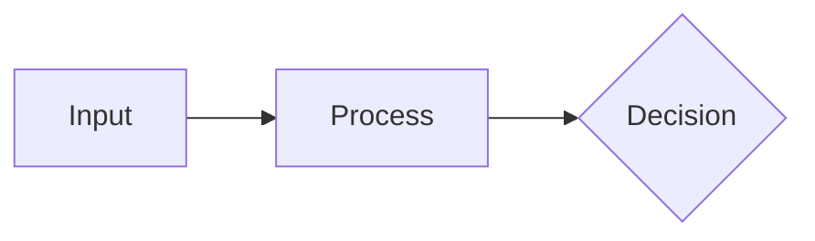
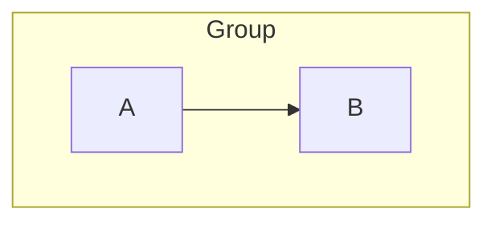

# Part 5: Mermaid Diagram Integration

## 5.1 Diagrams in Markdown

Write a fenced ` ```mermaid ` block. That is the whole authoring surface — the
engine owns the render on both paths, and neither one is Marp's built-in Mermaid:

````markdown
<!-- _class: diagram -->

## How signals move from input to decision.


````

| Path | Who renders | When |
| --- | --- | --- |
| PDF / export (`lattice-emulator.js`) | `mmdc` (Mermaid's CLI, one process per diagram) | build time, pre-rendered to inline SVG |
| Live preview (`dist/lattice-runtime.js`) | `mermaid.render()` in the browser | on the live DOM, in the Playground / Studio / marp-vscode |

Component contract, slots, and the anti-patterns:
`lib/components/diagram/diagram/diagram.docs.md`.

A hand-written `<div class="mermaid">` renders on NEITHER path and is a silent
no-op: the emulator's pre-pass matches fences only
(`preprocessMermaid`, `lattice-emulator.js`), and the runtime picks up
`pre > code.language-mermaid` and treats a sibling `div.mermaid` purely as the
SVG *target* it inserts itself (`lib/runtime/index.js`). Earlier advice here to
prefer that div over a fence was wrong; use the fence.

## 5.2 Node Shapes Reference

| Syntax     | Shape             | Use For             |
| ---------- | ----------------- | ------------------- |
| `root`     | Default           | Auto                |
| `((Text))` | Circle            | Emphasis nodes      |
| `(Text)`   | Rounded rectangle | Leaf nodes / items  |
| `[Text]`   | Square            | Category nodes      |
| `{{Text}}` | Hexagon           | Root / group nodes  |
| `)Text(`   | Cloud             | Ideas / concepts    |
| `))Text((` | Bang              | Alerts / highlights |

Use different shapes for different hierarchy levels to aid visual scanning.

## 5.3 Theme matching, and your own `%%{init}%%`

**Do not hand-copy theme variables into your diagram.** The engine already
injects the whole set — 150-odd keys resolved from the active palette — as a
`%%{init}%%` directive on the diagram source, on both paths. Hand-copying
freezes a snapshot of one palette: the diagram then ignores a theme switch, a
dark slide, and the print look.

The mapping is `MERMAID_VAR_MAP` in `lattice-emulator.js` (build path) and
`buildMermaidThemeVars()` in `lib/runtime/index.js` (preview path); a unit test
(`test/unit/mermaid/mermaid-var-map.test.js`) asserts every token it names
resolves in every shipped palette.

### Writing your own directive

An `%%{init}%%` of your own is fine and costs nothing — the engine's directive
goes in ahead of yours and Mermaid merges init directives in source order, later
winning. So you set what you name; everything you don't name keeps the palette:

````markdown

````

Renders with `curve: linear` **and** the theme's cluster fill, node fills, label
ink, and font. Same for `layout`, `defaultRenderer`, per-diagram-type config, or
a partial `themeVariables` override — name `lineColor` alone and only `lineColor`
changes.

The one thing that *does* stand the engine down is naming a Mermaid **theme**:

````markdown
```mermaid
%%{init: {'theme': 'forest'}}%%
```
````

`theme:` ≠ `base` reads as an explicit opt-out, so the engine injects nothing and
you get Mermaid's stock `forest` — off-palette by definition, immune to a theme
switch, and reported as "kept their own colors" by the export's look re-bake.
Reach for it only when you genuinely want a diagram outside the deck's palette.

The reconciliation lives in one shared kernel,
`lib/integrations/mermaid/init-directive.js`, so both render paths apply the same
rule. Before #1311 they did not: ANY directive made the build path skip the
injected palette entirely, and the diagram silently fell back to Mermaid stock
(`#ffffde` clusters, `#333` label ink). If you are looking at an off-theme
diagram with a directive in it, that regression is what
`test/integration/mermaid/mermaid-init-merge.test.js` guards.

**`layout: 'elk'` still does nothing — and says so only in a log.** The directive
now survives the merge, but elk ships as a separate package
(`@mermaid-js/layout-elk`) that neither `mmdc` nor the runtime bundle registers.
Mermaid does not fail on an unregistered algorithm: `getRegisteredLayoutAlgorithm`
falls back to dagre with a `log.warn` you never see, so the diagram renders
on-palette, laid out by dagre, looking like the directive worked. Verified on
Mermaid 11.14. Installing elk is separate work from #1311.

---

## 5.4 Diagram Titles

**Convention.** The slide's `## heading` is the canonical title. Mermaid's own title (whether set via YAML frontmatter `title:` or in-body `title` directive) is suppressed by CSS so the audience sees one source of truth, not two. Authors keep the `title` directive in source for portability — the diagram still makes sense if extracted — but it does not render on the slide.

**Where the suppression lives.** A single rule in `lattice.css`'s DIAGRAM OVERRIDES section (`section .titleText, section .pieTitleText, …, section [class$="TitleText"] { display: none; }`). Loaded by every render path; reaches the inline SVG via the host page cascade. No per-palette duplication.

**Class list (verified from rendered output, Mermaid 11.14).**

| Class | Diagram type | Title syntax |
| --- | --- | --- |
| `.titleText` | gantt | in-body `title` |
| `.pieTitleText` | pie | in-body `title` |
| `.radarTitle` | radar-beta | in-body `title` |
| `.packetTitle` | packet-beta | in-body `title` |
| `.flowchartTitleText` | flowchart | frontmatter |
| `.classDiagramTitleText` | class diagram | frontmatter |
| `.erDiagramTitleText` | ER diagram | frontmatter |
| `.requirementDiagramTitleText` | requirement diagram | frontmatter |
| `.gitTitleText` | gitgraph | frontmatter |
| `[class$="TitleText"]` | safety net | catches future `*TitleText` variants |

**Known gap — bare `<text>` titles.** Six diagram types render their title as a `<text>` element with no CSS class: sequence, journey, C4, quadrant, timeline, xy-chart. These cannot be class-targeted from CSS and remain visible. The slide heading still provides the canonical title; the in-SVG title shows alongside it. This is a documented gap, not a bug. Trying to target these by structural position (e.g. "first text element") would be fragile across Mermaid versions.

**Two title syntaxes in Mermaid.**

1. **YAML frontmatter** (`---\ntitle: My Title\n---\nflowchart LR\n...`) — flowchart, sequence, class, state, ER, requirement, gitgraph, mindmap, and most types support this.
2. **In-body directive** (`gantt\n  title My Title\n...`) — gantt, pie, journey, quadrant, C4, timeline, xychart, radar, packet.

Some types accept both. The rendered CSS class is determined by diagram type, not by which syntax was used to set the title.

**Diagnostic recipe (when Mermaid adds a new diagram type).**

1. Add a `title` directive to the diagram in `lib/components/diagram/diagram/diagram.gallery.md`.
2. Build to HTML via `node lattice-emulator.js lib/components/diagram/diagram/diagram.gallery.md ...`.
3. Open the HTML in a browser so Mermaid renders the SVG client-side.
4. Save the post-render DOM (DevTools → Elements → copy outerHTML on the `<svg>`).
5. Grep for the title text string. Inspect the surrounding `<text>` element's `class` attribute.
6. If the class follows the `*TitleText` pattern, the existing safety net catches it automatically.
7. If it uses a bespoke class (like `radarTitle` or `packetTitle`), add it to the suppression rule in `lattice.css`'s DIAGRAM OVERRIDES section.
8. If the title renders as a bare `<text>` with no class, document it under the known-gap list above; do not attempt a structural selector.

**Never guess class names.** They are inconsistent across diagram types — some use camelCase suffix `TitleText`, some use bespoke names like `radarTitle`, some have no class at all. Always verify from rendered output.

**Marp-vscode preview parser quirk.** One CSS pattern is silently broken in the marp-vscode Chromium build (the preview applies via JS but the rule never matches): `:not(:has(...))` and `:is(:has(...), :has(...))`. Plain `:has()` is fine; nested inside `:not()` / `:is()` it isn't. Use descendant combinators or compound selectors instead. See `engineering/gotchas.md`. (Historical note: when the build path injected CSS via Mermaid's `themeCSS` init parameter, two additional limits applied — no CSS comments, no `>` combinator. That path no longer exists; rules now live in `lattice.css` and reach the SVG via host-page cascade, so both restrictions are gone.)

---
