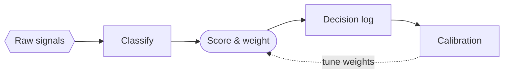

<!-- _class: title -->
<!-- _header: '' -->
<!-- _paginate: false -->
<!-- _footer: "Carbone curation · title" -->

# Carbone, on par

`Palette · categorical order, light fills, status pair`

The same hues in a different order, so a chart reads as several colors instead of three greens.

---

<!-- _class: line -->
<!-- _footer: "Chart cycle · light face" -->

`Chart cycle · most-distinct-first`

## Three series now read as green, blue and orange, not three greens.

- Q1 2025
  - Enterprise `4.1`
  - Mid-market `2.6`
  - Services `1.2`
- Q2 2025
  - Enterprise `4.4`
  - Mid-market `2.9`
  - Services `1.6`
- Q3 2025
  - Enterprise `4.2`
  - Mid-market `3.4`
  - Services `2.3`
- Q4 2025
  - Enterprise `3.8`
  - Mid-market `3.9`
  - Services `3.1`
- Q1 2026
  - Enterprise `3.6`
  - Mid-market `4.3`
  - Services `4.0`
- Q2 2026
  - Enterprise `3.5`
  - Mid-market `4.6`
  - Services `5.2`

---

<!-- _class: line dark -->
<!-- _footer: "Chart cycle · dark face" -->

`Chart cycle · the graphite face`

## The dark face keeps its vivid pigments, in the same new order.

- Q1 2025
  - Enterprise `4.1`
  - Mid-market `2.6`
  - Services `1.2`
- Q2 2025
  - Enterprise `4.4`
  - Mid-market `2.9`
  - Services `1.6`
- Q3 2025
  - Enterprise `4.2`
  - Mid-market `3.4`
  - Services `2.3`
- Q4 2025
  - Enterprise `3.8`
  - Mid-market `3.9`
  - Services `3.1`
- Q1 2026
  - Enterprise `3.6`
  - Mid-market `4.3`
  - Services `4.0`
- Q2 2026
  - Enterprise `3.5`
  - Mid-market `4.6`
  - Services `5.2`

---

<!-- _class: piechart donut -->
<!-- _footer: "Chart cycle · five slices" -->

`H1 2026 · 1,840 person-hours`

## Five wedges, five colors a room can tell apart.

The closest neighbors in the cycle are now 0.198 apart in OKLab, up from 0.094.

- Deck production `46%`
- Meetings about meetings `22%`
- Realigning on priorities `18%`
- Stakeholder management `9%`
- Actually deciding `5%`

---

<!-- _class: stacked-bar -->
<!-- _footer: "Chart cycle · stacked parts" -->

`Revenue mix · FY23–FY25`

## Services carries the growth, and its band no longer blends into licenses.

- FY23
  - Licenses `18.4`
  - Services `6.2`
  - Support `4.1`
- FY24
  - Licenses `19.1`
  - Services `9.8`
  - Support `4.6`
- FY25
  - Licenses `19.6`
  - Services `15.4`
  - Support `5.2`

---

<!-- _class: diagram -->
<!-- _footer: "Diagram cycle · light face" -->

`Diagram cycle · visible fills`

## Each flowchart box is a tinted wash of its own hue.

---

<!-- _class: diagram dark -->
<!-- _footer: "Diagram cycle · dark face" -->

`Diagram cycle · the graphite face`

## On graphite, each box is a deep fill under a bright edge.

---

<!-- _class: progress -->
<!-- _footer: "Status pair · warn and fail" -->

`H1 2026 · Phase 1 readiness`

## At-risk and blocked are two different colors now.

Warn moved to amber and fail to signal red; they were orange beside coral.

- Signal Intake `92%` `on-track`
- Scoring policy `68%` `at-risk`
- Decision Log `81%` `on-track`
- Calibration cadence `34%` `deferred`
- Adoption `12%` `blocked`

---

<!-- _class: closing -->
<!-- _header: '' -->
<!-- _paginate: false -->
<!-- _footer: "Carbone curation · closing" -->

`Carbone · both faces`

## Same hues, same lime, new order: carbone's charts now read like indaco's and cuoio's.
