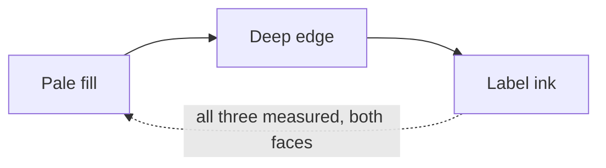

<!-- _class: title -->
<!-- _header: '' -->
<!-- _paginate: false -->
<!-- _footer: "Carbone light · title" -->

# Carbone, in daylight

`Palette · two faces on one contract`

The graphite deck now has a light counterpart — the same identity, solved for paper.

---

<!-- _class: content -->
<!-- _footer: "The accent · one hue, two lightnesses" -->

`Brand axis · the electric lime`

## The lime does not survive a light canvas, so it moves along one axis instead of changing hue.

- The measurement
  - `#7DE38A` reads 10.95:1 on graphite and **1.47:1** on paper.
- The move
  - The light arm is `#037829` — the **same hue**, holding **95% of the chroma**, at L 0.50 instead of L 0.83. It reads 5.24:1.
- Why it matters
  - A darker *electric* green, not a desaturated forest one.

`The bright value keeps the brand axis, the dark face, and the spectrum's dark arm.`

---

<!-- _class: checklist -->
<!-- _footer: "Status trio · the washes" -->

## The status washes are curated, not derived from the ink.

- [x] Pass, warn and fail inks sit at OKLCH L 0.29–0.55 — AA on a self-tinted band and twelve frozen CVD ratchets pin them there
- [x] Derived at 18%, a near-black ink over a light card measured chroma **0.0178** — very nearly achromatic
- [x] Curating the source lifts it to **0.0661**, and the ink-on-band contrast improves 5.78 → 7.04
- [-] Warn sits at the 3:1 graphical floor rather than AA; its pills were already sanctioned on both faces
- [ ] The tightest clearing CVD margin is +0.0126, at pass^warn under achromatopsia

---

<!-- _class: code -->
<!-- _footer: "The terminal register · code" -->

`Surfaces · what did not flip`

## The code block stays graphite on both faces, and that is the most recognizable thing carbone owns.

`--surface-inverse is dark in light mode too`

```css
/* One token decides it, and it is deliberately NOT an inverse of the canvas. */
--surface-inverse: light-dark(#0E0E10, #0E0E10);

/* So the twelve --hljs-* values curated for a near-black ground stay valid,
   unchanged, on a deck whose canvas is now off-white. */
--hljs-keyword: #7DE38A;   /* the electric lime, still doing its original job */
--hljs-string:  #88D4A8;
```

---

<!-- _class: diagram -->
<!-- _footer: "Categorical cycle · diagram" -->

`Diagrams · the three-layer contract`

## Twelve slots, each a flipping pair of one hue, solved rather than picked.



`Light arms hold each dark mark's hue and solve only lightness: mark-vs-canvas ≥3, ink-on-fill ≥4.5, on-mark ≥4.5, and fill ≠ mark.`

---

<!-- _class: content -->
<!-- _footer: "The ground · why neutral failed" -->

`The mistake worth recording`

## The first light face was built by inverting the dark ramp, and inverting an achromatic ramp gives gray mush.

- What "washed out" measures
  - Light `--text-body` carried chroma **0.0067**. Cuoio's is 0.0283, indaco's **0.0736**.
- What the references share
  - Tinted paper, chromatic ink, tinted *neutral* rows — a monochrome **with color in it**.
- What carbone's became
  - A cool graphite at h=252: paper C 0.0068, body ink C 0.0455.

`A green ground was tried first and rejected — it swallowed the semantic pass state.`

---

<!-- _class: content -->
<!-- _footer: "The rule that generalizes · content" -->

`One line worth keeping`

## A palette's monochrome must differ in hue from its semantics, or the signal stops reading as a signal.

- The failed candidate
  - At h=165 the paper tied beautifully to the lime — and the canvas, the neutral rows and the pass rows were all green together.
- Why the references hold
  - Indaco is navy and cuoio is warm brown, and both keep a green pass. That is not a coincidence; it is the constraint.
- The cost of getting it wrong
  - Nothing fails a gate. Every contrast number still clears. The deck simply stops communicating state.

---

<!-- _class: closing -->
<!-- _header: '' -->
<!-- _footer: "Carbone light · closing" -->
<!-- _paginate: false -->

`What this face is for`

## `theme: carbone` is the light one now; `carbone-dark` is the deck you already had.

`Every dark value is byte-identical to what shipped before — only which face is the default moved. A deck that means the graphite canvas asks for it by name.`
