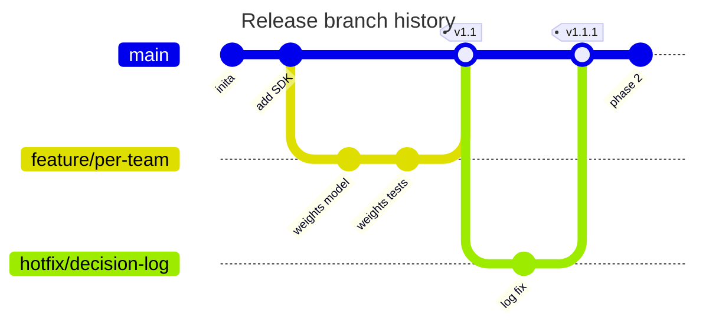

<!-- _class: title silent -->

`Categorical tokens · the third ink tier`

# The category's hue, as text

The categorical cycle shipped two inks and both of them sit on a chip. Nothing covered the hue used as *text on the slide* — so eight sites across five files painted the raw stroke token instead, and 372 of 1536 theme × mode × slot × surface pairs missed AA, worst 1.28:1. The twelve `--cat-N-ink` slots are the one answer, and they are curated per palette rather than mixed at render time.

Rendered in atelier rather than indaco, deliberately: indaco is one of the palettes this change barely moves, and atelier is where `math.theorem` measured 3.49:1.

---

<!-- _class: math theorem -->

`math theorem · the repair`

## The Definition and Theorem labels were 3.49:1 on this very palette.

> **Definition.** A function $f : [a,b] \to \mathbb{R}$ is *continuous* on $[a,b]$ if $\lim_{x\to c} f(x) = f(c)$ for every $c \in [a,b]$.

> **Theorem.** Let $f$ be continuous on $[a,b]$ and let $y$ lie strictly between $f(a)$ and $f(b)$. Then there exists $c \in (a,b)$ with $f(c) = y$.

> **Proof.** Set $S = \{x \in [a,b] : f(x) < y\}$. $S$ is non-empty and bounded; let $c = \sup S$. Continuity at $c$ forces $f(c) = y$. $\square$

The labels took the raw `--cat-4-mark` / `--cat-7-mark` as `color:` on the card's `--bg-alt`. They now take `--cat-N-ink` — the same hue and chroma as the stripe beside them, lightness solved until it clears AA. The stripe keeps the mark, which is a stroke and correctly gated at 3:1.

---

<!-- _class: premise -->

## A contrast workaround is not a typographic choice.

Each row's term is colored by its own categorical slot. The term used to be forced to `font-weight: 700` — not for emphasis, but to qualify for the 3:1 large-text exemption the mark tier actually carries. With the contrast bought properly, it returns to the 600 every other `section strong` uses.

1. Remember
   - Recall facts, syntax, rules.
   - How is this done?
2. Understand
   - Explain behavior and dependencies.
   - Why does it work?
3. Apply
   - Use patterns in new contexts.
   - How do I make it work here?
4. Analyze
   - Decompose across boundaries.
   - Where does it break?
5. Evaluate
   - Judge options against strategy.
   - Which option should win?
6. Create
   - Synthesize what isn't there.
   - What should exist?

---

<!-- _class: split-panel proof -->

`split-panel · mix moved out`

## This slide is byte-identical to the one before the change.

*Where did the logic go?* The panel's label ink was a local color-mix of its own mark toward the heading ink, carrying twenty lines of justification. It now reads the shared token, and the reasoning lives where the other consumers can find it.

- Why curated, not mixed
  - A mix toward the heading ink turned the hue by up to 15 degrees.
- What the recipe holds
  - Hue and chroma exactly. Only lightness moves, and only if it must.

---

<!-- _class: diagram -->

`gitgraph · the second surface`

## Branch labels take the ink of the band they sit on.

`gitBranchLabel0-7` is drawn on the saturated `--cat-N-mark` band but was inked from `--cat-on-fill`, curated for the pale one. Here `mermaid.css` repaints the chip, so the render is unchanged — the repair lands in the **baked** SVG, which is what travels when our CSS does not.

---

<!-- _class: split-panel proof -->

`the gate · layer four`

## Four contrast layers now, not three.

*What is held?* The categorical contrast gate gains a fourth layer — the ink against both slide surfaces at 4.5:1, fail-closed, on light, dark and the print band. A second gate re-runs the generator and fails the build if any palette has drifted off the curve.

- Layers ①–③ hold the hue
  - Every hue palette. `a11y-*` is exempt; it separates by texture.
- Layer ④ holds legibility
  - All 32 palettes, three canvases — light, dark, and print.
