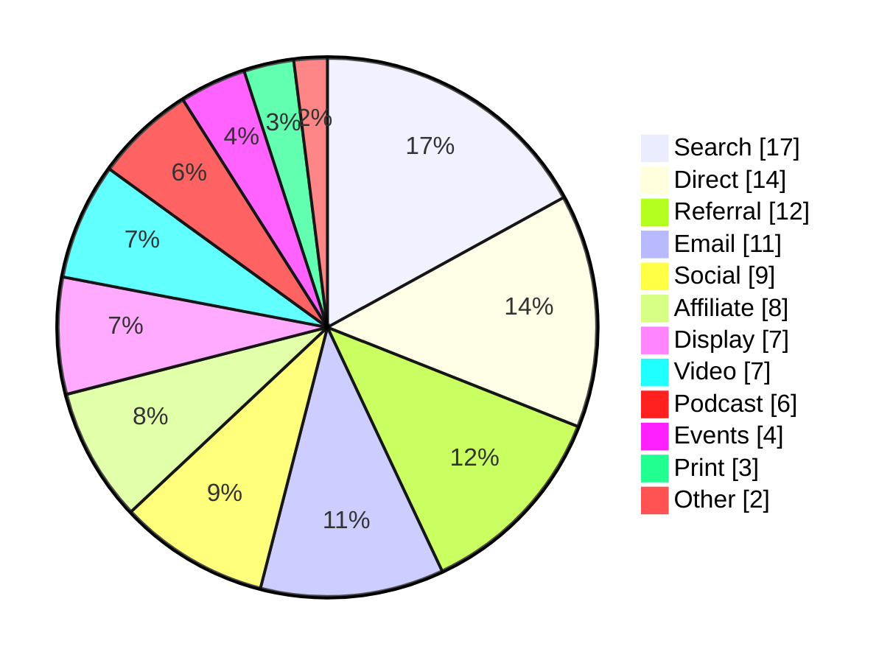
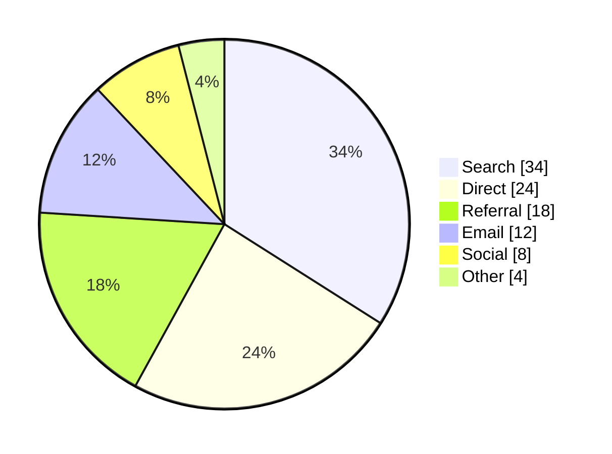
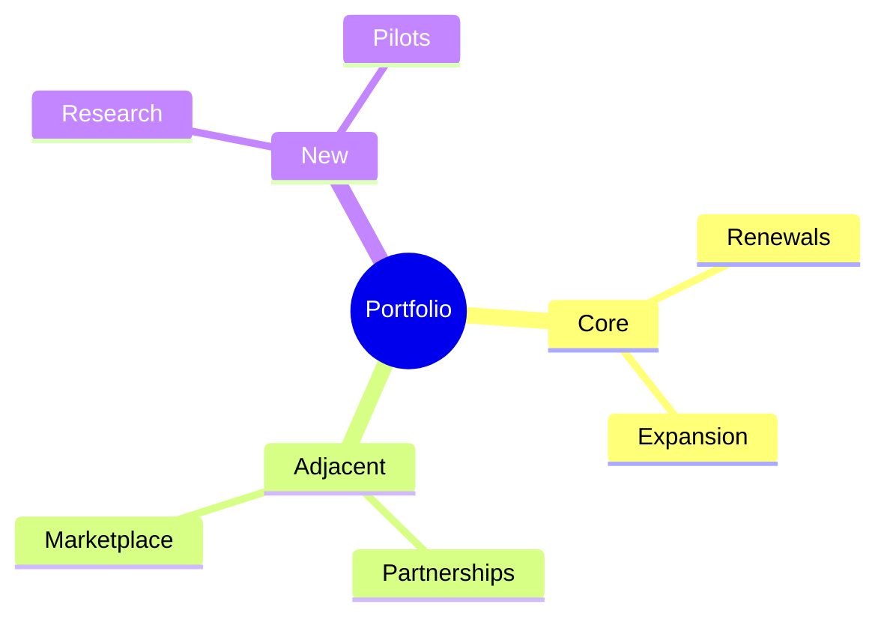

<!-- _class: title silent -->

`Feature demo · the categorical cycle`

# Twelve categories a reader can actually tell apart.

The `--cat-*` cycle carries category identity across pies, badges, branches
and lanes. This deck is what it looks like once every slot is separated on
purpose rather than by accident.

---

<!-- _class: silent -->

`Why it needed fixing`

## Twelve solves against one target land on one color.

Each slot used to be placed on its own: darken this fill until its label clears
4.5:1, then the next. Every slot met the target at the same lightness, so all
that separated two categories was the gap between their hues.

The repair moves all twelve together — hues stay where the brand put them, and
lightness does the work.

---

<!-- _class: diagram -->

`Twelve slots · the hardest case`

## A pie has no borders, so the fill is the whole signal.

> Mermaid draws no per-slice stroke, so the fill is the only thing telling one
> category from the next.

---

<!-- _class: diagram -->

`Six slots · the common case`

## Most charts never reach twelve.

> Six reads comfortably. Twelve is separated so the long tail still works.

---

<!-- _class: list-steps capsule -->

`Badges · fill as a background`

## A pill has no border either.

1. Intake
   - Signals arrive from four channels and land in one queue.
2. Scoring
   - Each signal takes a rubric score before anyone argues about it.
3. Decision
   - The call is made in the room and written down the same day.
4. Review
   - Last quarter's calls get re-read against what actually happened.

---

<!-- _class: diagram -->

`Branches · the saturated tier`

## Where a category gets an edge, it uses the other tier.

> Node fills take one tier, branch strokes the other — and the two swap by
> canvas, so each is separated on its own.

---

<!-- _class: silent -->

`The contract`

## What it promises, and what it does not.

The pale tier holds all sixty-six pairs apart; the saturated tier holds
neighbors apart. Both floors are what `indaco` and `cuoio` already reached.

It does not promise twelve distinct *hues* — five ramps cannot reach that
without repainting brand colors. We recommend consolidating past six.
