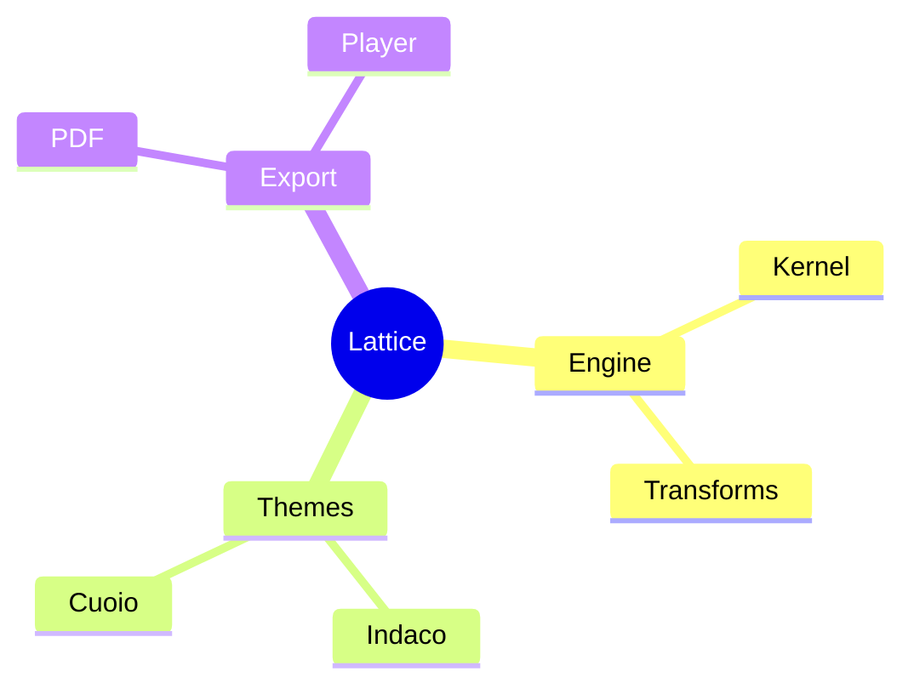

<!-- _class: title -->
<!-- _paginate: false -->
<!-- _header: '' -->

# Charts in full colour, on every browser

`Static palette compilation`

Every chart colour compiles to a flat literal at build time — so the same
bytes paint correctly on a modern engine and on old Safari / smart-TV Chromium.

---

<!-- _class: piechart -->
<!-- _footer: "Categorical · the eight-slot spectrum" -->

`Share of pipeline`
## The categorical spectrum reads cleanly

- Signal intake `32`
- Scoring `24`
- Decision log `18`
- Adoption `14`
- Tooling `12`

---

<!-- _class: gantt -->
<!-- _footer: "Semantic states · gantt" -->

`2026 Q1 .. 2026 Q4` `today Q3`
## Status colour carries meaning, not decoration

| Workstream | Q1 | Q2 | Q3 | Q4 |
| --- | --- | --- | --- | --- |
| Framework | Signal taxonomy `live` | Scoring model v2 `live` | Per-team weighting `warn` | · |
| Adoption | Pilot onboarding `live` | · | Org-wide rollout GA `decision` | · |

---

<!-- _class: radar -->
<!-- _footer: "Area fills · radar" -->

`Scale · 0–10`
## Translucent area fills stay true per canvas

- Meridian
  - Performance `9`
  - Pricing `7`
  - Support `8`
  - Ecosystem `6`
  - Security `8`
- Vantage
  - Performance `7`
  - Pricing `8`
  - Support `6`
  - Ecosystem `9`
  - Security `7`

---

<!-- _class: map -->
<!-- _footer: "Sequential ramp · choropleth" -->

`Adoption by region`
## The choropleth ramp quantizes to sixteen steps

- United States `92`
- Germany `74`
- Brazil `58`
- India `81`
- Japan `43`
- Australia `34`

---

<!-- _class: journey swimlane -->
<!-- _footer: "Mood · journey" -->

## Actor lanes and mood dots keep their hue

- Evaluate
  - Read case study `@prospect` `:4`
  - Live demo `@prospect` `@sales` `:5`
- Trial
  - Trial signup `@prospect` `:3`
  - Workspace setup `@user` `@onboarding` `:2`
- Activate
  - First report `@user` `:3`
  - Daily use `@user` `:5`

---

<!-- _class: roadmap horizons -->
<!-- _footer: "Per-phase accent · roadmap" -->

## Phase accents ride the fixed categorical rotation

| Workstream | Now `Q3` | Next `Q4` | Later `H1` |
| --- | --- | --- | --- |
| Signal intake | Connector v1 `[x]` | Multi-source dedupe `[-]` | Anomaly routing `[ ]` |
| Scoring | Equal weights `[x]` | Per-team calibration `[-]` | Per-decision profiles `[ ]` |
| Decision log | Append-only `[x]` | Outcome pairing `[x]` | Auditor export `[ ]` |

---

<!-- _class: diagram -->
<!-- _footer: "Mermaid · mindmap branch edges" -->

## Mermaid branches paint from the same palette

---

<!-- _class: kanban tinted -->
<!-- _footer: "Glass surfaces · kanban" -->

## Tinted lanes and premium tiles lift cleanly

- Backlog
  - Lane wash `S`
- In progress
  - Colour coded `M`
- Review
  - Reads faster `S`
- Done
  - Shipped work `L`

---

<!-- _class: statement -->
<!-- _footer: "One source of truth" -->

# The recipe is the only place colour lives

Edit a hue once, in the `chart-palette-recipe` region; the compiler resolves it
to two flat planes per theme, a build gate keeps every paint flat, and modern and
old browsers run byte-identical chart CSS.
