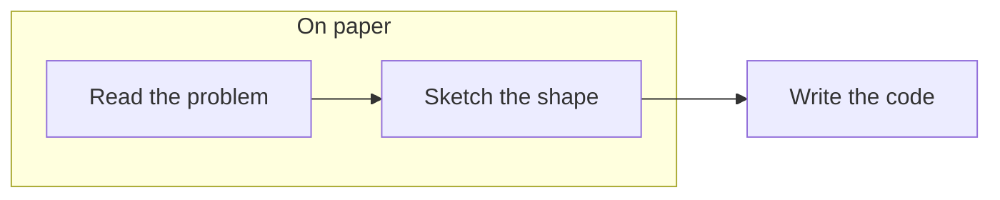
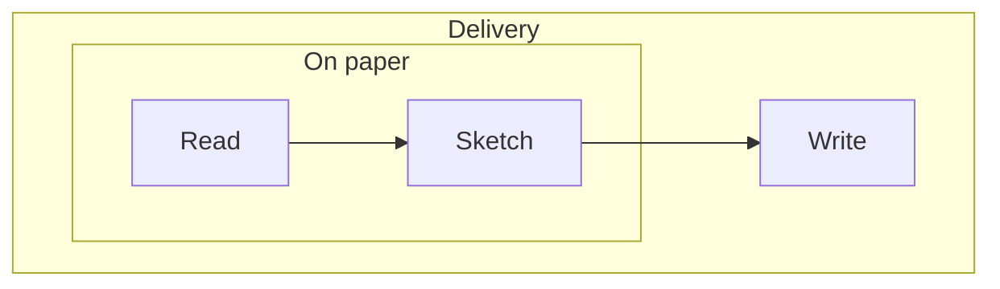
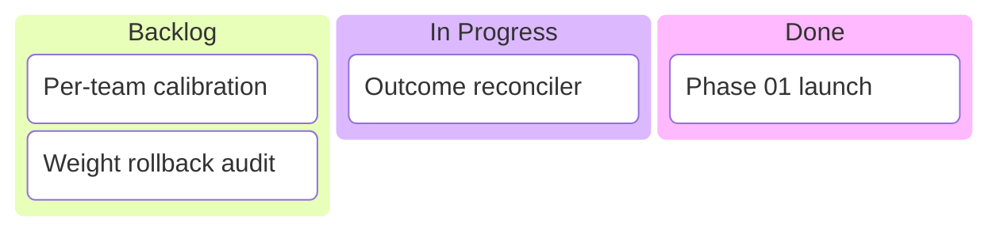
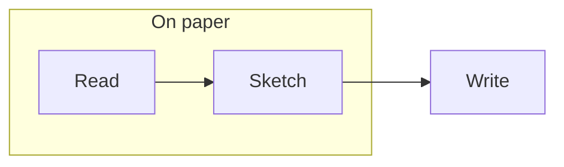

<!-- _class: title silent -->

`Feature demo · containment tier`

# A group box you can actually see, in every theme.

A subgraph is drawn from three per-theme tokens now — fill, edge and ink. Before, the fill borrowed the deck's card color, the ink borrowed the categorical tier's, and the edge was a stroke that never flipped with the color scheme.

---

<!-- _class: diagram -->

`The three rungs`

## Fill, edge, ink — each curated per theme.

`Each one a per-theme token, not a borrowed neighbor`

---

<!-- _class: diagram dark -->

`The case that was broken`

## On a dark canvas the box used to disappear.

`The fill is faint by design — the edge carries the grouping`

---

<!-- _class: diagram -->

`Two rungs`

## A box nested in a box steps once further.

`The ladder never steps back toward the canvas`

---

<!-- _class: diagram dark -->

`Two rungs, dark`

## The same ladder, inverted scheme.

---

<!-- _class: diagram -->

`The other consumer`

## A kanban ticket sits on the second rung.

---

<!-- _class: diagram -->

`#1311`

## An init directive keeps the palette.

`curve: linear applied; every color it did not name stays the theme's`

---

<!-- _class: content -->

`What the gate holds`

## Legibility is asserted, not assumed.

Every theme, both schemes: ink clears 4.5:1 on the rung it sits on, and the edge clears 3:1 on the fill it outlines. Fifty-seven assertions, and a mutation check proves they fail when a value drifts — pale ink, an edge equal to its fill, or a ladder that steps backward each turn the suite red.
