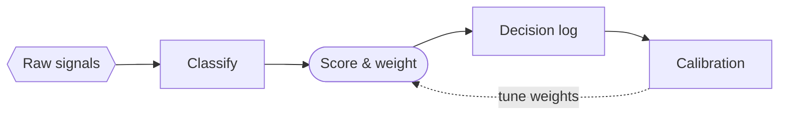
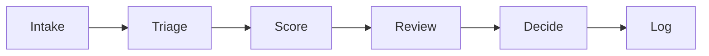

<!-- _class: title -->
<!-- _header: '' -->
<!-- _paginate: false -->
<!-- _footer: "Dark diagram fills · title" -->

# Jewel tones, not primaries

`Palette · eight dark faces`

Eight themes painted dark-mode diagram boxes in raw electric blue and violet. They now match indaco's restraint.

---

<!-- _class: diagram -->
<!-- _footer: "Flowchart · laguna-dark" -->

`Flow & sequence · Flowchart`

## Each box is a deep fill of its own hue, under a pale edge.

---

<!-- _class: diagram -->
<!-- _footer: "Slots one to six · laguna-dark" -->

`Categorical cycle · the working six`

## Six neighbors, six colors, and none of them glows.

---

<!-- _class: content -->
<!-- _footer: "The measurement · content" -->

`What changed`

## The dark fills were up to 70% more saturated than indaco's.

- Before: dark `--cat-N-fill` chroma reached 0.215–0.256 in eight themes; indaco and cuoio cap at 0.150.
- After: every fill above 0.16 is held at 0.16, lightness and hue kept, with two exceptions (next slide).
- Themes: ardesia, atelier, brina, burgundy, crepuscolo, laguna, magnolia, mustard.

---

<!-- _class: content -->
<!-- _footer: "Two slots needed more than a cap · content" -->

`Two exceptions`

## Two slots had been told apart by glare alone.

- Laguna slot 4 sat at hue 270, beside slot 5's blue at 260. Its own light fill and mark sit at 290, so its dark fill moves back to 295.
- Burgundy slot 5 needed hue 310 at chroma 0.17 to stay as far from slot 4's magenta as before.
- The adjacency ratchet held both: no pair moved closer than it was.

---

<!-- _class: closing -->
<!-- _header: '' -->
<!-- _paginate: false -->
<!-- _footer: "Dark diagram fills · closing" -->

`Eight dark faces`

## A dark deck's diagrams now read as a palette, not a warning light.
