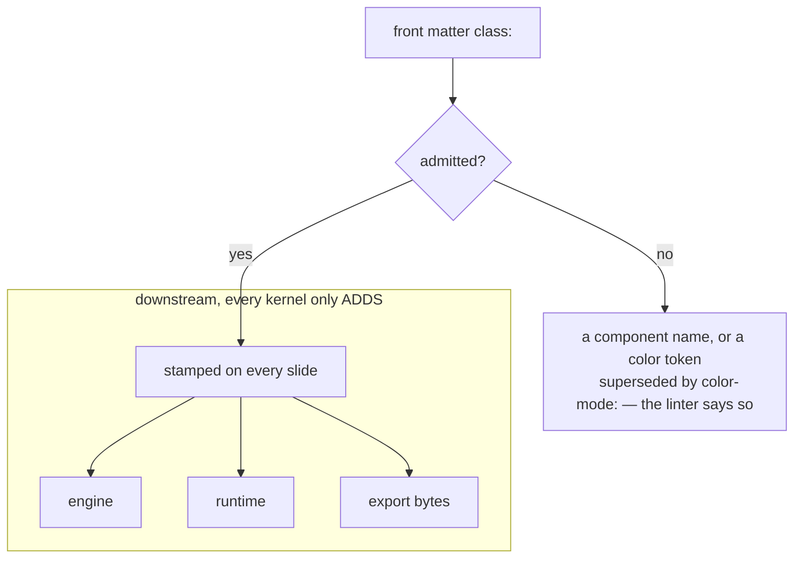
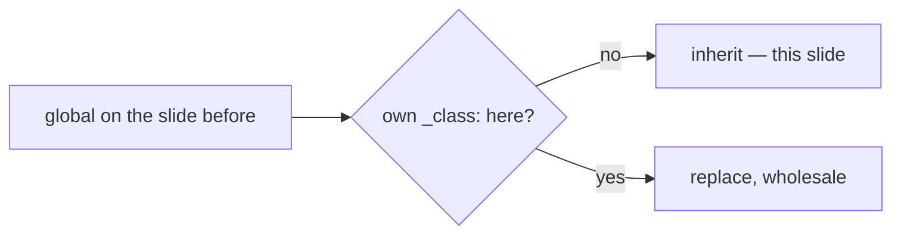

<!-- _class: title -->
<!-- _paginate: false -->

`Lattice · Fix deck`

# Which class actually reaches the slide?

Three spellings write to one slot, and they are scoped differently. Forty of 168
combinations of `color-mode:` × `class:` × `_class:` rendered a canvas the author
did not ask for. Every one was a deck that set two of them.

---

<!-- _class: divider -->

## The register is filtered where it is read, not stripped afterwards.

A token the deck-wide `class:` may not carry never reaches a section at all, so
every propagation kernel downstream is purely additive. The alternative — stamp
it, then subtract — needs to know whether a token came from the deck or the
slide, and by then that is gone.

---

<!-- _class: compare-table -->
<!-- _footer: "Three spellings, three scopes" -->

## The three spellings of `class:` are not interchangeable.

| Spelling | Scope | A slide's own `_class:` | May name a component |
| ------------------------ | ---------------------- | ------------------------ | -------------------- |
| `class:` in front matter | the whole deck         | composes — appended over | no                   |
| `<!-- class: … -->`      | here to the next one   | replaces it              | yes                  |
| `<!-- _class: … -->`     | this slide             | —                        | yes                  |

_Front matter is appended to every slide, including one naming its own layout —
which is what makes `class: no-note` useful, and why a component there would
collide rather than compose._

---

<!-- _class: content light -->
<!-- _footer: "A slide still owns its own canvas" -->

`This deck is dark`

## And this slide is not, because it said so.

The deck-wide color mode is `dark`; this slide names `light` for itself and
wins. That is the one thing the supremacy rule deliberately does not touch.
What changed is only which DECK-WIDE register owns the axis when two claim it:
`color-mode:` always does, and a leftover `class: dark` beside it is dropped
rather than merged.

---

<!-- class: diagram -->
<!-- _footer: "A running global, declared once" -->

`Filtered at the boundary`

## An illegal token is never stamped, so nothing has to be un-stamped.



---

<!-- _footer: "…and it carries to the next slide" -->

`No directive on this slide`

## This slide is a diagram because the one before it said so.

`<!-- class: … -->` may name a component: a slide's own `_class:` replaces it
wholesale, so it can never leave two layouts on one section.



---

<!-- _class: content -->
<!-- _footer: "What the author is told" -->

`The refusal is not silent`

## A refused token is a warning, not a shrug.

```text
⚠ deck · deck-wide-component [kpi]
    `class: kpi` names a COMPONENT deck-wide — every slide would be a kpi
    slide. It is ignored.
    fix: Name the layout per slide with `<!-- _class: kpi -->`, or once for a
         run with `<!-- class: kpi -->`.
```

---

<!-- _class: closing silent index -->

## See also.

- `engineering/decisions/2026-08-05-deck-class-register-boundary.md` — the decision, the four regressions it avoids, and the 980-row table
- `lib/core/deck-class-register.js` — the kernel, and every boundary it is applied at
- `test/unit/core/color-register-table.test.js` — `color-mode:` × `class:` × `_class:` × `--print`, both spellings
- `lib/base/base.docs.md` § Composition syntax — the three spellings, for authors
