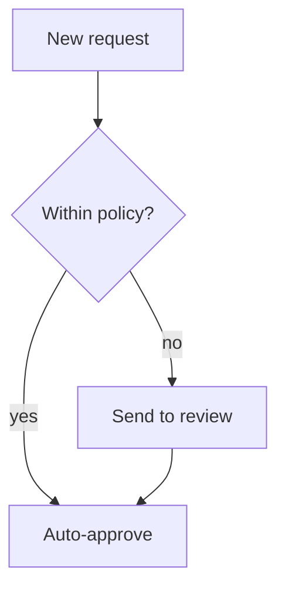
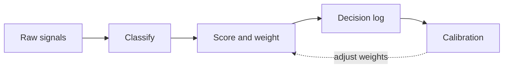
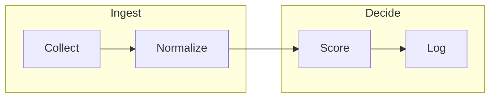
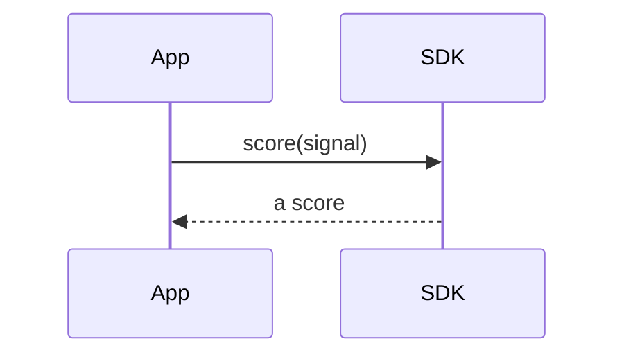

<!-- _class: title -->
<!-- _paginate: false -->
<!-- _footer: '' -->
<!-- _header: '' -->

# Read-aloud that reads the graph.

`Mermaid flowchart narration`

*A `diagram` slide's flowchart used to narrate its heading and go silent. Now read-aloud (and the exported captions) speak the nodes and the arrows between them.*

---

<!-- _class: diagram -->

`01 · Labeled flow`

## How a signal becomes a decision.

> Each arrow is spoken: "Signal Intake leads to Scoring Model. Scoring Model, scored signal, leads to Decision Log," and so on — the edge labels read as clauses.

---

<!-- _class: diagram -->

`02 · Decision branch`

## A gate that splits the path.

> A diamond's branches are carried by its labeled out-edges — "Within policy? yes leads to Auto-approve; no leads to Send to review" — so the fork is narrated without reading shape names.

---

<!-- _class: diagram -->

`03 · Chained + feedback`

## A straight line with one loop back.

> Chained edges (`A --> B --> C`) split into one spoken step each, and the dotted feedback edge reads "Calibration, adjust weights, leads to Score and weight."

---

<!-- _class: diagram -->

`04 · Grouped stages`

## Subgraphs still narrate their edges.

> Group boxes carry no spoken topology in this first version, but every edge — inside each group and the one crossing between them — is read aloud, in the diagram's source order.

---

<!-- _class: diagram -->

`05 · Honest fallback`

## A non-flowchart type reads its heading.

> Sequence, class, state, ER, and gantt diagrams are not yet narrated — they fall back to the heading and this caption, exactly as before. No confidently-wrong reading of a graph the narrator can't yet parse.

---

<!-- _class: closing -->
<!-- _footer: '' -->

# The arrows are spoken now.

`flowchart topology · read-aloud + exported captions`
