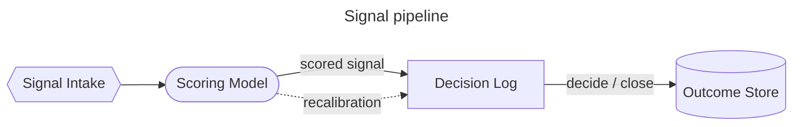
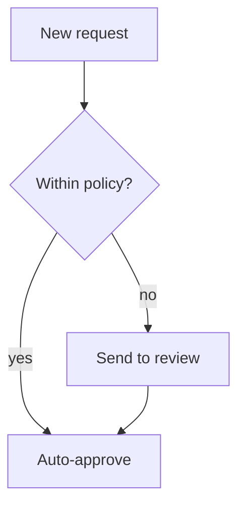
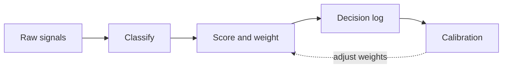
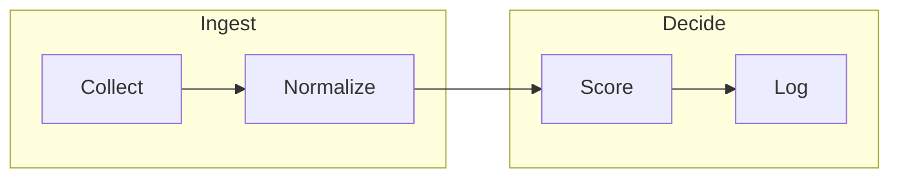
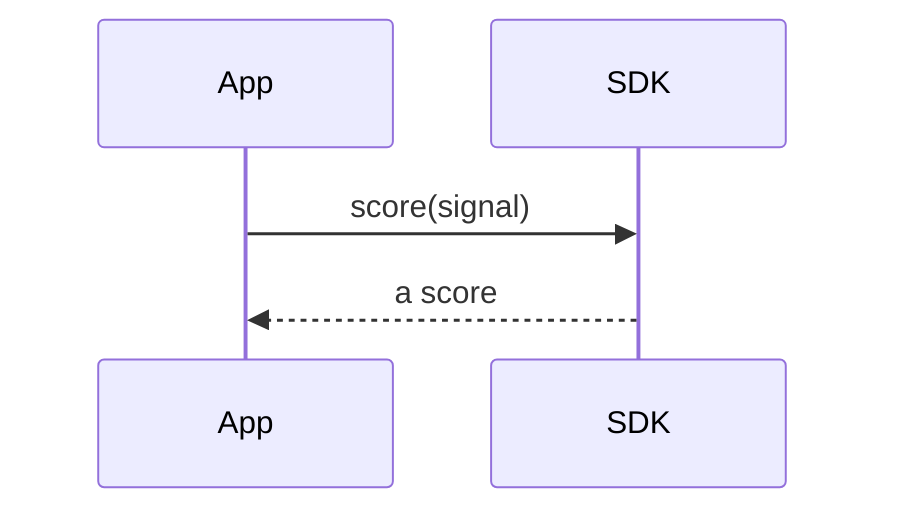

<!-- _class: title -->
<!-- _paginate: false -->
<!-- _footer: '' -->
<!-- _header: '' -->

# Read-aloud that reads the graph.

`Mermaid flowchart narration`

*A `diagram` slide's flowchart used to narrate its heading and go silent. Now read-aloud (and the exported captions) describe it as a flow — following the path from the entry points, grouping each fan-out, and closing at the terminal nodes.*

---

<!-- _class: diagram -->

`01 · Labeled flow`

## How a signal becomes a decision.

> Read as a flow, not an edge dump: "Signal Intake leads to Scoring Model, which fans out to the Decision Log … Decision Log, decide / close, leads to Outcome Store. The flow ends at Outcome Store." Edge labels fold in as clauses.

---

<!-- _class: diagram -->

`02 · Decision branch`

## A gate that splits the path.

> The decision node fans out with its branch labels: "New request leads to Within policy?, which fans out to Auto-approve, yes and Send to review, no" — the conditions ride along, no shape names.

---

<!-- _class: diagram -->

`03 · Chained + feedback`

## When the graph loops, it stops guessing.

> Calibration feeds back into Score and weight, so the graph has a cycle — there is no honest entry-to-exit order. Rather than impute a flow it can't defend, the narrator drops to a neutral per-node reading: "Score and weight leads to Decision log. Decision log leads to Calibration…"

---

<!-- _class: diagram -->

`04 · Grouped stages`

## Subgraphs still narrate their edges.

> A linear path that crosses two subgraph boundaries coalesces into one sentence — "Collect leads to Normalize, then Score, then Log. The flow ends at Log." — and the group boxes are never spoken as nodes.

---

<!-- _class: diagram -->

`05 · Honest fallback`

## A non-flowchart type reads its heading.

> Sequence, class, state, ER, and gantt diagrams are not yet narrated — they fall back to the heading and this caption, exactly as before. No confidently-wrong reading of a graph the narrator can't yet parse.

---

<!-- _class: closing -->
<!-- _footer: '' -->

# The arrows are spoken now.

`flowchart topology · read-aloud + exported captions`
