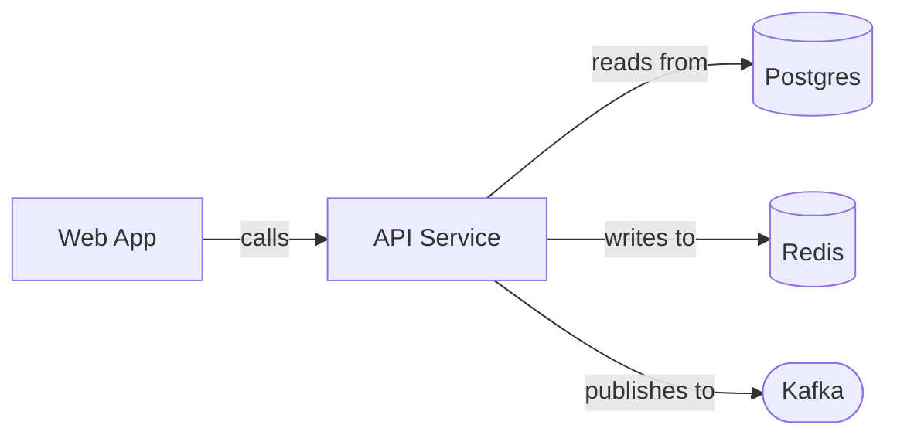
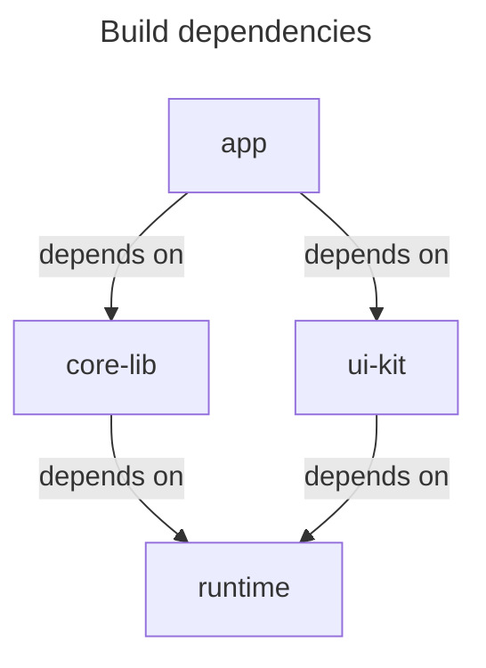
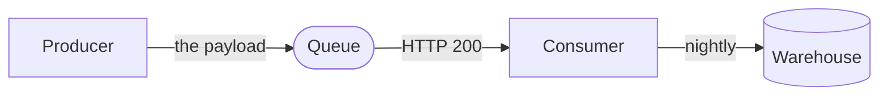
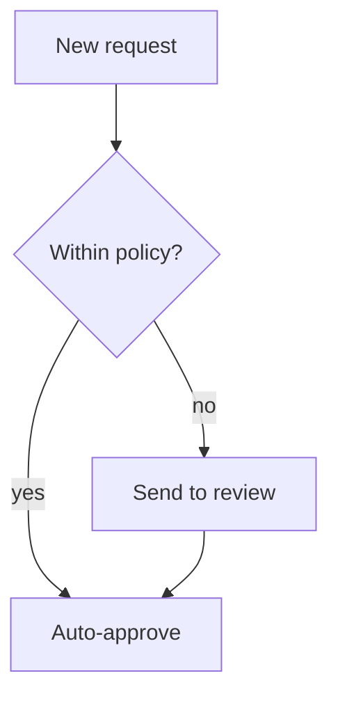
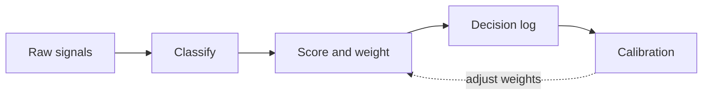
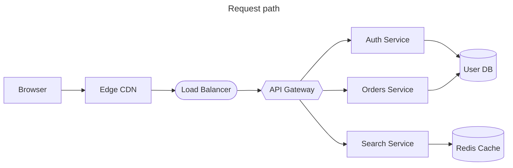
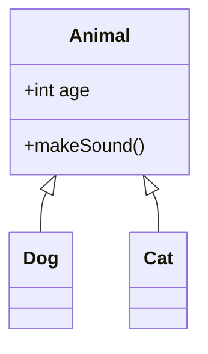

<!-- _class: title -->
<!-- _paginate: false -->
<!-- _footer: '' -->
<!-- _header: '' -->

# Read-aloud that reads the graph.

`Mermaid flowchart narration`

*A `diagram` slide's flowchart used to narrate its heading and go silent. Now read-aloud (and the exported captions) describe it as a flow — following the path from the entry points, reading each author's edge label faithfully, merging repeated fan-ins, and closing at the terminals.*

---

<!-- _class: diagram -->

`01 · Labeled architecture`

## The arrows carry the verbs.

> A recognized verb — or a verb plus a preposition — is spoken *as* the connective: "Web App calls API Service. From API Service: reads from Postgres; writes to Redis; publishes to Kafka." The author's own word carries the relationship — never an invented one.

---

<!-- _class: diagram -->

`02 · Dependency graph`

## Shared dependencies merge into one line.

> The reading opens with the shape — "A diamond." — then fan-in coalesces so a wide graph doesn't repeat itself: "app depends on core-lib and ui-kit. core-lib and ui-kit both depend on runtime." — the verb is depluralized for the joined subject, and the runtime is named once.

---

<!-- _class: diagram -->

`03 · Noun labels`

## When a label isn't a verb, it stays honest.

> A noun, code, or cadence is never forced into a verb ("Producer the payload Queue" would be gibberish). It reads as a grammatical appositive: "Producer, the payload, leads to Queue. Queue, HTTP 200, leads to Consumer. Consumer, nightly, leads to Warehouse."

---

<!-- _class: diagram -->

`04 · Decision branch`

## A gate that splits the path.

> It opens with the shape — "A diamond." — then each branch binds to its condition unambiguously: "From Within policy?: on yes, leads to Auto-approve; on no, leads to Send to review" — a guarded clause per branch, not a flat comma list a listener can't parse.

---

<!-- _class: diagram -->

`05 · Chained + feedback`

## A pipeline with a loop back.

> The feedback edge is detected and read as a loop, not misordered into the flow: "Raw signals leads to Classify, then Score and weight, then Decision log, then Calibration. Calibration, adjust weights, loops back to Score and weight."

---

<!-- _class: diagram -->

`06 · The gist, first`

## A tangled shape opens with its shape.

> A non-trivial graph opens with a lean gist that says only what the detail walk doesn't — the depth and coarse shape: "Five hops deep, branching and reconverging." The walk then names the nodes. The gist never re-states the fan-out or the shared node the walk already speaks, and stays silent on a plain chain.

---

<!-- _class: diagram -->

`07 · Honest fallback`

## A not-yet-narrated type reads its heading.

> Flowcharts narrate their topology and sequence diagrams narrate their message script; the remaining types — class, state, ER, and gantt — fall back to the heading and this caption for now, exactly as before. No confidently-wrong reading of a diagram the narrator can't yet parse; each type graduates in its own first-wave slice.

---

<!-- _class: closing -->
<!-- _footer: '' -->

# The arrows are spoken now.

`flowchart topology · labels read faithfully · read-aloud + exported captions`
