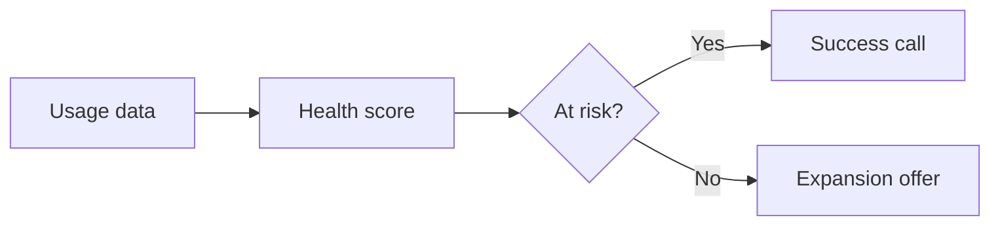

<!-- _class: big-number -->

`Net dollar retention`

- 118%
  - Every top-twenty account expanded this year.

---

<!-- _class: list-steps -->

## How the rollout reaches every region.

1. Pilot in one region with a named owner.
2. Measure adoption weekly against the target.
3. Extend to the next two regions in the quarter.
4. Hand the playbook to regional leads.

---

<!-- _class: cards-grid three -->

## Three bets for next year.

- Enterprise depth
  - Grow seats inside the accounts we already serve.
- Mid-market reach
  - Win new logos with the partner channel.
- Platform trust
  - Ship the security review every buyer asks for.

---

<!-- _class: table -->

## Where each region stands.

| Region | ARR | Growth | Churn |
|:---|---:|---:|---:|
| North America | $22.4M | 28% | 4% |
| EMEA | $14.1M | 35% | 5% |
| APAC | $8.3M | 41% | 7% |
| LATAM | $3.8M | 19% | 9% |

---

<!-- _class: compare-prose chosen -->

## Build the data platform, or buy one.

- Build
  - Full control of the model, but eighteen months before the first dashboard ships.
- Buy
  - Live in one quarter on a proven vendor, with our engineers freed for the product.

---

<!-- _class: line -->

## Mid-market grew into the gap enterprise left.

- Q4 FY25
  - Enterprise `4.1`
  - Mid-market `2.6`
- Q1 FY26
  - Enterprise `4.4`
  - Mid-market `2.9`
- Q2 FY26
  - Enterprise `4.2`
  - Mid-market `3.4`
- Q3 FY26
  - Enterprise `3.9`
  - Mid-market `4.1`

---

<!-- _class: funnel -->

## Where the pipeline drops off.

- Visitors `12,000`
- Signups `4,800`
- Trials `1,400`
- Signed `214`

---

<!-- _class: quadrant -->

`[{Effort, 0..10}, {Impact, 0..100}]`

## Which initiatives earn the next quarter.

- Quick wins
  - Self-serve onboarding `3, 82`
  - Pricing page refresh `2, 64`
- Strategic bets
  - Partner portal `7, 74`
- Defer
  - Dark-mode admin console `2, 22`
- Time sinks
  - Legacy reporting rewrite `8, 30`

---

<!-- _class: diagram -->

## How a signal becomes a decision.



---

<!-- _class: code -->

## The one call that starts a trial.

```js
const trial = await client.trials.create({
  plan: 'growth',
  seats: 25,
  days: 30,
});
```
