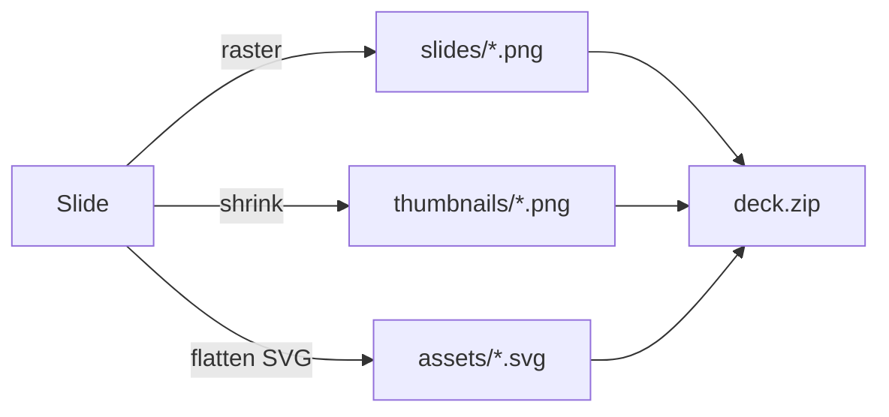

<!-- _class: title silent -->

# Ship the deck as images.

`New export · .zip · PNG / JPEG / WebP`

Export any deck as an image set — a single `.zip` holding one image per slide, small thumbnails, and the deck's charts and diagrams as standalone SVGs. Perfect-fidelity by default; tune it down when you need a smaller set.

---

<!-- _class: content -->

## One zip, everything a recipient needs.

The image set is the format for anywhere a PDF or PPTX won't go — a webpage hero, a Figma frame, a Notion embed, a social card, a design handoff.

- **Slides** — one full raster per slide, lossless PNG at the highest sensible resolution: the scale is capped so the long edge never exceeds 3840px (HD exports at 2×; a 4K deck like this one at 1×, already near-native). Drop each straight into a doc or a deck-review thread.
- **Thumbnails** — a small companion image per slide, for contact sheets and pickers.
- **Assets** — every chart and Mermaid diagram lifted out as its own `.svg`, theme-free with fonts embedded, so it scales cleanly anywhere.

---

<!-- _class: list -->

## Tune size against fidelity — the default is already perfect.

- **Format.** PNG is lossless and the default. JPEG and WebP are lossy levers for a lighter set; WebP is the smallest at equal quality.
- **Resolution.** `Full` is fidelity-first — the largest scale within a 3840px long-edge budget (2× for HD, 1× for a 4K deck). Step down to `1×` or `half` to shrink each image — and the whole zip — when bytes matter more than pixels.
- **Thumbnails and SVGs** ride along by default; turn either off for a leaner archive.

---

<!-- _class: piechart -->

`What the .zip weighs`

## Every knob moves the total.

- Full PNG `46%`
- Large PNG `24%`
- Full WebP `16%`
- Small WebP `9%`
- Thumbnails only `5%`

---

<!-- _class: diagram -->

`How a slide becomes a file`

## The same render, packaged three ways.

---

<!-- _class: content -->

## Two ways to get it.

The same set comes off the command line or out of the Studio — one shared kernel packs both, so a zip is a zip wherever it's made.

- **CLI.** `lattice deck.md out.zip` — add `--image-format webp`, `--image-size 1x`, or `--no-svg` to tune. `--help` lists every knob.
- **Studio.** Share → **Images (.zip)** → pick the format, resolution, and extras → **Download images**.

---

<!-- _class: closing silent -->

# Render once. Use everywhere.

`slides/ · thumbnails/ · assets/ · manifest.json`

A `manifest.json` indexes the set — slide list, dimensions, and format — so a downstream tool can wire it up without probing a single file.
