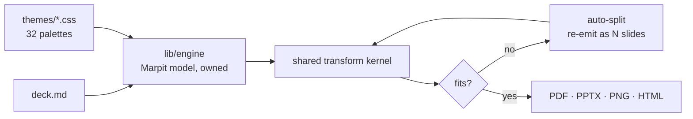
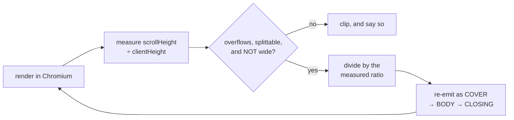

<!-- _class: title spectrum -->
<!-- _header: '' -->
<!-- _paginate: false -->

# What Lattice Actually Is

`Internal Assessment · 2026-08-23`

An evidence-backed audit — the inventions, the libraries, and the parts that do not hold up.

---

<!-- _class: split-panel -->
<!-- _header: '' -->

`How this was built`

## Twenty-two agents, then a bake-off against four rivals.

Every claim carries a path, a count, or a command that reproduces it.

- 220 findings, each with evidence
  - 92 of them are weaknesses. Vague praise was rejected by contract.
- One brief, five tools, five decks
  - Marp, Slidev, Beamer and Quarto installed and rendered here, not recalled.
- Two claims died on measurement
  - Auto-split does not fire at 16:9. The catalog cost 62k, not 3.8k.

---

<!-- _class: agenda rail -->

## What this covers, in order.

1. The shape of the thing — page 5
2. What is genuinely new — page 12
3. The paradigm question — page 28
4. The bake-off against four rivals — page 32
5. Metrics, libraries, extraction — page 37
6. The autopsy, and where it goes — page 56

---

<!-- _class: divider -->
<!-- _header: '' -->
<!-- _paginate: false -->

`Section 01`

## The Shape of the Thing

---

<!-- _class: stats -->

`Verified · 2026-08-23`

## Lattice, by the numbers that are actually true.

1. 61
   - shipped components
2. 32
   - theme files
3. 6,967
   - unit tests, 0 failing
4. 70
   - architectural gates

---

<!-- _class: list-tabular metric -->

## Where the code actually lives, measured this morning.

1. Engine and components
   - The render kernel, 61 manifests, the token system
   - _88,617 LOC_
2. Docs site and Studio
   - Astro, React, the Playground, five side libraries
   - _130,126 LOC_
3. Tests
   - 313 unit files, 53 integration, 61 browser specs
   - _83,750 LOC_
4. Tooling
   - 123 scripts, including one 9,998-line gate file
   - _44,039 LOC_
5. Decision archive
   - 442 dated notes plus their index, about four a day
   - _123,375 lines_

— Source lines only, excluding dependencies and generated output.

---

<!-- _class: diagram -->

`Render path`

## One owned engine, four formats, zero Marp.



---

<!-- _class: split-panel -->

`The bet`

## A slide is a compiled document, not a canvas.

The author declares semantics — a class name and plain Markdown. The engine owns every visual decision, including whether the content fits.

- The mechanism is enumerable
  - 61 manifests, 32 themes, one palette-blind stylesheet. Layouts never name a color.
- The engine decides fit
  - Slide count is derived from content and geometry. Authors do not paginate.
- Verification is the product
  - Contrast and overflow are machine-checked against rendered pixels.

---

<!-- _class: compare-prose axis -->

## The bet has a real counter-argument, and it is not weak.

Both readings are defensible. The deck takes the second one seriously, because the room will.

1. The case for
   - A vocabulary makes the common deck good by default. Taste lives in the engine, where it can be tested.
2. The case against
   - A vocabulary is bounded, and costs maintenance in proportion to its size. A blank canvas is unbounded and costs nothing.

*Lattice did not remove the design work. It relocated it into 61 manifests that one person maintains.*

---

<!-- _class: content -->

## The escape hatch nobody documented.

The no-blank-canvas constraint is a strong default, not an enforcement. Front matter accepts a `style:` key that injects arbitrary CSS, and the Markdown parser runs with HTML enabled — so any author can bypass the component vocabulary entirely, on any slide, with no warning and no gate.

That is probably the right engineering call. It is not what the framing implies, and it appears in no authoring doc as an escape hatch.

---

<!-- _class: divider -->
<!-- _header: '' -->
<!-- _paginate: false -->

`Section 02`

## What Is Genuinely New

---

<!-- _class: quote bare -->
<!-- _header: '' -->

> A Frame fits its content by collapsing, then shedding, then splitting — and if none of those make it fit at the readability floor, it shows an honest overflow. It never shrinks the type.

*The Fit Spine · the load-bearing invariant of the engine*

---

<!-- _class: split-panel metric -->

`Shrink-to-fit primitives`

## 0

Every other deck tool answers “too much content” by making the type smaller. Lattice made that move structurally unavailable to itself.

- The ban is on writing a font size
  - No code anywhere sets one. Figure text still rides the letterbox scale — the repo caught its own state-chart at 3.42px.
- The ladder is closed at four moves
  - Collapse, shed, split, honest overflow. There is deliberately no fifth.
- Readability is an axiom
  - A slide smaller than legible has failed, even if it fit.

---

<!-- _class: diagram -->

`Auto-split`

## Pagination is measured in a browser — but not at 16:9.



— Splitting is intrinsic at presentation sizes and deliberately off at `wide`: a deck is authored once and shown at many sizes, so the engine will not change slide COUNT under the author at the size they are editing.

---

<!-- _class: list-tabular metric -->

`Measured · 12 risk items forced onto one slide`

## What each size actually does when the content will not fit.

1. `16:9` wide
   - Clips. Stamps a visible badge and names the page on stderr
   - _14 → 14 pages_
2. `1:1` square
   - Splits. Every item survives
   - _14 → 18 pages_
3. `9:16` story
   - Splits harder
   - _14 → 23 pages_
4. `4:5` portrait
   - Splits hardest
   - _14 → 34 pages_

— The same stressed deck, rendered four times. The loop is real; at the size a board deck uses, it is a warning rather than a repagination.

---

<!-- _class: compare-prose transition -->

## Shrink-to-fit shipped here, then was purged on principle the next day.

`June 21 to June 22, 2026`

- **Before**
  - A token scaled prose to 0.66 in portrait. It worked, it was cheap, and it needed no measurement at all.
- **After**
  - The token was deleted. A headless render now measures real overflow and cuts the slide instead.

The mechanism was not broken. It was deleted for violating an axiom — a materially different, and much rarer, reason.

---

<!-- _class: split-panel metric mirror -->

`Contrast runs flipped by size`

## 1,024

Rendering the same gallery at two canvas sizes flipped 1,024 of 1,534 contrast runs and 317 verdicts — on the size line alone, with no CSS change.

- The large-text rule breaks here
  - The same type token resolves to 21.4px small and 64.1px large.
- The obvious fix was built and deleted
  - Normalizing out the scale re-broke twenty committed portrait decks.
- The answer was to exceed the standard
  - A flat 4.5:1 everywhere. It cost zero runs, measured.

---

<!-- _class: split-panel -->

`Contrast auditing`

## The audit reads pixels, not token pairs.

A token-pair audit passed 704 pairs green while the rendered deck carried 44 sub-AA runs, one at 2.54:1. So the gate moved to the DOM.

- It finds the real background
  - Ancestors are walked through transparent paints to the painted surface.
- It composites opacity groups
  - A blind spot that once reported 5:1 where pixels measured 3.21:1.
- It reads generated text
  - Counters and badges are scored like any other run, every pull request.

---

<!-- _class: code -->

`Color`

## The ink solver fixes hue and moves only lightness.

`lib/theme/cat-ink.js — one value clearing AA on both canvases`

```javascript
// A categorical mark has ONE hue across the deck. Its text-legible
// variant must clear WCAG AA against the light canvas AND the dark
// canvas — not "one value per canvas", which breaks hue identity.
//
// Hue and chroma are held EXACTLY; only OKLCH lightness moves.
const ink = solveInk(markHex, { light: lightBg, dark: darkBg, floor: AA });

// Leonardo, culori, chroma-js and Radix all solve against ONE
// background at a time. Solving both at once is the move that
// makes a palette-blind layout possible at all.
```

---

<!-- _class: split-panel mirror -->

`Token contracts`

## A token's contrast floor is derived from its name.

About a dozen name patterns replace a 383-entry lookup table — so a token added tomorrow classifies itself with no table edit.

- Ink means text
  - Scored at the 4.5:1 floor. No exceptions, no registration.
- Mark means a shape
  - Scored at the 3.0:1 non-text floor.
- Fill means a surface
  - Something to score against, never something to score.

---

<!-- _class: split-panel mirror -->

`Prose budgets`

## The engine has an opinion about how many words belong on a slide.

Title 10 words, eyebrow 5, subtitle 12, key insight 18, pill 2 — with a 70-word whole-slide backstop, and a per-component body budget beside it.

- The numbers are sourced, not invented
  - Reynolds, Duarte, Minto, Knaflic — set deliberately below where anything would overflow.
- It advises, it does not block
  - Budgets are traps, not footguns: verbosity renders fine, it just communicates poorly.
- No competitor ships anything like it
  - Marp, Slidev, Beamer and Quarto have no word or density budget at all. Checked.

---

<!-- _class: split-panel metric -->

`What authoring one deck actually cost`

## 62k

The pick surface is 3,800 tokens and it is an INDEX, not the price. Authoring a real 14-slide deck meant opening each chosen component's full contract: 62,000 tokens read.

- The index is still the win
  - It is what lets a model hold all 61 candidates at once before spending anything.
- The compression was measured, and it cost
  - Top-1 retrieval fell 59.8% to 42.0% against the full prose, on 264 cases. Shipped anyway.
- It is the only catalog learnable from disk
  - Beamer needed 4,200 tokens of source and the entire API from prior knowledge.

---

<!-- _class: cards-grid three -->

## The security work produced one transferable idea and two unusual gates.

- The serializer corollary
  - A closing style tag inside a CSS comment still ends the element — and any serializer round-trip silently undoes the escape.
- A provenance census
  - Where a guard is impossible, each sink declares where its markup comes from, with an exact count.
- The census found a hole
  - Two sinks certified as already-sanitized decoded entities on read. Both are now deleted.

> Every arm of this rule was added after a real miss, not designed up front.

---

<!-- _class: split-panel -->

`The Studio · 65,018 lines`

## The model proposes. A deterministic kernel disposes.

The same split recurs in four places — themes, components, finishes and deck edits. The model proposes intent inside a vocabulary; code derives the output.

- A generated palette cannot be inaccessible
  - The model picks a ramp; `deriveTheme` fans it to ~80 AA-repaired tokens. It never writes them.
- Edits are re-scored on landing
  - The model emits tagged edit blocks. The engine re-grades at once; it never owns correctness.
- The Coach refuses to guess
  - A real scorecard grade, and a null assessment rather than a fabricated one.

---

<!-- _class: verdict-grid -->

## Four novelty claims, graded against hostile review.

`Check holds · dash partial · cross fails`

- Component vocabulary
  - [ ] Unprecedented
  - [x] Well executed
  - [ ] Category-defining
  - Beamer, Deckset, Slidev, and Marp's own class mechanism — which is the one used here.
- Two-surface ink solve
  - [x] Unprecedented
  - [x] Well executed
  - [-] Category-defining
  - Every incumbent solves one background at a time. Narrow, real, defensible.
- Rendered-DOM contrast
  - [-] Unprecedented
  - [x] Well executed
  - [x] Category-defining
  - Composited auditing exists in research tooling. Gating a build on it does not.
- Measured auto-split
  - [-] Unprecedented
  - [x] Well executed
  - [x] Category-defining
  - Beamer's frame-breaks are honest prior art. No browser tool repaginates on fit.

---

<!-- _class: big-number -->

`Readers awarding "paradigm shift"`

- 0
  - Eight agents read 442 decision records and every benchmark. All eight had the grade available. None used it — and twenty-three findings came back graded genuinely novel instead.

---

<!-- _class: divider -->
<!-- _header: '' -->
<!-- _paginate: false -->

`Section 03`

## The Paradigm Question

---

<!-- _class: compare-prose axis -->

## Is "vocabulary instead of canvas" a paradigm shift?

Argued from a real bake-off this time: one brief, five tools, every deck built and rendered.

1. No, on the vocabulary
   - Slidev ships 21 layouts; Beamer has had block and theorem environments since 2003; Marp's class mechanism is the one Lattice uses.
2. Yes, on the enforcement
   - Every rival rendered an over-long caption without comment. One tool said the caption was too long, and cited the literature.

*The idea is old. Having a machine hold you to it is not.*

---

<!-- _class: split-compare -->

`Ruling`

## Which half of the claim is load-bearing?

Measured on one brief across five tools. The vocabulary is the visible half; the enforcement is the half nothing else has.

- The vocabulary framing
  - Slidev has 21 layouts
  - Beamer had environments in 2003
  - Loses this argument on merit
- The enforcement framing
  - 14/14 slides native, zero custom CSS
  - Only tool that reports its own clipping
  - Only tool with a word budget

> Lead with enforcement. The vocabulary is table stakes; a machine that holds the line is not.

---

<!-- _class: list takeaway numbered -->

`Section 03 · Recap`

## Where the needle actually moves, stated precisely.

- The only tool of five that reports its own clipping instead of losing content quietly.
- The only one with a sourced word budget — and it advises rather than blocks.
- The only one where a generated palette cannot be inaccessible, because the model never writes the tokens.
- 211 source lines and zero custom CSS, against 291 to 611 everywhere else.
- Everything about the vocabulary itself is prior art, well executed.

---

<!-- _class: divider -->
<!-- _header: '' -->
<!-- _paginate: false -->

`Section 04`

## Position Against The Field

---

<!-- _class: compare-table -->

## One brief, five tools, every deck built and rendered.

`Measured 2026-08-23 · all five installed locally · 14 pages each`

| Tool | Source lines | Custom styling | Native constructs |
| --- | --- | --- | --- |
| **Lattice** | **211** | **0** | **14 / 14** |
| Slidev | 290 | 298 | 5 / 14 |
| Marp | 569 | 291 | 1 / 14 |
| Beamer | 594 | 390 | 0 / 14 |
| Quarto | 341 | 611 | 3 / 14 |

_Five agents, each blind to the others and to every tool but its own, given the same tool-neutral content brief. Custom styling counts hand-written CSS, SCSS, Vue and TeX._

---

<!-- _class: cards-grid three -->

## The same test, on what happens when content will not fit.

- Lattice clips and says so
  - A visible badge on the slide and a stderr line naming the page. Five of six overflow items retained.
- Beamer drops everything, quietly
  - All six added items gone from the PDF. Four `Overfull \vbox` lines in the log, if you read the log.
- Marp and Slidev lose it in silence
  - Four of six gone, no warning at any layer. Slidev's bleed onto the next page and vanish under it.

> Nobody fits twelve items. Only one of the five tells you.

---

<!-- _class: cards-grid three -->

## What the other four have that Lattice does not.

- A recipient who can edit
  - The PowerPoint export is one flat image per slide. It presents; it does not open.
- Live collaboration
  - Collaboration is git. No co-editing, no comment thread, no presence.
- Incremental build
  - No click-through reveals and zero transition rules. Slidev and reveal both have them.

> Beamer's TikZ also drew the best diagram in the bake-off, inline and vector, first try.

---

<!-- _class: split-panel -->

`Marp independence`

## The independence claim is true, and narrower than it sounds.

Zero Marp packages ship, and the owned engine renders every first-party path. That part is verified and holds exactly as its own scorecard states.

- Format independence is not achieved
  - The repo's own inventory finds 840 tracked files carrying a Marp reference, across 3,851 lines.
- The compatibility tax is mispriced
  - The doc prices the runtime mirror at 2,182 lines. It is 3,251, and the doc says to re-measure.
- The speed claim is frozen
  - Last measured June 2026 with Marp installed. It cannot be reproduced now.

---

<!-- _class: divider -->
<!-- _header: '' -->
<!-- _paginate: false -->

`Section 05`

## Performance, Measured Honestly

---

<!-- _class: kpi -->

`Committed baseline`

## The engine numbers that are real.

1. 2,519
   - Slides per second, stress set
   - gated on workload
2. 51.6 ms
   - 58-slide deck, cold render
   - about 66% fixed cost
3. 113.9 s
   - 6,967 unit tests, 0 failing
   - re-run 2026-08-23

---

<!-- _class: split-panel metric -->

`Signals in one exit code`

## 2

The committed benchmark splits one exit code into two independent signals — the quietly cleverest thing in the measurement layer.

- Workload fails everywhere
  - A moved slide count fails on any machine. That is a fact about code.
- Timing gates almost nowhere
  - Only on a matching fingerprint with a calibration probe inside ±15%.
- It was born from real rot
  - A row sat blessed at the wrong count for a month while the check exited clean.

---

<!-- _class: code -->

`Verification`

## The refusal is not theoretical — here it is, refusing.

`node test/benchmark/engine-bench.mjs --check — captured today, unedited`

```text
=== PERF CHECK · current vs committed baseline ===
calibration probe: 4.92ms blessed → 5.81ms here (1.18×)
blessed on: linux/x64, 4× Intel(R) Xeon(R) Processor @ 2.80GHz, node v22
running on: linux/x64, 4× Intel(R) Xeon(R) Processor @ 2.80GHz, node v22
NOT COMPARABLE (the probe reads 18% off the blessed value (band ±15%)
 — same fingerprint, different speed) — timing is REPORTED, not gated.
dataset               base idx   now idx      Δ%    band  verdict
normal (jargon)          10.49     11.08    +5.6  ±12.0%  ok
charts                    8.84     10.04   +13.6  ±13.3%  slower (not gated)
stress (jargon x6)       28.07     33.01   +17.6  ±13.0%  slower (not gated)
```

— Identical machine fingerprint, and it still refuses. The repo has priced what that buys: the same code once read 93.9ms and 43.1ms on one runner, and the check called a phantom 124% regression on a healthy tree.

---

<!-- _class: compare-prose transition -->

## The print optimization is real, and its own numbers contradict its description.

`58-slide deck · full versus re-place`

- **As described**
  - Caching “the expensive half” and re-running “the cheap, DOM-free half”. The bench header prints “should be a fraction of full”.
- **As measured**
  - The committed baseline: 121.7s full against 80.5s re-placed on the same 58 slides. Re-place is 66% of full — a 1.51× win, and the “cheap” half is 80.5s of it.

Worth keeping. The framing survived because nobody re-read the blessed numbers beside the sentence describing them.

---

<!-- _class: big-number -->

`Of a render, the fixed cost`

- 66%
  - Solve the two blessed rows as a fixed cost plus a per-slide cost and the headline "slides per second" is two thirds constant. It measures in-process render only; the rasterize pass that dominates a real export runs under a separate opt-in flag.

---

<!-- _class: checklist -->

## What is measured, and what nothing watches.

- [x] Unit suite, build freshness, lint — every pull request `gated`
- [x] Rendered contrast and overflow invariants `gated`
- [x] Preview work budget — one keystroke, one render `gated`
- [x] Engine throughput and preview ceilings — head vs base, nightly `gated`
- [-] Print, sweep, equivalence, quality baselines — blessed, unwatched `on-demand`
- [ ] Bundle size — no ratchet on any built artifact `ungated`
- [ ] 359 committed PDF goldens, 148 MB, no cadence `ungated`

— The nightly compares head against base on one runner. Four other blessed baselines are watched by nothing.

---

<!-- _class: divider -->
<!-- _header: '' -->
<!-- _paginate: false -->

`Section 06`

## The Libraries That Spun Out

---

<!-- _class: list-tabular register -->

## Six are called libraries. Four are packaged. Zero published.

1. Vetrina
   - Self-driving walkthroughs; a cursor that never fakes clicks
   - `packaged`
2. Cadenza
   - Caption and word-timing tracks, subtitle output
   - `packaged`
3. Suono
   - Audio sequencing with pause-gating and mobile unlock
   - `packaged`
4. Lente
   - Audience lenses — one source, several projections
   - `packaged`
5. Anima
   - Chart and scene motion, vector-first
   - `not a package`
6. Compose
   - The document model behind the Studio editor
   - `not a library`

---

<!-- _class: split-panel -->

`Vetrina`

## The one a stranger would plausibly install.

A self-playing product tour where a fake cursor drives the real application. The central promise is not marketing — it is verifiable in code.

- It never fakes a click
  - Zero synthetic events across 2,890 lines. State moves through the host's own setters.
- That design buys clean take-over
  - Because the engine emits no input, the first real event is unambiguously the user.
- The prior art is a different thing
  - Shepherd, intro.js and driver.js highlight and wait for Next. None drives the app.

---

<!-- _class: verdict-grid -->

## Standalone viability, graded without kindness.

- Lente
  - [ ] General problem
  - [-] Decoupled
  - [ ] Edge over prior art
  - The read path is 86 lines; the Studio glue is 541. Should not spin out.
- Suono
  - [-] General problem
  - [x] Decoupled
  - [-] Edge over prior art
  - Best scheduler of the set. But it does not stream, which is why anyone would want it.
- Cadenza
  - [x] General problem
  - [x] Decoupled
  - [-] Edge over prior art
  - Already required by name from outside. Structurally Latin-script only, undisclosed.
- Vetrina
  - [x] General problem
  - [x] Decoupled
  - [x] Edge over prior art
  - Real, unusual, well engineered. Blocked on packaging and license, not merit.

---

<!-- _class: code -->

`The shared defect`

## One stray key ships raw source to every consumer.

`docs/src/lib/*/package.json — the dot entry, identical in all four`

```json
".": {
  "types": "./index.ts",                       // ← the defect
  "import":  { "types": "./dist/index.d.ts",   // already correct
               "default": "./dist/index.mjs" },
  "require": { "types": "./dist/index.d.ts",   // already correct
               "default": "./dist/index.cjs" }
}

// Conditions match in KEY ORDER, so "types" wins first and the
// correct nested ones are never reached. Verified with tsc
// --traceResolution: nodenext, node16, bundler AND node10 all
// resolve ./index.ts. Deleting the key fixes the first three;
// node10 then falls back to the ROOT "types" field and still
// gets raw source. One line to fix, two to fix properly.
```

---

<!-- _class: cards-grid three -->

## Three blockers stand between these libraries and npm.

- Packaging, about a day
  - Fix the exports order, add a license file to each package, add repository fields.
- Distribution, unproven
  - The release step publishes only the root package. The template has never been tested.
- License, unresolved
  - All four are AGPL-only, which is a non-starter for most commercial adopters.

> Every gate keeping these decoupled lives in the host repo and does not travel with the package.

---

<!-- _class: big-number -->

`Packages published to npm`

- 0
  - Version 1.0.0, zero git tags, and a release workflow that skips publishing when the token is unset. The documented install path does not work today.

---

<!-- _class: divider -->
<!-- _header: '' -->
<!-- _paginate: false -->

`Section 07`

## What Could Be Extracted Next

---

<!-- _class: cards-grid three -->

## Three real candidates. The brief hoped for six to twelve.

- The color kernel
  - 2,240 lines, zero runtime dependencies. Most of its importers are tests and tools, which is the tell.
- The crash sentinel
  - 1,956 lines with zero imports of any kind. Coupled by six branded strings.
- The input-verb kernel
  - 493 lines — a 376-line DOM-free vocabulary plus a 117-line attachment layer.

> Most monorepos contain zero extractable libraries. Three is a real result, not a thin one.

---

<!-- _class: split-panel metric mirror -->

`Runtime dependencies`

## 0

The strongest extraction candidate solves a problem the incumbents do not attempt, with no dependency surface at all.

- Two surfaces at once
  - It searches lightness until one value clears AA on both canvases.
- Floors derived from names
  - A dozen name patterns replace a 383-entry table.
- One coupling to sever
  - It hardcodes Lattice's token vocabulary. Needs a schema parameter, not a file move.

---

<!-- _class: list-tabular -->

## Four micro-packages, if publishing were solved.

1. pdf-timestamps
   - Rewrites PDF date fields in place, making a render byte-reproducible
   - _229 lines · no real competitor_
2. accessibility-textures
   - Twelve patterns ordered so adjacent slots differ maximally
   - _226 lines · locked to a golden_
3. sanitize-style-text
   - Closes the style-tag escape that survives CSS comments
   - _131 lines · zero dependencies_
4. mermaid-theme-map
   - 201 resolved diagram variables from one token callback
   - _608 lines · its docblock says 166_

---

<!-- _class: compare-prose -->

## The most-praised file in the repo is not a product.

- **What it looks like**
  - A 9,998-line gate enforcing 70 checks — hex literals, margins, cascade layers, four injection-sink shapes — with allowlists that fail when stale.
- **What it actually is**
  - No registry, no plugin interface, no ratchet helper. The one transferable idea is copy-pasted eleven times and runs to twenty lines.

Excellent infrastructure and a bad library. Worth keeping straight before anyone tries to package it.

---

<!-- _class: divider -->
<!-- _header: '' -->
<!-- _paginate: false -->

`Section 08`

## The Autopsy

---

<!-- _class: matrix-2x2 -->

## Where the weight sits against what it defends.

`Effort invested · value defended`

- High effort · High value
  - The verification layer, the gate file, the 6,967-test suite
- Low effort · Low value
  - Fluent facades their own authors call “pure sugar”
- Low effort · High value
  - The 3.8k-token pick surface; contrast floors derived from token names
- High effort · Unclear value
  - 442 decision notes, and five libraries serving the Studio rather than the engine

---

<!-- _class: checklist -->

## Five adoption blockers, and one by design.

- [ ] Install weight exceeds 1.2 GB, and the README understates it `blocking`
- [ ] Nothing has ever shipped — no tags, publish step skipped `blocking`
- [ ] Public docs are 13 pages against 442 internal records `thin`
- [ ] Bus factor is one, and the operating model assumes agents `structural`
- [ ] The repository is 236 MB, of which 148 MB is PDF goldens `growing`
- [-] The learning curve is real — 61 components, each contracted `by design`

— The README says install “takes ~16s and needs no browser”. True of the build; not of the install.

---

<!-- _class: split-panel metric -->

`Internal prose per public page`

## 11k

There are 143,489 lines of internal engineering prose behind 13 published pages. The knowledge needed to use Lattice well lives in files the package does not ship.

- The reference does ship
  - 70 authoring contracts, 61 of them components — 11,784 lines, plus the pick surface.
- The operating manual does not
  - 27 hard rules and 442 records stay in the repo, where no consumer sees them.
- This is the most fixable blocker
  - Nothing about it is architectural. It is a writing backlog.

---

<!-- _class: list-tabular register -->

## The canonical docs have drifted from their own artifacts.

1. Design system
   - Says 53 components in three places; the catalog says 61
   - `stale`
2. Architecture
   - Calls the renderer 1,000 lines with no build system; it is 4,569 with three
   - `wrong`
3. Competitive analysis
   - Marked shipped, cited as source of truth, states the wrong license
   - `wrong`
4. Independence scorecard
   - Its own tax figure has drifted twice; it tells readers to re-measure
   - `drifting`
5. Line-endings gate
   - Documented as shipped in five files; appears zero times in the gate
   - `absent`

---

<!-- _class: inventory cards -->

`By the repo's own accounting`

## Overbuilt, measured in lines that defend nothing.

- **15,838 lines.** Five side libraries serving the docs Studio, not the deck engine.
- **3,004 lines.** The Form catalog. Its loader is Node-only; the render path never calls it.
- **1,428 lines.** A perf instrument: three retracted findings, one real leak — fixed in twenty lines.
- **217 lines.** A texture module with a “measured, not invented” preamble and no consumers.

---

<!-- _class: checklist -->

## Four claims the repo cannot currently back.

- [ ] “Every format is pixel-identical” — vector and raster are different artifact classes `README`
- [ ] “Passes WCAG AA throughout” — the gate exempts a documented decorative tier `README`
- [ ] “53 of 53 invariant coverage” — actually 54 of 61, opt-in, with no completeness gate `stale`
- [ ] “3–5× faster than Marp” — frozen in June, unreproducible, and the corpus has changed `frozen`

— And two it discloses itself: real-device behavior on phones is marked UNVERIFIED throughout, and the audio library says plainly that its browser path is tested against a mock. Hard rule 23 demands an artifact from the real surface, and the repo marks its own gaps more often than it papers over them.

---

<!-- _class: cards-grid three -->

## The gates have gaps the gates cannot see.

- Nineteen never fire
  - 19 of 70 checks are named nowhere in the test suite, while the test claims full coverage.
- One misses the likely case
  - The stylesheet gate does not walk the commonest document-assembling file type it scans.
- A ratchet sits at 1,293
  - A rule stated as “target zero” tolerates 1,293 known violations.

> These are text matchers whose own authors document that they cannot do dataflow.

---

<!-- _class: q-and-a -->

## What a hostile reviewer would ask first.

- If it is this good, why has nothing shipped?
  - Publishing was never the goal; the engine was. It is a token and a workflow edit.
- Can anyone but you maintain this?
  - Not today. The manual is 27 hard rules and assumes agent-driven throughput.
- Is the decision archive an asset or a liability?
  - Both. It is the knowledge substrate, and its teardown process has never run once.
- What breaks first at scale?
  - The docs. Everything internal is gated; everything external is 13 pages.

---

<!-- _class: divider -->
<!-- _header: '' -->
<!-- _paginate: false -->

`Section 09`

## Where It Goes

---

<!-- _class: timeline-list -->

`Direction of travel`

## The code says the next product is narrated presentation.

1. `2026 Q2` The engine settled `done`
   - Marp retired, the Fit Spine ratified, the catalog stable at 61.
2. `2026 Jul` Gates hardened `done`
   - Rendered contrast, the two-signal baseline, 70 architectural checks.
3. `2026 Aug` Five libraries built `live`
   - Four packaged, none published, one not a package at all.
4. `next` Narration `at-risk`
   - Present prefetches nothing; every claim about how it sounds is unverified.

---

<!-- _class: roadmap horizons status -->

## What would actually move the project.

| Workstream | Now `weeks` | Next `a quarter` | Later `beyond` |
| --- | --- | --- | --- |
| Distribution | [x] Fix exports order | [ ] Publish the engine | [ ] Publish libraries |
| Licensing | [-] Decide per package | [ ] Re-license | [ ] Contributor terms |
| Docs | [ ] Correct the counts | [ ] Write the guides | [ ] Reference parity |
| Verification | [x] Contrast gated | [ ] Unwatched baselines | [ ] Real-device tier |

---

<!-- _class: decision -->

## Three forks are open, and only one is technical.

`Licensing gates distribution; distribution gates everything else`

- **License**
  - Right for the engine, wrong for four libraries whose entire value is being installed by strangers. Leave it and section 07 is a hobby; change it and you cannot change it back.
- **Audience**
  - The engine, the Studio and the library set are three products with three buyers. The repo optimizes for all three, which is why the docs serve none of them.
- **Transferability**
  - Either the operating model gets written down for humans, or it stays a single-operator system. Both are legitimate; only one survives a month of your absence.

---

<!-- _class: list-steps -->

## The next ninety days, in unblocking order.

1. Answer the license question
   - Including answering "no change". It gates everything below it, and it is the slowest to reverse.
2. Make publishing possible
   - Delete the stray exports key, add per-package licenses and repository fields. No publish yet.
3. Correct the record
   - Four drifted docs, an absent gate cited in five files, one frozen benchmark claim.
4. Then publish, once, deliberately
   - Tagging is reversible. An npm name and a support expectation are not.

---

<!-- _class: split-compare insight-bottom-line -->

`The honest summary`

## What is the one-sentence version?

Both readings are true. The deck fails if it delivers only one of them.

- The generous reading
  - 14/14 native, zero custom CSS
  - The only tool that reports its clipping
  - The only sourced word budget
- The accurate reading
  - Every idea has prior art
  - Coverage is thinner than the framing
  - It has never shipped to anyone

> The needle moves on enforcement, not vocabulary. And it has still never shipped.

---

<!-- _class: closing spectrum -->
<!-- _header: '' -->
<!-- _paginate: false -->

## The engine is done arguing with itself.

`What this is for`

Nothing here is a reason to slow down — it is the four cheap things between a good engine and someone else using it.
