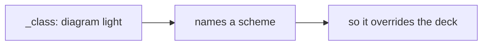
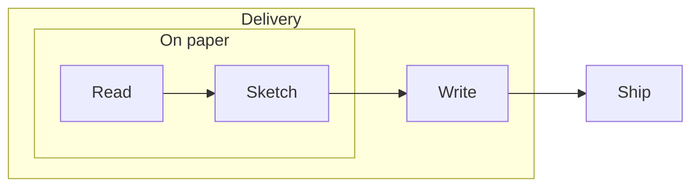
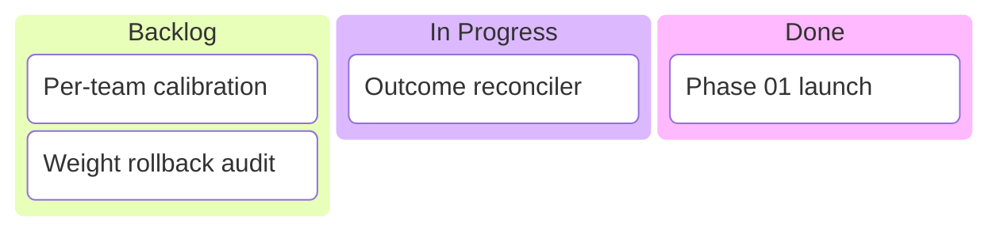

<!-- _class: title -->
<!-- _header: '' -->
<!-- _paginate: false -->

`Diagram surface · engine`

# Three fixes to the diagram surface

The band a diagram bakes for, the map it is coloured from, and the box it is drawn in.

---

<!-- _class: diagram -->

`#1340 · the deck says dark`

## A slide that names its own `_class:` keeps the deck's canvas.

---

<!-- _class: content -->

`Why it hit every deck`

## The bake asked the wrong question.

- Two answers, one question
  - Print inherited the deck. Dark threw it away the moment a slide named any `_class:` — and that is how every component is selected.
- What you saw
  - Light-mode ink on a dark canvas, and connectors that vanished into it.
- What decides it now
  - One kernel: print wins, a slide naming a scheme owns it, everything else inherits.

---

<!-- _class: diagram light -->

`Rule two, intact`

## A slide that pins `light` still renders light.

---

<!-- _class: diagram -->

`The containment box`

## A subgraph is a surface, so it is shaped like one.

---

<!-- _class: content -->

`Corner and padding`

## Two numbers, each in the space it is actually read in.

- The corner is `rx`, not `border-radius`
  - One CSS rule reaches the export and the preview alike.
- The radius is in the diagram's own space
  - Never a container unit — geometry is read in diagram coordinates.
- Padding is one constant now
  - Export and preview each had their own, so nodes came out two sizes.

---

<!-- _class: diagram -->

`Left alone, deliberately`

## The categorical band keeps the shape Mermaid gives it.

---

<!-- _class: content -->

`One map, two readers`

## The two renderers stopped answering the same question twice.

- What drifted
  - Each path kept its own copy. A gate watched the key sets; nobody watched the values, and thirty-eight had come apart.
- Where it showed
  - Node ink on the accessibility palettes in dark, and the gitgraph tag chip.
- What replaces it
  - One map, two readers. A parity test fails on any divergence not named and justified.
