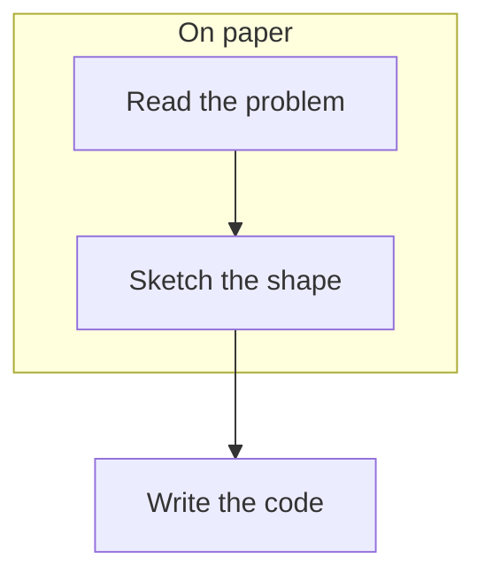
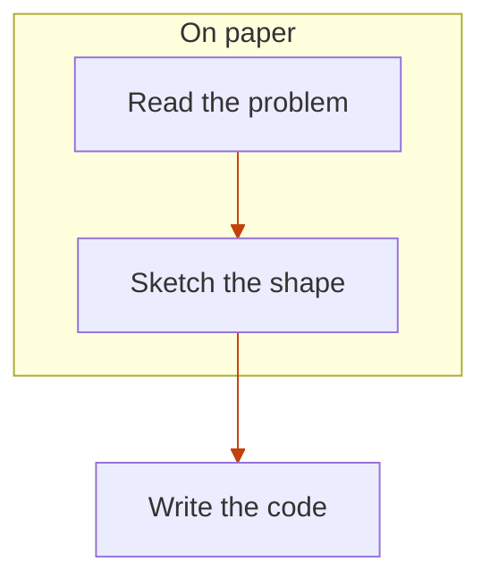
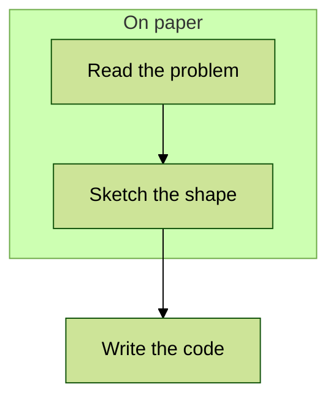

<!-- _class: title silent -->

`Fix demo · mermaid %%{init}%%`

# A diagram directive no longer costs the palette.

Every slide that follows carries the same three-node graph. What changes is the `%%{init}%%` line above it — and, until this fix, whether the figure kept the deck's colors at all.

---

<!-- _class: diagram -->

`Baseline`

## No directive: the engine themes the whole figure.

---

<!-- _class: diagram -->

`Color-neutral directive`

## A curve directive, and the palette survives it.

`Straight edges — the author's option applied; every color still the theme's.`

---

<!-- _class: content -->

`What used to happen`

## The old rule was all-or-nothing, and it failed quietly.

Any directive at all made the export path skip the injected theme variables wholesale, so a line about curve style dropped the entire palette: yellow cluster, stock node fills, gray label ink, wrong font. Nothing errored. The diagram rendered — off-theme — and passed review unless somebody looked hard at the colors.

---

<!-- _class: diagram -->

`Partial override`

## Name one variable, change one variable.

`Only the edges moved — cluster, nodes, and ink stayed on the theme.`

---

<!-- _class: diagram -->

`Deliberate opt-out`

## Naming a Mermaid theme still hands the figure over.

`theme: forest — stock Mermaid, on purpose. The engine stands down.`

---

<!-- _class: content -->

`The rule, in one line`

## The engine goes underneath you, not instead of you.

Its directive is emitted ahead of yours, and Mermaid merges init directives in source order with the later one winning. So you get the key you named; every key you did not name keeps the deck's palette. Only a `theme:` other than `base` reads as an opt-out.

---

<!-- _class: content -->

`Worth knowing`

## One directive still looks like it works and doesn't.

`layout: 'elk'` survives the merge now, but elk ships as a separate package neither renderer registers. Mermaid does not fail on an unknown layout — it falls back to dagre with a log warning nobody sees, so the figure comes back on-palette in the layout you were trying to leave.
