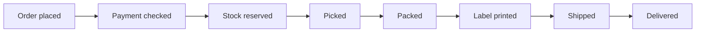
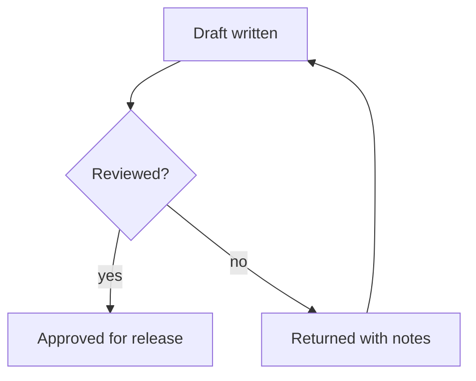
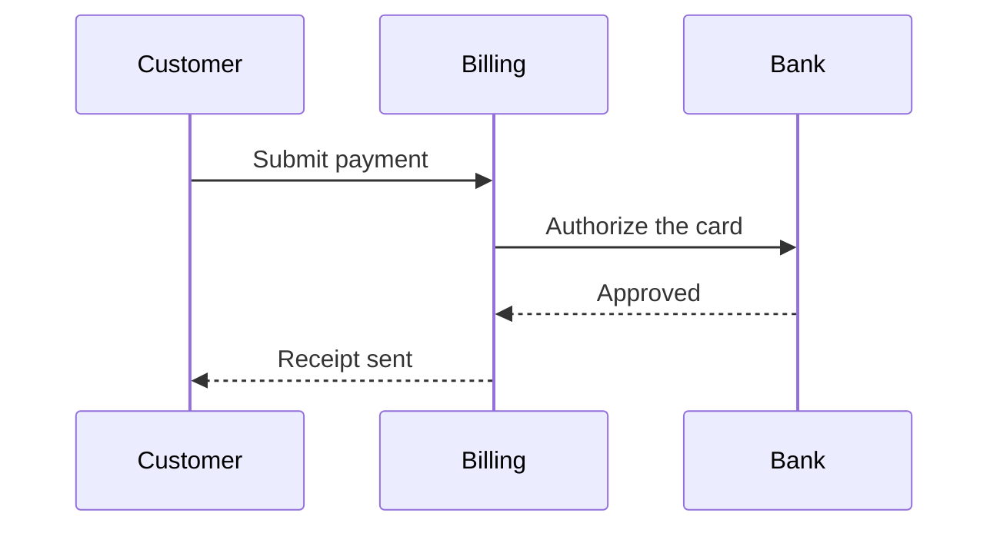
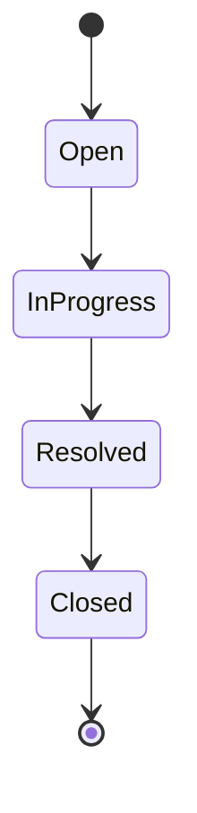

<!-- _class: title -->
<!-- _paginate: false -->

# Mermaid labels fit their boxes

A diagram on a plain slide no longer takes the slide's paragraph size

---

<!-- eyebrow: Flowchart, left to right -->

# How an order moves

Each label sits whole and centered in its box. Before, every one was clipped to its first few letters.

---

<!-- eyebrow: Flowchart, top to bottom -->

# Approving a change

A decision diamond keeps its question inside its outline.

---

<!-- eyebrow: Sequence diagram -->

# Paying an invoice

A sequence diagram is unchanged: it draws its labels as SVG text, not in a paragraph.

---

<!-- eyebrow: State diagram -->

# The life of a ticket

State names fit their rounded boxes at the size Mermaid measured them.

---

<!-- _class: closing -->

# Why it happened

Mermaid measures each box at 14px, then wraps the label in a paragraph, and the slide's body-text rule restyled that paragraph at about 21px. A diagram now keeps its own type.
