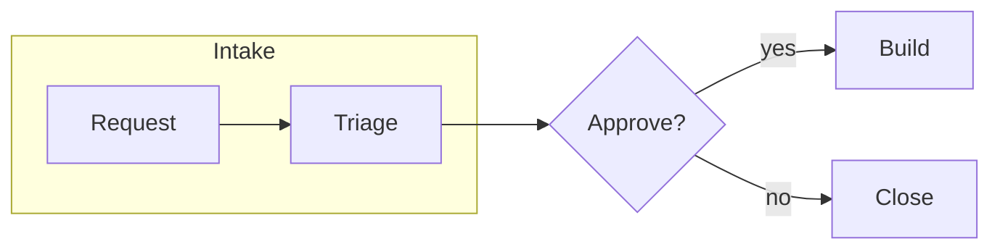
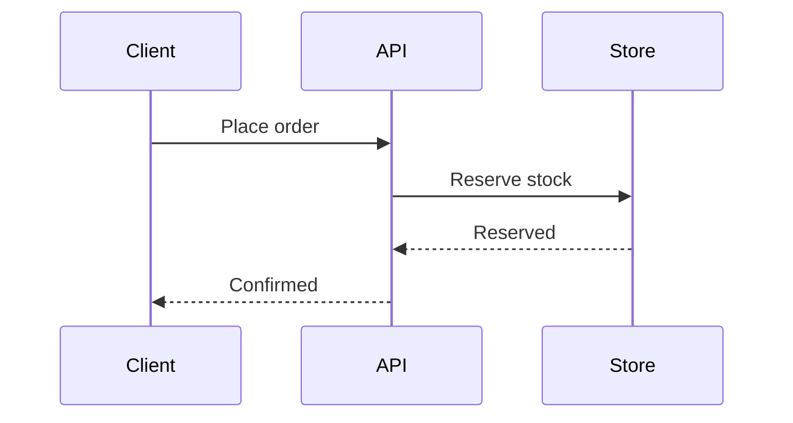
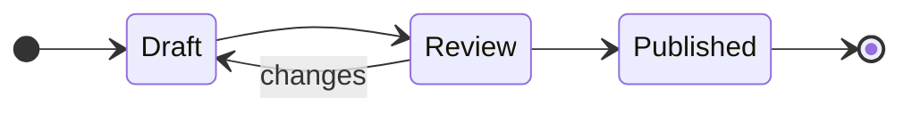
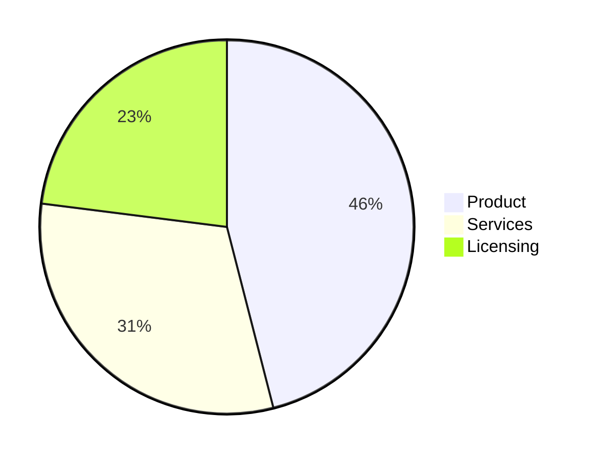
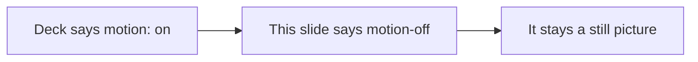

<!-- _class: title silent -->

`Mermaid · motion`

# A diagram builds in, like a chart

This deck sets `motion: on` and nothing else. Every Mermaid diagram in it now builds the way a chart does: the containers first, then the boxes, then the arrows between them, then the words.

---

<!-- _class: content -->

## What changed, and where it runs

A Mermaid diagram is an SVG, but it declared no motion roles, so `motion:` passed it by.

The runtime now tags each drawn diagram with the roles a chart emits. It builds in the Playground, the Studio, Present and the HTML player.

> The PDF is a still, as for every chart. Open the deck live to watch it build.

---

<!-- _class: diagram -->

`Flowchart · boxes, then arrows`

## A subgraph frames the boxes before the arrows arrive.

---

<!-- _class: diagram -->

`Sequence · actors, then messages`

## The participants stand up, then the messages run in order.

---

<!-- _class: diagram -->

`State · same build`

## Every family on Mermaid's graph renderer builds the same way.

---

<!-- _class: diagram -->

`Pie · the disc arrives whole`

## A pie reveals as one disc, exactly like a chart pie.

---

<!-- _class: diagram motion-off -->

`Opt out · one slide`

## A slide can still opt out with motion-off.

---

<!-- _class: content -->

## What stays a still

A family Mermaid draws with a renderer we have not mapped, such as a user journey, gets no roles and stays a still picture.

Viewers who ask the OS to reduce motion see every diagram settled, with no entrance, as they do for charts.

> Mapped: flowchart, state, class, ER, mindmap, sequence, pie, gantt, XY chart, quadrant, git graph and timeline.
