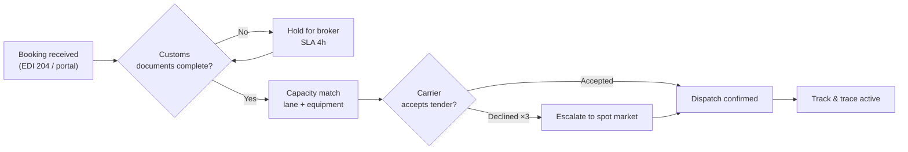
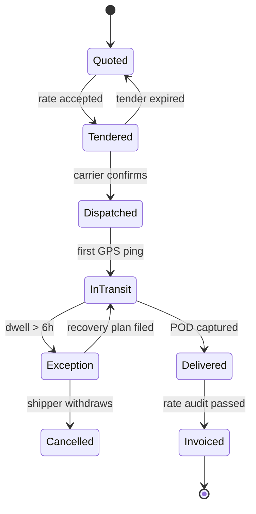
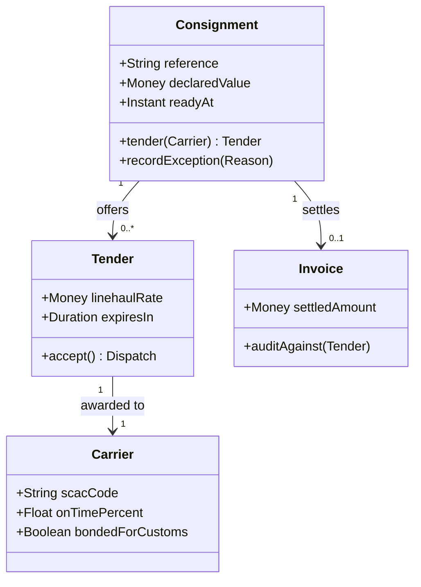
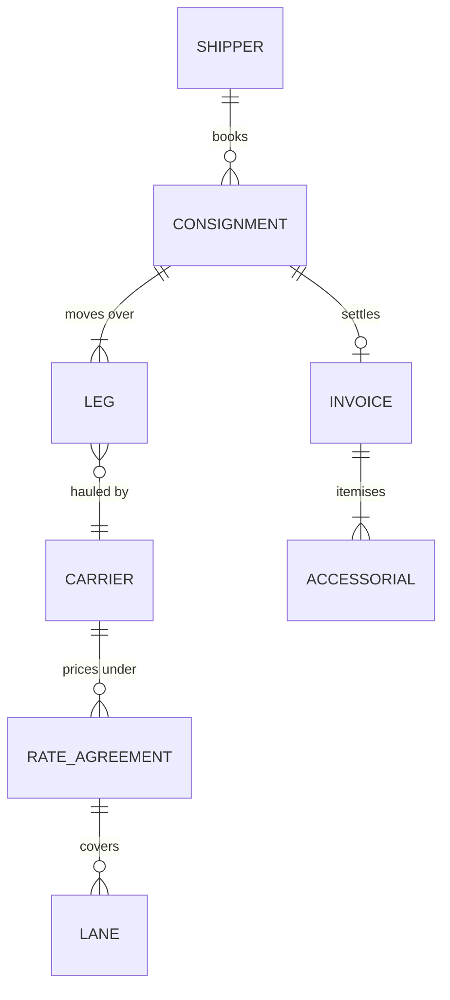
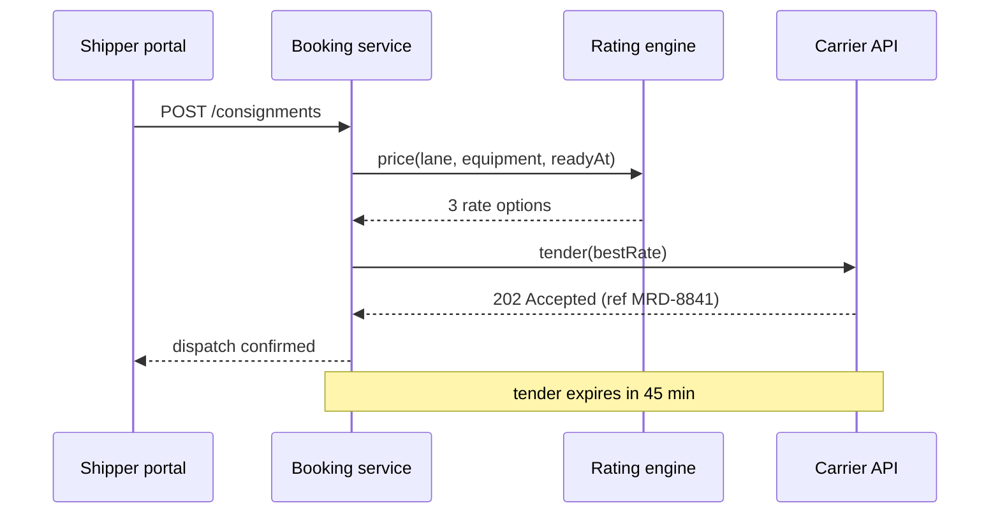
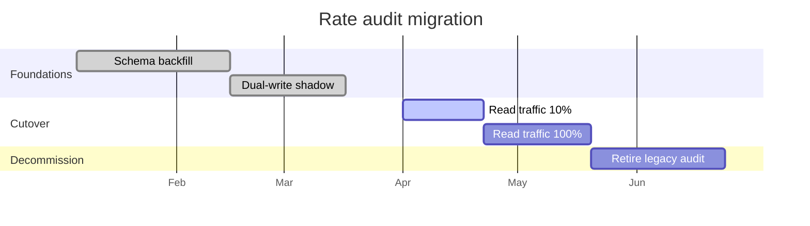

<!-- _class: title -->
<!-- _header: '' -->
<!-- _paginate: false -->

`Diagram type · engine`

# The hand reaches the diagram

A sketch deck used to wrap hand-drawn shapes around machine-faced labels. Now the whole slide speaks in one voice — including the diagrams.

---

<!-- _class: diagram -->

`Flowchart · consignment intake`

## Where a booking can stop, and who is holding it.

---

<!-- _class: diagram -->

`State diagram · consignment lifecycle`

## Every status a shipper can see, and the transitions we allow.

---

<!-- _class: diagram -->

`Class diagram · domain model`

## The four aggregates the booking service owns.

---

<!-- _class: diagram -->

`Entity relationship · settlement schema`

## What rate audit actually joins across.

---

<!-- _class: content -->

`Why it was never a CSS fix`

## Mermaid measures a label in the browser that renders it.

- The measurement happened somewhere else
  - The export shelled out to a binary whose page carries none of the deck's fonts, so every label was sized in a fallback face.
- Then the paint moved
  - The finished SVG lands in the deck, where the real face loads — and the box no longer fits the text it was measured for.
- Why mono never showed it
  - Its stack ends in the `monospace` generic, whose fallback metrics nearly match. No hand face has that luck.

---

<!-- _class: diagram -->

`Sequence · legacy renderer`

## Machine-drawn shapes, hand type — the tender API round trip.

---

<!-- _class: diagram -->

`Gantt · legacy renderer`

## The migration plan, in the deck's own voice.

---

<!-- _class: diagram boardroom -->
<!-- _header: "Meridian Freight · platform review · opted out" -->

`Per-slide opt-out`

## One slide can step out of the finish entirely.

---

<!-- _class: content -->

`Where the shape answer stops`

## Texture outranks the finish, and always did.

- Pattern is data, not decoration
  - On `a11y-*`, `onyx` and `concrete` the per-category texture is how a color-blind or monochrome reader tells nodes apart.
- A hachure cannot carry a tile
  - Painted through a 4px variable-width stroke, four distinct patterns collapse to four grays 5% apart.
- So those decks split the difference
  - Machine-drawn shapes, hand type. Style never overwrites an accessibility affordance.
