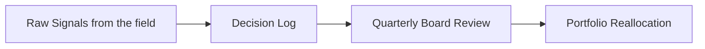
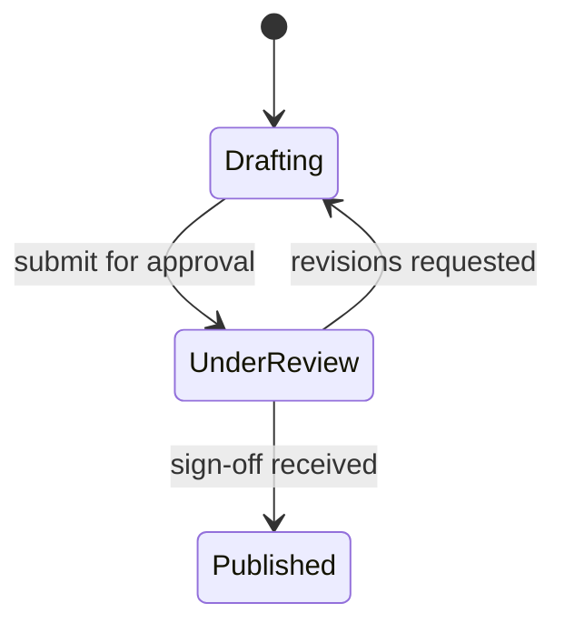
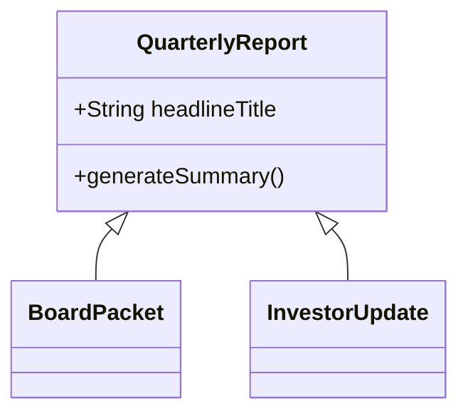
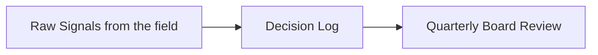
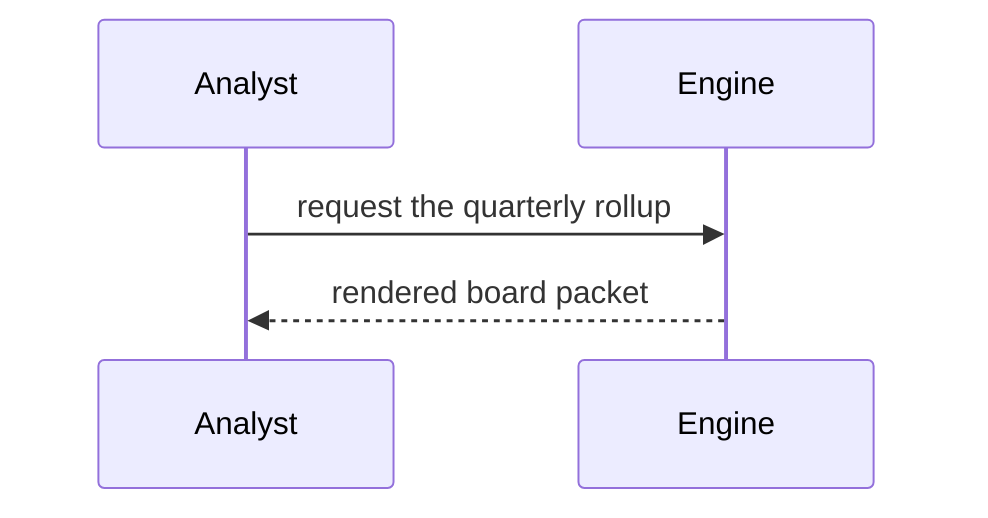

<!-- _class: title -->
<!-- _header: '' -->
<!-- _paginate: false -->

`Diagram type · engine`

# The hand reaches the diagram

A sketch deck used to wrap hand-drawn shapes around machine-faced labels. Now the type carries through.

---

<!-- _class: diagram -->

`#1674 · flowchart`

## Long labels, measured in the face they are painted in.

---

<!-- _class: content -->

`Why it was never a CSS fix`

## Mermaid measures a label in the browser that renders it.

- The measurement was somewhere else
  - The export shelled out to a binary whose page carries none of the deck's fonts, so every label was sized in a fallback face.
- Then the paint moved
  - The finished SVG lands in the deck, where the real face loads — and the text no longer fits the box it was measured for.
- Why mono never showed it
  - Its stack ends in the `monospace` generic, whose fallback metrics nearly match. No hand face has that luck.

---

<!-- _class: diagram -->

`State · the same face throughout`

## Nothing here is sketch-specific.

---

<!-- _class: content -->

`How the type gets there`

## It follows a token, like every other run of text on the slide.

- One re-point
  - The sketch finish already points `--font-body` at `--sketch-font-body`. The diagram map reads `--font-body`.
- One reader taught one rule
  - The export resolves tokens offline, where a class-scoped rule is invisible, so it applies that re-point itself.
- Both paths, one answer
  - The preview and the export now configure Mermaid identically. There is no sanctioned divergence left between them.

---

<!-- _class: diagram -->

`Class · unified renderer`

## Hand shapes and hand type are separate answers.

---

<!-- _class: boardroom -->
<!-- _header: "Lattice · sketch diagram labels · opted out" -->

`Per-slide opt-out`

## One slide can step out of the finish entirely.

---

<!-- _class: diagram -->

`Legacy renderer`

## Sequence keeps machine-drawn shapes — and still speaks in the deck's voice.

---

<!-- _class: content -->

`Where the shape answer stops`

## Texture outranks the finish, and always did.

- Pattern is data, not decoration
  - On `a11y-*`, `onyx` and `concrete` the per-category texture is how a color-blind or monochrome reader tells nodes apart.
- A hachure cannot carry a tile
  - Painted through a 4px variable-width stroke, four distinct patterns collapse to four grays 5% apart.
- So those decks split the difference
  - Machine-drawn shapes, hand type. Style never overwrites an accessibility affordance.
