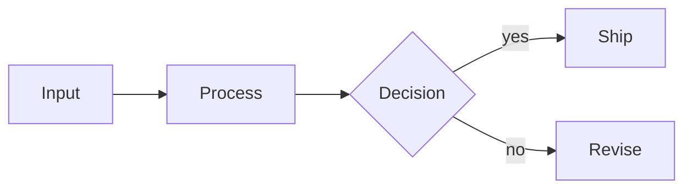

<!-- _class: title silent -->

`Mermaid · both fence characters`

# A tilde fence draws its diagram

CommonMark fences with backticks **or** tildes, and Markdown treats the two as the same thing. The live preview always did. The export did not — until this deck.

---

<!-- _class: content -->

## What was wrong, and where

The CLI substituted an SVG for a backtick fence and nothing else, so a tilde fence printed as **raw source** in the PDF.

The author could not see it coming: the preview they wrote in renders both. The next two slides are one diagram, written two ways.

> markdown-it emits `class="language-mermaid"` for either fence, and the runtime keys on that class.

---

<!-- _class: diagram -->

## A backtick fence.

> The form every deck in this repo already uses.

---

<!-- _class: diagram -->

## A tilde fence.

~~~mermaid
flowchart LR
  A[Input] --> B[Process]
  B --> C{Decision}
  C -->|yes| D[Ship]
  C -->|no| E[Revise]
~~~

> Identical bytes on the slide. Before this change, this page printed five lines of Mermaid source.

---

<!-- _class: content -->

## One matcher, two paths

The pattern lives in `lib/core/mermaid-fences.js`, and both callers read it: the CLI's substitution, and the **narrator** that speaks a diagram slide. Widening one alone would have drawn a diagram the voice could not read.

It is no looser than the regex it replaced, so a backtick fence substitutes to the same bytes it always did.

<!-- _footer: "Rendered with `node lattice-emulator.js examples/mermaid-tilde-fences.md`" -->
