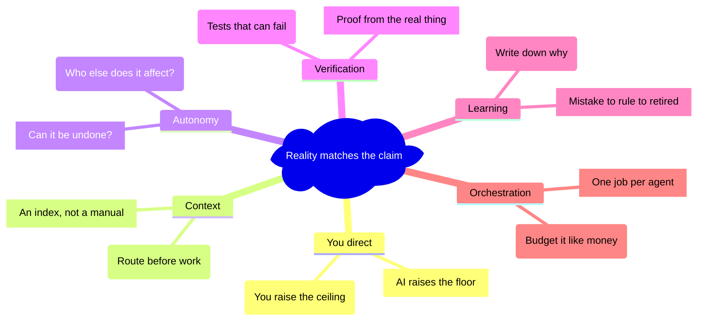
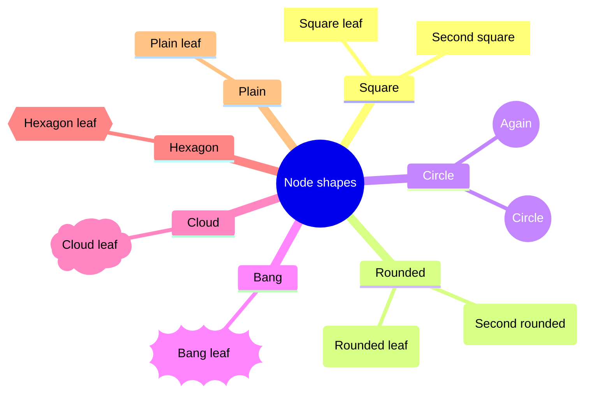
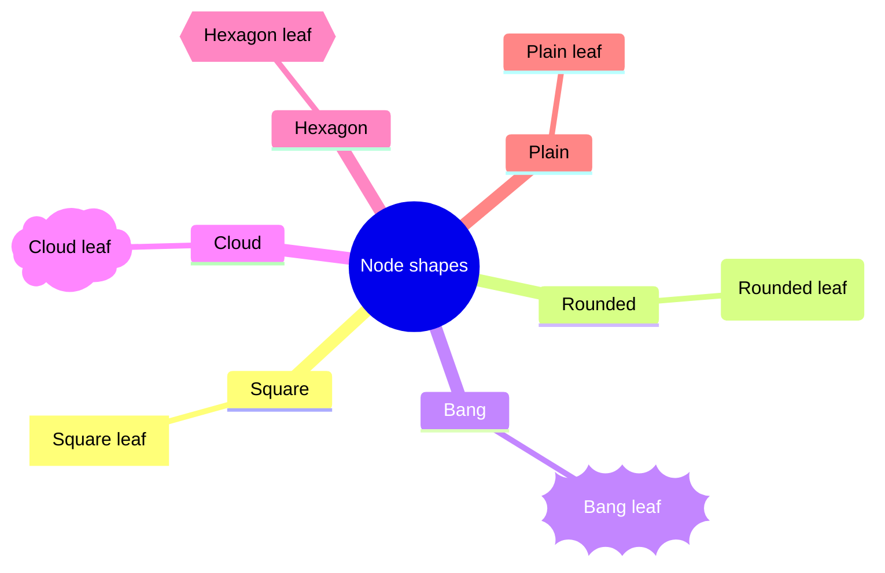
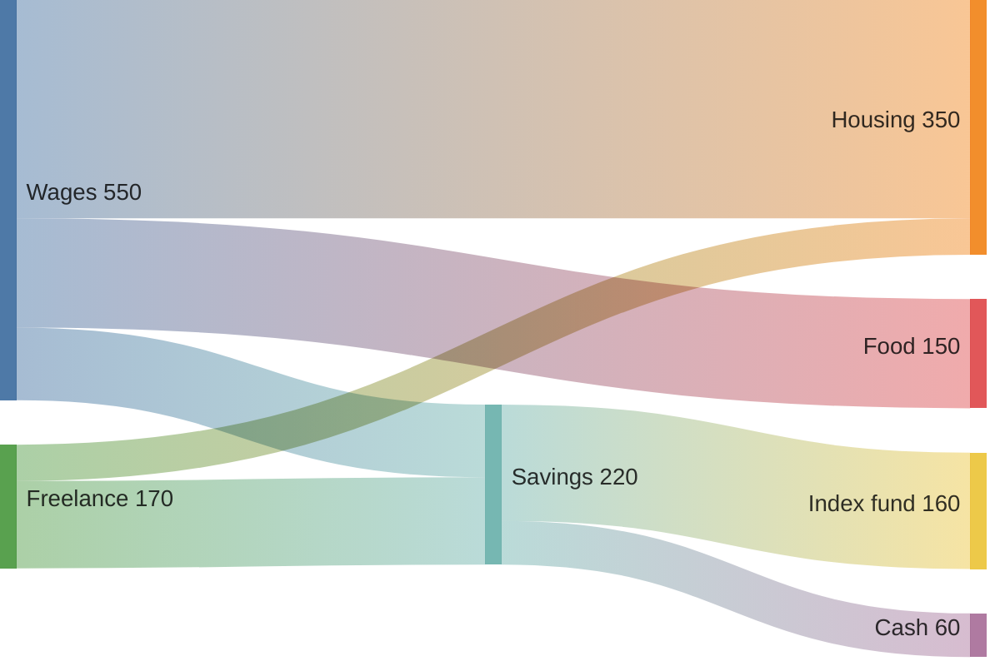

<!-- _class: title -->
<!-- _header: '' -->
<!-- _paginate: false -->

# One branch, one color

`Diagram · Mindmap · Categorical`

Every node in a mindmap branch now takes that branch's color, whatever its shape and however many branches the map has. Each branch line matches its boxes, and the root has a color of its own.

---

<!-- _class: diagram -->

`01 · The repro, light`

## Six branches, six colors, and a root that stands apart.

---

<!-- _class: diagram dark -->

`02 · The repro, dark`

## On a dark slide each line lightens, and keeps its branch's hue.

---

<!-- _class: diagram -->

`03 · Every node shape, light`

## Square, rounded, circle, bang, cloud, hexagon and plain all follow the branch.

---

<!-- _class: diagram dark -->

`04 · Every node shape, dark`

## The same seven shapes on a dark canvas.

---

<!-- _class: diagram -->

`05 · Eight branches, light`

## Past five branches the colors keep going instead of falling back to blue.

---

<!-- _class: diagram dark -->

`06 · Eight branches, dark`

## Branches seven and eight get colors of their own in dark mode too.

---

<!-- _class: diagram sketch -->

`07 · Hand-drawn look`

## Under the sketch look, each branch hatches in its own color.

---

<!-- _class: diagram -->

`08 · Sankey, unchanged`

## Sankey nodes still cycle by position, exactly as before.

---

<!-- _class: cards-grid four -->

`09 · What changed`

## Four fixes, all in one Mermaid stylesheet.

- Position
  - The order-based node cycle skips mindmap, so leaves stop taking a color from their place in the markup.
- Range
  - Node fills follow every branch Mermaid numbers, for every shape.
- Lines
  - Each line takes its branch's fill: darker on light, lighter on dark.
- Root
  - The root takes the deck accent, apart from the first branch.
