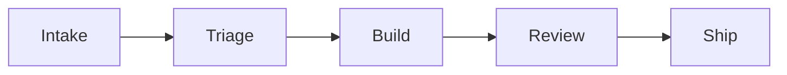
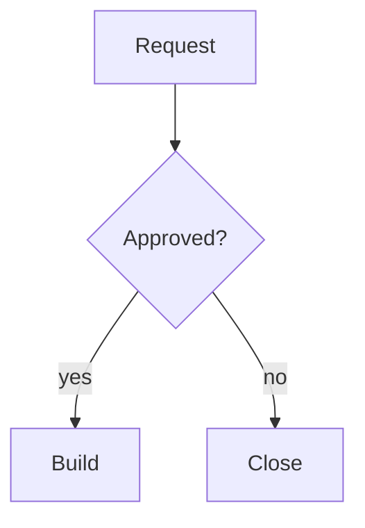
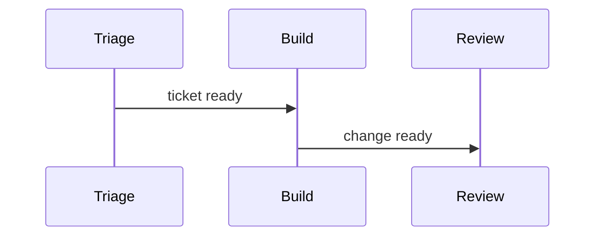

<!-- _class: title silent -->

# A diagram lays out for its pane

`Panes · Mermaid orientation`

---

<!-- _class: diagram -->

`Delivery · The full-slide diagram`

## Five stages, left to right, as a slide draws them.

---

## In a tall pane, the same flow runs down the page.

<!-- _class: columns ratio-35-65 -->
<!-- _pane: diagram -->

<!-- _pane: list -->

- Intake takes a day
- Review holds work for a week
- Ship is weekly

---

`Delivery · A wide pane`

## Two teams share the same five stages.

<!-- _class: columns ratio-65-35 -->
<!-- _pane: diagram -->

<!-- _pane: list -->

- Platform ships Mondays
- Apps ship Thursdays

> A 65% pane is wide, so the flowchart keeps the author's direction.

---

`Delivery · A vertical source`

## A top-down flowchart needs nothing from the pane.

<!-- _class: columns ratio-35-65 -->
<!-- _pane: diagram -->

<!-- _pane: list -->

- Most requests pass on the first review
- A closed request can be filed again

> Only a left-to-right or right-to-left flowchart is turned; every other diagram keeps its source.

---

`Delivery · A sequence`

## The hand-off is two messages.

<!-- _class: columns ratio-55-45 -->
<!-- _pane: diagram -->

<!-- _pane: list -->

- Triage owns the ticket until Build accepts it
- Review sees only finished changes

---

<!-- _class: title silent -->

# The pane decides the direction

`The CLI and the live preview read the same stamp`
