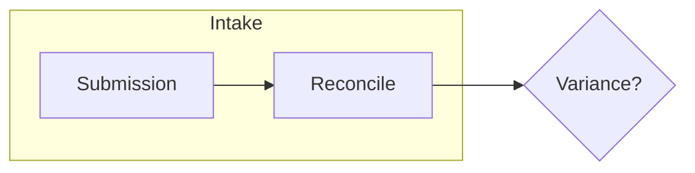
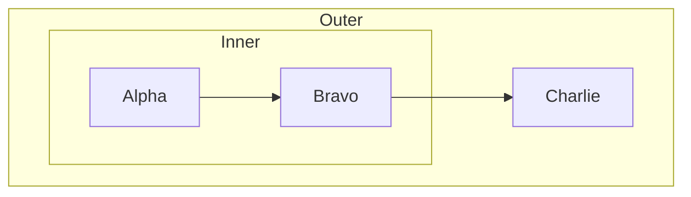

<!-- _class: title -->
<!-- _header: '' -->
<!-- _paginate: false -->

# A diagram is baked for its own slide

`Diagram · Band · Kernel`

The preview used to bake every diagram from slide 1. Now both render paths resolve the palette per slide, and the marker that reconciled them is gone.

---

<!-- _class: content -->

## Baked ink over a live chip: both have to mean the same slide.

- Baked
  - Mermaid resolves its theme variables to literal hex before the shape reaches the page. No later restyle recolors a node label.
- Live
  - The chip underneath is per-section CSS, repainted whenever the section's class changes.

Four defects landed on #1326 in a row, each of them these two halves naming different slides.

---

<!-- _class: diagram -->

`Light band`

## A light slide gets light-band ink: dark labels, dark arrowheads.

Read the arrowhead: `#000000` on the light band, over a pale categorical chip.

---

<!-- _class: diagram dark -->

`Dark band · same deck`

## The next slide pins dark, and the diagram follows it.

Same source, same deck, one `_class: dark`. The preview used to bake this one from slide 1 — black arrowheads on a dark canvas.

---

<!-- _class: diagram -->

`No directive`

## A bare slide inherits the deck, not the slide before it.

Marp's `_class` is a single-slide directive. The export used to take the last one appearing anywhere earlier in the source, so this slide inherited `dark` — white node ink on a light chip.

---

<!-- _class: content -->

## What the fix actually was: pass the section in.

| | Before | After |
|---|---|---|
| preview scope | `document.querySelector('section')` | the section being rendered |
| preview config | once per document | once per band |
| PDF-path band | last `_class:` before the fence | the fence's own slide |
| reconciliation marker | `data-lattice-slide-bake` | deleted |

`getComputedStyle(section)` already returns what that slide's cascade produced. CSS inheritance answers the question offline resolution has to compute, which is why this is a parameter and not a rewrite.

---

<!-- _class: diagram -->

`Cluster · containment tier`

## Everything a cluster draws follows the band too, not just the labels.

Cluster background, boundary, edge stroke and marker fill are all baked. Two slides back they came from the dark band; here, the light one.

---

<!-- _class: content -->

## The kernel drives; the paths supply capabilities.

- One walk
  - `renderDiagrams(deck, ports)` resolves each slide's palette from the single 166-entry map and hands it to the path.
- One real difference
  - How you read a token for a slide: `getComputedStyle` in the preview, offline resolution in the export. Everything else used to be written twice.
- One deletion
  - An attribute announcing "this render baked per slide" says nothing once both paths do.

Ship the deletion, not another reconciliation device. That was the test this design had to pass.
