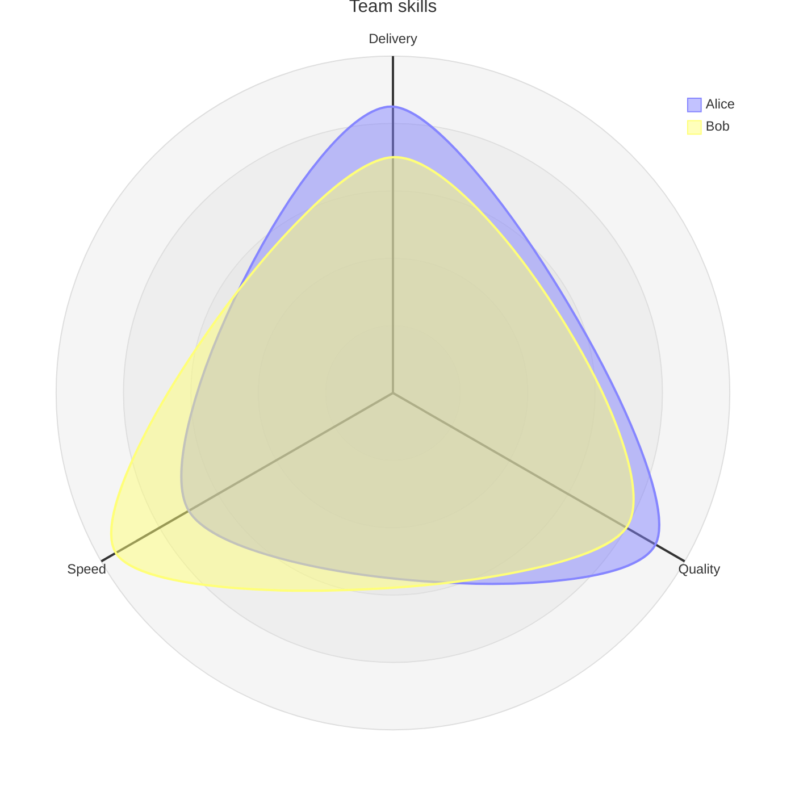
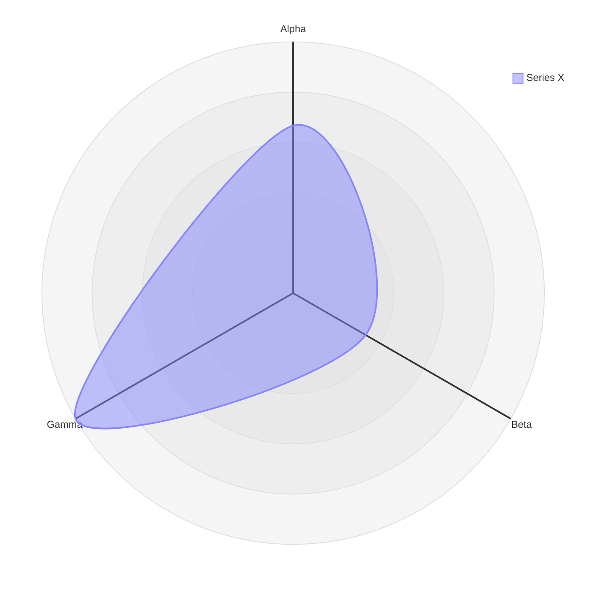
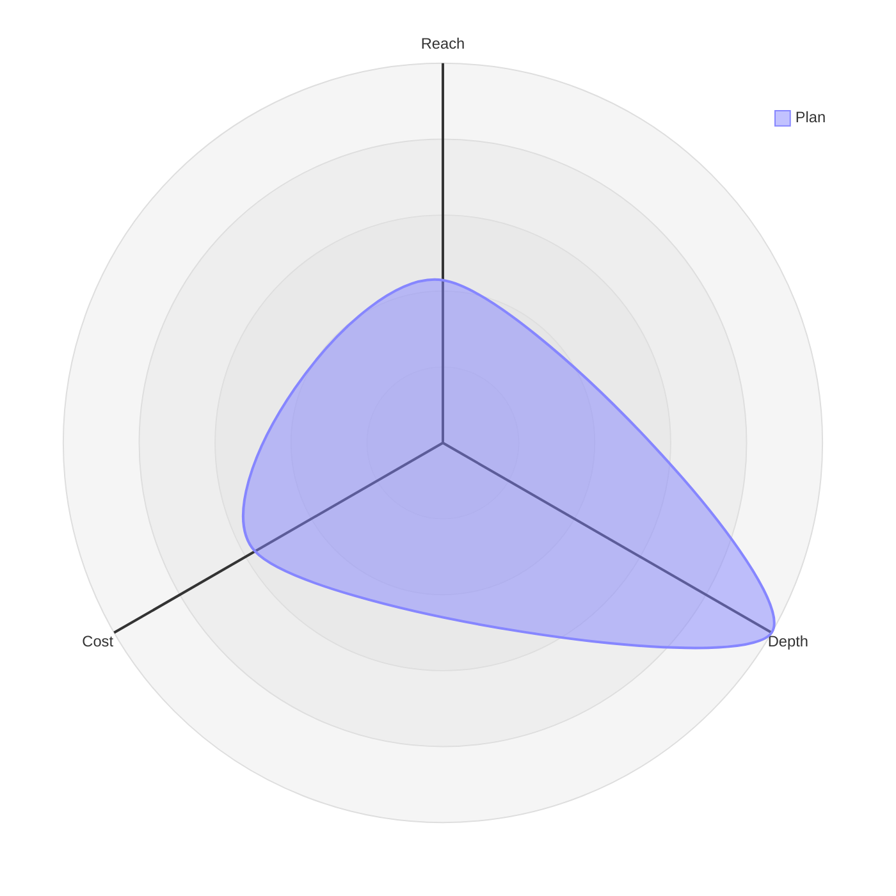
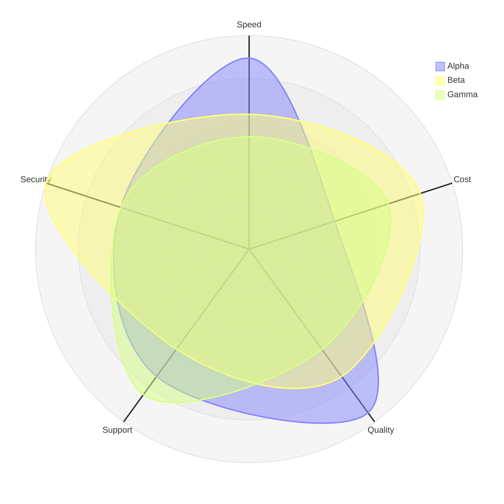
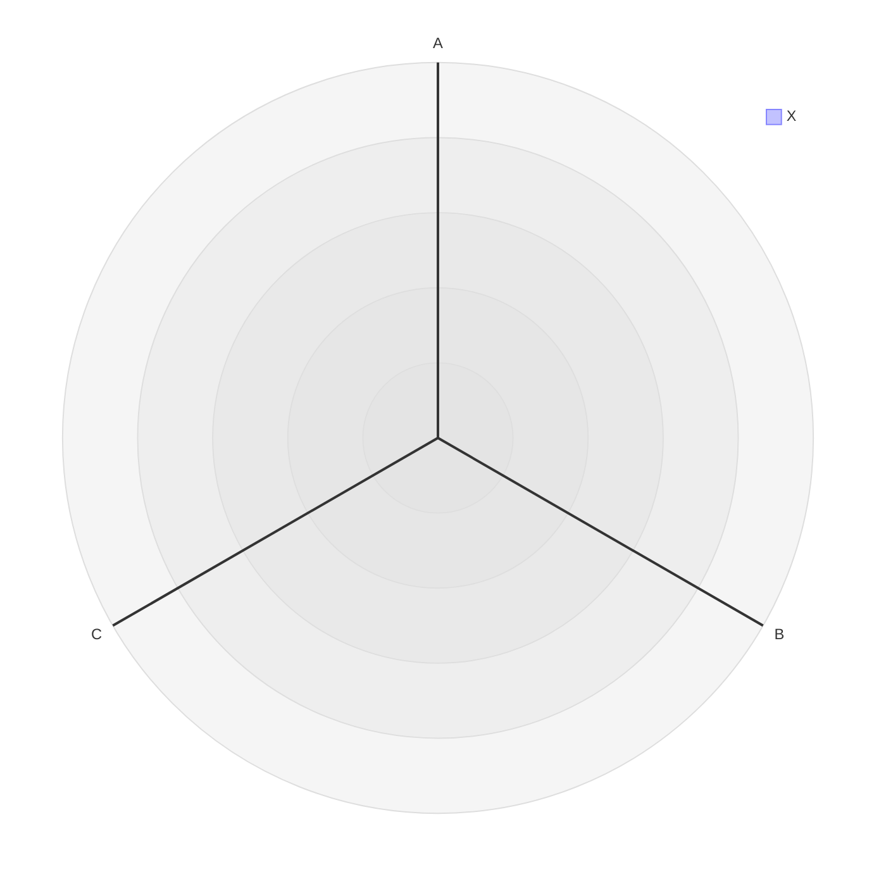

<!-- _class: title -->
<!-- _paginate: false -->
<!-- _footer: '' -->
<!-- _header: '' -->

# Read-aloud that reads the radar.

`Mermaid radar-beta narration`

*The last first-wave Mermaid type. A radar chart's meaning is its authored numbers on named axes — so read-aloud states the scale, then each curve's value on each axis, pairing them exactly as the chart plots them (design 2026-07-14, radar fast-follow).*

---

<!-- _class: diagram -->

`01 · Positional values`

## Values pair to axes in order.

> The reading opens with the scale, then walks each curve axis by axis in declaration order: "A radar chart, Team skills, on a scale of zero to one hundred. Alice: Delivery, eighty-five; Quality, ninety; Speed, seventy. Bob: Delivery, seventy; Quality, eighty; Speed, ninety-five."

---

<!-- _class: diagram -->

`02 · Keyed values`

## Named values pair by axis, not by position.

> A curve can name each value by its axis id, in any order. The reading still pairs each to the right axis and speaks them in axis order — so "b: 5, a: 10, c: 15" reads "Series X: Alpha, ten; Beta, five; Gamma, fifteen." The value always lands on the axis the author named.

---

<!-- _class: diagram -->

`03 · The scale, stated`

## Read the bounds the author set — or the fit the chart uses.

> A radar chart is unreadable by ear without its scale, so the reading always states it. With `min`/`max` it reads those bounds; without a `max` it reads the same extent the chart draws — the outer ring sitting exactly at the largest value: "A radar chart on a scale of zero to seven. Plan: Reach, three; Depth, seven; Cost, four."

---

<!-- _class: diagram -->

`04 · When it's a lot`

## A wall of numbers becomes a shape.

> Fifteen values read one after another would drown a listener and lose the point — which curve leads where. So past about a dozen values the reading summarizes with the counts and each curve's peak, the one fact a listener can hold: "A radar chart on a scale of zero to ninety-five, with three curves across five axes. Alpha peaks on Quality, at ninety. Beta peaks on Security, at ninety-five. Gamma peaks on Support, at eighty." The summary names itself, so nothing is silently dropped.

---

<!-- _class: diagram -->

`05 · Honest bail`

## A reading it can't pair faithfully, it doesn't guess.

> When a positional curve's value count doesn't match the axes — or a keyed value names an axis that doesn't exist — the values can't be paired without guessing, so the slide falls back to its heading and this caption. No value is ever read against the wrong axis.

---

<!-- _class: closing -->
<!-- _footer: '' -->

# The radar is spoken now.

`radar-beta · scale + per-axis values · positional or keyed · read-aloud + exported captions`
