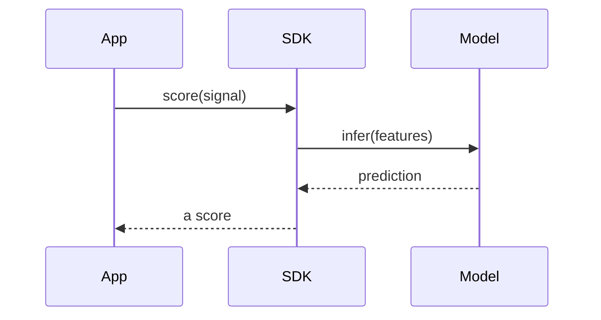
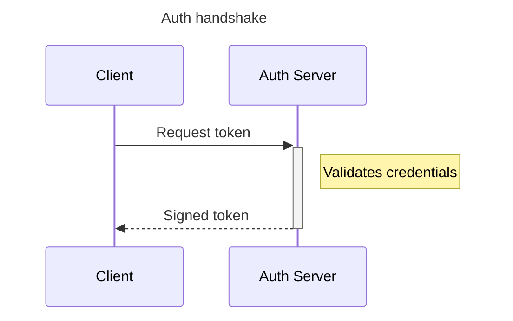
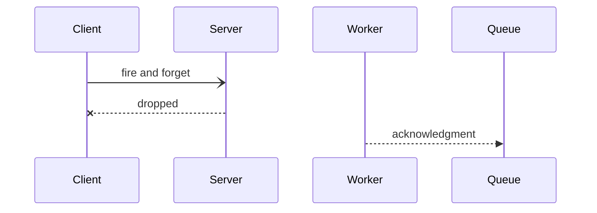
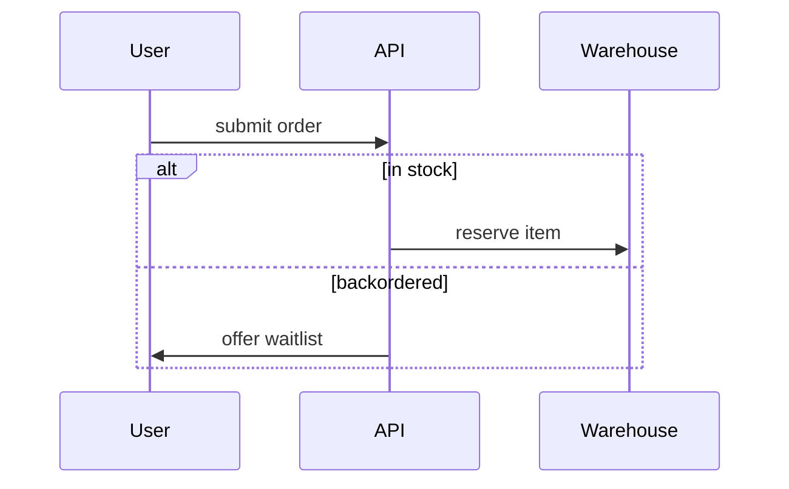
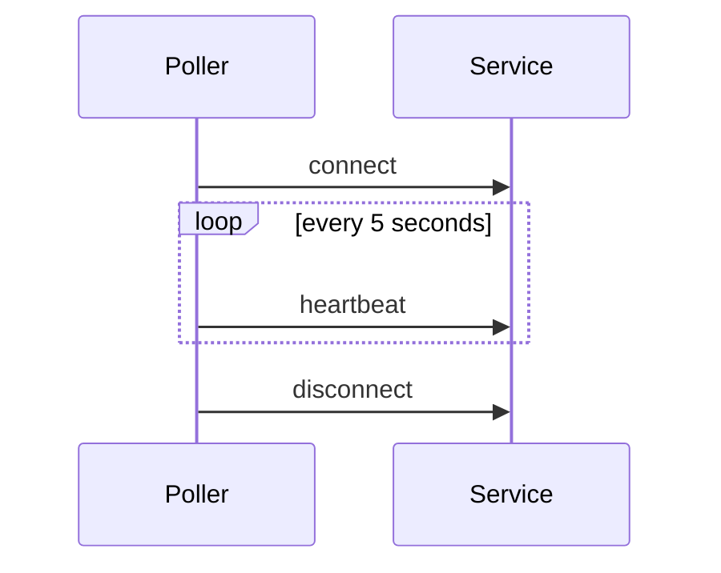
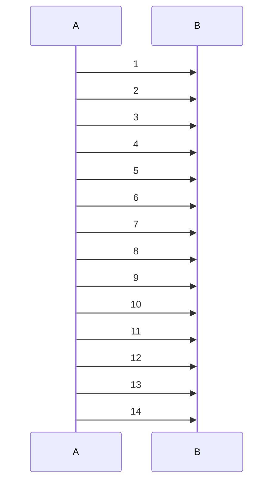
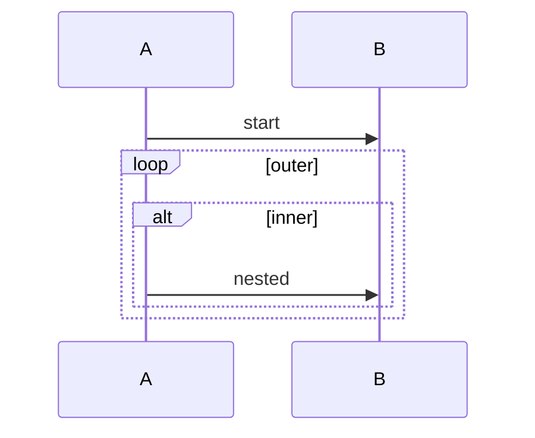

<!-- _class: title -->
<!-- _paginate: false -->
<!-- _footer: '' -->
<!-- _header: '' -->

# Read-aloud that reads the conversation.

`Mermaid sequenceDiagram narration`

*A `diagram` slide's sequence diagram used to narrate its heading and go silent. Now read-aloud (and the exported captions) walk the message script in source order — naming each participant, reading every author's message label, and speaking single-level blocks as connectives — the first Mermaid type past the flowchart (design 2026-07-14, first-wave slice #1).*

---

<!-- _class: diagram -->

`01 · The message script`

## Each message, in the order it was sent.

> The reading opens with the frame — "A sequence diagram." — then walks the messages in source order: "App sends to SDK: score(signal). SDK sends to Model: infer(features). Model sends to SDK: prediction. SDK sends to App: a score." An undeclared id reads as its own name.

---

<!-- _class: diagram -->

`02 · Participants and notes`

## Aliases name the speaker; a note is read in place.

> A `participant … as` alias speaks the display label, not the id: "Client sends to Auth Server: Request token." A single-line note reads as "Note: Validates credentials." The `+`/`-` activation flags are lifeline bookkeeping — silent, never spoken.

---

<!-- _class: diagram -->

`03 · Every arrow is neutral`

## The glyph's sync/async/reply meaning is never voiced.

> A solid, dashed, async, or lost arrow all read as the same neutral "sends to" — the glyph encodes sync/async/reply only by Mermaid *convention*, not authored content, so verbalizing it would be fabrication. Only the label after the colon is the author's meaning: "Client sends to Server: fire and forget. Server sends to Client: dropped. Worker sends to Queue: acknowledgment."

---

<!-- _class: diagram -->

`04 · A block as a connective`

## A loop or alternative frames the messages inside it.

> A single-level `loop`, `alt`/`else`, `opt`, `par`, `critical`, or `break` is spoken as a lead-in so the next message reads inside it. A first `alt` opens with "If ‹cond›:" — never "Alternatively" (which would imply a prior option): "User sends to API: submit order. If in stock: API sends to Warehouse: reserve item. Otherwise, if backordered: API sends to User: offer waitlist."

---

<!-- _class: diagram -->

`05 · Leaving a block`

## A message after the block resumes at the top level.

> When a block closes and more follows, the reading marks the return so the trailing message isn't heard as still inside the loop: "Poller sends to Service: connect. Repeatedly, every 5 seconds: Poller sends to Service: heartbeat. Afterwards: Poller sends to Service: disconnect."

---

<!-- _class: diagram -->

`06 · A long script stays listenable`

## Past a cap, the first messages read and the rest are counted.

> A wall of messages would drown a listener, so past a twelve-message cap the reading speaks the first twelve faithfully, then folds the remainder into a count: "… A sends to B: 12. And two more messages." A prefix beats discarding the whole script for a bare total.

---

<!-- _class: diagram -->

`07 · Honest bail`

## What the parser can't read faithfully, it doesn't guess.

> A nested block, a multiline `note … end note`, or a line the parser doesn't recognize returns nothing — the slide falls back to its heading and this caption, exactly as before. No confidently-wrong reading of a script the narrator can't yet parse; deeper structure graduates in a later slice.

---

<!-- _class: closing -->
<!-- _footer: '' -->

# The conversation is spoken now.

`sequenceDiagram · messages in order · every arrow neutral · read-aloud + exported captions`
