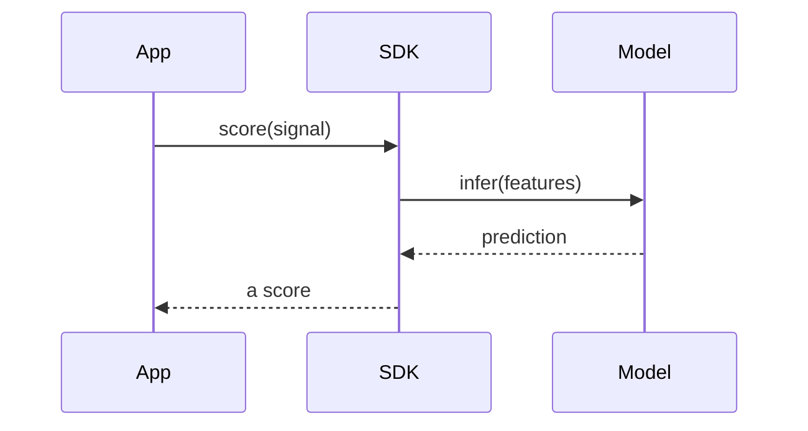
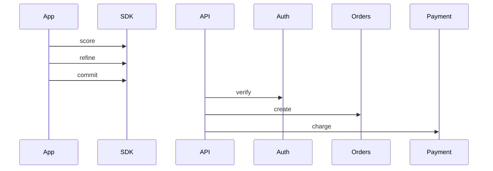
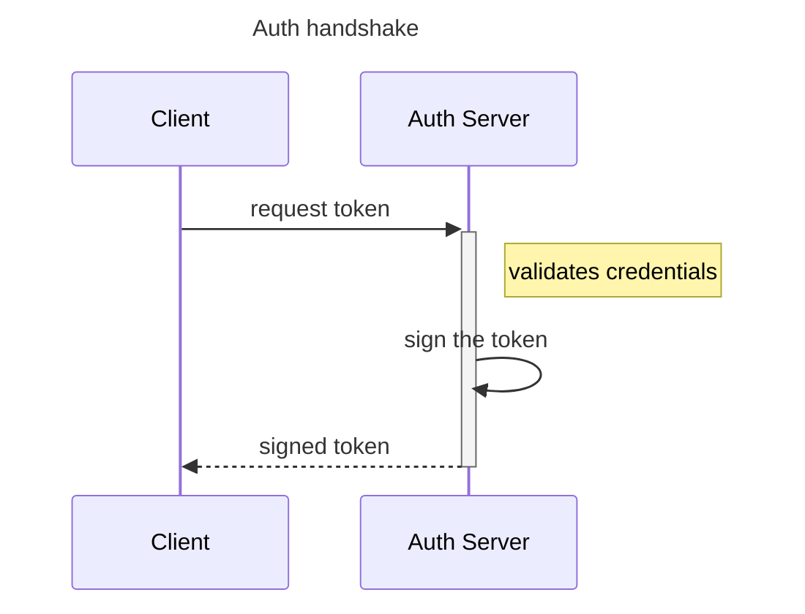
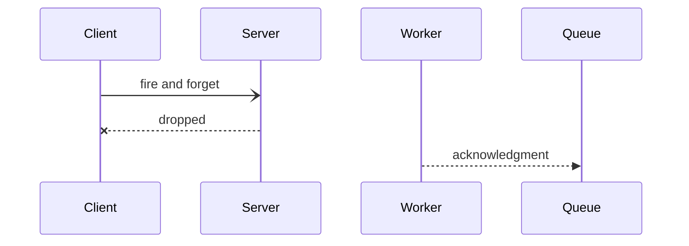
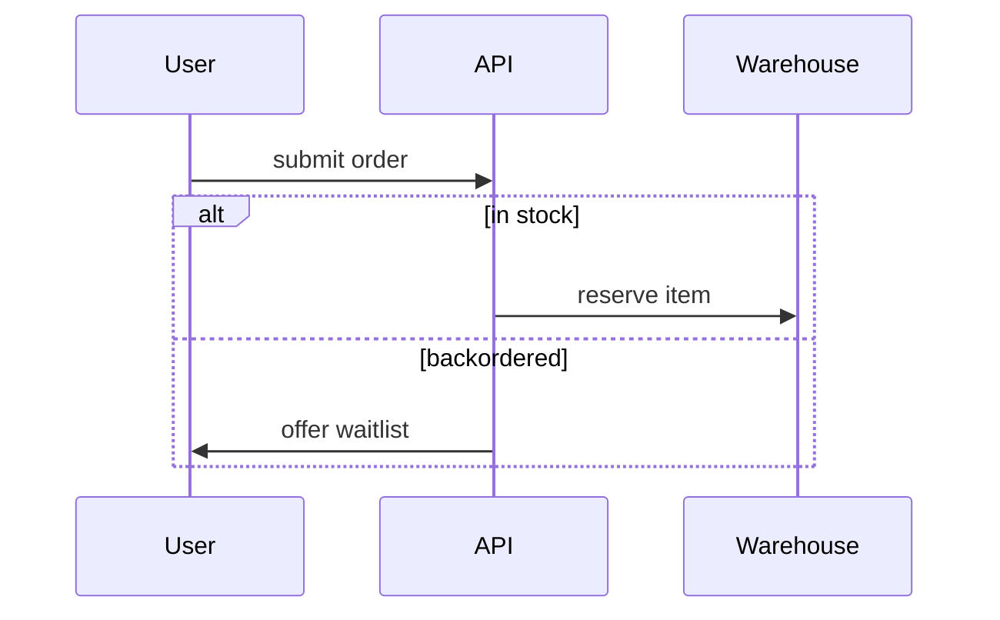
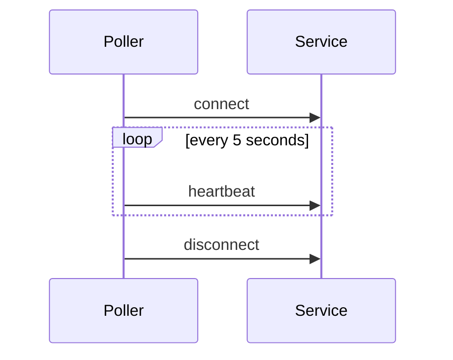
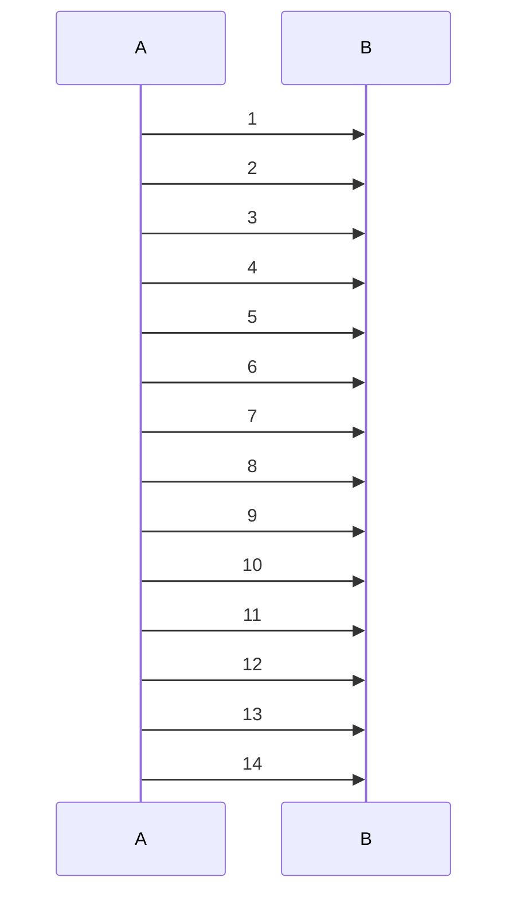
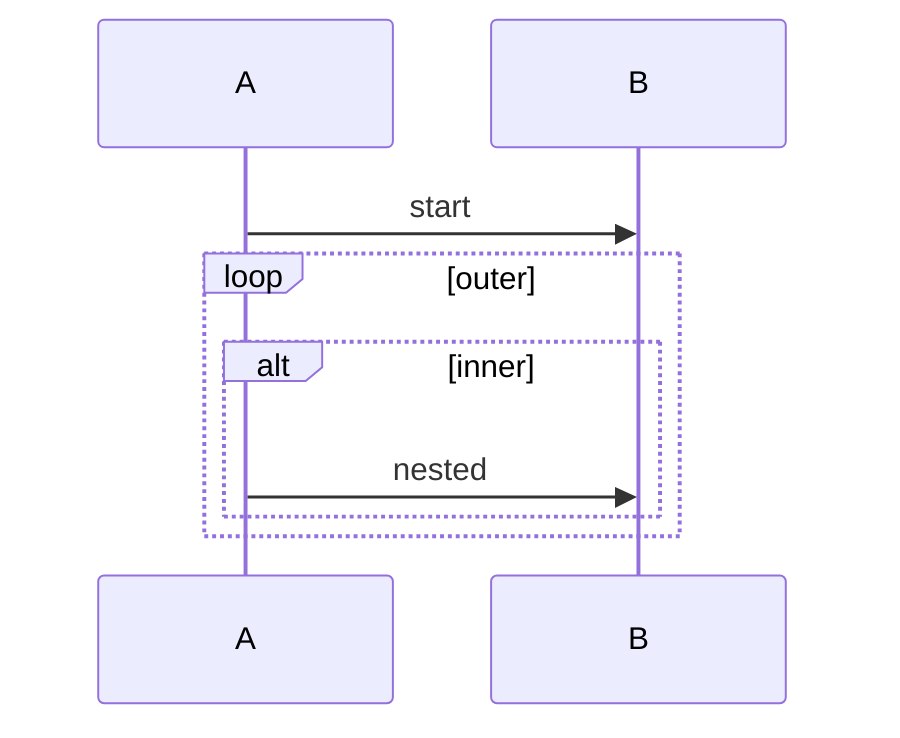

<!-- _class: title -->
<!-- _paginate: false -->
<!-- _footer: '' -->
<!-- _header: '' -->

# Read-aloud that reads the conversation.

`Mermaid sequenceDiagram narration`

*A `diagram` slide's sequence diagram used to narrate its heading and go silent. Now read-aloud (and the exported captions) walk the message script in source order — opening with the message count, de-repeating the scaffolding, and reading every author's label — the first Mermaid type past the flowchart (design 2026-07-14, first-wave slice #1, reading model hardened by a four-pass trio).*

---

<!-- _class: diagram -->

`01 · The message script`

## Each message, in the order it was sent.

> The reading opens with a count — "A four-message sequence diagram." — the one orientation a listener can't reconstruct from the walk. Then each message, in source order: "App sends to SDK: score(signal). SDK sends to Model: infer(features). Model sends to SDK: prediction. SDK sends to App: a score." An undeclared id reads as its own name; a reversal of direction is read plainly, never as a "reply."

---

<!-- _class: diagram -->

`02 · Repetition, removed`

## A run from one sender de-repeats — losing nothing.

> Consecutive messages from the same sender collapse the repeated "X sends to Y" — but never a label. Same receiver reads as a list: "App sends to SDK: score; then refine; then commit." A fan-out to *different* receivers names every one: "From API: to Auth, verify; to Orders, create; to Payment, charge." Only the narrator's own scaffolding is dropped; every authored receiver and label stays.

---

<!-- _class: diagram -->

`03 · Internal work, and notes`

## A self-message is work, not a send.

> A `participant … as` alias speaks the display label ("Client sends to Auth Server: request token"). A message a participant sends to *itself* reads as internal work — "Auth Server, to itself: sign the token" — not "sends to Auth Server." A single-line note reads "Note: …"; the `+`/`-` activation flags are lifeline bookkeeping, silent.

---

<!-- _class: diagram -->

`04 · Every arrow is neutral`

## The glyph's meaning is never voiced — on purpose.

> Solid, dashed, async, and lost arrows all read as the same neutral "sends to." The glyph encodes sync / async / reply / lost only by Mermaid *convention*, not authored content — so the narrator will not say "returns," "responds," or "never arrives," and asserts no "request-response" or "polling" shape. That insight lives in the glyph and the reader's domain knowledge, both of which faithfulness forbids inventing. Only the label after the colon is the author's meaning.

---

<!-- _class: diagram -->

`05 · A block as a connective`

## A loop or alternative frames the messages inside it.

> A single-level `loop`, `alt`/`else`, `opt`, `par`, `critical`, or `break` is spoken as a lead-in so the next message reads inside it. A first `alt` opens with "If ‹cond›:" — never "Alternatively" (which would imply a prior option): "If in stock: API sends to Warehouse: reserve item. Otherwise, if backordered: API sends to User: offer waitlist." A block boundary also breaks a coalescing run, so a conditional message is never merged into an unconditional one.

---

<!-- _class: diagram -->

`06 · Leaving a block`

## A message after the block resumes at the top level.

> When a block closes and more follows, the reading marks the return so the trailing message isn't heard as still inside the loop: "Poller sends to Service: connect. Repeatedly, every 5 seconds: Poller sends to Service: heartbeat. Afterwards: Poller sends to Service: disconnect."

---

<!-- _class: diagram -->

`07 · A long script stays listenable`

## Past the cap, the payoff is never truncated away.

> A wall of messages would drown a listener, so past a twelve-message cap the reading speaks the first twelve, folds the hidden middle into a count, and then **always speaks the final message** — the outcome a protocol builds to: "A fourteen-message sequence diagram. A sends to B: 1; then 2; … then 12. And one more message, ending: A sends to B: 14."

---

<!-- _class: diagram -->

`08 · Honest bail`

## What the parser can't read faithfully, it doesn't guess.

> A nested block, a multiline `note … end note`, or a line the parser doesn't recognize returns nothing — the slide falls back to its heading and this caption, exactly as before. No confidently-wrong reading of a script the narrator can't yet parse; deeper structure graduates in a later slice.

---

<!-- _class: closing -->
<!-- _footer: '' -->

# The conversation is spoken now.

`sequenceDiagram · counted, de-repeated, every arrow neutral · read-aloud + exported captions`
