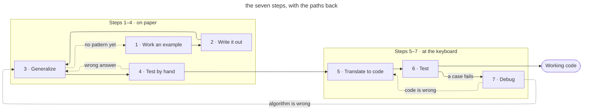

<!-- _class: title silent spectrum -->

# The Seven Steps

`Hilton, Lipp & Rodger · Duke University`

How to get from a problem statement to working code, without guessing.

---

<!-- _class: quote bare -->

> You are not stuck because you cannot code. You are stuck because you never worked out the algorithm.

*The gap this method closes*

---

<!-- _class: cards-grid three -->

`Why this happens`

## Getting stuck is a method problem, not a talent problem.

- Memorized answers
  - You learn what the answer was, and never the moves that got someone there.
- No fallback procedure
  - When the path is not obvious, nothing tells you what to try next.
- Finished examples
  - Working code shows the destination. The route that found it is nowhere on the page.

> “…none said how to write the algorithm, they just say you should write your algorithm first.” — a Coursera learner

---

<!-- _class: premise -->

## Writing code is the fifth step, not the first.

Four of the seven steps happen before you touch a keyboard, and they are the ones that decide whether the code will work. Each is small enough to finish in one sitting.

1. Work a case
   - Solve one instance by hand.
   - What does an answer look like?
2. Write it out
   - Record every move you made.
   - How did I get there?
3. Generalize
   - Swap your values for any.
   - What holds for every case?
4. Test by hand
   - Run new values by hand.
   - Does the algorithm hold?

---

<!-- _class: split-panel proof -->

`Step 1 · Work an example`

## Solve one instance by hand before you write anything.

*What does an answer look like?* Take a real problem — find the point in a set that is closest to a target — and work one single case out yourself.

- You know you're here when
  - You picked five actual points and one target, and found the closest one by hand.
- What you hand forward
  - One worked instance you fully believe, with no generalizing in it yet.
- If you get stuck
  - You are missing a domain fact, or the problem is not stated clearly.

---

<!-- _class: split-panel proof -->

`Step 2 · Write it down`

## Replay your own reasoning and record every move.

*How did I get there?* You just solved it, so the method is in your head. The job now is to get it onto paper, in the order you actually used it.

- You know you're here when
  - Your notes say: measure the distance to each point, then keep the smallest one.
- What you hand forward
  - Directions precise enough for someone else to follow without guessing.
- If you get stuck
  - “I just did it” means the case was too easy. Work a harder one.

---

<!-- _class: split-panel proof -->

`Step 3 · Generalize`

## Trade your specific values for any values at all.

*What holds for every case?* This is the hardest step, and it helps to know that going in. Name the values you used, find the move you repeated, make the near-repeats uniform.

- You know you're here when
  - Your steps say “for every point in the set”, not the five you happened to choose.
- What you hand forward
  - Named values, one repeated step, and no leftover specifics anywhere.
- If you get stuck
  - Redo steps 1 and 2 with different values, and put the runs in a table.

---

<!-- _class: split-panel proof -->

`Step 4 · Test by hand`

## Run your algorithm on values it has never seen.

*Does the algorithm hold?* Pick inputs you did not use in steps 1 through 3, then walk your written steps with a pencil, doing only what they literally say.

- You know you're here when
  - You follow each step exactly as written, including the parts you can see are wrong.
- What you hand forward
  - An algorithm you have watched work on a case it was not built from.
- If it fails
  - Your generalization is wrong, not your arithmetic. Go back to step 3.

---

<!-- _class: divider -->

`Steps 5–7`

## The computer only earns its place in the last three steps.

---

<!-- _class: split-panel proof -->

`Step 5 · Translate to code`

## Turn each written step into one or two statements.

*How do I write this?* The thinking is finished. What is left is a translation problem, and translation is the part a reference manual can actually help you with.

- You know you're here when
  - You are looking up syntax, not still deciding what the program should do.
- What you hand forward
  - Code whose shape still matches the steps written on your paper.
- If a step won't fit
  - It is too big. Make it its own function and run all seven steps on that.

---

<!-- _class: split-panel proof -->

`Step 6 · Test`

## Let the machine answer, on cases you chose to be convincing.

*Does the machine agree?* Every check until now was yours. Run the code on real test cases, and pick them to catch the things you would rather not think about.

- You know you're here when
  - Your cases include the awkward ones: empty input, a tie, the boundary value.
- What you hand forward
  - Either a program you can defend, or one failing case worth chasing.
- If everything passes
  - You are done — provided the tests were enough to convince you.

---

<!-- _class: split-panel capstone -->

`Step 7 · Debug`

## Debug like a scientist, not like a guesser.

*Which step was actually wrong?* Form a hypothesis about the failure, design the test that would disprove it, run that test, narrow it down. A failing case is evidence, not a verdict.

- The signal
  - You can name what you think is wrong, and the next test that would prove you wrong.
- An algorithmic problem
  - The steps themselves are wrong. Go back to step 3.
- An implementation problem
  - The steps are right; the code is not. Go back to step 5.

---

<!-- _class: diagram -->

`The whole method`

## The seven steps are a loop, not a line.

---

<!-- _class: compare-table -->

## Every way of being stuck has a step to go back to.

| Where you are | What it feels like | Go back to |
| --- | --- | --- |
| Step 1 | Cannot solve one case | The problem, or a fact you lack |
| Step 2 | “I just did it” | Step 1, with a harder example |
| Step 3 | No pattern shows up | Steps 1 and 2, new values |
| Step 4 | The hand-run answer is wrong | Step 3, the generalization |
| Step 7 | Wrong algorithm, or wrong code | Step 3, or step 5 |

*Being stuck is a location, not a verdict. Name the step you are on, and the next move is already decided.*

---

<!-- _class: split-panel pullquote -->

> …I worked on all of my code for one or two hours before I even looked at the computer. AND IT WORKED!

`A Duke CS 101 student`

- Taught, not just published
  - Duke ECE 551 runs on it; two Coursera specializations teach it.
- Adopted on the evidence
  - Duke CS 101 took it up after seeing the results.

---

<!-- _class: list-steps capsule -->

## How to use this on your next assignment.

1. Close the editor
   - Steps 1 to 4 need no computer, and they decide the outcome.
2. Name the step
   - When you stall, saying which of the seven you are in names the fix.
3. Keep the paper
   - Your written algorithm is the artifact. The code is a translation.

---

<!-- _class: closing silent spectrum -->

## Work the problem first. The keyboard comes fifth.

`Method: Hilton, Lipp & Rodger · Duke ECE and CS`

The seven steps do not make a hard problem easy. They tell you which part is hard, and where to go when you are stuck.
