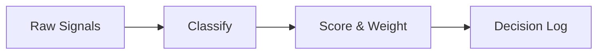

<!-- _class: title silent -->

`Finish · the sketch modifier`

# A boardroom deck, drawn by hand.

The `sketch` finish swaps Lattice into a hand-drawn skin — felt-tip headings, a legible hand-sans for body, and boxes that read as sketched. It is palette-blind, so any theme colours it; here it rides the `carta` paper-and-ink palette.

---

<!-- _class: content -->
<!-- _footer: "One class, every slide — class: sketch in front matter" -->

`How it works`

## Form, not colour.

Turn it on once with `class: sketch` in the front matter and it propagates to every slide. Every stroke is drawn in a palette token, so swapping `theme: carta` for `theme: indaco` recolours the whole sketch in blue without touching a layout.

---

<!-- _class: cards-grid three -->
<!-- _footer: "cards-grid — hand-drawn boxes with a per-card tilt" -->

`Why it reads as hand-made`

## Three moves do the work.

- Handwriting
  - Caveat carries the headings; Shantell Sans keeps body prose legible across a dense slide.
- Drawn boxes
  - An asymmetric corner radius plus an offset ink stroke turns each card into a sketched rectangle.
- A human tilt
  - Every other card rotates a fraction of a degree, so the grid reads placed-by-hand, not stamped.

---

<!-- _class: cards-stack -->
<!-- _footer: "cards-stack — the same finish on a stacked form" -->

`The finish travels`

## It is not tied to one layout.

- Palette-blind by contract
  - Every stroke resolves through `var(--token)`, so the finish inherits the active theme's hue.
- PDF-safe by design
  - Pure type and border geometry; no SVG filters, which collapse Marp's print scaling.
- Opt body back to clean
  - Add `sketch-clean-body` to keep the hand headings and boxes while prose stays crisp.

---

<!-- _class: verdict-grid -->
<!-- _footer: "Every card layout gets the drawn box — and the chips ride the hand too" -->

`One hand, every surface`

## Not just cards-grid.

- Build in-house
  - [x] Certified
  - [~] Residency
  - [ ] Export
  - Full control of every axis, and three engineer-quarters from having any of it.
- Vendor West
  - [x] Certified
  - [x] Residency
  - [x] Export
  - Certified, in-region, and self-serve on every axis. Recommended.

---

<!-- _class: piechart -->
<!-- _footer: "Charts — sketch reskins the heading and legend; the SVG marks stay clean" -->

`Charts under sketch`

## The frame is drawn; the data is exact.

Because the finish is CSS and fonts, it reskins the heading, the legend labels and their values — but a chart's SVG wedges keep their own precise geometry, so the numbers never wobble.

- Deck production `46%`
- Meetings about meetings `22%`
- Realigning on priorities `18%`
- Stakeholder management `9%`
- Actually deciding `5%`

---

<!-- _class: list-tabular -->
<!-- _footer: "Counters, column values and row labels all ride the --font-label seam" -->

`Nothing is left machine-faced`

## Every label wears the hand, not just the prose.

1. Counters
   - Row numbers and card badges, drawn not typeset
   - _font-label_
2. Column heads
   - Table headers matching the rows beneath
   - _font-label_
3. Chips
   - Status pills, redline tags, corner stamps
   - _pill-font_
4. Chart figures
   - Legend values and ticks, still column-aligned
   - _font-label_
5. Real code
   - Inline `code`, fenced blocks, math — mono on purpose
   - _font-mono_

---

<!-- _class: diagram -->
<!-- _footer: "Diagrams — mode: sketch bakes Mermaid's own hand-drawn renderer" -->

`Diagrams under sketch`

## The flowchart is drawn by the same hand.

---

<!-- _class: compare-table -->
<!-- _footer: "Tables get a drawn frame and ink rules — not just the cards" -->

`Beyond the cards`

## The grid is hand-ruled too.

| Surface       | Hand type | Drawn line     |
| ------------- | --------- | -------------- |
| Cards         | ✓         | box + tilt     |
| Tables        | ✓         | frame + rules  |
| Blockquotes   | ✓         | drawn box      |
| Bordered rows | ✓         | hand corners   |
| Photos & code | ✗         | left untouched |

_The finish roughens every line the deck draws itself — and stops at content it merely contains._

---

<!-- _class: actors -->
<!-- _footer: "actors — bordered rows take the hand corners, the per-actor hue stays" -->

`Rows, drawn`

## Each row is a sketched card.

- Owns the visual contract `Design Lead`
  - Holds `lattice.css` and signs off every token change before it ships.
- Keeps both renderers honest `Engine Owner`
  - Guards parity so the owned engine and the browser runtime never drift apart.
- Carries the editorial voice `Narrative Lead`
  - Edits every shipped deck so the prose reads aloud without a stumble.

---

<!-- _class: list -->
<!-- _footer: "list — bordered rows get the hand box, just like the cards" -->

`The list family, drawn`

## Each point sits in its own sketched box.

- The list layout's rows are bordered cards — so they take the hand box and the offset ink.
- Checklists ride a left spine; the spine stays its state colour, the corners go hand-drawn.
- An agenda's row rules ink up like a table's, instead of staying a printer's hairline.

---

<!-- _class: checklist -->
<!-- _footer: "checklist — the left spine keeps its state hue; corners go hand" -->

`Readiness, by hand`

## Go-live checklist for the sketch finish.

- [x] Tables, blockquotes, and rows take the drawn box
- [x] Display numerals and labels ride the hand face
- [x] Pagination, header, and footer go hand
- [-] Hand-drawn bullet marks, landing now
- [ ] Hand-drawn chart marks, deferred with the SVG work

---

<!-- _class: agenda -->
<!-- _footer: "agenda — the row rules ink up; the numerals take the hand" -->

`What the finish now covers`

## Every structure that draws its own line.

1. Cards and the card family — the drawn box with a per-card tilt
2. Tables and ledgers — a hand frame and inked rules
3. Blockquotes and bordered rows — hand corners, colours kept
4. Bullets, labels, and pagination — all on the hand face

---

<!-- _class: closing -->
<!-- _footer: "theme: carta · class: sketch" -->

`Finish · sketch`

## Sketched, but still boardroom.

Pair `sketch` with `carta` for paper-and-ink, or with any palette for the same hand on a different page.
