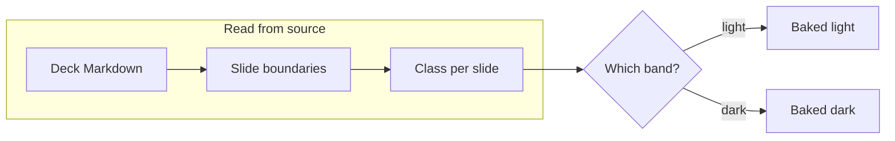
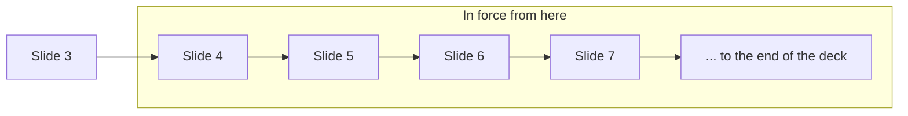
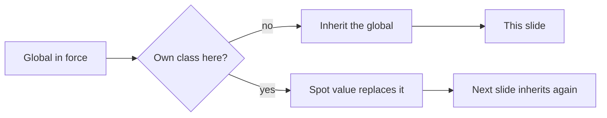
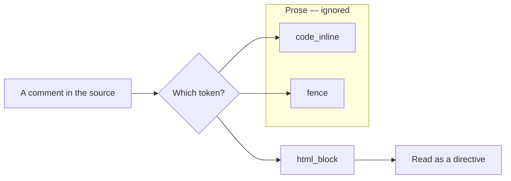
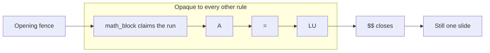

<!-- _class: title -->
<!-- _paginate: false -->

`Lattice · Fix deck`

# Which slide is this diagram on?

A Mermaid SVG bakes its colors before the page exists. Every diagram here proves the export read its own slide's class — the same class the section renders with.

---

<!-- _class: divider light -->

## What this deck shows.

A Mermaid SVG bakes its colors to literal hex before the page exists; the chip underneath stays live and per-section. So the export has to read each slide's class from raw Markdown — a second answer to a question the renderer already answers. It disagreed three ways, and every disagreement is silent: the diagram renders, just in the wrong scheme. Five diagrams follow. One must stay light; four must go dark.

---

<!-- _class: diagram -->
<!-- _footer: "Control · the deck default, no directive in force yet" -->

`No color token named`

## A slide that names no scheme takes the deck's.

---

<!-- class: diagram dark -->
<!-- _footer: "Form 1 · the GLOBAL class directive" -->

`class: diagram dark`

## A global directive applies from its own slide.

Marp has two class forms. The spot form, prefixed with an underscore, governs one slide; the bare form on this slide is a running global that applies from here to the end of the deck. Only the spot form used to be read, so a deck that switched canvas mid-way baked every later diagram for the canvas it had left.

---

<!-- _footer: "Form 2 · the global carries, with nothing declared here" -->

## And it carries forward to a slide that declares nothing.

This slide has no class directive of its own. It is dark because the global two slides back is still in force — which is exactly what makes it a *global*, and exactly the case a per-slide reader gets wrong.

---

<!-- _class: diagram dark -->
<!-- _footer: "Form 3 · a directive quoted as prose is prose" -->

`Quoted, not applied`

## A deck that documents its own syntax keeps its own layout.

- `<!-- _class: kpi -->` is how the docs name a layout, not a layout change.

A raw text scan cannot tell a quoted directive from a real one, and the last directive on a slide wins — so a slide explaining the API re-classed itself. Directives now come from the token stream, where inline code is inline code.

---

<!-- _class: diagram dark -->
<!-- _footer: "Form 4 · an equation is opaque, and starts no slide" -->

`$$ … $$`

## An equation does not invent a slide.

$$
A
=
LU
$$

The lone `=` line is a setext heading underline to a parser that cannot see the math block — and under `split: headings` a heading starts a slide. Every byte after the equation was attributed to a slide that never rendered.

---

<!-- _class: closing silent index -->

## See also.

- `engineering/mermaid.md` §5.3.1 — the source-side reconstruction, and why it keeps drifting
- `lib/core/boundary-parser.js` — one engine-configured parser for every off-render boundary caller
- `lib/core/comment-directive.js` — one `<!-- key: value -->` grammar, shared with the render pipeline
- `test/unit/core/slide-class-span-parity.test.js` — the whole committed corpus, rendered and compared
