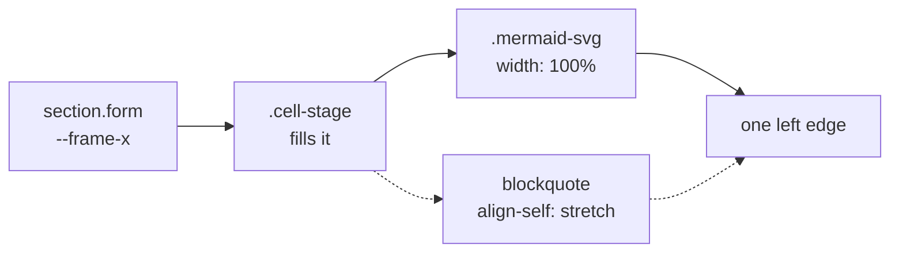

<!-- _class: title -->
<!-- _header: '' -->
<!-- _paginate: false -->

# One box, one inset

`Forms invariant · #1598`

Chart and diagram paid the frame inset twice. Every figure after this slide is 128px wider.

---

<!-- _class: compare-table -->
<!-- _footer: "The rule · compare-table" -->

## Six buckets, one rule, two that broke it.

| Bucket       | Body element  | Insets in the chain              | Body box | Painted content |
| ------------ | ------------- | -------------------------------- | -------- | --------------- |
| Prose        | `p`           | stage only                       | 64       | 64              |
| Code         | `pre`         | stage + the block's own padding   | 64       | 88              |
| Masthead     | band          | stage; `padding-bottom` only      | 64       | 64              |
| Footer       | band          | positional, no padding            | 30       | 30              |
| Diagram      | `.mermaid-svg`| stage **+ a width calc**          | 128      | 128             |
| Chart        | `.chart-body` | stage **+ a calc + padding**      | 128      | **192**         |

_Measured on a 1280×720 indaco render — distance in px from the slide edge, before the fix._

---

<!-- _class: quadrant -->
<!-- _footer: "Chart — the reclaimed inline axis · quadrant" -->

`Effort 0–10 → Reach 0–100`

## An SVG chart keeps its ink and gains its box.

The figure box goes 896 to 1024; the letterboxed drawing is height-bound, so the room around it changes, not the mark.

- Quick Wins
  - Weekly signal digest `2, 82`
  - Slack intake bot `3, 72`
- Strategic Bets
  - Scoring model v2 `8, 88`
  - Decision-log API `7, 74`
- Defer
  - Per-team weighting UI `2, 28`
  - Maturity self-assessment `1, 20`
- Time Sinks
  - Bespoke board exports `8, 18`
  - Custom calibration tooling `9, 26`

---

<!-- _class: progress -->
<!-- _footer: "Chart — an HTML body genuinely widens · progress" -->

`H1 2026 · Phase 1 readiness`

## An HTML-bodied chart spends the width on its bars.

- Signal Intake `92%` `on-track`
- Scoring policy `68%` `at-risk`
- Decision Log `81%` `on-track`
- Calibration cadence `34%` `deferred`
- Adoption `12%` `blocked`

---

<!-- _class: diagram -->
<!-- _footer: "Diagram — aligned with its own title · diagram" -->

`Architecture · The box chain`

## The diagram now starts where its title does.

`One inset, owned by the frame — not two`

> This panel always sat at the frame inset. The diagram sat 64px inside it — out of line with its own title.

---

<!-- _class: content -->
<!-- _footer: "What a body may still own · content" -->

`The second clause`

## A body owns padding only when it paints.

- Code earns it
  - Its `pre` paints a surface, and text must not touch a visible edge.
- The chart canvas earns it
  - The opt-in `canvas` glass panel now carries its own inset in the `.canvas` rule, where the surface actually exists.
- A bare chart does not
  - Nothing is painted under it, so nothing is owed. That was 64px per side on every chart, for a panel no committed deck draws.

_The gate tests this by measurement — a non-transparent background, a background image, or a real border — not by a class list._

---

<!-- _class: closing -->
<!-- _header: '' -->
<!-- _paginate: false -->

## The inset is one number, in one place.

`design/forms.md §6.1`

Two gates keep it there: a browser-free ratchet in `build:check`, and a measured assertion at three deck sizes.
