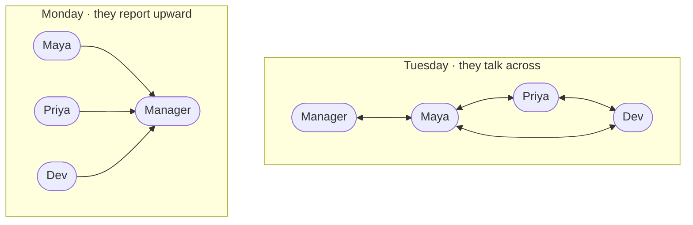
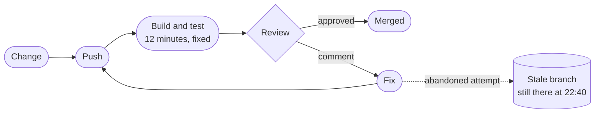
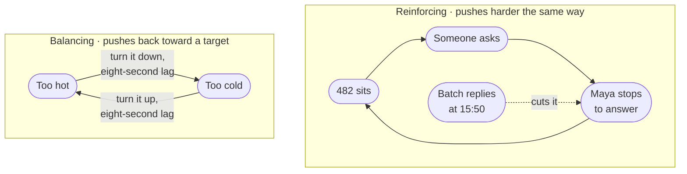

<!-- _class: title silent spectrum -->

# The Words for It

`Chapter 2 of 13 · Part one`

Ten ideas ran through Maya’s Tuesday. This chapter gives each one its name, and names the moment that taught it.

---

<!-- _class: agenda progress-2 -->

## Thirteen chapters, gathered into six movements.

1. A Tuesday — one engineer, wake to sleep
2. The words — naming what you just watched
3. Protagonist and antagonist — where a design starts
4. Solution types — which answer is wanted
5. Six kits — data, compute, network, scale, reliability, security
6. Two designs, then the map back — Instagram, a parking app, and what you keep

---

<!-- _class: content -->

`Where this sits`

## Chapter one is the day this chapter names.

Every word here points back at a timestamp in Maya’s Tuesday. You can read it cold, because each word is defined where it lands, but the definitions bite harder once you have watched the day they came from. Five words say what a system is made of. Three more are things you make rather than things you find. The last two, infrastructure and emergence, are the ones you only notice when they move.

---

<!-- _class: divider numbered -->

`Part one`

## Now we give each of those things its name.

---

<!-- _class: split-panel proof cat-1 -->
<!-- _header: "" -->

`Word one · system`

## A system is parts, connected, doing something together.

Maya's morning is one. The shower, the train, the laptop and the registry between them do what none of them does alone: put Maya at a desk, able to work, at nine.

- In Maya's day
  - Nothing on that list is a system. The order she does them in is.
- Listing the parts is easy
  - Shower, train, laptop, registry. Anyone can write that list.
- The connections are the system
  - Change what depends on what, and the behavior changes with the same parts.

---

<!-- _class: diagram compact -->

`09:15 · the same four people`

## Rewire a system without changing a single part, and it behaves differently.

> Nothing changed but who waits on whom. Monday settles nothing in twenty minutes; Tuesday saves a morning with one sentence.

---

<!-- _class: split-panel proof cat-2 -->
<!-- _header: "" -->

`Word two · purpose`

## A purpose becomes visible at the moment you miss it.

Maya wrote it on a sticky note at nine thirty: get 482 merged before four. At four o'clock it had not merged, and the gap between those two facts is the clearest thing in her whole day.

- In Maya's day
  - She wrote hers down at 09:30, which is why she could tell at 16:00 that she had missed it.
- Write it down or you will drift
  - An unwritten purpose gets quietly replaced by whatever arrived most recently.
- A system's purpose is what it does
  - Not what its owners say it does. Watch the outputs, not the mission statement.

---

<!-- _class: split-panel proof cat-3 -->
<!-- _header: "" -->

`Word three · boundary`

## The boundary is the line between what you change and what you ask for.

At ten fifteen another team asked Maya to fix a flaky test in their repository. She said no. That refusal is the boundary, and she could feel exactly where it was because saying no was uncomfortable.

- In Maya's day
  - She could decline the favor. She could not decline the release window.
- Inside is what you change
  - Your code, your schema, your deploys, the alerts that wake you.
- Outside is what you negotiate
  - The reviewer's time zone, the registry, the build, another team's repository.

---

<!-- _class: split-panel proof cat-4 -->
<!-- _header: "" -->

`Word four · environment`

## The environment is everything that arrives without asking.

A signal failure held her train for nine minutes. A page pulled her into an outage in a service she does not own. Neither was load, neither was a bug, and neither was hers.

- In Maya's day
  - She had no say over either. She did have a say over what happened to 482 while she was gone, and had not decided it in advance.
- It is not the same as load
  - Regulation, a partner's outage and a colleague's time off are environment too.
- You design for it, not against it
  - You cannot stop the page. You can decide what happens to 482 when it comes.

---

<!-- _class: split-panel proof cat-5 -->
<!-- _header: "" -->

`Word five · process`

## A process is a repeatable transformation, and it runs at a rate.

Push, wait twelve minutes for the build, read a comment, fix, push again. Maya ran that loop twice. Every process has inputs, a transformation, outputs, a rate, and something it leaves behind.

- In Maya's day
  - Twenty-four minutes of her day were spent waiting for a machine, and she chose none of them.
- The rate is part of the definition
  - "Run the tests" is not a process until you say twelve minutes, and how often.
- Leftover state is where bugs live
  - Her abandoned branch is the same shape as a half-applied database migration.

---

<!-- _class: diagram compact -->

`11:00 · the loop, drawn`

## Every process leaves something behind, and that is the part nobody draws.

> Nothing in this loop deletes the branch. That is why it is still there at 22:40.

---

<!-- _class: split-panel proof cat-6 -->
<!-- _header: "" -->

`Word six · model`

## A model leaves things out on purpose. What beats you is the thing you left out by accident.

Maya's plan for Tuesday was a model. It held the build time, the review, and the four o'clock window. It did not hold the fact that her reviewer sleeps six time zones away, and that one gap decided the day.

- In Maya's day
  - Her plan was right about everything in it and silent about the thing that beat her.
- Every diagram in this deck is a model
  - Each one throws away something true so you can see one thing clearly.
- Say what you left out
  - An omission you can name is a simplification. One you cannot name is a bug.

---

<!-- _class: split-panel proof cat-7 -->
<!-- _header: "" -->

`Word seven · constraint`

## A constraint is a limit that removes options rather than adding caveats.

Four limits shaped Maya's day, and each came from somewhere different. A twelve-minute build. A team of three. A reviewer asleep six time zones away. A rule about production data.

- In Maya's day
  - Physical, economic, human and legal limits, all four of them landing before ten in the morning.
- Real constraints carry numbers
  - "The build is slow" is a complaint. "Twelve minutes" is something you can design against.
- Some you chose, and can revisit
  - A team of three is a decision. The speed of the build is arithmetic.

---

<!-- _class: split-panel proof cat-8 -->
<!-- _header: "" -->

`Word eight · invariant`

## An invariant is a claim that stays true on the day everything else fails.

Main was deployable every minute of Maya's Tuesday. It was true while the registry was down, while she was paged, and at four o'clock when 482 did not land.

- In Maya's day
  - She missed her goal and broke no invariant, and those are two different kinds of bad day.
- Write them as sentences
  - "Main is always deployable." "A balance is never negative." Then name the alert.
- They constrain other people
  - A real invariant changes what your teammates are allowed to merge.

---

<!-- _class: diagram compact -->

`06:55 and 15:30 · two loops`

## Two loops look identical until you ask which way each one pushes.

> Find the sign before you touch anything. One loop needs damping, the other needs a brake.

*A balancing loop pushes back toward a target, and the eight-second delay in the pipe is exactly why she overshoots. A reinforcing loop pushes harder in the direction it is already going.*

---

<!-- _class: split-panel capstone cat-1 -->
<!-- _header: "" -->

`Word nine · infrastructure`

## Infrastructure is what you only notice on the day it stops.

Wifi, the VPN, the package registry, the build fleet, the identity provider. Maya used every one of them before nine o'clock and thought about none of them until 09:05, when the registry went down and three teams stopped.

- The test
  - If it vanishing stops several unrelated things at once, it is infrastructure.
- Boring is the requirement
  - It earns its place by being predictable, never by being interesting.
- It is someone else's system
  - Your infrastructure is another team's product, with its own boundary and invariants.

---

<!-- _class: content -->

`17:00 · the last word`

## Emergence is a pattern the parts fall into, that none of them contains.

Nothing merges on Thursdays. Maya checked six weeks. It is a rhythm, and nobody built a rhythm.

Four things feed each other rather than add up. Work that misses the window waits at the front of tomorrow. A review that comes back with comments sends the same change to the back of the queue. The queue is served one hour a day. And nobody ships into a weekend, so Thursday is the last window of the week — the day the backlog is deepest and the day it has to clear.

No policy names Thursday. You find it by watching the queue for six weeks.

---

<!-- _class: premise -->

## These five words name what a system is made of.

You did not learn these from a definition. You watched each one happen first, which is the order that sticks.

1. System
   - Parts, connected, with a purpose.
   - The whole morning.
2. Purpose
   - What it does, not what it says.
   - The gap at four o'clock.
3. Boundary
   - What you change, not ask for.
   - The favor she declined.
4. Environment
   - What arrives uninvited.
   - The page.
5. Process
   - A transformation with a rate.
   - Push, build, review.

---

<!-- _class: premise -->

## Three more are things you make, not things you find.

You never handle the system itself. You handle a drawing of it, its limits and its promises — standing on infrastructure you notice only when it stops.

1. Model
   - A simplification you chose.
   - Her plan for the day.
2. Constraint
   - A limit that removes options.
   - Twelve minutes.
3. Invariant
   - What must never go false.
   - Main is deployable.

---

<!-- _class: compare-table -->

`The translation`

## Every move in Maya's day has a name in software.

| In her Tuesday | In a system | What it decides |
| --- | --- | --- |
| Five pull requests, one reviewer | The bottleneck | Where any improvement has to land |
| Declining the fourth status ask | Admission control | Whether load sheds or the system collapses |
| A twelve-minute build | A fixed cost per attempt | How many attempts a day can hold |
| The abandoned branch | Leftover state | What a retry finds when it arrives |
| Nothing merges on Thursdays | Emergence | What no single owner can fix |

---

<!-- _class: content -->

`Your turn`

## Take the turnstile at a station and name its parts before you turn the page.

You already know how one works. Write down five things: its purpose, its boundary, one constraint, one invariant, and the infrastructure it stands on. Two minutes, on paper, and cover the next slide until you have them.

Do not hunt for a clever answer. The point is that you now have words for a thing you have walked past a thousand times without ever describing.

---

<!-- _class: list-tabular -->

`One answer`

## Here is a turnstile, in the words you now have.

1. Purpose
   - Let paying people through, stop everyone else. Counting riders is a side effect.
2. Boundary
   - The gate, its reader, the local rules. Not the fare service it asks.
3. Constraint
   - One person at a time, about a second each. That sizes the hall.
4. Invariant
   - Never open without a valid fare. Never close on a person.
5. Infrastructure
   - Power, the link to the fare service, the floor.

---

<!-- _class: closing silent spectrum -->

## You have the words. Now find the start.

`Chapter 2 of 13 · How to Think About Systems`

Chapter three casts every system as a protagonist who wants something and an antagonist standing in the way. Two sentences, ninety seconds, and four things you were guessing at settle.
