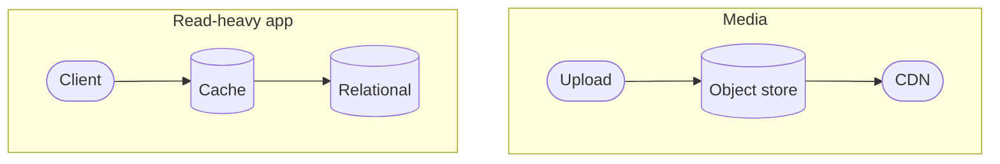
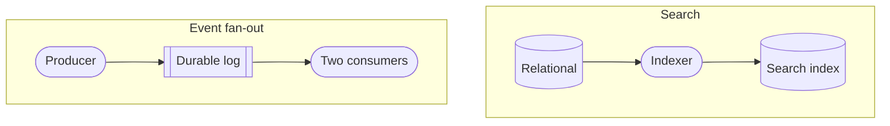
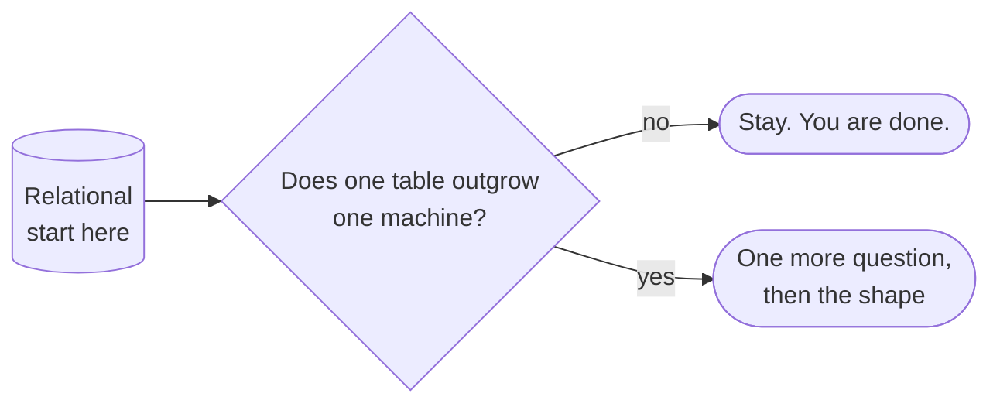
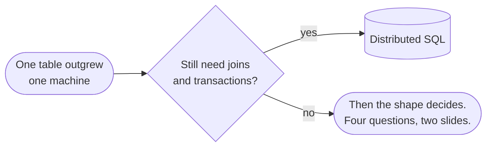
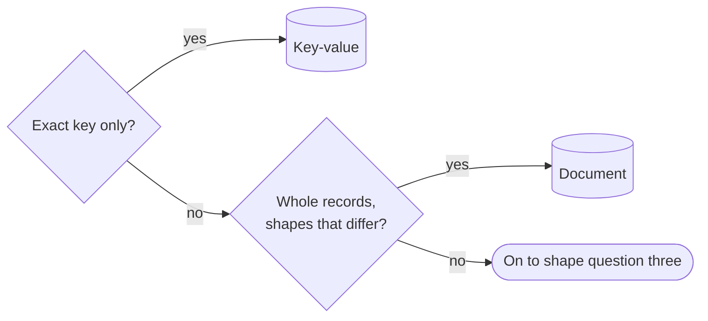
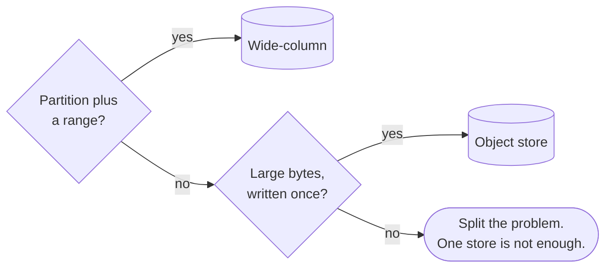
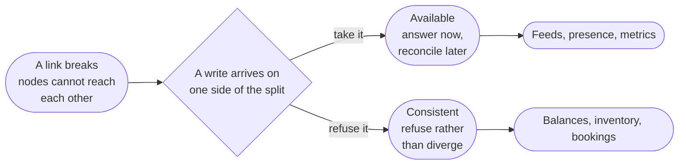
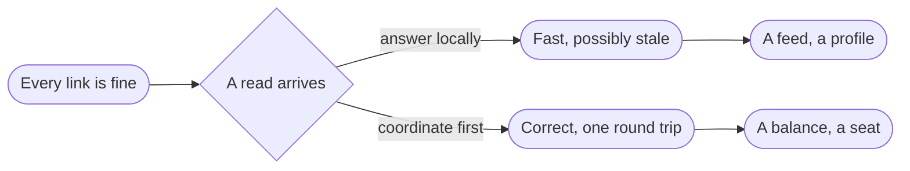
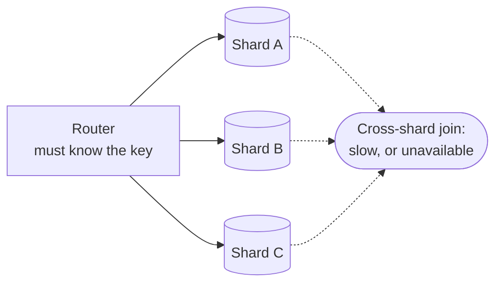

<!-- _class: title silent spectrum -->

# The Data Kit

`Chapter 5 of 13 · Part four`

Every storage choice is a bet about how you will read it later. Three passes pick the store, and the product name comes last.

---

<!-- _class: agenda progress-5 -->

## Thirteen chapters, gathered into six movements.

1. A Tuesday — one engineer, wake to sleep
2. The words — naming what you just watched
3. Protagonist and antagonist — where a design starts
4. Solution types — which answer is wanted
5. Six kits — data, compute, network, scale, reliability, security
6. Two designs, then the map back — Instagram, a parking app, and what you keep

---

<!-- _class: content -->

`Where this sits`

## This chapter opens the kit shelf, then works the first kit.

Its first three slides frame all six: every entry in every kit answers the same three questions, and every constraint in Maya’s Tuesday was somebody’s kit choice, made before she was hired. Then storage, which is where most designs are won or lost. Chapter four’s removal test runs here on the first diagram, and the five kit chapters after this one assume you have read those three questions.

---

<!-- _class: divider numbered -->

`Part four`

## Six kits hold sixteen things you can reach for, and the invariants behind all of them.

---

<!-- _class: content -->

`Why any of this matters`

## Every constraint in Maya's Tuesday was somebody's kit choice, made before she was hired.

The twelve-minute build is a compute choice. The registry that stopped three teams is an infrastructure choice. The deploy that stayed safe all day is a reliability choice that happened to work.

She made none of them and lived inside all of them. What follows is the menu those choices came from, and the price on each one.

---

<!-- _class: content -->

`How to read a kit`

## Every entry in every kit answers the same three questions.

One shape for every entry you choose between — a store, a runtime, a delivery tier, a quota — so you can hold two options side by side without re-reading a manual. Scale and reliability are mostly practices rather than choices, so those two kits run on diagrams, patterns and invariants instead. Every kit opens with a diagram and closes with its invariants.

The entries name concepts, not products. Products turn over every few years. The constraint that an append-only store puts on your reads does not.

---

<!-- _class: divider -->

`Data`

## Every storage choice is a bet about how you will read it later.

---

<!-- _class: diagram compact -->

`Data kit · serving`

## In two of the four, one store answers the question it was written for.

> A cache and a CDN are one idea at two distances: keep the answer nearer than its store.

*Run Part three's removal test on either shape: take the cache or the CDN out and the system still answers, slower and from further away. The store alone is a working design. A copy that exists to answer a different question — one you could not simply remove — starts on the next slide.*

---

<!-- _class: diagram compact -->

`Data kit · deriving`

## In the other two, a second copy exists so somebody can ask a different question.

> The moment you copy data to answer a new question, you own the lag between the copies.

---

<!-- _class: premise -->

## The product name is the last thing you decide about a store.

Answer these before anyone says a brand. Most database arguments are really a disagreement about question two.

1. Shape
   - How the data is structured.
   - Rows, documents, or edges?
2. Access
   - How it is read and written.
   - Lookups, ranges, or scans?
3. Consistency
   - What a reader may see.
   - Must it be the latest?
4. Scale
   - Size, throughput, growth.
   - Does it fit one machine?
5. Cost
   - Money, operations, skill.
   - Who runs it at 3am?

---

<!-- _class: content -->

`Data kit · the three passes`

## Those five questions do not all fire at once. The choice runs in three passes.

Pass one takes three of those five — shape, access, and whether it still fits one machine — and picks the store you start from. The next slide draws it as a tree, and for most systems it is the whole decision.

Pass two asks a sixth question the five do not cover: do you need a capability no shape provides? There are six of those, and one can delete a whole tier.

Pass three runs only when two candidates both fit, and settles it on how each behaves at 3am rather than on what it stores.

Consistency is not a pass. You carry it into all three.

---

<!-- _class: diagram compact -->

`Data kit · pass one, the first question`

## Start at relational, and the first question sends most systems home.

> Most systems answer no here. If you are not sure which you are, you are a no.

---

<!-- _class: diagram compact -->

`Data kit · pass one, keeping the joins`

## If you outgrew one machine, the next question is whether you still need joins.

> An engine that partitions itself is the cheapest way to keep what relational gave you.

---

<!-- _class: diagram compact -->

`Data kit · pass one, shape questions one and two`

## The first two shape questions ask whether a lookup is enough.

> Both of these give up the join to buy a lookup that stays cheap however much you store.

---

<!-- _class: diagram compact -->

`Data kit · pass one, shape questions three and four`

## The last two ask whether you are spreading rows or keeping bytes.

> Reaching the last box is not failure. It is what a system with two jobs looks like.

---

<!-- _class: content -->

`Your turn`

## Three teams want a new store. Say which of them has actually outgrown relational.

One: a payroll system, four thousand employees, thirty tables, and finance asks a new question every quarter. Two: a metrics pipeline writing four hundred thousand samples a second, read back by series and by time range. Three: a startup with nine thousand users whose engineer says the database will not scale.

Answer the tree's first question for each, and say whether the tree stops there. Then turn the page.

---

<!-- _class: list-tabular -->

`One answer`

## For two of the three, the first question is the whole answer.

1. Payroll, four thousand employees
   - No. Thirty tables and questions nobody has asked yet are the case relational was built for, and four thousand rows is not a size. The tree stops here.
2. Four hundred thousand samples a second
   - Yes. No single machine takes four hundred thousand writes a second, so the tree walks on — joins next, then the shape questions decide the store.
3. Nine thousand users
   - No, so it stops here too. "Will not scale" is not a measurement — the tree wants a table that outgrew a machine, and you have brought it a feeling.

---

<!-- _class: cards-stack -->

`Data kit · relational`

## A relational store is the default until you can name why it is not.

- Reach for it when
  - Entities relate, writes touch several at once, and the questions will keep changing.
- Walk away when
  - One table outgrows one machine's writes, or the schema genuinely differs per row.
- The constraint you inherit
  - Joins and transactions need a coordinator. Self-sharding loses both; a distributed engine charges a round trip.

---

<!-- _class: cards-stack -->

`Data kit · distributed SQL`

## An engine that partitions itself saves you from sharding by hand.

- Reach for it when
  - One table outgrew one machine and you still want joins, transactions and a schema.
- Walk away when
  - Every query is a single exact key, or the budget cannot carry cross-partition coordination.
- The constraint you inherit
  - A transaction across partitions pays a round trip, so related rows still belong together.

---

<!-- _class: cards-stack -->

`Data kit · key-value`

## A key-value store is a hash map with an operations team.

- Reach for it when
  - You always know the exact key, and handing the value back is the store's only job.
- Walk away when
  - You need to ask any question at all about what is inside the value.
- The constraint you inherit
  - There is no second way in. Every new query means a new key you write and maintain yourself.

---

<!-- _class: cards-stack -->

`Data kit · document`

## Choosing a document store means choosing to keep one object whole.

- Reach for it when
  - A read fetches one self-contained object, and the shape varies between records.
- Walk away when
  - The same fact lives in many documents and has to stay consistent across them.
- The constraint you inherit
  - Denormalized copies. Every update to a shared fact becomes a fan-out — one write you now owe to many places.

---

<!-- _class: cards-stack -->

`Data kit · wide-column`

## A wide-column store buys enormous write throughput and freezes your queries.

- Reach for it when
  - Writes are relentless, and every read is a partition key plus a sorted range.
- Walk away when
  - Query patterns are still moving, or you need a transaction across partitions.
- The constraint you inherit
  - The primary key is the schema. Changing how you query means rewriting the data.

---

<!-- _class: cards-stack -->

`Data kit · object store`

## An object store is the cheapest home for a write-once file.

- Reach for it when
  - Items are large, written once, fetched by key, and must survive for a decade.
- Walk away when
  - You need to modify part of an object, or to list and filter by what is inside it.
- The constraint you inherit
  - Listing is slow and expensive. The index of what you stored belongs somewhere else.

---

<!-- _class: compare-table -->

`Data kit · pass two`

## A capability usually adds a store beside the source. Live push and retention replace the one you started from.

| Capability | The question it answers | Where it lives |
| --- | --- | --- |
| Similarity | What is closest in meaning to this? | A vector index |
| Ranked text | Which document best matches these words? | A search index |
| Proximity | What is within two kilometers? | A geospatial index |
| Live push | What changed, the moment it changed? | A store that streams |
| Retention | What did this metric do all month? | A time-series store |
| Unbounded traversal | Who is reachable from here, however many hops? | A graph store |

---

<!-- _class: cards-stack -->

`Data kit · graph`

## A graph store is for questions that traverse, not questions that filter.

- Reach for it when
  - The query walks relationships of unknown depth: reachability, paths, recommendations.
- Walk away when
  - You have relationships but only ever join two hops. A relational store does that faster.
- The constraint you inherit
  - Traversals resist partitioning, so scaling out is genuinely harder here than anywhere else.

---

<!-- _class: content -->

`Halfway`

## Two of the stores on that list look derived, and both are where truth lands.

Nothing regenerates a photograph or last Tuesday's CPU samples, so an object store and a time-series store are where those facts first arrive. They are sources of truth wearing the clothes of a derived tier.

The genuinely derived stores are the search index, the vector index, the cache and the warehouse. Anything derived must be rebuildable, must be allowed to lag, and must never be the only copy.

---

<!-- _class: cards-stack -->

`Data kit · cache`

## A cache converts a correctness problem into a timing problem.

- Reach for it when
  - Reads repeat, the source is expensive, and slightly stale is genuinely acceptable.
- Walk away when
  - Staleness is unsafe, or the working set is larger than the cache will ever be.
- The constraint you inherit
  - Invalidation. You now own a second copy whose wrongness is measured in seconds.

---

<!-- _class: cards-stack -->

`Data kit · durable log`

## A durable log turns "do it now" into "do it reliably, soon."

- Reach for it when
  - Producers outpace consumers, or several systems need to see the same events.
- Walk away when
  - The caller needs the result inside the same request.
- The constraint you inherit
  - At-least-once delivery. Every consumer must be idempotent or you will charge somebody twice.

---

<!-- _class: compare-table -->

`Data kit · the scan`

## Four columns settle most arguments about stores.

| Store | Access | Consistency | Scales by | Weak at |
| --- | --- | --- | --- | --- |
| Relational | Key, range, join | Strong on the leader | Replicas, then partitioning | Cross-shard writes |
| Distributed SQL | Key, range, join | Strong across partitions | Horizontal | Cross-partition transactions |
| Key-value | Exact key | Engine-specific | Horizontal | Rich queries |
| Document | Key, secondary index | Engine-specific | Horizontal | Facts split across documents |
| Wide-column | Partition plus range | Tunable | Horizontal | New query patterns |
| Object store | Exact key | Read-after-write, overwrites included | Effectively unbounded | Listing, and changing part of an object |

---

<!-- _class: compare-table -->

`Data kit · pass three`

## When two stores both fit, what settles it is how each one behaves on a bad night.

| Ask | Why it settles the tie |
| --- | --- |
| Who carries the pager? | A managed service, or your own team at 3am |
| What does a lost node cost? | Some engines lose capacity, some lose writes in flight |
| How does the bill grow? | Per gigabyte, per request, or per machine-hour |
| How does data get out? | A dump, a change stream, or nothing at all |
| How long is a restore? | Backups are easy. The restore is the number |
| Who already runs one here? | A store your team knows beats a better one nobody has run |

---

<!-- _class: cards-stack -->

`Data kit · replicas`

## A replica serves reads and always lags the copy it follows.

- Reach for it when
  - Reads outgrow one machine, and a few seconds behind is safe for most of them.
- Walk away when
  - A reader must see their own write, or you hoped the copy would take writes too.
- The constraint you inherit
  - Lag, and promotion. A reader sees a past you have left, and a promoted replica loses whatever never reached it.

---

<!-- _class: diagram compact -->

`Data kit · under a partition`

## When a link breaks, you pick. There is no third answer.

> This is CAP, and it only applies while the link is broken. That is rarer than people think.

---

<!-- _class: diagram compact -->

`Data kit · the rest of the time`

## The bill you actually pay is the one that arrives when nothing is broken.

> CAP asks a different question. This is the one you answer on every read, for years between outages.

---

<!-- _class: list-tabular -->

`Data kit · consistency`

## Consistency is not one thing, and most arguments are about which kind you meant.

1. Linearizable
   - Every read sees the latest write. Costs a coordination round trip, every time.
2. Read your writes
   - You always see your own edits. Anyone who has just typed something expects at least this.
3. Eventual
   - Replicas agree in the end. Cheapest, and correct for feeds, counters and presence.

---

<!-- _class: compare-prose axis -->

`Data kit · two philosophies`

## ACID and BASE answer different questions.

Ask whether coordinating now costs less than reconciling later.

1. ACID
   - Coordinate first, so the data is never observably wrong. You pay in latency and in how far you can partition.
2. BASE
   - Diverge now, converge later. You pay in application code, because every reader must tolerate stale state.

---

<!-- _class: content -->

`Your turn`

## A link between two regions breaks for ninety seconds. Say what each write does.

One: a like on a post. Two: the last seat on a flight. Three: "you are now following this account", shown back to the person who just tapped it.

For each, say whether you take the write or refuse it while the link is down, and which level of consistency it needs the rest of the time. Then turn the page.

---

<!-- _class: list-tabular -->

`One answer`

## Only the seat refuses, for ninety seconds — then pays a round trip on every read for years.

1. A like
   - Take it. Eventual is correct: two replicas disagreeing about a count for a second costs nothing, and refusing costs you a user.
2. The last seat
   - Refuse it. Two sides both selling 14C is the divergence CAP is about, and the price the rest of the time is linearizable — a round trip on every read.
3. Your own follow
   - Take it, and read your writes. The person who just tapped will look immediately; nobody else notices for a second.

---

<!-- _class: split-panel proof cat-1 -->
<!-- _header: "" -->

`Data kit · indexes`

## An index is a second copy of your data, sorted for exactly one question.

Indexes make reads fast by making writes slower and storage larger. Each one is a promise to maintain a sorted structure on every single insert, update and delete, forever.

- The tell
  - You can name the exact query each index exists to serve, out loud, right now.
- The bill arrives on writes
  - Five indexes mean five extra structures touched on every insert.
- How many rows it removes, not how many values it has
  - An index earns its keep by how rare a match is. Three evenly spread values narrow nothing; three where one is rare narrow almost everything.

---

<!-- _class: diagram compact -->

`Data kit · partitioning`

## Sharding buys throughput by giving up the questions that cross shards.

> The dotted line is the query you will want in a year and cannot have.

---

<!-- _class: cards-grid three -->

`Data kit · the shard key`

## The shard key is the decision you cannot undo cheaply.

- By hash of the key
  - Spreads load evenly and destroys range queries. The safe default.
- By range
  - Keeps ranges fast and invites a hot spot on the newest range.
- By tenant or region
  - Matches both the access pattern and the law, until one tenant grows enormous.

> Name the query that will cross shards. If you cannot, you chose a hash, not a key.

---

<!-- _class: cards-stack -->

`Data kit · ordering and identity`

## Two machines never agree on the time, so never let a clock alone decide an order.

- Reach for it when
  - Anything is sorted, paged or deduplicated. A sortable id carries time and writer in one value.
- Walk away when
  - One writer owns the sequence and a unique id breaks the ties. Then a clock is enough.
- The constraint you inherit
  - An id you sort by can never change, and every page cursor comes to depend on it.

---

<!-- _class: list-steps -->

`Data kit · changing a schema`

## Changing a column on a running system takes five steps, not one.

1. Expand
   - Add the field. Nothing writes it, nothing reads it, both versions still work.
2. Write both
   - New code fills it alongside the old one. Nothing reads it, so mistakes are cheap.
3. Backfill
   - Fill rows written before step two, in restartable batches.
4. Cutover
   - Move reads across. Both are still written, so going back costs nothing.
5. Contract
   - Stop writing the old field, then drop it.

---

<!-- _class: content -->

`Data kit · why those five steps`

## A deploy is never atomic, so every change must tolerate the version beside it.

For the minutes or hours a rollout takes, two versions of your code run against one store. Both have to work. That is the entire reason for the five steps: each one is safe while the step before it is still live, which is exactly what a rollout cannot promise you about any bigger jump.

The same rule governs an API other people call. Add fields, never repurpose them. Make anything new optional. Remove nothing until you can show that nobody calls it — and if you cannot show that, you have not earned the right to remove it.

---

<!-- _class: cards-grid four -->

`Data kit · deleting for real`

## A delete is a fan-out that reaches every copy you ever made.

- The row itself
  - A tombstone, not a gap. Replicas have to learn the row is gone.
- Every derived copy
  - Caches, feeds, search indexes, aggregates. Each holds its own copy and each needs telling.
- The backups
  - You cannot rewrite a backup. Set a retention window and let the copy expire instead.
- The bytes at the edge
  - A CDN serves what it cached. Purging is eventual, so signed URLs need short lives.

> Design the delete when you design the write. Retrofitting one across six stores is a quarter of somebody's year.

---

<!-- _class: list-criteria -->

`Data kit · the invariants`

## Four sentences hold, or the data design is not one you can defend.

1. One source of truth per fact
   - Every other copy is derived and says so.
2. Every derived copy rebuilds — and deletes
   - Unattended from the source, and gone from all of them on request.
3. Every queue consumer is idempotent
   - At-least-once is the only delivery you get.
4. Every write path states its consistency
   - "Whatever the database does" is not a level.

---

<!-- _class: content -->

`Your turn`

## Pick a store for each of these, and name the query that will hurt.

One: a table of orders, ten thousand a day, where support answers questions nobody has asked yet. Two: a session token, looked up on every request and never scanned. Three: eight years of sensor readings, written once, read by device and by day.

Write the store and the one query that will cross a partition. Then turn the page.

---

<!-- _class: list-tabular -->

`One answer`

## One of these never leaves relational. The other two were never relational to begin with.

1. Ten thousand orders a day
   - Relational, for years. Ten thousand a day is nothing, and the unasked questions are the requirement. Nothing crosses a partition, because nothing is partitioned.
2. A session token
   - Key-value. Exact key, no scan, expiry built in. The query that hurts is "which sessions belong to this user".
3. Eight years of readings
   - Wide-column by device and time — or a time-series store, which is that shape with retention built in. The query that hurts is one day across every device.

---

<!-- _class: closing silent spectrum -->

## Every derived copy here rebuilds unattended.

`Chapter 5 of 13 · How to Think About Systems`

Something has to run the rebuild, and chapter six is that something: four compute shapes, three runtimes, and the four properties anything you run must satisfy before it meets real traffic.
