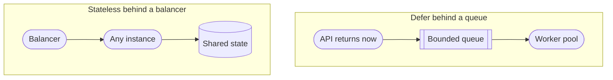
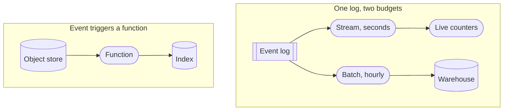

<!-- _class: title silent spectrum -->

# The Compute Kit

`Chapter 6 of 13 · Part four`

Choosing compute is choosing how much of the machine you still own. Statelessness is what makes a machine replaceable.

---

<!-- _class: agenda progress-5 -->

## Thirteen chapters, gathered into six groups.

1. A Tuesday — one engineer, wake to sleep
2. The words — naming what you just watched
3. Protagonist and antagonist — where a design starts
4. Solution types — which answer is wanted
5. Six kits — data, compute, network, scale, reliability, security
6. Two designs, then the map back — Instagram, a parking app, and what you keep

---

<!-- _class: content -->

`Where this sits`

## The data kit left a promise for this chapter to keep.

Every derived copy in chapter five — the index, the cache, the replica, the search store — rebuilds unattended. This chapter is what runs the rebuild. It assumes the three questions each kit entry answers, set out at the start of chapter five: what it is, when to reach for it, what it costs. Two of the four shapes decide whether the caller waits; the other two start from something that happened.

---

<!-- _class: divider -->

`Compute`

## Choosing compute is choosing how much of the machine you still own.

---

<!-- _class: diagram compact -->

`Compute kit · somebody is waiting`

## Two of the four shapes decide whether the caller waits for the work.

> The balancer needs every instance to be interchangeable. The queue needs every worker to be repeatable.

*The data kit closed owing two things it could not supply itself. A derived copy that rebuilds unattended needs something to run the rebuild, and an idempotent consumer needs something to be a consumer. Both are on this slide: the bounded queue and the worker pool that kit kept assuming.*

---

<!-- _class: diagram compact -->

`Compute kit · nobody is waiting`

## The other two start from something that happened, not somebody who asked.

> Nobody is on the phone, so the only deadline is one you promised somewhere else.

---

<!-- _class: cards-stack -->

`Compute kit · virtual machines`

## A virtual machine is what you reach for when the process outlives the request.

- Reach for it when
  - The workload runs continuously, holds state in memory, or needs unusual kernel settings.
- Walk away when
  - Traffic is spiky and idle machines start to dominate the bill.
- The constraint you inherit
  - Patching, capacity planning, and the gap between staging and production are now yours.

---

<!-- _class: cards-stack -->

`Compute kit · containers`

## A container makes the deployable unit identical everywhere it runs.

- Reach for it when
  - You run many services, deploy often, and want one packaging story across all of them.
- Walk away when
  - You run one small service. The scheduler that places containers on machines costs more than it saves at that size.
- The constraint you inherit
  - The orchestrator is now infrastructure, with its own failure modes and its own pager.

---

<!-- _class: cards-stack -->

`Compute kit · functions`

## A function is compute you rent by the millisecond, so idle costs you nothing.

- Reach for it when
  - Traffic is spiky or rare, the work is short, and per-request isolation is welcome.
- Walk away when
  - Runs are long, or steady traffic makes per-request pricing more expensive than a machine.
- The constraint you inherit
  - Cold starts, unless you pay to keep instances warm — which is paying for idle again.

---

<!-- _class: compare-prose -->

`Compute kit · the property`

## Statelessness is what makes a machine replaceable.

- A stateful instance
  - It holds something no other instance has: a session, a lock, a warm cache, an open connection. Scaling means moving that state, and a crash means losing it.
- A stateless instance
  - Any instance serves any request because the state lives somewhere else. Scaling is arithmetic and failure is a routing change.

---

<!-- _class: list-criteria -->

`Compute kit · the invariants`

## Anything you run should satisfy all four before it meets real traffic.

1. Any instance can be killed without a customer noticing
   - If that is false, you have state you have not named yet.
2. Deployments are reversible
   - A rollback is a routine operation, not an incident response.
3. Capacity is a number somebody owns
   - Not "it autoscales" — a ceiling, a cost, an owner. Maya's build had none of the three.
4. Startup does not depend on startup order
   - Services retry into each other instead of requiring a sequence.

---

<!-- _class: content -->

`Your turn`

## Three workloads land on your desk. Say what each one runs on.

One: a nightly job that reads the whole orders table and writes one report file — forty minutes, once a day. Two: an API taking three thousand requests a second, deployed six times a day by four teams. Three: a thumbnail made whenever somebody uploads a photo — a few hundred a day, at no fixed time.

Name what each should run on, and the invariant it fails first if you get it wrong. Then turn the page.

---

<!-- _class: list-tabular -->

`One answer`

## Idle decides the last one. Neither of the first two is a cost argument.

1. The nightly report
   - A machine or a container on a schedule; what it is not is a function. Forty minutes outlives most function runtime caps, and one long run is not spiky. The invariant it fails first: capacity is a number somebody owns.
2. Three thousand a second, six deploys a day
   - Containers behind a balancer — many teams, frequent deploys, one packaging story. It fails "any instance can be killed" the moment somebody keeps a session in memory.
3. A few hundred thumbnails
   - A function on the upload event. Idle is most of the day and costs nothing, and the cold start it charges for is one nobody is waiting on. The invariant it fails first: startup does not depend on startup order — the event fires whenever it fires, so a function that assumes its index is already up breaks at 3am.

---

<!-- _class: closing silent spectrum -->

## Your code runs somewhere now.

`Chapter 6 of 13 · How to Think About Systems`

Chapter seven is the trip to it. Distance is the one cost you cannot optimize away, and most latency arguments end the moment somebody says the actual numbers.
