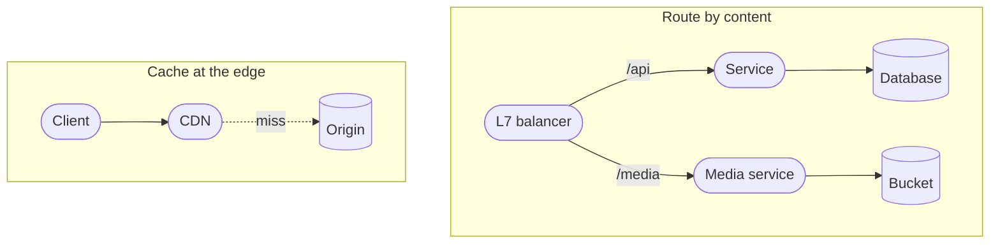
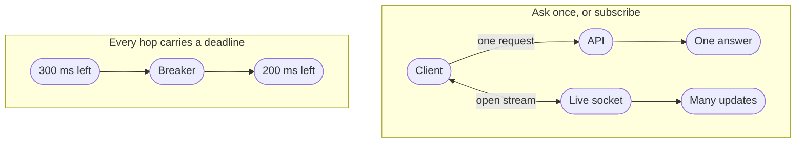
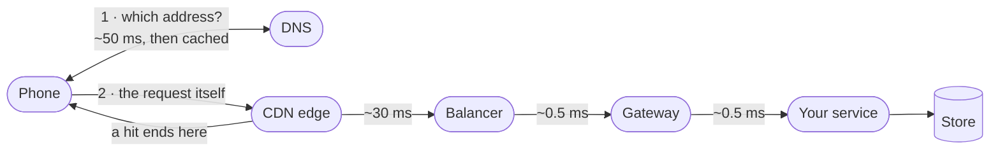

<!-- _class: title silent spectrum -->

# The Network Kit

`Chapter 7 of 13 · Part four`

Light in fiber covers about 200 kilometers per millisecond. That number decides more designs than any framework choice.

---

<!-- _class: agenda progress-5 -->

## Thirteen chapters, gathered into six groups.

1. A Tuesday — one engineer, wake to sleep
2. The words — naming what you just watched
3. Protagonist and antagonist — where a design starts
4. Solution types — which answer is wanted
5. Six kits — data, compute, network, scale, reliability, security
6. Two designs, then the map back — Instagram, a parking app, and what you keep

---

<!-- _class: content -->

`Where this sits`

## Chapter six put your code on a machine. This is the trip to it.

A tap crosses several hops before your code sees it, and each hop spends budget. This chapter assumes the runtimes from chapter six and the three questions from chapter five. It closes on what a call leaving your process owes you, starting with a timeout, because a request with no timeout is a resource leak waiting for a bad afternoon.

---

<!-- _class: divider -->

`Network`

## Distance is the one cost you cannot optimize away.

---

<!-- _class: diagram compact -->

`Network kit · before your code`

## Two of the four patterns decide how far a request travels before your code sees it.

> One of them ends the trip early. The other decides where the rest of it goes.

*Two of the compute kit's invariants quietly assumed a wire. An instance is only killable unnoticed because something in front of it reroutes, and services only retry into each other across a call that can fail. Here is that wire, and its first bill is distance.*

---

<!-- _class: diagram compact -->

`Network kit · after your code`

## The other two set what the conversation costs once it arrives.

> A deadline is a budget you spend down. A stream is a budget you keep paying.

---

<!-- _class: diagram compact -->

`Network kit · the request path`

## A tap crosses several hops before your code sees it, and each one spends budget.

> Eighty of those milliseconds are spent before your code runs, and none of them are yours.

---

<!-- _class: list-tabular metric -->

`Network kit · the numbers`

## Most latency arguments end the moment somebody says the actual numbers.

1. Memory read
   - 100 ns
2. Read from an SSD
   - 100 us
3. Datacenter hop
   - 0.5 ms
4. Seek on a spinning disk
   - 10 ms
5. Cross-continent round trip
   - 150 ms

---

<!-- _class: content -->

`Why that number is final`

## Light in fiber covers about 200 kilometers per millisecond.

Nothing changes that. The measured 150 milliseconds is well above the straight-line floor, because packets do not travel in straight lines and every hop queues.

A design that needs three sequential intercontinental round trips has spent nearly half a second on distance alone, whatever else it does in between. Replication, caching and edge delivery all exist to buy that distance back, and none of them makes it free.

---

<!-- _class: cards-stack -->

`Network kit · the CDN`

## A CDN moves bytes closer to readers, and ends the connection there too.

- Reach for it when
  - The content is large, popular, and identical for many people.
- Walk away when
  - Nothing is shared and nothing is far. A personal response still wins the handshake back.
- The constraint you inherit
  - A second copy with its own staleness. Version immutable URLs; purge the rest, and time the purge.

---

<!-- _class: split-panel proof cat-2 -->
<!-- _header: "" -->

`Network kit · timeouts`

## A request with no timeout is a resource leak waiting for a bad afternoon.

Every waiting request holds a connection, a thread and some memory. Under a slow dependency, unbounded waits turn one struggling service into a queue of stuck callers — which is the shape of the page that pulled Maya in at twenty to eleven.

- What good looks like
  - Every outbound call has a deadline, and the deadline shrinks as it propagates.
- Retries need a budget
  - Retrying without a cap turns a brief failure into a flood you built yourself.
- Backoff must be random
  - Synchronized retries arrive together and rebuild the spike you just survived.

---

<!-- _class: list-criteria -->

`Network kit · the invariants`

## A call that leaves your process owes you four things.

1. Every remote call has a deadline
   - Inherited from the caller, and always shorter than the caller's own.
2. Every retry has a budget and jitter
   - Bounded attempts, randomized delays, and a breaker when the target is down.
3. Every write is idempotent or keyed
   - The network will deliver your request twice. Decide now what that means.
4. Distance appears in the design
   - Counted on purpose, not discovered in production. Nobody counted Maya's reviewer, six time zones away.

---

<!-- _class: content -->

`Your turn`

## A reader in Frankfurt opens a page served from Virginia. Say where the budget goes.

The page has 400 milliseconds. Loading it costs three sequential cross-continent round trips — the page itself, then an API call it depends on, then an image nothing knew about until the first two came back — plus about 60 milliseconds of work inside your own datacenter.

Add it up, name the one change that buys back the most, and say what that change costs. Then turn the page.

---

<!-- _class: list-tabular -->

`One answer`

## Distance is almost all of that page, and only one move touches it.

1. The bill
   - `3 × 150` is 450 milliseconds of round trips, and about 60 more of your own work in between them. The budget was 400, so the page is late by more than the work takes.
2. The move
   - End the connection near the reader. A CDN serves the page and the image from the edge; the API call is the one that still has to cross. Three round trips become one.
3. What it costs
   - You now keep the page in two places, and the edge copy is only as fresh as your last purge. The distance did not go away; you stopped paying it three times.

---

<!-- _class: closing silent spectrum -->

## Distance is priced.

`Chapter 7 of 13 · How to Think About Systems`

Chapter eight is what happens when there is more of everything. The cache and the replica come back there — not as places data lives, but as moves you make when load grows.
