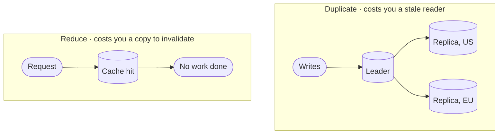
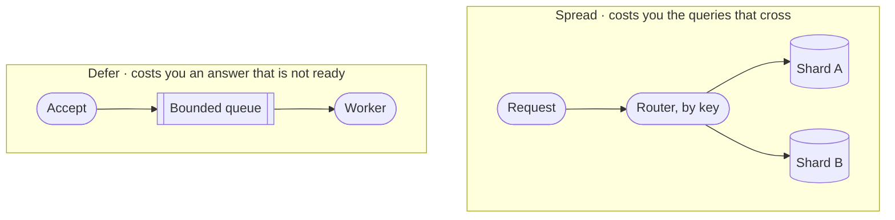

<!-- _class: title silent spectrum -->

# The Scale Kit

`Chapter 8 of 13 · Part four`

Every scaling change is one of four moves. Little’s law sizes the pool before anyone has to guess.

---

<!-- _class: agenda progress-5 -->

## Thirteen chapters, gathered into six movements.

1. A Tuesday — one engineer, wake to sleep
2. The words — naming what you just watched
3. Protagonist and antagonist — where a design starts
4. Solution types — which answer is wanted
5. Six kits — data, compute, network, scale, reliability, security
6. Two designs, then the map back — Instagram, a parking app, and what you keep

---

<!-- _class: content -->

`Where this sits`

## The cache and the replica return here as moves, not stores.

Chapter five introduced them as places data lives. This chapter uses them as things you do when load grows: add a copy of something you already had, or move the work — to later, or to somewhere else. It assumes the data kit’s copies and the network kit’s latency budget. The average request is a fiction, and your users live in the tail.

---

<!-- _class: divider -->

`Scale`

## Every scaling change is one of four moves.

---

<!-- _class: diagram compact -->

`Scale kit · adding a copy`

## The first two moves both add a copy of something you already had.

> Both bills arrive in the same currency: something you are reading is now out of date.

*You have met both of these already, as stores. The cache was a data choice and the replica was a consistency choice; here they are again as scaling moves. The network kit is why: once distance is counted on purpose, the only way to spend less of it is to keep a copy nearer — and the bill is the one the data kit already named.*

---

<!-- _class: diagram compact -->

`Scale kit · moving the work`

## The other two move the work instead — to later, or to somewhere else.

> Both bills arrive as an answer you cannot have right now: not yet, or not from here.

---

<!-- _class: math -->

`Scale kit · the one formula`

## Little's law ties concurrency, throughput and latency together.

$$ L = \lambda W $$

- $L$ — requests in flight at once
- $\lambda$ — arrivals per second
- $W$ — time each one spends inside

---

<!-- _class: content -->

`Using it`

## The formula sizes your thread pool before anyone guesses.

At 2,000 requests per second averaging 50 milliseconds each, 100 requests are in flight at any moment. That is your minimum concurrency, and no tuning makes it smaller while the other two numbers hold.

Maya's Tuesday is the same arithmetic at human scale. Two builds a day at twelve minutes each leave the build fleet idle almost all day — which tells you it has spare capacity and nothing else. Low utilization never means off the critical path. The reviewer was her bottleneck because he was serial, had five pull requests queued in front of him, and was awake for one of the hours that mattered.

---

<!-- _class: content -->

`When it goes wrong`

## Tripled latency breaks a bounded pool and an unbounded one in opposite directions.

Leave the pool unbounded and the arithmetic runs forward: latency triples, so the requests in flight triple with it, and a machine sized for the good day runs out of memory.

Bound it at 100 and concurrency cannot rise, so throughput falls instead. `100/0.15s` is about 667 a second against the 2,000 still arriving, and the queue in front grows without limit until something sheds it.

Neither is a tuning problem. The first is why pools have ceilings, and the second is why every queue behind one needs a ceiling too.

---

<!-- _class: split-panel proof cat-3 -->
<!-- _header: "" -->

`Scale kit · tail latency`

## The average request is a fiction, and your users live in the tail.

A page that makes 100 parallel calls waits for the slowest one. Give each call a one-percent chance of being slow. Then 63 percent of pages hit at least one slow call. That is `1 - 0.99^100`, and you can redo it on a napkin.

- The check
  - A percentile describes requests. A person makes dozens a day, so far more than one percent of people meet your p99. Report the 99th per dependency, and keep the average for capacity only.
- Fan-out amplifies it
  - More parallel calls turn a rare slow response into a common slow page.
- Hedging buys it back, on a budget
  - Send a duplicate after the 95th percentile and take whichever answers first. A hedge is a second request, so cap it — a few percent of traffic. Unbudgeted, it is the reinforcing loop again, arriving exactly when you are already slow.

---

<!-- _class: cards-grid four -->

`Scale kit · caching`

## Each caching pattern owns a different failure.

- Cache-aside
  - The app fills the cache on a miss. Simple, and it stampedes on a cold key unless one reader fills it while the rest wait on that one fill.
- Read-through
  - The cache fetches for you. Cleaner code, and now the cache is on the critical path.
- Write-through
  - Write both together. Always fresh, and every write pays the cache's latency.
- Write-behind
  - Write the cache, flush later. Fastest writes, and a crash loses them.

> Choose by which failure you can survive, not by which pattern reads best in code.

---

<!-- _class: split-panel proof cat-4 -->
<!-- _header: "" -->

`Scale kit · idempotency`

## Idempotency is what makes a retry safe, and retries are not optional.

Networks duplicate, clients retry, queues redeliver. The only question is whether the second delivery is harmless or charges somebody twice.

- The rule
  - Every mutating endpoint takes a client-supplied key and deduplicates on it.
- The key comes from the caller
  - Generated before the first attempt, reused on every retry of that same intent.
- Store the result, not the fact
  - A repeat returns the original answer, not an error saying it already happened.

---

<!-- _class: list-criteria -->

`Scale kit · the invariants`

## Nothing here is scalable until the last of the four is true.

1. The bottleneck is named and measured
   - Not suspected. A number, a graph, and the resource it belongs to.
2. Every queue is bounded
   - An unbounded queue turns a throughput problem into a memory outage.
3. Admission control sheds load before the system collapses
   - A balancing loop from Part one, and the move Maya made at 15:50 when she stopped answering.
4. Adding a machine is routine
   - No manual steps, no rebalancing outage, no cold-cache stampede.

---

<!-- _class: content -->

`Your turn`

## Your service takes 1,200 requests a second at 40 milliseconds each. Size it.

First: how many requests are in flight at once? Then a dependency slows and each request now spends 160 milliseconds inside, while the same 1,200 keep arriving.

Second: say what happens with an unbounded pool, and what happens with the pool your first answer sized. Do the arithmetic before you turn the page.

---

<!-- _class: list-tabular -->

`One answer`

## One number, then two failures that look nothing alike.

1. In flight at once
   - `1,200 × 0.04` is 48. Arrivals and service time are both givens here, so 48 is arithmetic, not a setting you can tune down.
2. Unbounded
   - `1,200 × 0.16` is 192 in flight. The machine you sized for 48 runs out of memory, and nothing warned you on the way.
3. Bounded at 48
   - Concurrency cannot rise, so throughput falls to `48 / 0.16`, about 300 a second against 1,200 still arriving. Nine hundred a second pile up in front, and nothing stops that except shedding them.

---

<!-- _class: closing silent spectrum -->

## Scale asks what happens when there is more.

`Chapter 8 of 13 · How to Think About Systems`

Chapter nine asks what happens when one part of it stops. That is the whole difference between the two kits, and it is why admission control shows up in both of them.
