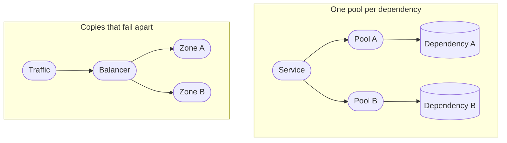
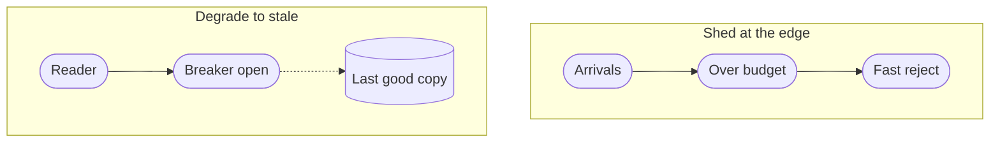
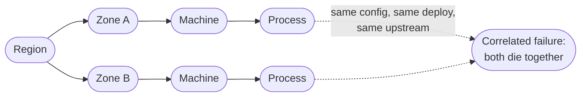

<!-- _class: title silent spectrum -->

# The Reliability Kit

`Chapter 9 of 13 · Part four`

Failure is the environment, not the exception. Redundancy only helps when the copies can fail apart.

---

<!-- _class: agenda progress-5 -->

## Thirteen chapters, gathered into six groups.

1. A Tuesday — one engineer, wake to sleep
2. The words — naming what you just watched
3. Protagonist and antagonist — where a design starts
4. Solution types — which answer is wanted
5. Six kits — data, compute, network, scale, reliability, security
6. Two designs, then the map back — Instagram, a parking app, and what you keep

---

<!-- _class: content -->

`Where this sits`

## Scale asked for admission control. This is where it lives.

Chapter eight’s third invariant asked you to shed load before the system collapses — a reliability pattern doing scale’s work. The two kits differ in the question they ask: chapter eight asks what happens when there is more of everything, this one asks what happens when one part of it stops. It assumes the four scaling moves and the tail latency from chapter eight.

---

<!-- _class: divider -->

`Reliability`

## Failure is the environment, not the exception.

---

<!-- _class: diagram compact -->

`Reliability kit · walls`

## Two of the four patterns put a wall between what failed and what has not.

> A wall only works if the two sides do not share the thing that broke.

*The scale kit's third invariant asked for admission control — shed load before the system collapses. That is a reliability pattern doing scale's work, and it is on the next slide. The two kits differ in the question: scale asks what happens when there is more of everything, reliability asks what happens when one part of it stops.*

---

<!-- _class: diagram compact -->

`Reliability kit · worse answers`

## The other two answer anyway, rather than make the caller wait.

> Stale is an answer and refused is an answer. Timing out is neither.

---

<!-- _class: diagram compact -->

`Reliability kit · failure domains`

## Redundancy only helps when the copies can fail apart.

> Two copies of one mistake are still one copy.

---

<!-- _class: list-steps -->

`Reliability kit · containment`

## A slow dependency takes the whole building unless something bounds the wait.

1. Timeout
   - Bound the wait, so a slow callee cannot hold your resources.
2. Retry with backoff
   - Recover from a blip, with a budget and jitter. Retries without them are a reinforcing loop.
3. Circuit breaker
   - Stop calling something that is clearly down, and let it recover.
4. Bulkhead
   - Give each dependency its own pool, so one queue cannot drain them all.

---

<!-- _class: list-tabular def -->

`Reliability kit · the objectives`

## Four words people use interchangeably decide whether you may ship this week.

1. SLI
   - The measurement: the share of requests served under 300 milliseconds.
2. SLO
   - Your internal target for it, such as 99.9 percent over 28 days.
3. SLA
   - The external promise, with money attached, and always looser than the SLO.
4. Budget
   - What the objective lets you spend. Exhausted, feature work stops.

---

<!-- _class: list-tabular metric -->

`Reliability kit · the nines`

## An availability target is a budget that shrinks fast.

1. 99 percent
   - 3.65 days per year
2. 99.9 percent
   - 8.8 hours per year
3. 99.99 percent
   - 53 minutes per year
4. 99.999 percent
   - 5.3 minutes per year

---

<!-- _class: content -->

`Reading that table`

## Past three nines the humans stop being fast enough.

Fifty-three minutes a year is about one incident with a page, a login, a look at a dashboard and a decision. So four nines does not mean a faster on-call engineer. It means automatic failover and automatic rollback, because a person is no longer in the loop.

Each nine roughly multiplies the cost. Pick the number the business actually needs, and write down what you are choosing not to buy.

---

<!-- _class: cards-grid three -->

`Reliability kit · observability`

## Each signal answers a different question, and none of them replaces another.

- Metrics
  - Cheap, aggregate, always on. They tell you that something is wrong.
- Logs
  - Detailed, expensive, one event at a time. They tell you what happened in one case.
- Traces
  - One request across every service. They tell you where the time actually went.

> If you cannot answer "which dependency is slow" inside a minute, you have metrics, not observability.

---

<!-- _class: split-panel proof cat-5 -->
<!-- _header: "" -->

`Reliability kit · degradation`

## A well-designed system gets worse in an order somebody chose.

Under pressure something has to give. Either you decided in advance which features degrade, or the system decides at random and drops the one that takes money.

- The rule
  - Every feature has a stated tier, and the lowest tier fails first by design.
- Read paths outlive write paths
  - Serving something slightly stale beats serving an error page, for almost every product.
- The fallback is exercised
  - An untested degraded mode is untested code running in your worst hour.

---

<!-- _class: list-criteria -->

`Reliability kit · the invariants`

## Production earns trust one of these at a time.

1. Every dependency has a defined failure behavior
   - Written down: degrade, queue, or fail fast. Three teams found out at 09:05 that nobody had.
2. Redundant copies fail independently
   - Different zones, different deploys, different upstreams. Otherwise it is one copy.
3. Recovery is practiced
   - Restores, failovers and rollbacks happen on a schedule, not for the first time at 3am.
4. The system tells you before a user does
   - Alerts fire on the indicator, never on the complaint.

---

<!-- _class: content -->

`Your turn`

## Three dependencies go slow rather than down. Say what the page does.

Your service renders a product page inside a 300-millisecond budget, calling a price service, a recommendations service and a reviews service in parallel. Each in turn starts answering in two seconds instead of forty milliseconds.

For each, say what the page shows and which containment pattern makes it do that. Then turn the page.

---

<!-- _class: list-tabular -->

`One answer`

## Only one of the three is allowed to fail the page.

1. Price
   - Fail it. A product page with no price is wrong, not degraded, so it is the top tier: a timeout, then a fast error rather than a spinner.
2. Recommendations
   - Drop the strip and render. A breaker opens after the first few slow calls, so every other page does not pay two seconds to learn the same thing.
3. Reviews
   - Serve the last good copy from behind a breaker of its own. Read paths outlive write paths, and stale is an answer where a timeout is not.

---

<!-- _class: closing silent spectrum -->

## Copies only help when they fail apart.

`Chapter 9 of 13 · How to Think About Systems`

Chapter ten asks the same question about credentials, and it starts from a harder assumption than this one: the boundary is already crossed.
