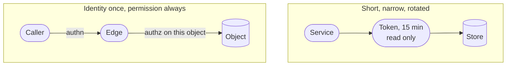
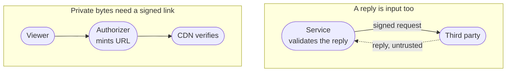
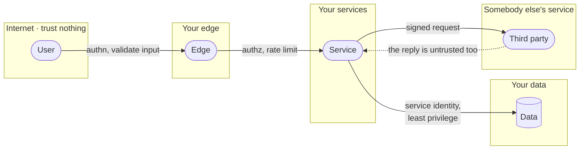

<!-- _class: title silent spectrum -->

# The Security Kit

`Chapter 10 of 13 · Part four`

Assume the boundary is already crossed. Least privilege is measured by what one stolen credential can reach.

---

<!-- _class: agenda progress-5 -->

## Thirteen chapters, gathered into six groups.

1. A Tuesday — one engineer, wake to sleep
2. The words — naming what you just watched
3. Protagonist and antagonist — where a design starts
4. Solution types — which answer is wanted
5. Six kits — data, compute, network, scale, reliability, security
6. Two designs, then the map back — Instagram, a parking app, and what you keep

---

<!-- _class: content -->

`Where this sits`

## Chapter nine asked if copies fail apart. Now ask about keys.

Redundancy only helps when failures are independent, and the same question about credentials is this chapter: what one stolen key can reach. It assumes the boundary from chapter two and the dependency and quota practices from the kits before it. Six questions find the holes before somebody else does, and the chapter closes the shelf with a full discover-then-design pass on a registration spike.

---

<!-- _class: divider -->

`Security`

## Assume the boundary is already crossed.

---

<!-- _class: diagram compact -->

`Security kit · inside`

## Two of the four defenses limit what a caller may do once it is already inside.



> Neither one asks whether the caller is honest. Both are written as if the caller is lying.

*The reliability kit asked whether your copies fail apart. This kit asks the same question about credentials: when one is stolen, does the damage stop somewhere, or does it reach everything the service can reach? A blast radius is a blast radius, whether the cause is a dead zone or a leaked token.*

---

<!-- _class: diagram compact -->

`Security kit · outside`

## The last two cover both directions in which data leaves your control.



> Sign what leaves, distrust what comes back: neither runs on a machine you own.

---

<!-- _class: diagram compact -->

`Security kit · trust boundaries`

## Every arrow that crosses a trust boundary needs a check on the far side.



> The check belongs on the far side of the line, never the near side.

---

<!-- _class: compare-prose -->

`Security kit · the pair`

## Authentication asks who you are. Authorization asks what you may touch.

- Authentication
  - Establishes identity once, at the edge, and hands down a claim anyone downstream can verify. Getting it wrong lets the wrong person in.
- Authorization
  - Decides, on every single request, whether this identity may touch this specific object. Getting it wrong lets the right person read somebody else's data.

---

<!-- _class: split-panel proof cat-6 -->
<!-- _header: "" -->

`Security kit · least privilege`

## Least privilege is measured by what one stolen credential can reach.

Assume any single credential eventually leaks. The design question is not whether that happens; it is how far the person holding it can travel, and for how long.

- The check
  - You can say in one sentence what each service account could reach if stolen.
- Scope it and expire it
  - Narrow permissions, short lifetimes and automatic rotation beat a careful human.
- Separate read from write
  - Most services need one or the other. Almost none needs to delete.

---

<!-- _class: list-tabular def -->

`Security kit · encryption`

## Encryption has three states, and a fourth thing that outranks all of them.

1. Transit
   - TLS everywhere, including between your own services. Networks are untrusted.
2. Rest
   - Disk and backup encryption. Stops a stolen device, not a stolen credential.
3. Use
   - Decrypted in memory to be processed. The hardest state, and the one attacked.
4. Keys
   - A managed store or an HSM, rotated on a schedule, never in the repository.

---

<!-- _class: checklist -->

`Security kit · threat modeling`

## Six questions find the holes before somebody else does.

- [ ] Can someone pretend to be another identity? `spoofing`
- [ ] Can data be changed in transit or at rest? `tampering`
- [ ] Can an actor deny having done something? `repudiation`
- [ ] Can private data reach the wrong reader? `disclosure`
- [ ] Can one caller exhaust a shared resource? `denial`
- [ ] Can a caller gain rights nobody granted? `elevation`

---

<!-- _class: content -->

`Security kit · your dependencies`

## Most of the code you ship, you did not write and have not read.

Maya's Tuesday stopped when a package registry went down. That same registry is also the shortest path into her build: whoever can publish a version she installs can run their code on her machine, and then inside her deploy.

Pin exact versions and commit the lock file, so the build you tested is the build that ships. Keep an inventory of what you actually depend on, including everything your dependencies pulled in behind you. Take updates on a schedule you chose rather than the moment they appear, and read the diff of anything that touches a credential, a network call, or a build step.

---

<!-- _class: cards-stack -->

`Security kit · quotas`

## An authorized caller can still take the whole system down.

- Reach for it when
  - Anything is shared: a database, a queue, a paid third party, an image decoder.
- Walk away when
  - The caller is a trusted internal batch you would rather see fail loudly than throttled.
- The constraint you inherit
  - A limit needs an identity to count against. Use the account, the key and the address.

---

<!-- _class: list-criteria -->

`Security kit · the invariants`

## Sign your name to a design only when you can say all five.

1. Every request is authorized against the specific object
   - Not the endpoint. Object-level checks are where the breaches happen.
2. Secrets never enter the repository or a log line
   - They live in a managed store, are injected at runtime, and they rotate.
3. All input is untrusted, including from your own services
   - A compromised internal caller is the ordinary case. Design for it.
4. Every privileged action is attributable
   - An immutable record of who, what, when, and from where.
5. Every dependency is pinned, inventoried and rate-limited
   - You did not write most of your code, and an authorized caller can still exhaust you.

---

<!-- _class: content -->

`Your turn`

## Run those six questions on one arrow: the presigned upload URL.

A client asks your API for a URL, then writes bytes straight into your object store with it. Nobody on your side sees those bytes until they have landed.

Name three of the six that land on that one arrow, and the limit that stops each. Then turn the page.

---

<!-- _class: list-tabular -->

`One answer`

## Three of the six land on that arrow, and one grant answers all three.

1. Tampering
   - The client picks its own key and writes over somebody else's photo. The grant names the exact key.
2. Denial
   - One account fills your storage at your expense. The grant carries a size ceiling and a rate per account.
3. Elevation
   - Chosen bytes reach an image decoder that never expected them. The grant names one content type and expires in minutes.

---

<!-- _class: content -->

`Your turn · discover`

## Registration opens at nine. Discover the system before you design any of it.

Twelve thousand students, every one of them refreshing at 08:59. Six thousand courses, most with a hard seat limit. A seat handed to two people is something a human has to unpick, by hand, with an apology.

Write four lines: the protagonist, the antagonist, one invariant that must never break, and the number that describes the antagonist. Then turn the page.

---

<!-- _class: code -->

`One answer · discover`

## Four lines, and the last two decide the design.

```text
Protagonist  A student at 08:59, one course short of a full timetable.
Antagonist   Twelve thousand people arriving in the same second.
Invariant    A seat is held by one student or by nobody. Never two.
The number   ~12,000 requests in the first second, then near zero all term.
```

The invariant wants one writer and a transaction. The number wants everything spread wide. Those two pulling against each other is the design.

---

<!-- _class: content -->

`Your turn · design`

## Now design it, on the same four lines.

You have the six kits and everything in them. Name the rung this is asking for, two entries you would reach for and what each one holds up, and one box you would take out on paper.

Do not draw an architecture. Four lines again, then turn the page.

---

<!-- _class: list-tabular -->

`One answer · design`

## The invariant picks the store. The spike picks what goes in front.

1. The rung
   - Scaled. The load is known and the invariant is not negotiable.
2. Relational, and the condition goes inside the write
   - Decrement `WHERE seats_left > 0`, then check how many rows changed. Read the count first and decide in your code, and two requests both see the last seat.
3. A bounded queue in front of it
   - Admitted in order, each told their place. The store never sees twelve thousand at once.
4. What you would remove
   - The queue, once registration closes. It earns its place one hour a year.

---

<!-- _class: content -->

`What you now hold`

## Sixteen entries, six sets of invariants, and one thing worth admitting.

You will not reach for most of these. The bigger design ahead spends six of them, and the smaller one spends five. That is what a kit is: what you own, not what you use.

The entries are concepts, not products, so they outlast the names. What you carry out of here is the sentence you can now say when you did not reach for something.

---

<!-- _class: closing silent spectrum -->

## The shelf is full.

`Chapter 10 of 13 · How to Think About Systems`

Sixteen entries and six sets of invariants. Chapters eleven and twelve spend them — the first designs a product at the top of the ladder, the second starts at the bottom and climbs.
